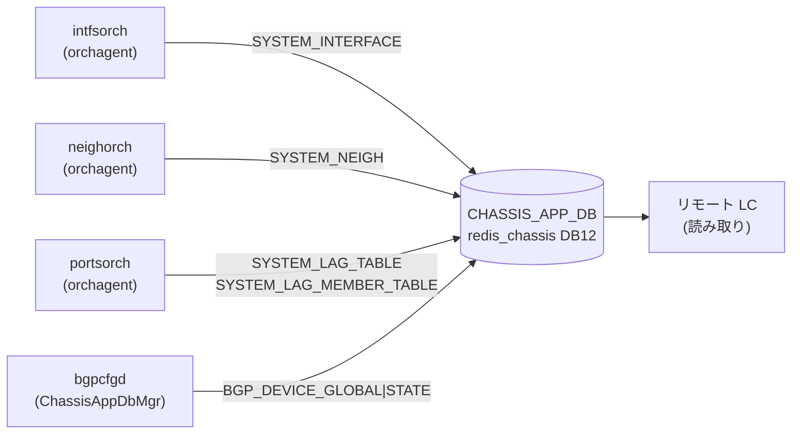

# CHASSIS_APP_DB テーブル群

## 概要

`CHASSIS_APP_DB` は VoQ (Virtual Output Queue) チャシスシステム専用の [Redis](../../reference/glossary.md#term-redis) DB（DB id=12、instance=`redis_chassis`）。チャシス内の全ラインカードが**中央スーパーバイザーの `redis_chassis`** を共有し、ラインカード間でシステムポート・インタフェース・ネイバー・[LAG](../../reference/glossary.md#term-lag) の情報を同期するために使用する[^1]。

非 VoQ 環境（`DEVICE_METADATA.localhost.switch_type != "voq"`）では `isChassisDbInUse()` が false を返し、これらのテーブルへの書き込みはすべてスキップされる。

### データフロー (自動生成)



<!-- defaults -->
## 暗黙デフォルト・コード由来挙動 (Phase A)

> 調査対象: `sonic-swss/orchagent/intfsorch.cpp`, `neighorch.cpp`, `portsorch.cpp`, `lagids.lua`, `sonic-buildimage/src/sonic-bgpcfgd/bgpcfgd/managers_chassis_app_db.py`, `managers_device_global.py`
> 調査日: 2026-05-14

### SYSTEM_INTERFACE テーブル

| フィールド | [YANG](../../reference/glossary.md#term-yang) default | 実装上の暗黙デフォルト / fallback | 備考 |
|-----------|-------------|----------------------------------|------|
| `oper_status` | なし ([YANG](../../reference/glossary.md#term-yang) 定義外) | `port.m_oper_status == SAI_PORT_OPER_STATUS_UP ? "up" : "down"` で決定 | `intfsorch.cpp:1708`。[SAI](../../reference/glossary.md#term-sai) 初期化前またはリモートポートの場合は書き込み自体をスキップ |

**書き込み条件**:
- `isChassisDbInUse()` が true
- ローカルポートのインタフェース ADD 時 (`voqSyncAddIntf()`)
- 非ローカルポート（`SAI_SYSTEM_PORT_TYPE_REMOTE`）はスキップ (`intfsorch.cpp:1689`)
- [LAG](../../reference/glossary.md#term-lag) の場合は `m_system_lag_info.switch_id == gVoqMySwitchId` のみ書き込み

### SYSTEM_NEIGH テーブル

| フィールド | [YANG](../../reference/glossary.md#term-yang) default | 実装上の暗黙デフォルト / fallback | 備考 |
|-----------|-------------|----------------------------------|------|
| `encap_index` | なし | [SAI](../../reference/glossary.md#term-sai) `get_neighbor_entry_attribute(SAI_NEIGHBOR_ENTRY_ATTR_ENCAP_INDEX)` の返り値 | `neighorch.cpp:2595-2606`。`0` の場合は無効値としてエントリ全体の書き込みをスキップ (`neighorch.cpp:2608-2612`) |
| `neigh` | なし | ネイバーの MAC アドレス (`mac.to_string()`) | `neighorch.cpp:2650`。`encap_index == 0` の場合は書き込まれない |

### SYSTEM_LAG_TABLE テーブル

| フィールド | YANG default | 実装上の暗黙デフォルト / fallback | 備考 |
|-----------|-------------|----------------------------------|------|
| `lag_id` | なし | `LagIdAllocator::lagIdAdd()` が `SYSTEM_LAG_ID_TABLE` + `SYSTEM_LAG_IDS_FREE_LIST` Lua スクリプトで払い出す値 | `portsorch.cpp:11155`。フリーリストが空の場合 `LAG_ID_ALLOCATOR_ERROR_TABLE_FULL (-1)` を返しエラー |
| `switch_id` | なし | `gVoqMySwitchId` (ローカルスイッチの VoQ ID) | `portsorch.cpp:11158`。ローカル [LAG](../../reference/glossary.md#term-lag) のみ書き込み |

**書き込み条件**:
- `gMultiAsicVoq` が true かつ `switch_id == gVoqMySwitchId` のローカル LAG のみ (`portsorch.cpp:11145-11149`)

### SYSTEM_LAG_MEMBER_TABLE テーブル

| フィールド | YANG default | 実装上の暗黙デフォルト / fallback | 備考 |
|-----------|-------------|----------------------------------|------|
| `status` | なし | LAG メンバー追加時に caller が渡すステータス文字列 | `portsorch.cpp:11188`。値は LAG メンバーの oper 状態変化時に再書き込みで上書きされる |

### BGP_DEVICE_GLOBAL|STATE テーブル

| フィールド | YANG default | 実装上の暗黙デフォルト / fallback | 備考 |
|-----------|-------------|----------------------------------|------|
| `tsa_enabled` | なし | キー不在時または例外時は `"false"` | `managers_device_global.py:239`。`device_info.is_chassis()` が `False` の場合も即座に `"false"` を返す (`managers_device_global.py:241-242`) |

**ChassisAppDbMgr の動作**:
- `lc_tsa == "false"` のときのみ `isolate_unisolate_device(data["tsa_enabled"])` を呼び出す。LC 側の TSA 状態がスーパーバイザー TSA より優先される (`managers_chassis_app_db.py:41-44`)

### LAG ID 管理用 Redis 生 KEY

`CHASSIS_APP_DB` には標準テーブル形式でない [Redis](../../reference/glossary.md#term-redis) key が直接書き込まれる:

| [Redis](../../reference/glossary.md#term-redis) Key | 型 | 役割 | コード根拠 |
|-----------|-----|------|-----------|
| `SYSTEM_LAG_ID_START` | string | LAG ID 割り当て範囲下限（初期化スクリプトが書き込む） | `lagids.lua:15` |
| `SYSTEM_LAG_ID_END` | string | LAG ID 割り当て範囲上限（初期化スクリプトが書き込む） | `lagids.lua:16` |
| `SYSTEM_LAG_ID_TABLE` | hash | `pcname → lag_id` マッピング | `lagids.lua:22,45,78,90` |
| `SYSTEM_LAG_ID_SET` | set | 現在割り当て済み lag_id セット（重複防止） | `lagids.lua:43,46,68` |
| `SYSTEM_LAG_IDS_FREE_LIST` | list | 未割り当て lag_id フリーリスト | `lagids.lua:41,44,60,63` |

`SYSTEM_LAG_ID_START` / `SYSTEM_LAG_ID_END` の実際の値はプラットフォーム設定による（テスト環境では `1`/`2`）。

<!-- /defaults -->

<!-- ordering -->
## 書込み順依存 (Phase B)

> 調査証跡: `meta/_intermediate/cdb-flow/chassis-app-ordering.md`

### 起動シーケンスと先行条件

CHASSIS_APP_DB への書き込みはすべて `gMultiAsicVoq == true`（＝`isChassisDbInUse()` が true）が前提。このフラグは [orchagent](../../reference/glossary.md#term-orchagent) 起動時に `DEVICE_METADATA.localhost.switch_type == "voq"` かつ `isChassisAppDbPresent()` の両方が成立した場合にのみ立つ (`main.cpp:727`)。接続失敗時は standalone [VOQ](../../reference/glossary.md#term-voq) モードとなり書き込みは行われない。

```
CONFIG_DB.DEVICE_METADATA (switch_type=voq)
  → isChassisAppDbPresent() == true
    → gMultiAsicVoq = true
    → chassis_app_db = DBConnector("CHASSIS_APP_DB", 0, true)  [main.cpp:730]
      ↓
OrchDaemon::init():
  PortsOrch(chassisAppDb)   # SYSTEM_LAG_TABLE / SYSTEM_LAG_MEMBER_TABLE テーブル登録 [orchdaemon.cpp:232]
  IntfsOrch(chassisAppDb)   # SYSTEM_INTERFACE テーブル登録 [orchdaemon.cpp:296]
  NeighOrch(chassisAppDb)   # SYSTEM_NEIGH テーブル登録    [orchdaemon.cpp:298]
```

### SET 時の先行必須条件

| テーブル | 先行必須条件 | ブロック時の挙動 | コード根拠 |
|---------|------------|----------------|-----------|
| `SYSTEM_INTERFACE` | `PortInitDone` 受信済み (`addSystemPorts()` 完了) かつ port が `m_portList` に登録済み | `gPortsOrch->getPort()` 失敗 → `SWSS_LOG_ERROR` のみでスキップ（リトライなし） | `intfsorch.cpp:1676-1681` |
| `SYSTEM_INTERFACE` | ポートがローカルシステムポート (`SAI_SYSTEM_PORT_TYPE_REMOTE` でない) | リモートポートはスキップ（無エラー）| `intfsorch.cpp:1689-1692` |
| `SYSTEM_LAG_TABLE` | `gMultiAsicVoq == true` かつ LAG の `switch_id == gVoqMySwitchId` | ローカル LAG でなければスキップ | `portsorch.cpp:11145-11148` |
| `SYSTEM_LAG_TABLE` | `SYSTEM_LAG_ID_START` / `SYSTEM_LAG_ID_END` が chassis_app_db に書き込み済み（初期化スクリプトが担保） | フリーリスト空 → `LAG_ID_ALLOCATOR_ERROR_TABLE_FULL (-1)` でエラー | `lagids.lua:15-16, portsorch.cpp:11155` |
| `SYSTEM_LAG_MEMBER_TABLE` | 対応する LAG が `SYSTEM_LAG_TABLE` に登録済み (`voqSyncAddLag` 完了後) | LAG の `switch_id` 不一致でスキップ | `portsorch.cpp:11183-11186` |
| `SYSTEM_NEIGH` | [RIF](../../reference/glossary.md#term-rif) が存在 (`IntfsOrch::addIntf()` 完了) かつ [SAI](../../reference/glossary.md#term-sai) `encap_index != 0` | `encap_index == 0` → エントリ書き込みをスキップ（無エラー） | `neighorch.cpp:2608-2612` |
| `BGP_DEVICE_GLOBAL\|STATE` | [bgpcfgd](../../reference/glossary.md#term-bgpcfgd) が supervisor の CHASSIS_APP_DB を購読中 かつ LC 側 `tsa_enabled == "false"` | lc_tsa != "false" の場合は `isolate_unisolate_device()` を呼ばず上書きしない | `managers_chassis_app_db.py:40-44` |

### PortInitDone ゲートの詳細

PortsOrch は `PortInitDone` メッセージを受け取るまでポートリストを確定させない:

```
portsyncd → APP_DB:"PORT|PortConfigDone" (count=N)
  → APP_DB:"PORT|PortInitDone"
    → PortsOrch::doTask(): addSystemPorts()  # APPL_DB.APP_SYSTEM_PORT_TABLE から登録
    → m_initDone = true → allPortsReady() = true
      ↓
IntfsOrch::addIntf() → voqSyncAddIntf() で SYSTEM_INTERFACE を書き込み可能になる
```

`voqSyncAddIntf()` 内で `gPortsOrch->getPort()` が失敗した場合はログのみで書き込みをスキップする（`task_need_retry` ではなく静的スキップ）。`PortInitDone` 前にインタフェース追加イベントが到達しても SYSTEM_INTERFACE への書き込みは行われない点に注意。

### warm-reboot での挙動

CHASSIS_APP_DB (redis_chassis) は supervisor 側で保持されるため、**ラインカード [orchagent](../../reference/glossary.md#term-orchagent) の warm-reboot 中も既存エントリは残存する**。[orchagent](../../reference/glossary.md#term-orchagent) は `warmRestoreAndSyncUp()` 内で 3 回ループ `doTask()` を実行し、bake() で読み込んだ既存 APP_DB データを再処理して SET を冪等に上書きする (`orchdaemon.cpp:1099-1139`)。

```
WarmStart::isWarmStart() == true
  → PortsOrch::bake(): APP_DB "PORT|PortConfigDone" + "PORT|PortInitDone" の存在確認
    → 存在すれば warm-reboot モード (既存ポートを m_pendingPortSet に投入)
    → 存在しなければ コールドスタートに fallback (cleanPortTable)
  → 3回 doTask() ループ:
    - 1st: SwitchOrch / PortsOrch (port 初期化・hostif 作成)
    - 2nd: port 設定 (speed/mtu/fec) + IntfsOrch / NeighOrch
    - 3rd: 残余データドレイン
  → onWarmBootEnd():
    - m_isWarmRestoreStage = false
    - refreshPortStatus() → voqSyncIntfState() で SYSTEM_INTERFACE.oper_status を再書き込み
```

`m_isWarmRestoreStage == true` の期間は `postPortInit()` がスキップされる (`portsorch.cpp:4076`)。`onWarmBootEnd()` 後に oper_status が更新されるため、**warm-reboot 直後は SYSTEM_INTERFACE の oper_status が一時的に古い値を持つ可能性がある**。

### chassisd クリーンアップとの関係

ラインカードが down しても supervisor の `chassisd` は `CHASSIS_DB_CLEANUP_MODULE_DOWN_PERIOD = 30` 分待機してからエントリを削除する (`chassisd:90,676`)。warm-reboot は通常 30 分以内に完了するため、**warm-reboot の場合はクリーンアップが実行されず既存エントリが保護される**。

### DEL 時の順序制約

`voqSyncDelIntf()` / `voqSyncDelLag()` / `voqSyncDelLagMember()` はいずれも参照先の存在チェックなしに `del()` を実行する。CHASSIS_APP_DB への DEL は依存関係なしで任意のタイミングで発行可能。ただし `SYSTEM_LAG_TABLE` エントリを DEL すると対応する LAG ID が `SYSTEM_LAG_IDS_FREE_LIST` に戻り再利用される点に注意。

<!-- /ordering -->

<!-- cross-refs -->
## 暗黙参照テーブル (Phase C)

> 調査証跡: `meta/_intermediate/cdb-flow/chassis-app-cross-refs.md`

CHASSIS_APP_DB 各テーブルへの書き込みが依存する他テーブル・DB の参照関係を示す。

| # | 依存方向 | 参照元 | 参照先テーブル | 依存内容 | 証跡 |
|---|----------|--------|--------------|---------|------|
| 1 | [CONFIG_DB](../../reference/glossary.md#term-config_db) → CHASSIS_APP_DB (全体ゲート) | `DEVICE_METADATA.localhost.switch_type` | CHASSIS_APP_DB 全テーブル | `switch_type != "voq"` または `/etc/sonic/database_config.json` に `CHASSIS_APP_DB` 不在時は書き込み一切なし | `main.cpp:694-730` |
| 2 | [CONFIG_DB](../../reference/glossary.md#term-config_db) → SYSTEM_LAG_TABLE | `DEVICE_METADATA.localhost.switch_id` | `SYSTEM_LAG_TABLE.switch_id` 値 | ローカル LAG か否かの判定 (`gVoqMySwitchId`) に使用。起動時一度のみ読み取り | `main.cpp:305-313`, `portsorch.cpp:11141-11148` |
| 3 | [APPL_DB](../../reference/glossary.md#term-appl_db) → CHASSIS_APP_DB (書き込みトリガ) | `APP_SYSTEM_PORT_TABLE` (PortInitDone 後) | `SYSTEM_INTERFACE` | ポートリスト (`m_portList`) 未完成時は `gPortsOrch->getPort()` 失敗 → 書き込みスキップ | `portsorch.cpp:10864-10870`, `intfsorch.cpp:1676-1681` |
| 4 | [CONFIG_DB](../../reference/glossary.md#term-config_db) → CHASSIS_APP_DB (初期化スクリプト経由) | `SYSTEM_PORT` (暗黙的) | `SYSTEM_LAG_ID_START` / `SYSTEM_LAG_ID_END` | LAG ID 割り当て範囲の初期化。未初期化時は `lagIdAdd()` が `LAG_ID_ALLOCATOR_ERROR_TABLE_FULL (-1)` を返し addLag 失敗 | `lagids.lua:15-16`, `portsorch.cpp:7974-7983` |
| 5 | CONFIG_DB → CHASSIS_APP_DB (適用ガード) | `BGP_DEVICE_GLOBAL.tsa_enabled` (LC 側) | `BGP_DEVICE_GLOBAL\|STATE` | LC 側 TSA が `"true"` の場合、supervisor からの `tsa_enabled` 変更を `isolate_unisolate_device()` に渡さずブロック | `managers_chassis_app_db.py:40-44` |
| 6 | CHASSIS_APP_DB 内 (LAG → LAG_MEMBER) | `SYSTEM_LAG_TABLE` | `SYSTEM_LAG_MEMBER_TABLE` | LAG が `voqSyncAddLag()` 完了前は `switch_id` 未設定 → `voqSyncAddLagMember()` がスキップ | `portsorch.cpp:11179-11193` |
| 7 | CHASSIS_STATE_DB → CHASSIS_APP_DB (DEL トリガ) | `CHASSIS_MODULE_TABLE` (oper_status 変化) | CHASSIS_APP_DB 全テーブル | モジュール down 検知から 30 分後に `_cleanup_chassis_app_db()` が Lua スクリプトでパターン削除 | `chassisd:593-658,89-90` |

### 依存 #1 の詳細 (switch_type ゲート)

起動時に `getCfgSwitchType()` が `DEVICE_METADATA.localhost.switch_type` を読み取り `gMySwitchType` を決定する。`gMySwitchType == "voq"` かつ `isChassisAppDbPresent()` (= `/etc/sonic/database_config.json` に `CHASSIS_APP_DB` キーが存在) の両方が成立した場合のみ `gMultiAsicVoq = true` となり CHASSIS_APP_DB への接続が確立される (`main.cpp:725-730`)。いずれかが欠如した場合、`gMultiAsicVoq` は false のままとなりすべての `voqSync*()` 関数は即時 return する（エラーログなし）。

### 依存 #5 の詳細 (LC TSA ガード)

`ChassisAppDbMgr` は初期化時に `CONFIG_DB.BGP_DEVICE_GLOBAL.tsa_enabled` を `subscribe()` で監視し `self.lc_tsa` を更新する (`managers_chassis_app_db.py:20`)。supervisor が `CHASSIS_APP_DB.BGP_DEVICE_GLOBAL|STATE` を SET すると `set_handler()` が呼ばれるが、`self.lc_tsa != "false"` の場合は `isolate_unisolate_device()` を呼び出さない。これにより **LC 側の TSA 状態が supervisor の TSA より優先** される。LC 側が TSA 中 (`tsa_enabled = "true"`) の間はスーパーバイザーからの unisolate 指示を無視する (`managers_chassis_app_db.py:41-44`)。

<!-- /cross-refs -->

<!-- failure -->
## 失敗挙動 (Phase D)

> 調査証跡: `meta/_intermediate/cdb-flow/chassis-app-failure.md`

### CHASSIS_APP_DB 非使用環境での全スキップ (silent)

`gMultiAsicVoq == false` の場合（`DEVICE_METADATA.localhost.switch_type != "voq"` または `database_config.json` に `CHASSIS_APP_DB` キーが不在）、すべての `voqSync*()` 関数は即時 `return` する。エラーログなし。

| voqSync* 関数 | 影響テーブル | 結果 |
|---|---|---|
| `voqSyncAddIntf` / `voqSyncDelIntf` | `SYSTEM_INTERFACE` | 書き込み全スキップ |
| `voqSyncAddNeigh` / `voqSyncDelNeigh` | `SYSTEM_NEIGH` | 書き込み全スキップ |
| `voqSyncAddLag` / `voqSyncDelLag` | `SYSTEM_LAG_TABLE` | 書き込み全スキップ |
| `voqSyncAddLagMember` / `voqSyncDelLagMember` | `SYSTEM_LAG_MEMBER_TABLE` | 書き込み全スキップ |

Evidence: `main.cpp:725-730`, `intfsorch.cpp:1673-1675`

### SYSTEM_INTERFACE: getPort() 失敗 — リトライなし

`voqSyncAddIntf()` 内で `gPortsOrch->getPort(alias, port)` が失敗した場合（PortInitDone 受信前にインタフェース追加イベントが到達した場合）、エラーログを出力して即 `return`。`task_need_retry` を返さないため**永続的に書き込まれない**。

```
SWSS_LOG_ERROR("Port does not exist for %s!", alias.c_str())  // intfsorch.cpp:1679
```

Evidence: `intfsorch.cpp:1676-1681`

### SYSTEM_NEIGH: encap_index == 0 / SAI 失敗 — リトライなし

`voqSyncAddNeigh()` で SAI `get_neighbor_entry_attribute(SAI_NEIGHBOR_ENTRY_ATTR_ENCAP_INDEX)` が失敗した場合、またはその返り値が `0`（無効値）の場合、エラーログを出力して `return`。リトライなし。

| 条件 | ログ | Evidence |
|------|------|----------|
| SAI API 失敗 | `SWSS_LOG_ERROR("Failed to get neighbor attribute for %s on %s, rv:%d", ...)` | `neighorch.cpp:2600-2604` |
| `encap_index == 0` | `SWSS_LOG_ERROR("Invalid neighbor encap_index for %s on %s", ...)` | `neighorch.cpp:2610-2611` |

### SYSTEM_LAG_TABLE: LAG ID 枯渇 — addLag 中断

`lagids.lua` の Lua スクリプトが `SYSTEM_LAG_IDS_FREE_LIST` の枯渇を検出すると `-1`（`LAG_ID_ALLOCATOR_ERROR_TABLE_FULL`）を返す。`portsorch.cpp:7981` でエラーログを出力し LAG 作成が中断、SYSTEM_LAG_TABLE への書き込みは行われない。

```
SWSS_LOG_ERROR("Failed to allocate unique LAG id for local lag %s rv:%d", lag_alias.c_str(), spa_id)
```

`SYSTEM_LAG_ID_START` / `SYSTEM_LAG_ID_END` が未初期化（`redis get` が nil）の場合、Lua の `tonumber(nil)` が `nil` を返し数値比較で Lua エラーが発生し、LAG ID 割り当てが全件失敗する。Evidence: `lagids.lua:15-16,60-62`, `portsorch.cpp:7977-7981`

### BGP_DEVICE_GLOBAL|STATE: data None / キー不在 — False 返却

| 条件 | 結果 | ログ |
|------|------|------|
| `data is None` | `set_handler` が `False` を返す（[bgpcfgd](../../reference/glossary.md#term-bgpcfgd) が再試行）| `log_err("ChassisAppDbMgr:: data is None")` |
| `"tsa_enabled"` キーが `data` に不在 | `set_handler` が `False` を返す | なし |
| CHASSIS_APP_DB 接続失敗 (`get_chassis_tsa_status`) | fallback `"false"` を返す | `log_err("Got an exception {}")` |

Evidence: `managers_chassis_app_db.py:36-46`, `managers_device_global.py:244-249`

### silent skip（設計上の正常動作）

以下の条件では書き込みがスキップされるが、エラーログは出力されない（設計通りの動作）:

- リモートシステムポート (`SAI_SYSTEM_PORT_TYPE_REMOTE`) に対する `voqSyncAddIntf()` — `intfsorch.cpp:1689-1692`
- LAG ポートで `m_system_lag_info.switch_id != gVoqMySwitchId` に対する `voqSyncAddNeigh()` — `neighorch.cpp:2624-2627`
- ローカル LAG でない (`switch_id != gVoqMySwitchId`) LAG への `voqSyncAddLag()` — `portsorch.cpp:11145-11148`

デバッグ時に書き込みがスキップされていても、エラーログなしで silent になる点に注意。

<!-- /failure -->

<!-- constants -->
## コード定数・魔法数値 (Phase E)

> 調査証跡: `meta/_intermediate/cdb-flow/chassis-app-constants.md`
> 調査対象: `sonic-swss-common/common/schema.h` @ 158de8d3463ff4b841653f6d57190bb142b80d9c, `sonic-swss-common/common/database_config.json` @ 158de8d3463ff4b841653f6d57190bb142b80d9c, `sonic-swss/orchagent/lagid.h` @ 4305596, `sonic-swss/orchagent/lagids.lua` @ 4305596, `sonic-platform-daemons/sonic-chassisd/scripts/chassisd` @ 4ba9612, `sonic-buildimage/src/sonic-bgpcfgd/bgpcfgd/managers_device_global.py` @ 9ea932ec2e18f35e58268ec2e4456b1d4afd65cd

### DB ID / Redis インスタンス定数

| 定数 / 設定値 | 値 | 定義箇所 |
|-------------|----|---------| 
| `CHASSIS_APP_DB` (#define) | `12` | `schema.h:25` |
| `CHASSIS_STATE_DB` (#define) | `13` | `schema.h:26` |
| redis_chassis ホスト | `redis_chassis.server` | `database_config.json` |
| redis_chassis ポート | `6380` | `database_config.json` |
| redis_chassis Unix ソケット | `/var/run/redis/redis_chassis.sock` | `database_config.json` |
| CHASSIS_APP_DB キー区切り文字 | `\|` (pipe) | `database_config.json` |

### テーブル名文字列定数 (schema.h:411-414)

| #define | 文字列値 |
|---------|---------|
| `CHASSIS_APP_SYSTEM_INTERFACE_TABLE_NAME` | `"SYSTEM_INTERFACE"` |
| `CHASSIS_APP_SYSTEM_NEIGH_TABLE_NAME` | `"SYSTEM_NEIGH"` |
| `CHASSIS_APP_LAG_TABLE_NAME` | `"SYSTEM_LAG_TABLE"` |
| `CHASSIS_APP_LAG_MEMBER_TABLE_NAME` | `"SYSTEM_LAG_MEMBER_TABLE"` |

### LAG ID アロケータエラーコード (lagid.h:12-16)

| #define | 値 | 意味 |
|---------|----|------|
| `LAG_ID_ALLOCATOR_ERROR_DELETE_ENTRY_NOT_FOUND` | `0` | 削除対象エントリが存在しない（no-op として処理、エラーログなし） |
| `LAG_ID_ALLOCATOR_ERROR_TABLE_FULL` | `-1` | フリーリスト枯渇でこれ以上 LAG ID を払い出せない |
| `LAG_ID_ALLOCATOR_ERROR_GET_ENTRY_NOT_FOUND` | `-2` | `SYSTEM_LAG_ID_TABLE` にエントリが存在しない |
| `LAG_ID_ALLOCATOR_ERROR_INVALID_OP` | `-3` | Lua スクリプトへの操作コードが不正 |
| `LAG_ID_ALLOCATOR_ERROR_DB_ERROR` | `-4` | Redis Lua スクリプト実行がエラーを返した |

> `DELETE_ENTRY_NOT_FOUND = 0` は「正常 no-op」を示す慣習的な 0 値であり、削除失敗を意味しない[^3]。

### LAG ID 範囲キー (`lagids.lua:15-16`)

`SYSTEM_LAG_ID_START` / `SYSTEM_LAG_ID_END` は string 型 Redis キーとして CHASSIS_APP_DB に書き込まれ、Lua スクリプトが `tonumber()` で読み取る。値はプラットフォーム固有の初期化スクリプトが設定する（テスト環境での実例: start=`1`, end=`2`）。

### chassisd 動作定数 (chassisd)

| 定数名 | 値 | 意味 |
|-------|----|------|
| `CHASSIS_DB_CLEANUP_MODULE_DOWN_PERIOD` | `30` 分 | ラインカード down 後、CHASSIS_APP_DB エントリをクリーンアップするまでの待機時間 |
| `CHASSIS_INFO_UPDATE_PERIOD_SECS` | `10` 秒 | chassisd メインループ周期 |
| `SELECT_TIMEOUT` | `1000` ms | swsscommon `sel.select()` タイムアウト |
| `DEFAULT_LINECARD_REBOOT_TIMEOUT` | `180` 秒 | ラインカードリブート最大待機 |
| `DEFAULT_DPU_REBOOT_TIMEOUT` | `360` 秒 | [DPU](../../reference/glossary.md#term-dpu) リブート最大待機 |
| `CHASSIS_LOAD_ERROR` | `1` | chassis プラグインロード失敗時の exit code |
| `CHASSIS_NOT_SUPPORTED` | `2` | chassis API 未サポート時の exit code |

### BGP_DEVICE_GLOBAL フィールドのデフォルト値 (`managers_device_global.py:12-14`)

| クラス定数 | 値 | 対応フィールド |
|-----------|----|-----------| 
| `TSA_DEFAULTS` | `"false"` | `tsa_enabled` |
| `WCMP_DEFAULTS` | `"false"` | `wcmp_enabled` |
| `IDF_DEFAULTS` | `"unisolated"` | `idf_isolation_state` |

フィールドが存在しない場合のみ `DeviceGlobalCfgMgr.__init__()` が `directory.put()` で書き込む（`managers_device_global.py:42-49`）。

<!-- /constants -->

<!-- side-effects -->
## 書き込み副作用 (Phase F)

> 調査証跡: `meta/_intermediate/cdb-flow/chassis-app-side-effects.md`
> 調査対象: `sonic-swss/orchagent/intfsorch.cpp` @ 4305596, `sonic-swss/orchagent/neighorch.cpp` @ 4305596, `sonic-swss/orchagent/portsorch.cpp` @ 4305596, `sonic-buildimage/src/sonic-bgpcfgd/bgpcfgd/managers_chassis_app_db.py` @ 9ea932ec2e18f35e58268ec2e4456b1d4afd65cd

CHASSIS_APP_DB への書き込みは単なるデータ保存ではない。リモートラインカード側の orchagent および [bgpcfgd](../../reference/glossary.md#term-bgpcfgd) が各テーブルを `SubscriberStateTable` で購読しており、SAI プログラミング・[STATE_DB](../../reference/glossary.md#term-state_db) 更新・[FRR](../../reference/glossary.md#term-frr) 設定変更などの連鎖処理が発生する。

### SYSTEM_INTERFACE — 副作用

**書き込み元 (ローカル LC)**: `intfsorch.cpp` の `voqSyncAddIntf()` / `voqSyncDelIntf()` / `voqSyncIntfState()`

**購読側 (リモート LC)**: `IntfsOrch` が `SubscriberStateTable(chassisAppDb, SYSTEM_INTERFACE)` を登録 (`intfsorch.cpp:106`)

- SET イベント受信時、`isRemoteSystemPortIntf(alias)` が true のエントリのみ処理 (`intfsorch.cpp:881-892`)
- `oper_status` 変化に応じて `gNeighOrch->ifChangeInformRemoteNextHop(alias, isUp)` を呼出し、リモートポートを nexthop とする経路の到達可否を更新する
- ポートが DOWN になると、そのシステムポートへの nexthop が無効化され、routeorch がルートを再評価する

### SYSTEM_NEIGH — 副作用

**書き込み元 (ローカル LC)**: `voqSyncAddNeigh()` / `voqSyncDelNeigh()` (`neighorch.cpp:2654,2688`)

**購読側 (リモート LC)**: `NeighOrch` が `SubscriberStateTable(chassisAppDb, SYSTEM_NEIGH)` を登録 (`neighorch.cpp:55`)。`doVoqSystemNeighTask()` で処理。

SET イベント受信時の副作用チェーン:

1. Inband ポートが UP であることを確認 (非 [VLAN](../../reference/glossary.md#term-vlan) タイプでは admin/oper 両方が UP 必須)
2. SAI に remote neighbor を追加 (`addNeighbor()`)
3. 成功時、**[STATE_DB](../../reference/glossary.md#term-state_db) の `SYSTEM_NEIGH` テーブル**に `neigh` (MAC) を書き込む (`neighorch.cpp:2223`)
4. [STATE_DB](../../reference/glossary.md#term-state_db) 書き込みをトリガに `neighbor-manager` がカーネルの neighbor / host-route を追加

DEL イベント受信時: SAI からのneighbor削除 → STATE_DB エントリ削除 → カーネルエントリ削除  
`encap_index` 変更時: SAI 上の neighbor を一度削除してから STATE_DB も削除し、再追加する 2 ステップ処理 (`neighorch.cpp:2173`)

### SYSTEM_LAG_TABLE — 副作用

**書き込み元 (ローカル LC)**: `voqSyncAddLag()` / `voqSyncDelLag()` (`portsorch.cpp:11139,11166`)

**購読側 (リモート LC)**: `PortsOrch` が `SubscriberStateTable(chassisAppDb, SYSTEM_LAG_TABLE)` を登録 (`portsorch.cpp:1086`)

- `switch_id == gVoqMySwitchId` のエントリはローカル LC 自身が書いたものとしてスキップ
- リモート LC のエントリは `addLag(alias, lag_id, switch_id)` で SAI に system LAG を作成 (`portsorch.cpp:6116-6140`)
- 作成後、`operation_status` / `mtu` / `tpid` / `learn_mode` が存在すれば SAI 属性設定が連鎖する

### SYSTEM_LAG_MEMBER_TABLE — 副作用

**書き込み元 (ローカル LC)**: `voqSyncAddLagMember()` / `voqSyncDelLagMember()` (`portsorch.cpp:11179,11195`)

**購読側 (リモート LC)**: `PortsOrch` が `SubscriberStateTable(chassisAppDb, SYSTEM_LAG_MEMBER_TABLE)` を登録 (`portsorch.cpp:1091`)

- `switch_id` 不一致チェック後、対応リモート LAG にシステムポートをメンバーとして追加し `status` 属性を SAI に設定 (`portsorch.cpp:6297-6355`)

### BGP_DEVICE_GLOBAL|STATE — 副作用

**書き込み元 (スーパーバイザー bgpcfgd)**: `managers_device_global.py` が CONFIG_DB の `BGP_DEVICE_GLOBAL.tsa_enabled` 変化を受けて書き込む

**購読側 (ラインカード bgpcfgd)**: `ChassisAppDbMgr` (`managers_chassis_app_db.py`) が CHASSIS_APP_DB の変化を受信

- `lc_tsa == "false"` のときのみ `DeviceGlobalCfgMgr.isolate_unisolate_device(data["tsa_enabled"])` を呼出し (`managers_chassis_app_db.py:41-44`)
- `isolate_unisolate_device()` は出力 route-map を Jinja2 テンプレートで生成し [FRR](../../reference/glossary.md#term-frr) ([vtysh](../../reference/glossary.md#term-vtysh)) に push する — これにより全 [BGP](../../reference/glossary.md#term-bgp) 出力ルートが TSA (unreachable 相当) または TSB (通常) に切り替わる
- `lc_tsa == "true"` の場合はスーパーバイザーの指示を無視（LC 側 TSA が優先）

### 副作用マトリクス

| テーブル書き込み | 直接の副作用 | 連鎖先 |
|----------------|-------------|--------|
| `SYSTEM_INTERFACE` SET (oper_status) | リモート LC の nexthop 到達性更新 (`ifChangeInformRemoteNextHop`) | routeorch のルート再評価 |
| `SYSTEM_NEIGH` SET | リモート LC: SAI neighbor 追加 → STATE_DB `SYSTEM_NEIGH` 書き込み | neighbor-manager がカーネル neighbor/host-route を追加 |
| `SYSTEM_NEIGH` DEL | リモート LC: SAI neighbor 削除 → STATE_DB エントリ削除 | neighbor-manager がカーネルエントリを削除 |
| `SYSTEM_LAG_TABLE` SET | リモート LC: SAI system LAG 作成・属性設定 | LAG メンバー追加待ち |
| `SYSTEM_LAG_TABLE` DEL | リモート LC: SAI system LAG 削除 | — |
| `SYSTEM_LAG_MEMBER_TABLE` SET | リモート LC: SAI LAG メンバー追加・status 設定 | — |
| `SYSTEM_LAG_MEMBER_TABLE` DEL | リモート LC: SAI LAG メンバー削除 | — |
| `BGP_DEVICE_GLOBAL\|STATE` SET (tsa_enabled) | LC bgpcfgd: [FRR](../../reference/glossary.md#term-frr) に TSA/TSB route-map を push | [BGP](../../reference/glossary.md#term-bgp) アドバタイズメント全体が切替 |

<!-- /side-effects -->

<!-- pubsub -->
## Pub/Sub・通知チャネル (Phase G)

> 調査証跡: `meta/_intermediate/cdb-flow/chassis-app-pubsub.md`
> 調査対象: `sonic-swss/orchagent/intfsorch.cpp` @ 4305596, `sonic-swss/orchagent/neighorch.cpp` @ 4305596, `sonic-swss/orchagent/portsorch.cpp` @ 4305596, `sonic-swss-common/common/subscriberstatetable.cpp` @ 158de8d3463ff4b841653f6d57190bb142b80d9c, `sonic-buildimage/src/sonic-bgpcfgd/bgpcfgd/runner.py` @ 9ea932ec2e18f35e58268ec2e4456b1d4afd65cd, `sonic-buildimage/src/sonic-bgpcfgd/bgpcfgd/main.py` @ 9ea932ec2e18f35e58268ec2e4456b1d4afd65cd

CHASSIS_APP_DB (DB 12、`redis_chassis`) への書き込みは Redis の **keyspace 通知**を通じてリモートラインカード側のプロセスに伝達される。swsscommon の `SubscriberStateTable` が `psubscribe` を用いてパターン購読し、orchagent の `Orch::addExecutor(Consumer(...))` フレームワークに組み込まれる。

### SubscriberStateTable の keyspace 購読パターン

`subscriberstatetable.cpp:20-24` で以下のパターンが構築・登録される:

```
__keyspace@<dbId>__:<tableName><sep>*
```

CHASSIS_APP_DB (dbId=12、sep=`|`) の場合:

| テーブル | keyspace パターン |
|---------|----------------|
| `SYSTEM_INTERFACE` | `__keyspace@12__:SYSTEM_INTERFACE|*` |
| `SYSTEM_NEIGH` | `__keyspace@12__:SYSTEM_NEIGH|*` |
| `SYSTEM_LAG_TABLE` | `__keyspace@12__:SYSTEM_LAG_TABLE|*` |
| `SYSTEM_LAG_MEMBER_TABLE` | `__keyspace@12__:SYSTEM_LAG_MEMBER_TABLE|*` |
| `BGP_DEVICE_GLOBAL` | `__keyspace@12__:BGP_DEVICE_GLOBAL|*` |

### Consumer 登録一覧（orchagent 側）

登録条件: `isChassisDbInUse()` が `true` の VoQ チャシス環境のみ。

| テーブル | 購読プロセス | 登録箇所 | バッチサイズ | 優先度 |
|---------|------------|---------|------------|--------|
| `SYSTEM_INTERFACE` | `IntfsOrch` (リモート LC orchagent) | `intfsorch.cpp:104-106` | 128 (DEFAULT_POP_BATCH_SIZE) | 0 |
| `SYSTEM_NEIGH` | `NeighOrch` (リモート LC orchagent) | `neighorch.cpp:54-55` | 128 | 0 |
| `SYSTEM_LAG_TABLE` | `PortsOrch` (リモート LC orchagent) | `portsorch.cpp:1085-1086` | 128 | 0 |
| `SYSTEM_LAG_MEMBER_TABLE` | `PortsOrch` (リモート LC orchagent) | `portsorch.cpp:1090-1091` | 128 | 0 |

### bgpcfgd 側の購読登録

- `main.py:112-113`: `device_info.is_chassis()` が `True` の場合のみ `ChassisAppDbMgr(common_objs, "CHASSIS_APP_DB", "BGP_DEVICE_GLOBAL")` を登録
- `runner.py:42-53`: CHASSIS_APP_DB への接続は `swsscommon.DBConnector(db_name, 0, True, '')` (TCP 接続モード) で確立し、`SubscriberStateTable(conn, "BGP_DEVICE_GLOBAL")` を `selector.addSelectable()` に追加
- イベントを受信すると `ChassisAppDbMgr.handler()` → `set_handler()` / `del_handler()` が呼び出される

### bgpcfgd 内部 pub/sub（directory 経由）

`ChassisAppDbMgr` は Redis 通知とは独立に、bgpcfgd 内部の directory オブジェクト経由でも LC 側 TSA 状態を監視する:

```python
# managers_chassis_app_db.py:20
self.directory.subscribe(
    [("CONFIG_DB", CFG_BGP_DEVICE_GLOBAL_TABLE_NAME, "tsa_enabled")],
    self.on_lc_tsa_status_change
)
```

`on_lc_tsa_status_change()` は LC ローカルの CONFIG_DB `BGP_DEVICE_GLOBAL.tsa_enabled` 変化時に呼び出され、`self.lc_tsa` をキャッシュする。`set_handler()` がスーパーバイザーの指示を受けたとき、`lc_tsa == "false"` の場合のみ FRR への設定変更を実行する (`managers_chassis_app_db.py:41-44`)。

### chassisd の購読スコープ

chassisd は CHASSIS_APP_DB を `SubscriberStateTable` で購読しない。CONFIG_DB の `CHASSIS_MODULE` テーブルのみを購読し、モジュール admin_state の変化に応じて電源制御を行う (`chassisd:1147`)。CHASSIS_APP_DB へのアクセスは cleanup 処理時に Lua スクリプト (`EVALSHA`) を直接実行する形式のみ。

### 配信保証と注意点

- Redis keyspace 通知は **at-most-once** 配信: 購読側がタイムアウト中に複数の書き込みが発生しても、ポップ時には最終状態のみが参照される
- orchagent の `Consumer::pops()` はバッチ (`popBatchSize=128`) で複数イベントをまとめて処理し、`Orch::doTask()` が各イベントを順次実行する
- CHASSIS_APP_DB は全ラインカードが同一 `redis_chassis` インスタンスを参照するため、書き込み側と購読側が同一物理 DB を通じて通信する。LC 間の直接 gRPC/RPC は使用されない

<!-- /pubsub -->

<!-- platform -->
## プラットフォーム依存挙動 (Phase H)

> 調査証跡: `meta/_intermediate/cdb-flow/chassis-app-platform.md`
> 調査対象: `sonic-platform-daemons/sonic-chassisd/scripts/chassisd` @ 4ba9612, `sonic-platform-daemons/sonic-chassisd/scripts/chassis_db_init` @ 4ba9612, `sonic-swss/orchagent/main.cpp` @ 4305596, `sonic-swss-common/common/dbconnector.h` @ 158de8d3463ff4b841653f6d57190bb142b80d9c

### プラットフォーム API ロード (sonic_platform プラグイン)

orchagent は `sonic_platform` パッケージを直接呼び出さない。代わりに起動時に `isChassisAppDbPresent()` で `/var/run/redis/sonic-db/database_config.json` を読み取り、`CHASSIS_APP_DB` キーの存在を確認する (`main.cpp:278-287`)。

| 確認内容 | 実装 | 証跡 |
|---------|------|------|
| `CHASSIS_APP_DB` キーが `database_config.json` に存在するか | `isChassisAppDbPresent()` が `db_config["DATABASES"].contains("CHASSIS_APP_DB")` を確認 | `main.cpp:283-287` |
| `database_config.json` のデフォルトパス | `/var/run/redis/sonic-db/database_config.json` | `dbconnector.h:90` |

ファイルが存在しない、または `CHASSIS_APP_DB` キーが不在の場合は `isChassisAppDbPresent()` が `false` を返し `gMultiAsicVoq` は立たない（CHASSIS_APP_DB 未使用として動作）。

chassisd は起動時に `sonic_platform.platform.Platform().get_chassis()` でプラットフォームオブジェクトを取得する。パッケージが存在しない、または例外が発生した場合は `CHASSIS_LOAD_ERROR=1` で即 exit する (`chassisd:143-149`)。

### プラットフォーム種別分岐

| 条件 | 使用クラス | 主な違い |
|-----|-----------|---------|
| `chassis.is_smartswitch() == True` | `SmartSwitchModuleUpdater` | [DPU](../../reference/glossary.md#term-dpu) 向け設定・状態管理、`dpu_reboot_timeout` を `/usr/share/sonic/platform/platform.json` から読み取る |
| `chassis.is_smartswitch() == False` | `ModuleUpdater` | VoQ ラインカード/スーパーバイザー向け、`my_slot` / `supervisor_slot` を `get_my_slot()` / `get_supervisor_slot()` で取得 |

非 [SmartSwitch](../../reference/glossary.md#term-smartswitch) の場合、`my_slot` または `supervisor_slot` が `INVALID_SLOT` のとき `CHASSIS_NOT_SUPPORTED=2` で exit する (`chassisd:1424-1427`)。スーパーバイザーか否かの判定は `my_slot == supervisor_slot` で行い (`chassisd:510-511`)、supervisor のみが `ConfigManagerTask` を起動して CONFIG_DB の `CHASSIS_MODULE` を購読する。

### プラットフォーム設定ファイル

| ファイルパス | 用途 | 読み取りタイミング | デフォルト値 |
|------------|------|----------------|------------|
| `/usr/share/sonic/platform/platform_env.conf` | `linecard_reboot_timeout`（秒）の上書き | `ModuleUpdater.__init__()` 時に一度だけ | `180` 秒 |
| `/usr/share/sonic/platform/platform.json` | `dpu_reboot_timeout`（秒）の上書き ([SmartSwitch](../../reference/glossary.md#term-smartswitch) 用) | `SmartSwitchModuleUpdater.__init__()` 時に一度だけ | `360` 秒 |
| `/var/run/redis/sonic-db/database_config.json` | `CHASSIS_APP_DB` 接続先（host/port/unix-socket）の定義 | orchagent 起動時の `isChassisAppDbPresent()` で読み取り | — |

### midplane スイッチ初期化

chassisd 起動直後に `chassis.init_midplane_switch()` を呼び出す。`NotImplementedError` / `TimeoutError` 時は `try_get` が `false` を返し `midplane_initialized=false` となる。この場合 `check_midplane_reachability()` はスキップされるが chassisd は終了しない（エラーログのみ）。

CHASSIS_APP_DB への書き込み（orchagent 側）はミッドプレーン状態に依存しないが、midplane 未初期化環境ではラインカードが `redis_chassis` に到達できず `gMultiAsicVoq` が立たない場合がある（接続タイムアウト次第）。

### プラットフォーム API と CHASSIS_APP_DB の関係

chassisd は CHASSIS_APP_DB に直接書き込まない。CHASSIS_APP_DB へのアクセスはモジュール down 時の `_cleanup_chassis_app_db()` Lua スクリプト実行のみであり、クリーンアップのトリガはプラットフォーム API `get_oper_status()` が `MODULE_STATUS_OFFLINE` / `MODULE_STATUS_EMPTY` を返したことで決まる。

| プラットフォーム API | 役割 | CHASSIS_APP_DB との関係 |
|-------------------|------|----------------------|
| `get_module(index).get_oper_status()` | モジュール動作状態を取得 | down 検知 → 30 分後に `_cleanup_chassis_app_db()` でパターン削除 |
| `get_module(index).get_name()` | モジュール名（例: `Linecard0`）取得 | クリーンアップ対象キープレフィックスの特定 |
| `get_module(index).get_midplane_ip()` / `is_midplane_reachable()` | ミッドプレーン情報 | CHASSIS_STATE_DB のみ更新。CHASSIS_APP_DB とは無関係 |

### プラットフォーム非対応時の終了コード

| exit code | 定数 | 発生条件 |
|-----------|------|---------|
| `1` | `CHASSIS_LOAD_ERROR` | `sonic_platform.platform.Platform().get_chassis()` が例外を送出 |
| `2` | `CHASSIS_NOT_SUPPORTED` | 非 [SmartSwitch](../../reference/glossary.md#term-smartswitch) 環境で `get_my_slot()` / `get_supervisor_slot()` が `INVALID_SLOT` を返す |

<!-- /platform -->

## キー構造

| テーブル | Redis キー形式 | 例 |
|---------|--------------|-----|
| `SYSTEM_INTERFACE` | `SYSTEM_INTERFACE\|<system_port_alias>` | `SYSTEM_INTERFACE\|Linecard1\|Ethernet0` |
| `SYSTEM_NEIGH` | `SYSTEM_NEIGH\|<system_port_alias>\|<ip_address>` | `SYSTEM_NEIGH\|Linecard1\|Ethernet0\|192.0.2.1` |
| `SYSTEM_LAG_TABLE` | `SYSTEM_LAG_TABLE\|<system_lag_alias>` | `SYSTEM_LAG_TABLE\|Linecard1\|PortChannel1` |
| `SYSTEM_LAG_MEMBER_TABLE` | `SYSTEM_LAG_MEMBER_TABLE\|<lag_alias>:<port_alias>` | `SYSTEM_LAG_MEMBER_TABLE\|Linecard1\|PortChannel1:Linecard1\|Ethernet0` |
| `BGP_DEVICE_GLOBAL\|STATE` | `BGP_DEVICE_GLOBAL\|STATE` | — |

## 適用条件 (使用前提)

1. **VoQ チャシス専用** — `DEVICE_METADATA.localhost.switch_type = "voq"` および `isChassisDbInUse()` が `true` の環境のみ有効
2. **redis_chassis** — 通常の `redis` (DB4 の CONFIG_DB) とは異なる Redis instance (`redis_chassis.server:6380`) 上の DB12 を使用
3. **supervisor から読み取り** — スーパーバイザーが全ラインカードの情報を集約し、ラインカードはリモートポートの情報をこの DB から購読する

## モジュール down 時のクリーンアップ

モジュール（ラインカード）が down した場合、`chassisd` は **30 分待機後** に `_cleanup_chassis_app_db()` を実行し、該当ラインカードに関連する以下のエントリを Lua スクリプトで一括削除する[^2]:

- `SYSTEM_NEIGH*` (パターン一致)
- `SYSTEM_INTERFACE*` (パターン一致)
- `SYSTEM_LAG_MEMBER_TABLE*` (パターン一致)
- `SYSTEM_LAG_TABLE*` (host/asic パターン一致)
- `SYSTEM_LAG_ID_TABLE` の対応エントリ + `SYSTEM_LAG_ID_SET` / `SYSTEM_LAG_IDS_FREE_LIST` の再整理

## 引用元

[^1]: `sonic-swss-common/common/schema.h:411-414` @ 158de8d3463ff4b841653f6d57190bb142b80d9c — テーブル名定数 `CHASSIS_APP_SYSTEM_INTERFACE_TABLE_NAME`, `CHASSIS_APP_SYSTEM_NEIGH_TABLE_NAME`, `CHASSIS_APP_LAG_TABLE_NAME`, `CHASSIS_APP_LAG_MEMBER_TABLE_NAME`
[^2]: `sonic-platform-daemons/sonic-chassisd/scripts/chassisd:593-658` @ 4ba9612 — `_cleanup_chassis_app_db()` の実装
[^3]: `sonic-swss/orchagent/lagid.h:12` @ 4305596 — `LAG_ID_ALLOCATOR_ERROR_DELETE_ENTRY_NOT_FOUND = 0` の定義。`lagIdDel()` が 0 を返しても削除失敗ではなくエントリ不在の no-op を意味する

<!-- glossary-links-injected: 39b236fc23b0 -->
