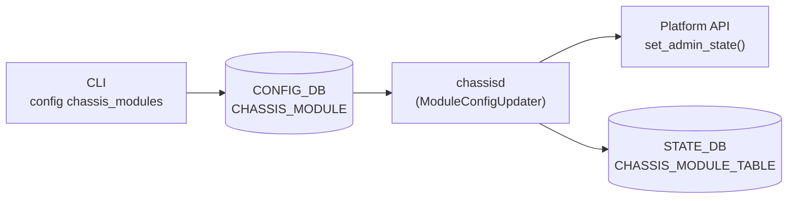

# CHASSIS_MODULE テーブル

## 概要

`CHASSIS_MODULE` テーブルは [CONFIG_DB](../../reference/glossary.md#term-config_db) に保持され、モジュラーチャシス（VOQ 構成）および SmartSwitch におけるラインカード・ファブリックカード・DPU の**管理状態**を格納する[^1]。`chassisd` デーモンがテーブルを監視し、platform API 経由でモジュールの電源・稼働状態を制御する。

<!-- cdb-mermaid -->
### データフロー (自動生成)



!!! note "凡例"
    CONFIG_DB から Platform API までの経路を示す。STATE_DB への書き込みは chassisd が poll ベース (10 秒間隔) で実施。
<!-- /cdb-mermaid -->

## key 構造

```text
CHASSIS_MODULE|<module_name>
```

`<module_name>` の形式:
- `LINE-CARD0`, `LINE-CARD1`, … (ラインカード)
- `FABRIC-CARD0`, `FABRIC-CARD1`, … (ファブリックカード)
- `DPU0`, `DPU1`, … (SmartSwitch の DPU)

!!! warning "YANG-実装 discrepancy"
    YANG スキーマ (`sonic-chassis-module.yang`) の key パターンは `LINE-CARD[0-9]+|FABRIC-CARD[0-9]+|DPU[0-9]+` のみを許可するが、CLI 実装 (`config/chassis_modules.py:148,189`) は `SUPERVISOR` prefix も受け付ける。`SUPERVISOR-CARD0` 等のエントリは YANG バリデーションを通過しないが、実装上は設定・読み取り可能。

## フィールド

| フィールド | 型 | 範囲 | デフォルト | 説明 |
|-----------|----|------|-----------|------|
| `admin_status` | `admin_status` (up/down) | — | `up` (YANG) | モジュールの管理状態。`up` = 稼働許可、`down` = 管理停止 |

## 暗黙デフォルト・コード由来挙動

<!-- defaults -->
### admin_status のプラットフォーム依存 fallback

`admin_status` の YANG default は `up` だが、エントリが存在しない場合の実行時 fallback は**プラットフォームにより分岐**する。

#### 標準チャシス (非 SmartSwitch)

```python
# config/chassis_modules.py:57-66
def get_config_module_state(db, chassis_module_name):
    fvs = config_db.get_entry('CHASSIS_MODULE', chassis_module_name)
    if not fvs:
        return 'up'      # エントリ不在 → 'up' (YANG default と一致)
```

- `chassisd` の `ModuleUpdater.get_module_admin_status()` も同様にエントリ不在時 `'up'` を返す (chassisd:362)
- `show chassis modules status` も `admin_status = 'up'` として表示

#### SmartSwitch (DPU 搭載機)

```python
# config/chassis_modules.py:60-62
if not fvs:
    if is_smartswitch():
        return 'down'    # エントリ不在 → 'down' ← YANG default 'up' と乖離
```

SmartSwitch では `admin_status` エントリが存在しない DPU は**デフォルト停止**扱い。YANG の `default up` と動作が逆になる。

`SmartSwitchModuleUpdater.get_module_admin_status()` はエントリ不在時に `MODULE_STATUS_EMPTY` = `'Empty'` を返す (chassisd:756)。これは `!= 'down'` 条件 (chassisd:447) を満たすため、実質 up 扱いで ASIC テーブル更新が継続される。

### startup コマンドの silent deletion (書き込み時 vs 実行時 乖離)

非-SmartSwitch の `config chassis_modules startup <name>` はエントリを削除する:

```python
# config/chassis_modules.py:210
config_db.set_entry('CHASSIS_MODULE', chassis_module_name, None)  # エントリ削除
```

"up" 状態を `admin_status: up` の明示値ではなく**エントリ不在**で表現する。一方 SmartSwitch は `{'admin_status': 'up'}` を明示的に書き込む (config:204-207)。

### try_get fallback (Platform API 失敗時)

chassisd が platform API から値を取得できない場合、STATE_DB へ以下を書き込む:

| STATE_DB フィールド | fallback 値 |
|---|---|
| `name` / `desc` / `serial` / `model` / `presence` / `is_replaceable` | `'N/A'` |
| `slot` | `-1` (INVALID_SLOT) |
| `oper_status` | `'Offline'` (MODULE_STATUS_OFFLINE) |
| `asics` リスト | `[]` (空) → ASIC テーブル更新なし |
| `midplane_ip` | `'0.0.0.0'` |
| `midplane_access` | `False` |

`oper_status = 'Offline'` の fallback は `str(ModuleBase.MODULE_STATUS_ONLINE)` との比較 (chassisd:420) で失敗し、当該モジュールの ASIC テーブル更新がスキップされる。

### プラットフォームファイル由来のハードコードデフォルト

| 定数 | デフォルト値 | 上書きファイル | 用途 |
|------|------------|--------------|------|
| `linecard_reboot_timeout` | 180 秒 | `/usr/share/sonic/platform/platform_env.conf` の `linecard_reboot_timeout=<N>` | ミッドプレーン再接続タイムアウト判定 |
| `dpu_reboot_timeout` | 360 秒 | `/usr/share/sonic/platform/platform.json` の `"dpu_reboot_timeout"` | DPU midplane 再接続タイムアウト |
| `MAX_DPU_REBOOT_DURATION` | 800 秒 | ハードコード固定値 (変更不可) | reboot cause の同一 reboot 判定窓 |
| `CHASSIS_DB_CLEANUP_MODULE_DOWN_PERIOD` | 30 分 | ハードコード固定値 | モジュール down 後 chassis app DB クリーンアップ遅延 |

### FABRIC-CARD shutdown の前提条件依存

`config chassis_modules shutdown FABRIC-CARD*` は以下の順序で実行される:
1. `admin_status: down` を CONFIG_DB に書き込み
2. 最大 **10 秒** (`TIMEOUT_SECS=10`) 待機し chassisd の反映を確認
3. タイムアウト後に `fabric_module_set_admin_status()` で ASIC サービス (`swss@<asic>.service`) を強制停止

chassisd が起動していない場合は 10 秒タイムアウト後に強制実行される。

<!-- /defaults -->

<!-- ordering -->
## 書込み順依存 (Phase B)

`chassisd` は CONFIG_DB の `CHASSIS_MODULE` テーブルを購読し platform API に反映する。SmartSwitch と非 SmartSwitch で起動シーケンスと CHASSIS_APP_DB 連携が大きく異なる。

### 検出された順序依存

| # | 依存関係 | 方向 | 緩和策 |
|---|----------|------|--------|
| 1 | `CHASSIS_MODULE\|DPU*` エントリ → chassisd 起動 (SmartSwitch) | **起動前に存在必須** | エントリ不在時は DPU がデフォルト down で起動 |
| 2 | ラインカード down → CHASSIS_APP_DB クリーンアップ | **30 分遅延** | 旧 SYSTEM_NEIGH / SYSTEM_LAG エントリが最大 30 分残存 |
| 3 | supervisor のみ ConfigManagerTask を起動 | アーキテクチャ固定 | ラインカード上 chassisd は CHASSIS_MODULE を subscribe しない |
| 4 | `admin_status` 書き込み → DPU 電源変化 (SmartSwitch) | 非同期スレッド実行 | STATE_DB 反映は最大 10 秒遅延; DPU midplane 復旧タイムアウト 360 秒 |
| 5 | DEL → `MODULE_ADMIN_UP` (非 SmartSwitch) / `MODULE_ADMIN_DOWN` (SmartSwitch) | 即時 | プラットフォームにより逆の意味になる |
| 6 | `admin_status: down` 書き込み → `swss@<asic>.service` 停止 (FABRIC-CARD) | 最大 10 秒待機後に強制実行 | chassisd 未起動時は 10 秒後に強制停止 |

### 主要な制約詳細

**SmartSwitch 起動前エントリ必須 (依存 #1)**: `ChassisdDaemon.run()` は SmartSwitch の場合 `set_initial_dpu_admin_state()` を `SmartSwitchConfigManagerTask` 起動より**前**に実行する。この時点で `CHASSIS_MODULE|DPU*` エントリが CONFIG_DB に存在しない場合、`get_module_admin_status()` が `MODULE_STATUS_EMPTY` を返し、DPU は `MODULE_ADMIN_DOWN` (電源 off) として起動される。`sonic-config-engine` によるテンプレート展開フェーズで事前に書き込むこと（evidence: `chassisd:1364-1405, 1412-1437`）。

**CHASSIS_APP_DB クリーンアップの遅延 (依存 #2)**: モジュールが offline になってから `CHASSIS_DB_CLEANUP_MODULE_DOWN_PERIOD = 30` 分後に CHASSIS_APP_DB (redis_chassis.server:6380, DB index 12) の `SYSTEM_NEIGH`, `SYSTEM_INTERFACE`, `SYSTEM_LAG_MEMBER_TABLE`, `SYSTEM_LAG_TABLE` エントリが削除される。ラインカード再起動シナリオでは旧エントリが約 30 分間 CHASSIS_APP_DB に残るため、`voqutil` 等の参照ツールが古い情報を返す可能性がある（evidence: `chassisd:593-680, 90`）。

**非同期スレッドの注意 (依存 #4)**: SmartSwitch の `SmartSwitchModuleConfigUpdater.module_config_update()` は `set_admin_state_gracefully()` を別スレッドで非同期実行する。CONFIG_DB への `admin_status` 書き込みから実際の DPU 電源変化まで不定の遅延が生じる。STATE_DB の `CHASSIS_MODULE_TABLE.oper_status` 反映は 10 秒ポーリング (`CHASSIS_INFO_UPDATE_PERIOD_SECS=10`) に依存する（evidence: `chassisd:248-256, 89`）。

<!-- /ordering -->

## 制約

- `name` (key) は大文字小文字を厳密に区別する (`LINE-CARD`, `FABRIC-CARD`, `DPU` は大文字必須)
- `admin_status` は `up` または `down` のみ。他の値は YANG バリデーション違反
- SUPERVISOR モジュールはキーとして CONFIG_DB に書き込まれない（chassisd が supervisor 自身の slot を判定し除外）

## 購読者

- `chassisd` (`ModuleConfigUpdater` / `SmartSwitchModuleConfigUpdater`) — CONFIG_DB テーブルチェンジを購読し platform API `set_admin_state()` を呼び出す

<!-- pubsub -->
## 通信メカニズム

### CONFIG_DB Subscribe — `SubscriberStateTable`

`chassisd` は `swsscommon.SubscriberStateTable` で CONFIG_DB の `CHASSIS_MODULE` テーブルをイベント駆動で購読する。

**非 SmartSwitch** (`ConfigManagerTask.task_worker()`):

```python
# chassisd:1141-1171
config_db = daemon_base.db_connect("CONFIG_DB")
sst = swsscommon.SubscriberStateTable(config_db, CHASSIS_CFG_TABLE)  # 'CHASSIS_MODULE'
sel.addSelectable(sst)

(key, op, fvp) = sst.pop()
if op == 'SET':
    admin_state = MODULE_ADMIN_DOWN   # shutdown 書き込み
elif op == 'DEL':
    admin_state = MODULE_ADMIN_UP     # startup = エントリ削除
```

- `op == 'SET'` → `admin_status: down` を意味する（非 SmartSwitch は `fvp` を参照せず op 種別のみ）
- `op == 'DEL'` → エントリ削除 = `startup` 相当、`MODULE_ADMIN_UP` を適用
- `SELECT_TIMEOUT = 1000 ms` — シグナル (SIGTERM) 処理のため短い値

**SmartSwitch** (`SmartSwitchConfigManagerTask.task_worker()`):

```python
# chassisd:1196-1240
(key, op, fvp) = sst.pop()
if op == 'SET':
    admin_status = dict(fvp).get('admin_status')
    admin_state = MODULE_ADMIN_UP if admin_status == 'up' else MODULE_ADMIN_DOWN
elif op == 'DEL':
    admin_state = MODULE_ADMIN_UP
```

SmartSwitch では `fvp` の `admin_status` 値を直接参照して up/down を判定する。

`ConfigManagerTask` は `ProcessTaskBase` を継承し**別プロセス**で動作。メインループ (10 秒 poll) とは分離されている。

### CHASSIS_APP_DB 同期

Supervisor スロット上の chassisd はモジュール down から **30 分** (`CHASSIS_DB_CLEANUP_MODULE_DOWN_PERIOD = 30`) 経過後に CHASSIS_APP_DB をクリーンアップする。

```python
# chassisd:593-660
self.chassis_app_db = daemon_base.db_connect("CHASSIS_APP_DB")
self.chassis_app_db_pipe = swsscommon.RedisPipeline(self.chassis_app_db)
# Lua スクリプトで chassis Redis (redis_chassis.server:6380, DB=12) を直接操作
redis_cmd = ['redis-cli', '-h', 'redis_chassis.server', '-p', '6380', '-n', '12',
             'EVALSHA', self.chassis_app_db_clean_sha, '0', lc, asic]
```

クリーンアップ対象テーブル: `SYSTEM_NEIGH`、`SYSTEM_INTERFACE`、`SYSTEM_LAG_MEMBER_TABLE`、`SYSTEM_LAG_TABLE`、`SYSTEM_LAG_ID_TABLE`、`SYSTEM_LAG_ID_SET`

```
module_db_update() [10 秒 poll]
  → oper_status が Offline に変化 → down_modules に記録
module_down_chassis_db_cleanup()
  → 経過 >= 30 分 → _cleanup_chassis_app_db(module)
```

### systemd 経路 — FABRIC-CARD shutdown

CLI が `config chassis_modules shutdown FABRIC-CARD*` を実行する際、CONFIG_DB への書き込み後 chassisd の反映を最大 10 秒待機し、その後 `systemctl stop swss@<asic>.service` を発行する。

```python
# sonic-utilities/config/chassis_modules.py (TIMEOUT_SECS = 10)
check_config_module_state_with_timeout(db, chassis_module_name, 'down')
fabric_module_set_admin_status(db, chassis_module_name, 'down')
# → subprocess.run(['systemctl', 'stop', f'swss@{asic_id}.service'])
```

chassisd が停止中でもタイムアウト後に強制実行される。

### タイミング特性

| メカニズム | 遅延 | 備考 |
|-----------|------|------|
| CONFIG_DB Subscribe (SubscriberStateTable) | 即時 (event-driven) | SELECT_TIMEOUT=1000 ms の最大待機あり |
| STATE_DB 更新 (module_db_update) | 最大 10 秒 | `CHASSIS_INFO_UPDATE_PERIOD_SECS = 10` |
| CHASSIS_APP_DB クリーンアップ | 30 分後 | `CHASSIS_DB_CLEANUP_MODULE_DOWN_PERIOD = 30` |
| FABRIC-CARD CLI 待機 | 最大 10 秒 | `TIMEOUT_SECS = 10` |
<!-- /pubsub -->

## 関連 CONFIG_DB / YANG / CLI

- 関連 [CONFIG_DB](../../reference/glossary.md#term-config_db): `FABRIC_MONITOR`、`FABRIC_PORT`
- 関連 [YANG](../../reference/glossary.md#term-yang): `sonic-chassis-module`
- 関連 CLI: `config chassis_modules shutdown/startup`、`show chassis modules status`

<!-- ref-triangle:start -->

## 関連リファレンス

- [YANG](../../reference/glossary.md#term-yang): `sonic-chassis-module`
- CLI: `config chassis_modules shutdown <name>` / `config chassis_modules startup <name>`
- CLI: `show chassis modules status`

<!-- ref-triangle:end -->

<!-- cross-refs -->
## 暗黙参照テーブル (Phase C)

`CHASSIS_MODULE` は以下の CONFIG_DB テーブルをコードレベルで暗黙参照する（YANG leafref 非強制）。

| 参照先テーブル | 方向 | 機構 | 条件 |
|---|---|---|---|
| [`PORT`](./port.md) | CHASSIS_MODULE → PORT | `chassisd` の `_get_data_plane_state_common()` が `CONFIG_DB` の `PORT` テーブルを全件列挙し、`APPL_DB.PORT_TABLE.oper_status` とクロスチェック。PORT が空なら全ポート up 扱いになるサイレント挙動 | SmartSwitch の DPU データプレーン状態判定時のみ (chassisd:1268-1273) |
| [`DEVICE_METADATA`](./device-metadata.md) | CHASSIS_MODULE → DEVICE_METADATA | `is_smartswitch()` が `platform.json` の `"DPUS"` キーを検査（DB 直接参照ではなくファイル参照）。`DEVICE_METADATA|localhost|subtype = SmartSwitch` が書き込まれた環境と間接的に連動し、`admin_status` デフォルト fallback (`up` vs `down`) が分岐 | SmartSwitch 環境のみ |
| `SYSTEM_PORT` | — | 直接参照なし。VOQ 構成の `SYSTEM_PORT` は `voqorch` が管理し `CHASSIS_MODULE` との直接依存は不在 | — |

> **Evidence**: `sonic-platform-daemons/sonic-chassisd/scripts/chassisd:1268-1273`; `sonic-utilities/utilities_common/chassis.py:21-22`; `sonic-utilities/config/chassis_modules.py:61`; `sonic-buildimage/src/sonic-py-common/sonic_py_common/device_info.py:671-682`
<!-- /cross-refs -->

## 引用元

[^1]: YANG 定義: `sonic-chassis-module.yang`. <https://github.com/sonic-net/sonic-buildimage/blob/9ea932ec2e18f35e58268ec2e4456b1d4afd65cd/src/sonic-yang-models/yang-models/sonic-chassis-module.yang>

<!-- ops-hint -->
## 運用ヒント

### 典型的な操作

```bash
# モジュール一覧と状態確認
show chassis modules status

# ラインカードを管理停止
config chassis_modules shutdown LINE-CARD0

# ラインカードを管理起動
config chassis_modules startup LINE-CARD0

# DB 直接確認
sonic-db-cli CONFIG_DB hgetall 'CHASSIS_MODULE|LINE-CARD0'
```

### SmartSwitch DPU の注意点

SmartSwitch では DPU のエントリが存在しない場合、`admin_status` は `down` として扱われる（標準チャシスとは逆）。DPU を起動するには明示的に `config chassis_modules startup DPU0` を実行すること。

### よくある誤設定

- `shutdown` 後に `startup` を実行すると非 SmartSwitch ではエントリが削除される（`admin_status: up` の DB エントリが残らない）。`sonic-db-cli CONFIG_DB hgetall 'CHASSIS_MODULE|LINE-CARD0'` が空を返しても正常な up 状態。
- ファブリックカードの shutdown は ASIC サービスも停止するため、本番環境での操作は慎重に行うこと。
<!-- /ops-hint -->

<!-- cdb-exceptions -->
## 例外条件・特殊挙動

| consumer | 条件 | 挙動 |
|---|---|---|
| `config chassis_modules startup` (非 SmartSwitch) | 実行時 | `admin_status: up` を書かずエントリを削除 (`set_entry(..., None)`)。DB に `CHASSIS_MODULE|<name>` キーが存在しない状態が "up" を意味する |
| `chassisd` (SmartSwitchModuleUpdater) | エントリ不在の DPU | `get_module_admin_status()` が `'Empty'` を返す → `!= 'down'` のため ASIC テーブル更新は継続 (chassisd:447) |
| `chassisd` (ModuleUpdater) | platform API が `NotImplementedError` | `try_get()` が fallback を返す (slot=-1, oper_status='Offline', asics=[]) → `Offline` 状態として STATE_DB に書き込まれ ASIC テーブル更新がスキップ |
| show コマンド | CONFIG_DB にエントリなし & 非 SmartSwitch | `admin_status = 'up'` として表示 (show/chassis_modules.py:72-76) |
| show コマンド | CONFIG_DB にエントリなし & SmartSwitch | `admin_status = 'down'` として表示 (show/chassis_modules.py:70-76) |
| FABRIC-CARD shutdown | chassisd 未起動 | 10 秒タイムアウト後に `systemctl stop swss@<asic>.service` を強制実行 |

> **Evidence**: `sonic-platform-daemons` `sonic-chassisd/scripts/chassisd:354-362,447,748-756`; `sonic-utilities` `config/chassis_modules.py:57-66,204-210`; `show/chassis_modules.py:70-76`
<!-- /cdb-exceptions -->


<!-- runtime-trace -->
## 実コンテナ動作トレース

### 段階 1 — Consumer 登録

`chassisd` 起動時に `CONFIG_DB` の `CHASSIS_MODULE` テーブルに対して `SubscriberStateTable` を登録。変更検知時に `ModuleConfigUpdater.module_config_update()` が呼び出される。

### 段階 2 — CFG → Platform API

`module_config_update(key, admin_state)` が `chassis.get_module(index).set_admin_state(admin_state)` を呼び出す。`admin_state` は `MODULE_ADMIN_DOWN=0` または `MODULE_ADMIN_UP=1` の整数値。

SmartSwitch では `set_admin_state_gracefully(admin_state)` が別スレッドで非同期実行される。

### 段階 3 — STATE_DB 更新 (poll ベース)

別スレッドの `ModuleUpdater.module_db_update()` が `CHASSIS_INFO_UPDATE_PERIOD_SECS=10` 秒間隔で STATE_DB の `CHASSIS_MODULE_TABLE` を更新する。

### 段階 4 — タイミングと副作用

**適用タイミング**: CONFIG_DB 変化は即時 (event driven) で platform API に伝達。STATE_DB への反映は最大 10 秒遅延する。

**副作用**: `admin_status: down` はモジュールの物理的な電源制御（platform ベンダー実装依存）を引き起こす場合がある。FABRIC-CARD の場合は追加で `swss@<asic>.service` の停止が伴う。
<!-- /runtime-trace -->

<!-- entry-points -->
## 書き込み入り口 (Direction A)

対象テーブル: `CHASSIS_MODULE`

### CLI
- `config chassis_modules shutdown <module_name>` → `admin_status: down` を書き込み
- `config chassis_modules startup <module_name>` → 非 SmartSwitch: エントリ削除 / SmartSwitch: `admin_status: up` を書き込み
  - ソース: `sonic-utilities/config/chassis_modules.py`

### minigraph / sonic-cfggen
- なし (chassis module 設定はミニグラフ生成対象外)

### REST / gNMI (sonic-mgmt-common)
- gNMI 経由での読み取りは `sonic-gnmi/gnmi_server/chassis_module_test.go` で確認されているが、書き込みパスは実装依存

### db_migrator
- なし

### ビルド時デフォルト (init_cfg / j2 テンプレート)
- なし (デフォルトエントリなし)

### ハードコードデフォルト
- `TIMEOUT_SECS=10` (FABRIC-CARD 操作の同期待機時間)
- `DEFAULT_LINECARD_REBOOT_TIMEOUT=180` 秒
- `DEFAULT_DPU_REBOOT_TIMEOUT=360` 秒
- `MAX_DPU_REBOOT_DURATION=800` 秒
- `CHASSIS_DB_CLEANUP_MODULE_DOWN_PERIOD=30` 分

### ランタイム注入 (デーモン自動書き込み)
- なし (chassisd は CONFIG_DB を読むのみ。STATE_DB への書き込みは行うが CONFIG_DB は書き込まない)
<!-- /entry-points -->

<!-- constants -->
## ハードコード定数

### admin_status enum 値

`admin_status` フィールドが取りうる文字列値は YANG スキーマおよびコードで固定されている。

| 値 | 意味 | 定義箇所 |
|----|------|----------|
| `"up"` | モジュール稼働許可（管理 UP） | `sonic-chassis-module.yang`、chassisd:1219 |
| `"down"` | モジュール管理停止（管理 DOWN） | `sonic-chassis-module.yang`、chassisd:1222 |

chassisd 内部では整数定数に変換して platform API へ渡す:

| 定数 | 値 | 定義箇所 | 対応 admin_status |
|------|----|----------|-------------------|
| `MODULE_ADMIN_DOWN` | `0` | chassisd:103 | `"down"` |
| `MODULE_ADMIN_UP` | `1` | chassisd:104 | `"up"` |

### type enum (module name prefix)

`CHASSIS_MODULE` key は以下の prefix で始まる。chassisd の入力バリデーション (`key.startswith(...)`) で使用される。

| 定数 | 値 | 定義箇所 |
|------|----|----------|
| `ModuleBase.MODULE_TYPE_SUPERVISOR` | `"SUPERVISOR"` | module_base.py:34 |
| `ModuleBase.MODULE_TYPE_LINE` | `"LINE-CARD"` | module_base.py:35 |
| `ModuleBase.MODULE_TYPE_FABRIC` | `"FABRIC-CARD"` | module_base.py:36 |
| `ModuleBase.MODULE_TYPE_DPU` | `"DPU"` | module_base.py:37 |

!!! note "YANG-実装 discrepancy"
    YANG key パターンは `LINE-CARD[0-9]+|FABRIC-CARD[0-9]+|DPU[0-9]+` のみ許可するが、CLI は `SUPERVISOR` prefix も受け付ける。

### タイムアウト・操作定数

| 定数 | 値 | 定義箇所 | 用途 |
|------|----|----------|------|
| `CHASSIS_INFO_UPDATE_PERIOD_SECS` | `10` 秒 | chassisd:89 | STATE_DB 更新間隔（poll ベース）|
| `CHASSIS_DB_CLEANUP_MODULE_DOWN_PERIOD` | `30` 分 | chassisd:90 | モジュール down 後の chassis app DB クリーンアップ遅延 |
| `DEFAULT_LINECARD_REBOOT_TIMEOUT` | `180` 秒 | chassisd:81 | `platform_env.conf` 未設定時のラインカードリブートタイムアウト |
| `DEFAULT_DPU_REBOOT_TIMEOUT` | `360` 秒 | chassisd:82 | `platform.json` 未設定時の DPU ミッドプレーン再接続タイムアウト |
| `MAX_DPU_REBOOT_DURATION` | `800` 秒 | chassisd:83 | DPU reboot cause の同一 reboot 判定窓（変更不可のハードコード固定値）|
| `MODULE_ADMIN_DOWN` | `0` | chassisd:103 | `"down"` を platform API に渡す整数値 |
| `MODULE_ADMIN_UP` | `1` | chassisd:104 | `"up"` を platform API に渡す整数値 |

> **Evidence**: `sonic-platform-daemons` `sonic-chassisd/scripts/chassisd:81-104`; `sonic-platform-common` `sonic_platform_base/module_base.py:34-57`
<!-- /constants -->

<!-- failure -->
## 失敗挙動

ソース: `sonic-net/sonic-platform-daemons/sonic-chassisd/scripts/chassisd`

### カード切断 (offline 遷移)

| 失敗条件 | 検出箇所 | 結果 | ログ出力 |
|---|---|---|---|
| モジュールの `oper_status` が `Online` → 非 `Online` に遷移 | `ModuleUpdater.module_db_update()` L420-434 | `down_modules` dict に登録、ASIC テーブル更新をスキップ (`continue`) | LOG_WARNING "Module {} (Slot {}) went off-line!" |
| `notOnlineModules` リストのモジュールに属する ASIC エントリ | `module_db_update()` L471-478 | `CHASSIS_ASIC_TABLE` から全 ASIC エントリを削除 | なし |
| モジュールが 30 分以上 down のまま | `module_down_chassis_db_cleanup()` L663-664 | chassis app DB エントリをクリーンアップ。失敗時は `log_error` 出力し次周期に継続 | LOG_ERROR "Failed to clean up chassis app db entries for {}" |
| platform API が `NotImplementedError` を返す | `try_get()` L125-141 | fallback: `oper_status='Offline'`, `slot=-1`, `asics=[]`, `midplane_ip='0.0.0.0'` — ASIC テーブル更新スキップ | なし (silent fallback) |
| midplane 初期化失敗 (`init_midplane_switch()` が `False`) | `ModuleUpdater.__init__()` L309-311 | `midplane_initialized=False`、処理は継続するが midplane 依存機能が無効 | LOG_ERROR "Chassisd midplane intialization failed" |
| `get_num_modules()` が 0 を返す | `modules_num_update()` L338-341 | STATE_DB への `chassis_num_cards` 書き込みをスキップ | LOG_ERROR "Chassisd has no modules available" |

### admin_status 不正値

| 失敗条件 | 検出箇所 | 結果 | ログ出力 |
|---|---|---|---|
| `admin_state` が `0`/`1` 以外 (SmartSwitch) | `SmartSwitchModuleConfigUpdater.module_config_update()` L252-253 | `set_admin_state_gracefully()` 未呼び出し・スレッド起動なし (silent drop) | LOG_WARNING "Invalid admin_state value: {}" |
| `key` が `LINE-CARD` / `FABRIC-CARD` / `SUPERVISOR` 以外 (非 SmartSwitch) | `ModuleConfigUpdater.module_config_update()` L192-200 | platform API 呼び出しをスキップして `return` | LOG_ERROR "Incorrect module-name {}. Should start with ..." |
| `key` が `DPU` 始まりでない (SmartSwitch) | `SmartSwitchModuleConfigUpdater.module_config_update()` L236-239 | platform API 呼び出しをスキップして `return` | LOG_ERROR "Incorrect module-name {}. Should start with {}" |
| `get_module_index(key)` が -1 を返す | `module_config_update()` L202-207 / L241-245 | `set_admin_state()` 未呼び出し・`return` | LOG_ERROR "Unable to get module-index for key {} to set admin-state {}" |
| YANG 外の `admin_status` 値 (例: `"enabled"`) が CONFIG_DB に書き込まれた場合 | `get_module_admin_status()` L354-362 | 文字列をそのまま返す。`!= 'down'` 条件を満たし ASIC テーブル更新が継続 (意図せず up 扱い) | なし |

### systemd 起動失敗

| 失敗条件 | 検出箇所 | 結果 | ログ出力 |
|---|---|---|---|
| `sonic_platform.platform.Platform()` のインポート/初期化が例外 | `get_chassis()` L143-149 | `sys.exit(CHASSIS_LOAD_ERROR=1)` — supervisord が自動再起動 | LOG_ERROR "Failed to load chassis due to {}" |
| 非 SmartSwitch で `my_slot` または `supervisor_slot` が -1 | `ChassisD.run()` L1424-1427 | `sys.exit(CHASSIS_NOT_SUPPORTED=2)` — supervisord は再起動しない | LOG_ERROR "Chassisd not supported for this platform" |
| FABRIC-CARD shutdown 時に chassisd が未起動 | `config/chassis_modules.py` `check_config_module_state_with_timeout()` | `TIMEOUT_SECS=10` 秒待機後に `systemctl stop swss@<asic>.service` を強制実行 | なし |

> **Evidence**: `chassisd:125-141,143-149,192-212,235-256,309-311,338-341,420-435,471-478,663-664,1424-1427`; `config/chassis_modules.py:12`
<!-- /failure -->

<!-- ordering -->
## 起動順序依存・CHASSIS_APP_DB 連携

### 1. SmartSwitch: CHASSIS_MODULE エントリは chassisd 起動前に存在必須

`ChassisdDaemon.run()` は `is_smartswitch()` 判定後、`SmartSwitchConfigManagerTask` を起動する**前**に `set_initial_dpu_admin_state()` (chassisd:1432) を呼び出す。この関数は CONFIG_DB の `CHASSIS_MODULE` テーブルをポーリングして各 DPU の初期 admin_status を決定する。

**順序依存**: SmartSwitch 環境では `CHASSIS_MODULE|DPU*` エントリが **chassisd 起動時点で CONFIG_DB に存在しない場合**、`get_module_admin_status()` が `MODULE_STATUS_EMPTY` を返し DPU は `MODULE_ADMIN_DOWN` で起動する (chassisd:1382–1384)。エントリが事前に存在すれば `set_admin_state_gracefully()` は呼ばれない。

- **推奨**: `CHASSIS_MODULE|DPU*` エントリの書き込みは chassisd 起動前（`sonic-config-engine` テンプレート展開フェーズ）に完了させること。
- Evidence: `chassisd:1364–1405, 1412–1437`

### 2. CHASSIS_APP_DB クリーンアップの 30 分遅延

`ModuleUpdater.module_down_chassis_db_cleanup()` はモジュールが offline 遷移してから `CHASSIS_DB_CLEANUP_MODULE_DOWN_PERIOD = 30` 分後に CHASSIS_APP_DB (redis_chassis.server:6380) の関連エントリを削除する (chassisd:593–680)。

クリーンアップ対象: `SYSTEM_NEIGH`, `SYSTEM_INTERFACE`, `SYSTEM_LAG_MEMBER_TABLE`, `SYSTEM_LAG_TABLE` — ラインカード/ファブリックカードに紐づく全 ASIC エントリ。

**影響**: ラインカード down 直後に CHASSIS_APP_DB を参照するコンポーネント（`voqutil` 等）は旧エントリが**最大 30 分間残存**する可能性がある。モジュール再起動シナリオでは再起動から 30 分以内に旧エントリと新エントリが混在し得る。

CHASSIS_APP_DB 接続 (`daemon_base.db_connect("CHASSIS_APP_DB")`) はクリーンアップ実行時点で初めて確立し、それ以前は接続なし。Evidence: `chassisd:593–680, 90`

### 3. Supervisor 専有: ConfigManagerTask は supervisor スロットのみで起動

標準モジュラーチャシスでは `supervisor_slot == my_slot` の場合のみ `ConfigManagerTask` を起動する (chassisd:1435–1437)。ラインカード/ファブリックカード上では `config_manager = None` — `CHASSIS_MODULE` テーブルの subscribe が行われず、platform API への `set_admin_state()` 呼び出しも発生しない。

### 4. CONFIG_DB 書き込み → DPU 電源変化の非同期遅延 (SmartSwitch)

SmartSwitch の `SmartSwitchConfigManagerTask` は `module_config_update()` 内で `set_admin_state_gracefully()` を**別スレッド**で非同期実行する (chassisd:250–256)。CONFIG_DB への `admin_status` 書き込みと実際の DPU 電源変化の間に不定の遅延が生じる。`DEFAULT_DPU_REBOOT_TIMEOUT = 360` 秒以内に midplane が復旧しない場合は警告ログを発出。STATE_DB への `oper_status` 反映は最大 10 秒遅延 (`CHASSIS_INFO_UPDATE_PERIOD_SECS=10`)。Evidence: `chassisd:1165–1172, 248–256, 89`

### 5. DEL イベントの挙動差異 (非 SmartSwitch vs SmartSwitch)

| プラットフォーム | DEL イベント解釈 | platform API 呼び出し |
|-----------------|-----------------|----------------------|
| 非 SmartSwitch | `MODULE_ADMIN_UP` | `set_admin_state(1)` |
| SmartSwitch | `MODULE_ADMIN_DOWN` | `set_admin_state(0)` |

`config chassis_modules startup <name>` (非 SmartSwitch) はエントリを削除 (`set_entry(..., None)`) するため DEL イベントが発火し、chassisd は即時 `set_admin_state(MODULE_ADMIN_UP)` を呼び出す。待機ループなし。Evidence: `chassisd:1165–1172, 1216–1228`

### 起動順序依存サマリ

| # | 依存関係 | 環境 | 影響 |
|---|----------|------|------|
| 1 | `CHASSIS_MODULE|DPU*` エントリ → chassisd 起動 | SmartSwitch | 不在時 DPU がデフォルト down 起動 |
| 2 | ラインカード down → CHASSIS_APP_DB クリーンアップ | 全環境 | 30 分間旧エントリ残存 |
| 3 | ConfigManagerTask は supervisor スロットのみ | 非 SmartSwitch | ラインカード上 chassisd は subscribe なし |
| 4 | admin_status 書き込み → DPU 電源変化 | SmartSwitch | 360 秒タイムアウト; STATE_DB 最大 10 秒遅延 |
| 5 | DEL イベント解釈 | プラットフォーム依存 | 非 SS: up / SS: down |
<!-- /ordering -->

<!-- side-effects -->
## 副次 DB 書込 (Phase F)

`chassisd` は CONFIG_DB の `CHASSIS_MODULE` テーブルを購読し platform API を制御するが、その過程で **STATE_DB・CHASSIS_STATE_DB・CHASSIS_APP_DB・systemd** への副次的な書込と制御が発生する。

### STATE_DB — CHASSIS_MODULE_TABLE への oper_status 書込

```
STATE_DB  CHASSIS_MODULE_TABLE|<module_name>
  フィールド: name, desc, slot, oper_status, num_asics, serial, presence, model, is_replaceable
```

`ModuleUpdater.module_db_update()` (chassisd:364-397) が `CHASSIS_INFO_UPDATE_PERIOD_SECS=10` 秒間隔のポーリングで STATE_DB を更新する。`admin_status: down` のモジュールも含めて全モジュールを更新する（oper_status 書込は admin_status 非依存）。

| 条件 | 書込内容 |
|------|---------|
| 10 秒毎ポーリング (platform API 成功) | platform API 取得値を書き込み |
| platform API 失敗 (`try_get` fallback) | `oper_status='Offline'`, `slot=-1`, その他 `'N/A'` |
| `deinit` 時 | `module_table._del(name)` でエントリ削除 |

### CHASSIS_STATE_DB — CHASSIS_ASIC_INFO_TABLE への書込

```
CHASSIS_STATE_DB  CHASSIS_ASIC_TABLE|asic<N>                    (Supervisor)
CHASSIS_STATE_DB  <module_name>|CHASSIS_ASIC_TABLE|asic<N>      (Linecard)
  フィールド: pci_address, name, asic_id_in_module
```

`module_db_update()` (chassisd:447-457) が `oper_status == 'Online'` かつ `admin_status != 'down'` のモジュール ASIC エントリを書き込む。モジュールが offline になると対応する全 ASIC エントリを削除する (chassisd:470-478)。

SmartSwitch の Supervisor 上では `CHASSIS_FABRIC_ASIC_TABLE` に書き込む。

### STATE_DB — CHASSIS_MIDPLANE_INFO_TABLE への書込

```
STATE_DB  CHASSIS_MIDPLANE_INFO_TABLE|<module_name>
  フィールド: ip, access
```

`ModuleUpdater.midplane_status_update()` (chassisd:530-591) が 10 秒ポーリング毎に midplane IP と到達可否を STATE_DB に書き込む。platform API 失敗時は `ip='0.0.0.0'`, `access=False` を書き込む。

### CHASSIS_APP_DB クリーンアップ（モジュール down から 30 分後）

モジュールが offline になってから `CHASSIS_DB_CLEANUP_MODULE_DOWN_PERIOD=30` 分経過後に、Supervisor 上の `chassisd` が CHASSIS_APP_DB (redis_chassis.server:6380, DB#12) の下記テーブルを削除する (chassisd:593-680):

- `SYSTEM_NEIGH*`、`SYSTEM_INTERFACE*`、`SYSTEM_LAG_MEMBER_TABLE*` — 対象ホスト・ASIC のエントリを削除
- `SYSTEM_LAG_TABLE*` — 対象エントリを削除し、`SYSTEM_LAG_ID_TABLE` と `SYSTEM_LAG_ID_SET` の LAG ID を返却

### systemd サービス制御（FABRIC-CARD 限定）

`config chassis_modules shutdown/startup FABRIC-CARD*` は CONFIG_DB 書込後、最大 `TIMEOUT_SECS=10` 秒待機して chassisd の反映を確認し、タイムアウト後に `fabric_module_set_admin_status()` 経由で systemd を制御する (config/chassis_modules.py:94-131):

| `admin_status` | systemctl 操作 |
|---------------|---------------|
| `down` | `stop swss@<asic>.service` → `CHASSIS_FABRIC_ASIC_TABLE` エントリ削除 → `reset-failed + start` (修復) |
| `up` | `start swss@<asic>.service` |

ASIC リストは `CHASSIS_STATE_DB.CHASSIS_FABRIC_ASIC_TABLE` から取得する。chassisd が未起動の場合は 10 秒タイムアウト後に強制実行される。

> **Evidence**: `sonic-platform-daemons/sonic-chassisd/scripts/chassisd:364-478,530-591,593-680`; `sonic-utilities/config/chassis_modules.py:83-131`; 詳細分析 `meta/_intermediate/cdb-flow/chassis-module-side-effects.md`
<!-- /side-effects -->

<!-- platform -->
## プラットフォーム差異 (Phase H)

`chassisd` はプラットフォーム種別（VOQ チャシス / SmartSwitch DPU 搭載機）およびカード種別（LINE-CARD / FABRIC-CARD / DPU）によって `CHASSIS_MODULE` テーブルの処理クラスと許容 key prefix を切り替える。

### プラットフォーム種別による Updater クラスの分岐

| プラットフォーム | ModuleConfigUpdater クラス | ModuleUpdater クラス | 判定方法 |
|-----------------|--------------------------|---------------------|---------|
| VOQ チャシス（非 SmartSwitch） | `ModuleConfigUpdater` | `ModuleUpdater` | `chassis.is_smartswitch()` が `False` (chassisd:1412-1416) |
| SmartSwitch（DPU 搭載） | `SmartSwitchModuleConfigUpdater` | `SmartSwitchModuleUpdater` | `chassis.is_smartswitch()` が `True` (chassisd:1415-1416) |

### カード種別による key prefix 制約

#### VOQ チャシス (ModuleConfigUpdater)

受け付ける `CHASSIS_MODULE` key prefix（chassisd:193-199）:

```python
# chassisd:192-200  ModuleConfigUpdater.module_config_update()
if not key.startswith(ModuleBase.MODULE_TYPE_SUPERVISOR) and \
   not key.startswith(ModuleBase.MODULE_TYPE_LINE) and \
   not key.startswith(ModuleBase.MODULE_TYPE_FABRIC):
    self.log_error("Incorrect module-name {}. Should start with {} or {} or {}".format(
        key, MODULE_TYPE_SUPERVISOR, MODULE_TYPE_LINE, MODULE_TYPE_FABRIC))
    return
```

| prefix 定数 | 値 | 対象カード |
|-------------|---|-----------|
| `MODULE_TYPE_SUPERVISOR` | `"SUPERVISOR"` | スーパーバイザカード |
| `MODULE_TYPE_LINE` | `"LINE-CARD"` | ラインカード |
| `MODULE_TYPE_FABRIC` | `"FABRIC-CARD"` | ファブリックカード |

YANG スキーマは `SUPERVISOR*` を key として許可しないが、`ModuleConfigUpdater` は `SUPERVISOR` prefix を受け付ける（YANG-実装 discrepancy）。

#### SmartSwitch (SmartSwitchModuleConfigUpdater)

受け付ける key prefix は `DPU` のみ（chassisd:236-239）:

```python
# chassisd:235-239  SmartSwitchModuleConfigUpdater.module_config_update()
if not key.startswith(ModuleBase.MODULE_TYPE_DPU):
    self.log_error("Incorrect module-name {}. Should start with {}".format(
        key, ModuleBase.MODULE_TYPE_DPU))
    return
```

SmartSwitch では `LINE-CARD` / `FABRIC-CARD` / `SUPERVISOR` キーの設定変更は無効（エラーログが出力され処理がスキップされる）。

### カード種別による midplane 監視の分岐 (VOQ チャシスのみ)

`ModuleUpdater.check_midplane_reachability()` は FABRIC-CARD を midplane 監視対象から除外する（chassisd:549）:

```python
# chassisd:547-550
for module in self.chassis.get_all_modules():
    # Skip fabric cards
    if module.get_type() == ModuleBase.MODULE_TYPE_FABRIC:
        continue
```

また、supervisor として動作している場合は自己の slot を除外し、LINE-CARD として動作している場合は supervisor のみを監視対象とする（chassisd:552-559）。SmartSwitch の `SmartSwitchModuleUpdater` はこのロジックを継承しない（独立実装）。

### カード種別による Chassis App DB クリーンアップの分岐

`CHASSIS_DB_CLEANUP_MODULE_DOWN_PERIOD`（30 分）経過後の DB クリーンアップは LINE-CARD に限定される（chassisd:677-680）:

```python
# chassisd:677-681
if module.startswith(ModuleBase.MODULE_TYPE_LINE):
    # Module is down for more than 30 minutes. Do the chassis clean up
    self.log_notice("...")
    self._cleanup_chassis_app_db(module)
```

FABRIC-CARD や SUPERVISOR が down 状態でも Chassis App DB のクリーンアップは実行されない。

### SmartSwitch 固有: DPU_STATE テーブルとの連携

SmartSwitch では `SmartSwitchModuleUpdater` が `chassisStateDB` の `DPU_STATE` テーブルを追加で監視し（chassisd:1482, 1506-1521）、DPU の状態変化を `CHASSIS_MODULE_TABLE` と連動させる。VOQ チャシスの `ModuleUpdater` にはこの仕組みは存在しない。

### SmartSwitch 固有: DPU reboot タイムアウト

`dpu_reboot_timeout` は SmartSwitch プラットフォームにのみ適用される（chassisd:721-731）。VOQ チャシスでは LINE-CARD の `linecard_reboot_timeout`（デフォルト 180 秒）が相当する。

| プラットフォーム | タイムアウト定数 | デフォルト値 | 設定ソース |
|-----------------|----------------|------------|-----------|
| VOQ チャシス | `linecard_reboot_timeout` | 180 秒 | `/usr/share/sonic/platform/platform_env.conf` |
| SmartSwitch | `dpu_reboot_timeout` | 360 秒 | `/usr/share/sonic/platform/platform.json` の `"dpu_reboot_timeout"` |
| SmartSwitch (固定) | `MAX_DPU_REBOOT_DURATION` | 800 秒 | ハードコード（変更不可） |

> **Evidence**: `sonic-platform-daemons/sonic-chassisd/scripts/chassisd:193-239,549-559,677-681,721-731,1412-1416,1482,1506-1521`; `sonic-platform-common/sonic_platform_base/module_base.py:34-37`
<!-- /platform -->

<!-- failure -->
## 失敗挙動マトリクス (Phase D)

ソース: `sonic-net/sonic-platform-daemons/sonic-chassisd/scripts/chassisd`

### カード切断 (offline 遷移) における失敗経路

| 失敗条件 | 検出箇所 | 結果 | ログ出力 | evidence |
|---|---|---|---|---|
| モジュールの `oper_status` が `Online` → 非 `Online` に遷移 | `ModuleUpdater.module_db_update()` L420-434 | `down_modules` dict に登録 (`down_time` / `cleaned=False` / `slot` 記録)、ASIC テーブル更新をスキップ (`continue`) | LOG_WARNING "Module {} (Slot {}) went off-line!" | `chassisd:420-435` |
| `notOnlineModules` リストに入ったモジュールの ASIC エントリ | `module_db_update()` L471-478 | `CHASSIS_ASIC_TABLE` から当該モジュールの全 ASIC エントリを削除 | なし | `chassisd:471-478` |
| モジュールが `CHASSIS_DB_CLEANUP_MODULE_DOWN_PERIOD` (30分) 以上 down のまま | `module_down_chassis_db_cleanup()` | chassis app DB エントリをクリーンアップ。失敗時 `log_error` を出力し次周期に継続 | LOG_ERROR "Failed to clean up chassis app db entries for {}" | `chassisd:663-664` |
| platform API が `NotImplementedError` を返す (`get_oper_status` 等) | `try_get()` L125-141 | fallback 値を返す: `oper_status='Offline'`, `slot=-1`, `asics=[]`, `midplane_ip='0.0.0.0'` — ASIC テーブル更新がスキップ | なし (silent fallback) | `chassisd:125-141,488-496` |
| midplane 初期化失敗 (`init_midplane_switch()` が `False`) | `ModuleUpdater.__init__()` L309-311 | `self.midplane_initialized = False` — 処理は継続するが midplane 依存機能が無効化 | LOG_ERROR "Chassisd midplane intialization failed" | `chassisd:309-311` |
| `get_num_modules()` が 0 を返す | `modules_num_update()` L338-341 | STATE_DB への `chassis_num_cards` 書き込みをスキップ | LOG_ERROR "Chassisd has no modules available" | `chassisd:338-341` |

### admin_status 不正値における失敗経路

| 失敗条件 | 検出箇所 | 結果 | ログ出力 | evidence |
|---|---|---|---|---|
| `admin_state` が `MODULE_ADMIN_DOWN(0)` でも `MODULE_ADMIN_UP(1)` でもない (SmartSwitch) | `SmartSwitchModuleConfigUpdater.module_config_update()` L252-253 | `set_admin_state_gracefully()` を呼ばず、スレッド起動もしない。silent drop | LOG_WARNING "Invalid admin_state value: {}" | `chassisd:252-253` |
| `key` が `LINE-CARD` / `FABRIC-CARD` / `SUPERVISOR` のいずれでもない (非 SmartSwitch) | `ModuleConfigUpdater.module_config_update()` L192-200 | platform API 呼び出しをスキップして `return` | LOG_ERROR "Incorrect module-name {}. Should start with {} or {} or {}" | `chassisd:192-200` |
| `key` が `DPU` で始まらない (SmartSwitch) | `SmartSwitchModuleConfigUpdater.module_config_update()` L236-239 | platform API 呼び出しをスキップして `return` | LOG_ERROR "Incorrect module-name {}. Should start with {}" | `chassisd:236-239` |
| `chassis.get_module_index(key)` が `INVALID_MODULE_INDEX(-1)` を返す | `module_config_update()` L202-207 (非 SS) / L241-245 (SS) | `set_admin_state()` 呼び出しをスキップして `return` | LOG_ERROR "Unable to get module-index for key {} to set admin-state {}" | `chassisd:202-207,241-245` |
| YANG バリデーション外の `admin_status` 値 (例: `"enabled"`) が CONFIG_DB に書き込まれた場合 | `get_module_admin_status()` L354-362 | 文字列をそのまま返す。`module_cfg_status != 'down'` 条件を満たすため ASIC テーブル更新が継続 (意図せず up 扱い) | なし | `chassisd:354-362,447` |

### systemd 起動失敗に関連する挙動

| 失敗条件 | 検出箇所 | 結果 | ログ出力 | evidence |
|---|---|---|---|---|
| chassisd 起動時に `sonic_platform.platform.Platform()` のインポート/初期化が例外 | `get_chassis()` L143-149 | `sys.exit(CHASSIS_LOAD_ERROR=1)` — supervisord が再起動を試みる | LOG_ERROR "Failed to load chassis due to {}" | `chassisd:143-149` |
| 非 SmartSwitch で `my_slot` または `supervisor_slot` が `INVALID_SLOT(-1)` | `ChassisD.run()` L1424-1427 | `sys.exit(CHASSIS_NOT_SUPPORTED=2)` — supervisord は再起動しない | LOG_ERROR "Chassisd not supported for this platform" | `chassisd:1424-1427` |
| FABRIC-CARD shutdown 時に chassisd が起動していない | `config/chassis_modules.py:check_config_module_state_with_timeout()` | 最大 `TIMEOUT_SECS=10` 秒待機後に `systemctl stop swss@<asic>.service` を強制実行 | なし | `config/chassis_modules.py:12` |
| main loop 内で予期しない例外 (SmartSwitch DpuStateManagerTask) | `DpuStateManagerTask.task_worker()` L1400-1401 | `log_error` を出力して継続 (クラッシュしない) | LOG_ERROR "Error in run: {}" | `chassisd:1400-1401` |

> **Evidence**: `sonic-platform-daemons/sonic-chassisd/scripts/chassisd:92-93,125-141,143-149,192-212,235-256,309-311,338-341,420-435,471-478,663-664,1400-1401,1424-1427`; `config/chassis_modules.py:12`; 詳細分析 `meta/_intermediate/cdb-flow/chassis-module-failure.md`
<!-- /failure -->
