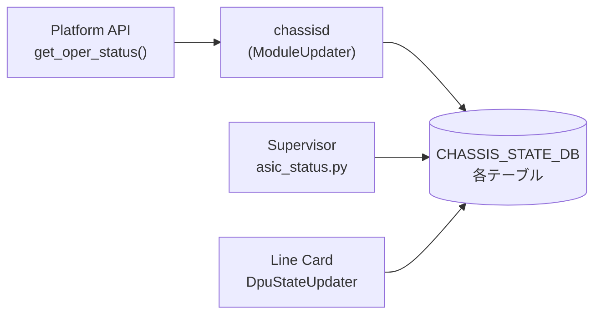

# CHASSIS_STATE_DB テーブル群

## 概要

`CHASSIS_STATE_DB` は Redis DB ID=13 に割り当てられた **状態専用データベース**。[CONFIG_DB](../../reference/glossary.md#term-config_db) の `CHASSIS_MODULE` テーブルとは別に存在し、`chassisd` デーモンがモジュラーチャシスや SmartSwitch の運用状態を **push 型** で書き込む。CONFIG_DB が「設定意図」を保持するのに対し、CHASSIS_STATE_DB は「実行時状態」を保持する[^1]。

`chassisd` は `CHASSIS_INFO_UPDATE_PERIOD_SECS = 10` 秒間隔のポーリングと、midplane 状態変化のイベント駆動で CHASSIS_STATE_DB を更新する。

<!-- cdb-mermaid -->
### データフロー (自動生成)



!!! note "凡例"
    Supervisor と Line Card 双方が CHASSIS_STATE_DB に書き込む。読み取り側は `show chassis modules`, `show dpu` CLI、および `asic_status.py`。
<!-- /cdb-mermaid -->

## テーブル一覧

| テーブル名 | キー形式 | 書き込み元 | 用途 |
|-----------|---------|----------|------|
| `CHASSIS_MODULE_TABLE` | `LINE-CARD<N>` | `ModuleUpdater` (line card 側) | hostname / slot / num_asics をスーパーバイザーへ通知 |
| `CHASSIS_ASIC_TABLE` | `LINE-CARD<N>\|asic<id>` | `ModuleUpdater` (非 supervisor) | ラインカード上の ASIC 情報 |
| `CHASSIS_FABRIC_ASIC_TABLE` | `asic<id>` | `ModuleUpdater` (supervisor) | ファブリックカード上の ASIC 情報 |
| `CHASSIS_MODULE_REBOOT_INFO_TABLE` | `<module_name>` | `ModuleUpdater` | midplane 喪失時のタイムスタンプ記録 |
| `DPU_STATE` | `DPU<N>` | `SmartSwitchModuleUpdater`, `DpuStateUpdater` | SmartSwitch DPU の midplane / データプレーン / コントロールプレーン状態 |
| `REBOOT_CAUSE` | `DPU<N>\|<timestamp>` | `SmartSwitchModuleUpdater` | DPU 再起動原因の履歴 |
| `LINECARD_PORT_STAT_TABLE` | `<port_alias>` | `portstat` (utilities) | ライン間ポート統計 |
| `LINECARD_PORT_STAT_MARK_TABLE` | `<hostname>` | `portstat` (utilities) | portstat -c 実行時刻マーク |

---

## CHASSIS_MODULE_TABLE

### key 構造

```text
CHASSIS_MODULE_TABLE|LINE-CARD<N>
```

### フィールド

| フィールド | 型 | デフォルト / fallback | 説明 |
|-----------|----|----------------------|------|
| `slot` | string | `str(my_slot)` ; platform API 失敗時 `"-1"` | ラインカードのスロット番号 |
| `hostname` | string | `device_info.get_hostname()` ; 失敗時 `"None"` (文字列) | ラインカードのホスト名 |
| `num_asics` | string | `str(len(asics))` ; asics リスト取得失敗時 `"0"` | ラインカード上の ASIC 数 |

!!! warning "`hostname` fallback は文字列 `\"None\"`"
    platform API 失敗時の fallback は Python の `None` 型ではなく文字列 `"None"`。比較時に注意。

書き込みタイミング: ラインカード上の `chassisd` が 10 秒ごとのポーリングで `module_db_update()` を実行した際、`_is_supervisor() == False` の分岐で書き込む (chassisd:461-468)。

---

## CHASSIS_ASIC_TABLE / CHASSIS_FABRIC_ASIC_TABLE

### key 構造

```text
# 非 supervisor (ライン card)
CHASSIS_ASIC_TABLE|LINE-CARD<N>|asic<global_id>

# supervisor
CHASSIS_FABRIC_ASIC_TABLE|asic<global_id>
```

### フィールド

| フィールド | 型 | 説明 |
|-----------|----|------|
| `asic_pci_address` | string | ASIC の PCI バスアドレス |
| `name` | string | モジュール名 (例: `LINE-CARD0`) |
| `asic_id_in_module` | string | モジュール内の ASIC 連番 (0 始まり) |

書き込み条件: `oper_status == MODULE_STATUS_ONLINE` かつ `admin_status != 'down'` の場合のみ書き込まれる。モジュールが OFFLINE に遷移すると当該モジュールの全 ASIC エントリが削除される (chassisd:471-478)。

`asic_status.py` が `CHASSIS_FABRIC_ASIC_TABLE` を `SubscriberStateTable` で監視し、supervisor 上の ASIC サービス起動タイミング判定に使用する[^2]。

---

## DPU_STATE テーブル (SmartSwitch 専用)

### key 構造

```text
DPU_STATE|DPU<N>
```

### フィールド

| フィールド | 型 | デフォルト / fallback | 説明 |
|-----------|----|----------------------|------|
| `dpu_midplane_link_state` | `up`/`down` | 起動時: oper_status ONLINE → `'up'`、それ以外 → `'down'` | DPU の midplane リンク状態 |
| `dpu_midplane_link_reason` | string | `''` (down 設定時) ; up 設定時は未書き込み | midplane down の理由 (通常は空文字列) |
| `dpu_midplane_link_time` | string | `get_formatted_time()` — `"%a %b %d %I:%M:%S %p UTC %Y"` | midplane 状態変化時刻 |
| `dpu_data_plane_state` | `up`/`down` | midplane `'down'` 設定時に同時に `'down'` ; `DpuStateUpdater` が状態変化時に更新 | DPU データプレーン状態 |
| `dpu_data_plane_time` | string | 状態変化時のみ更新 | データプレーン状態変化時刻 |
| `dpu_control_plane_state` | `up`/`down` | midplane `'down'` 設定時に同時に `'down'` ; `DpuStateUpdater` が状態変化時に更新 | DPU コントロールプレーン状態 |
| `dpu_control_plane_time` | string | 状態変化時のみ更新 | コントロールプレーン状態変化時刻 |

---

## CHASSIS_MODULE_REBOOT_INFO_TABLE

### key 構造

```text
CHASSIS_MODULE_REBOOT_INFO_TABLE|<module_name>
```

### フィールド

| フィールド | 型 | 書き込み値 | 書き込みタイミング |
|-----------|----|-----------|----------------|
| `timestamp` | string | `str(time.time())` — Unix epoch float | midplane 喪失検知時 |
| `reboot` | string | `"expected"` | `chassisd` 外部 (reboot コマンド) が設定。`chassisd` 自身は書かない |

`timestamp` は `linecard_reboot_timeout` 秒 (デフォルト 180 秒) 経過後に `chassisd` がエントリを削除する。`reboot = "expected"` が設定されていた場合は WARN ログの代わりに `Expected:` プレフィックス付きログを出力する (chassisd:576-578)。

---

## REBOOT_CAUSE テーブル (SmartSwitch DPU 専用)

### key 構造

```text
REBOOT_CAUSE|DPU<N>|<YYYY_MM_DD_HH_MM_SS>
```

### フィールド

| フィールド | 型 | コード由来デフォルト | 説明 |
|-----------|----|-------------------|------|
| `cause` | string | `"Unknown"` (platform API 未実装時) | 再起動原因 |
| `comment` | string | `"N/A"` (tuple 分割失敗時) | 補足コメント |
| `device` | string | DPU 名 (固定) | 対象 DPU 名 |
| `time` | string | `get_formatted_time()` | 再起動時刻 (人間可読形式) |
| `name` | string | `"%Y_%m_%d_%H_%M_%S"` 形式 | タイムスタンプ (キーと一致) |

DPU が offline → online 遷移した際、`/host/reboot-cause/module/<dpu>/history/` 配下の JSON ファイルを全件読み込んで DB に書き込む。最大 `MAX_HISTORY_FILES = 10` 件のローテーション (chassisd:1024-1026)。

---

## 暗黙デフォルト・コード由来挙動

<!-- defaults -->
### try_get fallback (Platform API 失敗時)

`chassisd` は platform API 呼び出しを `try_get()` でラップし、`NotImplementedError` が発生した場合に fallback を返す:

```python
# chassisd:125-141
def try_get(callback, *args, **kwargs):
    default = kwargs.get('default', NOT_AVAILABLE)  # NOT_AVAILABLE = 'N/A'
    try:
        ret = callback(*args)
        if ret is None:
            ret = default
    except NotImplementedError:
        ret = default
    return ret
```

| Platform API | 明示 default | fallback 値 |
|-------------|-------------|-----------|
| `get_name`, `get_description`, `get_serial`, `get_model` | なし | `'N/A'` |
| `get_slot` | `INVALID_SLOT` | `-1` |
| `get_oper_status` | `MODULE_STATUS_OFFLINE` | `'Offline'` |
| `get_all_asics` | `[]` | `[]` (ASIC テーブル更新なし) |
| `get_presence`, `is_replaceable` | なし | `'N/A'` |
| `get_midplane_ip` | `INVALID_IP` | `'0.0.0.0'` |
| `is_midplane_reachable` | `False` | `False` |
| `device_info.get_hostname` | `"None"` | `"None"` (文字列) |

`oper_status = 'Offline'` の fallback は `str(ModuleBase.MODULE_STATUS_ONLINE)` との比較 (chassisd:420) で失敗し、当該モジュールの ASIC テーブル更新がスキップされる。

### DPU_STATE 初期化 (起動時の非対称挙動)

`chassisd` 起動時、`set_initial_dpu_admin_state()` (chassisd:1364-1405) が DPU_STATE を初期化する:

```python
# chassisd:1386-1391
if operational_state == ModuleBase.MODULE_STATUS_ONLINE:
    op_state = 'up'
else:
    op_state = 'down'
self.module_updater.update_dpu_state(dpu_state_key, op_state)
```

`update_dpu_state(key, 'down')` は midplane state だけでなく **CP/DP state も同時に 'down' に設定** する (chassisd:882-884)。一方 `update_dpu_state(key, 'up')` では midplane state のみ更新し CP/DP は更新しない。CP/DP の `'up'` 更新は `DpuStateUpdater` の独立したポーリングが担う。

### DPU_STATE の状態変化条件

`DpuStateUpdater.update_state()` (chassisd:1303-1316) は **前回値と比較して変化した場合のみ** `_update_dp_dpu_state()` / `_update_cp_dpu_state()` を呼び出す。状態が変わらない場合は `*_time` フィールドも更新されない。

### プラットフォームファイル由来のタイムアウト値

| 定数 | デフォルト値 | 上書きファイル |
|------|------------|--------------|
| `linecard_reboot_timeout` | 180 秒 | `/usr/share/sonic/platform/platform_env.conf` の `linecard_reboot_timeout=<N>` |
| `dpu_reboot_timeout` | 360 秒 | `/usr/share/sonic/platform/platform.json` の `"dpu_reboot_timeout"` キー |
| `MAX_DPU_REBOOT_DURATION` | 800 秒 (固定) | ハードコード; 同一 reboot 原因かどうかの判定窓 |
| `CHASSIS_DB_CLEANUP_MODULE_DOWN_PERIOD` | 30 分 (固定) | ハードコード; chassis app DB クリーンアップ遅延 |
| `MAX_HISTORY_FILES` | 10 件 (固定) | ハードコード; REBOOT_CAUSE ファイル上限 |

<!-- /defaults -->

---

## 制約

- CHASSIS_STATE_DB は CONFIG_DB ではないため、`sonic-db-cli CONFIG_DB` ではなく `sonic-db-cli CHASSIS_STATE_DB` (またはポート 6380 の Redis) でアクセスする
- `DPU_STATE` テーブルは SmartSwitch 機のみ使用。モジュラーチャシス（VOQ）構成では存在しない
- `REBOOT_CAUSE` のキーは timestamp 部分が `"%Y_%m_%d_%H_%M_%S"` 形式のファイル名由来。同一秒内の複数再起動はキーが衝突する可能性がある

## 購読者

- `chassisd` (`ModuleUpdater` / `SmartSwitchModuleUpdater`) — 自身が書き込む。CHASSIS_STATE_DB を読み返して midplane 状態変化の検知にも使う
- `asic_status.py` — `CHASSIS_FABRIC_ASIC_TABLE` を購読してファブリック ASIC のオンライン/オフライン検知
- CLI (`show chassis modules`, `show dpu`) — 読み取り専用
- `portstat` — `LINECARD_PORT_STAT_TABLE` への書き込みと読み取り

## 関連 CONFIG_DB / YANG / CLI

- 関連 [CONFIG_DB](../../reference/glossary.md#term-config_db): [`CHASSIS_MODULE`](chassis-module.md)、[`CHASSIS_APP`](chassis-app.md)
- 関連 CLI: `show chassis modules status`、`show dpu`

<!-- ref-triangle:start -->

## 関連リファレンス

- CONFIG_DB: [`CHASSIS_MODULE`](chassis-module.md) — 管理状態 (admin_status) の設定元
- CONFIG_DB: [`CHASSIS_APP`](chassis-app.md) — chassis app DB (DB ID=12) の隣接テーブル

<!-- ref-triangle:end -->

## 引用元

[^1]: `chassisd` ソース: `sonic-platform-daemons/sonic-chassisd/scripts/chassisd`. テーブル定数定義 (line 44-111)、`ModuleUpdater.__init__` (line 288-297)、`SmartSwitchModuleUpdater.update_dpu_state` (line 864-891)。
[^2]: `asic_status.py`: `sonic-buildimage/files/scripts/asic_status.py`. `CHASSIS_FABRIC_ASIC_TABLE` を `SubscriberStateTable` で監視 (line 43-44)。

<!-- ops-hint -->
## 運用ヒント

### CHASSIS_STATE_DB への直接アクセス

```bash
# CHASSIS_STATE_DB は DB ID=13
sonic-db-cli CHASSIS_STATE_DB keys '*'

# DPU_STATE 確認 (SmartSwitch)
sonic-db-cli CHASSIS_STATE_DB hgetall 'DPU_STATE|DPU0'

# CHASSIS_MODULE_TABLE 確認 (ラインカード hostname)
sonic-db-cli CHASSIS_STATE_DB hgetall 'CHASSIS_MODULE_TABLE|LINE-CARD0'

# CHASSIS_FABRIC_ASIC_TABLE 確認 (supervisor)
sonic-db-cli CHASSIS_STATE_DB keys 'CHASSIS_FABRIC_ASIC_TABLE|*'
```

### DPU 状態のトラブルシュート

DPU の `dpu_midplane_link_state` が `'down'` のままの場合:
1. `chassisd` が `midplane_initialized = True` になっているか確認 (ログ: `Chassisd midplane intialization failed`)
2. `dpu_midplane_link_reason` フィールドが空文字列なら platform API が理由を返していない
3. `dpu_data_plane_state` / `dpu_control_plane_state` も `'down'` になっているはず (midplane down 時に連鎖して設定)

### REBOOT_CAUSE の参照

```bash
# DPU0 の再起動履歴 (最新 10 件)
sonic-db-cli CHASSIS_STATE_DB keys 'REBOOT_CAUSE|DPU0|*'

# 特定エントリの詳細
sonic-db-cli CHASSIS_STATE_DB hgetall 'REBOOT_CAUSE|DPU0|2026_05_14_10_30_45'
```
<!-- /ops-hint -->

<!-- ordering -->
## 書き込み順序・起動シーケンス

### ChassisdDaemon 起動シーケンス（モジュラーチャシス）

```
1. is_smartswitch() 判定
   ├─ SmartSwitch: SmartSwitchModuleUpdater 生成
   └─ モジュラーチャシス: my_slot / supervisor_slot 取得 → ModuleUpdater 生成
2. modules_num_update()
   → STATE_DB CHASSIS_INFO に num_modules を書き込み
3. [SmartSwitch のみ] set_initial_dpu_admin_state()
   → 各 DPU の get_oper_status() 読み取り → DPU_STATE 初期化
   → admin_state=empty なら別スレッドで set_admin_state_gracefully() 実行
4. [supervisor のみ] ConfigManagerTask.task_run()
   → CONFIG_DB CHASSIS_MODULE テーブルの購読開始
5. メインループ（10 秒間隔）
   a. module_db_update()        ← CHASSIS_STATE_DB への主要な書き込み
   b. check_midplane_reachability()
   c. module_down_chassis_db_cleanup()
```

### ModuleUpdater.__init__() の初期化順

1. STATE_DB に接続 → CHASSIS_INFO_TABLE / CHASSIS_MODULE_INFO_TABLE / CHASSIS_MIDPLANE_INFO_TABLE テーブルを準備
2. CHASSIS_STATE_DB に接続
   - supervisor: `CHASSIS_FABRIC_ASIC_INFO_TABLE`
   - 非 supervisor: `CHASSIS_ASIC_INFO_TABLE`
   - 共通: `CHASSIS_MODULE_HOSTNAME_TABLE`、`CHASSIS_MODULE_REBOOT_INFO_TABLE`
3. `platform_env.conf` から `linecard_reboot_timeout` を読み込み（デフォルト 180 秒）
4. `chassis.init_midplane_switch()` → `midplane_initialized` フラグ設定（失敗時 False、以降 check_midplane_reachability がスキップ）

### module_db_update() の処理順

全モジュールを `0 〜 num_modules` でループし、以下を実行する（chassisd:364-478）:

1. `_get_module_info(index)` で platform API から name / desc / slot / oper_status / asics / serial / presence / replaceable / model を取得
2. STATE_DB `CHASSIS_MODULE_INFO_TABLE` に `fvs` を set
3. `presence=True` の場合 `PHYSICAL_ENTITY_INFO_TABLE` を更新
4. `oper_status != ONLINE` の場合:
   - 直前状態が ONLINE だった場合のみ `notOnlineModules` に追加し `down_modules` にタイムスタンプ記録
   - `continue`（ASIC テーブル更新をスキップ）
5. `oper_status == ONLINE` かつ `admin_status != 'down'` の場合:
   - 非 supervisor: CHASSIS_STATE_DB `CHASSIS_ASIC_TABLE` にエントリ書き込み
   - supervisor: CHASSIS_STATE_DB `CHASSIS_FABRIC_ASIC_TABLE` にエントリ書き込み
6. 非 supervisor のみ: CHASSIS_STATE_DB `CHASSIS_MODULE_TABLE`（hostname_table）に `hostname / slot / num_asics` を書き込み
7. `notOnlineModules` に含まれるモジュールの ASIC エントリを CHASSIS_STATE_DB から一括削除

### CHASSIS_STATE_DB 書き込みタイミングまとめ

| テーブル | 書き込みタイミング | 書き込み主体 |
|---------|----------------|------------|
| `CHASSIS_ASIC_TABLE` | 10 秒ポーリング、ONLINE かつ admin≠down | 非 supervisor ライン card |
| `CHASSIS_FABRIC_ASIC_TABLE` | 10 秒ポーリング、ONLINE かつ admin≠down | supervisor |
| `CHASSIS_MODULE_TABLE` (hostname) | 10 秒ポーリング（毎回上書き） | 非 supervisor ライン card |
| `CHASSIS_MIDPLANE_INFO_TABLE` | 10 秒ポーリング、`midplane_initialized=True` の場合のみ | supervisor / ライン card |
| `CHASSIS_MODULE_REBOOT_INFO_TABLE` | midplane 喪失検知時 (timestamp 書き込み) / 回復時 (エントリ削除) | supervisor / ライン card |
| `DPU_STATE` | 起動時 `set_initial_dpu_admin_state()`、midplane 状態変化時 | SmartSwitch chassis |
| `DPU_STATE` CP/DP フィールド | `DpuStateUpdater` が状態変化時のみ更新 | DPU 上の chassisd |
| `REBOOT_CAUSE` | DPU offline → online 遷移時に `/host/reboot-cause/module/<dpu>/history/` から読み込んで書き込み | `SmartSwitchModuleUpdater` |

### asic_status.py が CHASSIS_FABRIC_ASIC_TABLE を読む順序

supervisor が CHASSIS_FABRIC_ASIC_TABLE を `SubscriberStateTable` で購読し、ファブリック ASIC エントリの到着を 1000 ms ポーリングで待機する。ASIC が ONLINE になると対応する syncd / orchagent 等サービスの起動判定に使用される（asic_status.py:40-50）。

### warm-reboot 挙動

`chassisd` は warm-reboot を明示的に検出しない（WarmStart API を使用しない）。

- **SIGTERM 受信**: メインループを終了する。CHASSIS_STATE_DB の内容はそのまま残る
- **ModuleUpdater.deinit()**: STATE_DB の `CHASSIS_MODULE_INFO_TABLE` / `CHASSIS_MIDPLANE_INFO_TABLE` / `PHYSICAL_ENTITY_INFO_TABLE` を削除するが、CHASSIS_STATE_DB（ASIC テーブル・hostname テーブル）は削除しない
- **DpuStateUpdater.deinit()**: `dpu_data_plane_state` / `dpu_control_plane_state` を `'down'` に設定して終了（chassisd:1318-1320）
- **再起動後**: `set_initial_dpu_admin_state()` が DPU_STATE を `get_oper_status()` の現在値で上書き。ONLINE なら `midplane_link_state='up'`、それ以外なら `'down'`（CP/DP も同時に 'down'）

> **Evidence**: `sonic-platform-daemons` `sonic-chassisd/scripts/chassisd:265-311,336-345,364-478,541-591,667-680,1303-1320,1364-1405,1408-1456`; `sonic-buildimage` `files/scripts/asic_status.py:40-50`
<!-- /ordering -->

<!-- cross-refs -->
## 暗黙参照テーブル (Phase C)

`CHASSIS_STATE_DB` テーブル群は以下の DB テーブルをコードレベルで参照・操作する（YANG leafref 非対象、CONFIG_DB ではないため）。

| 参照先 | 方向 | 機構 | 条件 |
|--------|------|------|------|
| `CONFIG_DB.CHASSIS_MODULE.admin_status` | 読み取り | `ModuleUpdater.get_module_admin_status()` が `admin_status` を確認し、`'down'` なら ASIC テーブル書き込みをスキップ | oper_status == ONLINE のモジュールを 10 秒ポーリング毎に確認 (chassisd:354-362, 444-457) |
| `APPL_DB.PORT_TABLE.oper_status` | 読み取り | `DpuStateUpdater._get_data_plane_state_common()` が全ポートの oper_status を走査し、1 つでも `'up'` でなければ DP state = `'down'` | platform API `get_dataplane_state()` が `NotImplementedError` の SmartSwitch DPU のみ (chassisd:1267-1275) |
| `STATE_DB.SYSTEM_READY\|SYSTEM_STATE.Status` | 読み取り | `DpuStateUpdater._get_control_plane_state_common()` が `'up'` 確認。不在・非 up で CP state = `'down'` | platform API `get_controlplane_state()` が `NotImplementedError` の SmartSwitch DPU のみ (chassisd:1277-1284) |
| `CHASSIS_APP_DB`（SYSTEM_NEIGH / SYSTEM_INTERFACE / SYSTEM_LAG） | 書き込み削除 | `_cleanup_chassis_app_db()` が Lua スクリプトで該当ラインカードの全エントリを一括削除 | supervisor のみ、モジュール down が 30 分経過後 (chassisd:593-682) |
| `CHASSIS_STATE_DB.DPU_STATE`（自己購読） | 読み取り | `DpuStateManagerTask` が `swsscommon.Select` で APPL_DB.PORT_TABLE / STATE_DB.SYSTEM_READY / CHASSIS_STATE_DB.DPU_STATE を同時購読し、midplane 変化時に DP/CP state を再評価 | SmartSwitch DPU 上のみ (chassisd:1477-1533) |

!!! note "CONFIG_DB.PORT の空テーブル挙動"
    `_get_data_plane_state_common()` は `CONFIG_DB.PORT` テーブルのキー一覧をループする。PORT テーブルが空（エントリなし）の場合はループが 0 回実行され `True`（DP up）を返す。意図せず DP state が `'up'` になる可能性がある (chassisd:1270)。

> **Evidence**: `sonic-platform-daemons` `sonic-chassisd/scripts/chassisd:354-362,444-457,593-682,1241-1243,1267-1284,1477-1533`
<!-- /cross-refs -->

<!-- failure -->
## 失敗挙動マトリクス (Phase D)

### platform API 失敗時の DB 書き込み経路

| 失敗条件 | 検出箇所 | 結果 | ログ出力 | evidence |
|---|---|---|---|---|
| `get_oper_status()` が `NotImplementedError` | `try_get()` | fallback `'Offline'` → ASIC テーブル更新スキップ | なし | `chassisd:125-141,490` |
| `get_slot()` が `NotImplementedError` | `try_get()` | fallback `-1` (INVALID_SLOT) → STATE_DB に `slot=-1` 書き込み | なし | `chassisd:125-141,488` |
| `get_all_asics()` が `NotImplementedError` | `try_get()` | fallback `[]` → ASIC テーブル書き込みをスキップ | なし | `chassisd:125-141,491` |
| `get_name()` が `NotImplementedError` | `try_get()` | fallback `'N/A'` を key として STATE_DB に書き込み（複数モジュールで同時に失敗するとキー衝突） | なし | `chassisd:486` |
| `get_midplane_ip()` が `NotImplementedError` | `try_get()` | fallback `'0.0.0.0'` → CHASSIS_MIDPLANE_INFO_TABLE に書き込み | なし | `chassisd:563` |
| `is_midplane_reachable()` が `NotImplementedError` | `try_get()` | fallback `False` → midplane down 扱い | なし | `chassisd:564` |
| `init_midplane_switch()` が `NotImplementedError` | `try_get()` | `midplane_initialized=False` → 以降 `check_midplane_reachability()` 全スキップ | `LOG_ERROR "Chassisd midplane intialization failed"` | `chassisd:309-311` |
| `get_module_index()` が `NotImplementedError` | `try_get()` | fallback `-1` → `module_config_update()` が early return | `LOG_ERROR "Unable to get module-index for key..."` | `chassisd:202-206` |
| `set_admin_state()` が `NotImplementedError` | `try_get()` | fallback `False` → platform への状態変更不実施 (silent) | なし | `chassisd:212` |

### platform.json / platform_env.conf パース失敗

| 失敗条件 | 検出箇所 | 結果 | ログ出力 | evidence |
|---|---|---|---|---|
| `platform.json` が `json.JSONDecodeError` | `SmartSwitchModuleUpdater.__init__` | `dpu_reboot_timeout` がデフォルト 360 秒のまま | `LOG_ERROR "Error parsing {}: ..."` | `chassisd:728-729` |
| `platform.json` のパース中に予期しない例外 | `SmartSwitchModuleUpdater.__init__` | 同上 | `LOG_ERROR "Unexpected error: ..."` | `chassisd:730-731` |
| `platform_env.conf` が存在しない | `ModuleUpdater.__init__` | `linecard_reboot_timeout` がデフォルト 180 秒のまま (silent) | なし | `chassisd:302-307` |

### REBOOT_CAUSE ファイル処理の失敗

| 失敗条件 | 検出箇所 | 結果 | ログ出力 | evidence |
|---|---|---|---|---|
| `json.load()` が `json.JSONDecodeError` | `update_dpu_reboot_cause_to_db()` | 該当ファイルをスキップ; 他のファイルは継続処理 | `LOG_WARNING "Failed to decode JSON from file: ..."` | `chassisd:1069-1070` |
| ファイル処理中に `Exception` | `update_dpu_reboot_cause_to_db()` | 該当ファイルをスキップ; 他のファイルは継続処理 | `LOG_WARNING "Error processing file ..."` | `chassisd:1071-1072` |
| 対象モジュールのヒストリファイルが 0 件 | `update_dpu_reboot_cause_to_db()` | DB 書き込みなしで early return | `LOG_WARNING "No reboot cause history files found for module: ..."` | `chassisd:1046-1048` |
| `previous-reboot-cause.json` が存在しない | `retrieve_dpu_reboot_info()` | `(None, None)` を返す; `is_reboot=False` で進む | `LOG_DEBUG "{module}: previous-reboot-cause.json not found"` | `chassisd:772-773` |
| `previous-reboot-cause.json` のパースに失敗 | `retrieve_dpu_reboot_info()` | `(None, None)` を返す | `LOG_ERROR "{module}: Failed to read previous-reboot-cause.json: ..."` | `chassisd:773-774` |
| `history/` ディレクトリが `FileNotFoundError` | `_rotate_files()` | `return` してローテーション中断 (silent) | なし | `chassisd:1018-1019` |

### DPU_STATE 書き込み失敗

| 失敗条件 | 検出箇所 | 結果 | ログ出力 | evidence |
|---|---|---|---|---|
| `chassis_state_db.hset()` または `db_connect()` が例外 | `update_dpu_state()` | DB 書き込み不実施; `DPU_STATE` が古い値のまま | `LOG_ERROR "Unexpected error: ..."` | `chassisd:890-891` |
| `get_dpu_midplane_state()` 中に例外 | `get_dpu_midplane_state()` | `None` を返す → `dpu_mp_state != 'up'` 判定 → `update_dpu_state()` 呼び出し | `LOG_ERROR "Unexpected error: ..."` | `chassisd:905-906` |
| `set_initial_dpu_admin_state()` 内で例外 | `ChassisdDaemon.set_initial_dpu_admin_state()` | ログ出力後に継続（当該 DPU の初期化スキップ） | `LOG_ERROR "Error in run: ..."` | `chassisd:1400-1401` |

### ConfigManagerTask の異常系

| 失敗条件 | 検出箇所 | 結果 | ログ出力 | evidence |
|---|---|---|---|---|
| `sel.select()` が `OBJECT` 以外 | `ConfigManagerTask.task_worker()` | `log_warning` 後に次のループへ | `LOG_WARNING "sel.select() did not return swsscommon.Select.OBJECT"` | `chassisd:1159-1160` |
| キー名が `LINE-CARD`/`FABRIC-CARD`/`SUPERVISOR` のいずれでも始まらない | `ModuleConfigUpdater.module_config_update()` | early return; platform API 呼び出しなし | `LOG_ERROR "Incorrect module-name ..."` | `chassisd:193-199` |
| SmartSwitch で `admin_status` が `'up'`/`'down'` 以外 | `SmartSwitchModuleConfigUpdater.module_config_update()` | `log_warning` 後に early return | `LOG_WARNING "Invalid admin_state value: ..."` | `chassisd:252-253` |

!!! warning "`try_get()` と非 `NotImplementedError` 例外"
    `try_get()` は `NotImplementedError` のみを捕捉する。platform API 実装バグで `AttributeError` 等が発生した場合、`module_db_update()` ループ全体が中断される。`DpuStateUpdater.deinit()` の DB 書き込み失敗もエラーハンドリングなしで例外が伝播する（chassisd:1318-1320）。

> **Evidence**: `sonic-platform-daemons` `sonic-chassisd/scripts/chassisd:125-141,193-212,237-253,302-311,486-495,563-564,728-731,772-774,890-891,905-906,1018-1019,1046-1072,1159-1160,1318-1320,1400-1401`
<!-- /failure -->

<!-- constants -->
## ハードコード定数 (Phase E)

> 調査証跡: `meta/_intermediate/cdb-flow/chassis-state-constants.md`

### テーブル名定数

| 定数名 | 値 | 接続先 DB | 行 |
|--------|-----|-----------|-----|
| `CHASSIS_CFG_TABLE` | `'CHASSIS_MODULE'` | CONFIG_DB（読み取り専用） | `chassisd:44` |
| `CHASSIS_INFO_TABLE` | `'CHASSIS_TABLE'` | STATE_DB | `chassisd:46` |
| `CHASSIS_MODULE_INFO_TABLE` | `'CHASSIS_MODULE_TABLE'` | STATE_DB | `chassisd:50` |
| `CHASSIS_ASIC_INFO_TABLE` | `'CHASSIS_ASIC_TABLE'` | CHASSIS_STATE_DB | `chassisd:63` |
| `CHASSIS_FABRIC_ASIC_INFO_TABLE` | `'CHASSIS_FABRIC_ASIC_TABLE'` | CHASSIS_STATE_DB | `chassisd:64` |
| `CHASSIS_MIDPLANE_INFO_TABLE` | `'CHASSIS_MIDPLANE_TABLE'` | STATE_DB | `chassisd:69` |
| `CHASSIS_MODULE_HOSTNAME_TABLE` | `'CHASSIS_MODULE_TABLE'` | CHASSIS_STATE_DB | `chassisd:75` |
| `CHASSIS_MODULE_REBOOT_INFO_TABLE` | `'CHASSIS_MODULE_REBOOT_INFO_TABLE'` | CHASSIS_STATE_DB | `chassisd:78` |
| `PHYSICAL_ENTITY_INFO_TABLE` | `'PHYSICAL_ENTITY_INFO'` | STATE_DB | `chassisd:87` |

!!! warning "`CHASSIS_MODULE_TABLE` 重複"
    `CHASSIS_MODULE_INFO_TABLE`（STATE_DB）と `CHASSIS_MODULE_HOSTNAME_TABLE`（CHASSIS_STATE_DB）は同一の文字列 `'CHASSIS_MODULE_TABLE'` を値として持つ。接続先 DB が異なるため別テーブルとして扱われるが、名前だけで判断すると混同しやすい。

### タイムアウト・ポーリング間隔定数

| 定数名 | 値 | 上書き手段 | 行 |
|--------|-----|-----------|-----|
| `CHASSIS_INFO_UPDATE_PERIOD_SECS` | `10` 秒 | ハードコード（上書き不可） | `chassisd:89` |
| `CHASSIS_DB_CLEANUP_MODULE_DOWN_PERIOD` | `30` 分 | ハードコード（上書き不可） | `chassisd:90` |
| `DEFAULT_LINECARD_REBOOT_TIMEOUT` | `180` 秒 | `platform_env.conf` の `linecard_reboot_timeout=<N>` | `chassisd:81` |
| `DEFAULT_DPU_REBOOT_TIMEOUT` | `360` 秒 | `platform.json` の `"dpu_reboot_timeout"` キー | `chassisd:82` |
| `MAX_DPU_REBOOT_DURATION` | `800` 秒 | ハードコード（上書き不可） | `chassisd:83` |
| `SELECT_TIMEOUT` | `1000` ms | ハードコード（上書き不可） | `chassisd:95` |
| `MAX_HISTORY_FILES` | `10` 件 | ハードコード（上書き不可） | `chassisd:106` |

### フォールバック値・ファイルパス定数

| 定数名 | 値 | 行 |
|--------|-----|-----|
| `NOT_AVAILABLE` | `'N/A'` | `chassisd:97` |
| `INVALID_SLOT` | `ModuleBase.MODULE_INVALID_SLOT` (= `-1`) | `chassisd:98` |
| `INVALID_IP` | `'0.0.0.0'` | `chassisd:100` |
| `PLATFORM_ENV_CONF_FILE` | `"/usr/share/sonic/platform/platform_env.conf"` | `chassisd:84` |
| `PLATFORM_JSON_FILE` | `"/usr/share/sonic/platform/platform.json"` | `chassisd:85` |
| `MODULE_REBOOT_CAUSE_DIR` | `"/host/reboot-cause/module/"` | `chassisd:105` |

### midplane フィールド名の非対称性

DP/CP 側フィールド名（`DP_STATE`、`CP_STATE`、`DP_UPDATE_TIME`、`CP_UPDATE_TIME`）はモジュールレベル定数として定義されているが、midplane 側フィールド名（`dpu_midplane_link_state`、`dpu_midplane_link_reason`、`dpu_midplane_link_time`）は `update_dpu_state()` 内でリテラルとして直書きされており定数化されていない（chassisd:876-884）。

> **Evidence**: `sonic-platform-daemons` `sonic-chassisd/scripts/chassisd:36-111,876-884`
<!-- /constants -->

<!-- cdb-exceptions -->
## 例外条件・特殊挙動

| consumer | 条件 | 挙動 |
|---|---|---|
| `ModuleUpdater` | platform API が `NotImplementedError` | `try_get()` fallback: `oper_status='Offline'`, `slot=-1`, `asics=[]` → ASIC テーブル更新スキップ |
| `SmartSwitchModuleUpdater.update_dpu_state()` | `state='down'` | `dpu_midplane_link_state`, `dpu_control_plane_state`, `dpu_data_plane_state` を全て `'down'` に設定 |
| `SmartSwitchModuleUpdater.update_dpu_state()` | `state='up'` | `dpu_midplane_link_state` のみ更新; CP/DP state は `DpuStateUpdater` が別途更新 |
| `DpuStateUpdater.update_state()` | 前回と同一状態 | DB 書き込みなし; `*_time` フィールドも更新されない |
| `DpuStateUpdater.deinit()` | `chassisd` 停止 | `dpu_data_plane_state = 'down'`, `dpu_control_plane_state = 'down'` を書き込み |
| `ModuleUpdater` | モジュールが ONLINE → 非 ONLINE | `CHASSIS_ASIC_TABLE` の当該モジュール ASIC エントリを全削除 (chassisd:471-478) |
| `module_down_chassis_db_cleanup()` | モジュール down が 30 分経過 | supervisor が chassis app DB (DB ID=12) の SYSTEM_NEIGH / SYSTEM_INTERFACE / SYSTEM_LAG エントリを Lua スクリプトで一括削除 |

> **Evidence**: `sonic-platform-daemons` `sonic-chassisd/scripts/chassisd:125-141,288-297,420,462-468,471-478,864-891,1289-1320,1364-1405`; `sonic-buildimage` `files/scripts/asic_status.py:40-44`
<!-- /cdb-exceptions -->
