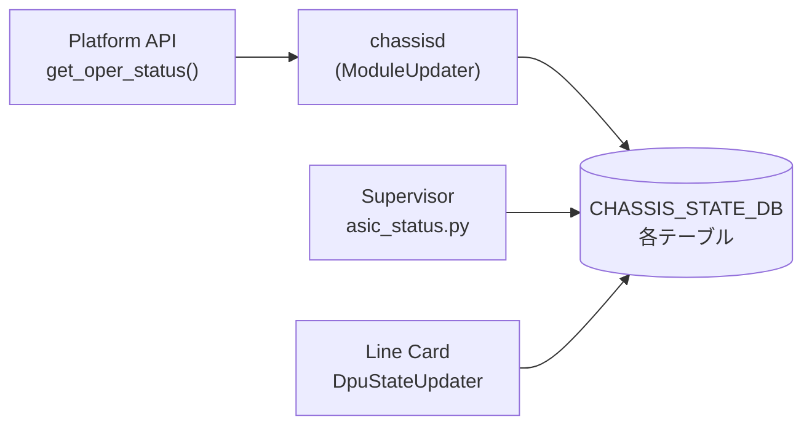

# CHASSIS_STATE_DB テーブル群

## 概要

`CHASSIS_STATE_DB` は Redis DB ID=13 に割り当てられた **状態専用データベース**。[CONFIG_DB](../../reference/glossary.md#term-config_db) の `CHASSIS_MODULE` テーブルとは別に存在し、`chassisd` デーモンがモジュラーチャシスや SmartSwitch の運用状態を **push 型** で書き込む。CONFIG_DB が「設定意図」を保持するのに対し、CHASSIS_STATE_DB は「実行時状態」を保持する[^1]。

`chassisd` は `CHASSIS_INFO_UPDATE_PERIOD_SECS = 10` 秒間隔のポーリングと、midplane 状態変化のイベント駆動で CHASSIS_STATE_DB を更新する。

<!-- cdb-mermaid -->
### データフロー (自動生成)



!!! note "凡例"
    Supervisor と Line Card 双方が CHASSIS_STATE_DB に書き込む。読み取り側は `show chassis modules`, `show dpu` CLI、および `asic_status.py`。
<!-- /cdb-mermaid -->

## テーブル一覧

| テーブル名 | キー形式 | 書き込み元 | 用途 |
|-----------|---------|----------|------|
| `CHASSIS_MODULE_TABLE` | `LINE-CARD<N>` | `ModuleUpdater` (line card 側) | hostname / slot / num_asics をスーパーバイザーへ通知 |
| `CHASSIS_ASIC_TABLE` | `LINE-CARD<N>\|asic<id>` | `ModuleUpdater` (非 supervisor) | ラインカード上の ASIC 情報 |
| `CHASSIS_FABRIC_ASIC_TABLE` | `asic<id>` | `ModuleUpdater` (supervisor) | ファブリックカード上の ASIC 情報 |
| `CHASSIS_MODULE_REBOOT_INFO_TABLE` | `<module_name>` | `ModuleUpdater` | midplane 喪失時のタイムスタンプ記録 |
| `DPU_STATE` | `DPU<N>` | `SmartSwitchModuleUpdater`, `DpuStateUpdater` | SmartSwitch DPU の midplane / データプレーン / コントロールプレーン状態 |
| `REBOOT_CAUSE` | `DPU<N>\|<timestamp>` | `SmartSwitchModuleUpdater` | DPU 再起動原因の履歴 |
| `LINECARD_PORT_STAT_TABLE` | `<port_alias>` | `portstat` (utilities) | ライン間ポート統計 |
| `LINECARD_PORT_STAT_MARK_TABLE` | `<hostname>` | `portstat` (utilities) | portstat -c 実行時刻マーク |

---

## CHASSIS_MODULE_TABLE

### key 構造

```text
CHASSIS_MODULE_TABLE|LINE-CARD<N>
```

### フィールド

| フィールド | 型 | デフォルト / fallback | 説明 |
|-----------|----|----------------------|------|
| `slot` | string | `str(my_slot)` ; platform API 失敗時 `"-1"` | ラインカードのスロット番号 |
| `hostname` | string | `device_info.get_hostname()` ; 失敗時 `"None"` (文字列) | ラインカードのホスト名 |
| `num_asics` | string | `str(len(asics))` ; asics リスト取得失敗時 `"0"` | ラインカード上の ASIC 数 |

!!! warning "`hostname` fallback は文字列 `\"None\"`"
    platform API 失敗時の fallback は Python の `None` 型ではなく文字列 `"None"`。比較時に注意。

書き込みタイミング: ラインカード上の `chassisd` が 10 秒ごとのポーリングで `module_db_update()` を実行した際、`_is_supervisor() == False` の分岐で書き込む (chassisd:461-468)。

---

## CHASSIS_ASIC_TABLE / CHASSIS_FABRIC_ASIC_TABLE

### key 構造

```text
# 非 supervisor (ライン card)
CHASSIS_ASIC_TABLE|LINE-CARD<N>|asic<global_id>

# supervisor
CHASSIS_FABRIC_ASIC_TABLE|asic<global_id>
```

### フィールド

| フィールド | 型 | 説明 |
|-----------|----|------|
| `asic_pci_address` | string | ASIC の PCI バスアドレス |
| `name` | string | モジュール名 (例: `LINE-CARD0`) |
| `asic_id_in_module` | string | モジュール内の ASIC 連番 (0 始まり) |

書き込み条件: `oper_status == MODULE_STATUS_ONLINE` かつ `admin_status != 'down'` の場合のみ書き込まれる。モジュールが OFFLINE に遷移すると当該モジュールの全 ASIC エントリが削除される (chassisd:471-478)。

`asic_status.py` が `CHASSIS_FABRIC_ASIC_TABLE` を `SubscriberStateTable` で監視し、supervisor 上の ASIC サービス起動タイミング判定に使用する[^2]。

---

## DPU_STATE テーブル (SmartSwitch 専用)

### key 構造

```text
DPU_STATE|DPU<N>
```

### フィールド

| フィールド | 型 | デフォルト / fallback | 説明 |
|-----------|----|----------------------|------|
| `dpu_midplane_link_state` | `up`/`down` | 起動時: oper_status ONLINE → `'up'`、それ以外 → `'down'` | DPU の midplane リンク状態 |
| `dpu_midplane_link_reason` | string | `''` (down 設定時) ; up 設定時は未書き込み | midplane down の理由 (通常は空文字列) |
| `dpu_midplane_link_time` | string | `get_formatted_time()` — `"%a %b %d %I:%M:%S %p UTC %Y"` | midplane 状態変化時刻 |
| `dpu_data_plane_state` | `up`/`down` | midplane `'down'` 設定時に同時に `'down'` ; `DpuStateUpdater` が状態変化時に更新 | DPU データプレーン状態 |
| `dpu_data_plane_time` | string | 状態変化時のみ更新 | データプレーン状態変化時刻 |
| `dpu_control_plane_state` | `up`/`down` | midplane `'down'` 設定時に同時に `'down'` ; `DpuStateUpdater` が状態変化時に更新 | DPU コントロールプレーン状態 |
| `dpu_control_plane_time` | string | 状態変化時のみ更新 | コントロールプレーン状態変化時刻 |

---

## CHASSIS_MODULE_REBOOT_INFO_TABLE

### key 構造

```text
CHASSIS_MODULE_REBOOT_INFO_TABLE|<module_name>
```

### フィールド

| フィールド | 型 | 書き込み値 | 書き込みタイミング |
|-----------|----|-----------|----------------|
| `timestamp` | string | `str(time.time())` — Unix epoch float | midplane 喪失検知時 |
| `reboot` | string | `"expected"` | `chassisd` 外部 (reboot コマンド) が設定。`chassisd` 自身は書かない |

`timestamp` は `linecard_reboot_timeout` 秒 (デフォルト 180 秒) 経過後に `chassisd` がエントリを削除する。`reboot = "expected"` が設定されていた場合は WARN ログの代わりに `Expected:` プレフィックス付きログを出力する (chassisd:576-578)。

---

## REBOOT_CAUSE テーブル (SmartSwitch DPU 専用)

### key 構造

```text
REBOOT_CAUSE|DPU<N>|<YYYY_MM_DD_HH_MM_SS>
```

### フィールド

| フィールド | 型 | コード由来デフォルト | 説明 |
|-----------|----|-------------------|------|
| `cause` | string | `"Unknown"` (platform API 未実装時) | 再起動原因 |
| `comment` | string | `"N/A"` (tuple 分割失敗時) | 補足コメント |
| `device` | string | DPU 名 (固定) | 対象 DPU 名 |
| `time` | string | `get_formatted_time()` | 再起動時刻 (人間可読形式) |
| `name` | string | `"%Y_%m_%d_%H_%M_%S"` 形式 | タイムスタンプ (キーと一致) |

DPU が offline → online 遷移した際、`/host/reboot-cause/module/<dpu>/history/` 配下の JSON ファイルを全件読み込んで DB に書き込む。最大 `MAX_HISTORY_FILES = 10` 件のローテーション (chassisd:1024-1026)。

---

## 暗黙デフォルト・コード由来挙動

<!-- defaults -->
### try_get fallback (Platform API 失敗時)

`chassisd` は platform API 呼び出しを `try_get()` でラップし、`NotImplementedError` が発生した場合に fallback を返す:

```python
# chassisd:125-141
def try_get(callback, *args, **kwargs):
    default = kwargs.get('default', NOT_AVAILABLE)  # NOT_AVAILABLE = 'N/A'
    try:
        ret = callback(*args)
        if ret is None:
            ret = default
    except NotImplementedError:
        ret = default
    return ret
```

| Platform API | 明示 default | fallback 値 |
|-------------|-------------|-----------|
| `get_name`, `get_description`, `get_serial`, `get_model` | なし | `'N/A'` |
| `get_slot` | `INVALID_SLOT` | `-1` |
| `get_oper_status` | `MODULE_STATUS_OFFLINE` | `'Offline'` |
| `get_all_asics` | `[]` | `[]` (ASIC テーブル更新なし) |
| `get_presence`, `is_replaceable` | なし | `'N/A'` |
| `get_midplane_ip` | `INVALID_IP` | `'0.0.0.0'` |
| `is_midplane_reachable` | `False` | `False` |
| `device_info.get_hostname` | `"None"` | `"None"` (文字列) |

`oper_status = 'Offline'` の fallback は `str(ModuleBase.MODULE_STATUS_ONLINE)` との比較 (chassisd:420) で失敗し、当該モジュールの ASIC テーブル更新がスキップされる。

### DPU_STATE 初期化 (起動時の非対称挙動)

`chassisd` 起動時、`set_initial_dpu_admin_state()` (chassisd:1364-1405) が DPU_STATE を初期化する:

```python
# chassisd:1386-1391
if operational_state == ModuleBase.MODULE_STATUS_ONLINE:
    op_state = 'up'
else:
    op_state = 'down'
self.module_updater.update_dpu_state(dpu_state_key, op_state)
```

`update_dpu_state(key, 'down')` は midplane state だけでなく **CP/DP state も同時に 'down' に設定** する (chassisd:882-884)。一方 `update_dpu_state(key, 'up')` では midplane state のみ更新し CP/DP は更新しない。CP/DP の `'up'` 更新は `DpuStateUpdater` の独立したポーリングが担う。

### DPU_STATE の状態変化条件

`DpuStateUpdater.update_state()` (chassisd:1303-1316) は **前回値と比較して変化した場合のみ** `_update_dp_dpu_state()` / `_update_cp_dpu_state()` を呼び出す。状態が変わらない場合は `*_time` フィールドも更新されない。

### プラットフォームファイル由来のタイムアウト値

| 定数 | デフォルト値 | 上書きファイル |
|------|------------|--------------|
| `linecard_reboot_timeout` | 180 秒 | `/usr/share/sonic/platform/platform_env.conf` の `linecard_reboot_timeout=<N>` |
| `dpu_reboot_timeout` | 360 秒 | `/usr/share/sonic/platform/platform.json` の `"dpu_reboot_timeout"` キー |
| `MAX_DPU_REBOOT_DURATION` | 800 秒 (固定) | ハードコード; 同一 reboot 原因かどうかの判定窓 |
| `CHASSIS_DB_CLEANUP_MODULE_DOWN_PERIOD` | 30 分 (固定) | ハードコード; chassis app DB クリーンアップ遅延 |
| `MAX_HISTORY_FILES` | 10 件 (固定) | ハードコード; REBOOT_CAUSE ファイル上限 |

<!-- /defaults -->

---

## 制約

- CHASSIS_STATE_DB は CONFIG_DB ではないため、`sonic-db-cli CONFIG_DB` ではなく `sonic-db-cli CHASSIS_STATE_DB` (またはポート 6380 の Redis) でアクセスする
- `DPU_STATE` テーブルは SmartSwitch 機のみ使用。モジュラーチャシス（VOQ）構成では存在しない
- `REBOOT_CAUSE` のキーは timestamp 部分が `"%Y_%m_%d_%H_%M_%S"` 形式のファイル名由来。同一秒内の複数再起動はキーが衝突する可能性がある

## 購読者

- `chassisd` (`ModuleUpdater` / `SmartSwitchModuleUpdater`) — 自身が書き込む。CHASSIS_STATE_DB を読み返して midplane 状態変化の検知にも使う
- `asic_status.py` — `CHASSIS_FABRIC_ASIC_TABLE` を購読してファブリック ASIC のオンライン/オフライン検知
- CLI (`show chassis modules`, `show dpu`) — 読み取り専用
- `portstat` — `LINECARD_PORT_STAT_TABLE` への書き込みと読み取り

## 関連 CONFIG_DB / YANG / CLI

- 関連 [CONFIG_DB](../../reference/glossary.md#term-config_db): [`CHASSIS_MODULE`](chassis-module.md)、[`CHASSIS_APP`](chassis-app.md)
- 関連 CLI: `show chassis modules status`、`show dpu`

<!-- ref-triangle:start -->

## 関連リファレンス

- CONFIG_DB: [`CHASSIS_MODULE`](chassis-module.md) — 管理状態 (admin_status) の設定元
- CONFIG_DB: [`CHASSIS_APP`](chassis-app.md) — chassis app DB (DB ID=12) の隣接テーブル

<!-- ref-triangle:end -->

## 引用元

[^1]: `chassisd` ソース: `sonic-platform-daemons/sonic-chassisd/scripts/chassisd`. テーブル定数定義 (line 44-111)、`ModuleUpdater.__init__` (line 288-297)、`SmartSwitchModuleUpdater.update_dpu_state` (line 864-891)。
[^2]: `asic_status.py`: `sonic-buildimage/files/scripts/asic_status.py`. `CHASSIS_FABRIC_ASIC_TABLE` を `SubscriberStateTable` で監視 (line 43-44)。

<!-- ops-hint -->
## 運用ヒント

### CHASSIS_STATE_DB への直接アクセス

```bash
# CHASSIS_STATE_DB は DB ID=13
sonic-db-cli CHASSIS_STATE_DB keys '*'

# DPU_STATE 確認 (SmartSwitch)
sonic-db-cli CHASSIS_STATE_DB hgetall 'DPU_STATE|DPU0'

# CHASSIS_MODULE_TABLE 確認 (ラインカード hostname)
sonic-db-cli CHASSIS_STATE_DB hgetall 'CHASSIS_MODULE_TABLE|LINE-CARD0'

# CHASSIS_FABRIC_ASIC_TABLE 確認 (supervisor)
sonic-db-cli CHASSIS_STATE_DB keys 'CHASSIS_FABRIC_ASIC_TABLE|*'
```

### DPU 状態のトラブルシュート

DPU の `dpu_midplane_link_state` が `'down'` のままの場合:
1. `chassisd` が `midplane_initialized = True` になっているか確認 (ログ: `Chassisd midplane intialization failed`)
2. `dpu_midplane_link_reason` フィールドが空文字列なら platform API が理由を返していない
3. `dpu_data_plane_state` / `dpu_control_plane_state` も `'down'` になっているはず (midplane down 時に連鎖して設定)

### REBOOT_CAUSE の参照

```bash
# DPU0 の再起動履歴 (最新 10 件)
sonic-db-cli CHASSIS_STATE_DB keys 'REBOOT_CAUSE|DPU0|*'

# 特定エントリの詳細
sonic-db-cli CHASSIS_STATE_DB hgetall 'REBOOT_CAUSE|DPU0|2026_05_14_10_30_45'
```
<!-- /ops-hint -->

<!-- cdb-exceptions -->
## 例外条件・特殊挙動

| consumer | 条件 | 挙動 |
|---|---|---|
| `ModuleUpdater` | platform API が `NotImplementedError` | `try_get()` fallback: `oper_status='Offline'`, `slot=-1`, `asics=[]` → ASIC テーブル更新スキップ |
| `SmartSwitchModuleUpdater.update_dpu_state()` | `state='down'` | `dpu_midplane_link_state`, `dpu_control_plane_state`, `dpu_data_plane_state` を全て `'down'` に設定 |
| `SmartSwitchModuleUpdater.update_dpu_state()` | `state='up'` | `dpu_midplane_link_state` のみ更新; CP/DP state は `DpuStateUpdater` が別途更新 |
| `DpuStateUpdater.update_state()` | 前回と同一状態 | DB 書き込みなし; `*_time` フィールドも更新されない |
| `DpuStateUpdater.deinit()` | `chassisd` 停止 | `dpu_data_plane_state = 'down'`, `dpu_control_plane_state = 'down'` を書き込み |
| `ModuleUpdater` | モジュールが ONLINE → 非 ONLINE | `CHASSIS_ASIC_TABLE` の当該モジュール ASIC エントリを全削除 (chassisd:471-478) |
| `module_down_chassis_db_cleanup()` | モジュール down が 30 分経過 | supervisor が chassis app DB (DB ID=12) の SYSTEM_NEIGH / SYSTEM_INTERFACE / SYSTEM_LAG エントリを Lua スクリプトで一括削除 |

> **Evidence**: `sonic-platform-daemons` `sonic-chassisd/scripts/chassisd:125-141,288-297,420,462-468,471-478,864-891,1289-1320,1364-1405`; `sonic-buildimage` `files/scripts/asic_status.py:40-44`
<!-- /cdb-exceptions -->
