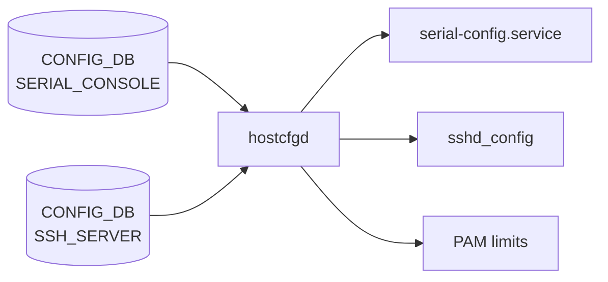

# SERIAL_CONSOLE / SSH_SERVER テーブル

## 概要

`SERIAL_CONSOLE` と `SSH_SERVER` はどちらも **CLI セッションのセキュリティポリシー** を保持する CONFIG_DB テーブル群[^1][^2]。  
`SERIAL_CONSOLE|POLICIES` はシリアルコンソールの不活動タイムアウトと Linux SysRq 機能の有効化を制御し、
`SSH_SERVER|POLICIES` は SSH デーモン (`sshd`) の認証パラメータ・タイムアウト・暗号スイート等を制御する。

`hostcfgd` が両テーブルを購読し、変化を `sshd_config` ファイルや PAM limits・systemd サービス再起動に反映する。

<!-- cdb-mermaid -->
### データフロー (自動生成)



!!! note "凡例"
    CONFIG_DB から各サービスまでの典型経路を示すミニ図。詳細は本ページ本文を参照。
<!-- /cdb-mermaid -->

## key 構造

```text
SERIAL_CONSOLE|POLICIES
SSH_SERVER|POLICIES
```

両テーブルとも固定キー `POLICIES` のシングルトンエントリ。

## SERIAL_CONSOLE フィールド

| フィールド | 型 | YANG default | 説明 |
|-----------|-----|-------------|------|
| `inactivity_timeout` | int32 (0..35000) | `15` (分) | シリアルコンソールの無操作タイムアウト (分単位)。0 で無効化 |
| `sysrq_capabilities` | `enabled`/`disabled` | `disabled` | Linux SysRq キー機能の有効化 |

## SSH_SERVER フィールド

| フィールド | 型 | YANG default | 説明 |
|-----------|-----|-------------|------|
| `authentication_retries` | uint32 (1..100) | `6` | 1 接続あたりの最大認証試行回数 (`MaxAuthTries`) |
| `login_timeout` | uint32 (1..600) | `120` (秒) | 認証完了までの最大待機時間 (`LoginGraceTime`) |
| `ports` | string (カンマ区切り) | `"22"` | SSH デーモンがリッスンする TCP ポート番号 (`Port`) |
| `inactivity_timeout` | uint32 (0..35000) | `15` (分) | SSH セッションの無操作タイムアウト (分単位)。0 で無効化 |
| `max_sessions` | uint32 (0..100) | `0` | 最大同時 SSH セッション数。0 は無制限 |
| `permit_root_login` | enum | なし | root ログインの許可 (`yes`/`prohibit-password`/`forced-commands-only`/`no`) |
| `password_authentication` | boolean | `true` | パスワード認証の有効化 |
| `ciphers` | leaf-list enum | なし | 許可する暗号アルゴリズムの一覧 |
| `kex_algorithms` | leaf-list enum | なし | 許可する鍵交換アルゴリズムの一覧 |
| `macs` | leaf-list enum | なし | 許可する MAC アルゴリズムの一覧 |

<!-- defaults -->
## コード由来の暗黙デフォルト (Phase A)

### SERIAL_CONSOLE|POLICIES

| フィールド | YANG default | DB 単位 | 実効値 | コード由来暗黙デフォルト |
|-----------|-------------|---------|-------|------------------------|
| `inactivity_timeout` | `15` (分) | 分 | `TMOUT=900` 秒 | `tmout-env.sh.j2` がデフォルト 900 秒 (L2) を内包。DB 不在時も 900 秒が適用される |
| `sysrq_capabilities` | `disabled` | enum | `/proc/sys/kernel/sysrq=0` | なし (YANG default が権威) |

### SSH_SERVER|POLICIES

| フィールド | YANG default | sshd_config パラメータ | コード由来暗黙デフォルト |
|-----------|-------------|----------------------|------------------------|
| `authentication_retries` | `6` | `MaxAuthTries` | なし |
| `login_timeout` | `120` (秒) | `LoginGraceTime` | なし |
| `ports` | `"22"` | `Port` | なし |
| `inactivity_timeout` | `15` (分) | `ClientAliveInterval` (秒×60) | 分→秒変換ロジック (hostcfgd L1129-1131)。実効値 `ClientAliveInterval 900` |
| `max_sessions` | `0` | PAM limits のみ | `0` → PAM 設定なし (無制限)。sshd_config の `MaxSessions` には反映されない |
| `password_authentication` | `true` | `PasswordAuthentication` | DB 値 `"false"` → `"no"`、それ以外 → `"yes"` (hostcfgd L1132-1143) |
| `permit_root_login` | なし | `PermitRootLogin` | DB 不在 → OpenSSH デフォルト `prohibit-password` が暗黙的に有効 |
| `ciphers` / `kex_algorithms` / `macs` | なし | `Ciphers` / `KexAlgorithms` / `MACs` | DB 不在 → OpenSSH 組み込みデフォルト |

### 特記事項

- **`inactivity_timeout` 単位乖離 (両テーブル共通)**: DB 値は **分単位**、実効値は秒単位 (×60 変換)。`show serial_console` / `show ssh` のフォールバック表示 `'900 <default>'` は秒単位のため、CLI 操作者が混乱しやすい。<!-- evidence: tmout-env.sh.j2 L2,L6; hostcfgd L1129-1131; show/main.py L2883,L2903 -->
- **`max_sessions` は sshd_config 非反映**: `SSH_CONFIG_NAMES` マップに登録されておらず `set_policies()` 内でスキップ。`PamLimitsCfg` 経由で `/etc/security/limits.d/` の `maxlogins` に反映される。<!-- evidence: hostcfgd L1418-1441 -->
- **`inactivity_timeout` の `ClientAliveCountMax`**: hostcfgd は `ClientAliveCountMax` を sshd_config に書かない。OpenSSH デフォルト (3) が有効。timeout = `ClientAliveInterval × ClientAliveCountMax` = `900 × 3 = 2700` 秒が実際の切断時間。
- **`serial-config.service` 再起動**: SERIAL_CONSOLE のいずれかのフィールドが変化すると hostcfgd が `service serial-config restart` を実行する。進行中のシリアル接続が切断される可能性がある。<!-- evidence: hostcfgd L2031-2040 -->
<!-- /defaults -->

## 購読者

- `hostcfgd` (`sonic-host-services`) — 両テーブルを `ConfigDBConnector` で購読し、`sshd_config` / PAM limits / `serial-config.service` に変化を反映する

## 値依存挙動マトリクス

<!-- value-behavior -->
| フィールド | 値 | 挙動 |
|-----------|-----|------|
| `SERIAL_CONSOLE.inactivity_timeout` | `15` (デフォルト) | `TMOUT=900` 秒 — 15 分間無操作でシリアルセッション自動ログアウト |
| `SERIAL_CONSOLE.inactivity_timeout` | `0` | `TMOUT=0` — タイムアウト無効 |
| `SERIAL_CONSOLE.sysrq_capabilities` | `enabled` | `/proc/sys/kernel/sysrq=1` — Linux SysRq キー有効 |
| `SERIAL_CONSOLE.sysrq_capabilities` | `disabled` (デフォルト) | `/proc/sys/kernel/sysrq=0` — Linux SysRq キー無効 |
| `SSH_SERVER.inactivity_timeout` | `15` (デフォルト) | `ClientAliveInterval 900` — 15 分間無応答で SSH セッション切断 |
| `SSH_SERVER.inactivity_timeout` | `0` | `ClientAliveInterval 0` — タイムアウト無効 |
| `SSH_SERVER.max_sessions` | `0` (デフォルト) | PAM limits なし — 同時 SSH セッション数無制限 |
| `SSH_SERVER.max_sessions` | `>0` | PAM limits `/etc/security/limits.d/` に maxlogins を設定 |
| `SSH_SERVER.password_authentication` | `true` (デフォルト) | `PasswordAuthentication yes` |
| `SSH_SERVER.password_authentication` | `false` | `PasswordAuthentication no` |
| `SSH_SERVER.permit_root_login` | 未設定 | OpenSSH デフォルト `prohibit-password` が暗黙的に有効 |
| `SSH_SERVER.permit_root_login` | `yes` | root パスワードログイン許可 (非推奨) |
| `SSH_SERVER.permit_root_login` | `no` | root ログイン完全禁止 |
<!-- /value-behavior -->

<!-- cdb-exceptions -->
## 例外条件・特殊挙動

- **`inactivity_timeout` 0 指定の意味**: YANG は `range "0..35000"` を許容し、0 はタイムアウト無効。ただし sshd の `ClientAliveInterval 0` は「keepalive 送信なし」を意味するため、実際にはクライアント側の TCP タイムアウトに依存する挙動になる。
- **`ciphers` / `kex_algorithms` / `macs` の空 leaf-list**: YANG は leaf-list であり、DB に 1 エントリも存在しない場合は hostcfgd がそのフィールドを sshd_config に書かない。OpenSSH のデフォルト cipher suite が全面的に有効になる。
- **`serial-config.service` が存在しない環境**: consoleserver / serial-config サービスがインストールされていない環境では、hostcfgd の `run_cmd(['sudo', 'service', 'serial-config', 'restart'])` が失敗してエラーログを残すが、設定変更は DB に反映される。
- **`show ssh` の `max_session` キー誤り**: `show/main.py` L2904 では `serial_console_table.get('max_session', ...)` と単数形を参照しているが、DB キーは `max_sessions` (複数形)。フォールバック値 `'0 <default>'` が常に表示される潜在的 bug がある。<!-- evidence: show/main.py L2904 vs sonic-ssh-server.yang L57 -->
<!-- /cdb-exceptions -->

<!-- ref-triangle:start -->

## 関連リファレンス

- [YANG](../../reference/glossary.md#term-yang): `sonic-serial-console`、`sonic-ssh-server`

<!-- ref-triangle:end -->

## 引用元

[^1]: YANG 定義: `sonic-serial-console.yang`. <https://github.com/sonic-net/sonic-buildimage/blob/9ea932ec2e18f35e58268ec2e4456b1d4afd65cd/src/sonic-yang-models/yang-models/sonic-serial-console.yang>

[^2]: YANG 定義: `sonic-ssh-server.yang`. <https://github.com/sonic-net/sonic-buildimage/blob/9ea932ec2e18f35e58268ec2e4456b1d4afd65cd/src/sonic-yang-models/yang-models/sonic-ssh-server.yang>

## 関連ページ

- [CONFIG_DB index](index.md)
- [CONFIG_DB: CONSOLE_PORT / CONSOLE_SWITCH](console-port.md)

<!-- ops-hint -->
## 運用ヒント

### 典型値

- `SERIAL_CONSOLE|POLICIES`: `inactivity_timeout=15`（分）、`sysrq_capabilities=disabled`
- `SSH_SERVER|POLICIES`: `inactivity_timeout=15`（分）、`authentication_retries=6`、`ports=22`、`max_sessions=0`

### よくある誤設定

- `inactivity_timeout` に秒単位の値を入れる（例: `900`）→ 実際には 900 × 60 = 54000 秒 (15 時間) が適用される。**分単位で設定すること**。
- `max_sessions` を設定したのに `show ssh` で `0 <default>` と表示される → show コマンドの `max_session` (単数) キーバグのため表示が正しくない。`sonic-db-cli CONFIG_DB HGET 'SSH_SERVER|POLICIES' max_sessions` で実際の値を確認すること。
- `ciphers` 等を空リストにクリアしたい場合、DB からキーを完全削除する必要がある（空 leaf-list では hostcfgd がフィールドを書かないため OpenSSH デフォルトに戻る）。

### 確認コマンド

```bash
# シリアルコンソール設定確認
show serial_console
sonic-db-cli CONFIG_DB hgetall 'SERIAL_CONSOLE|POLICIES'

# SSH サーバー設定確認
show ssh
sonic-db-cli CONFIG_DB hgetall 'SSH_SERVER|POLICIES'

# 適用済み sshd_config の確認
sudo sshd -T | grep -E 'maxauthtries|logingracetimedead|port|clientaliveinterval|passwordauthentication'
```
<!-- /ops-hint -->

<!-- runtime-trace -->
## 実コンテナ動作トレース

### 段階 1 — Consumer 登録

`hostcfgd` が起動時に `CONFIG_DB` の `SERIAL_CONSOLE` / `SSH_SERVER` テーブルを `ConfigDBConnector.subscribe()` で購読する (hostcfgd L2481, L2480)。

### 段階 2 — CFG→システム反映

**SERIAL_CONSOLE 変化時**:
1. `serial_console_config_handler()` → `SerialConsoleCfg.update_serial_console_cfg()` (hostcfgd L2438-2440)
2. キャッシュと比較し変化があれば `service serial-config restart` を実行
3. `serial-config.sh` が `sonic-cfggen` で `tmout-env.sh.j2` / `sysrq-sysctl.conf.j2` を再生成
4. `TMOUT` 環境変数 / `/proc/sys/kernel/sysrq` に反映

**SSH_SERVER 変化時**:
1. `SshServer.policies_update()` (hostcfgd L1045+) → `set_policies()` → `modify_conf_file()`
2. `sshd_config` の対応行を直接書き換え + `sshd reload` または `sshd restart`
3. `max_sessions` のみ別経路: `PamLimitsCfg.read_max_sessions_config()` → `/etc/security/limits.d/` 更新

### 段階 3 — APPL→SAI

なし (カーネル / デーモン設定のみ、SAI 非経由)

### 段階 4 — タイミングと副作用

- sshd 設定変更は `sshd reload` (HUP シグナル) で適用。進行中の SSH セッションには影響しない場合が多い。
- serial-config.service 再起動は進行中のシリアルコンソール接続を切断する可能性がある。
<!-- /runtime-trace -->

<!-- entry-points -->
## 書き込み入り口 (Direction A)

### CLI

- `config serial_console inactivity-timeout <minutes>` → `SERIAL_CONSOLE|POLICIES.inactivity_timeout`
- `config serial_console sysrq-capabilities <enabled|disabled>` → `SERIAL_CONSOLE|POLICIES.sysrq_capabilities`
- `config ssh inactivity-timeout <minutes>` → `SSH_SERVER|POLICIES.inactivity_timeout`
- `config ssh max-sessions <n>` → `SSH_SERVER|POLICIES.max_sessions`
  - ソース: `sonic-utilities/config/main.py` (L9946-L9999)

### minigraph / sonic-cfggen

なし (SERIAL_CONSOLE / SSH_SERVER は minigraph 生成対象外)

### REST / gNMI

なし (対応 OpenConfig/SONiC YANG transformer なし)

### db_migrator

なし

### ビルド時デフォルト (init_cfg / j2 テンプレート)

なし。ただし `tmout-env.sh.j2` が DB 不在時のデフォルト 900 秒をコード内に持つ。

### ハードコードデフォルト

- `tmout-env.sh.j2` L2: `` — DB 不在時のシリアルコンソールタイムアウト

### ランタイム注入 (デーモン自動書き込み)

なし (hostcfgd は読み取り / 適用のみ)
<!-- /entry-points -->

<!-- derivation -->
## 派生・条件付き登録 (Phase 6/7)

### Phase 6: 値による他フィールド自動派生

| 条件 | 派生先 | evidence |
|---|---|---|
| `SSH_SERVER.inactivity_timeout` 設定 | `sshd_config` の `ClientAliveInterval` (分×60秒) | hostcfgd L1129-1131 |
| `SSH_SERVER.max_sessions` > 0 | PAM limits `/etc/security/limits.d/` の `maxlogins` | hostcfgd L1418-1441 |

### Phase 7: 条件付き module/manager 登録

| 条件 | 登録 module | evidence |
|---|---|---|
| 常時 | `hostcfgd` が `SERIAL_CONSOLE` / `SSH_SERVER` を購読 | hostcfgd L2480-2481 |

<!-- /derivation -->

<!-- handler-branching -->
### Phase 8: Handler メソッド内分岐

| Handler | 分岐条件 | 効果 | evidence |
|---|---|---|---|
| `serial_console_config_handler` | キャッシュと変化あり | `serial-config.service` 再起動 | hostcfgd L2031-2040 |
| `serial_console_config_handler` | キャッシュと変化なし | no-op | hostcfgd L2031 |
| `SshServer.set_policies` | `key == "inactivity_timeout"` | 分→秒変換 (×60) して `ClientAliveInterval` に書き込み | hostcfgd L1129-1131 |
| `SshServer.set_policies` | `key in ["ciphers", "kex_algorithms", "macs"]` | カンマ区切りに結合して対応 sshd directive に書き込み | hostcfgd L1139-1140 |
| `SshServer.set_policies` | `key == "max_sessions"` | `SSH_CONFIG_NAMES` にないためスキップ (PAM 経路へ) | hostcfgd L1144-1145 |
| `PamLimitsCfg` | `max_sessions == 0` | PAM limits 設定なし (無制限) | hostcfgd L1418-1441 |
| `PamLimitsCfg` | `max_sessions > 0` | `/etc/security/limits.d/` に maxlogins 書き込み | hostcfgd L1418-1441 |

<!-- /handler-branching -->

<!-- ordering -->
## 書込み順序依存 (Phase B)

### 1. systemd 初期化完了待ち — SSH_SERVER / SERIAL_CONSOLE は wait 後に適用

`hostcfgd.load()` は `load_independent_config()` で AAA 系を先行適用し、`wait_till_system_init_done()` 完了後に `sshscfg.load()` / `serialconscfg.load()` を呼ぶ。<!-- evidence: hostcfgd:2233,2237,2265,2273 -->

| 依存 | 方向 | 備考 |
|------|------|------|
| systemd 初期化 完了 → SSH_SERVER / SERIAL_CONSOLE 適用 | 強制先行 | sshd / serial-config.service 起動前は `sshd -T` 失敗リスク |
| AAA / TACPLUS / RADIUS / LDAP → SSH_SERVER / SERIAL_CONSOLE | AAA が先 | load_independent_config() は systemctl 待ち前に実行 |

### 2. PamLimitsCfg の DEVICE_METADATA 先行必須

`PamLimitsCfg.update_config_file()` (hostcfgd:1421-1435) は `DEVICE_METADATA|localhost` が CONFIG_DB に存在しない場合に early return する。`SSH_SERVER.max_sessions` が設定されていても `DEVICE_METADATA` 不在では PAM limits が適用されない。<!-- evidence: hostcfgd:1430 -->

| 依存 | 方向 | 備考 |
|------|------|------|
| `DEVICE_METADATA\|localhost` → `SSH_SERVER.max_sessions` (PAM limits) | 先行必須 | 不在時 early return、max_sessions 未反映 |

### 3. ssh_handler() — SSH_SERVER 変更後 PamLimitsCfg が自動連動

runtime の `SSH_SERVER` 変化では `ssh_handler()` が `policies_update()` 呼び出し後に必ず `pamLimitsCfg.update_config_file()` を呼ぶ。`pamLimitsCfg` は CONFIG_DB を再読みするため `policies_update()` の適用内容が確実に反映される。順序依存は `ssh_handler()` 内部で自動的に保証される。<!-- evidence: hostcfgd:2296-2299 -->

### 4. SerialConsoleCfg.load() はキャッシュ格納のみ — serial-config.service 再起動なし

load フェーズでは `serial-config.service` の再起動は行わず、キャッシュを初期化するだけ。runtime の差分変更時のみ `serial_console_config_handler()` が再起動を実行する。<!-- evidence: hostcfgd:2018-2021, 2023-2043 -->

| 依存 | 方向 | 備考 |
|------|------|------|
| load 後の runtime 変更 → `serial-config.service` 再起動 | 差分検出で自動 | 進行中のシリアルコンソール接続が切断される可能性あり |

### 5. SSH_SERVER|POLICIES DEL は sshd_config に即時反映されない

`ssh_handler()` が DEL（`data == {}`）を受けると `policies_update()` は `self.policies` を更新しない（`if data:` で skip）。直前の `self.policies` が `modify_conf_file()` で再適用されるため、sshd_config は変更されない。hostcfgd 再起動後に初期化される。<!-- evidence: hostcfgd:1068-1077, 1059-1063 -->

### 6. sshd 設定検証フォールバック — 設定不正時は既存 sshd_config を保持

`set_policies()` は一時ファイルに書き込み、`sshd -T -f` 検証成功時のみ `os.rename()` で適用する。検証失敗時は一時ファイルを削除し、既存 `/etc/ssh/sshd_config` が維持される（無効設定による sshd 停止を防ぐ安全フォールバック）。<!-- evidence: hostcfgd:1155-1170 -->

### 順序依存サマリ

| # | 依存関係 | 方向 | 緩和策 |
|---|----------|------|--------|
| 1 | systemd init 完了 → SSH_SERVER / SERIAL_CONSOLE 適用 | 強制先行 | AAA のみ systemctl 待ち前に先行 |
| 2 | `DEVICE_METADATA\|localhost` 存在 → PAM limits 有効 | 先行必須 | 不在時 early return (max_sessions 未反映) |
| 3 | `sshscfg.policies_update()` → `pamLimitsCfg.update_config_file()` | ssh_handler 内で自動連動 | DB 再読みで順序問題なし |
| 4 | load 後の差分変更 → serial-config.service 再起動 | 差分検出で自動 | 一括変更でセッション切断回数を最小化 |
| 5 | SSH_SERVER DEL → sshd_config クリア | hostcfgd 再起動で初期化 | DEL 後 hostcfgd を再起動すると反映 |
| 6 | 設定不正 → 既存 sshd_config 保持 | sshd -T 検証フォールバック | 無効設定は自動破棄される |
<!-- /ordering -->

<!-- cross-refs -->
## 暗黙テーブル参照 (Phase C)

`SERIAL_CONSOLE` / `SSH_SERVER` テーブルが処理される際に `hostcfgd` が暗黙的に参照・依存する他テーブルと外部ファイルを示す。

### CONFIG_DB テーブルへの暗黙参照

| 参照先テーブル | 参照元 / 条件 | 依存内容 | 証跡 |
|--------------|--------------|---------|------|
| `DEVICE_METADATA\|localhost` | `PamLimitsCfg.update_config_file()` | `DEVICE_METADATA` が存在しない場合 early return — `SSH_SERVER.max_sessions` の PAM limits 設定が適用されない | `hostcfgd:1422,1430` |
| `SSH_SERVER\|POLICIES` | `PamLimitsCfg.__init__()` | PAM limits 設定のために `get_table('SSH_SERVER')` で `max_sessions` 値を取得。`SERIAL_CONSOLE` とは独立してポーリング | `hostcfgd:1425-1434` |

### システムファイルへの書込（CONFIG_DB 外の副次参照先）

| 参照先ファイル | 操作元 | 条件 | 操作 | 証跡 |
|--------------|-------|------|------|------|
| `/etc/ssh/sshd_config` | `SshServer.set_policies()` | `SSH_SERVER` SET 時（常に） | 一時ファイルへコピー → 差分書き換え → `sshd -T` 検証 → `os.rename()` で置換 | `hostcfgd:1112-1160` |
| `/etc/ssh/sshd_config.tmp` | `SshServer.set_policies()` | SSH_SERVER 変更時の中間ファイル | `sshd -T` 検証失敗時は `os.remove()` で削除し既存設定を保護 | `hostcfgd:1113,1152,1160` |
| `/etc/pam.d/pam-limits-conf` | `PamLimitsCfg.render_conf_file()` | `max_sessions > 0` | `pam_limits.j2` テンプレートを展開して上書き | `hostcfgd:1460-1466` |
| `/etc/pam.d/sshd` | `AaaCfg.modify_conf_file()` | AAA login 変更時（SSH_SERVER とは別経路） | `common-auth` / `common-auth-sonic` の `@include` 行を書き換え。SSH_SERVER 処理とは独立した AAA 経路 | `hostcfgd:748-752` |
| `/etc/pam.d/login` | `AaaCfg.modify_conf_file()` | 同上（AAA 経路） | 同上 | `hostcfgd:749,751` |

### 外部プロセス / サービスへの依存

| 依存対象 | 呼び出し条件 | 操作 | 証跡 |
|---------|------------|------|------|
| `sshd -T -f <tmpfile>` | SSH_SERVER SET 時（常に） | 一時 sshd_config の構文検証。失敗時は既存ファイルを保持し変更を破棄 | `hostcfgd:1150-1160` |
| `service serial-config restart` | `SERIAL_CONSOLE` フィールド変化時のみ | `serial-config.service` を再起動して TMOUT / SysRq を反映。進行中のシリアルセッションが切断される可能性 | `hostcfgd:2032-2038` |

### 暗黙参照マトリクス（サマリ）

| 参照先 | 種別 | 方向 | 直接/間接 | ソース |
|--------|------|------|-----------|--------|
| `CONFIG_DB.DEVICE_METADATA\|localhost` | CONFIG テーブル | SSH_SERVER → PAM limits の前提条件 | 直接（`get_table`） | `hostcfgd:1422,1430` |
| `/etc/ssh/sshd_config` | システムファイル | SSH_SERVER → sshd_config 書き換え | 直接 | `hostcfgd:1112-1160` |
| `/etc/pam.d/pam-limits-conf` | システムファイル | SSH_SERVER.max_sessions → PAM limits | 直接（j2 テンプレート経由） | `hostcfgd:1460-1466` |
| `sshd` プロセス（`sshd -T` 検証） | 外部プロセス | SSH_SERVER SET → sshd 構文検証 | 直接（subprocess） | `hostcfgd:1150` |
| `serial-config.service` | systemd サービス | SERIAL_CONSOLE 変化 → サービス再起動 | 直接（subprocess） | `hostcfgd:2035` |
<!-- /cross-refs -->

<!-- failure -->
## 失敗モード・エラー処理 (Phase D)

`SshServer` / `SerialConsoleCfg` / `PamLimitsCfg` が CONFIG_DB 変化を処理する際に発生しうる失敗モードと hostcfgd の対応を示す。

### SSH_SERVER フィールド処理失敗

| # | 失敗箇所 | 検出条件 | ログ (syslog) | 影響 | 回復方法 |
|---|---------|---------|--------------|------|---------|
| 1 | `handle_ports_set()` | `ports` 値が 1–65535 外 | `LOG_ERR "Ssh port <N> out of range"` → `"Failed to update sshd config files - wrong port configuration"` | sshd_config 更新中断・既存値保持 | 正値を CONFIG_DB に再設定 |
| 2 | `set_policies()` 数値検証 | `authentication_retries` / `login_timeout` / `inactivity_timeout` が YANG 範囲外 | `LOG_ERR "Ssh {} {} out of range"` | 当該フィールドのみスキップ（部分適用）、他フィールドは継続 | 正値を CONFIG_DB に再設定 |
| 3 | `set_policies()` 未知キー | `SSH_CONFIG_NAMES` にも `max_sessions` リストにもないキー | `LOG_ERR "Failed to update sshd config file - wrong key {}"` | 未知キーのみ無視、処理継続 | CONFIG_DB から不正キーを削除 |
| 4 | `sshd -T` 検証失敗 | 一時 sshd_config が構文不正 | `LOG_ERR "Failed to update sshd config file - sshd -T returned {code} with error {stderr}"` | 一時ファイルを `os.remove()` で削除、既存 `/etc/ssh/sshd_config` 保持 | DB 値を正値に修正 |
| 5 | `systemctl restart ssh` 失敗 | ssh サービス起動失敗 | `LOG_ERR "Failed to update sshd config file"` | sshd_config は更新済みだが実行中 sshd は旧設定を維持（DB値 vs プロセス不一致） | `systemctl restart ssh` を手動実行 |

!!! warning "失敗 5 の注意"
    `sshd -T` 検証成功後に `os.rename()` で sshd_config は更新されるが、`systemctl restart ssh` が失敗すると実行中の sshd は旧設定のまま継続する。DB 値と実際の sshd 挙動が一時的に乖離する。次回の `set_policies()` 呼び出し（次の CONFIG_DB 変更時）で再度 restart が試みられる。<!-- evidence: hostcfgd:1152-1157 -->

### SERIAL_CONSOLE フィールド処理失敗

| # | 失敗箇所 | 検出条件 | ログ (syslog) | 影響 | 回復方法 |
|---|---------|---------|--------------|------|---------|
| 6 | `update_serial_console_cfg()` | `serial-config.service restart` 失敗 | `LOG_ERR "Failed to update {key} serial-config.service config"` | キャッシュ未更新（`return` が `cache.update()` の前に実行）→ 次回同値変更でも再試行ループ | `service serial-config start` で手動起動 |

!!! note "キャッシュ未更新ループ"
    `run_cmd` が例外を送出すると `return` が呼ばれ、`self.cache.update({key: data})` (L2040) に到達しない。キャッシュが古いままのため、次回同じ値の SET イベントで再び `cache != data` が True になり `serial-config restart` を再試行する。serial-config.service が恒久的に不在の環境では無限再試行が発生する。<!-- evidence: hostcfgd:2031-2040 -->

### PamLimitsCfg 処理失敗

| # | 失敗箇所 | 検出条件 | ログ (syslog) | 影響 | 回復方法 |
|---|---------|---------|--------------|------|---------|
| 7 | `render_conf_file()` | jinja2 展開例外 / ファイル書き込み権限エラー | `LOG_ERR "modify pam_limits config file failed with exception: {}"` | PAM limits ファイル未更新、`max_sessions` 制限が未反映 | hostcfgd 再起動 + テンプレートファイル確認 |
| 8 | `update_config_file()` | `SSH_SERVER` テーブル不在 (KeyError) | (ログなし — safe early return) | PAM limits 無変更（設計上の正常系） | なし（テーブル追加後に自動反映） |

<!-- /failure -->

<!-- constants -->
## ハードコード定数 (Phase E)

`SERIAL_CONSOLE` / `SSH_SERVER` テーブルを処理する `hostcfgd` 内に存在する、CONFIG_DB / YANG で管理されないハードコード定数の一覧。出典は `sonic-host-services/scripts/hostcfgd` と `sonic-buildimage/files/image_config/cli_sessions/tmout-env.sh.j2`。

### sshd_config ファイルパス

| 定数 | 値 | 用途 | ソース |
|------|----|------|--------|
| `SSH_CONFG` | `/etc/ssh/sshd_config` | sshd 設定ファイル本体。`set_policies()` がコピー → 差分書き換え → `os.rename()` で置換する | hostcfgd L32 |
| `SSH_CONFG_TMP` | `/etc/ssh/sshd_config.tmp` | `SSH_CONFG + ".tmp"` として算出される一時ファイル。`sshd -T` 検証失敗時は `os.remove()` で削除し既存設定を保護 | hostcfgd L33 |

### PAM limits ファイルパス

| 定数 | 値 | 用途 | ソース |
|------|----|------|--------|
| `PAM_LIMITS_CONF_TEMPLATE` | `/usr/share/sonic/templates/pam_limits.j2` | `max_sessions > 0` 時に展開する PAM limits Jinja2 テンプレート | hostcfgd L81 |
| `LIMITS_CONF_TEMPLATE` | `/usr/share/sonic/templates/limits.conf.j2` | `/etc/security/limits.conf` 生成テンプレート | hostcfgd L82 |
| `PAM_LIMITS_CONF` | `/etc/pam.d/pam-limits-conf` | PAM limits 設定出力先。`PamLimitsCfg.render_conf_file()` が上書き | hostcfgd L83 |
| `LIMITS_CONF` | `/etc/security/limits.conf` | PAM limits の `limits.conf` 出力先 | hostcfgd L84 |

### SSH フィールド検証定数

#### SSH_INT_VALUES — 整数型フィールド名リスト (hostcfgd L61)

`["authentication_retries", "login_timeout", "inactivity_timeout", "max_sessions"]`

このリスト内のフィールドは `int()` 変換後に `SSH_MIN_VALUES` / `SSH_MAX_VALUES` 範囲チェックが行われる。チェック失敗時は `LOG_ERR` を出力して当該フィールドの適用をスキップする。

#### SSH_MIN_VALUES / SSH_MAX_VALUES — 値域境界 (hostcfgd L62-65)

| フィールド | コード最小値 | コード最大値 | YANG range | 乖離 |
|-----------|------------|------------|-----------|------|
| `authentication_retries` | **3** | 100 | `1..100` | YANG は 1 以上許容するがコードは 3 未満を拒否 |
| `login_timeout` | 1 | 600 | `1..600` | 一致 |
| `ports` | 1 | 65535 | N/A (string) | TCP ポート全域 |
| `inactivity_timeout` | 0 | 35000 | `0..35000` | 一致 |
| `max_sessions` | 0 | 100 | `0..100` | 一致 |

!!! warning "`authentication_retries` の YANG-コード乖離"
    YANG `range 1..100` は 1 以上を許容するが、hostcfgd の `SSH_MIN_VALUES["authentication_retries"] = 3` により、値 1 または 2 を CONFIG_DB に設定すると `LOG_ERR "Ssh authentication_retries <N> out of range"` が出力され sshd_config への適用が拒否される。<!-- evidence: hostcfgd L62, L1122-1126 -->

#### SSH_CONFIG_NAMES — DB フィールドと sshd_config ディレクティブの対応表 (hostcfgd L67-75)

| CONFIG_DB フィールド | sshd_config ディレクティブ | ソース |
|---------------------|--------------------------|--------|
| `authentication_retries` | `MaxAuthTries` | hostcfgd L68 |
| `login_timeout` | `LoginGraceTime` | hostcfgd L69 |
| `ports` | `Port` | hostcfgd L70 |
| `inactivity_timeout` | `ClientAliveInterval` | hostcfgd L71 |
| `permit_root_login` | `PermitRootLogin` | hostcfgd L72 |
| `password_authentication` | `PasswordAuthentication` | hostcfgd L73 |
| `ciphers` | `Ciphers` | hostcfgd L74 |
| `kex_algorithms` | `KexAlgorithms` | hostcfgd L74 |
| `macs` | `MACs` | hostcfgd L75 |

> `max_sessions` はこのマップに含まれないため `set_policies()` でスキップされ、sshd_config の `MaxSessions` には反映されない。PAM limits 経路のみに反映される。<!-- evidence: hostcfgd L1127-1145 -->

### tmout-env.sh.j2 ハードコードデフォルト

| 値 | 用途 | ソース |
|----|------|--------|
| `900` 秒 (15 分) | `SERIAL_CONSOLE\|POLICIES.inactivity_timeout` が DB 不在または未解決のとき `TMOUT=900` をシェル環境に設定するフォールバック値 | `tmout-env.sh.j2` L2 |

> DB に `inactivity_timeout = 15`（分）が存在する場合は `15 × 60 = 900` 秒に変換されるため、YANG default と実質的に一致する。DB 完全不在時もこのコードパス (900 秒) が正常に機能する。<!-- evidence: tmout-env.sh.j2 L1-11 -->

<!-- /constants -->

<!-- side-effects -->
## 副次 DB 書込 (Phase F)

CONFIG_DB `SERIAL_CONSOLE` / `SSH_SERVER` テーブルの変更に伴って `hostcfgd` の各ハンドラが副次的に書き込む DB エントリは **存在しない**。副作用はすべて Linux ホスト OS の設定ファイル書き換えおよびシステムサービス制御に閉じる。

| 副次 DB | 書込有無 | 根拠 |
|---|---|---|
| APPL_DB | なし | `SerialConsoleCfg` / `SshServer` / `PamLimitsCfg` 全クラスに `ProducerStateTable` / `Table.set()` 呼出が 0 件 (hostcfgd L2013-2043, L1030-1170, L1404-1480) |
| STATE_DB | なし | `hostcfgd` の STATE_DB 書込は `FipsCfg` (hostcfgd:1759-1821) と `RestartWaiter` のみ。対象クラスは `state_db_conn` を保持しない |
| COUNTERS_DB | なし | `hostcfgd` 全体に COUNTERS_DB 書込なし。CLI セッション設定は SAI 非経由 |
| ASIC_DB / FLEX_COUNTER_DB | なし | `hostcfgd` は orchagent / SAI 非経由。カーネル・デーモン設定のみ |

代わりに以下のファイルシステム書込とサービス再起動が副作用として発生する:

| 書込先 | トリガー | evidence |
|--------|----------|----------|
| `/etc/ssh/sshd_config` | `SSH_SERVER\|POLICIES` 変化 → `SshServer.set_policies()` → `os.rename(SSH_CONFG_TMP, SSH_CONFG)` | hostcfgd L1150-1153 |
| `systemctl restart ssh` | `sshd_config` 更新成功後 → `run_cmd(['systemctl', 'restart', 'ssh'])` | hostcfgd L1154 |
| `service serial-config restart` | `SERIAL_CONSOLE\|POLICIES` 変化 (キャッシュ差分時) → `run_cmd(['sudo', 'service', 'serial-config', 'restart'])` | hostcfgd L2035 |
| `/etc/pam.d/pam-limits-conf` | `SSH_SERVER\|POLICIES.max_sessions` 変化 → `PamLimitsCfg.render_conf_file()` | hostcfgd L1466 |
| `/etc/security/limits.conf` | `SSH_SERVER\|POLICIES.max_sessions` 変化 → `PamLimitsCfg.render_conf_file()` | hostcfgd L1471 |

詳細スキャン手順と grep 結果は `meta/_intermediate/cdb-flow/cli-config-side.md` を参照。
<!-- /side-effects -->

<!-- glossary-links-injected: d5320e852f7a -->
