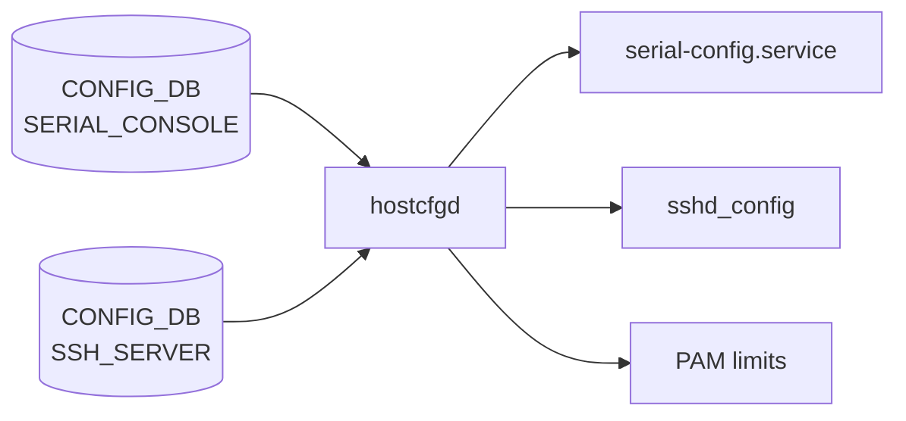

# SERIAL_CONSOLE / SSH_SERVER テーブル

## 概要

`SERIAL_CONSOLE` と `SSH_SERVER` はどちらも **CLI セッションのセキュリティポリシー** を保持する CONFIG_DB テーブル群[^1][^2]。  
`SERIAL_CONSOLE|POLICIES` はシリアルコンソールの不活動タイムアウトと Linux SysRq 機能の有効化を制御し、
`SSH_SERVER|POLICIES` は SSH デーモン (`sshd`) の認証パラメータ・タイムアウト・暗号スイート等を制御する。

`hostcfgd` が両テーブルを購読し、変化を `sshd_config` ファイルや PAM limits・systemd サービス再起動に反映する。

<!-- cdb-mermaid -->
### データフロー (自動生成)



!!! note "凡例"
    CONFIG_DB から各サービスまでの典型経路を示すミニ図。詳細は本ページ本文を参照。
<!-- /cdb-mermaid -->

## key 構造

```text
SERIAL_CONSOLE|POLICIES
SSH_SERVER|POLICIES
```

両テーブルとも固定キー `POLICIES` のシングルトンエントリ。

## SERIAL_CONSOLE フィールド

| フィールド | 型 | YANG default | 説明 |
|-----------|-----|-------------|------|
| `inactivity_timeout` | int32 (0..35000) | `15` (分) | シリアルコンソールの無操作タイムアウト (分単位)。0 で無効化 |
| `sysrq_capabilities` | `enabled`/`disabled` | `disabled` | Linux SysRq キー機能の有効化 |

## SSH_SERVER フィールド

| フィールド | 型 | YANG default | 説明 |
|-----------|-----|-------------|------|
| `authentication_retries` | uint32 (1..100) | `6` | 1 接続あたりの最大認証試行回数 (`MaxAuthTries`) |
| `login_timeout` | uint32 (1..600) | `120` (秒) | 認証完了までの最大待機時間 (`LoginGraceTime`) |
| `ports` | string (カンマ区切り) | `"22"` | SSH デーモンがリッスンする TCP ポート番号 (`Port`) |
| `inactivity_timeout` | uint32 (0..35000) | `15` (分) | SSH セッションの無操作タイムアウト (分単位)。0 で無効化 |
| `max_sessions` | uint32 (0..100) | `0` | 最大同時 SSH セッション数。0 は無制限 |
| `permit_root_login` | enum | なし | root ログインの許可 (`yes`/`prohibit-password`/`forced-commands-only`/`no`) |
| `password_authentication` | boolean | `true` | パスワード認証の有効化 |
| `ciphers` | leaf-list enum | なし | 許可する暗号アルゴリズムの一覧 |
| `kex_algorithms` | leaf-list enum | なし | 許可する鍵交換アルゴリズムの一覧 |
| `macs` | leaf-list enum | なし | 許可する MAC アルゴリズムの一覧 |

<!-- defaults -->
## コード由来の暗黙デフォルト (Phase A)

### SERIAL_CONSOLE|POLICIES

| フィールド | YANG default | DB 単位 | 実効値 | コード由来暗黙デフォルト |
|-----------|-------------|---------|-------|------------------------|
| `inactivity_timeout` | `15` (分) | 分 | `TMOUT=900` 秒 | `tmout-env.sh.j2` がデフォルト 900 秒 (L2) を内包。DB 不在時も 900 秒が適用される |
| `sysrq_capabilities` | `disabled` | enum | `/proc/sys/kernel/sysrq=0` | なし (YANG default が権威) |

### SSH_SERVER|POLICIES

| フィールド | YANG default | sshd_config パラメータ | コード由来暗黙デフォルト |
|-----------|-------------|----------------------|------------------------|
| `authentication_retries` | `6` | `MaxAuthTries` | なし |
| `login_timeout` | `120` (秒) | `LoginGraceTime` | なし |
| `ports` | `"22"` | `Port` | なし |
| `inactivity_timeout` | `15` (分) | `ClientAliveInterval` (秒×60) | 分→秒変換ロジック (hostcfgd L1129-1131)。実効値 `ClientAliveInterval 900` |
| `max_sessions` | `0` | PAM limits のみ | `0` → PAM 設定なし (無制限)。sshd_config の `MaxSessions` には反映されない |
| `password_authentication` | `true` | `PasswordAuthentication` | DB 値 `"false"` → `"no"`、それ以外 → `"yes"` (hostcfgd L1132-1143) |
| `permit_root_login` | なし | `PermitRootLogin` | DB 不在 → OpenSSH デフォルト `prohibit-password` が暗黙的に有効 |
| `ciphers` / `kex_algorithms` / `macs` | なし | `Ciphers` / `KexAlgorithms` / `MACs` | DB 不在 → OpenSSH 組み込みデフォルト |

### 特記事項

- **`inactivity_timeout` 単位乖離 (両テーブル共通)**: DB 値は **分単位**、実効値は秒単位 (×60 変換)。`show serial_console` / `show ssh` のフォールバック表示 `'900 <default>'` は秒単位のため、CLI 操作者が混乱しやすい。<!-- evidence: tmout-env.sh.j2 L2,L6; hostcfgd L1129-1131; show/main.py L2883,L2903 -->
- **`max_sessions` は sshd_config 非反映**: `SSH_CONFIG_NAMES` マップに登録されておらず `set_policies()` 内でスキップ。`PamLimitsCfg` 経由で `/etc/security/limits.d/` の `maxlogins` に反映される。<!-- evidence: hostcfgd L1418-1441 -->
- **`inactivity_timeout` の `ClientAliveCountMax`**: hostcfgd は `ClientAliveCountMax` を sshd_config に書かない。OpenSSH デフォルト (3) が有効。timeout = `ClientAliveInterval × ClientAliveCountMax` = `900 × 3 = 2700` 秒が実際の切断時間。
- **`serial-config.service` 再起動**: SERIAL_CONSOLE のいずれかのフィールドが変化すると hostcfgd が `service serial-config restart` を実行する。進行中のシリアル接続が切断される可能性がある。<!-- evidence: hostcfgd L2031-2040 -->
<!-- /defaults -->

## 購読者

- `hostcfgd` (`sonic-host-services`) — 両テーブルを `ConfigDBConnector` で購読し、`sshd_config` / PAM limits / `serial-config.service` に変化を反映する

## 値依存挙動マトリクス

<!-- value-behavior -->
| フィールド | 値 | 挙動 |
|-----------|-----|------|
| `SERIAL_CONSOLE.inactivity_timeout` | `15` (デフォルト) | `TMOUT=900` 秒 — 15 分間無操作でシリアルセッション自動ログアウト |
| `SERIAL_CONSOLE.inactivity_timeout` | `0` | `TMOUT=0` — タイムアウト無効 |
| `SERIAL_CONSOLE.sysrq_capabilities` | `enabled` | `/proc/sys/kernel/sysrq=1` — Linux SysRq キー有効 |
| `SERIAL_CONSOLE.sysrq_capabilities` | `disabled` (デフォルト) | `/proc/sys/kernel/sysrq=0` — Linux SysRq キー無効 |
| `SSH_SERVER.inactivity_timeout` | `15` (デフォルト) | `ClientAliveInterval 900` — 15 分間無応答で SSH セッション切断 |
| `SSH_SERVER.inactivity_timeout` | `0` | `ClientAliveInterval 0` — タイムアウト無効 |
| `SSH_SERVER.max_sessions` | `0` (デフォルト) | PAM limits なし — 同時 SSH セッション数無制限 |
| `SSH_SERVER.max_sessions` | `>0` | PAM limits `/etc/security/limits.d/` に maxlogins を設定 |
| `SSH_SERVER.password_authentication` | `true` (デフォルト) | `PasswordAuthentication yes` |
| `SSH_SERVER.password_authentication` | `false` | `PasswordAuthentication no` |
| `SSH_SERVER.permit_root_login` | 未設定 | OpenSSH デフォルト `prohibit-password` が暗黙的に有効 |
| `SSH_SERVER.permit_root_login` | `yes` | root パスワードログイン許可 (非推奨) |
| `SSH_SERVER.permit_root_login` | `no` | root ログイン完全禁止 |
<!-- /value-behavior -->

<!-- cdb-exceptions -->
## 例外条件・特殊挙動

- **`inactivity_timeout` 0 指定の意味**: YANG は `range "0..35000"` を許容し、0 はタイムアウト無効。ただし sshd の `ClientAliveInterval 0` は「keepalive 送信なし」を意味するため、実際にはクライアント側の TCP タイムアウトに依存する挙動になる。
- **`ciphers` / `kex_algorithms` / `macs` の空 leaf-list**: YANG は leaf-list であり、DB に 1 エントリも存在しない場合は hostcfgd がそのフィールドを sshd_config に書かない。OpenSSH のデフォルト cipher suite が全面的に有効になる。
- **`serial-config.service` が存在しない環境**: consoleserver / serial-config サービスがインストールされていない環境では、hostcfgd の `run_cmd(['sudo', 'service', 'serial-config', 'restart'])` が失敗してエラーログを残すが、設定変更は DB に反映される。
- **`show ssh` の `max_session` キー誤り**: `show/main.py` L2904 では `serial_console_table.get('max_session', ...)` と単数形を参照しているが、DB キーは `max_sessions` (複数形)。フォールバック値 `'0 <default>'` が常に表示される潜在的 bug がある。<!-- evidence: show/main.py L2904 vs sonic-ssh-server.yang L57 -->
<!-- /cdb-exceptions -->

<!-- ref-triangle:start -->

## 関連リファレンス

- [YANG](../../reference/glossary.md#term-yang): `sonic-serial-console`、`sonic-ssh-server`

<!-- ref-triangle:end -->

## 引用元

[^1]: YANG 定義: `sonic-serial-console.yang`. <https://github.com/sonic-net/sonic-buildimage/blob/9ea932ec2e18f35e58268ec2e4456b1d4afd65cd/src/sonic-yang-models/yang-models/sonic-serial-console.yang>

[^2]: YANG 定義: `sonic-ssh-server.yang`. <https://github.com/sonic-net/sonic-buildimage/blob/9ea932ec2e18f35e58268ec2e4456b1d4afd65cd/src/sonic-yang-models/yang-models/sonic-ssh-server.yang>

## 関連ページ

- [CONFIG_DB index](index.md)
- [CONFIG_DB: CONSOLE_PORT / CONSOLE_SWITCH](console-port.md)

<!-- ops-hint -->
## 運用ヒント

### 典型値

- `SERIAL_CONSOLE|POLICIES`: `inactivity_timeout=15`（分）、`sysrq_capabilities=disabled`
- `SSH_SERVER|POLICIES`: `inactivity_timeout=15`（分）、`authentication_retries=6`、`ports=22`、`max_sessions=0`

### よくある誤設定

- `inactivity_timeout` に秒単位の値を入れる（例: `900`）→ 実際には 900 × 60 = 54000 秒 (15 時間) が適用される。**分単位で設定すること**。
- `max_sessions` を設定したのに `show ssh` で `0 <default>` と表示される → show コマンドの `max_session` (単数) キーバグのため表示が正しくない。`sonic-db-cli CONFIG_DB HGET 'SSH_SERVER|POLICIES' max_sessions` で実際の値を確認すること。
- `ciphers` 等を空リストにクリアしたい場合、DB からキーを完全削除する必要がある（空 leaf-list では hostcfgd がフィールドを書かないため OpenSSH デフォルトに戻る）。

### 確認コマンド

```bash
# シリアルコンソール設定確認
show serial_console
sonic-db-cli CONFIG_DB hgetall 'SERIAL_CONSOLE|POLICIES'

# SSH サーバー設定確認
show ssh
sonic-db-cli CONFIG_DB hgetall 'SSH_SERVER|POLICIES'

# 適用済み sshd_config の確認
sudo sshd -T | grep -E 'maxauthtries|logingracetimedead|port|clientaliveinterval|passwordauthentication'
```
<!-- /ops-hint -->

<!-- runtime-trace -->
## 実コンテナ動作トレース

### 段階 1 — Consumer 登録

`hostcfgd` が起動時に `CONFIG_DB` の `SERIAL_CONSOLE` / `SSH_SERVER` テーブルを `ConfigDBConnector.subscribe()` で購読する (hostcfgd L2481, L2480)。

### 段階 2 — CFG→システム反映

**SERIAL_CONSOLE 変化時**:
1. `serial_console_config_handler()` → `SerialConsoleCfg.update_serial_console_cfg()` (hostcfgd L2438-2440)
2. キャッシュと比較し変化があれば `service serial-config restart` を実行
3. `serial-config.sh` が `sonic-cfggen` で `tmout-env.sh.j2` / `sysrq-sysctl.conf.j2` を再生成
4. `TMOUT` 環境変数 / `/proc/sys/kernel/sysrq` に反映

**SSH_SERVER 変化時**:
1. `SshServer.policies_update()` (hostcfgd L1045+) → `set_policies()` → `modify_conf_file()`
2. `sshd_config` の対応行を直接書き換え + `sshd reload` または `sshd restart`
3. `max_sessions` のみ別経路: `PamLimitsCfg.read_max_sessions_config()` → `/etc/security/limits.d/` 更新

### 段階 3 — APPL→SAI

なし (カーネル / デーモン設定のみ、SAI 非経由)

### 段階 4 — タイミングと副作用

- sshd 設定変更は `sshd reload` (HUP シグナル) で適用。進行中の SSH セッションには影響しない場合が多い。
- serial-config.service 再起動は進行中のシリアルコンソール接続を切断する可能性がある。
<!-- /runtime-trace -->

<!-- entry-points -->
## 書き込み入り口 (Direction A)

### CLI

- `config serial_console inactivity-timeout <minutes>` → `SERIAL_CONSOLE|POLICIES.inactivity_timeout`
- `config serial_console sysrq-capabilities <enabled|disabled>` → `SERIAL_CONSOLE|POLICIES.sysrq_capabilities`
- `config ssh inactivity-timeout <minutes>` → `SSH_SERVER|POLICIES.inactivity_timeout`
- `config ssh max-sessions <n>` → `SSH_SERVER|POLICIES.max_sessions`
  - ソース: `sonic-utilities/config/main.py` (L9946-L9999)

### minigraph / sonic-cfggen

なし (SERIAL_CONSOLE / SSH_SERVER は minigraph 生成対象外)

### REST / gNMI

なし (対応 OpenConfig/SONiC YANG transformer なし)

### db_migrator

なし

### ビルド時デフォルト (init_cfg / j2 テンプレート)

なし。ただし `tmout-env.sh.j2` が DB 不在時のデフォルト 900 秒をコード内に持つ。

### ハードコードデフォルト

- `tmout-env.sh.j2` L2: `` — DB 不在時のシリアルコンソールタイムアウト

### ランタイム注入 (デーモン自動書き込み)

なし (hostcfgd は読み取り / 適用のみ)
<!-- /entry-points -->

<!-- derivation -->
## 派生・条件付き登録 (Phase 6/7)

### Phase 6: 値による他フィールド自動派生

| 条件 | 派生先 | evidence |
|---|---|---|
| `SSH_SERVER.inactivity_timeout` 設定 | `sshd_config` の `ClientAliveInterval` (分×60秒) | hostcfgd L1129-1131 |
| `SSH_SERVER.max_sessions` > 0 | PAM limits `/etc/security/limits.d/` の `maxlogins` | hostcfgd L1418-1441 |

### Phase 7: 条件付き module/manager 登録

| 条件 | 登録 module | evidence |
|---|---|---|
| 常時 | `hostcfgd` が `SERIAL_CONSOLE` / `SSH_SERVER` を購読 | hostcfgd L2480-2481 |

<!-- /derivation -->

<!-- handler-branching -->
### Phase 8: Handler メソッド内分岐

| Handler | 分岐条件 | 効果 | evidence |
|---|---|---|---|
| `serial_console_config_handler` | キャッシュと変化あり | `serial-config.service` 再起動 | hostcfgd L2031-2040 |
| `serial_console_config_handler` | キャッシュと変化なし | no-op | hostcfgd L2031 |
| `SshServer.set_policies` | `key == "inactivity_timeout"` | 分→秒変換 (×60) して `ClientAliveInterval` に書き込み | hostcfgd L1129-1131 |
| `SshServer.set_policies` | `key in ["ciphers", "kex_algorithms", "macs"]` | カンマ区切りに結合して対応 sshd directive に書き込み | hostcfgd L1139-1140 |
| `SshServer.set_policies` | `key == "max_sessions"` | `SSH_CONFIG_NAMES` にないためスキップ (PAM 経路へ) | hostcfgd L1144-1145 |
| `PamLimitsCfg` | `max_sessions == 0` | PAM limits 設定なし (無制限) | hostcfgd L1418-1441 |
| `PamLimitsCfg` | `max_sessions > 0` | `/etc/security/limits.d/` に maxlogins 書き込み | hostcfgd L1418-1441 |

<!-- /handler-branching -->

<!-- glossary-links-injected: d5320e852f7a -->
