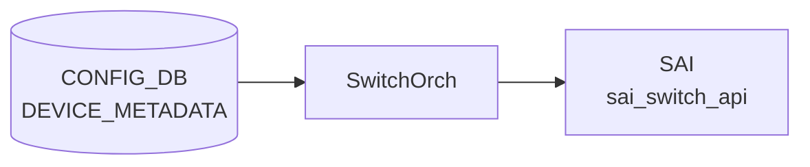

# cluster フィールド

## 概要

SONiC の [CONFIG_DB](../../reference/glossary.md#term-config_db) には独立した `CLUSTER` テーブルは存在しない。「cluster」概念は以下の 2 テーブルのフィールドとして実装されている[^1]。

| テーブル | キー | フィールド | 意味 |
|---------|------|-----------|------|
| `DEVICE_METADATA` | `localhost` | `cluster` | 自ノードの所属クラスタ名 |
| `DEVICE_NEIGHBOR_METADATA` | `<device_hostname>` | `cluster` | 隣接デバイスの所属クラスタ名 |

クラスタ名は **minigraph XML の `<ClusterName>` 要素**から派生し、`sonic-cfggen` / `minigraph.py` がデバイス起動時に CONFIG_DB へ書き込む。典型値は `"AAA00PrdStr00"` のようなデータセンター内の論理グループ識別子。

<!-- cdb-mermaid -->
### データフロー (自動生成)



!!! note "凡例"
    CONFIG_DB から SAI までの典型経路を `docs/reference/config-db-orch-map.md` から機械生成したミニ図。詳細・例外は本ページ本文と対応表を参照。
<!-- /cdb-mermaid -->

## key 構造

```text
DEVICE_METADATA|localhost
DEVICE_NEIGHBOR_METADATA|<device_hostname>
```

## フィールド詳細

| フィールド | 型 | YANG default | 実行時 fallback | 説明 |
|-----------|----|-------------|----------------|------|
| `cluster` | string | なし | `""` (空文字列) | 所属クラスタ名。minigraph の `<ClusterName>` から派生 |

## 暗黙デフォルト・コード由来挙動

<!-- defaults -->

### cluster フィールドの書き込み条件の非対称性

`cluster` フィールドには YANG `default` 文が存在しない (optional フィールド)。書き込み挙動はテーブルによって異なる。

#### DEVICE_METADATA|localhost.cluster

```python
# minigraph.py:2170-2172
cluster = [devices[key] for key in devices if key.lower() == hostname.lower()][0].get('cluster', "")
if cluster:                                            # truthy check — 空文字列はスキップ
    results['DEVICE_METADATA']['localhost']['cluster'] = cluster
```

- minigraph XML に `<ClusterName>` が**存在しない**場合: `get('cluster', "")` により `""` が得られ、`if cluster:` が False → **フィールドを書き込まない**
- `<ClusterName>` が**存在し非空**の場合のみ書き込まれる
- DB にフィールドが存在しない場合の消費側 fallback: 空文字列 `""` (`.get('cluster', '')` パターン)

#### DEVICE_NEIGHBOR_METADATA|<device>.cluster

```python
# minigraph.py:662-668
(_, _, _, _, name, hwsku, d_type, deployment_id, cluster, d_subtype, slice_type) = parse_device(device)
device_data = {}
if cluster != None:                                    # None check — 空文字列 "" は書き込まれる
    device_data['cluster'] = cluster
```

```python
# minigraph.py (parse_device):493,514-515
cluster = None                                        # 初期値 None
elif node.tag == str(QName(ns, "ClusterName")):
    cluster = node.text                               # XML タグが存在すれば text を代入 (空文字列の場合も代入)
```

- `<ClusterName>` タグが**存在しない**場合: `cluster = None` のまま → `if cluster != None:` が False → 書き込まない
- `<ClusterName>` タグが**存在し空文字列**の場合: `cluster = ""` → `if cluster != None:` が True → 空文字列 `""` が書き込まれる (DEVICE_METADATA と挙動が異なる)
- `<ClusterName>` タグが**存在し非空**の場合: 値を書き込む

#### 非対称性のまとめ

| テーブル | 書き込み条件 | 空文字列の扱い |
|---------|------------|--------------|
| `DEVICE_METADATA|localhost` | `if cluster:` (truthy) | 書き込まない |
| `DEVICE_NEIGHBOR_METADATA|<dev>` | `if cluster != None:` (None check) | 書き込む (`""`) |

### YANG スキーマ

```yang
# sonic-device_metadata.yang:184-187
leaf cluster {
    type string;
    description "The switch is a member of this cluster.";
}

# sonic-device_neighbor_metadata.yang:39-42
leaf cluster {
    description "The switch is a member of this cluster";
    type string;
}
```

両 YANG モデルとも `default` 文なし、`mandatory` 文なし → optional フィールド。

<!-- /defaults -->

<!-- ordering -->
## 書込み順依存 (Phase B)

`cluster` フィールドは minigraph XML の `<ClusterName>` タグから `sonic-cfggen` が書き込む。`bgpcfgd` はこのフィールドを直接参照しないため、ordering の影響は限定的。

### 検出された順序依存

| # | 依存関係 | 方向 | 緩和策 |
|---|----------|------|--------|
| 1 | `DEVICE_NEIGHBOR_METADATA.cluster` パース → `DEVICE_METADATA.cluster` 書き込み | minigraph パース内で同一呼び出し（通常は問題なし） | `sonic-cfggen` が原子的に処理 |
| 2 | `cluster` フィールド → bgpcfgd | **依存なし** | bgpcfgd は `cluster` フィールドを参照しない |
| 3 | `DEVICE_METADATA` 全体書き込み → `swss_vars.j2` 展開 | 書き込み後に展開 | `cluster` 不在時は空文字列フォールバック |
| 4 | minigraph 再適用で `cluster` 削除 | **自動削除なし** | 手動 `sonic-db-cli CONFIG_DB hdel 'DEVICE_METADATA\|localhost' cluster` が必要 |

### 主要な制約詳細

**minigraph 再適用で cluster が残存する問題 (依存 #4)**: `sonic-cfggen -m minigraph.xml --write-to-db` を再実行した際、`<ClusterName>` タグが存在しない場合、`if cluster:` (truthy check) により `DEVICE_METADATA|localhost.cluster` の書き込み自体がスキップされる。既存の `cluster` フィールドは削除されないため、古いクラスタ名が DB に残存する。クリアするには `sonic-db-cli CONFIG_DB hdel 'DEVICE_METADATA|localhost' cluster` を手動実行すること（evidence: `minigraph.py:2170-2172`）。

**CHASSIS_APP_DB との非連携**: `cluster` フィールドは CONFIG_DB (`DEVICE_METADATA` / `DEVICE_NEIGHBOR_METADATA`) にのみ存在し、CHASSIS_APP_DB との直接連携はない。VOQ 構成における `SYSTEM_NEIGH` 等とも独立している。

<!-- /ordering -->

## 書き込み入り口 (Direction A)

対象テーブル: `DEVICE_METADATA` / `DEVICE_NEIGHBOR_METADATA` の `cluster` フィールド

### minigraph / sonic-cfggen

- `sonic-cfggen -m /etc/sonic/minigraph.xml -d` — `<ClusterName>` タグが存在する場合に書き込み
  - ソース: `sonic-buildimage/src/sonic-config-engine/minigraph.py`

### CLI

- なし (CLI から `cluster` フィールドを直接書き込む手段は提供されていない)

### REST / gNMI (sonic-mgmt-common)

- なし

### db_migrator

- なし (migration 対象外)

### ビルド時デフォルト

- なし

### ランタイム注入

- なし

## 消費側 (Direction B)

| 消費元 | 参照箇所 | 使用目的 |
|-------|---------|---------|
| `minigraph.py:2170` | `get('cluster', "")` | 自ノード cluster 名を DEVICE_METADATA に書き込む前処理 |
| `swss_vars.j2` | Jinja2 変数参照 | template 展開 (存在しない場合は空文字列) |

## 関連 CONFIG_DB / YANG / CLI

- 親テーブル: [`DEVICE_METADATA`](./device-metadata.md)、[`DEVICE_NEIGHBOR_METADATA`](./device-neighbor-metadata.md)
- 関連 [YANG](../../reference/glossary.md#term-yang): `sonic-device_metadata`、`sonic-device_neighbor_metadata`

<!-- cross-refs -->
## 暗黙参照 — ランタイム消費デーモン調査 (Phase C)

`cluster` フィールドはコードベース全体を grep した結果、**ランタイムで読み出すデーモンが存在しない write-only フィールド**であることが確認された。

### CONFIG_DB 消費側

| 参照候補 | `cluster` フィールド参照 | 実際の参照フィールド | evidence |
|---------|------------------------|-------------------|---------|
| `bgpcfgd` (`managers_bgp.py`) | **なし** | `name` (ready check のみ) | `managers_bgp.py:220-222` |
| `bgpcfgd` テンプレート (`*.j2`) | **なし** | — | grep 0 件 |
| `buffers_config.j2` | **なし** | `DEVICE_NEIGHBOR_METADATA[...].type` | `buffers_config.j2:83,209-210` |
| `qos_config.j2` | **なし** | `DEVICE_NEIGHBOR_METADATA[...].type` | `qos_config.j2:107-116,150-151` |
| `swss_vars.j2` | **なし** | — | grep 0 件 |
| `hostcfgd` | **なし** | — | grep 0 件 |
| `orchagent` | **なし** | — | grep 0 件 |

> `bgpcfgd` は `DEVICE_NEIGHBOR_METADATA` テーブル全体を subscribe (`managers_bgp.py:140`) するが、`cluster` フィールドは参照せず、`name` の存在確認 (neighbor ready チェック) のみを行う。

### 書き込み経路（再確認）

`cluster` フィールドを書き込むのは `minigraph.py` のみであり、書き込み後は何れのデーモンもこのフィールドを読まない。

| 書き込み元 | 対象テーブル | evidence |
|-----------|------------|---------|
| `minigraph.py:668` | `DEVICE_NEIGHBOR_METADATA\|<device>` | `sonic-buildimage/src/sonic-config-engine/minigraph.py:662-668` |
| `minigraph.py:811` | `DEVICE_NEIGHBOR_METADATA\|<device>` (chassis 用途) | `sonic-buildimage/src/sonic-config-engine/minigraph.py:806-811` |
| `minigraph.py:2172` | `DEVICE_METADATA\|localhost` | `sonic-buildimage/src/sonic-config-engine/minigraph.py:2170-2172` |

### 用途

`cluster` フィールドは **minigraph XML から CONFIG_DB への一方向伝達** のみを目的とする。他のシステムコンポーネント（デーモン・テンプレート・CLI）がこのフィールドを読んで動作を変える経路はない。フィールドが存在するかどうかによる副作用もない（デーモン起動失敗・警告ログなし）。

<!-- /cross-refs -->

<!-- ref-triangle:start -->

## 関連リファレンス

- CONFIG_DB: [`DEVICE_METADATA`](./device-metadata.md)
- CONFIG_DB: [`DEVICE_NEIGHBOR_METADATA`](./device-neighbor-metadata.md)
- [YANG](../../reference/glossary.md#term-yang): `sonic-device_metadata`
- [YANG](../../reference/glossary.md#term-yang): `sonic-device_neighbor_metadata`

<!-- ref-triangle:end -->

## 引用元

[^1]: YANG 定義: `sonic-device_metadata.yang` L184-187, `sonic-device_neighbor_metadata.yang` L39-42. <https://github.com/sonic-net/sonic-buildimage/blob/9ea932ec2e18f35e58268ec2e4456b1d4afd65cd/src/sonic-yang-models/yang-models/sonic-device_metadata.yang>

<!-- ops-hint -->
## 運用ヒント

### cluster 名の確認

```bash
# 自ノードの cluster 名確認
sonic-db-cli CONFIG_DB hget 'DEVICE_METADATA|localhost' cluster

# 隣接デバイスの cluster 名確認 (例: ARISTA01T1)
sonic-db-cli CONFIG_DB hget 'DEVICE_NEIGHBOR_METADATA|ARISTA01T1' cluster
```

### cluster 名が設定されない場合

minigraph XML に `<ClusterName>` タグが存在しない構成では、フィールドが DB に存在しない。`hget` の結果が空になるが、これは正常。消費側コードは空文字列として処理する。

<!-- /ops-hint -->

<!-- cdb-exceptions -->
## 例外条件・特殊挙動

| 条件 | テーブル | 挙動 |
|------|---------|------|
| `<ClusterName>` タグなし | `DEVICE_METADATA` | フィールドを書き込まない (`if cluster:` False) |
| `<ClusterName>` タグなし | `DEVICE_NEIGHBOR_METADATA` | フィールドを書き込まない (`cluster = None`, `if cluster != None:` False) |
| `<ClusterName>` タグあり・空文字列 | `DEVICE_METADATA` | 書き込まない (truthy check で "" はスキップ) |
| `<ClusterName>` タグあり・空文字列 | `DEVICE_NEIGHBOR_METADATA` | 空文字列 `""` を書き込む (None check のため通過) |

> **Evidence**: `sonic-buildimage` `src/sonic-config-engine/minigraph.py:493,514-515,662-668,2170-2172`
<!-- /cdb-exceptions -->

<!-- failure -->
## 失敗挙動 (Phase D)

<!-- evidence: meta/_intermediate/cdb-flow/cluster-failure.md -->
<!-- source: sonic-buildimage/src/sonic-config-engine/minigraph.py -->

### 失敗パス一覧

| # | 失敗トリガー | 影響 | ログ |
|---|------------|------|------|
| 1 | `devices` dict に hostname 不一致 (自ノード未登録) | `sonic-cfggen` が `IndexError` でクラッシュ → CONFIG_DB 書き込み全失敗 | なし (例外のみ) |
| 2 | `<ClusterName>` が空タグ (`node.text = None`) | `cluster` フィールド書き込みスキップ (silent) | なし |
| 3 | `<ClusterName>` に任意文字列 | YANG `type string` が許容 → そのまま書き込まれる | なし |
| 4 | 空文字列 `""` | `DEVICE_METADATA` には書かれず、`DEVICE_NEIGHBOR_METADATA` には書かれる (非対称) | なし |

### 詳細

#### 1. hostname 不一致 → `IndexError` クラッシュ

`minigraph.py:2170`:

```python
cluster = [devices[key] for key in devices if key.lower() == hostname.lower()][0].get('cluster', "")
```

`devices` dict に `hostname` と大文字・小文字を無視して一致するキーが存在しない場合、リスト内包式の結果が空リストとなり `[0]` アクセスで `IndexError` が送出される。`parse_xml()` は例外を補足しないため `sonic-cfggen` が非ゼロ終了コードで終了し、CONFIG_DB への書き込みは一切行われない。ただし `devices` は `PngDec`/`MetadataDeclaration` から構築される際に自ノードが含まれるのが通常であり、実運用での発生条件は minigraph XML の `<Hostname>` と実際のホスト名が不一致のケースに限られる。

#### 2. 空タグ → `None` → silent スキップ

XML に `<ClusterName></ClusterName>` (空タグ) が存在する場合、`node.text` は `None`。`parse_device()` は `cluster = None` のまま返す。

- `DEVICE_NEIGHBOR_METADATA`: `if cluster != None:` が `False` → 書き込みスキップ
- `DEVICE_METADATA`: `if cluster:` が `False` (None は falsy) → 書き込みスキップ

エラーログ・警告は出力されない。

#### 3 & 4. 空文字列の非対称挙動

`<ClusterName>` タグが存在し `node.text = ""` の場合:

- `DEVICE_NEIGHBOR_METADATA` (`minigraph.py:667`): `if cluster != None:` → 空文字列は `None` でないため通過 → `cluster = ""` が DB に書き込まれる
- `DEVICE_METADATA` (`minigraph.py:2170-2172`): `cluster = devices[...][0].get('cluster', "")` で `""` を取得後、`if cluster:` → 空文字列は falsy → 書き込みスキップ

`cluster` フィールドがランタイムで消費されるデーモンは存在しないため、この非対称性による実害はない (Phase C 調査済み)。

!!! note "ランタイム失敗なし"
    `cluster` は write-only フィールド。DB への書き込み完了後、orchagent・bgpcfgd・linkmgrd 等はこのフィールドを参照しないため、書き込み後の失敗パスは存在しない。

<!-- /failure -->

<!-- constants -->
## ハードコード定数 (Phase E)

> 根拠: `minigraph.py` 全行精読。evidence: `meta/_intermediate/cdb-flow/cluster-constants.md`

`cluster` フィールドに関して minigraph.py にハードコードされている定数・判定パターンの一覧。ランタイム消費デーモンが存在しないため、定数は書き込み側 (`sonic-cfggen` / `minigraph.py`) にのみ存在する。

### minigraph.py 内ハードコード定数

| 定数 / パターン | 値 | 用途 | ソース |
|----------------|-----|------|--------|
| XML タグ名 | `"ClusterName"` | minigraph XML からクラスタ名を読み出すタグ名。リテラルとして埋め込み | `minigraph.py:514` |
| CONFIG_DB フィールドキー | `"cluster"` | DEVICE_METADATA / DEVICE_NEIGHBOR_METADATA の両テーブルで共通のフィールド名 | `minigraph.py:668, 811, 2172` |
| `parse_device()` 初期値 | `None` | cluster 変数を `None` で初期化。XML タグが存在しない場合はこのまま返却 | `minigraph.py:493` |
| `get()` フォールバック | `""` (空文字列) | `devices[...].get('cluster', "")` の第 2 引数。DEVICE_METADATA 書き込み前の展開値 | `minigraph.py:2170` |

### 書き込み判定条件の非対称性（暗黙の仕様定数）

| テーブル | 条件式 | 効果 | ソース |
|---------|--------|------|--------|
| `DEVICE_METADATA\|localhost` | `if cluster:` (truthy) | 空文字列 `""` と `None` を書き込まない | `minigraph.py:2171` |
| `DEVICE_NEIGHBOR_METADATA\|<device>` | `if cluster != None:` | 空文字列 `""` は書き込む。`None` のみ除外 | `minigraph.py:667, 810` |

### YANG / ランタイム側のハードコードなし

- YANG モデル (`sonic-device_metadata.yang`, `sonic-device_neighbor_metadata.yang`) に `default` 値なし
- `type string` のみで値制約なし
- ランタイム消費デーモン (orchagent / bgpcfgd / hostcfgd 等) は `cluster` フィールドを参照しないため、ランタイム側のハードコード定数は存在しない

<!-- /constants -->

<!-- side-effects -->
## 副次 DB 書込 (Phase F)

<!-- evidence: meta/_intermediate/cdb-flow/cluster-side.md -->

`cluster` フィールドは minigraph XML から CONFIG_DB への**一方向書き込みのみ**を目的としており、SET/DEL に伴い他の DB エントリへの書き込みが発生することはない。

### 調査結果サマリ

| 対象 DB | 副次書き込みの有無 | 根拠 |
|---------|-----------------|------|
| APPL_DB | **なし** | portmgrd / neighsyncd / bgpcfgd は `cluster` フィールドを参照しない |
| STATE_DB | **なし** | `cluster` 値に依存する STATE_DB 書き込み経路が存在しない |
| COUNTERS_DB | **なし** | SAI と無関係なフィールドのため |
| FLEX_COUNTER_DB | **なし** | 同上 |
| ASIC_DB | **なし** | 同上 |

### 根拠詳細

`DEVICE_NEIGHBOR_METADATA` テーブルを subscribe するデーモン (`bgpcfgd` / `buffers_config.j2` / `qos_config.j2`) はいずれも **`type` フィールドのみ**を参照し、`cluster` フィールドを読み出さない（`buffers_config.j2:83,209-210`、`qos_config.j2:107-116,150-151`、`managers_bgp.py:140,220-222`）。

`portmgrd` は CONFIG_DB `DEVICE_METADATA` を参照する際も `cluster` フィールドには触れない。

Phase C (cross-refs) 調査でコードベース全体を grep した結果、ランタイムで `cluster` フィールドを読み出すコンポーネントが存在しないことが確認されており、副次書き込みのトリガとなる経路は存在しない。

!!! note "write-only フィールド"
    `cluster` は `sonic-cfggen` / `minigraph.py` による起動時一括書き込み後、どのデーモンも参照しない write-only フィールド。SET/DEL 後の副次 DB 書き込みは発生しない。

<!-- /side-effects -->

<!-- pubsub -->
## 通信メカニズム (Phase G)

> 調査対象: `sonic-buildimage/src/sonic-config-engine/minigraph.py`、`sonic-swss/cfgmgr/buffermgr.cpp`、`sonic-swss/cfgmgr/buffermgrdyn.cpp`、`sonic-swss` orchagent 全体 grep
> 調査日: 2026-05-18; 詳細分析 `meta/_intermediate/cdb-flow/cluster-pubsub.md`

`cluster` フィールドの通信構造は **Producer 1 名・Consumer 0 名** という極めてシンプルな形態。

### Producer/Consumer ペア

| 区間 | 方式 | チャンネル/パターン |
|------|------|-------------------|
| `sonic-cfggen` / `minigraph.py` → CONFIG_DB[DEVICE_METADATA\|localhost] | Redis `HSET` 直接書き込み（起動時 1 回） | — |
| `sonic-cfggen` / `minigraph.py` → CONFIG_DB[DEVICE_NEIGHBOR_METADATA\|<dev>] | Redis `HSET` 直接書き込み（起動時 1 回） | — |
| CONFIG_DB[DEVICE_METADATA] → ランタイムデーモン | **なし** | — |
| CONFIG_DB[DEVICE_NEIGHBOR_METADATA] → ランタイムデーモン | **なし** | — |

`DEVICE_METADATA` を `SubscriberStateTable` 経由で購読するデーモン (`BufferMgr` 等) は存在するが、参照フィールドはそれぞれ異なる内部フィールド (`buffer_model`, `platform` 等) のみであり、`cluster` フィールドへの反応は一切実装されていない。

### Producer 詳細: sonic-cfggen / minigraph.py

`minigraph.py` は minigraph XML を解析し、起動時に Redis `HSET` で CONFIG_DB へ直接書き込む。`ProducerStateTable` を経由しないため、対応する `ConsumerStateTable` も存在しない。

```
minigraph XML (<ClusterName>) → minigraph.py parse_device()
  → CONFIG_DB[DEVICE_NEIGHBOR_METADATA|<dev>].cluster  (HSET, 起動時)
  → CONFIG_DB[DEVICE_METADATA|localhost].cluster        (HSET, 起動時)
```

### 購読なし（write-only フィールド）の理由

`cluster` はデータセンター内のネットワーク論理グループ識別子であり、SONiC ランタイムの転送・バッファ・ACL 処理には影響しない。SONiC のデーモン群は自ノードの `cluster` 名を参照して動作を変える設計を持たないため、`SubscriberStateTable` / `ConsumerStateTable` によるリアルタイム通知チャンネルが存在しない。

!!! note "keyspace 通知は発火するが受信者なし"
    `sonic-cfggen` が `HSET "DEVICE_METADATA|localhost" cluster <name>` を実行すると Redis keyspace 通知 (`__keyspace@4__:DEVICE_METADATA|localhost`) は発火する。しかし、この通知を `cluster` フィールドとして処理するデーモンが存在しないため、通知は実質的に無効。

> **Evidence**: `minigraph.py:2170-2172, 662-668, 806-811` (書き込み); `buffermgr.cpp:373-408` (`doBufferMetaTask` — `buffer_model` のみ参照、`cluster` は無視); `buffermgrdyn.cpp:87` (`hget platform` のみ); sonic-swss 全体 grep 結果: `"cluster"` ヒット 1 件はコメント行のみ
<!-- /pubsub -->

<!-- platform -->
## プラットフォーム差異 (Phase H)

> 根拠: `sonic-buildimage/src/sonic-config-engine/minigraph.py` 全行精査; 詳細 `meta/_intermediate/cdb-flow/cluster-platform.md`

### SAI 非経由フィールド

`cluster` は CONFIG_DB (`DEVICE_METADATA` / `DEVICE_NEIGHBOR_METADATA`) にのみ書き込まれ、SAI・ASIC を経由しない。ASIC ベンダー (Broadcom / Mellanox / Marvell / Innovium 等) による差異はない。

### シングル ASIC vs マルチ ASIC

`cluster` フィールドの書き込みは 2 つのコードパスで実施される。

| 構成 | 呼び出し関数 | 書き込み先 | ロジック差異 |
|------|------------|-----------|------------|
| シングル ASIC / 非チャーシス | `parse_png()` | `DEVICE_NEIGHBOR_METADATA\|<dev>` | `if cluster != None:` のみ |
| マルチ ASIC / チャーシス | `parse_asic_png()` | 各 ASIC namespace の `DEVICE_NEIGHBOR_METADATA\|<dev>` | `if cluster != None:` のみ（同一） |
| 全構成共通 | `parse_xml()` (L2170) | `DEVICE_METADATA\|localhost` | `if cluster:` (truthy check) |

マルチ ASIC 環境では ASIC-scope minigraph ごとに `parse_asic_png` が呼ばれ、各 namespace の `DEVICE_NEIGHBOR_METADATA` に書き込む。書き込み条件はシングル ASIC 版と同一であり、プラットフォーム固有の差異はない。

### VOQ / switch_type 依存

`cluster` フィールドの処理パスに `gMySwitchType` / `is_voq_mode()` / `is_chassis_device()` 等の switch_type 条件分岐は存在しない。VOQ chassis 構成でも各 host が独立して `DEVICE_METADATA|localhost` に自ノードの cluster 名を書き込む。

### supervisor / linecard 構成

チャーシス構成 (supervisor + line cards) では各 line card host が独立して `minigraph.py` / `sonic-cfggen` を実行する。`cluster` フィールドは host スコープであり、supervisor から line card への集中書き込み機構は存在しない。

### まとめ

| 観点 | 差異 |
|------|------|
| ASIC ベンダー | なし（SAI 非経由） |
| シングル vs マルチ ASIC | ロジック同一。書き込み関数が異なるが条件・値は変わらない |
| VOQ chassis | なし（`switch_type` 条件分岐なし） |
| supervisor / linecard | host 単位で独立適用 |

<!-- /platform -->

