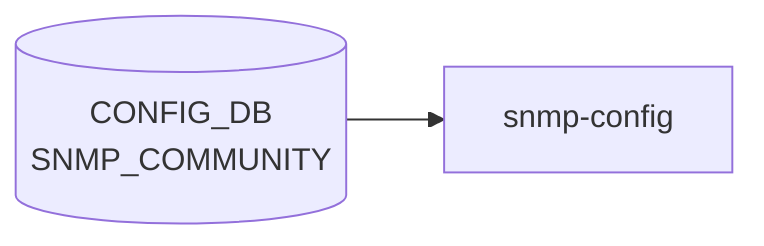

# SNMP_COMMUNITY テーブル

## 概要

[SNMPv1](../../reference/glossary.md#term-snmp)/v2c コミュニティ文字列を [CONFIG_DB](../../reference/glossary.md#term-config_db) に登録するテーブル[^1]。`sonic-snmp.yang` の `SNMP_COMMUNITY_LIST` で定義される。`docker-snmp` コンテナ起動時に `snmpd.conf.j2` テンプレートが本テーブルを読み取り、`rocommunity` / `rwcommunity` / `rocommunity6` / `rwcommunity6` ディレクティブを `snmpd.conf` に生成する。`snmp_yml_to_configdb.py` がブート時に `/etc/sonic/snmp.yml` からもエントリを注入する。

<!-- cdb-mermaid -->
### データフロー (自動生成)



!!! note "凡例"
    CONFIG_DB から SAI までの典型経路を `docs/reference/config-db-orch-map.md` から機械生成したミニ図。詳細・例外は本ページ本文と対応表を参照。
<!-- /cdb-mermaid -->

## key 構造

```text
SNMP_COMMUNITY|<community_name>
```

`name` が key。YANG 制約: 長さ 4〜32 文字、SPACE / シングルクォート / `@` / `,` / `\` を含む文字列は禁止。

## フィールド

| フィールド | 型 | 説明 |
|-----------|----|------|
| `TYPE` | enum `RO` / `RW` | コミュニティアクセス種別。`RO` = 読み取り専用、`RW` = 読み取り/書き込み |

`name` は key としてのみ存在し、ハッシュフィールドには現れない。

## 制約

- `name` の長さ: 4〜32 文字 (`length "4..32"`)
- 禁止文字: SPACE / `'` (single quote) / `@` / `,` / `\`（YANG `pattern` 制約）
- CLI 側追加検証: `@` と `:` を含む community 名を拒否（`snmp_community_secret_check` 関数）
- `TYPE` は YANG で `mandatory` 宣言なし — CLI 経由では常に指定が必要だが、直接 DB 書き込みでは省略可能

## 購読者

- `docker-snmp` の `snmpd.conf.j2` テンプレート: `SNMP_COMMUNITY` → `rocommunity`/`rwcommunity`/`rocommunity6`/`rwcommunity6` ディレクティブ生成
- `snmp_yml_to_configdb.py`: ブート時に `/etc/sonic/snmp.yml` から注入

## 関連 CONFIG_DB / YANG / CLI

- 関連 [CONFIG_DB](../../reference/glossary.md#term-config_db): [`SNMP`](snmp.md)、[`SNMP_AGENT_ADDRESS_CONFIG`](snmp-agent-address-config.md)、`SNMP_USER`
- 関連 [YANG](../../reference/glossary.md#term-yang): `sonic-snmp`
- 関連 CLI: `config snmp community { add | del | replace }`

<!-- ref-triangle:start -->

## 関連リファレンス

- [YANG](../../reference/glossary.md#term-yang): [`sonic-snmp`](../yang/sonic-snmp.md)
- CLI: [`config snmp`](../cli/config-snmp.md)
- 関連ページ: [`SNMP`](snmp.md)、[`SNMP_AGENT_ADDRESS_CONFIG`](snmp-agent-address-config.md)

<!-- ref-triangle:end -->

## 引用元

[^1]: [YANG](../../reference/glossary.md#term-yang) 定義: `sonic-snmp.yang` container `SNMP_COMMUNITY` / list `SNMP_COMMUNITY_LIST`. <https://github.com/sonic-net/sonic-buildimage/blob/9ea932ec2e18f35e58268ec2e4456b1d4afd65cd/src/sonic-yang-models/yang-models/sonic-snmp.yang>

<!-- ops-hint -->
## 運用ヒント

### 典型値

- key 形式: `SNMP_COMMUNITY|<name>`。
- `TYPE: RO` で読み取り専用コミュニティ。`TYPE: RW` で読み書き可能コミュニティ。

### よくある誤設定

- `public` / `private` をデフォルトのまま使用すると外部から [SNMP](../../reference/glossary.md#term-snmp) アクセスが可能。本番では必ず変更する。
- community 名が 4 文字未満だと YANG バリデーションエラー。

### 確認コマンド

```bash
sonic-db-cli CONFIG_DB keys 'SNMP_COMMUNITY|*'
show snmp community
```
<!-- /ops-hint -->

<!-- value-behavior -->
## 値依存挙動マトリクス

| フィールド | 値 | 挙動 |
|-----------|-----|------|
| `TYPE` | `RO` | `snmpd.conf` に `rocommunity <name>` / `rocommunity6 <name>` が生成される。読み取り専用アクセスのみ許可。 |
| `TYPE` | `RW` | `snmpd.conf` に `rwcommunity <name>` / `rwcommunity6 <name>` が生成される。読み取り・書き込みアクセスを許可。 |
| `TYPE` | 未設定（省略） | テンプレートは `TYPE` の存在を前提にチェックするため、`TYPE` がない場合は `if SNMP_COMMUNITY[community]['TYPE'] == 'RO'` / `== 'RW'` のどちらにも一致せず、コミュニティ行が生成されない（サイレントスキップ）。 |
| テーブル全体 | エントリなし | テンプレートの `` が偽となり、コミュニティ行を一切出力しない。結果として全 [SNMP](../../reference/glossary.md#term-snmp) v1/v2c アクセスが拒否される。 |

<!-- /value-behavior -->

<!-- cdb-exceptions -->
## 例外条件・特殊挙動

- **SNMP_COMMUNITY 未定義時 → 全 v1/v2c アクセス拒否**: テーブルにエントリが 0 件の場合、`snmpd.conf.j2` の `` チェックが偽となり、コミュニティ設定行を出力しない。snmpd は community なしで起動し、全 SNMPv1/v2c アクセスを拒否する。<!-- evidence: snmpd.conf.j2 L48-55, L57-64 -->
- **TYPE 省略時のサイレントスキップ**: `TYPE` フィールドが欠如しているエントリは、`RO` / `RW` どちらにも一致しないため、snmpd.conf 行が生成されない。エラーログは出力されない。<!-- evidence: snmpd.conf.j2 L50-52, L59-61 -->
- **設定変更の反映は snmpd 再起動時のみ**: CONFIG_DB への書き込み後、`docker-snmp` コンテナ再起動 or `systemctl restart snmp.service` まで snmpd.conf への反映は行われない。CLI (`config snmp community add`) は変更後に自動で `systemctl restart snmp.service` を発行する。<!-- evidence: sonic-utilities/config/main.py L4398-4402 -->
- **snmp_yml_to_configdb.py の冪等性**: `snmp_yml_to_configdb.py` はブート時に `/etc/sonic/snmp.yml` から `SNMP_COMMUNITY` を注入するが、既存エントリ (`snmp_config_db_communities`) と重複する community は書き込まずスキップする。<!-- evidence: snmp_yml_to_configdb.py L36, L40, L44, L48 -->
- **IPv4 / IPv6 両方自動バインド**: `TYPE: RO` の場合 `rocommunity` と `rocommunity6` の両行が生成される。IPv4 と IPv6 を個別に制御する手段は本テーブルにはない。<!-- evidence: snmpd.conf.j2 L51-52 -->

<!-- cdb-defaults -->

<!-- defaults -->
## 暗黙デフォルト・コード由来挙動 (Phase A)

### `TYPE` フィールド — YANG mandatory なし、実装は値存在前提

- **YANG `mandatory` 宣言なし**: `sonic-snmp.yang` の `SNMP_COMMUNITY_LIST.TYPE` leaf は `mandatory true` を持たない。CLI では引数 `<RO|RW>` を必須として扱うが、direct DB 書き込み（`sonic-db-cli` や JSON 投入）では `TYPE` を省略したエントリを書き込める。<!-- evidence: sonic-snmp.yang L70-76 -->
- **`TYPE` 省略 → サイレントスキップ（コミュニティ行不生成）**: `snmpd.conf.j2` テンプレートは `== 'RO'` / `== 'RW'` の明示比較のみ行い、`TYPE` フィールドの存在チェックを行わない。`TYPE` がない場合は KeyError または比較不成立でコミュニティ行を生成しない。SNMP access は実質的に機能しなくなる（エラーログなし）。<!-- evidence: snmpd.conf.j2 L50-54, L59-63 -->
- **CLI は `TYPE` を自動大文字化**: `config snmp community add` は `string_type = string_type.upper()` で入力を大文字化してから `set_entry` を呼ぶ。直接 DB に `TYPE: ro`（小文字）を書き込んだ場合、テンプレートの `== 'RO'` 比較に不一致となりスキップされる。<!-- evidence: sonic-utilities/config/main.py L4378 -->

### `name` (key) — YANG 制約と CLI 制約の乖離

- **YANG 制約**: 長さ 4〜32 文字、禁止パターン `[^ @,\\']*`（SPACE / `'` / `@` / `,` / `\` を禁止）。YANG バリデーターが有効な場合のみ適用される。<!-- evidence: sonic-snmp.yang L61-65 -->
- **CLI 追加検証（ADHOC_VALIDATION 有効時のみ）**: `snmp_community_secret_check` は `@` と `:` を禁止する（32 文字超過も拒否）。YANG は `:` を明示禁止しておらず、CLI のみの制約。<!-- evidence: sonic-utilities/config/main.py L4309-4324 -->
- **YANG と CLI の禁止文字集合が異なる**: YANG では `,` と `\` を禁止しているが CLI は禁止しない。CLI では `:` を禁止しているが YANG は禁止しない。direct DB 書き込みでは YANG バリデーションのみが適用される。<!-- evidence: sonic-snmp.yang L62; sonic-utilities/config/main.py L4310 -->
- **大文字小文字感知**: community 名はそのまま FRR/snmpd の community-string として使用される。key の大文字/小文字は区別される。<!-- evidence: snmpd.conf.j2 L51 -->

### ブート時注入（snmp_yml_to_configdb.py）のデフォルト挙動

- **snmp.yml が存在しない場合**: `sys.exit(1)` で終了。`SNMP_COMMUNITY` への書き込みは発生しない。テーブルは空のまま。<!-- evidence: snmp_yml_to_configdb.py L25-27 -->
- **snmp_rocommunity / snmp_rwcommunity が snmp.yml に未定義の場合**: ループ条件 `if comm_type in yaml_snmp_info.keys()` で分岐するため、未定義キーはスキップされ対応 community は書き込まれない。<!-- evidence: snmp_yml_to_configdb.py L33 -->
- **既存 DB エントリとの重複時**: `if community not in snmp_config_db_communities` チェックにより、すでに DB に存在する community は上書きしない（冪等性）。`TYPE` の変更も行われない。<!-- evidence: snmp_yml_to_configdb.py L36, L40, L44, L48 -->
- **`snmp_rocommunities`（複数形）と `snmp_rocommunity`（単数形）の評価順**: `full_snmp_comm_list = ['snmp_rocommunity', 'snmp_rocommunities', 'snmp_rwcommunity', 'snmp_rwcommunities']` の順でループするが、コードは `startswith` で分岐するため `snmp_rocommunities` は `snmp_rocommunity` の `startswith` にも一致する。実際には `startswith('snmp_rocommunities')` 条件を先にチェックするため問題なし。<!-- evidence: snmp_yml_to_configdb.py L34-49 -->

### テンプレート生成の前提（IPv4/IPv6 非分離）

- **IPv4 と IPv6 は分離不可**: `TYPE: RO` 時は `rocommunity` と `rocommunity6` が同一コミュニティ名で生成される。IPv4 のみ / IPv6 のみに限定する仕組みは本テーブルにない。ネットワーク分離が必要な場合は snmpd.conf を直接編集する必要があるが、それは CONFIG_DB 管理外となる。<!-- evidence: snmpd.conf.j2 L51-52 -->
<!-- /defaults -->

<!-- ordering -->
## 書込み順依存 (Phase B)

### 1. replace コマンド: 新 community SET → 旧 community DEL（逆順禁止）

`config snmp community replace <current> <new>` は新 community を先に SET してから旧 community を DEL する順序で動作する（`config/main.py:4449-4454`）。

逆順（旧 DEL → 新 SET）にした場合、DEL 直後に snmpd 再起動が走ると新 community がまだ DB に存在しない瞬間が生じ、全 SNMPv1/v2c アクセスが一時的に拒否される。CLI は新旧両方が DB に存在する時間帯を作ることでこのリスクを回避している。

### 2. TYPE は大文字で書き込む（direct DB 書込み時）

`snmpd.conf.j2` は `SNMP_COMMUNITY[community]['TYPE'] == 'RO'` / `== 'RW'` と大文字で比較する（`snmpd.conf.j2:50,59`）。CLI は `string_type.upper()` で自動大文字化するが（`config/main.py:4376`）、`sonic-db-cli` などで直接書き込む場合は `TYPE: ro`（小文字）では比較に失敗し、snmpd.conf の community 行が生成されない（サイレントスキップ）。

### 3. 複数 community を一括 SET してから snmpd を 1 回再起動

[CONFIG_DB](../../reference/glossary.md#term-config_db) への SET/DEL は即時反映されず、`docker-snmp` コンテナ再起動（`systemctl restart snmp.service`）後にテンプレートが再生成される。CLI を使うと SET ごとに自動再起動が走るため非効率。direct DB 書込みで複数 community を一括投入する場合はすべての SET を完了してから 1 回の再起動を行うことで snmpd.conf が最終状態を一括生成できる（`config/main.py:4395-4401`）。

### 4. snmp_yml_to_configdb.py の注入順序（RO 単数 → RO 複数 → RW 単数 → RW 複数）

ブート時注入スクリプトは `full_snmp_comm_list = ['snmp_rocommunity', 'snmp_rocommunities', 'snmp_rwcommunity', 'snmp_rwcommunities']` の固定順でループする（`snmp_yml_to_configdb.py:31`）。既存 DB エントリと重複する community は冪等スキップするため、注入順序を変えても上書きは発生しない。

### 5. YANG unique 制約なし: 同一 name への重複 SET は上書き

`SNMP_COMMUNITY_LIST` に `unique` ステートメントなし（`sonic-snmp.yang:52-65`）。同一 `name` key で TYPE を変更したい場合は DEL 不要で上書き SET が可能。`SNMP_AGENT_ADDRESS_CONFIG` の `unique "agent_ip port"` とは異なる。

| # | 依存関係 | 方向 | 違反時の挙動 |
|---|----------|------|------------|
| 1 | replace: 新 community SET → 旧 community DEL | **CLI 固定順** | 逆順時: snmpd 再起動タイミングで全 v1/v2c アクセス一時拒否リスク |
| 2 | TYPE 書込み: 大文字必須（RO / RW） | **書込み前提** | 小文字（ro/rw）→ テンプレート比較失敗 → snmpd 行不生成（サイレント） |
| 3 | 一括 SET 後に snmpd を 1 回再起動 | **推奨順序** | SET ごとの再起動でも機能するが非効率 |
| 4 | snmp_yml_to_configdb.py 注入順序は固定（RO 単→複, RW 単→複） | **実装固定** | 重複 community は冪等スキップ（順序変更で上書き不可） |
<!-- /ordering -->

<!-- cross-refs -->
## 暗黙参照テーブル (Phase C)

YANG leafref および実装スキャンにより確認した参照関係。詳細スキャン証跡は `meta/_intermediate/cdb-flow/community-list-cross-refs.md` を参照。

### YANG レベル参照: なし

`sonic-snmp.yang` の `SNMP_COMMUNITY_LIST` は `leafref` / `augment` ステートメントを持たない。他テーブルへの YANG 依存なし、他テーブルからの leafref による被参照なし。

### テンプレートレベル協調依存（弱い依存）

`snmpd.conf.j2` は同一テンプレートレンダリングコンテキストで以下のテーブルを同時読み取りするが、YANG 制約なし。

| テーブル | 参照箇所 | 用途 | 欠如時の影響 |
|---------|---------|------|------------|
| [`SNMP_AGENT_ADDRESS_CONFIG`](snmp-agent-address-config.md) | `snmpd.conf.j2 L27-44` | agentAddress / agentPort 行生成 | `SNMP_AGENT_ADDRESS_CONFIG` なしでも SNMP_COMMUNITY 行は独立生成される |
| [`SNMP`](snmp.md) (CONTACT / LOCATION) | `snmpd.conf.j2 L88-95` | sysContact / sysLocation 行生成 | 同上（独立） |
| `SNMP_USER` | `snmpd.conf.j2 L66-76` | SNMPv3 rouser / rwuser 行生成 | 同上（独立） |

これらのテーブルは各自の `` ガードで独立して評価される。`SNMP_COMMUNITY` の有無が他テーブルの生成に影響することはなく、逆も然り。

### 被参照（逆参照）: なし

他テーブルから `SNMP_COMMUNITY` の key（community 名）を leafref で参照するテーブルは YANG スキャンで確認されない。

<!-- /cross-refs -->

<!-- failure -->
## 失敗挙動 (Phase D)

`SNMP_COMMUNITY` テーブルを消費する経路は `snmpd.conf.j2` テンプレート（バッチ読み取り）と `snmp_yml_to_configdb.py`（ブート時注入）の 2 本立てであり、それぞれ独立した失敗モードを持つ。詳細スキャン証跡は `meta/_intermediate/cdb-flow/community-list-failure.md` を参照。

### 検出された失敗パターン

| # | 失敗条件 | 症状 | ログ | 緩和策 |
|---|---------|------|------|--------|
| 1 | `/etc/sonic/snmp.yml` 不在 | `snmp_yml_to_configdb.py` が `sys.exit(1)` で終了、テーブル注入なし | `log_info: snmp.yml does not exist` | snmp.yml を配置してコンテナ再起動 |
| 2 | `snmp.yml` に `snmp_location` 未定義 | community 書き込み後に `sys.exit(1)`（community は書き込まれる、[SNMP](../../reference/glossary.md#term-snmp) テーブルへの LOCATION 注入は行われない） | `log_info: snmp_location does not exist` | snmp.yml に `snmp_location` を追加して再起動 |
| 3 | `TYPE` を小文字（`ro`/`rw`）で直接 DB 書き込み | `snmpd.conf.j2` の大文字比較に不一致、community 行が生成されない（サイレントスキップ） | なし | `sonic-db-cli` で `TYPE: RO`（大文字）に上書き → snmpd 再起動 |
| 4 | `TYPE` フィールド欠如（キーなし） | Jinja2 が `KeyError` または `Undefined` 比較で当該エントリをスキップ、community 行不生成 | なし | `set_entry` で `TYPE` を再設定 → snmpd 再起動 |
| 5 | ConfigDB（[Redis](../../reference/glossary.md#term-redis)）接続失敗 | `snmp_yml_to_configdb.py` が uncaught exception で終了、テーブル注入なし | OS レベルのスタックトレース | [Redis](../../reference/glossary.md#term-redis) / swsscommon を確認後に再試行 |
| 6 | YANG バリデーション失敗（CLI 経由） | `config snmp community add` がエラーを出力して中断、DB 書き込みなし | CLI に表示 | community 名を YANG 制約（4〜32 文字、禁止文字なし）に合わせて修正 |
| 7 | snmpd 設定変更後に再起動なし | 変更が snmpd に反映されない（古い community が有効のまま） | なし | `systemctl restart snmp.service` を手動実行 |

### 詳細

**snmp.yml 不在 (失敗 #1)**: `snmp_yml_to_configdb.py` は起動直後に `/etc/sonic/snmp.yml` の存在チェックを行う（`L25-27`）。ファイルが存在しない場合は `sys.exit(1)` で終了し、以降の community 注入は実行されない。`SNMP_COMMUNITY` テーブルが空のまま `docker-snmp` コンテナが起動すると、`snmpd.conf.j2` の `` が偽となり全 SNMPv1/v2c アクセスが拒否される。

**TYPE フィールド問題 (失敗 #3/#4)**: `snmpd.conf.j2` のテンプレートは `SNMP_COMMUNITY[community]['TYPE'] == 'RO'` / `== 'RW'` の厳格な文字列比較のみで分岐する（`snmpd.conf.j2 L50, L59`）。小文字（`ro`/`rw`）やフィールド欠如はいずれも community 行を生成せず、snmpd は当該 community を無視して起動する。エラーログ・例外は出力されない。

**設定変更の非即時性 (失敗 #7)**: `SNMP_COMMUNITY` は CONFIG_DB の購読ではなくコンテナ起動時の一括読み取りで消費されるため、実行中の snmpd プロセスには変更が通知されない。CLI (`config snmp community add/del/replace`) は変更後に `systemctl restart snmp.service` を自動発行（`config/main.py:4395-4401`）するが、`sonic-db-cli` など直接書き込み手段では手動再起動が必要。再起動中は既存 SNMP セッションが切断される。

> **スキャン証跡**: `snmpd.conf.j2` L48-64 / `snmp_yml_to_configdb.py` L25-56 読了。失敗時のリトライロジック・フォールバックは実装されていない。詳細は `meta/_intermediate/cdb-flow/community-list-failure.md` を参照。

<!-- /failure -->

<!-- constants -->
## ハードコード定数 (Phase E)

`SNMP_COMMUNITY` テーブルの処理に直接影響するコード内リテラル固定値。CONFIG_DB エントリでは制御できない。詳細スキャン証跡は `meta/_intermediate/cdb-flow/community-list-constants.md` を参照。

### YANG 制約固定値（name フィールド）

| 制約 | 値 | 出典 |
|------|----|------|
| `name` 最小長 | `4` 文字 | `sonic-snmp.yang L61: length "4..32"` |
| `name` 最大長 | `32` 文字 | `sonic-snmp.yang L61: length "4..32"` |
| `name` YANG 禁止文字 | SPACE / `'` / `@` / `,` / `\` | `sonic-snmp.yang L62: pattern` |
| `TYPE` 有効値 | `RO` / `RW`（大文字 2 値のみ） | `sonic-snmp.yang L71-74` |

### CLI 追加制約固定値（snmp_community_secret_check）

| 定数 | 値 | 出典 |
|------|----|------|
| CLI 追加禁止文字 | `['@', ':']` | `config/main.py L4310` |
| CLI 最大長 | `32` 文字 | `config/main.py L4311` |

> **YANG との非対称性**: YANG は `,` / `\` を禁止するが CLI リストにはない。CLI は `:` を禁止するが YANG には存在しない。direct DB 書き込みでは YANG 制約のみ適用。

### テンプレートレベル固定値（snmpd.conf.j2）

| 定数 | 値 | 用途 | 出典 |
|------|----|------|------|
| SNMP デフォルト待受ポート（IPv4/IPv6） | `161` | `SNMP_AGENT_ADDRESS_CONFIG` 未設定時の fallback | `snmpd.conf.j2 L32-33` |
| AgentX ソケット | `tcp:localhost:3161` | docker-fpm-frr SNMP subagent との IPC | `snmpd.conf.j2 L207` |
| AgentX タイムアウト | `5` 秒 | `agentXTimeout 5` 固定 | `snmpd.conf.j2 L197` |
| AgentX リトライ | `4` 回 | `agentXRetries 4` 固定 | `snmpd.conf.j2 L198` |
| sysLocation fallback | `public` | `SNMP.LOCATION` 未設定時 | `snmpd.conf.j2 L91` |
| sysContact fallback | `Azure Cloud Switch vteam <linuxnetdev@microsoft.com>` | `SNMP.CONTACT` 未設定時 | `snmpd.conf.j2 L93` |
| TYPE 比較文字列 | `'RO'` / `'RW'` | community 行生成条件（大文字厳格比較） | `snmpd.conf.j2 L50, L59` |

### snmp_yml_to_configdb.py 固定値

| 定数 | 値 | 出典 |
|------|----|------|
| 注入対象キー一覧（固定順） | `['snmp_rocommunity', 'snmp_rocommunities', 'snmp_rwcommunity', 'snmp_rwcommunities']` | `snmp_yml_to_configdb.py L23` |
| RO/RW TYPE 書込み値 | `"RO"` / `"RW"`（大文字固定） | `snmp_yml_to_configdb.py L37, L41, L45, L49` |
| snmp.yml パス | `/etc/sonic/snmp.yml` | `snmp_yml_to_configdb.py L25` |

<!-- /constants -->

<!-- side-effects -->
## 副次 DB 書込・外部副作用 (Phase F)

`SNMP_COMMUNITY` テーブルへの書き込みが発生したとき、CONFIG_DB 以外に変化が生じるリソースを網羅的に調査した結果。詳細スキャン証跡は `meta/_intermediate/cdb-flow/community-list-side.md` を参照。

### `/etc/snmp/snmpd.conf` の再生成（コンテナ起動時）

`snmpd.conf.j2` テンプレートが `docker-snmp` コンテナ起動時に `SNMP_COMMUNITY` テーブルを一括読み取りして `/etc/snmp/snmpd.conf` を生成する。CONFIG_DB への書き込みは `snmpd.conf` を即時変更しない（バッチ生成）。<!-- evidence: snmpd.conf.j2 L48-64 -->

### `snmp.service` の自動再起動（CLI 経由のみ）

CLI (`config snmp community add/del/replace`) は DB 書き込み完了直後に `systemctl reset-failed snmp.service` + `systemctl restart snmp.service` を発行する。これによりコンテナが再起動し、`snmpd.conf` が新しい `SNMP_COMMUNITY` を反映した状態で再生成される。direct DB 書き込み（`sonic-db-cli` / `config load`）では自動再起動は発生しない。<!-- evidence: config/main.py L4397-4401, L4425-4430, L4456-4461 -->

### snmpd セッション影響（再起動後）

`snmp.service` 再起動後、既存の SNMPv1/v2c セッションは切断される。削除した community を使用していた NMS（ネットワーク管理システム）は以降のポーリングが失敗する。追加した community は再起動後から有効になる。

### 副次書込みサマリ

| 副次先 | 操作 | 内容 | evidence |
|--------|------|------|----------|
| `/etc/snmp/snmpd.conf` | 再生成（コンテナ起動時） | `rocommunity` / `rwcommunity` / `rocommunity6` / `rwcommunity6` 行更新 | `snmpd.conf.j2 L48-64` |
| `snmp.service` | 再起動（CLI 経由のみ） | 古い community 無効化・新規 community 有効化 | `config/main.py L4397-4401` |
| [STATE_DB](../../reference/glossary.md#term-state_db) | なし | — | スキャン 0 件 |
| [APPL_DB](../../reference/glossary.md#term-appl_db) | なし | — | スキャン 0 件 |
| [SAI](../../reference/glossary.md#term-sai) / kernel FIB | なし | — | SNMP は統計読み取りのみ |

<!-- /side-effects -->

<!-- pubsub -->
## 通信メカニズム (Phase G)

> 調査証跡: `meta/_intermediate/cdb-flow/community-list-pubsub.md`
> ソース: `sonic-buildimage/dockers/docker-snmp/start.sh`, `snmpd.conf.j2`, `snmp_yml_to_configdb.py`

### Redis 購読方式

`SNMP_COMMUNITY` テーブルへの変更を**イベントドリブンで受け取るデーモンは存在しない**。`swsscommon.SubscriberStateTable` / `ConfigDBConnector.subscribe()` / `ConsumerStateTable` のいずれも使用していない。唯一の消費経路は `docker-snmp` コンテナ起動時に `sonic-cfggen -d` が `SNMP_COMMUNITY` テーブルを HGETALL で一括読み取りし、`snmpd.conf.j2` テンプレートを展開して `/etc/snmp/snmpd.conf` を生成するバッチフローである。

| 消費者 | 消費 API | タイミング | evidence |
|--------|----------|-----------|----------|
| `snmpd.conf.j2` (`sonic-cfggen`) | `sonic-cfggen -d`（HGETALL 一括） | `docker-snmp` コンテナ起動時のみ | `start.sh L23-26` |
| `show snmp community` | `db.cfgdb.get_table('SNMP_COMMUNITY')` | CLI 実行時のみ | `show/main.py L1966` |
| `config snmp community` | `config_db.get_table()` / `set_entry()` | CLI 実行時のみ | `config/main.py L4384,4412,4440` |

### 設定変更の反映フロー

```
config snmp community add <name> <RO|RW>
  ↓ HSET "SNMP_COMMUNITY|<name>" TYPE "<RO|RW>"    (Redis keyspace 通知発火)
    ※ 受け取るデーモンなし
  ↓ systemctl reset-failed snmp.service             (config/main.py:4397-4401)
  ↓ systemctl restart snmp.service
      → docker-snmp コンテナ再起動
      → start.sh: snmp_yml_to_configdb.py → sonic-cfggen → snmpd.conf 再生成
      → snmpd 起動 → 新 community 有効化
```

CLI 経由では DB 書き込み後に `systemctl restart snmp.service` が自動発行されるため即時反映される。`sonic-db-cli` / `config load` 等の direct DB 書き込みでは自動再起動なし（次回コンテナ起動まで snmpd.conf は更新されない）。

> **Evidence**: `start.sh L17-26`（`snmp_yml_to_configdb.py` 実行 → `sonic-cfggen` テンプレート展開）、`supervisord.conf.j2 L42-51`（snmpd は start:exited 後に起動）、`config/main.py L4397-4401`（CLI が `systemctl restart snmp.service` 発行）
<!-- /pubsub -->

<!-- platform -->
## プラットフォーム差 (Phase H)

**プラットフォーム差なし**: `SNMP_COMMUNITY` は [ASIC](../../reference/glossary.md#term-asic) 種別・multi-asic / [VOQ](../../reference/glossary.md#term-voq) chassis 構成・ベンダーに依らない。`docker-snmp` コンテナが host CONFIG_DB を一括読み取りするのみで、[SAI](../../reference/glossary.md#term-sai) 経由操作が存在しないため [ASIC](../../reference/glossary.md#term-asic) 差異が入り込む余地がない。

| 観点 | 結果 | 根拠 |
|------|------|------|
| [ASIC](../../reference/glossary.md#term-asic) 種別 (Broadcom / Mellanox / Marvell / Innovium 等) | 影響なし | SNMP_COMMUNITY は [SAI](../../reference/glossary.md#term-sai) 非経由。`snmpd.conf.j2` の community 処理ブロック (L48-64) にプラットフォーム条件なし (`platform`/`asic`/`vendor` grep 0 ヒット) |
| multi-asic (`is_multi_npu() == True`) | 影響なし | `snmp_yml_to_configdb.py` は `ConfigDBConnector()` 引数なし（host CONFIG_DB のみ接続）。`asicN` namespace を iterate しない。SNMP_COMMUNITY は host 単位で一元管理 |
| [VOQ](../../reference/glossary.md#term-voq) chassis (supervisor + line cards) | 各 host で独立適用 | `docker-snmp` は per-host コンテナ。SNMP_COMMUNITY テーブルは各 host の CONFIG_DB に独立して存在し、chassis 全体を統一する集中管理機構はない |
| ベンダー固有 hook | なし | `snmpd.conf.j2` にベンダー分岐なし。`sonic-snmp.yang` にもプラットフォーム条件なし |
| テンプレート内分岐 | プラットフォーム条件なし | `snmpd.conf.j2` 全体を `platform\|asic\|chassis\|namespace\|vendor` で grep して SNMP_COMMUNITY ブロックへの影響は 0 ヒット。agentAddress のみ `SNMP_AGENT_ADDRESS_CONFIG` に応じて差異があるが SNMP_COMMUNITY 自体には波及しない |

詳細根拠は `meta/_intermediate/cdb-flow/community-list-platform.md` を参照。
<!-- /platform -->

<!-- runtime-trace -->
## CDB → 実コンテナ動作トレース

### 段階 1: Consumer 登録

- **docker-snmp / snmpd.conf.j2**: コンテナ起動時にテンプレートエンジンが `SNMP_COMMUNITY` テーブル全体を読み取る（イベントドリブンではなくバッチ生成）。

### 段階 2: CFG → APPL 翻訳

- `snmpd.conf.j2` が `SNMP_COMMUNITY` エントリを `rocommunity` / `rwcommunity` / `rocommunity6` / `rwcommunity6` に変換し `/etc/snmp/snmpd.conf` を生成する。
- APP_DB への書き込みなし。

### 段階 3: APPL → SAI

- SAI 経由なし。snmpd が MIB ツリーを通じてスイッチ統計を提供。

### 段階 4: タイミングと副作用

- **適用タイミング**: `docker-snmp` コンテナ再起動 / `systemctl restart snmp.service` 時のみ。実行中の snmpd プロセスはホットリロード不可。
- **副作用**: community 変更中は古い community での SNMP アクセスが継続される（snmpd 再起動まで）。再起動後は旧 community が無効化される。NMS 側の設定変更も必要。

<!-- /runtime-trace -->

<!-- entry-points -->
## 書き込み入り口 (Direction A)

SNMP_COMMUNITY テーブルへの書き込みが発生するコード経路を網羅的に調査した結果。

### CLI

- `config snmp community add <name> <RO|RW>` — `config/main.py` が `set_entry('SNMP_COMMUNITY', community, {'TYPE': string_type})` を呼ぶ (`sonic-utilities/config/main.py:4391`)
- `config snmp community del <name>` — `set_entry('SNMP_COMMUNITY', community, None)` (`sonic-utilities/config/main.py:4419`)
- `config snmp community replace <current> <new>` — 旧 community 削除 + 新 community 追加 (`sonic-utilities/config/main.py:4452-4454`)

### minigraph / sonic-cfggen

`minigraph.py` に `SNMP_COMMUNITY` 生成なし

### REST / gNMI

REST/[gNMI](../../reference/glossary.md#term-gnmi) 書き込み経路なし（OpenConfig SNMP モデルは本テーブルをサポートしていない）

### db_migrator

`db_migrator.py` での `SNMP_COMMUNITY` マイグレーションなし

### ビルド時デフォルト (init_cfg / j2 テンプレート)

なし（`init_cfg.json` に `SNMP_COMMUNITY` エントリなし）

### ランタイム注入（デーモン自動書き込み）

- `snmp_yml_to_configdb.py`: ブート時に `/etc/sonic/snmp.yml` から `snmp_rocommunity` / `snmp_rocommunities` / `snmp_rwcommunity` / `snmp_rwcommunities` を読み取り `SNMP_COMMUNITY` に注入（`sonic-buildimage/dockers/docker-snmp/snmp_yml_to_configdb.py`）
<!-- /entry-points -->

<!-- derivation -->
## 派生・条件付き登録 (Phase 6/7)

### Phase 6: 値による他フィールド自動派生

| 条件 | 派生先 | evidence |
|---|---|---|
| 派生なし（SNMP_COMMUNITY は CLI / snmp_yml_to_configdb.py でのみ書き込まれる） | — | テンプレートは読み取り専用消費 |

### Phase 7: 条件付き module/manager 登録

| 条件 | 登録 module | evidence |
|---|---|---|
| `docker-snmp` コンテナ稼働時 | `snmpd.conf.j2` が SNMP_COMMUNITY を消費してコミュニティ行を生成 | `snmpd.conf.j2 L48-64` |
| `snmp.yml` が存在する場合 | `snmp_yml_to_configdb.py` がブート時に SNMP_COMMUNITY へ注入 | `snmp_yml_to_configdb.py L25-49` |

<!-- /derivation -->

<!-- handler-branching -->
### Phase 8: Handler メソッド内分岐

| Handler | 分岐条件 | 効果 | evidence |
|---|---|---|---|
| `snmpd.conf.j2` | `SNMP_COMMUNITY is defined` | コミュニティループを実行 | `snmpd.conf.j2 L48, L57` |
| `snmpd.conf.j2` | `SNMP_COMMUNITY[community]['TYPE'] == 'RO'` | `rocommunity` / `rocommunity6` 行を生成 | `snmpd.conf.j2 L50-52` |
| `snmpd.conf.j2` | `SNMP_COMMUNITY[community]['TYPE'] == 'RW'` | `rwcommunity` / `rwcommunity6` 行を生成 | `snmpd.conf.j2 L59-61` |
| `snmp_yml_to_configdb.py` | `community not in snmp_config_db_communities` | 新規 community のみ書き込み（冪等） | `snmp_yml_to_configdb.py L36-49` |

<!-- /handler-branching -->

<!-- glossary-links-injected: placeholder -->

<!-- glossary-links-injected: 773355836515 -->
