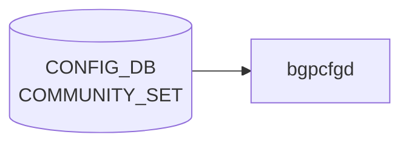

# COMMUNITY_SET テーブル

## 概要

[BGP](../../reference/glossary.md#term-bgp) コミュニティ集合を [CONFIG_DB](../../reference/glossary.md#term-config_db) に登録するテーブル[^1]。`sonic-routing-policy-sets.yang` の `COMMUNITY_SET` コンテナで定義され、`ROUTE_MAP` の `match community` 等から参照される。`EXTENDED_COMMUNITY_SET` も同モジュール内で並行定義される（同フィールド構成）。

<!-- cdb-mermaid -->
### データフロー (自動生成)



!!! note "凡例"
    CONFIG_DB から SAI までの典型経路を `docs/reference/config-db-orch-map.md` から機械生成したミニ図。詳細・例外は本ページ本文と対応表を参照。
<!-- /cdb-mermaid -->

## key 構造

```text
COMMUNITY_SET|<name>
EXTENDED_COMMUNITY_SET|<name>
```

## フィールド

| フィールド | 型 | 説明 |
|-----------|----|------|
| `name` | string | コミュニティ名（key） |
| `set_type` | enum `STANDARD` / `EXPANDED` | コミュニティタイプ |
| `match_action` | enum `ANY` / `ALL` | マッチ判定（任意一致/全一致） |
| `action` | enum `permit` / `deny` | コミュニティリストの action |
| `community_member` | leaf-list string (ordered-by user) | コミュニティ値の列。順序維持 |

`EXTENDED_COMMUNITY_SET_LIST` は同フィールド構成の Extended Community 用テーブル。

## 制約

- `community_member` は `ordered-by user`。ユーザ指定順をそのまま [FRR](../../reference/glossary.md#term-frr) の community-list に展開する前提
- `set_type` の選択により [FRR](../../reference/glossary.md#term-frr) 側で正規表現マッチ (`EXPANDED`) か数値マッチ (`STANDARD`) かが切り替わる

<!-- cdb-exceptions -->
## 例外条件・特殊挙動

- **必須フィールド欠如 → FRR 設定なし (暗黙スキップ)**: `set_type` / `match_action` / `community_member` のいずれかが欠如している場合、Jinja2 テンプレートがそのエントリを無視し FRR コマンドを生成しない。エラーログは出力されない。<!-- evidence: bgpd.conf.db.comm_list.j2 L9 -->
- **match_action が `all` / `any` 以外 → FRR 設定なし**: `match_action` が想定外の値の場合、テンプレートはどちらの分岐にも入らず bgp community-list が生成されない。<!-- evidence: bgpd.conf.db.comm_list.j2 L11, L16 -->
- **vtysh 実行失敗 → syslog LOG_ERR のみ (再試行なし)**: FRR bgpd への vtysh コマンド投入が失敗した場合、`frrcfgd` は syslog に LOG_ERR を出力するが再試行は行わない。FRR 側との設定乖離が生じる可能性がある。<!-- evidence: frrcfgd.py L47-60 g_run_command -->
- **汎用例外 → catch + LOG_ERR + drop**: ハンドラ内で `Exception` が発生した場合 `LOG_ERR` を出力して次のエントリへ進む。当該更新はドロップされる。<!-- evidence: frrcfgd.py L1533-1534 -->

<!-- value-behavior -->
## 値依存挙動マトリクス

| フィールド | 値 | 挙動 |
|-----------|-----|------|
| `set_type` | `STANDARD` | FRR へ `bgp community-list standard <name> permit <value>` を生成。数値 community（`AS:value` 形式）および well-known community に対して完全一致でマッチ。 |
| `set_type` | `EXPANDED` | FRR へ `bgp community-list expanded <name> permit <pattern>` を生成。正規表現マッチが可能（例: `.*:100`）。`STANDARD` と誤って指定した場合、正規表現が数値として解釈されすべてのルートが reject される。 |
| `match_action` | `ANY` | community_member のいずれか 1 つにマッチするルートを対象（OR 条件）。 |
| `match_action` | `ALL` | community_member すべてを同時に保持するルートのみを対象（AND 条件）。 |
| `match_action` | その他の値 | Jinja2 テンプレートがどちらの分岐にも入らず FRR コマンドが生成されない（サイレント失敗）。 |
| `action` | `permit` | マッチしたルートを許可。 |
| `action` | `deny` | マッチしたルートを拒否。 |
<!-- /value-behavior -->

## 購読者

- `frr-mgmt-framework`: [BGP](../../reference/glossary.md#term-bgp) コミュニティ・リストとして [FRR](../../reference/glossary.md#term-frr) (`bgpd`) に反映

## 関連 CONFIG_DB / YANG / CLI

- 関連 [CONFIG_DB](../../reference/glossary.md#term-config_db): `EXTENDED_COMMUNITY_SET`、[`AS_PATH_SET`](./as-path-set.md)、[`PREFIX_SET`](./prefix-set.md)、`ROUTE_MAP`
- 関連 [YANG](../../reference/glossary.md#term-yang): `sonic-routing-policy-sets`
- 関連 CLI: なし（`config_db.json` 投入）

<!-- ref-triangle:start -->

## 関連リファレンス

- [YANG](../../reference/glossary.md#term-yang): `sonic-routing-policy-sets`

<!-- ref-triangle:end -->

## 引用元

[^1]: [YANG](../../reference/glossary.md#term-yang) 定義: `sonic-routing-policy-sets.yang`. <https://github.com/sonic-net/sonic-buildimage/blob/9ea932ec2e18f35e58268ec2e4456b1d4afd65cd/src/sonic-yang-models/yang-models/sonic-routing-policy-sets.yang>

<!-- ops-hint -->
## 運用ヒント

### 典型値

- key 形式: `COMMUNITY_SET|<name>`。
- `set_type`: `standard` / `expanded`。`match_action`: `any` / `all`。`community_member`: CSV。

### よくある誤設定

- `expanded` で正規表現を書いたのに `standard` 指定のままで全件 reject される。

### 確認コマンド

```bash
sonic-db-cli CONFIG_DB keys 'COMMUNITY_SET|*'
vtysh -c 'show bgp community-list'
```
<!-- /ops-hint -->


<!-- runtime-trace -->
## 実コンテナ動作トレース

### 段階 1 — Consumer 登録

`bgpcfgd` が CONFIG_DB の `COMMUNITY_SET` テーブルを購読する。

`COMMUNITY_SET` は SONiC の route policy 管理用 (OpenConfig 準拠)。

### 段階 2 — CFG→APPL 翻訳

なし (FRR vtysh 経由で community-list を設定)

### 段階 3 — APPL→SAI

なし (FRR BGP policy のみ)

### 段階 4 — タイミングと副作用

**適用タイミング**: 変化検知後 FRR に `ip community-list` コマンドを発行。次回 BGP route-map 評価から適用。

**副作用**: community-list 変更は route-map を通じて BGP 経路のフィルタリング/属性に影響。soft-clear により即時反映が可能。
<!-- /runtime-trace -->

<!-- glossary-links-injected: 3c93d6c0b6a4 -->
