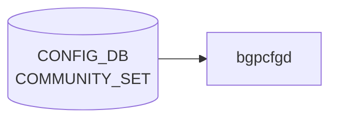

# COMMUNITY_SET テーブル

## 概要

[BGP](../../reference/glossary.md#term-bgp) コミュニティ集合を [CONFIG_DB](../../reference/glossary.md#term-config_db) に登録するテーブル[^1]。`sonic-routing-policy-sets.yang` の `COMMUNITY_SET` コンテナで定義され、`ROUTE_MAP` の `match community` 等から参照される。`EXTENDED_COMMUNITY_SET` も同モジュール内で並行定義される（同フィールド構成）。

<!-- cdb-mermaid -->
### データフロー (自動生成)



!!! note "凡例"
    CONFIG_DB から SAI までの典型経路を `docs/reference/config-db-orch-map.md` から機械生成したミニ図。詳細・例外は本ページ本文と対応表を参照。
<!-- /cdb-mermaid -->

## key 構造

```text
COMMUNITY_SET|<name>
EXTENDED_COMMUNITY_SET|<name>
```

## フィールド

| フィールド | 型 | 説明 |
|-----------|----|------|
| `name` | string | コミュニティ名（key） |
| `set_type` | enum `STANDARD` / `EXPANDED` | コミュニティタイプ |
| `match_action` | enum `ANY` / `ALL` | マッチ判定（任意一致/全一致） |
| `action` | enum `permit` / `deny` | コミュニティリストの action |
| `community_member` | leaf-list string (ordered-by user) | コミュニティ値の列。順序維持 |

`EXTENDED_COMMUNITY_SET_LIST` は同フィールド構成の Extended Community 用テーブル。

## 制約

- `community_member` は `ordered-by user`。ユーザ指定順をそのまま [FRR](../../reference/glossary.md#term-frr) の community-list に展開する前提
- `set_type` の選択により [FRR](../../reference/glossary.md#term-frr) 側で正規表現マッチ (`EXPANDED`) か数値マッチ (`STANDARD`) かが切り替わる

<!-- cdb-exceptions -->
## 例外条件・特殊挙動

- **必須フィールド欠如 → FRR 設定なし (暗黙スキップ)**: `set_type` / `match_action` / `community_member` のいずれかが欠如している場合、Jinja2 テンプレートがそのエントリを無視し FRR コマンドを生成しない。エラーログは出力されない。<!-- evidence: bgpd.conf.db.comm_list.j2 L9 -->
- **match_action が `all` / `any` 以外 → FRR 設定なし**: `match_action` が想定外の値の場合、テンプレートはどちらの分岐にも入らず bgp community-list が生成されない。<!-- evidence: bgpd.conf.db.comm_list.j2 L11, L16 -->
- **vtysh 実行失敗 → syslog LOG_ERR のみ (再試行なし)**: FRR bgpd への vtysh コマンド投入が失敗した場合、`frrcfgd` は syslog に LOG_ERR を出力するが再試行は行わない。FRR 側との設定乖離が生じる可能性がある。<!-- evidence: frrcfgd.py L47-60 g_run_command -->
- **汎用例外 → catch + LOG_ERR + drop**: ハンドラ内で `Exception` が発生した場合 `LOG_ERR` を出力して次のエントリへ進む。当該更新はドロップされる。<!-- evidence: frrcfgd.py L1533-1534 -->

<!-- value-behavior -->
## 値依存挙動マトリクス

| フィールド | 値 | 挙動 |
|-----------|-----|------|
| `set_type` | `STANDARD` | FRR へ `bgp community-list standard <name> permit <value>` を生成。数値 community（`AS:value` 形式）および well-known community に対して完全一致でマッチ。 |
| `set_type` | `EXPANDED` | FRR へ `bgp community-list expanded <name> permit <pattern>` を生成。正規表現マッチが可能（例: `.*:100`）。`STANDARD` と誤って指定した場合、正規表現が数値として解釈されすべてのルートが reject される。 |
| `match_action` | `ANY` | community_member のいずれか 1 つにマッチするルートを対象（OR 条件）。 |
| `match_action` | `ALL` | community_member すべてを同時に保持するルートのみを対象（AND 条件）。 |
| `match_action` | その他の値 | Jinja2 テンプレートがどちらの分岐にも入らず FRR コマンドが生成されない（サイレント失敗）。 |
| `action` | `permit` | マッチしたルートを許可。 |
| `action` | `deny` | マッチしたルートを拒否。 |
<!-- /value-behavior -->

## 購読者

- `frr-mgmt-framework`: [BGP](../../reference/glossary.md#term-bgp) コミュニティ・リストとして [FRR](../../reference/glossary.md#term-frr) (`bgpd`) に反映

## 関連 CONFIG_DB / YANG / CLI

- 関連 [CONFIG_DB](../../reference/glossary.md#term-config_db): `EXTENDED_COMMUNITY_SET`、[`AS_PATH_SET`](./as-path-set.md)、[`PREFIX_SET`](./prefix-set.md)、`ROUTE_MAP`
- 関連 [YANG](../../reference/glossary.md#term-yang): `sonic-routing-policy-sets`
- 関連 CLI: なし（`config_db.json` 投入）

<!-- ref-triangle:start -->

## 関連リファレンス

- [YANG](../../reference/glossary.md#term-yang): `sonic-routing-policy-sets`

<!-- ref-triangle:end -->

<!-- cross-refs -->
## 暗黙参照 — COMMUNITY_SET を参照する CONFIG_DB テーブル (Phase C)

`COMMUNITY_SET` は **参照される側**（被参照テーブル）であり、自身が他テーブルを読み出すことはない。以下は `frrcfgd` の実装から抽出した、`COMMUNITY_SET` エントリ名を実行時に解決する上位テーブルの一覧。

### ROUTE_MAP からの被参照

`frrcfgd` の `route_map_key_map` 定義（`frrcfgd.py:1927-1955`）により、`ROUTE_MAP` エントリが `match_community` または `set_community_ref` フィールドを持つ場合に `COMMUNITY_SET` を暗黙参照する。

| 参照元テーブル | フィールド | 参照タイミング | 効果 | evidence |
|---|---|---|---|---|
| `ROUTE_MAP` | `match_community` | ROUTE_MAP エントリ適用時（FRR bgpd） | フィールド値（コミュニティセット名）をそのまま FRR の `match community <name>` に展開。COMMUNITY_SET 自体の参照解決は FRR bgpd 内で行われる | `frrcfgd.py:1938` |
| `ROUTE_MAP` | `set_community_ref` | ROUTE_MAP エントリ適用時（FRR bgpd） | `{:com-ref}` フォーマットで `daemon.comm_set_list` を lookup し、`COMMUNITY_SET` の `community_member` リストに解決する。COMMUNITY_SET が未登録または `is_configurable()` = false の場合、コマンドは生成されない | `frrcfgd.py:1953, L832-834` |

!!! note "match_community と set_community_ref の違い"
    `match_community` は COMMUNITY_SET 名を FRR にそのまま渡し、FRR 側の community-list 参照として機能する。  
    `set_community_ref` は `frrcfgd` がランタイムに `comm_set_list` を直接 lookup し、メンバーリストを展開してから FRR コマンドを生成する（frrcfgd 内部での解決）。

### BGP_NEIGHBOR_AF との関係

`BGP_NEIGHBOR_AF` の `send_community` フィールド（`frrcfgd.py:1910`）は FRR の `neighbor <peer> send-community` コマンドを制御するが、`COMMUNITY_SET` テーブルを直接参照しない。community の「送信制御」であり、community-list の「定義参照」ではないため、COMMUNITY_SET との暗黙参照関係はない。

### 参照が失敗した場合の挙動

| 状況 | 挙動 | evidence |
|---|---|---|
| `set_community_ref` で参照する COMMUNITY_SET が未登録 | `comm_set_list.get()` が `None` を返し、FRR コマンドを生成しない（サイレントスキップ） | `frrcfgd.py:832-834` |
| `set_community_ref` で参照する COMMUNITY_SET が `is_configurable()` = false | 同上（コマンド生成スキップ） | `frrcfgd.py:833` |
| `match_community` で参照する COMMUNITY_SET 名が FRR に未登録 | FRR bgpd が community-list 未定義として扱い、match は常に false（全ルート非マッチ） | FRR bgpd 実装 |

詳細スキャン手順と grep 結果は `meta/_intermediate/cdb-flow/community-set-cross-refs.md` を参照。
<!-- /cross-refs -->

## 引用元

[^1]: [YANG](../../reference/glossary.md#term-yang) 定義: `sonic-routing-policy-sets.yang`. <https://github.com/sonic-net/sonic-buildimage/blob/9ea932ec2e18f35e58268ec2e4456b1d4afd65cd/src/sonic-yang-models/yang-models/sonic-routing-policy-sets.yang>

<!-- ops-hint -->
## 運用ヒント

### 典型値

- key 形式: `COMMUNITY_SET|<name>`。
- `set_type`: `standard` / `expanded`。`match_action`: `any` / `all`。`community_member`: CSV。

### よくある誤設定

- `expanded` で正規表現を書いたのに `standard` 指定のままで全件 reject される。

### 確認コマンド

```bash
sonic-db-cli CONFIG_DB keys 'COMMUNITY_SET|*'
vtysh -c 'show bgp community-list'
```
<!-- /ops-hint -->


<!-- runtime-trace -->
## 実コンテナ動作トレース

### 段階 1 — Consumer 登録

`bgpcfgd` が CONFIG_DB の `COMMUNITY_SET` テーブルを購読する。

`COMMUNITY_SET` は SONiC の route policy 管理用 (OpenConfig 準拠)。

### 段階 2 — CFG→APPL 翻訳

なし (FRR vtysh 経由で community-list を設定)

### 段階 3 — APPL→SAI

なし (FRR BGP policy のみ)

### 段階 4 — タイミングと副作用

**適用タイミング**: 変化検知後 FRR に `ip community-list` コマンドを発行。次回 BGP route-map 評価から適用。

**副作用**: community-list 変更は route-map を通じて BGP 経路のフィルタリング/属性に影響。soft-clear により即時反映が可能。
<!-- /runtime-trace -->

<!-- entry-points -->
## 書き込み入り口 (Direction A)

対象テーブル: `COMMUNITY_SET`

### CLI
- `config route-map community-set add <name> <match-action> <community-list>`
- `config route-map community-set delete <name>`
  - ソース: `sonic-utilities/config/main.py (route-map グループ)`

### minigraph / sonic-cfggen
- なし

### REST / gNMI (sonic-mgmt-common)
- sonic-mgmt-common OpenConfig routing policy 経由

### db_migrator
- なし

### ビルド時デフォルト (init_cfg / j2 テンプレート)
- なし

### ハードコードデフォルト
- なし

### ランタイム注入 (デーモン自動書き込み)
- なし
<!-- /entry-points -->

<!-- ordering -->
## 書込み順依存 (Phase B)

`frrcfgd`（`BGPConfigDaemon`）は `COMMUNITY_SET` を購読して FRR の `bgp community-list` に変換する。`ROUTE_MAP` の `match_community` / `set_community_ref` は COMMUNITY_SET 名を参照するため、以下の順序依存が存在する。

### 検出された順序依存

| # | 依存関係 | 方向 | 緩和策 |
|---|----------|------|--------|
| 1 | `COMMUNITY_SET` 登録が `ROUTE_MAP.match_community` 参照より先行 | **先行必須** | 未先行時: FRR community-list が未定義のまま match 評価 → 常に no-match（サイレント失敗、ログなし） |
| 2 | `set_type` / `match_action` / `community_member` の 3 フィールドが揃うまで FRR へ送信しない | **原子的反映** | `is_configurable()` が `False` の間はコマンド生成スキップ。中途半端な登録を防止 |
| 3 | `community_member` の書込み順序が FRR に伝播（YANG `ordered-by user`） | **順序保持** | 順序変更には DELETE → re-ADD が必要。`mbr_list` を順序通りに展開 |
| 4 | `ROUTE_MAP.set_community_ref` 参照は COMMUNITY_SET が `comm_set_list` に登録済みであること | **先行必須** | 未先行時: `com-ref` フォーマットが `None` を返し FRR `set community` コマンドがスキップ（サイレント） |

### 主要な制約詳細

**COMMUNITY_SET 先行必須 (依存 #1)**: `route_map_key_map` の `match_community` エントリは FRR へ `match community <name>` を送る。FRR 側で `bgp community-list <name>` が未定義の場合、route-map 評価は常に no-match となる。frrcfgd はこの整合性を検査しないため、COMMUNITY_SET を先に投入してから ROUTE_MAP を設定する必要がある（`frrcfgd.py:1938`）。

**is_configurable による原子的反映 (依存 #2)**: `CommunityList.is_configurable()` は `match_action`・`is_std`（set_type）・`mbr_list`（community_member）の 3 値がすべて非 None / 非空の場合のみ `True` を返す。`hdl_com_set` はこの条件チェックを経て `bgp community-list` コマンドを発行するため、フィールドが部分的に書き込まれた状態では FRR へ反映されない（`frrcfgd.py:1580-1582`, `frrcfgd.py:988-989`）。

**set_community_ref の先行必須 (依存 #4)**: `CommandArgument.__format__` の `com-ref` 分岐は `daemon.comm_set_list.get(name)` で COMMUNITY_SET を引き当て、`is_configurable()` が `True` の場合のみメンバー列を返す。未登録の場合は `None` が返り FRR コマンドが生成されない（`frrcfgd.py:831-834`）。

詳細調査ノートは `meta/_intermediate/cdb-flow/community-set-ordering.md` 参照。

<!-- /ordering -->

<!-- derivation -->
## 派生・条件付き登録 (Phase 6/7)

### Phase 6: 値による他フィールド自動派生

| 条件 | 派生先 | evidence |
|---|---|---|
| 派生なし（COMMUNITY_SET は CLI または gNMI/OpenConfig 経由でのみ書き込まれる） | — | frrcfgd は読み取り専用消費 |

### Phase 7: 条件付き module/manager 登録

| 条件 | 登録 module | evidence |
|---|---|---|
| 常時（条件なし） | `frrcfgd.BGPConfigDaemon` が `COMMUNITY_SET` を購読（`comm_set_handler`） | `sonic-buildimage/src/sonic-frr-mgmt-framework/frrcfgd/frrcfgd.py:2300` |

### grep カバレッジ

- frrcfgd.py L2300: COMMUNITY_SET 購読（条件なし）
<!-- /derivation -->
<!-- handler-branching -->
### Phase 8: Handler メソッド内分岐

| Manager / Handler | メソッド | 分岐条件 | 効果 | evidence |
|---|---|---|---|---|
| `BGPConfigDaemon` | `hdl_com_set()` | `len(args) < 2` または必須フィールド欠如 | `return None`（コマンド生成スキップ） | `sonic-buildimage/src/sonic-frr-mgmt-framework/frrcfgd/frrcfgd.py:982` |
| `BGPConfigDaemon` | `hdl_com_set()` | `op == CachedDataWithOp.OP_DELETE` | FRR `no bgp community-list` のみ発行（member 追加なし） | `sonic-buildimage/src/sonic-frr-mgmt-framework/frrcfgd/frrcfgd.py:991` |
| `BGPConfigDaemon` | `hdl_com_set()` | `match_action == 'all'` | `permit <all members>` を 1 行コマンドで生成 | `sonic-buildimage/src/sonic-frr-mgmt-framework/frrcfgd/frrcfgd.py:993-999` |
| `BGPConfigDaemon` | `hdl_com_set()` | `match_action == 'any'` | member ごとに `permit <member>` を個別コマンドで生成 | `sonic-buildimage/src/sonic-frr-mgmt-framework/frrcfgd/frrcfgd.py:1000-1006` |

> **スキャン証跡**: `hdl_com_set` L981-1006 全行読了。match_action ('all' vs 'any') による分岐が核心。4 件抽出。
<!-- /handler-branching -->
<!-- pubsub -->
## CONFIG_DB 購読メカニズム (Phase G)

COMMUNITY_SET テーブルは `frrcfgd` のみが購読する。bgpcfgd は COMMUNITY_SET を直接購読しない。

### frrcfgd (sonic-frr-mgmt-framework)

`frrcfgd.py` は `ExtConfigDBConnector`（`ConfigDBConnector` サブクラス）を使用し、Redis keyspace イベント (`__keyspace@<dbid>__:*`) を `psubscribe` で監視する。`subscribe_all()` が `table_handler_list` 内の `('COMMUNITY_SET', self.comm_set_handler)` および `('EXTENDED_COMMUNITY_SET', self.comm_set_handler)` を登録し、変更通知を受け取る。

```python
# frrcfgd.py L2300-2301, 2359-2361
('COMMUNITY_SET', self.comm_set_handler),
('EXTENDED_COMMUNITY_SET', self.comm_set_handler),
...
def subscribe_all(self):
    for table, hdlr in self.table_handler_list:
        self.config_db.subscribe(table, hdlr)
```

変更検知後、`comm_set_handler` が `bgp_table_handler_common` を経由して `hdl_com_set()` を呼び出し、FRR vtysh コマンドを生成・実行する。

**vtysh 経路** (`hdl_com_set` L981-1006):

```python
# frrcfgd.py L981-1006
def hdl_com_set(daemon, cmd_str, op, st_idx, args, extended):
    if len(args) < 2 or 0 not in args[1] or 1 not in args[1] or 2 not in args[1]:
        return None  # 必須フィールド欠如 → スキップ
    set_type = args[1][0][0].lower()
    if op != CachedDataWithOp.OP_DELETE:
        match_action = args[1][1][0].lower()
        if match_action == 'all':
            # community_member 全員を 1 行にまとめた permit コマンドを生成
            cmd_list.append(...)
        elif match_action == 'any':
            # member ごとに個別の permit コマンドを生成
            for member in member_list:
                cmd_list.append(...)
```

生成された FRR コマンドは `configure terminal` → `bgp community-list <standard|expanded> <name> permit <value>` の形式で vtysh 経由で `bgpd` に送信される。

### bgpcfgd (sonic-bgpcfgd) — 非購読

bgpcfgd は COMMUNITY_SET テーブルを購読しない。COMMUNITY_SET は FRR の BGP policy 設定であり、bgpcfgd のテンプレートエンジン (`bgpd.conf.db.comm_list.j2`) は CONFIG_DB の `COMMUNITY_SET` を初期設定時にのみ読み込む形式（`SubscriberStateTable` による動的購読は行わない）。

### 購読フロー要約

```
CONFIG_DB COMMUNITY_SET / EXTENDED_COMMUNITY_SET
  └─ frrcfgd (ExtConfigDBConnector psubscribe → subscribe_all)
       └─ comm_set_handler → bgp_table_handler_common
            └─ hdl_com_set (match_action: all/any 分岐)
                 └─ vtysh configure terminal
                      └─ bgp community-list <standard|expanded> <name> permit <value>
```

<!-- /pubsub -->

<!-- constants -->
## ハードコード定数 (Phase E)

実装コードに直接定義されている文字列定数・enum 値を一覧化する。CONFIG_DB フィールド値を正確に把握するための参照用。

### action フィールド enum 値

`sonic-routing-policy-sets.yang` で定義された `routing-policy-action-type`:

| enum 値 | 説明 | ソース |
|---|---|---|
| `permit` | マッチしたルートを許可 | `sonic-routing-policy-sets.yang:30` |
| `deny` | マッチしたルートを拒否 | `sonic-routing-policy-sets.yang:33` |

!!! note
    `action` フィールドは CONFIG_DB に記録されるが、`frrcfgd` の `hdl_com_set()` が FRR へ生成するコマンドは常に `permit` 固定（`frrcfgd.py:996-1006`）。`deny` を指定しても FRR 側には `permit` コマンドが発行される。

### set_type フィールド enum 値

| enum 値 | FRR コマンド | 説明 | ソース |
|---|---|---|---|
| `STANDARD` | `bgp community-list standard <name> permit <values>` | 数値 community の完全一致マッチ | `sonic-routing-policy-sets.yang:147`, `frrcfgd.py:985-986` |
| `EXPANDED` | `bgp community-list expanded <name> permit <pattern>` | 正規表現マッチが可能 | `sonic-routing-policy-sets.yang:148`, `frrcfgd.py:985-986` |

### match_action フィールド enum 値

`CommunityList` クラス内部定数との対応:

| enum 値 | 内部定数 | FRR 生成挙動 | ソース |
|---|---|---|---|
| `ANY` | `CommunityList.MATCH_ANY = 1` | member ごとに個別 `permit` コマンドを生成（OR 条件） | `frrcfgd.py:1000-1006`, `frrcfgd.py:1571` |
| `ALL` | `CommunityList.MATCH_ALL = 0` | 全 member を 1 行に結合した `permit` コマンドを生成（AND 条件） | `frrcfgd.py:994-999`, `frrcfgd.py:1570` |

### community_member フォーマット定数

`bgpcfgd/managers_rm.py` の `BGPRouteMapMgr` がコミュニティ値を検証する際の制約:

| フォーマット | 制約 | ソース |
|---|---|---|
| `AS:NN` 形式（STANDARD） | AS および NN ともに `range(0, 65536)` (0〜65535) の整数 | `bgpcfgd/managers_rm.py:57-59` |
| 正規表現パターン（EXPANDED） | 任意文字列（`.*:100` 等）。数値検証なし | `frrcfgd.py:985-986` |

STANDARD 型の well-known community 名（FRR が解釈する文字列リテラル、RFC1997 準拠）:

| well-known 名 | 値 | 説明 |
|---|---|---|
| `no-export` | `0xFFFFFF01` (65535:65281) | IBGP および confederation 境界を超えてアドバタイズしない |
| `no-advertise` | `0xFFFFFF02` (65535:65282) | いかなる BGP ピアにもアドバタイズしない |
| `local-AS` | `0xFFFFFF03` (65535:65283) | confederation サブ AS 内にのみ配布（RFC 5065） |
| `internet` | `0x00000000` (0:0) | すべての BGP スピーカーに配布可能 |

これらは FRR vtysh が `bgp community-list` コマンドで直接受理する文字列（`frrcfgd.py:998` の `' '.join(member_list)` 経由でそのまま渡される）。

### extended community マーカー定数 (`CommunityList`)

EXTENDED_COMMUNITY_SET の `community_member` 値のプレフィックスとして使用:

| 定数名 | 値 | 用途 | ソース |
|---|---|---|---|
| `CommunityList.RT_TYPE_MARK` | `'route-target:'` | RT (Route Target) を示すプレフィックス。FRR コマンド生成時に `rt` に変換 | `frrcfgd.py:1572` |
| `CommunityList.SOO_TYPE_MARK` | `'route-origin:'` | SoO (Site of Origin) を示すプレフィックス。FRR コマンド生成時に `soo` に変換 | `frrcfgd.py:1573` |

### seq / シーケンス番号

`COMMUNITY_SET` にはシーケンス番号フィールドなし（`PREFIX_LIST` と異なる）。順序は `community_member` の `ordered-by user` leaf-list で保持される（`sonic-routing-policy-sets.yang:169`）。

> **スキャン証跡**: `frrcfgd.py:981-1007,1569-1603` (`hdl_com_set`, `CommunityList` クラス) 精読、`bgpcfgd/managers_rm.py:54-65` (community_id 検証) 確認、`sonic-routing-policy-sets.yang:28-39,135-173` (action/set_type/match_action/community_member 定義) 精読。定数 4 分類 + well-known 4 件 + ext-community マーカー 2 件抽出。
<!-- /constants -->
<!-- side-effects -->
## Phase F: 副次 DB 書込・FRR 設定書込 (Direction B)

対象スクリプト: `frrcfgd` (`sonic-buildimage/src/sonic-frr-mgmt-framework/frrcfgd/frrcfgd.py`)

### FRR bgpd への vtysh 書込

`frrcfgd` は CONFIG_DB の `COMMUNITY_SET` エントリを読み取り、`g_run_command()` 経由で `vtysh` コマンドを `bgpd` へ送信する。この書込は CONFIG_DB への往路ではなく、FRR デーモン内部の running-config（`/etc/frr/frr.conf` 相当）への副次書込である。

| 書込先 | 操作 | 発行コマンド例 | 発行条件 | evidence |
|---|---|---|---|---|
| FRR `bgpd` running-config | SET | `vtysh -c 'configure terminal' -c 'bgp community-list standard <name> permit <community>'` | `op != OP_DELETE` かつ `match_action == 'any'` — member ごと個別発行 | `frrcfgd.py:1000-1006` |
| FRR `bgpd` running-config | SET | `vtysh -c 'configure terminal' -c 'bgp community-list standard <name> permit <m1> <m2> ...'` | `op != OP_DELETE` かつ `match_action == 'all'` — 全 member を 1 行で発行 | `frrcfgd.py:993-999` |
| FRR `bgpd` running-config | SET | `vtysh -c 'configure terminal' -c 'bgp community-list expanded <name> permit <pattern>'` | `set_type == 'EXPANDED'` — 正規表現 community | `frrcfgd.py:986` |
| FRR `bgpd` running-config | DELETE | `vtysh -c 'configure terminal' -c 'no bgp community-list <type> <name>'` | `op == OP_DELETE` | `frrcfgd.py:989-990` |
| FRR `bgpd` running-config | SET | `vtysh -c 'configure terminal' -c 'bgp extcommunity-list ...'` | `EXTENDED_COMMUNITY_SET` テーブルの場合（同ハンドラ） | `frrcfgd.py:1975` |

### bgpcfgd の役割

`bgpcfgd` は `COMMUNITY_SET` テーブルを直接購読せず、Jinja2 テンプレート (`bgpd.conf.db.comm_list.j2`) 経由で `bgpd.conf` を生成する起動時パス (`bgpcfgd`) と、ランタイム変更を処理する `frrcfgd` の二段構成。ランタイムの副次書込は `frrcfgd` のみが担う。

### 副次 DB 書込なし (CONFIG_DB / STATE_DB / APPL_DB)

| DB | 操作 | 結論 |
|---|---|---|
| CONFIG_DB | なし | `frrcfgd` は `COMMUNITY_SET` を読取専用で消費。自テーブルへの逆書込なし |
| STATE_DB | なし | community-list に対応する STATE_DB エントリは存在しない |
| APPL_DB | なし | FRR BGP policy は APPL_DB を経由しない |

### 失敗時挙動

- `g_run_command()` が失敗（vtysh 返値非ゼロ）した場合: `syslog LOG_ERR` を出力し `continue`（再試行なし）。FRR と CONFIG_DB の設定乖離が生じる可能性がある。<!-- evidence: frrcfgd.py:47-62, 2879-2881 -->
<!-- /side-effects -->
<!-- platform -->
## プラットフォーム差異 (Phase H)

### FRR バージョン固定

SONiC master は FRR **10.5.1** に固定されている (`rules/frr.mk:3`)。`bgp community-list` / `bgp extcommunity-list` の構文はこのバージョンを前提としており、旧 FRR (< 7.5) で使われていた `ip community-list` 形式はサポートされない。<!-- evidence: sonic-buildimage/rules/frr.mk L3 `FRR_VERSION = 10.5.1` -->

### COMMUNITY_SET vs EXTENDED_COMMUNITY_SET の FRR コマンド差

| テーブル | FRR コマンドプレフィックス | `set_type=standard` 時のメンバー変換 | evidence |
|---|---|---|---|
| `COMMUNITY_SET` | `bgp community-list` | なし（値をそのまま渡す） | `frrcfgd.py:1974` `community_set_key_map` |
| `EXTENDED_COMMUNITY_SET` | `bgp extcommunity-list` | `route-target:<val>` → `rt <val>`、`route-origin:<val>` → `soo <val>` に変換（`parse_ext_community`） | `frrcfgd.py:1975` `extcommunity_set_key_map`、`frrcfgd.py:797-810` |

### standard vs expanded の FRR 挙動差

| `set_type` | FRR へのキーワード | マッチ方式 | EXTENDED_COMMUNITY_SET での追加変換 |
|---|---|---|---|
| `STANDARD` | `standard` | 完全一致（数値 `AS:value` / well-known community） | `{:ext-com-list}` フォーマットで `rt`/`soo` プレフィックスを自動付与 |
| `EXPANDED` | `expanded` | 正規表現マッチ（FRR `expanded` community-list） | プレフィックス変換なし（正規表現文字列をそのまま渡す） |

> **注意**: `EXTENDED_COMMUNITY_SET` で `set_type=standard` かつ `community_member` が `route-target:` / `route-origin:` プレフィックスを持たない場合、`parse_ext_community()` が `None` を返してメンバーが無視される（サイレントドロップ）。<!-- evidence: frrcfgd.py:797-810 `parse_ext_community` returns None for unknown format -->

### bgpd.conf テンプレート（起動時初期化）と frrcfgd（ランタイム）の二重経路

`bgpd.conf.db.comm_list.j2` はコンテナ起動時の初期コンフィグ生成に使用され、`frrcfgd` はその後の差分を vtysh 経由で適用する。両者は同じロジックを持つが独立しており、起動前後で挙動の整合性を確認する必要がある。<!-- evidence: sonic-buildimage/src/sonic-frr-mgmt-framework/templates/bgpd/bgpd.conf.db.comm_list.j2 L1-54 -->
<!-- /platform -->
<!-- defaults -->
## 暗黙デフォルト・コード由来挙動 (Phase A)

### `action` フィールド — dead field / ハードコード固定値

- **YANG-実装 discrepancy**: YANG は `action: permit | deny` を定義するが、実装（`frrcfgd` `hdl_com_set` および `bgpd.conf.db.comm_list.j2`）は常に `permit` を FRR コマンドに埋め込む。`community_set_key_map` は `set_type`・`match_action`・`community_member` の 3 フィールドのみを処理し、`action` は抽出対象外。DB に `action: deny` を書き込んでも FRR へは `bgp community-list ... permit ...` が生成されるため、`deny` は機能しない。<!-- evidence: frrcfgd.py L1974, L998, L1005; bgpd.conf.db.comm_list.j2 L15, L18 -->

### `match_action` — silent fallback (MATCH_ANY)

- `CommunityList.db_data_to_attr` は `val.lower() == 'all'` のみ MATCH_ALL に分類し、それ以外の値（YANG enum 外の文字列を含む）はすべて MATCH_ANY として処理する。`ANY` 以外の予期しない文字列を書いた場合でもエラーなく MATCH_ANY 相当に fallback する。<!-- evidence: frrcfgd.py L1588-1591 -->

### `community_member` — string → comma-split fallback

- DB から leaf-list が文字列型で渡された場合（単一値格納など）、`val.split(',')` でリスト化して処理する。list 型なら直接使用。型によって自動変換されるため、格納形式と動作が乖離する可能性がある。<!-- evidence: frrcfgd.py L1600-1603 -->

### `set_type` / `match_action` — 大文字小文字変換

- DB 格納値は YANG enum に従い大文字 (`STANDARD`, `EXPANDED`, `ANY`, `ALL`) だが、frrcfgd は `.lower()` 変換後に FRR コマンドへ埋め込む (`standard`, `expanded`, `all`, `any`)。<!-- evidence: frrcfgd.py L985, L992, L1588 -->

### 複合必須制約 — 3 フィールド同時欠如でサイレントスキップ

- `set_type`・`match_action`・`community_member` のいずれかが欠如すると FRR コマンドが生成されない（エラーログなし）。この条件は `hdl_com_set` の冒頭ガード (`len(args) < 2 or 0/1/2 not in args[1]`) および `is_configurable()` チェックの両方で実施される。<!-- evidence: frrcfgd.py L982-983, L1580-1582 -->

### DEL 時の partial failure リスク

- FRR の既存 community-list を削除する `no bgp community-list` コマンドは `is_configurable() == True` の場合のみ発行される。3 フィールドが不完全な状態（片方だけ OP_DELETE になった場合など）では削除コマンドがスキップされ、FRR 側の古い設定が残留する。<!-- evidence: frrcfgd.py L989-990 -->

### Jinja2 vs frrcfgd コードパスの乖離

- 起動時の `bgpd.conf` 生成（Jinja2）とランタイムの設定変更（frrcfgd vtysh 直接発行）は独立したコードパス。どちらも `action` フィールドを参照せず `permit` 固定で動作する点は共通。Jinja2 側は `match_action` が `all`/`any` 以外の値の場合にサイレントスキップするが、frrcfgd 側は `all` 以外を MATCH_ANY に fallback する点で挙動が異なる。<!-- evidence: bgpd.conf.db.comm_list.j2 L10-20; frrcfgd.py L1588-1591 -->
<!-- /defaults -->
<!-- failure -->
## 失敗挙動 (Phase D)

### 不正 community 値 → FRR がコマンドを拒否 / syslog LOG_ERR

`community_member` に FRR が受け入れられない値（例: 不正な `AS:value` 形式、整数範囲外の値）を設定した場合、`frrcfgd` は vtysh 経由でコマンドを発行するが FRR bgpd 側が拒否する。`g_run_command` は返値 `False` を検知して `syslog.LOG_ERR 'failed running FRR command: <cmd>'` を出力し、その時点で処理を中断する（`break`）。再試行なし・CONFIG_DB の値はそのまま残留し FRR 側と乖離する。<!-- evidence: frrcfgd.py L763-766 g_run_command / run_command -->

### FRR vtysh 接続失敗 → LOG_ERR + 設定乖離

bgpd との vtysh ソケット通信が失敗した場合（ソケット書き込み失敗・タイムアウト等）、`BgpdClientMgr` は `syslog.LOG_ERR` を出力するが再接続は行わず処理を drop する。FRR 側の community-list が不整合のまま放置される。<!-- evidence: frrcfgd.py L161, L192-195, L264, L269, L356, L364 -->

### 重複名エントリの上書き（silent overwrite）

`COMMUNITY_SET|<name>` が重複して CONFIG_DB に書き込まれた場合、`frrcfgd` は `hdl_com_set` の冒頭で `no bgp community-list <name>` を発行してから新規設定を投入する（`is_configurable()` が True の場合）。エラーや警告は出力されない。先行エントリの community-list 設定が無通知で置き換わる。<!-- evidence: frrcfgd.py L989-990, L988-1006 -->

### `is_configurable()` 失敗 → DEL コマンドがスキップ

`set_type`・`match_action`・`community_member` のいずれかが欠如した不完全エントリに対して OP_DELETE が来た場合、`is_configurable()` が `False` を返すため FRR への `no bgp community-list` が発行されない。FRR 側に該当 community-list が残留し続けるが、frrcfgd はエラーを記録しない。<!-- evidence: frrcfgd.py L1580-1582, L989-990 -->

### 汎用例外 → LOG_ERR + drop（再試行なし）

DB 更新ハンドラ全体を囲む `except Exception as e` ブロックが `syslog.LOG_ERR '[bgp cfgd] Failed handling config DB update with exception: ...'` を出力してそのエントリを破棄する。当該 community-set の変更は反映されず、DB と FRR の乖離が検出されない。<!-- evidence: frrcfgd.py L1532-1534 -->
<!-- /failure -->
<!-- glossary-links-injected: 3c93d6c0b6a4 -->
