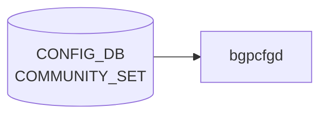

# COMMUNITY_SET テーブル

## 概要

[BGP](../../reference/glossary.md#term-bgp) コミュニティ集合を [CONFIG_DB](../../reference/glossary.md#term-config_db) に登録するテーブル[^1]。`sonic-routing-policy-sets.yang` の `COMMUNITY_SET` コンテナで定義され、`ROUTE_MAP` の `match community` 等から参照される。`EXTENDED_COMMUNITY_SET` も同モジュール内で並行定義される（同フィールド構成）。

<!-- cdb-mermaid -->
### データフロー (自動生成)



!!! note "凡例"
    CONFIG_DB から SAI までの典型経路を `docs/reference/config-db-orch-map.md` から機械生成したミニ図。詳細・例外は本ページ本文と対応表を参照。
<!-- /cdb-mermaid -->

## key 構造

```text
COMMUNITY_SET|<name>
EXTENDED_COMMUNITY_SET|<name>
```

## フィールド

| フィールド | 型 | 説明 |
|-----------|----|------|
| `name` | string | コミュニティ名（key） |
| `set_type` | enum `STANDARD` / `EXPANDED` | コミュニティタイプ |
| `match_action` | enum `ANY` / `ALL` | マッチ判定（任意一致/全一致） |
| `action` | enum `permit` / `deny` | コミュニティリストの action |
| `community_member` | leaf-list string (ordered-by user) | コミュニティ値の列。順序維持 |

`EXTENDED_COMMUNITY_SET_LIST` は同フィールド構成の Extended Community 用テーブル。

## 制約

- `community_member` は `ordered-by user`。ユーザ指定順をそのまま [FRR](../../reference/glossary.md#term-frr) の community-list に展開する前提
- `set_type` の選択により [FRR](../../reference/glossary.md#term-frr) 側で正規表現マッチ (`EXPANDED`) か数値マッチ (`STANDARD`) かが切り替わる

<!-- cdb-exceptions -->
## 例外条件・特殊挙動

- **必須フィールド欠如 → FRR 設定なし (暗黙スキップ)**: `set_type` / `match_action` / `community_member` のいずれかが欠如している場合、Jinja2 テンプレートがそのエントリを無視し FRR コマンドを生成しない。エラーログは出力されない。<!-- evidence: bgpd.conf.db.comm_list.j2 L9 -->
- **match_action が `all` / `any` 以外 → FRR 設定なし**: `match_action` が想定外の値の場合、テンプレートはどちらの分岐にも入らず bgp community-list が生成されない。<!-- evidence: bgpd.conf.db.comm_list.j2 L11, L16 -->
- **vtysh 実行失敗 → syslog LOG_ERR のみ (再試行なし)**: FRR bgpd への vtysh コマンド投入が失敗した場合、`frrcfgd` は syslog に LOG_ERR を出力するが再試行は行わない。FRR 側との設定乖離が生じる可能性がある。<!-- evidence: frrcfgd.py L47-60 g_run_command -->
- **汎用例外 → catch + LOG_ERR + drop**: ハンドラ内で `Exception` が発生した場合 `LOG_ERR` を出力して次のエントリへ進む。当該更新はドロップされる。<!-- evidence: frrcfgd.py L1533-1534 -->

<!-- value-behavior -->
## 値依存挙動マトリクス

| フィールド | 値 | 挙動 |
|-----------|-----|------|
| `set_type` | `STANDARD` | FRR へ `bgp community-list standard <name> permit <value>` を生成。数値 community（`AS:value` 形式）および well-known community に対して完全一致でマッチ。 |
| `set_type` | `EXPANDED` | FRR へ `bgp community-list expanded <name> permit <pattern>` を生成。正規表現マッチが可能（例: `.*:100`）。`STANDARD` と誤って指定した場合、正規表現が数値として解釈されすべてのルートが reject される。 |
| `match_action` | `ANY` | community_member のいずれか 1 つにマッチするルートを対象（OR 条件）。 |
| `match_action` | `ALL` | community_member すべてを同時に保持するルートのみを対象（AND 条件）。 |
| `match_action` | その他の値 | Jinja2 テンプレートがどちらの分岐にも入らず FRR コマンドが生成されない（サイレント失敗）。 |
| `action` | `permit` | マッチしたルートを許可。 |
| `action` | `deny` | マッチしたルートを拒否。 |
<!-- /value-behavior -->

## 購読者

- `frr-mgmt-framework`: [BGP](../../reference/glossary.md#term-bgp) コミュニティ・リストとして [FRR](../../reference/glossary.md#term-frr) (`bgpd`) に反映

## 関連 CONFIG_DB / YANG / CLI

- 関連 [CONFIG_DB](../../reference/glossary.md#term-config_db): `EXTENDED_COMMUNITY_SET`、[`AS_PATH_SET`](./as-path-set.md)、[`PREFIX_SET`](./prefix-set.md)、`ROUTE_MAP`
- 関連 [YANG](../../reference/glossary.md#term-yang): `sonic-routing-policy-sets`
- 関連 CLI: なし（`config_db.json` 投入）

<!-- ref-triangle:start -->

## 関連リファレンス

- [YANG](../../reference/glossary.md#term-yang): `sonic-routing-policy-sets`

<!-- ref-triangle:end -->

## 引用元

[^1]: [YANG](../../reference/glossary.md#term-yang) 定義: `sonic-routing-policy-sets.yang`. <https://github.com/sonic-net/sonic-buildimage/blob/9ea932ec2e18f35e58268ec2e4456b1d4afd65cd/src/sonic-yang-models/yang-models/sonic-routing-policy-sets.yang>

<!-- ops-hint -->
## 運用ヒント

### 典型値

- key 形式: `COMMUNITY_SET|<name>`。
- `set_type`: `standard` / `expanded`。`match_action`: `any` / `all`。`community_member`: CSV。

### よくある誤設定

- `expanded` で正規表現を書いたのに `standard` 指定のままで全件 reject される。

### 確認コマンド

```bash
sonic-db-cli CONFIG_DB keys 'COMMUNITY_SET|*'
vtysh -c 'show bgp community-list'
```
<!-- /ops-hint -->


<!-- runtime-trace -->
## 実コンテナ動作トレース

### 段階 1 — Consumer 登録

`bgpcfgd` が CONFIG_DB の `COMMUNITY_SET` テーブルを購読する。

`COMMUNITY_SET` は SONiC の route policy 管理用 (OpenConfig 準拠)。

### 段階 2 — CFG→APPL 翻訳

なし (FRR vtysh 経由で community-list を設定)

### 段階 3 — APPL→SAI

なし (FRR BGP policy のみ)

### 段階 4 — タイミングと副作用

**適用タイミング**: 変化検知後 FRR に `ip community-list` コマンドを発行。次回 BGP route-map 評価から適用。

**副作用**: community-list 変更は route-map を通じて BGP 経路のフィルタリング/属性に影響。soft-clear により即時反映が可能。
<!-- /runtime-trace -->

<!-- entry-points -->
## 書き込み入り口 (Direction A)

対象テーブル: `COMMUNITY_SET`

### CLI
- `config route-map community-set add <name> <match-action> <community-list>`
- `config route-map community-set delete <name>`
  - ソース: `sonic-utilities/config/main.py (route-map グループ)`

### minigraph / sonic-cfggen
- なし

### REST / gNMI (sonic-mgmt-common)
- sonic-mgmt-common OpenConfig routing policy 経由

### db_migrator
- なし

### ビルド時デフォルト (init_cfg / j2 テンプレート)
- なし

### ハードコードデフォルト
- なし

### ランタイム注入 (デーモン自動書き込み)
- なし
<!-- /entry-points -->

<!-- ordering -->
## 書込み順依存 (Phase B)

`frrcfgd`（`BGPConfigDaemon`）は `COMMUNITY_SET` を購読して FRR の `bgp community-list` に変換する。`ROUTE_MAP` の `match_community` / `set_community_ref` は COMMUNITY_SET 名を参照するため、以下の順序依存が存在する。

### 検出された順序依存

| # | 依存関係 | 方向 | 緩和策 |
|---|----------|------|--------|
| 1 | `COMMUNITY_SET` 登録が `ROUTE_MAP.match_community` 参照より先行 | **先行必須** | 未先行時: FRR community-list が未定義のまま match 評価 → 常に no-match（サイレント失敗、ログなし） |
| 2 | `set_type` / `match_action` / `community_member` の 3 フィールドが揃うまで FRR へ送信しない | **原子的反映** | `is_configurable()` が `False` の間はコマンド生成スキップ。中途半端な登録を防止 |
| 3 | `community_member` の書込み順序が FRR に伝播（YANG `ordered-by user`） | **順序保持** | 順序変更には DELETE → re-ADD が必要。`mbr_list` を順序通りに展開 |
| 4 | `ROUTE_MAP.set_community_ref` 参照は COMMUNITY_SET が `comm_set_list` に登録済みであること | **先行必須** | 未先行時: `com-ref` フォーマットが `None` を返し FRR `set community` コマンドがスキップ（サイレント） |

### 主要な制約詳細

**COMMUNITY_SET 先行必須 (依存 #1)**: `route_map_key_map` の `match_community` エントリは FRR へ `match community <name>` を送る。FRR 側で `bgp community-list <name>` が未定義の場合、route-map 評価は常に no-match となる。frrcfgd はこの整合性を検査しないため、COMMUNITY_SET を先に投入してから ROUTE_MAP を設定する必要がある（`frrcfgd.py:1938`）。

**is_configurable による原子的反映 (依存 #2)**: `CommunityList.is_configurable()` は `match_action`・`is_std`（set_type）・`mbr_list`（community_member）の 3 値がすべて非 None / 非空の場合のみ `True` を返す。`hdl_com_set` はこの条件チェックを経て `bgp community-list` コマンドを発行するため、フィールドが部分的に書き込まれた状態では FRR へ反映されない（`frrcfgd.py:1580-1582`, `frrcfgd.py:988-989`）。

**set_community_ref の先行必須 (依存 #4)**: `CommandArgument.__format__` の `com-ref` 分岐は `daemon.comm_set_list.get(name)` で COMMUNITY_SET を引き当て、`is_configurable()` が `True` の場合のみメンバー列を返す。未登録の場合は `None` が返り FRR コマンドが生成されない（`frrcfgd.py:831-834`）。

詳細調査ノートは `meta/_intermediate/cdb-flow/community-set-ordering.md` 参照。

<!-- /ordering -->

<!-- derivation -->
## 派生・条件付き登録 (Phase 6/7)

### Phase 6: 値による他フィールド自動派生

| 条件 | 派生先 | evidence |
|---|---|---|
| 派生なし（COMMUNITY_SET は CLI または gNMI/OpenConfig 経由でのみ書き込まれる） | — | frrcfgd は読み取り専用消費 |

### Phase 7: 条件付き module/manager 登録

| 条件 | 登録 module | evidence |
|---|---|---|
| 常時（条件なし） | `frrcfgd.BGPConfigDaemon` が `COMMUNITY_SET` を購読（`comm_set_handler`） | `sonic-buildimage/src/sonic-frr-mgmt-framework/frrcfgd/frrcfgd.py:2300` |

### grep カバレッジ

- frrcfgd.py L2300: COMMUNITY_SET 購読（条件なし）
<!-- /derivation -->
<!-- handler-branching -->
### Phase 8: Handler メソッド内分岐

| Manager / Handler | メソッド | 分岐条件 | 効果 | evidence |
|---|---|---|---|---|
| `BGPConfigDaemon` | `hdl_com_set()` | `len(args) < 2` または必須フィールド欠如 | `return None`（コマンド生成スキップ） | `sonic-buildimage/src/sonic-frr-mgmt-framework/frrcfgd/frrcfgd.py:982` |
| `BGPConfigDaemon` | `hdl_com_set()` | `op == CachedDataWithOp.OP_DELETE` | FRR `no bgp community-list` のみ発行（member 追加なし） | `sonic-buildimage/src/sonic-frr-mgmt-framework/frrcfgd/frrcfgd.py:991` |
| `BGPConfigDaemon` | `hdl_com_set()` | `match_action == 'all'` | `permit <all members>` を 1 行コマンドで生成 | `sonic-buildimage/src/sonic-frr-mgmt-framework/frrcfgd/frrcfgd.py:993-999` |
| `BGPConfigDaemon` | `hdl_com_set()` | `match_action == 'any'` | member ごとに `permit <member>` を個別コマンドで生成 | `sonic-buildimage/src/sonic-frr-mgmt-framework/frrcfgd/frrcfgd.py:1000-1006` |

> **スキャン証跡**: `hdl_com_set` L981-1006 全行読了。match_action ('all' vs 'any') による分岐が核心。4 件抽出。
<!-- /handler-branching -->
<!-- defaults -->
## 暗黙デフォルト・コード由来挙動 (Phase A)

### `action` フィールド — dead field / ハードコード固定値

- **YANG-実装 discrepancy**: YANG は `action: permit | deny` を定義するが、実装（`frrcfgd` `hdl_com_set` および `bgpd.conf.db.comm_list.j2`）は常に `permit` を FRR コマンドに埋め込む。`community_set_key_map` は `set_type`・`match_action`・`community_member` の 3 フィールドのみを処理し、`action` は抽出対象外。DB に `action: deny` を書き込んでも FRR へは `bgp community-list ... permit ...` が生成されるため、`deny` は機能しない。<!-- evidence: frrcfgd.py L1974, L998, L1005; bgpd.conf.db.comm_list.j2 L15, L18 -->

### `match_action` — silent fallback (MATCH_ANY)

- `CommunityList.db_data_to_attr` は `val.lower() == 'all'` のみ MATCH_ALL に分類し、それ以外の値（YANG enum 外の文字列を含む）はすべて MATCH_ANY として処理する。`ANY` 以外の予期しない文字列を書いた場合でもエラーなく MATCH_ANY 相当に fallback する。<!-- evidence: frrcfgd.py L1588-1591 -->

### `community_member` — string → comma-split fallback

- DB から leaf-list が文字列型で渡された場合（単一値格納など）、`val.split(',')` でリスト化して処理する。list 型なら直接使用。型によって自動変換されるため、格納形式と動作が乖離する可能性がある。<!-- evidence: frrcfgd.py L1600-1603 -->

### `set_type` / `match_action` — 大文字小文字変換

- DB 格納値は YANG enum に従い大文字 (`STANDARD`, `EXPANDED`, `ANY`, `ALL`) だが、frrcfgd は `.lower()` 変換後に FRR コマンドへ埋め込む (`standard`, `expanded`, `all`, `any`)。<!-- evidence: frrcfgd.py L985, L992, L1588 -->

### 複合必須制約 — 3 フィールド同時欠如でサイレントスキップ

- `set_type`・`match_action`・`community_member` のいずれかが欠如すると FRR コマンドが生成されない（エラーログなし）。この条件は `hdl_com_set` の冒頭ガード (`len(args) < 2 or 0/1/2 not in args[1]`) および `is_configurable()` チェックの両方で実施される。<!-- evidence: frrcfgd.py L982-983, L1580-1582 -->

### DEL 時の partial failure リスク

- FRR の既存 community-list を削除する `no bgp community-list` コマンドは `is_configurable() == True` の場合のみ発行される。3 フィールドが不完全な状態（片方だけ OP_DELETE になった場合など）では削除コマンドがスキップされ、FRR 側の古い設定が残留する。<!-- evidence: frrcfgd.py L989-990 -->

### Jinja2 vs frrcfgd コードパスの乖離

- 起動時の `bgpd.conf` 生成（Jinja2）とランタイムの設定変更（frrcfgd vtysh 直接発行）は独立したコードパス。どちらも `action` フィールドを参照せず `permit` 固定で動作する点は共通。Jinja2 側は `match_action` が `all`/`any` 以外の値の場合にサイレントスキップするが、frrcfgd 側は `all` 以外を MATCH_ANY に fallback する点で挙動が異なる。<!-- evidence: bgpd.conf.db.comm_list.j2 L10-20; frrcfgd.py L1588-1591 -->
<!-- /defaults -->
<!-- glossary-links-injected: 3c93d6c0b6a4 -->
