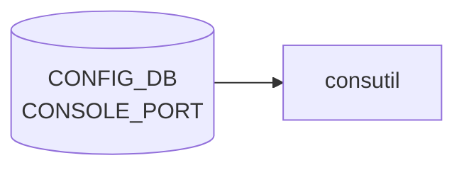

# CONSOLE_PORT / CONSOLE_SWITCH テーブル

## 概要

SONiC を **console switch** として動かすときの、シリアル/コンソールポートの設定テーブル群[^1]。
`CONSOLE_PORT` は各シリアルライン (1 行 = 1 物理ポート) のボーレート・接続先・エスケープ文字、
`CONSOLE_SWITCH` は機能のオンオフとデフォルトエスケープ文字を保持する。

`consutil` / `picocom` 経由でユーザーがコンソールセッションを張る際に参照される。

<!-- cdb-mermaid -->
### データフロー (自動生成)



!!! note "凡例"
    CONFIG_DB から SAI までの典型経路を `docs/reference/config-db-orch-map.md` から機械生成したミニ図。詳細・例外は本ページ本文と対応表を参照。
<!-- /cdb-mermaid -->

## key 構造

```text
CONSOLE_PORT|<line-no>
CONSOLE_SWITCH|console_mgmt
```

`<line-no>`: uint16。USB-serial 等のラインインデックス。

## CONSOLE_PORT フィールド

| フィールド | 型 | 説明 |
|-----------|----|------|
| `baud_rate` | uint32 | シリアルボーレート (例 9600 / 115200) |
| `flow_control` | `"0"` or `"1"` | ハードウェアフロー制御の有効化 |
| `remote_device` | hostname | 接続先機器のホスト名 (ラベル) |
| `escape_char` | string `[a-z]` | このポート専用のエスケープ文字 (グローバル既定を上書き) |

## CONSOLE_SWITCH フィールド (`console_mgmt` キー)

| フィールド | 型 | 既定 | 説明 |
|-----------|----|------|------|
| `enabled` | `yes`/`no` | `no` | console switch 機能の有効化フラグ |
| `default_escape_char` | string `[a-z]` | — | picocom のグローバル既定エスケープ文字 |

<!-- cdb-exceptions -->
## 例外条件・特殊挙動

- **既存エントリへの add → 即時失敗**: `config console add` で指定 linenum のエントリが既に存在する場合 `ctx.fail("Trying to add console port setting, which is already exists.")` で終了。CLI 側でのガードであり上書きは不可。<!-- evidence: config/console.py L114-115 -->
- **remote_device 重複 → 失敗**: 同じ `remote_device` 名がすでに別の linenum で使われている場合 `ctx.fail("Given device name ... has been used.")` で終了。device 名はシステム内一意制約。<!-- evidence: config/console.py L120-121 isExistingSameDevice -->
- **YANG バリデーション失敗 → ctx.fail**: `ValidatedConfigDBConnector` への書き込み時に baud_rate の型不正等で `ValueError` / `JsonPatchConflict` が発生した場合 `ctx.fail("Invalid ConfigDB. Error: ...")` で終了。<!-- evidence: config/console.py L130-131, L151-152 -->
- **未存在エントリへの del / update → 失敗**: `config console del` / `remote_device` 更新で linenum が存在しない場合 `ctx.fail("Trying to delete/update console port setting, which is not present.")` で終了。<!-- evidence: config/console.py L145-148, L172-173 -->
- **baud が既存値と同一 → no-op**: `config console baud` で現在値と同じ値を指定した場合 DB 更新をスキップして正常終了。<!-- evidence: config/console.py L215-216 -->

<!-- value-behavior -->
## 値依存挙動マトリクス

| フィールド | 値 | 挙動 |
|-----------|-----|------|
| `CONSOLE_SWITCH.enabled` | `yes` | console switch サービスが起動し、`consutil` / `picocom` 経由でのシリアル接続が有効になる。 |
| `CONSOLE_SWITCH.enabled` | `no`（既定） | console switch 機能が無効。`CONSOLE_PORT` の設定が存在しても接続不能。 |
| `CONSOLE_PORT.flow_control` | `"1"` | picocom 起動時にハードウェアフロー制御（RTS/CTS）を有効化。 |
| `CONSOLE_PORT.flow_control` | `"0"` | フロー制御なし（多くの console 接続でのデフォルト運用）。 |
| `CONSOLE_PORT.escape_char` | 設定あり | ポート個別のエスケープ文字を使用。`CONSOLE_SWITCH.default_escape_char` を上書きする。 |
| `CONSOLE_PORT.escape_char` | 未設定 | `CONSOLE_SWITCH.default_escape_char` のグローバル設定を使用。 |
<!-- /value-behavior -->

## 購読者

- `consutil` (CLI)
- console switch を有効化したときの host service

<!-- ref-triangle:start -->

## 関連リファレンス

- [YANG](../../reference/glossary.md#term-yang): `sonic-console`

<!-- ref-triangle:end -->

## 引用元

[^1]: [YANG](../../reference/glossary.md#term-yang) 定義: `sonic-console.yang`. <https://github.com/sonic-net/sonic-buildimage/blob/9ea932ec2e18f35e58268ec2e4456b1d4afd65cd/src/sonic-yang-models/yang-models/sonic-console.yang>

## 関連ページ
- [CONFIG_DB index](index.md)

<!-- ops-hint -->
## 運用ヒント

### 典型値

- key 形式: `CONSOLE_PORT|<line>`。
- `baud_rate`: `9600`、`flow_control`: `0`、`remote_device`: 接続先名。

### よくある誤設定

- console switch ライセンス / consutil パッケージが入っていない環境で設定だけ入れても接続不能。

### 確認コマンド

```bash
sonic-db-cli CONFIG_DB keys 'CONSOLE_PORT|*'
show console
```
<!-- /ops-hint -->


<!-- runtime-trace -->
## 実コンテナ動作トレース

### 段階 1 — Consumer 登録

`hostcfgd` (console port 管理) / `conserver` (コンソールサーバ) が CONFIG_DB の `CONSOLE_PORT` テーブルを購読する。

`CONSOLE_PORT` の key は `<port_num>` (例: `1`)。

### 段階 2 — CFG→APPL 翻訳

なし (APPL_DB 中継なし)

### 段階 3 — APPL→SAI

なし (SAI 非経由 — Linux tty / conserver の設定を更新)

### 段階 4 — タイミングと副作用

**適用タイミング**: CONFIG_DB 変化を検知後、`conserver.cf` 等の設定ファイルを書き換え。`conserver` デーモンの再起動または HUP シグナルで反映。

**副作用**: コンソールポートの baud rate / flow control 変更は進行中のコンソール接続を切断する可能性がある。
<!-- /runtime-trace -->

<!-- entry-points -->
## 書き込み入り口 (Direction A)

対象テーブル: `CONSOLE_PORT`

### CLI
- `config console add/del <port>`
- `config console connect <port>`
  - ソース: `sonic-utilities/config/console.py`

### minigraph / sonic-cfggen
- なし

### REST / gNMI (sonic-mgmt-common)
- なし (対応 OpenConfig/SONiC YANG transformer なし)

### db_migrator
- なし

### ビルド時デフォルト (init_cfg / j2 テンプレート)
- なし

### ハードコードデフォルト
- なし

### ランタイム注入 (デーモン自動書き込み)
- なし
<!-- /entry-points -->

<!-- glossary-links-injected: d5320e852f7a -->
