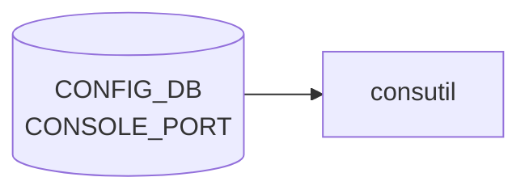

# CONSOLE_PORT / CONSOLE_SWITCH テーブル

## 概要

SONiC を **console switch** として動かすときの、シリアル/コンソールポートの設定テーブル群[^1]。
`CONSOLE_PORT` は各シリアルライン (1 行 = 1 物理ポート) のボーレート・接続先・エスケープ文字、
`CONSOLE_SWITCH` は機能のオンオフとデフォルトエスケープ文字を保持する。

`consutil` / `picocom` 経由でユーザーがコンソールセッションを張る際に参照される。

<!-- cdb-mermaid -->
### データフロー (自動生成)



!!! note "凡例"
    CONFIG_DB から SAI までの典型経路を `docs/reference/config-db-orch-map.md` から機械生成したミニ図。詳細・例外は本ページ本文と対応表を参照。
<!-- /cdb-mermaid -->

## key 構造

```text
CONSOLE_PORT|<line-no>
CONSOLE_SWITCH|console_mgmt
```

`<line-no>`: uint16。USB-serial 等のラインインデックス。

## CONSOLE_PORT フィールド

| フィールド | 型 | 説明 |
|-----------|----|------|
| `baud_rate` | uint32 | シリアルボーレート (例 9600 / 115200) |
| `flow_control` | `"0"` or `"1"` | ハードウェアフロー制御の有効化 |
| `remote_device` | hostname | 接続先機器のホスト名 (ラベル) |
| `escape_char` | string `[a-z]` | このポート専用のエスケープ文字 (グローバル既定を上書き) |

## CONSOLE_SWITCH フィールド (`console_mgmt` キー)

| フィールド | 型 | 既定 | 説明 |
|-----------|----|------|------|
| `enabled` | `yes`/`no` | `no` | console switch 機能の有効化フラグ |
| `default_escape_char` | string `[a-z]` | — | picocom のグローバル既定エスケープ文字 |

<!-- defaults -->
## コード由来の暗黙デフォルト (Phase A)

### CONSOLE_PORT フィールド

| フィールド | YANG default | CLI 省略時挙動 | 実行時 fallback |
|---|---|---|---|
| `baud_rate` | なし | `--baud` required — 必ず書き込まれる | フィールド欠如で接続時 `InvalidConfigurationError`（consutil/lib.py L198） |
| `flow_control` | `"0"` (YANG L62) | `--flowcontrol` は is_flag — 省略で `"0"` を明示書き込み | フィールド欠如は `False` 扱い（`== "1"` 比較、consutil/lib.py L153） |
| `remote_device` | なし | 省略時はエントリに key 自体を含めない (silent omit) | `None` のまま接続は続行可 |
| `escape_char` | なし | 省略時は key なし。書き込み前に `escape.lower()` 強制小文字化 | `CONSOLE_SWITCH.default_escape_char` → 未設定なら picocom デフォルト (`-e` なし = Ctrl+A) |

### CONSOLE_SWITCH フィールド

| フィールド | YANG default | CLI 省略時挙動 | 実行時 fallback |
|---|---|---|---|
| `enabled` | `"no"` (YANG L86) | `config console enable/disable` で明示設定 | `feature_state.get(..., "no")` — エントリ不在は `"no"` 扱い (consutil/lib.py L94) |
| `default_escape_char` | なし | `clear` で key を del | CONSOLE_SWITCH disabled 時は DB 値に関わらず `None` に固定 (consutil/lib.py L93–98) |

### 特記事項

- **`flow_control` 書き込み vs 実行時乖離**: minigraph 経由では integer `0`/`1` が格納されるが、consutil は文字列 `"1"` との比較を行うため、minigraph 由来のエントリは常に flow_control = False 判定になる。<!-- evidence: minigraph.py L616, consutil/lib.py L153 -->
- **`escape_char` 大文字小文字制約**: YANG は `[a-z]` のみ許可するが CLI の `click.Choice` は大文字も受け入れ、`.lower()` で変換後に書き込む。ユーザーには大文字が受け付けられるように見えるが DB には小文字が格納される UX 乖離。<!-- evidence: config/console.py L65,L101,L82,L126,L282 -->
- **デバイスパスのプラットフォーム依存**: `SysInfoProvider.DEVICE_PREFIX` はデフォルト `/dev/ttyUSB`。プラットフォームの `udevprefix.conf` が存在する場合は上書きされる。同一 line_num でもプラットフォームにより物理デバイスが変わる。<!-- evidence: consutil/lib.py L297,L301–307 -->
- **`baud_rate` の minigraph パス**: XML `<Bandwidth>` タグから取得。タグ不在時の None チェックなし — AttributeError の潜在リスク。<!-- evidence: minigraph.py L615 -->
<!-- /defaults -->

<!-- cdb-exceptions -->
## 例外条件・特殊挙動

- **既存エントリへの add → 即時失敗**: `config console add` で指定 linenum のエントリが既に存在する場合 `ctx.fail("Trying to add console port setting, which is already exists.")` で終了。CLI 側でのガードであり上書きは不可。<!-- evidence: config/console.py L114-115 -->
- **remote_device 重複 → 失敗**: 同じ `remote_device` 名がすでに別の linenum で使われている場合 `ctx.fail("Given device name ... has been used.")` で終了。device 名はシステム内一意制約。<!-- evidence: config/console.py L120-121 isExistingSameDevice -->
- **YANG バリデーション失敗 → ctx.fail**: `ValidatedConfigDBConnector` への書き込み時に baud_rate の型不正等で `ValueError` / `JsonPatchConflict` が発生した場合 `ctx.fail("Invalid ConfigDB. Error: ...")` で終了。<!-- evidence: config/console.py L130-131, L151-152 -->
- **未存在エントリへの del / update → 失敗**: `config console del` / `remote_device` 更新で linenum が存在しない場合 `ctx.fail("Trying to delete/update console port setting, which is not present.")` で終了。<!-- evidence: config/console.py L145-148, L172-173 -->
- **baud が既存値と同一 → no-op**: `config console baud` で現在値と同じ値を指定した場合 DB 更新をスキップして正常終了。<!-- evidence: config/console.py L215-216 -->

<!-- value-behavior -->
## 値依存挙動マトリクス

| フィールド | 値 | 挙動 |
|-----------|-----|------|
| `CONSOLE_SWITCH.enabled` | `yes` | console switch サービスが起動し、`consutil` / `picocom` 経由でのシリアル接続が有効になる。 |
| `CONSOLE_SWITCH.enabled` | `no`（既定） | console switch 機能が無効。`CONSOLE_PORT` の設定が存在しても接続不能。 |
| `CONSOLE_PORT.flow_control` | `"1"` | picocom 起動時にハードウェアフロー制御（RTS/CTS）を有効化。 |
| `CONSOLE_PORT.flow_control` | `"0"` | フロー制御なし（多くの console 接続でのデフォルト運用）。 |
| `CONSOLE_PORT.escape_char` | 設定あり | ポート個別のエスケープ文字を使用。`CONSOLE_SWITCH.default_escape_char` を上書きする。 |
| `CONSOLE_PORT.escape_char` | 未設定 | `CONSOLE_SWITCH.default_escape_char` のグローバル設定を使用。 |
<!-- /value-behavior -->

## 購読者

- `consutil` (CLI)
- console switch を有効化したときの host service

<!-- ordering -->
## 書込み順序依存 (Phase B)

### 1. CONSOLE_SWITCH.enabled を先に設定する

`CONSOLE_SWITCH|console_mgmt.enabled = "yes"` を書き込んでから `CONSOLE_PORT` エントリを追加する順序を推奨する。逆順（`CONSOLE_PORT` 先）でも `config console add` 自体は成功するが、`consutil connect` 実行時に disabled ガードに当たり接続不能になる。`CONSOLE_SWITCH` 変更は次回 `consutil` 呼び出し時点から即時反映される。<!-- evidence: consutil/lib.py:90-94 -->

### 2. remote_device の移動は 2 ステップ

同一 `remote_device` 名を別ラインへ移動する場合、旧ラインの `remote_device` を先にクリア（`config console remote_device <old_line>`、引数なし）してから新ラインへ追加する。逆順では `isExistingSameDevice()` チェックで一意性エラーになる。<!-- evidence: config/console.py:292-298 -->

### 3. minigraph 由来の flow_control は CLI で再設定が必要

`minigraph.py` は `flow_control` フィールドを integer `0`/`1` で書き込むが、`consutil` は文字列 `"1"` と比較するため、minigraph 経由での初期化のみではフロー制御が常に無効扱いになる。`config console flow_control enable <line>` を実行して文字列 `"1"` で上書きすること。<!-- evidence: minigraph.py:616, consutil/lib.py:152-153 -->

### 4. escape_char の優先順序

ポート個別の `CONSOLE_PORT.escape_char` が存在する場合は `CONSOLE_SWITCH.default_escape_char` より優先される。`default_escape_char` を変更してもポート個別設定があれば影響しない。ポート個別設定を削除（`config console escape <line> clear`）すると global に回帰する。<!-- evidence: consutil/lib.py:168-169 -->

### 5. baud_rate は必須フィールド — 欠如で接続拒否

`CONSOLE_PORT` エントリに `baud_rate` がない場合、`consutil connect` は `InvalidConfigurationError` で接続を拒否する。CLI (`config console add --baud` は required) では防御されているが、直接 DB 書き込みや minigraph から不完全なエントリが生成された場合は注意が必要。<!-- evidence: consutil/lib.py:197-199 -->

### 順序依存サマリ

| # | 依存関係 | 方向 | 緩和策 |
|---|----------|------|--------|
| 1 | `CONSOLE_SWITCH.enabled=yes` → `CONSOLE_PORT` エントリ追加 | 推奨先行 | 逆順でも DB 書き込みは成功するが接続不能 |
| 2 | 旧 `remote_device` クリア → 新ラインへ追加 | 先行必須 | 逆順で一意性エラー |
| 3 | minigraph 初期化後 → CLI flow_control 再設定 | 推奨 | 設定なしは flow_control 常に disabled 扱い |
| 4 | `CONSOLE_PORT.escape_char` が `CONSOLE_SWITCH.default_escape_char` を上書き | 優先度依存 | clear で global に回帰 |
| 5 | `baud_rate` 欠如 → 接続拒否 | 必須フィールド | CLI では required で防御済み |
<!-- /ordering -->

<!-- ref-triangle:start -->

## 関連リファレンス

- [YANG](../../reference/glossary.md#term-yang): `sonic-console`

<!-- ref-triangle:end -->

## 引用元

[^1]: [YANG](../../reference/glossary.md#term-yang) 定義: `sonic-console.yang`. <https://github.com/sonic-net/sonic-buildimage/blob/9ea932ec2e18f35e58268ec2e4456b1d4afd65cd/src/sonic-yang-models/yang-models/sonic-console.yang>

## 関連ページ
- [CONFIG_DB index](index.md)

<!-- ops-hint -->
## 運用ヒント

### 典型値

- key 形式: `CONSOLE_PORT|<line>`。
- `baud_rate`: `9600`、`flow_control`: `0`、`remote_device`: 接続先名。

### よくある誤設定

- console switch ライセンス / consutil パッケージが入っていない環境で設定だけ入れても接続不能。

### 確認コマンド

```bash
sonic-db-cli CONFIG_DB keys 'CONSOLE_PORT|*'
show console
```
<!-- /ops-hint -->


<!-- runtime-trace -->
## 実コンテナ動作トレース

### 段階 1 — Consumer 登録

`hostcfgd` (console port 管理) / `conserver` (コンソールサーバ) が CONFIG_DB の `CONSOLE_PORT` テーブルを購読する。

`CONSOLE_PORT` の key は `<port_num>` (例: `1`)。

### 段階 2 — CFG→APPL 翻訳

なし (APPL_DB 中継なし)

### 段階 3 — APPL→SAI

なし (SAI 非経由 — Linux tty / conserver の設定を更新)

### 段階 4 — タイミングと副作用

**適用タイミング**: CONFIG_DB 変化を検知後、`conserver.cf` 等の設定ファイルを書き換え。`conserver` デーモンの再起動または HUP シグナルで反映。

**副作用**: コンソールポートの baud rate / flow control 変更は進行中のコンソール接続を切断する可能性がある。
<!-- /runtime-trace -->

<!-- entry-points -->
## 書き込み入り口 (Direction A)

対象テーブル: `CONSOLE_PORT`

### CLI
- `config console add/del <port>`
- `config console connect <port>`
  - ソース: `sonic-utilities/config/console.py`

### minigraph / sonic-cfggen
- なし

### REST / gNMI (sonic-mgmt-common)
- なし (対応 OpenConfig/SONiC YANG transformer なし)

### db_migrator
- なし

### ビルド時デフォルト (init_cfg / j2 テンプレート)
- なし

### ハードコードデフォルト
- なし

### ランタイム注入 (デーモン自動書き込み)
- なし
<!-- /entry-points -->


<!-- derivation -->
## 派生・条件付き登録 (Phase 6/7)

### Phase 6: 値による他フィールド自動派生

| 条件 | 派生先 | evidence |
|---|---|---|
| minigraph XML に `<Console>` エントリが存在する | `CONSOLE_PORT` テーブルにポートエントリを生成 | `sonic-buildimage/src/sonic-config-engine/minigraph.py:2516` |

### Phase 7: 条件付き module/manager 登録

| 条件 | 登録 module | evidence |
|---|---|---|
| CONSOLE_PORT を購読する常駐デーモンはない（consutil が CLI 経由で読み取るのみ） | — | `sonic-utilities/consutil/lib.py:106` |

### grep カバレッジ

- minigraph.py L2516: CONSOLE_PORT 代入
- consutil/lib.py L106: get_keys 読み取りのみ（デーモン購読なし）
<!-- /derivation -->
<!-- handler-branching -->
### Phase 8: Handler メソッド内分岐

`CONSOLE_PORT` テーブルを直接消費する常駐デーモンは存在しない。consutil が CONFIG_DB から読み取るのみであり、handler メソッド内分岐の対象外。

> **スキャン証跡**: ソース横断 grep で CONSOLE_PORT の subscribe/doTask 呼び出しなし。分岐: 0 件。
<!-- /handler-branching -->
<!-- glossary-links-injected: d5320e852f7a -->
