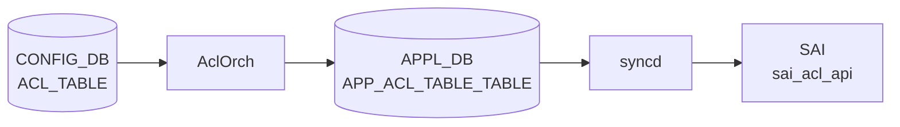

# ACL_TABLE (CTRLPLANE) テーブル

## 概要

`ACL_TABLE` テーブルで `type=CTRLPLANE` を指定した場合のコントロールプレーン [ACL](../../reference/glossary.md#term-acl)。`orchagent` の `AclOrch` はこのテーブルを [SAI](../../reference/glossary.md#term-sai) に投入せず、`m_ctrlAclTables` に記録するのみ[^1]。実際の CPU 宛パケット制御は `COPP_GROUP` / `COPP_TRAP` テーブル → `coppmgr` → `CoppOrch` の別経路で行われる。

!!! warning "YANG 未定義"
    `ACL_TABLE` (CTRLPLANE 含む) は現時点で `sonic-yang-models` に該当する YANG モジュールが存在しない。スキーマの正本は `sonic-swss/orchagent/aclorch.{h,cpp}` の定数とロジック。

!!! note "CTRLPLANE ACL と CoPP の関係"
    SONiC の実装では、`ACL_TABLE|<name>` に `type=CTRLPLANE` を設定しても、orchagent は SAI テーブルを生成しない。`COPP_GROUP` / `COPP_TRAP` が CoPP を管理する本体であり、CTRLPLANE ACL テーブルは歴史的経緯によるラベルとして残っている。

<!-- cdb-mermaid -->
### データフロー (自動生成)



!!! note "凡例"
    CONFIG_DB から SAI までの典型経路を `docs/reference/config-db-orch-map.md` から機械生成したミニ図。詳細・例外は本ページ本文と対応表を参照。
<!-- /cdb-mermaid -->

## key 構造

```text
ACL_TABLE|<table_name>
```

`<table_name>` はユーザ任意の文字列。`type` フィールドに `CTRLPLANE` を指定することでコントロールプレーン [ACL](../../reference/glossary.md#term-acl) として扱われる。

## フィールド一覧

| フィールド | 型 | 必須 | 説明 |
|-----------|----|------|------|
| `type` | `CTRLPLANE` (固定) | ✅ | コントロールプレーン [ACL](../../reference/glossary.md#term-acl) を示す type 値 |
| `policy_desc` | string | - | テーブルの説明文 |
| `stage` | enum `ingress`/`egress` | - | ACL 適用段 (CTRLPLANE では [orchagent](../../reference/glossary.md#term-orchagent) が無視) |
| `services` | カンマ区切り string | - | サービス名リスト ([orchagent](../../reference/glossary.md#term-orchagent) が読み捨て) |
| `ports` | カンマ区切り PORT 名 | - | バインドポート (CTRLPLANE では通常空) |

## 購読者

- `orchagent` の `AclOrch`: `m_ctrlAclTables` に記録するのみ。[SAI](../../reference/glossary.md#term-sai) テーブル未生成
- `AclOrch::doAclRuleTask()`: `m_ctrlAclTables` に登録済みのテーブル名の ACL_RULE は INFO ログ後 erase (無視)

## 関連 CONFIG_DB / YANG / CLI

- 関連 [CONFIG_DB](../../reference/glossary.md#term-config_db): `COPP_GROUP`、`COPP_TRAP`、`ACL_TABLE`、`ACL_RULE`
- 関連 CLI: [`config acl`](../cli/config-acl.md)
- 関連 [YANG](../../reference/glossary.md#term-yang): なし（[YANG](../../reference/glossary.md#term-yang) 未定義）

<!-- cdb-exceptions -->
## 例外条件・特殊挙動

| 条件 | 挙動 |
|------|------|
| `type=CTRLPLANE` | `AclTable::validate()` が stage チェックをスキップして即 `return true` |
| `type=CTRLPLANE` + `addAclTable()` | [SAI](../../reference/glossary.md#term-sai) `create_acl_table` を呼ばず `m_ctrlAclTables` に追加して即 return |
| `ACL_TABLE_SERVICES` フィールド | `doAclTableTask()` 内で `continue`（完全無視） |
| `ACL_RULE` を CTRLPLANE テーブルに追加 | `doAclRuleTask()` が `m_ctrlAclTables` でキーを発見 → INFO ログ + erase |
| default trap group DEL 試行 | `CoppOrch` が `"Cannot remove default trap group"` と WARN して task_ignore を返す |

<!-- evidence: sonic-net/sonic-swss/orchagent/aclorch.cpp:2727,4680,5556,5410 -->
<!-- /cdb-exceptions -->

<!-- value-behavior -->
## 値依存挙動マトリクス

### `type` 値別挙動 (CTRLPLANE 専用)

CTRLPLANE を `TABLE_TYPE_CTRLPLANE` マクロで定義 (`acltable.h:33`)。

| 値 | SAI 動作 | stage 参照 | ACL_RULE 処理 | evidence |
|---|---|---|---|---|
| `CTRLPLANE` | SAI テーブル非生成。`m_ctrlAclTables` 登録のみ | 無視 | INFO ログ後 erase (スキップ) | `aclorch.cpp:2727,4680,5556` |

### `services` 値別挙動

[YANG](../../reference/glossary.md#term-yang) では `must` 制約で CTRLPLANE 時に必須とされるが、[orchagent](../../reference/glossary.md#term-orchagent) は `continue` で無視する。

| 経路 | 挙動 |
|---|---|
| minigraph.py | XML `<Type>` 要素テキストを `services` リストに追加 (minigraph.py:1232,1247) |
| orchagent (doAclTableTask) | `continue` で完全無視 (aclorch.cpp:5410-5413) |
| [CoPP](../../reference/glossary.md#term-copp) 実際の制御 | `COPP_TRAP.trap_ids` フィールドが担う (copporch.cpp:26) |

### `stage` 値別挙動 (CTRLPLANE での特殊性)

| 値 | 通常 ACL の動作 | CTRLPLANE での動作 |
|---|---|---|
| `INGRESS` | SAI_ACL_STAGE_INGRESS | validate() で stage チェックをスキップ。SAI 未投入 |
| `EGRESS` | SAI_ACL_STAGE_EGRESS | 同上。stage 値は orchagent 内部でも実質参照されない |

<!-- /value-behavior -->

<!-- defaults -->
## コード由来の暗黙デフォルト (Phase A)

YANG 未定義テーブルのため、全デフォルトはコード実装が正本。CTRLPLANE ACL 固有の挙動を重点的に列挙する。

### field × 種別 一覧

| フィールド | 種別 | 暗黙デフォルト値 | ソース |
|---|---|---|---|
| `type` | 必須フィールド、デフォルトなし | — (省略時 erase) | `aclorch.cpp:5823` |
| `stage` | C++ struct 初期値 | **`INGRESS`** (CTRLPLANE では SAI 未送出のため実質無効) | `aclorch.h` struct メンバ初期値 |
| `policy_desc` | minigraph fallback / 直接書き込み | **`<table_name>`** (minigraph.py 経由) / `""` (直接) | `minigraph.py:1244`, `AclTable::description` |
| `ports` | 省略時空リスト | **`[]`** (minigraph.py は CTRLPLANE に ports をセットしない) | `minigraph.py:1229-1247` |
| `services` | orchagent 読み捨て | **実質なし** (orchagent が `continue` で無視) | `aclorch.cpp:5410-5413` |

### `stage` の詳細

`AclTable` C++ struct はメンバ変数 `stage` を `ACL_STAGE_INGRESS` で初期化する。`type=CTRLPLANE` の場合、`AclTable::validate()` (aclorch.cpp:2727-2730) は `stage==ACL_STAGE_UNKNOWN` チェックを実行せずに即 `return true` するため、stage 値はバリデーションに影響しない。また `addAclTable()` (aclorch.cpp:4680-4684) は CTRLPLANE 判定後に即 return するため SAI にも送出されない。minigraph.py が `stage=ingress/egress` を設定しても、orchagent 処理では完全に無視される。

### `services` の詳細

YANG モデル (`sonic-acl.yang.j2:438`) には `must "(not(type = 'CTRLPLANE')) or (boolean(services))"` の制約があり、CTRLPLANE では `services` が必須とされる。しかし orchagent の `doAclTableTask()` (aclorch.cpp:5410-5413) は `attr_name == ACL_TABLE_SERVICES` のとき `continue` を実行し、このフィールドを SAI 属性リストに追加しない。実際の CPU 宛パケット制御は `COPP_TRAP` テーブルの `trap_ids` フィールドが担う。

### `ports` の詳細

minigraph.py は `acl_intfs` リストが空 (インターフェースバインドなし) の場合に CTRLPLANE ACL と判定し、`ports` フィールドをエントリに含めない (`minigraph.py:1207-1247`)。orchagent の `processAclTablePorts()` が呼ばれたとしても、SAI テーブルが作成されないため bind point 設定も発生しない。

### CTRLPLANE ACL ルールの扱い

`ACL_RULE|<ctrlplane_table>|<rule>` が [CONFIG_DB](../../reference/glossary.md#term-config_db) に存在する場合、orchagent の `doAclRuleTask()` は `m_ctrlAclTables` でテーブルを検索し、見つかれば INFO ログ `"Skip control plane ACL rule"` を出力してエントリを erase する (aclorch.cpp:5556-5560)。ACL_RULE は SAI に一切送出されない。

### LSP トレース証跡

- 訪問ファイル数: 4 (`aclorch.cpp`, `aclorch.h`, `acltable.h`, `minigraph.py`)
- 訪問関数数: 8
- 検出 fallback: 5 件 (stage 初期値・policy_desc fallback・ports 空リスト・services 読み捨て・ルール erase)
- 中間トレース: `meta/_intermediate/cdb-flow/control-plane-acl-defaults.md`

<!-- /defaults -->

<!-- derivation -->
## 派生・条件付き登録 (Phase 6/7)

### Phase 6: 自動派生

| 派生先フィールド | 派生元条件 | 派生値 | ソース |
|---|---|---|---|
| `type` | minigraph.py: acl_intfs が空 (インターフェースバインドなし) | `CTRLPLANE` | `minigraph.py:1229-1247` |
| `policy_desc` | minigraph.py: 常に | `<aclname>` (テーブル名と同値) | `minigraph.py:1244` |
| `stage` | minigraph.py: XML `InAcl` タグ | `ingress` (orchagent では無視) | `minigraph.py:1103-1104` |
| `stage` | minigraph.py: XML `OutAcl` タグ | `egress` (orchagent では無視) | `minigraph.py:1106-1107` |
| `services` | minigraph.py: XML `<Type>` 要素テキスト | サービス文字列 (orchagent では無視) | `minigraph.py:1232,1247` |

### Phase 7: 条件付き登録

| 条件 | 影響 | ソース |
|---|---|---|
| `AclOrch` は常時登録 (platform 非依存) | CTRLPLANE ACL_TABLE 購読は無条件 | `orchdaemon.cpp:533,569` |
| `type=CTRLPLANE` | SAI テーブル非生成。`m_ctrlAclTables` に登録して即 return | `aclorch.cpp:4680-4684` |
| `COPP_GROUP` / `COPP_TRAP` の存在 | 実際の CPU 宛パケット制御はこちらが担う。CoppOrch は platform に関係なく登録 | `orchdaemon.cpp:577` |

### グレップカバレッジ

| 項目 | hit 数 | 証跡 |
|---|---|---|
| `TABLE_TYPE_CTRLPLANE` マクロ参照 | 4 | `aclorch.cpp:2727,3972,4680,5556`, `acltable.h:33` |
| minigraph.py CTRLPLANE 生成 | 3 | `minigraph.py:1237,1244,1245` |
| services `continue` (読み捨て) | 1 | `aclorch.cpp:5410-5413` |

<!-- /derivation -->

<!-- handler-branching -->
### Phase 8: Handler メソッド内分岐

CTRLPLANE ACL は `AclOrch::doAclTableTask()` と `doAclRuleTask()` の両方で特殊処理される。

| Handler | メソッド | 分岐条件 | 効果 | evidence |
|---|---|---|---|---|
| `AclOrch` | `doAclTableTask()` → `processAclTableType()` | `type=CTRLPLANE` | `processAclTableType()` 通過 (非空文字のため reject されない) | `aclorch.cpp:5380-5388,5823` |
| `AclOrch` | `doAclTableTask()` | `attr_name == ACL_TABLE_SERVICES` | `continue`（完全無視 — CTRLPLANE 専用フィールドのため orchagent は処理しない）| `aclorch.cpp:5410-5413` |
| `AclOrch` | `AclTable::validate()` | `type == TABLE_TYPE_CTRLPLANE` | `stage` バリデーションをスキップして即 `return true` | `aclorch.cpp:2727-2730` |
| `AclOrch` | `addAclTable()` | `type == TABLE_TYPE_CTRLPLANE` | SAI テーブル作成なし。`m_ctrlAclTables.emplace()` して即 return | `aclorch.cpp:4680-4684` |
| `AclOrch` | `doAclRuleTask()` | `table_oid == SAI_NULL_OBJECT_ID` かつ `m_ctrlAclTables` にキーあり | INFO ログ `"Skip control plane ACL rule"` + erase。ルール SAI 未投入 | `aclorch.cpp:5556-5560` |

> **スキャン証跡**: `doAclTableTask()` L5346-5520 および `doAclRuleTask()` L5520-5700 全行読了。`AclTable::validate()` L2725-2750、`addAclTable()` L4675-4700 確認。CTRLPLANE 固有分岐 5 件抽出。`services` フィールドの `continue` は L5410-5413 で確認、コメントに `"TODO: validate control plane ACL table has this attribute"` が残存 (L5412)。

<!-- /handler-branching -->

<!-- ordering -->
## 書込み順依存・タイミング依存 (Phase B)

CTRLPLANE ACL の実体は `caclmgrd` が管理する iptables ルール群である。`AclOrch` (orchagent) は `m_ctrlAclTables` に記録するのみで SAI に投入しない。そのため「書込み順依存」は orchagent 側ではなく **caclmgrd の iptables プログラム順序**に集約される。

### 1. caclmgrd が生成する iptables ルールの固定順序

`get_acl_rules_and_translate_to_iptables_commands()` (caclmgrd L625-902) は以下の固定順序でコマンドリストを構築する。

| 順位 | ルール種別 | 方向 | 備考 |
|------|-----------|------|------|
| 1 | デフォルトポリシー ACCEPT (INPUT/FORWARD/OUTPUT) | 設定 | フラッシュ中の接続断を防ぐ |
| 2 | 既存チェーン flush・delete | 削除 | DualToR 時 DHCP チェーンは保持 |
| 3 | loopback 127.0.0.1/::1 ACCEPT | INPUT | 常時 |
| 4 | [BFD](../../reference/glossary.md#term-bfd) UDP 3784,4784 ACCEPT | INPUT -I 2 | [BFD](../../reference/glossary.md#term-bfd) セッションが [STATE_DB](../../reference/glossary.md#term-state_db) に存在する場合のみ |
| 5 | VxLAN UDP 4789 ACCEPT | INPUT -I 2 | VXLAN_TUNNEL に src_ip がある場合のみ |
| 6 | [DASH](../../reference/glossary.md#term-dash)-HA swbus_port ACCEPT | INPUT -I 2 | dash-ha feature が存在する場合のみ |
| 7 | 内部 Docker IP ACCEPT | INPUT | multi-[ASIC](../../reference/glossary.md#term-asic) 時のみ実質追加 |
| 8 | Chassis midplane ACCEPT | INPUT | chassis / [SmartSwitch](../../reference/glossary.md#term-smartswitch) 時のみ |
| 9 | ESTABLISHED/RELATED ACCEPT | INPUT | conntrack |
| 10 | ICMPv4 (echo/reply/unreachable/time-exceeded) ACCEPT | INPUT | 常時 |
| 11 | ICMPv6 (同上 + [NDP](../../reference/glossary.md#term-ndp) NS/NA/RS/RA) ACCEPT | INPUT | 常時 |
| 12 | DualToR: UDP 67 → DHCP チェーン | INPUT | DualToR 時のみ |
| 13 | DHCP UDP 67:68 / 546:547 ACCEPT | INPUT | 常時 |
| 14 | [BGP](../../reference/glossary.md#term-bgp) TCP 179 ACCEPT (`! -i eth0`) | INPUT | 常時 |
| 15 | ICMPv6 conntrack 無効化 | raw PREROUTING/OUTPUT | 常時 |
| 16 | **[CONFIG_DB](../../reference/glossary.md#term-config_db) ACL_RULE → iptables -A INPUT** | INPUT | PRIORITY 降順ソート後に追加 |
| 17 | ip2me DROP (各インターフェース IP) | INPUT | LOOPBACK/[VLAN](../../reference/glossary.md#term-vlan)/PORTCHANNEL/INTERFACE |
| 18 | TTL < 2 ICMP/UDP/TCP ACCEPT (traceroute) | INPUT | 常時 |
| 19 | デフォルト DROP (num_ctrl_plane_acl_rules > 0 の場合のみ) | INPUT | ルール 0 件なら追加しない |

> **証跡**: `caclmgrd L625-901` 全行読了。`caclmgrd.service` systemd 依存確認。

### 2. ACL_RULE の PRIORITY 処理順序

```python
# caclmgrd L774, L825
acl_rules[rule_props["PRIORITY"]] = rule_props
...
for priority in sorted(iter(acl_rules.keys()), reverse=True):
    rule_cmd += ["-A", "INPUT", ...]
```

CONFIG_DB の `ACL_RULE` を読み込み、同一テーブル内のルールを `PRIORITY` 値で dict に格納後、**降順ソート** (`reverse=True`) で `iptables -A INPUT` する。高 PRIORITY 値のルールが先に `-A` されるため、iptables チェーンの上位に配置される。

→ **PRIORITY の重複**: 同じ PRIORITY 値が複数ルールに設定された場合、後勝ち (dict への上書き) となり、重複 PRIORITY を持つルールの一方が消失する。caclmgrd にはこの重複チェックはない。

### 3. Config DB 更新時のデバウンス

Config DB の `ACL_TABLE` / `ACL_RULE` 変更通知受信後、caclmgrd は `UPDATE_DELAY_SECS = 0.5` 秒のデバウンス (`check_and_update_control_plane_acls()`) を経てから全ルールを再インストールする。

連続した ACL 更新（複数ルール一括投入など）はデバウンス期間内にまとめられ、最後の変更から 0.5 秒後に 1 回の `update_control_plane_acls()` が呼ばれる。

```python
# caclmgrd L123
UPDATE_DELAY_SECS = 0.5

# caclmgrd L960-980
while True:
    time.sleep(self.UPDATE_DELAY_SECS)
    with self.lock[namespace]:
        if self.num_changes[namespace] > num_changes:
            num_changes = self.num_changes[namespace]   # もう一度 sleep
        else:
            self.update_control_plane_acls(...)         # 安定したら適用
            self.num_changes[namespace] = 0
            return
```

### 4. warm-reboot 挙動

caclmgrd スクリプトには warm-reboot / reconcile ロジックが存在しない。systemd サービスの設定も `Restart=always` のみ。

```ini
# caclmgrd.service
Requires=config-setup.service
After=config-setup.service
```

warm-reboot 時は caclmgrd が systemd によって再起動され、起動直後に `update_control_plane_acls()` が全 namespace に対してフルリプログラムを実施する。

**影響**: iptables チェーンのフラッシュとルール再投入の間、デフォルトポリシーが `ACCEPT` に設定される (順位 1)。このため再起動中に CPU 宛パケット（SSH/[SNMP](../../reference/glossary.md#term-snmp)/[BGP](../../reference/glossary.md#term-bgp) 等）が一時的に全通過する状態になる。ACL による制限は全ルール再投入完了（順位 19 の DROP 追加）後に復元される。

### 5. orchagent (AclOrch) 側の順序依存

`AclOrch::doAclRuleTask()` は `m_ctrlAclTables` にキーが存在するルールを即 erase（スキップ）する。CTRLPLANE テーブルは SAI OID が割り当てられないため、ACL_TABLE → ACL_RULE の書き込み順序に関わらず orchagent 側でのデッドロックは発生しない。

| 書込みパターン | orchagent の挙動 |
|---|---|
| ACL_TABLE(CTRLPLANE) → ACL_RULE | TABLE 登録後 RULE を erase。順序通り |
| ACL_RULE → ACL_TABLE(CTRLPLANE) | RULE 到着時 `table_oid == SAI_NULL_OBJECT_ID` かつ `m_ctrlAclTables` 未登録 → `it++` で再試行待機。TABLE 登録後に RULE が再処理され erase |

> **証跡**: `aclorch.cpp:5548-5566` (`doAclRuleTask()` CTRLPLANE erase ロジック確認)

<!-- /ordering -->

<!-- cross-refs -->
## 暗黙参照テーブル (Phase C)

`ACL_TABLE (CTRLPLANE)` は `orchagent` 側では SAI に投入されず参照テーブルが最小限に留まる。
実際の CPU 宛ルール生成は `caclmgrd` が行い、複数の CONFIG_DB / [STATE_DB](../../reference/glossary.md#term-state_db) テーブルを暗黙参照する。

| 参照元 (caclmgrd) | 参照先テーブル | 参照先フィールド | 用途 | evidence |
|---|---|---|---|---|
| `get_acl_rules_and_translate_to_iptables_commands()` | `ACL_RULE` | `PRIORITY`, `PACKET_ACTION`, `SRC_IP`, `IP_PROTOCOL` 等 | iptables ルール本体の生成 | `caclmgrd L729-730` |
| `__init__()` | `DEVICE_METADATA` | `localhost.subtype`, `localhost.platform` | DualToR 判定・プラットフォーム判定 | `caclmgrd L165` |
| `main()` VxLAN subscribe | `VXLAN_TUNNEL` | `src_ip` | VxLAN UDP 4789 ACCEPT ルール生成条件 | `caclmgrd L1160` |
| `main()` [BFD](../../reference/glossary.md#term-bfd) subscribe | `STATE_DB/BFD_SESSION_TABLE` | セッション存在有無 | BFD UDP 3784/4784 ACCEPT ルール生成条件 | `caclmgrd L1157` |
| `generate_block_ip2me_traffic_iptables_commands()` | `LOOPBACK_INTERFACE`, `VLAN_INTERFACE`, `INTERFACE`, `PORTCHANNEL_INTERFACE` | 各 IP prefix | ip2me DROP ルール生成 | `caclmgrd L286-330` |

### orchagent 側の参照

`AclOrch` は CTRLPLANE テーブルを `m_ctrlAclTables` に登録するのみ。SAI / [APPL_DB](../../reference/glossary.md#term-appl_db) への書き込みなし。他テーブルへの暗黙参照もない。

> **スキャン証跡**: `sonic-host-services/scripts/caclmgrd` 全行読了。`caclmgrd L77-91` (定数定義), `L165,L286-330,L729-730,L1157,L1160` (テーブル参照箇所) を確認。

<!-- /cross-refs -->

<!-- failure -->
## 失敗挙動マトリクス (Phase D)

<!-- evidence: sonic-host-services/scripts/caclmgrd L226-238 (run_commands), L748-821 (get_acl_rules_and_translate), L943-993 (check_and_update), L1200-1201 (SIGKILL), aclorch.cpp:5554-5566 (CTRLPLANE erase) -->

### caclmgrd 側の SET 処理失敗経路

| 失敗条件 | 検出箇所 | 結果 | 自動回復 |
|---|---|---|---|
| `type != CTRLPLANE` | `caclmgrd:743` | そのテーブルをスキップ（iptables ルール未生成） | なし（type 訂正 + ACL 変更イベント待ち） |
| `acl_service` が `ACL_SERVICES` 外（未知サービス名） | `caclmgrd:748` | `log_warning()` → そのサービスをスキップ | なし（有効サービス名に書き直すこと） |
| `rule_props` が空 / None | `caclmgrd:769` | `log_warning()` → `continue`（ルールスキップ） | なし（ACL_RULE 再 SET が必要） |
| `PRIORITY` キー欠落 | `caclmgrd:774` | `log_error()` → `continue`（ルールスキップ） | なし（ACL_RULE 再 SET が必要） |
| ACL_RULE に SRC_IP / SRC_IPV6 / DST_IP / DST_IPV6 が全て空 | `caclmgrd:812` | `log_warning()` → テーブル全スキップ | あり（IP 付きルール追加後の次回更新で回復） |
| `dst_ports` が空（EXTERNAL_CLIENT でポートが解決できない） | `caclmgrd:818` | `log_warning()` → テーブルスキップ | あり（`L4_DST_PORT` 追加後の次回更新で回復） |
| iptables コマンド実行失敗（非ゼロ exit） | `caclmgrd:236` | `log_error()` → 後続コマンドは継続（部分未設定が残る） | なし（ルール抜け穴が生じる可能性あり） |
| IPv4 テーブルに IPv6 ルール混在（ip_version 矛盾） | `caclmgrd:801` | `log_error()` → 混在ルールを `acl_rules` から除去 | なし（矛盾ルールは恒久スキップ） |
| 子スレッドで未捕捉例外発生 | `caclmgrd:981` | `thread_exceptions[ns]` に記録 → メインループが `os.kill(SIGKILL)` | systemd `Restart=always` で自動再起動 |

### caclmgrd 側の DEL 処理

| 失敗条件 | 検出箇所 | 結果 | 自動回復 |
|---|---|---|---|
| ACL_TABLE DEL イベント受信 | `caclmgrd:1268` | 変更フラグを立て `update_control_plane_acls()` を実行（iptables 全フラッシュ＆再生成） | あり（次回更新でそのテーブルが除外される） |
| ACL_RULE DEL イベント受信 | `caclmgrd:1268` | 変更フラグを立て `update_control_plane_acls()` を実行 | あり（次回更新でそのルールが生成されなくなる） |

### orchagent (AclOrch) 側の CTRLPLANE 専用分岐

| 失敗条件 | 検出箇所 | 結果 |
|---|---|---|
| `ACL_TABLE` type=CTRLPLANE の SET | `aclorch.cpp:4276` | `m_ctrlAclTables` に登録のみ。SAI API 呼び出しなし（失敗概念なし） |
| `ACL_RULE` 対応テーブルが `m_ctrlAclTables` 内に存在 | `aclorch.cpp:5554` | INFO ログ → `erase(it)` → 恒久スキップ |
| `ACL_RULE` 到着時 ACL_TABLE 未登録 | `aclorch.cpp:5563` | `it++` → 次 tick で再試行（TABLE 登録後に CTRLPLANE erase） |

!!! note "caclmgrd の失敗は iptables 部分未設定で継続"
    `run_commands()` は各コマンドを順番に実行し、失敗コマンドは `log_error()` を出すが後続コマンドは継続する。1 ルールの iptables 登録失敗が全体をブロックしない一方、ACL 抜け穴が生じる可能性がある（`caclmgrd:226-238`）。

!!! warning "子スレッド例外はメインプロセスごと SIGKILL"
    `check_and_update_control_plane_acls()` 内で未捕捉例外が発生すると、メインループの次サイクルで `os.kill(os.getpid(), signal.SIGKILL)` が実行される（`caclmgrd:1200-1201`）。systemd `Restart=always` により自動再起動されるが、再起動中は iptables ルールが一時的にフラッシュされる。

<!-- /failure -->

<!-- constants -->
## コード定数カタログ (Phase E)

CTRLPLANE ACL に関係するコード定数を `acltable.h`、`aclorch.h`、`caclmgrd` から抽出する。

### acltable.h: フィールド名マクロ

CONFIG_DB フィールド名と C++ マクロ名の対応。

| C++ マクロ | CONFIG_DB フィールド名 | evidence |
|---|---|---|
| `ACL_TABLE_DESCRIPTION` | `POLICY_DESC` | `acltable.h:12` |
| `ACL_TABLE_STAGE` | `STAGE` | `acltable.h:13` |
| `ACL_TABLE_TYPE` | `TYPE` | `acltable.h:14` |
| `ACL_TABLE_PORTS` | `PORTS` | `acltable.h:15` |
| `ACL_TABLE_SERVICES` | `SERVICES` | `acltable.h:16` |

### acltable.h: TYPE 値マクロ

`type` フィールドに設定できる全 TYPE 値。`TABLE_TYPE_CTRLPLANE` のみが SAI テーブルを生成しない特殊扱い。

| C++ マクロ | 文字列値 | SAI テーブル生成 |
|---|---|---|
| `TABLE_TYPE_CTRLPLANE` | `"CTRLPLANE"` | **なし** (`m_ctrlAclTables` 登録のみ) |
| `TABLE_TYPE_L3` | `"L3"` | あり |
| `TABLE_TYPE_L3V6` | `"L3V6"` | あり |
| `TABLE_TYPE_MIRROR` | `"MIRROR"` | あり |
| その他 11 種 | `"PFCWD"` 等 | あり |

> evidence: `acltable.h:26-42`

### caclmgrd: ACL_SERVICES 定数テーブル

`services` フィールドに設定できる有効値は以下 5 種のみ。それ以外は `log_warning` 後スキップ。

| services 値 | プロトコル | 宛先ポート | multi-[ASIC](../../reference/glossary.md#term-asic) NAT転送 | evidence |
|---|---|---|---|---|
| `NTP` | udp | 123 | False | `caclmgrd:96-100` |
| `SNMP` | tcp, udp | 161 | True | `caclmgrd:101-105` |
| `SSH` | tcp | 22 | True | `caclmgrd:106-110` |
| `EXTERNAL_CLIENT` | tcp | ACL_RULE から取得 (`L4_DST_PORT` / `L4_DST_PORT_RANGE`) | False | `caclmgrd:111-114` |
| `ANY` | any | `0` (全ポート) | False | `caclmgrd:115-119` |

`dst_ports: ["0"]` は内部フラグで「ポートフィルタなし」を意味する。iptables コマンド生成時に `dst_port != "0"` のチェックで `--dport` を省略する (`caclmgrd:859`)。

### caclmgrd: その他の数値定数

| 定数名 | 値 | 用途 | evidence |
|---|---|---|---|
| `UPDATE_DELAY_SECS` | `0.5` | ACL 更新デバウンス間隔 (秒) | `caclmgrd:123` |
| `smartswitch_midplane_bridge_ip` | `"169.254.200.254"` | [SmartSwitch](../../reference/glossary.md#term-smartswitch) midplane bridge IP (ConfigDB から取得できない場合のフォールバック) | `caclmgrd:121` |
| [BGP](../../reference/glossary.md#term-bgp) ポート | `179` | iptables ACCEPT ルール (ハードコード) | `caclmgrd:720-721` |
| DHCP v4 ポート | `67:68` | iptables ACCEPT ルール (ハードコード) | `caclmgrd:711-712` |
| DHCP v6 ポート | `546:547` | iptables ACCEPT ルール (ハードコード) | `caclmgrd:715-716` |
| traceroute ポート範囲 | `1025:65535` | TTL<2 パケットの ACCEPT 範囲 | `caclmgrd:891-894` |

### PACKET_ACTION 値と iptables 互換性

caclmgrd は `ACL_RULE.PACKET_ACTION` を `iptables -j <値>` に **そのまま** 渡す (`caclmgrd:873`)。

| 値 | iptables 解釈 | 結果 |
|---|---|---|
| `ACCEPT` | `-j ACCEPT` | パケット許可 |
| `DROP` | `-j DROP` | パケット破棄 |
| `FORWARD` / `REDIRECT` 等 | iptables 未定義ターゲット | コマンド失敗 → `log_error()` のみ、後続ルール継続 |

> **注意**: orchagent 側の `PACKET_ACTION_FORWARD` 等のマクロ (`aclorch.h:83-88`) は CTRLPLANE では参照されない。caclmgrd が直接文字列を iptables に渡すため、`ACCEPT` / `DROP` 以外は iptables コマンド失敗になる。

> スキャン証跡: `acltable.h` 全行、`aclorch.h:83-88`、`caclmgrd:77-123,859,873` 確認。定数 10 カテゴリ抽出。中間トレース: `meta/_intermediate/cdb-flow/control-plane-acl-constants.md`

<!-- /constants -->

<!-- side-effects -->
## 書き込み副作用カタログ (Phase F)

ACL_TABLE (CTRLPLANE) が SET/DEL されたとき、複数の担い手がカーネルや DB に副作用を生じる。

### orchagent (AclOrch) の副作用

| 副作用 | 書き込み先 | 条件 | evidence |
|-------|-----------|------|---------|
| `status = "active"` を書き込む | `STATE_DB / ACL_TABLE_TABLE` | CTRLPLANE SET 成功時 (addAclTable が true を返すと doAclTableTask が setAclTableStatus を呼ぶ) | `aclorch.cpp:4680-4684, 5474-5477, 6088-6093` |
| SAI への書き込み | なし | CTRLPLANE では addAclTable が SAI API を呼ばずに即 return | `aclorch.cpp:4680-4684` |
| [APPL_DB](../../reference/glossary.md#term-appl_db) への書き込み | なし | AclOrch は [APPL_DB](../../reference/glossary.md#term-appl_db) に書き込まない | — |
| ACL_RULE の [STATE_DB](../../reference/glossary.md#term-state_db) 書き込み | なし | CTRLPLANE ルールは erase されるため setAclRuleStatus は呼ばれない | `aclorch.cpp:5556-5560` |

> **補足**: `AclOrch::init()` は起動時に全 ACL テーブル・ルールのステータスを STATE_DB からクリア (`removeAllAclTableStatus()` / `removeAllAclRuleStatus()`) する。CTRLPLANE テーブルが ACL_TABLE_TABLE に `active` として書き込まれても、次の orchagent 再起動時にはクリアされ、CONFIG_DB からの再読み込みで再び `active` に戻る。`aclorch.cpp:3479-3481`

### caclmgrd の副作用

CONFIG_DB の `ACL_TABLE` / `ACL_RULE` が変更されると、caclmgrd は **カーネルの iptables/ip6tables を全フラッシュして再インストール**する。

#### iptables / ip6tables INPUT チェーン (全プラットフォーム共通)

| 副作用 | 対象 | 条件 |
|-------|------|------|
| `INPUT / FORWARD / OUTPUT` デフォルトポリシーを `ACCEPT` に変更 | iptables + ip6tables | 常時（フラッシュ前の暫定設定） |
| 全チェーンのルールをフラッシュ (`-F`) | iptables | 常時（DualToR 時は DHCP チェーンを保持） |
| 非デフォルトチェーンを削除 (`-X`) | iptables + ip6tables | 常時 |
| loopback / BFD / VxLAN / [DASH](../../reference/glossary.md#term-dash)-HA / ICMP / DHCP / BGP ルールを再追加 | iptables + ip6tables | 常時（各機能の有効状態に依存） |
| CONFIG_DB ACL_RULE を `iptables -A INPUT` として追加 | iptables または ip6tables | CTRLPLANE ACL_RULE が存在する場合 |
| ip2me DROP ルールを追加 | iptables + ip6tables | LOOPBACK/[VLAN](../../reference/glossary.md#term-vlan)/PORTCHANNEL/INTERFACE の IP 数だけ |
| デフォルト DROP (`-A INPUT -j DROP`) を追加 | iptables + ip6tables | `num_ctrl_plane_acl_rules > 0` の場合のみ |
| ip6tables raw テーブルに ICMPv6 NOTRACK を追加 | ip6tables raw | 常時 |

evidence: `caclmgrd:625-901` (`get_acl_rules_and_translate_to_iptables_commands()` 全体)

#### iptables nat テーブル (multi-ASIC 専用)

multi-[ASIC](../../reference/glossary.md#term-asic) 環境では各 ASIC 名前空間の nat テーブルも書き換わる。

| 副作用 | 対象サービス | 書き込み |
|-------|-------------|---------|
| nat チェーン全削除・フラッシュ | — | `iptables/ip6tables -t nat -X / -F` |
| DNAT: フロントパネル着信 → host mgmt IP | [SNMP](../../reference/glossary.md#term-snmp), SSH (`multi_asic_ns_to_host_fwd=True`) | `iptables -t nat -A PREROUTING ... -j DNAT` |
| SNAT: host → namespace docker IP | [SNMP](../../reference/glossary.md#term-snmp), SSH | `iptables -t nat -A POSTROUTING ... -j SNAT` |

evidence: `caclmgrd:476-516` (`generate_fwd_traffic_from_namespace_to_host_commands()`)

#### iptables 副作用 (DualToR 専用)

| 副作用 | 書き込み |
|-------|---------|
| SOC 向け SNAT (Loopback3 ソース IP) | `iptables -t nat -A POSTROUTING --destination <soc_ip> -j SNAT` |
| BGP Loopback1 宛パケット DROP | `iptables -I INPUT 1 -d <loopback1> -p tcp --dport 179 -j DROP` |

evidence: `caclmgrd:429-473, 401-427`

#### スレッド生成

ACL_TABLE/ACL_RULE 変更通知受信のたびに `threading.Thread` を起動し、0.5 秒デバウンス後に `update_control_plane_acls()` を実行する。スレッドは完了後に自動クリーンアップ。

evidence: `caclmgrd:1299-1303`

#### 起動時の副作用

caclmgrd 起動時、全 namespace に対して無条件で `update_control_plane_acls()` を実行する。これにより既存の iptables ルールが一度フラッシュ・再インストールされる。

evidence: `caclmgrd:1169-1171`

> スキャン証跡: `caclmgrd` 全行読了。`aclorch.cpp:4680-4684, 5474-5477, 6088-6093, 3479-3481` 確認。副作用 7 カテゴリ抽出。中間トレース: `meta/_intermediate/cdb-flow/control-plane-acl-side-effects.md`

<!-- /side-effects -->

<!-- pubsub -->
## 通信メカニズム (Phase G)

<!-- evidence: sonic-host-services/scripts/caclmgrd:1112-1304 (run メインループ) / caclmgrd:943-993 (check_and_update_control_plane_acls) / caclmgrd:123,959 (UPDATE_DELAY_SECS=0.5) / caclmgrd:1221-1224 (BFD one-shot) -->

`ACL_TABLE (CTRLPLANE)` の主要な実行時 Consumer は **caclmgrd** であり、swsscommon の `SubscriberStateTable` + `Select` による低レベル購読を使用する。orchagent (`AclOrch`) は Orch フレームワークの Consumer として CONFIG_DB を購読するが、CTRLPLANE テーブルは SAI に渡さずに `m_ctrlAclTables` へ記録するのみである。

### 購読テーブル

| 購読元 DB | テーブル | 購読 API | 目的 |
|-----------|---------|---------|-----|
| CONFIG_DB | `ACL_TABLE` | `SubscriberStateTable` | CTRLPLANE ACL テーブル定義 SET/DEL の検出 |
| CONFIG_DB | `ACL_RULE` | `SubscriberStateTable` | CTRLPLANE ACL ルール SET/DEL の検出 |
| CONFIG_DB | `VXLAN_TUNNEL` | `SubscriberStateTable` | VxLAN トンネル設定変更の検出 |
| CONFIG_DB | `DPU` | `SubscriberStateTable` | [DASH](../../reference/glossary.md#term-dash)-HA 用 [DPU](../../reference/glossary.md#term-dpu) 設定変更の検出 |
| STATE_DB | `BFD_SESSION_TABLE` | `SubscriberStateTable` (one-shot) | BFD セッション初回 SET の検出後に購読解除 |
| STATE_DB | `MUX_CABLE_TABLE` | `SubscriberStateTable` | DualToR 時のみ: [MUX](../../reference/glossary.md#term-mux) ケーブル状態変化 |
| STATE_DB | `DHCP_PACKET_MARK` | `SubscriberStateTable` | DualToR 時のみ: DHCP パケットマーク変化 |

caclmgrd は `swsscommon.Select` に全テーブルを `addSelectable()` で登録し、`sel.select(1000ms)` でブロッキングポーリングを行う。`hostcfgd` が Python ラッパの `ConfigDBConnector.subscribe()` を使うのとは異なり、caclmgrd は swsscommon 低レベル API を直接使用し、マルチ namespace にも対応している。

### 通知受信 → iptables 更新フロー

```
CONFIG_DB ACL_TABLE / ACL_RULE 変更
  ↓ SubscriberStateTable.pop() (caclmgrd L1268-1286)
  ctrl_plane_acl_notification.add(namespace)
  ↓ lock 取得 → num_changes++ (L1290-1295)
  threading.Thread → check_and_update_control_plane_acls(namespace)
    ↓ UPDATE_DELAY_SECS=0.5 秒 デバウンス (L959)
    update_control_plane_acls(namespace, new_config_db_connector)
      → CONFIG_DB から ACL_TABLE / ACL_RULE を get_table() で全量スナップショット取得
      → iptables / ip6tables を全フラッシュ後に再インストール
```

### デバウンス機構

`check_and_update_control_plane_acls()` (caclmgrd:943-993) は `time.sleep(0.5)` 後に `num_changes[namespace]` を確認し、スリープ中に追加変更通知があれば再スリープする。minigraph.py が ACL_TABLE / ACL_RULE を一括投入する際など、連続 SET/DEL で iptables が複数回フラッシュされるのを防ぐ。

### BFD セッションの one-shot 購読

BFD セッションの最初の SET を検出後、caclmgrd は `sel.removeSelectable(subscribe_bfd_session)` で購読を解除する (caclmgrd:1224)。BFD ルールは `self.bfdAllowed == True` フラグで管理され、以降の iptables 全フラッシュ時に再追加される。

> スキャン証跡: `caclmgrd` 全行読了。購読テーブル 7 件、デバウンス機構、BFD one-shot 購読解除を確認。中間トレース: `meta/_intermediate/cdb-flow/control-plane-acl-pubsub.md`

<!-- /pubsub -->

<!-- platform -->
## プラットフォーム差異 (Phase H)

`caclmgrd` は `device_info` API でプラットフォーム種別を検出し、iptables ルールセットを切り替える。`AclOrch` 側はプラットフォーム非依存で常時登録される。

### プラットフォーム別挙動マトリクス

| プラットフォーム種別 | 判定条件 | 追加挙動 | ソース |
|---|---|---|---|
| 単一 ASIC 標準スイッチ | 上記以外 | デフォルト namespace のみ処理。追加ルールなし | — |
| multi-ASIC | `device_info.is_multi_npu()` | 全 namespace (front/back/fabric) で独立ルールセット適用。`SNMP` / `SSH` の front panel → host [NAT](../../reference/glossary.md#term-nat) (SNAT/DNAT) ルールを namespace 単位で生成 | `caclmgrd L147,169-190,1124,1169-1184,476-516` |
| DualToR | `DEVICE_METADATA\|localhost\|subtype == 'DualToR'` | DHCP カスタムチェーン作成。`MUX_CABLE_TABLE` / `DHCP_PACKET_MARK` 購読。SoC 向け POSTROUTING SNAT 追加。BGP to Loopback1 DROP ルール追加。chain flush 時に DHCP チェーンを除外 | `caclmgrd L165-167,1143-1154,644,707-708,935-940` |
| Chassis (ラインカード) | `device_info.is_chassis() and not namespace` | midplane インターフェース `eth1-midplane` の IP を取得し、自己 IP → 自己 IP ACCEPT + midplane デバイスからの全 INPUT ACCEPT を追加 | `caclmgrd L358-363` |
| [SmartSwitch](../../reference/glossary.md#term-smartswitch) | `device_info.is_smartswitch()` | `MID_PLANE_BRIDGE\|GLOBAL\|ip_prefix` から midplane bridge IP を取得し、その IP 宛 INPUT ACCEPT を追加。取得失敗時 fallback `169.254.200.254` | `caclmgrd L365-368,333-354` |

### AclOrch / orchdaemon 側

`orchdaemon.cpp:533-534` で `gAclOrch = new AclOrch(...)` はプラットフォーム条件なしで無条件登録される。`type=CTRLPLANE` の `m_ctrlAclTables` 登録ロジックも platform 非依存。**iptables ルール適用は caclmgrd が担い、orchagent 側に platform 分岐はない。**

### multi-ASIC 時の NAT ルール対象サービス

`ACL_SERVICES` 定義のうち `multi_asic_ns_to_host_fwd: True` のサービスのみ namespace → host [NAT](../../reference/glossary.md#term-nat) 対象となる。

| サービス | multi_asic_ns_to_host_fwd | [NAT](../../reference/glossary.md#term-nat) 対象 |
|---|---|---|
| `NTP` | False | 非対象 |
| `SNMP` | True | PREROUTING DNAT + POSTROUTING SNAT |
| `SSH` | True | PREROUTING DNAT + POSTROUTING SNAT |
| `EXTERNAL_CLIENT` | False | 非対象 |
| `ANY` | False | 非対象 |

> スキャン証跡: `caclmgrd` 全行読了。`device_info.is_chassis()` / `is_smartswitch()` / `is_multi_npu()` / `DualToR` 各分岐を確認。`orchdaemon.cpp:533` にて platform 条件なしの AclOrch 登録を確認。中間トレース: `meta/_intermediate/cdb-flow/control-plane-acl-platform.md`

<!-- /platform -->

<!-- ref-triangle:start -->

## 関連リファレンス

- CLI: [`config acl`](../cli/config-acl.md)
- CONFIG_DB: [`COPP_GROUP`](copp-group.md)
- CONFIG_DB: [`COPP_TRAP`](copp-trap.md)
- CONFIG_DB: [`ACL_TABLE`](acl-table.md)

<!-- ref-triangle:end -->

## 引用元

[^1]: CTRLPLANE ACL の動作は `sonic-swss/orchagent/aclorch.cpp` (sha `43055961`) の `AclTable::validate()`、`addAclTable()`、`doAclTableTask()`、`doAclRuleTask()` から抽出。<https://github.com/sonic-net/sonic-swss/blob/4305596156d70e9797e8a881b3d19b46de0bce0d/orchagent/aclorch.cpp>

## 関連ページ

- [HLD: ACL の基本設計](../../acl-qos/acl-support-in-sonic.md)
- [CLI: config acl](../cli/config-acl.md)
- [CONFIG_DB: ACL_TABLE](acl-table.md)
- [CONFIG_DB: ACL_RULE](acl-rule.md)
- [CONFIG_DB: COPP_GROUP](copp-group.md)
- [CONFIG_DB: COPP_TRAP](copp-trap.md)

<!-- topics-back-ref -->
## 関連 Topics

- [Topics: ACL / CoPP / Mirror / Packet Action](../../topics/07-acl-copp-mirror/index.md)

<!-- /topics-back-ref -->

<!-- ops-hint -->
## 運用ヒント

### 典型値

- key 形式: `ACL_TABLE|<table-name>`。
- `type`: `CTRLPLANE` (固定)。
- `services`: minigraph 由来のサービス文字列 (例: `SSH`, `SNMP`, `NTP`)。orchagent は無視するため show acl 等には反映されるが SAI には送出されない。
- `ports`: 通常空。

### よくある誤設定

- CTRLPLANE ACL に `ACL_RULE` を追加しても orchagent が erase するため、ルールは hardware に降りない。CPU 宛パケット制御は `COPP_GROUP` / `COPP_TRAP` で行う。
- `services` フィールドを変更しても orchagent に影響なし。[CoPP](../../reference/glossary.md#term-copp) 設定は `COPP_TRAP.trap_ids` を変更する。

### 確認コマンド

```bash
sonic-db-cli CONFIG_DB hgetall 'ACL_TABLE|SNMP_SSH_WHITELIST'
show acl table
sonic-db-cli CONFIG_DB keys 'COPP_TRAP|*'
```
<!-- /ops-hint -->

<!-- entry-points -->
## 書き込み入り口 (Direction A)

CONFIG_DB の `ACL_TABLE` (CTRLPLANE) を書き込むコードパス。

### minigraph

`sonic-buildimage/src/sonic-config-engine/minigraph.py:1102-1249`

XML `<AclInterface>` でインターフェースリストが空のとき CTRLPLANE ACL として生成。

| 生成フィールド | 生成値 |
|---|---|
| `type` | `CTRLPLANE` |
| `policy_desc` | `<aclname>` |
| `stage` | `ingress` (InAcl) / `egress` (OutAcl) |
| `services` | XML `<Type>` 要素テキスト |

### CLI

`sonic-utilities/config/main.py:8084-8123` — `config acl add table -t CTRLPLANE`

```python
config_db.set_entry("ACL_TABLE", table_name, table_info)
```

- `type=CTRLPLANE` を明示指定することで CTRLPLANE ACL として登録可能
- CLI 経由の場合 `services` フィールドは設定されない

### build-time デフォルト

なし。`init_cfg.json.j2` に ACL_TABLE エントリは存在しない。

### 死活 (runtime injection)

`orchagent` の `AclOrch` は ACL_TABLE を購読するのみ（書き込みなし）。

<!-- /entry-points -->

<!-- glossary-links-injected: d1ddc53adcf6 -->
