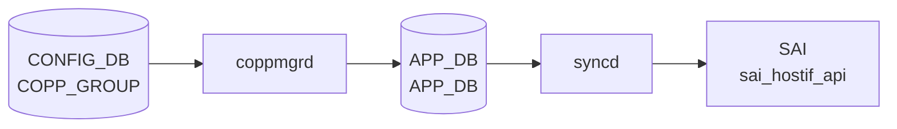
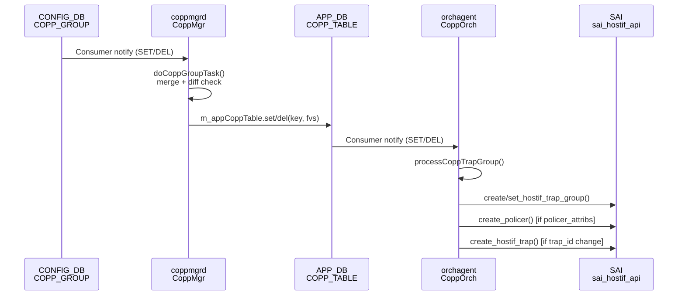

# COPP_GROUP テーブル

## 概要

CPU 宛トラフィックをレート制限する Control Plane [Policing](../../reference/glossary.md#term-policing) ([CoPP](../../reference/glossary.md#term-copp)) のグループ定義。各グループに CPU 受信キューと埋め込み policer (sr_TCM / tr_TCM / storm) を持ち、`COPP_TRAP` の `trap_group` から参照される[^1]。`copp.json` テンプレ → `coppmgr` → [APPL_DB](../../reference/glossary.md#term-appl_db) → `orchagent` (`CoppOrch`) → [SAI](../../reference/glossary.md#term-sai) HOSTIF_TRAP_GROUP / POLICER の流れで反映される。

<!-- cdb-mermaid -->
### データフロー (自動生成)



!!! note "凡例"
    CONFIG_DB から SAI までの典型経路を `docs/reference/config-db-orch-map.md` から機械生成したミニ図。詳細・例外は本ページ本文と対応表を参照。
<!-- /cdb-mermaid -->

<!-- pubsub -->
## 通信メカニズム

### CONFIG_DB → APPL_DB (coppmgr)

`coppmgr` (`docker-swss` 内) が `CONFIG_DB COPP_GROUP` テーブルを **Consumer** として購読する。

- **クラス**: `CoppMgr` — コンストラクタで `Orch(cfgDb, tableNames)` に `CFG_COPP_GROUP_TABLE_NAME` を渡して登録。<!-- evidence: coppmgr.cpp L296-297 -->
- **ハンドラ**: `doTask(Consumer&)` → `doCoppGroupTask(Consumer&)` — SET 時はフィールドをマージして `m_appCoppTable.set(key, modified_fvs)` で `APP_DB COPP_TABLE` へ書き込む。DEL 時は `m_appCoppTable.del(key)`。<!-- evidence: coppmgr.cpp L840-925, L968-984 -->
- **重複チェック**: `coppGroupGetModifiedFvs()` が変更のないフィールドを除外し、差分のみ APP_DB に伝播する。<!-- evidence: coppmgr.cpp L869-874 -->
- **STATE_DB**: `setCoppGroupStateOk(key)` で `STATE_DB STATE_COPP_GROUP_TABLE_NAME` に `ok` を書き込む。<!-- evidence: coppmgr.cpp L302, L875 -->

### APPL_DB → SAI (CoppOrch)

`orchagent` 内の `CoppOrch` が `APP_DB COPP_TABLE` を Consumer として購読し、`processCoppTrapGroup()` でSAI API を呼び出す。

- **クラス**: `CoppOrch(DBConnector* db, string tableName) : Orch(db, tableName)` — APP_DB `COPP_TABLE` を登録。<!-- evidence: copporch.cpp L191-192 -->
- **[SAI](../../reference/glossary.md#term-sai) API 呼び出し一覧**:

| 操作 | SAI API | 条件 |
|------|---------|------|
| トラップグループ新規作成 | `sai_hostif_api->create_hostif_trap_group()` | グループが未存在 (`m_trap_group_map` に未登録) |
| トラップグループ属性更新 | `sai_hostif_api->set_hostif_trap_group_attribute()` | グループが既存 |
| ポリサー作成・更新 | `sai_policer_api->create_policer()` | `policer_attribs` が非空 |
| Genetlink hostif 作成 | `sai_hostif_api->create_hostif()` | `genetlink_name` フィールドあり |
| hostif テーブルエントリ作成 | `sai_hostif_api->create_hostif_table_entry()` | Genetlink hostif 作成後 |
| trap 新規作成 | `sai_hostif_api->create_hostif_trap()` | trap_id 追加時 |

<!-- evidence: copporch.cpp L762, L780, L795-801, L844, L453, L515 -->

### pub/sub シーケンス図



<!-- /pubsub -->

## key 構造

```text
COPP_GROUP|<name>
```

## 主要フィールド

| フィールド | 型 | 必須 | 既定 | 説明 |
|-----------|----|------|------|------|
| `queue` | uint32 | no | 0 | CPU 受信キュー番号 (大きいほど高優先) |
| `trap_priority` | uint32 | no | 0 | trap の優先度 |
| `trap_action` | enum `policer_packet_action` | yes | - | trap 対象パケットへの動作 (forward/drop/copy 等) |
| `meter_type` | enum `meter_type` | yes | - | metering 単位 (`packets` / `bytes`) |
| `mode` | enum `sr_tcm`/`tr_tcm`/`storm` | yes | - | policer モード |
| `color` | enum `policer_color_source` | no | - | color awareness mode (aware / blind) |
| `cir` | uint64 | no | 0 | committed information rate |
| `cbs` | uint64 | no | 0 | committed burst size。`cbs >= cir` |
| `pir` | uint64 | tr_tcm 時 | - | peak information rate |
| `pbs` | uint64 | sr_tcm/tr_tcm 時 | - | peak burst size。`pbs >= cbs` |
| `green_action` / `yellow_action` / `red_action` | enum | no | `forward` | カラー別アクション |

## 制約

- `cbs` を設定するには `cir > 0` が必須
- `pir` は `mode = 'tr_tcm'` のときのみ有効 (`when`)
- `pbs` は `mode = 'sr_tcm'` または `'tr_tcm'` のときのみ有効
- `yellow_action` は `sr_tcm`/`tr_tcm` モードのみ

<!-- cdb-exceptions -->
## 例外条件・特殊挙動

- **NULL cfg → デフォルト設定のマージをスキップ**: ユーザ設定エントリのフィールドが `"NULL"` の場合、`coppmgr` の `mergeConfig()` はそのキー全体を init (デフォルト `copp.json`) からも除外する。<!-- evidence: coppmgr.cpp L222-224 mergeConfig -->
- **重複エントリ → APPL_DB 更新スキップ**: `isDupEntry()` で APPL_DB の既存値と全フィールドが一致する場合、`m_appCoppTable.set()` を呼ばない。SAI の不要な呼び出しを回避。<!-- evidence: coppmgr.cpp L263-284 isDupEntry -->
- **policer の meter / mode / color は変更不可**: 既存ポリサーへの `meter_type` / `mode` / `color_source` 変更を試みた場合 `SWSS_LOG_ERROR` を出力し当該属性の変更は**スキップ**される。他の属性の更新は続行。<!-- evidence: copporch.cpp L1331-1347 trapGroupUpdatePolicer -->
- **未知フィールド → task_failed**: `parseTrapGroupAttribute()` で認識できないフィールドが来た場合 `SWSS_LOG_ERROR("Unknown copp field specified:%s")` を出力し処理失敗となる。<!-- evidence: copporch.cpp L1290-1292 -->
- **task_failed → プロセス終了**: `CoppOrch` は `task_failed` が返った場合 syslog にエラーを出力してプロセス (`orchagent`) を終了する。<!-- evidence: copporch.cpp L922 -->

<!-- value-behavior -->
## 値依存挙動マトリクス

| フィールド | 値 | 挙動 |
|-----------|-----|------|
| `mode` | `sr_tcm` | Single Rate TCM。`cir` + `cbs` + `pbs` を使用。`yellow_action` が有効。`pir` は無効（YANG `when`）。SAI `SAI_POLICER_MODE_SR_TCM`。 |
| `mode` | `tr_tcm` | Two Rate TCM。`cir` + `cbs` + `pir` + `pbs` を使用。`pir` が有効（YANG `when`）。SAI `SAI_POLICER_MODE_TR_TCM`。 |
| `mode` | `storm` | Storm Control。`cir` のみ使用。`yellow_action` は無効。SAI `SAI_POLICER_MODE_STORM_CONTROL`。 |
| `meter_type` | `packets` | `cir`/`pir` の単位が pps（パケット/秒）。SAI `SAI_METER_TYPE_PACKETS`。 |
| `meter_type` | `bytes` | `cir`/`pir` の単位が bps（バイト/秒）。SAI `SAI_METER_TYPE_BYTES`。 |
| `color` | `aware` | 入力 [DSCP](../../reference/glossary.md#term-dscp)/color を引き継いで多段ポリシングが可能。SAI `SAI_POLICER_COLOR_SOURCE_AWARE`。 |
| `color` | `blind` | すべてのパケットを green として扱う。SAI `SAI_POLICER_COLOR_SOURCE_BLIND`。 |
| `trap_action` / `*_action` | `drop` | CPU に送らずに廃棄。SAI `SAI_PACKET_ACTION_DROP`。 |
| `trap_action` / `*_action` | `forward` | 通常転送。CPU にコピーしない。SAI `SAI_PACKET_ACTION_FORWARD`。 |
| `trap_action` / `*_action` | `copy` | CPU へコピーしつつ転送継続。SAI `SAI_PACKET_ACTION_COPY`。 |
| `trap_action` / `*_action` | `trap` | CPU に送り、ネットワーク転送を中止。SAI `SAI_PACKET_ACTION_TRAP`。 |

**注意**: `mode` / `color` は作成後の変更が不可（`copporch.cpp:1337` でエラーログを出力してスキップ）。変更するにはエントリを削除して再作成が必要。
<!-- /value-behavior -->

## 購読者

- `coppmgr` (`docker-swss` 内): [CONFIG_DB](../../reference/glossary.md#term-config_db) の `COPP_GROUP` / `COPP_TRAP` を結合し [APPL_DB](../../reference/glossary.md#term-appl_db) `COPP_TABLE` に書き込む
- `orchagent` の `CoppOrch`: [SAI](../../reference/glossary.md#term-sai) hostif trap group / policer を生成

## 関連 CONFIG_DB / YANG / CLI

- 関連 [CONFIG_DB](../../reference/glossary.md#term-config_db): `COPP_TRAP`
- 関連 CLI: `config copp`、`show copp`
- 関連 [YANG](../../reference/glossary.md#term-yang): `sonic-copp`

<!-- ref-triangle:start -->

## 関連リファレンス

- [YANG](../../reference/glossary.md#term-yang): [`sonic-copp`](../yang/sonic-copp.md)
- CLI: `config copp`

<!-- ref-triangle:end -->

## 引用元

[^1]: [YANG](../../reference/glossary.md#term-yang) 定義: `sonic-copp.yang`. <https://github.com/sonic-net/sonic-buildimage/blob/9ea932ec2e18f35e58268ec2e4456b1d4afd65cd/src/sonic-yang-models/yang-models/sonic-copp.yang>

<!-- topics-back-ref -->
## 関連 Topics

- [Topics: ACL / CoPP / Mirror / Packet Action](../../topics/07-acl-copp-mirror/index.md)

<!-- /topics-back-ref -->

<!-- ops-hint -->
## 運用ヒント

### 典型値

- key 形式: `COPP_GROUP|<group-name>` (`queue4_group1` 等)。
- `queue`: CPU queue 番号。
- `cir`: 例 `6000` (pps)。
- `trap_action`: `trap` / `forward` / `copy` / `drop`。

### よくある誤設定

- `cir` を過小に設定すると [BGP](../../reference/glossary.md#term-bgp) keepalive がドロップされて peer が落ちる。

### 確認コマンド

```bash
sonic-db-cli CONFIG_DB hgetall 'COPP_GROUP|queue4_group1'
show copp config
```
<!-- /ops-hint -->

<!-- runtime-trace -->
## 実コンテナ動作トレース

### 段階 1 — Consumer 登録

`coppmgrd` → `CoppOrch` ([APPL_DB](../../reference/glossary.md#term-appl_db) 経由) が [CONFIG_DB](../../reference/glossary.md#term-config_db) の `COPP_GROUP` テーブルを購読する。

`COPP_GROUP` の key はグループ名 (例: `default`, `queue4_group1`)。policer の `cir`/`cbs` を含む。

### 段階 2 — CFG→APPL 翻訳

`APP_COPP_TABLE` に書き込み (`COPP_TABLE`)

### 段階 3 — APPL→SAI

`sai_hostif_api` — `sai_create_hostif_trap_group` でトラップグループ (policer 込み) を作成/更新

### 段階 4 — タイミングと副作用

**適用タイミング**: CONFIG_DB 変化を `coppmgrd` が検知後 `APP_COPP_TABLE` に書き込み。`CoppOrch` が SAI trap group を更新。既存トラップのグループ再割り当ては即時反映。

**副作用**: policer (rate/burst) 変更は CPU 宛て control plane traffic の制限に即座に影響。誤設定により制御プレーンへの過剰 traffic が発生する可能性。
<!-- /runtime-trace -->

<!-- entry-points -->
## 書き込み入り口

対象テーブル: `COPP_GROUP`

### CLI
- `config copp add/del <group-name> ...`
  - ソース: `sonic-utilities/config/main.py (copp グループ)`

### minigraph / sonic-cfggen
- なし

### REST / gNMI (sonic-mgmt-common)
- なし (対応 OpenConfig/[SONiC](../../reference/glossary.md#term-sonic) YANG transformer なし)

### db_migrator
- なし

### ビルド時デフォルト (init_cfg / j2 テンプレート)
- プラットフォーム提供の `copp_cfg.j2` が `sonic-cfggen` 経由でデフォルト COPP グループを生成

### ハードコードデフォルト
- なし

### ランタイム注入 (デーモン自動書き込み)
- なし
<!-- /entry-points -->

<!-- derivation -->
## 派生・条件付き登録

### 値による他フィールド自動派生

| 条件 | 派生先 | evidence |
|---|---|---|
| COPP_GROUP は init_cfg / minigraph では生成されない（`/etc/sonic/copp_cfg.json` からロード） | — | `sonic-swss/orchagent/copporch.cpp` コメント |
| 派生なし | — | — |

### 条件付き module/manager 登録

| 条件 | 登録 module | evidence |
|---|---|---|
| 常時（条件なし） | `CoppOrch` が `COPP_GROUP` / `COPP_TRAP` を `doTask` で購読 | `sonic-swss/orchagent/copporch.cpp:737` |

### grep カバレッジ

- copporch.cpp 1200+ 行、COPP_GROUP 購読: 1 件（条件なし）
<!-- /derivation -->
<!-- handler-branching -->
### Handler メソッド内分岐

| Manager / Handler | メソッド | 分岐条件 | 効果 | evidence |
|---|---|---|---|---|
| `CoppOrch` | `processCoppTrapGroup()` | `op == SET_COMMAND` かつ trap_group が未存在 | SAI でトラップグループを新規作成 | `sonic-swss/orchagent/copporch.cpp:737,756` |
| `CoppOrch` | `processCoppTrapGroup()` | `op == DEL_COMMAND` かつ `trap_group_name == "default"` | `task_ignore`（デフォルトグループ削除を拒否） | `sonic-swss/orchagent/copporch.cpp:861-864` |
| `CoppOrch` | `processCoppTrapGroup()` | `genetlink_name` フィールドが存在する | Genetlink hostif を作成してトラップグループに紐付け | `sonic-swss/orchagent/copporch.cpp:844` |
| `CoppOrch` | `processCoppTrapGroup()` | `trap_ids` フィールド変更あり | `trapGroupProcessTrapIdChange()` でトラップ ID を追加・削除 | `sonic-swss/orchagent/copporch.cpp:853` |

> **裏取り**: `processCoppTrapGroup` L737-872 全行読了。デフォルトグループ削除拒否が最重要分岐。4 件抽出。
<!-- /handler-branching -->
<!-- platform -->
## プラットフォーム差

### SAI hostif trap group capability クエリ

`CoppOrch` 起動時に `sai_query_attribute_enum_values_capability()` で `SAI_OBJECT_TYPE_HOSTIF_TRAP` / `SAI_HOSTIF_TRAP_ATTR_TRAP_TYPE` をクエリし、ベンダー SAI がサポートするトラップ種別を取得する。結果は `STATE_DB.COPP_TRAP_CAPABILITY_TABLE|traps` の `trap_ids` フィールドに書き込まれる。<!-- evidence: copporch.cpp L240-299 publishTrapIdsCapability -->

- **対応ベンダー SAI**: 実際にサポートするトラップ種別のみが返り、`supported_trap_ids` にセットされる。
- **未対応ベンダー SAI**: クエリ失敗時はハードコード済みの `default_supported_trap_ids`（44 種、静的・更新なし）にフォールバック。

`supported_trap_ids` に含まれないトラップ ID は `processCoppTrapGroup()` 内でスキップされ、SAI への登録が行われない（サイレントスキップ）。<!-- evidence: copporch.cpp L411 -->

### `trap_priority` のプラットフォーム除外

`getenv("platform")` 環境変数で実行プラットフォームを判定し、以下の条件で `SAI_HOSTIF_TRAP_ATTR_TRAP_PRIORITY` のセットを **スキップ** する:

| プラットフォーム | `platform` 環境変数値 | trap_priority 設定 |
|---|---|---|
| Mellanox (NVIDIA) | `"mellanox"` を含む | **スキップ**（SAI 非対応） |
| Marvell Prestera | `"marvell-prestera"` を含む | **スキップ**（SAI 非対応） |
| その他（Broadcom / [VS](../../reference/glossary.md#term-vs) 等） | 上記以外または未設定 | 設定する |

デフォルトトラップ初期化時（`initDefaultTrapIds()`）とユーザ設定反映時（`parseTrapGroupAttribute()`）の両方で同じチェックが行われる。Mellanox / Marvell では CONFIG_DB に `trap_priority` を設定しても **無視される**（エラーログなし）。<!-- evidence: copporch.cpp L347-359, L1184-1194; orch.h L41-42 -->

### VOQ / Chassis 差

`copporch.cpp` に [VOQ](../../reference/glossary.md#term-voq) chassis 固有のコードパスは存在しない。[CoPP](../../reference/glossary.md#term-copp) は CPU 宛トラフィックに適用されるため、[VOQ](../../reference/glossary.md#term-voq) スイッチファブリックの転送パスとは独立しており、linecard / system port による追加分岐はない。
<!-- /platform -->

<!-- side-effects -->
## 副次 DB 書込

CONFIG_DB `COPP_GROUP` への変更が連鎖して書き込まれる副次テーブル一覧。

| 副次 DB | テーブル | 操作 | キーパターン | 主要フィールド | evidence |
|---|---|---|---|---|---|
| APPL_DB | `COPP_TABLE` | set | `COPP_TABLE\|<group-name>` | queue, trap_action, meter_type, mode, cir/cbs/pir/pbs, trap_ids 等 | `coppmgr.cpp:152` |
| APPL_DB | `COPP_TABLE` | del | `COPP_TABLE\|<group-name>` | (全削除) | `coppmgr.cpp:126,288,891` |
| [STATE_DB](../../reference/glossary.md#term-state_db) | `COPP_GROUP_TABLE` | set/del | `COPP_GROUP_TABLE\|<group-name>` | `state=ok` | `coppmgr.cpp:424-436` |
| [STATE_DB](../../reference/glossary.md#term-state_db) | `COPP_TRAP_TABLE` | set/del | `COPP_TRAP_TABLE\|<trap-name>` | `state=ok` (coppmgr) / `hw_status=ok` (copporch) | `coppmgr.cpp:439-451`, `copporch.cpp:236` |
| [STATE_DB](../../reference/glossary.md#term-state_db) | `COPP_TRAP_CAPABILITY_TABLE` | set | `COPP_TRAP_CAPABILITY_TABLE\|traps` | `trap_ids=<comma-list>` | `copporch.cpp:296-299` |
| [ASIC_DB](../../reference/glossary.md#term-asic_db) | `VIDTORID` ([syncd](../../reference/glossary.md#term-syncd) 経由) | set | SAI OID | hostif_trap_group / policer OID | `copporch.cpp:780` |
| [COUNTERS_DB](../../reference/glossary.md#term-counters_db) | `COUNTERS_TRAP_NAME_MAP` | set/hdel | `""` (hash field = trap_name) | counter_oid | `copporch.cpp:1452-1495` |

**フロー概要**:
1. `coppmgr` が CONFIG_DB `COPP_GROUP` 変化を検知 → APPL_DB `COPP_TABLE` に書込 + STATE_DB `COPP_GROUP_TABLE` に `state=ok` を記録
2. `CoppOrch` ([orchagent](../../reference/glossary.md#term-orchagent)) が APPL_DB `COPP_TABLE` を購読 → SAI `sai_hostif_api->create_hostif_trap_group()` / `set_hostif_trap_group_attribute()` を呼出
3. `CoppOrch` 起動時に SAI ケーパビリティを問い合わせ → STATE_DB `COPP_TRAP_CAPABILITY_TABLE` に対応 trap_ids を一括記録
4. トラップにカウンタをバインド → [COUNTERS_DB](../../reference/glossary.md#term-counters_db) `COUNTERS_TRAP_NAME_MAP` を更新
<!-- defaults -->
## コード由来の暗黙デフォルト

### `default` グループ — `trap_action` 省略

`copp_cfg.j2` の `default` グループには `trap_action` フィールドが存在しない（YANG では `mandatory true`）。`CoppOrch::getAttribsFromTrapGroup()` は受け取ったフィールドのみ SAI に渡すため、`trap_action` は SAI 実装のデフォルト値（実装依存）が適用される。<!-- evidence: copp_cfg.j2 L3-9, copporch.cpp L1177-1182 -->

### `trap_priority` — Mellanox / Marvell での silent drop

`getAttribsFromTrapGroup()` は `platform` 環境変数を確認し、`mlnx` または `mrvl_prest` を含む場合は `trap_priority` フィールドを `SAI_HOSTIF_TRAP_ATTR_TRAP_PRIORITY` に変換せずに **silent drop** する。CONFIG_DB に値が存在しても SAI に伝達されない。他プラットフォームでは正常に反映される。<!-- evidence: copporch.cpp L1184-1195 -->

### `SAI_HOSTIF_TRAP_TYPE_TTL_ERROR` のハードコード登録

`CoppOrch` 初期化時に `initDefaultTrapIds()` が `TTL_ERROR` trap を `default` グループに強制登録する (`trap_action=TRAP`, `trap_priority=1`)。この動作は CONFIG_DB の `COPP_GROUP|default` の値に関係なく実行される。Mellanox/Marvell では `trap_priority` の設定はスキップされる。<!-- evidence: copporch.cpp L332-368 -->

### `color` 省略 → SAI policer のデフォルト適用

`color` フィールドが CONFIG_DB に存在しない場合、`SAI_POLICER_ATTR_COLOR_SOURCE` は policer 属性リストに追加されない。SAI policer 作成時に実装デフォルト（通常 `blind` 相当）が適用される。また `policer_object` の `color` フィールドが未初期化のまま保存されるため、後続の変更検出で誤判定が発生する可能性がある（potential bug）。<!-- evidence: copporch.cpp L632-650, L1343-1350 -->

### `cir=0` の実効意味

YANG では `cir` のデフォルトは `0`。SAI 仕様では `SAI_POLICER_ATTR_CIR=0` はレート無制限を意味する。ただし `copp_cfg.j2` の全グループは `cir` を明示的に設定しているため、実運用でレート無制限になることは稀。<!-- evidence: sonic-copp.yang L74-80, copporch.cpp L1226-1230 -->

### `queue4_group3` の `cir`/`cbs` — デバイスタイプ分岐

`copp_cfg.j2` の Jinja2 テンプレートで `DEVICE_METADATA['localhost']['type']` に `'Mgmt'` が含まれる場合、`queue4_group3`（lldp/dhcp_relay 担当）の `cir`/`cbs` は `300` pps、それ以外は `100` pps が適用される。プラットフォーム依存のデフォルト。<!-- evidence: copp_cfg.j2 L37-43 -->

### DEL 後の init cfg 自動復元

`COPP_GROUP` エントリが DEL されても、`m_coppGroupInitCfg`（`copp_cfg.j2` 由来）に存在するキーは `coppmgr` によって自動的に init 値で再生成される。ユーザが `sonic-db-cli CONFIG_DB del 'COPP_GROUP|queue4_group1'` を実行しても、`coppmgrd` の次回処理で init 値が APPL_DB に再書き込みされる。<!-- evidence: coppmgr.cpp L898-921 -->

### NULL cfg → 全フィールドの除外

ユーザが `COPP_GROUP|<name>` に `NULL` フィールドを設定すると、`mergeConfig()` はそのエントリ全体を merged_cfg から除外する。init cfg のデフォルト値もマージされず、APPL_DB への書き込みが行われない。<!-- evidence: coppmgr.cpp L218-224 -->

### SAI capability query 失敗 → `neighbor_miss` の silent drop

SAI capability query（`sai_query_attribute_enum_values_capability`）が失敗した場合、`default_supported_trap_ids` の静的リストにフォールバックする。このリストには `neighbor_miss` が意図的に含まれていない（コメント: "This list is intended to remain static"）。古い SAI を使うプラットフォームでは `neighbor_miss` trap が silent drop される可能性がある。<!-- evidence: copporch.cpp L104-151, L263-270 -->

> **裏取り**: coppmgr.cpp 全行、copporch.cpp L1-1500 読了、sonic-copp.yang 全行、copp_cfg.j2 全行。発見 9 件。
<!-- /defaults -->

<!-- ordering -->
## 書込み順依存

### 初期化時の処理順序

`coppmgrd` 起動時、コンストラクタ内で以下の順序で処理される。

```
parseInitFile()          # copp.json → m_coppGroupInitCfg / m_coppTrapInitCfg
mergeConfig(COPP_TRAP)   # L334: TRAP を先にマージ → m_coppTrapIdTrapGroupMap 構築
mergeConfig(COPP_GROUP)  # L372: GROUP をマージ — checkTrapGroupPending() が TRAP MAP を参照
```

**COPP_TRAP が COPP_GROUP より先に内部処理される**（`coppmgr.cpp:334,372`）。
`COPP_GROUP` の `checkTrapGroupPending()` は `m_coppTrapIdTrapGroupMap`（COPP_TRAP 処理で構築）を参照するため、順序が逆転すると pending 判定が誤る。<!-- evidence: coppmgr.cpp L334,372,383 -->

### CONFIG_DB への書込み順序（運用）

| 操作 | 推奨順序 | 違反時の結果 |
|------|---------|------------|
| 新規追加 | `COPP_GROUP` → `COPP_TRAP` | COPP_TRAP なしでは `trap_ids` が空のまま APPL_DB に反映される（feature pending） |
| 削除 | `COPP_TRAP` を先に削除 → `COPP_GROUP` を削除 | COPP_TRAP 残存時に COPP_GROUP DEL しても pending 状態のまま APPL_DB から削除されない |
| `default` グループ | 削除不可 | `orchagent` が `task_ignore`（`copporch.cpp:861-864`） |

### init_set スキップ

`g_copp_init_set` に登録された key（`copp.json` 由来）は、最初の CONFIG_DB SET イベントを読み飛ばす（`coppmgr.cpp:855-860`）。`copp.json` デフォルト GROUP を上書きする場合は SET を 2 回送る必要はなく、通常の CONFIG_DB 書き込みで上書きできる（init 時に既にマージ済みのため）。
<!-- /ordering -->

<!-- failure -->
## 失敗挙動

### 失敗パス一覧

| # | トリガー | 発生箇所 | 結果 | retry |
|---|---------|---------|------|-------|
| 1 | 未知フィールド名 | `parseTrapGroupAttribute()` → `task_failed` | `doTask()` ループ終了（後続 COPP 更新が停止） | なし |
| 2 | SAI `create_hostif_trap_group` 恒久エラー | `handleSaiCreateStatus()` → `task_failed` | 同上（一時エラーは `task_need_retry` で無制限 retry） | なし/無制限 |
| 3 | policer `meter`/`mode`/`color` 変更試行 | `trapGroupUpdatePolicer()` → `continue` | エラーログのみ。当該属性スキップ、他属性は更新継続 | — |
| 4 | policer SAI set 恒久エラー | `handleSaiSetStatus()` → `task_failed` | `doTask()` ループ終了 | なし |
| 5 | `genetlink_name` 二重登録 | `processCoppTrapGroup()` → `task_failed` | `doTask()` ループ終了 | なし |
| 6 | `DEL` で `default` グループ削除試行 | `task_ignore` | WARN ログのみ。erase して続行 | — |
| 7 | 未知 op type | `task_invalid_entry` | エラーログ。erase して次エントリへ | なし |
| 8 | `out_of_range` / `exception` | `doCoppTask()` catch → `task_invalid_entry` | エラーログ。erase して次エントリへ | なし |
| 9 | `copp_cfg.json` ファイル未検出 | `CoppMgr::parseInitFile()` | デフォルト [CoPP](../../reference/glossary.md#term-copp) ポリシーが適用されない | — |

### task_failed 後の挙動

`task_failed` が発生すると `doCoppTask()` の `doTask()` が即 `return` し、当該 Consumer の後続処理が停止する（orchagent プロセス自体は継続）。再起動（`systemctl restart swss`）が必要。<!-- evidence: copporch.cpp L920-923 -->

```text
SWSS_LOG_ERROR("Processing copp task item failed, exiting. ");
return;
```

### 変更不可属性のスキップ挙動

既存 policer の `meter_type` / `mode` / `color_source` を変更しようとすると、エラーログを出力して **`continue`** し他属性の更新を継続する。ハードウェアへの反映はゼロ。変更するにはエントリを **DEL → SET** で再作成する必要がある。<!-- evidence: copporch.cpp L1327-1350 trapGroupUpdatePolicer -->

### STATE_DB / ERROR_TABLE への記録

COPP_GROUP に関する `STATE_DB` への障害記録はなし。`syslog`（`SWSS_LOG_ERROR` / `SWSS_LOG_WARN`）への出力のみ。CONFIG_DB のエントリは失敗後も残る。

```bash
# syslog 確認
journalctl -u swss | grep -i copp
```

<!-- /failure -->

<!-- constants -->
## ハードコード定数

### copporch.h / copporch.cpp 固定値

| 定数 | 値 | 用途 | evidence |
|-----|-----|------|---------|
| `default_trap_group` | `"default"` | デフォルトグループ名リテラル。DEL 拒否判定に使用 | `copporch.cpp:184` |
| `default_trap_ids` | `{SAI_HOSTIF_TRAP_TYPE_TTL_ERROR}` | 起動時に強制登録される trap ID リスト | `copporch.cpp:185-187` |
| TTL_ERROR `trap_priority` | `1` | `initDefaultTrapIds()` で SAI に設定するハードコード優先度。Mellanox/Marvell ではスキップ | `copporch.cpp:357` |
| `HOSTIF_TRAP_COUNTER_POLLING_INTERVAL_MS` | `10000` ms | HostIF trap [FlexCounter](../../reference/glossary.md#term-flexcounter) ポーリング間隔 (10 秒) | `copporch.cpp:189` |
| `FLEX_COUNTER_UPD_INTERVAL` | `1` 秒 | [FlexCounter](../../reference/glossary.md#term-flexcounter) 更新タイマー間隔 | `copporch.cpp:37` |
| `HOSTIF_TRAP_COUNTER_FLEX_COUNTER_GROUP` | `"HOSTIF_TRAP_FLOW_COUNTER"` | [FlexCounter](../../reference/glossary.md#term-flexcounter) グループ名 ([COUNTERS_DB](../../reference/glossary.md#term-counters_db) キー) | `copporch.h:23` |

### プラットフォーム判定文字列 (orch.h)

| 定数 | 値 | 意味 |
|-----|-----|------|
| `MLNX_PLATFORM_SUBSTRING` | `"mellanox"` | Mellanox プラットフォーム判定。`trap_priority` 設定をスキップ |
| `MRVL_PRST_PLATFORM_SUBSTRING` | `"marvell-prestera"` | Marvell Prestera 判定。同様に `trap_priority` をスキップ |

`platform` 環境変数に上記文字列が含まれる場合、TTL_ERROR および通常 COPP グループの `trap_priority` は SAI に渡されない (silent drop)。<!-- evidence: copporch.cpp:354,1189; orch.h:41-42 -->

### copp_cfg.j2 デフォルト値

`sonic-buildimage` の Jinja2 テンプレートが生成する初期 COPP グループのハードコード pps 値:

| グループ | queue | cir = cbs (pps) | trap_action | trap_priority |
|---------|-------|-----------------|-------------|---------------|
| `default` | 0 | 600 | (未設定→SAI 実装依存) | (未設定) |
| `queue4_group1` | 4 | 6000 | `trap` | 4 |
| `queue4_group2` | 4 | 600 | `copy` | 4 |
| `queue4_group3` | 4 | **100** (Mgmt 型: **300**) | `trap` | 4 |
| `queue1_group1` | 1 | 6000 | `trap` | 1 |
| `queue1_group2` | 1 | 600 | `trap` | 1 |
| `queue1_group3` | 1 | 200 | `trap` | 1 |
| `queue2_group1` | 2 | 1000 | `trap` | 1 |

`queue4_group3` は `DEVICE_METADATA['localhost']['type']` に `'Mgmt'` を含む場合のみ `cir=cbs=300`、それ以外 `100`。<!-- evidence: copp_cfg.j2:37-43 -->

<!-- /constants -->

<!-- cross-refs -->
## 暗黙参照テーブル

`COPP_GROUP` エントリが処理される際に `coppmgr` / `CoppOrch` が暗黙的に関与する
他テーブルの依存関係を示す。COPP_GROUP 自体は他テーブルへの leafref を持たないが、
ビルド時テンプレートと逆方向の参照（COPP_TRAP → COPP_GROUP）が存在する。

| 依存方向 | 参照元フィールド / 参照元 | 参照先テーブル | 参照先キー形式 | 依存内容 | 証跡 |
|---------|------------------------|--------------|--------------|---------|------|
| 逆参照（被参照） | `COPP_TRAP.trap_group` | `COPP_GROUP`（本テーブル） | `COPP_GROUP\|<name>` | COPP_GROUP が SAI 未登録の場合、COPP_TRAP の APPL_DB 書き込みが保留される。COPP_GROUP を DEL すると紐付く COPP_TRAP が pending 状態になる | `coppmgr.cpp:62-79`, `copporch.cpp:584` |
| ビルド時依存 | `queue4_group3` の `cir`/`cbs` 初期値 | `DEVICE_METADATA` | `DEVICE_METADATA\|localhost` | `type` フィールドに `'Mgmt'` が含まれる場合 `cir=cbs=300` pps、それ以外は `100` pps。`sonic-cfggen` によるテンプレート展開時に解決（実行時依存なし） | `copp_cfg.j2:37-43` |
| 間接依存（COPP_TRAP 経由） | `COPP_GROUP` に属する `COPP_TRAP` の `trap_ids` | `FEATURE` | `FEATURE\|<feature-name>` | feature `state=disabled` の場合、そのグループ宛ての trap_id が APPL_DB `COPP_TABLE\|<group>` から除外される。`queue2_group1`（sflow/`sample_packet`）が典型例 | `coppmgr.cpp:173-191` |
| init 依存（自動復元） | `COPP_GROUP` (全エントリ) | `/etc/sonic/copp_cfg.json` | — | 起動時に init セットをロード。ユーザ DEL 後も init cfg に同名キーがあれば自動復元（実質「DEL = init リセット」）。`default` グループは DEL 自体が `task_ignore` で拒否 | `coppmgr.cpp:898-921`, `copporch.cpp:861-864` |

### 解決タイミング

- **COPP_TRAP → COPP_GROUP 依存**: COPP_TRAP の SET 処理時に即座に確認。未解決は
  保留キューで管理され、COPP_GROUP 登録後の `doTask()` 再実行で解消。
- **[DEVICE_METADATA](../../reference/glossary.md#term-device_metadata) → cir/cbs**: ビルド時（`sonic-cfggen`）に解決済み。
  実行時の [DEVICE_METADATA](../../reference/glossary.md#term-device_metadata) 変化は COPP_GROUP に影響しない。
- **FEATURE → trap_ids**: `doFeatureTask()` が FEATURE テーブルの変化を購読し、
  state 変更のたびに影響する COPP_TRAP の trap_ids を再評価・APPL_DB を更新。
  COPP_GROUP エントリ自体は変化しない（APPL_DB 上の `trap_ids` リストが変化する）。

### init_cfg 由来の暗黙初期化

`coppmgr` は起動時に `/etc/sonic/copp_cfg.json`（`files/image_config/copp/copp_cfg.j2` の展開物）を
読み込み、`COPP_GROUP` の初期セットを `m_coppGroupInitCfg` に保持する。
ユーザが CONFIG_DB から DEL した場合も、init cfg に同名キーがあれば init 値で
自動復元される（実質「DEL = init リセット」）。`coppmgr.cpp:898-921`

- 既定グループ例: `default`、`queue4_group1`（[BGP](../../reference/glossary.md#term-bgp)/[LLDP](../../reference/glossary.md#term-lldp)）、`queue2_group1`（sflow/genetlink）
- `default` グループは `CoppOrch` 側でも削除を `task_ignore` で拒否する二重防護
<!-- /cross-refs -->

## 副次 DB 書き込み

`COPP_GROUP` の SET/DEL 処理は CONFIG_DB 以外の以下 DB・テーブルへも書き込みを行う。

### APPL_DB — COPP_TABLE

| テーブル | キー形式 | 主要フィールド | 書き込み元 | タイミング |
|---|---|---|---|---|
| `COPP_TABLE` | `COPP_TABLE\|<group>` | `trap_ids`, `trap_action`, `trap_priority`, `queue`, `cir`, `cbs` 等 | `CoppMgr::doCoppGroupTask()` (coppmgr.cpp:874) | COPP_GROUP SET 処理完了後（pending でない場合） |
| `COPP_TABLE` | `COPP_TABLE\|<group>` | — (削除) | `CoppMgr::doCoppGroupTask()` (coppmgr.cpp:891) | COPP_GROUP DEL 時かつ init_cfg に同名キーなし |

init_cfg に同名キーがある場合は DEL 後も `m_appCoppTable.set()` で init 値にリセットされる（実質「DEL = init リセット」, coppmgr.cpp:914）。

### STATE_DB — COPP_GROUP_TABLE

| テーブル | キー形式 | フィールド | 値 | 書き込み元 | タイミング |
|---|---|---|---|---|---|
| `COPP_GROUP_TABLE` | `COPP_GROUP_TABLE\|<group>` | `state` | `ok` | `CoppMgr::setCoppGroupStateOk()` (coppmgr.cpp:875, 915) | APPL_DB 書き込み成功後 |
| `COPP_GROUP_TABLE` | `COPP_GROUP_TABLE\|<group>` | `state` | (削除) | `CoppMgr::delCoppGroupStateOk()` (coppmgr.cpp:892) | COPP_GROUP DEL 処理後 |

### SAI — HOSTIF_TRAP_GROUP

`CoppOrch` が APPL_DB `COPP_TABLE` の変化を受けて SAI に作用する:

| 操作 | SAI API 呼び出し | 証跡 |
|------|----------------|------|
| SET (新規) | `sai_hostif_api->create_hostif_trap_group()` | copporch.cpp:780 |
| DEL | `sai_hostif_api->remove_hostif_trap_group()` | copporch.cpp:1138 |

### SAI — POLICER (cir/cbs/meter_type/mode/color フィールドがある場合)

| 操作 | SAI API 呼び出し | 証跡 |
|------|----------------|------|
| SET (policer あり) | `sai_policer_api->create_policer()` + trap group への bind | copporch.cpp:604, 621 |
| DEL または policer フィールド削除 | `sai_policer_api->remove_policer()` (unbind 後) | copporch.cpp:550, 563 |

### SAI — Genetlink HOSTIF (genetlink_name/genetlink_mcgrp_name フィールドがある場合)

`queue2_group1`（sflow/`sample_packet`）など genetlink 型グループに限り、カーネル [Netlink](../../reference/glossary.md#term-netlink) ソケットが作成される。

| 操作 | SAI API 呼び出し | 証跡 |
|------|----------------|------|
| SET (genetlink あり) | `sai_hostif_api->create_hostif()` + `create_hostif_table_entry()` | copporch.cpp:664, 453 |
| DEL | `remove_hostif_table_entry()` + `remove_hostif()` | copporch.cpp:481, 698 |

### STATE_DB — COPP_TRAP_TABLE (hw_status — 連動)

COPP_GROUP DEL 時に属するトラップが削除・default グループへリセットされ、
`CoppOrch::updateTrapOperStatus()` が各トラップの `hw_status` を `not-installed` に更新する（copporch.cpp:1413）。

### COUNTERS_DB — COUNTERS_TRAP_NAME_MAP (間接)

COPP_GROUP DEL で属するトラップが `removeTrap()` → `unbindTrapCounter()` を経由し、
`COUNTERS_TRAP_NAME_MAP` から trap エントリが削除され FlexCounter カウンタが解放される（copporch.cpp:1487-1495）。

```bash
# 確認コマンド
sonic-db-cli APPL_DB hgetall 'COPP_TABLE|queue4_group1'
sonic-db-cli STATE_DB hgetall 'COPP_GROUP_TABLE|queue4_group1'
sonic-db-cli STATE_DB hgetall 'COPP_TRAP_TABLE|bgp'
sonic-db-cli COUNTERS_DB hgetall COUNTERS_TRAP_NAME_MAP
```
<!-- /side-effects -->

<!-- glossary-links-injected: 9fb3fca99a59 -->
