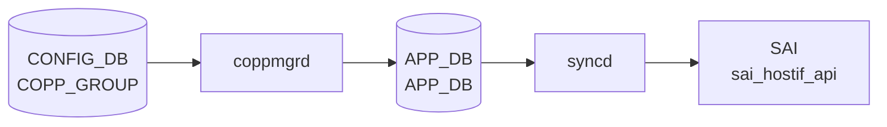

# COPP_GROUP テーブル

## 概要

CPU 宛トラフィックをレート制限する Control Plane [Policing](../../reference/glossary.md#term-policing) ([CoPP](../../reference/glossary.md#term-copp)) のグループ定義。各グループに CPU 受信キューと埋め込み policer (sr_TCM / tr_TCM / storm) を持ち、`COPP_TRAP` の `trap_group` から参照される[^1]。`copp.json` テンプレ → `coppmgr` → [APPL_DB](../../reference/glossary.md#term-appl_db) → `orchagent` (`CoppOrch`) → [SAI](../../reference/glossary.md#term-sai) HOSTIF_TRAP_GROUP / POLICER の流れで反映される。

<!-- cdb-mermaid -->
### データフロー (自動生成)



!!! note "凡例"
    CONFIG_DB から SAI までの典型経路を `docs/reference/config-db-orch-map.md` から機械生成したミニ図。詳細・例外は本ページ本文と対応表を参照。
<!-- /cdb-mermaid -->

## key 構造

```text
COPP_GROUP|<name>
```

## 主要フィールド

| フィールド | 型 | 必須 | 既定 | 説明 |
|-----------|----|------|------|------|
| `queue` | uint32 | no | 0 | CPU 受信キュー番号 (大きいほど高優先) |
| `trap_priority` | uint32 | no | 0 | trap の優先度 |
| `trap_action` | enum `policer_packet_action` | yes | - | trap 対象パケットへの動作 (forward/drop/copy 等) |
| `meter_type` | enum `meter_type` | yes | - | metering 単位 (`packets` / `bytes`) |
| `mode` | enum `sr_tcm`/`tr_tcm`/`storm` | yes | - | policer モード |
| `color` | enum `policer_color_source` | no | - | color awareness mode (aware / blind) |
| `cir` | uint64 | no | 0 | committed information rate |
| `cbs` | uint64 | no | 0 | committed burst size。`cbs >= cir` |
| `pir` | uint64 | tr_tcm 時 | - | peak information rate |
| `pbs` | uint64 | sr_tcm/tr_tcm 時 | - | peak burst size。`pbs >= cbs` |
| `green_action` / `yellow_action` / `red_action` | enum | no | `forward` | カラー別アクション |

## 制約

- `cbs` を設定するには `cir > 0` が必須
- `pir` は `mode = 'tr_tcm'` のときのみ有効 (`when`)
- `pbs` は `mode = 'sr_tcm'` または `'tr_tcm'` のときのみ有効
- `yellow_action` は `sr_tcm`/`tr_tcm` モードのみ

<!-- cdb-exceptions -->
## 例外条件・特殊挙動

- **NULL cfg → デフォルト設定のマージをスキップ**: ユーザー設定エントリのフィールドが `"NULL"` の場合、`coppmgr` の `mergeConfig()` はそのキー全体を init (デフォルト `copp.json`) からも除外する。<!-- evidence: coppmgr.cpp L222-224 mergeConfig -->
- **重複エントリ → APPL_DB 更新スキップ**: `isDupEntry()` で APPL_DB の既存値と全フィールドが一致する場合、`m_appCoppTable.set()` を呼ばない。SAI の不要な呼び出しを回避。<!-- evidence: coppmgr.cpp L263-284 isDupEntry -->
- **policer の meter / mode / color は変更不可**: 既存ポリサーへの `meter_type` / `mode` / `color_source` 変更を試みた場合 `SWSS_LOG_ERROR` を出力し当該属性の変更は**スキップ**される。他の属性の更新は続行。<!-- evidence: copporch.cpp L1331-1347 trapGroupUpdatePolicer -->
- **未知フィールド → task_failed**: `parseTrapGroupAttribute()` で認識できないフィールドが来た場合 `SWSS_LOG_ERROR("Unknown copp field specified:%s")` を出力し処理失敗となる。<!-- evidence: copporch.cpp L1290-1292 -->
- **task_failed → プロセス終了**: `CoppOrch` は `task_failed` が返った場合 syslog にエラーを出力してプロセス (`orchagent`) を終了する。<!-- evidence: copporch.cpp L922 -->

<!-- value-behavior -->
## 値依存挙動マトリクス

| フィールド | 値 | 挙動 |
|-----------|-----|------|
| `mode` | `sr_tcm` | Single Rate TCM。`cir` + `cbs` + `pbs` を使用。`yellow_action` が有効。`pir` は無効（YANG `when`）。SAI `SAI_POLICER_MODE_SR_TCM`。 |
| `mode` | `tr_tcm` | Two Rate TCM。`cir` + `cbs` + `pir` + `pbs` を使用。`pir` が有効（YANG `when`）。SAI `SAI_POLICER_MODE_TR_TCM`。 |
| `mode` | `storm` | Storm Control。`cir` のみ使用。`yellow_action` は無効。SAI `SAI_POLICER_MODE_STORM_CONTROL`。 |
| `meter_type` | `packets` | `cir`/`pir` の単位が pps（パケット/秒）。SAI `SAI_METER_TYPE_PACKETS`。 |
| `meter_type` | `bytes` | `cir`/`pir` の単位が bps（バイト/秒）。SAI `SAI_METER_TYPE_BYTES`。 |
| `color` | `aware` | 入力 DSCP/color を引き継いで多段ポリシングが可能。SAI `SAI_POLICER_COLOR_SOURCE_AWARE`。 |
| `color` | `blind` | すべてのパケットを green として扱う。SAI `SAI_POLICER_COLOR_SOURCE_BLIND`。 |
| `trap_action` / `*_action` | `drop` | CPU に送らずに廃棄。SAI `SAI_PACKET_ACTION_DROP`。 |
| `trap_action` / `*_action` | `forward` | 通常転送。CPU にコピーしない。SAI `SAI_PACKET_ACTION_FORWARD`。 |
| `trap_action` / `*_action` | `copy` | CPU へコピーしつつ転送継続。SAI `SAI_PACKET_ACTION_COPY`。 |
| `trap_action` / `*_action` | `trap` | CPU に送り、ネットワーク転送を中止。SAI `SAI_PACKET_ACTION_TRAP`。 |

**注意**: `mode` / `color` は作成後の変更が不可（`copporch.cpp:1337` でエラーログを出力してスキップ）。変更するにはエントリを削除して再作成が必要。
<!-- /value-behavior -->

## 購読者

- `coppmgr` (`docker-swss` 内): [CONFIG_DB](../../reference/glossary.md#term-config_db) の `COPP_GROUP` / `COPP_TRAP` を結合し [APPL_DB](../../reference/glossary.md#term-appl_db) `COPP_TABLE` に書き込む
- `orchagent` の `CoppOrch`: [SAI](../../reference/glossary.md#term-sai) hostif trap group / policer を生成

## 関連 CONFIG_DB / YANG / CLI

- 関連 [CONFIG_DB](../../reference/glossary.md#term-config_db): `COPP_TRAP`
- 関連 CLI: `config copp`、`show copp`
- 関連 [YANG](../../reference/glossary.md#term-yang): `sonic-copp`

<!-- ref-triangle:start -->

## 関連リファレンス

- [YANG](../../reference/glossary.md#term-yang): [`sonic-copp`](../yang/sonic-copp.md)
- CLI: `config copp`

<!-- ref-triangle:end -->

## 引用元

[^1]: [YANG](../../reference/glossary.md#term-yang) 定義: `sonic-copp.yang`. <https://github.com/sonic-net/sonic-buildimage/blob/9ea932ec2e18f35e58268ec2e4456b1d4afd65cd/src/sonic-yang-models/yang-models/sonic-copp.yang>

<!-- topics-back-ref -->
## 関連 Topics

- [Topics: ACL / CoPP / Mirror / Packet Action](../../topics/07-acl-copp-mirror/index.md)

<!-- /topics-back-ref -->

<!-- ops-hint -->
## 運用ヒント

### 典型値

- key 形式: `COPP_GROUP|<group-name>` (`queue4_group1` 等)。
- `queue`: CPU queue 番号。
- `cir`: 例 `6000` (pps)。
- `trap_action`: `trap` / `forward` / `copy` / `drop`。

### よくある誤設定

- `cir` を過小に設定すると [BGP](../../reference/glossary.md#term-bgp) keepalive がドロップされて peer が落ちる。

### 確認コマンド

```bash
sonic-db-cli CONFIG_DB hgetall 'COPP_GROUP|queue4_group1'
show copp config
```
<!-- /ops-hint -->

<!-- glossary-links-injected: 87fa713c3c5e -->
