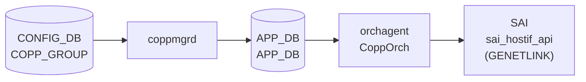

# COPP port-binding (genetlink フィールド)

## 概要

`COPP_GROUP` テーブルの `genetlink_name` / `genetlink_mcgrp_name` フィールドは、[CoPP](../../reference/glossary.md#term-copp) トラップグループをカーネル **genetlink** ホストインタフェース（例: `psample`）に束ねる *port-binding* 機能を提供する[^1]。

これらのフィールドが設定されたグループに属する trap は、`SAI_HOSTIF_TABLE_ENTRY_CHANNEL_TYPE_GENETLINK` 経由でカーネルの genetlink ソケットへ転送される。sflow のパケットサンプリング（`sample_packet` trap）に使用され、`queue2_group1` がその典型例。

[YANG](../../reference/glossary.md#term-yang) モデル (`sonic-copp.yang`) にはこれらフィールドの定義がなく、APPL_DB 経由の拡張フィールドとして実装されている。

<!-- cdb-mermaid -->
### データフロー (自動生成)



!!! note "凡例"
    CONFIG_DB から SAI までの典型経路。`genetlink_name` が存在する場合は `SAI_HOSTIF_TYPE_GENETLINK` 型の HostIf が作成され、trap ごとに HOSTIF_TABLE_ENTRY (CHANNEL_TYPE_GENETLINK) が紐付けられる。

<!-- /cdb-mermaid -->

## key 構造

```text
COPP_GROUP|<name>
```

`genetlink_name` / `genetlink_mcgrp_name` は `COPP_GROUP` テーブルのフィールド。`COPP_PORT` という独立テーブルは存在しない。

## port-binding フィールド

| フィールド | 型 | 必須 | 既定 | 説明 |
|-----------|----|------|------|------|
| `genetlink_name` | string | no | (フィールドなし) | 紐付ける SAI genetlink HostIf 名。例: `psample`。存在しない場合 genetlink HostIf は未作成 |
| `genetlink_mcgrp_name` | string | no | SAI 実装依存 | genetlink multicast group 名。例: `packets`。`genetlink_name` と併用 |

## 動作フロー

1. `coppmgr` が `COPP_GROUP` エントリを [APPL_DB](../../reference/glossary.md#term-appl_db) `APP_COPP_TABLE` に書き込む
2. `CoppOrch::processCoppTrapGroup()` が `getAttribsFromTrapGroup()` で `genetlink_attribs` を収集
3. `genetlink_attribs` が空でない場合、`createGenetlinkHostIf()` で `SAI_HOSTIF_TYPE_GENETLINK` の HostIf を作成
4. `createGenetlinkHostIfTable()` で配下 trap_id ごとに `SAI_HOSTIF_TABLE_ENTRY_CHANNEL_TYPE_GENETLINK` の table entry を作成

## デフォルト設定 (`copp_cfg.j2`)

`queue2_group1` のみが genetlink フィールドを持つ:

```json
"queue2_group1": {
    "cbs": "1000",
    "cir": "1000",
    "genetlink_mcgrp_name": "packets",
    "genetlink_name": "psample",
    "meter_type": "packets",
    "mode": "sr_tcm",
    "queue": "2",
    "red_action": "drop",
    "trap_action": "trap",
    "trap_priority": "1"
}
```

他のグループ (`default`, `queue4_group*`, `queue1_group*`) には `genetlink_name` / `genetlink_mcgrp_name` フィールドが存在しない。

## 制約

- `genetlink_name` のみ設定し `genetlink_mcgrp_name` を省略した場合、SAI HostIf は作成されるが `SAI_HOSTIF_ATTR_GENETLINK_MCGRP_NAME` が未設定となり、SAI 実装依存の挙動となる
- `genetlink_name` なしで `genetlink_mcgrp_name` のみ設定すると `SAI_HOSTIF_ATTR_TYPE` が未設定のまま `create_hostif()` が呼ばれ、SAI 実装によっては失敗する
- `genetlink_name` の値は `sizeof(chardata)-1` バイトに切り詰められる（末尾 NUL 保証）

<!-- cdb-exceptions -->
## 例外条件・特殊挙動

- **genetlink HostIf 作成失敗 → task_failed**: `sai_hostif_api->create_hostif()` が `SAI_STATUS_SUCCESS` 以外を返した場合、`handleSaiCreateStatus()` によりエラー処理され、プロセス終了に至る可能性がある。<!-- evidence: copporch.cpp L667-675 -->
- **genetlink HostIfTable 作成失敗 → task_failed**: `create_hostif_table_entry()` 失敗時も同様のエラーパスを通る。<!-- evidence: copporch.cpp L457-464 -->
- **DEL → 自動復元**: `COPP_GROUP` エントリが削除されても init cfg (`copp_cfg.j2` 由来) に同名エントリが存在する場合、`coppmgrd` が init 値で APPL_DB に再書き込みし、genetlink HostIf が再作成される。<!-- evidence: coppmgr.cpp L898-921 -->
- **YANG 未定義フィールド**: `genetlink_name` / `genetlink_mcgrp_name` は `sonic-copp.yang` に定義がなく、YANG バリデーション対象外。不正な値は SAI レイヤでのみ検出される。

<!-- /cdb-exceptions -->

<!-- value-behavior -->
## 値依存挙動マトリクス

| フィールド | 値 | 挙動 |
|-----------|-----|------|
| `genetlink_name` | なし | genetlink HostIf 未作成。trap はデフォルト NETDEV_PHYSICAL_PORT チャネルで処理 |
| `genetlink_name` | `"psample"` 等 | `SAI_HOSTIF_TYPE_GENETLINK` の HostIf を作成。trap_id ごとに HOSTIF_TABLE_ENTRY (GENETLINK) を作成 |
| `genetlink_mcgrp_name` | なし | SAI HostIf 作成時に mcgrp_name を渡さない。SAI 実装のデフォルト適用 |
| `genetlink_mcgrp_name` | `"packets"` 等 | `SAI_HOSTIF_ATTR_GENETLINK_MCGRP_NAME` を設定してカーネル psample/packets グループに転送 |

<!-- /value-behavior -->

## 購読者

- `coppmgr` (`docker-swss` 内): [CONFIG_DB](../../reference/glossary.md#term-config_db) `COPP_GROUP` を読み [APPL_DB](../../reference/glossary.md#term-appl_db) `APP_COPP_TABLE` へ書き込む
- `orchagent` の `CoppOrch`: APPL_DB を購読し SAI genetlink HostIf を作成

## 関連 CONFIG_DB / YANG / CLI

- 関連 [CONFIG_DB](../../reference/glossary.md#term-config_db): `COPP_GROUP`、`COPP_TRAP`
- 関連 CLI: `config copp`、`show copp`
- 関連 [YANG](../../reference/glossary.md#term-yang): `sonic-copp`（genetlink フィールドは YANG 未定義）

<!-- ref-triangle:start -->

## 関連リファレンス

- [CONFIG_DB: COPP_GROUP](./copp-group.md)
- [CONFIG_DB: COPP_TRAP](./copp-trap.md)
- [YANG](../../reference/glossary.md#term-yang): [`sonic-copp`](../yang/sonic-copp.md)

<!-- ref-triangle:end -->

## 引用元

[^1]: `CoppOrch` 実装: `sonic-swss/orchagent/copporch.cpp`. <https://github.com/sonic-net/sonic-swss/blob/master/orchagent/copporch.cpp>

<!-- topics-back-ref -->
## 関連 Topics

- [Topics: ACL / CoPP / Mirror / Packet Action](../../topics/07-acl-copp-mirror/index.md)

<!-- /topics-back-ref -->

<!-- ops-hint -->
## 運用ヒント

### 典型値

- `genetlink_name`: `"psample"` — sflow パケットサンプリング用カーネルモジュール名
- `genetlink_mcgrp_name`: `"packets"` — psample の multicast group 名

### 確認コマンド

```bash
sonic-db-cli CONFIG_DB hgetall 'COPP_GROUP|queue2_group1'
show copp config
```

### よくある誤設定

- `genetlink_name` のみ設定し `genetlink_mcgrp_name` を省略すると、SAI HostIf は作成されるが sflow サンプリングが機能しない場合がある（SAI 実装依存）
- sflow 機能が無効の場合、`sample_packet` trap は `coppmgr` によって APPL_DB から除外されるため、genetlink HostIf が作成されても trap は来ない

<!-- /ops-hint -->

<!-- runtime-trace -->
## 実コンテナ動作トレース

### 段階 1 — Consumer 登録

`coppmgrd` が [CONFIG_DB](../../reference/glossary.md#term-config_db) の `COPP_GROUP` テーブルを購読する。`genetlink_name` フィールドが含まれるエントリを検知すると APPL_DB `APP_COPP_TABLE` に全フィールドを書き込む。

### 段階 2 — CFG→APPL 翻訳

`APP_COPP_TABLE` に書き込み。`genetlink_name` / `genetlink_mcgrp_name` はそのまま APPL_DB に転記される（coppmgr は genetlink フィールドを特別扱いしない）。

### 段階 3 — APPL→SAI

`CoppOrch::getAttribsFromTrapGroup()` で `genetlink_name` / `genetlink_mcgrp_name` を `genetlink_attribs` に収集。`processCoppTrapGroup()` の `op == SET_COMMAND` パスで:

1. `createGenetlinkHostIf()` → `sai_hostif_api->create_hostif()` (SAI_HOSTIF_TYPE_GENETLINK)
2. `createGenetlinkHostIfTable()` → 各 trap_id に `sai_hostif_api->create_hostif_table_entry()` (CHANNEL_TYPE_GENETLINK)

### 段階 4 — タイミングと副作用

**適用タイミング**: CONFIG_DB 変化を `coppmgrd` が検知後 APPL_DB に書き込み → `CoppOrch` が SAI HostIf を更新。

**副作用**: genetlink HostIf の削除・再作成中は sflow サンプリングが一時停止する。

<!-- /runtime-trace -->

<!-- entry-points -->
## 書き込み入り口 (Direction A)

対象テーブル: `COPP_GROUP` (genetlink フィールド)

### CLI
- `config copp` — COPP_GROUP の更新（genetlink フィールドの直接 CLI サポートは限定的）

### ビルド時デフォルト (init_cfg / j2 テンプレート)
- `files/image_config/copp/copp_cfg.j2` が `queue2_group1` に `genetlink_name: psample` / `genetlink_mcgrp_name: packets` を設定

### ハードコードデフォルト
- なし（YANG 未定義フィールドのため）

### ランタイム注入 (デーモン自動書き込み)
- なし

<!-- /entry-points -->

<!-- derivation -->
## 派生・条件付き登録 (Phase 6/7)

### Phase 6: 値による他フィールド自動派生

| 条件 | 派生先 | evidence |
|---|---|---|
| `genetlink_name` フィールドあり | `SAI_HOSTIF_ATTR_TYPE = GENETLINK` が genetlink_attribs に追加される | copporch.cpp L1267-1268 |
| `genetlink_name` フィールドあり | `SAI_HOSTIF_ATTR_NAME = <値>` が genetlink_attribs に追加される | copporch.cpp L1271-1275 |
| `genetlink_mcgrp_name` フィールドあり | `SAI_HOSTIF_ATTR_GENETLINK_MCGRP_NAME = <値>` が genetlink_attribs に追加される | copporch.cpp L1281-1285 |

### Phase 7: 条件付き module/manager 登録

| 条件 | 登録 module | evidence |
|---|---|---|
| `genetlink_attribs` が空でない | `createGenetlinkHostIf()` が呼ばれ SAI GENETLINK HostIf を作成 | copporch.cpp L833-844 |
| COPP_GROUP DEL かつ `m_trap_group_hostif_map` に存在 | `removeGenetlinkHostIf()` が呼ばれ SAI HostIf を削除 | copporch.cpp L1099-1119 |

<!-- /derivation -->

<!-- handler-branching -->
### Phase 8: Handler メソッド内分岐

| Manager / Handler | メソッド | 分岐条件 | 効果 | evidence |
|---|---|---|---|---|
| `CoppOrch` | `getAttribsFromTrapGroup()` | `fvField == "genetlink_name"` | `SAI_HOSTIF_ATTR_TYPE=GENETLINK` + `SAI_HOSTIF_ATTR_NAME` を genetlink_attribs に追加 | copporch.cpp L1265-1276 |
| `CoppOrch` | `getAttribsFromTrapGroup()` | `fvField == "genetlink_mcgrp_name"` | `SAI_HOSTIF_ATTR_GENETLINK_MCGRP_NAME` を genetlink_attribs に追加 | copporch.cpp L1279-1286 |
| `CoppOrch` | `processCoppTrapGroup()` | `!genetlink_attribs.empty()` | `createGenetlinkHostIf()` + `createGenetlinkHostIfTable()` を呼び出し | copporch.cpp L833-848 |
| `CoppOrch` | `processCoppTrapGroup()` | `op == DEL_COMMAND` かつ `m_trap_group_hostif_map` に存在 | `removeGenetlinkHostIf()` で HostIf + table entry を削除 | copporch.cpp L1099-1119 |

> **スキャン証跡**: `getAttribsFromTrapGroup` L1154-1294 全行読了、`processCoppTrapGroup` L730-872 + L1099-1151 読了。4 件分岐抽出。

<!-- /handler-branching -->

<!-- defaults -->
## コード由来の暗黙デフォルト (Phase A)

### `genetlink_name` — フィールド不在 = genetlink HostIf 未作成

`COPP_GROUP` エントリに `genetlink_name` フィールドが存在しない場合、`getAttribsFromTrapGroup()` は `genetlink_attribs` リストに何も追加しない。`processCoppTrapGroup()` は `genetlink_attribs.empty()` を確認し、空の場合は `createGenetlinkHostIf()` / `createGenetlinkHostIfTable()` を呼ばない。結果として当該グループの trap は `initDefaultHostIntfTable()` で作成された `SAI_HOSTIF_TABLE_ENTRY_CHANNEL_TYPE_NETDEV_PHYSICAL_PORT` チャネル（wildcard エントリ）経由で処理される。<!-- evidence: copporch.cpp L833-844, L302-330 -->

### `genetlink_mcgrp_name` — フィールド不在 = SAI 実装デフォルト適用

`genetlink_name` が存在するが `genetlink_mcgrp_name` が存在しない場合、`SAI_HOSTIF_ATTR_GENETLINK_MCGRP_NAME` は設定されずに `create_hostif()` が呼ばれる。SAI 実装（ベンダー依存）のデフォルト multicast group 名が適用される。psample の場合は通常 `"packets"` がデフォルトだが、SAI 仕様上は保証されない。<!-- evidence: copporch.cpp L1279-1286 -->

### `genetlink_name` の文字列長上限 — `sizeof(chardata)-1` バイト切り詰め

`genetlink_name` の値は `sai_attribute_t::value.chardata` に格納される。`strncpy(attr.value.chardata, fvValue(*i).c_str(), size - 1)` により最大 `sizeof(chardata)-1` バイトに切り詰められ、末尾 NUL が保証される。`sizeof(chardata)` は SAI ヘッダ定義次第だが通常 32 バイト。31 文字超の名前は切り詰められ、SAI HostIf 作成失敗の原因となる。同様に `genetlink_mcgrp_name` も同じ処理が適用される。<!-- evidence: copporch.cpp L1272-1275, L1282-1285 -->

### init cfg のデフォルト (`queue2_group1`)

`copp_cfg.j2` において `genetlink_name` / `genetlink_mcgrp_name` を持つグループは `queue2_group1` のみ。値は `genetlink_name="psample"` / `genetlink_mcgrp_name="packets"`。これらは sflow (`sample_packet` trap) 専用。他の全グループにはこれらフィールドが存在せず、genetlink port-binding は適用されない。<!-- evidence: copp_cfg.j2 L76-88 -->

### DEL 後の genetlink HostIf 自動復元

`COPP_GROUP|queue2_group1` が CONFIG_DB から削除されても、`coppmgrd` が init cfg 値で APPL_DB に再書き込みし、`CoppOrch` が genetlink HostIf を再作成する。sflow が有効な場合、一時的な停止後に自動復旧する。<!-- evidence: coppmgr.cpp L898-921, copporch.cpp L657-679 -->

> **スキャン証跡**: copporch.cpp L1154-1295 (getAttribsFromTrapGroup 全行)、copporch.cpp L302-330 (initDefaultHostIntfTable)、copporch.cpp L419-493 (createGenetlinkHostIfTable/removeGenetlinkHostIfTable)、copporch.cpp L657-714 (createGenetlinkHostIf/removeGenetlinkHostIf)、copporch.cpp L730-872 (processCoppTrapGroup)、copp_cfg.j2 全行、coppmgr.cpp L898-921。発見 5 件。

<!-- /defaults -->

<!-- ordering -->
## 書込み順依存 (Phase B)

### `allPortsReady()` ゲート

`CoppOrch::doTask()` の先頭で `gPortsOrch->allPortsReady()` を確認する（`copporch.cpp:885-888`）。全ポートの SAI 初期化が完了するまで `COPP_GROUP`（genetlink フィールド含む）の処理はスキップされ、`m_toSync` キューに蓄積される。`allPortsReady()` が true になった後に順次処理される。

### orchdaemon.cpp における初期化順序

```
L232: gPortsOrch = new PortsOrch(...)   # PortsOrch を最初に生成
...
L341: gCoppOrch = new CoppOrch(...)     # PortsOrch 生成後に CoppOrch を生成
```

`CoppOrch` コンストラクタ内の `initDefaultHostIntfTable()` / `initDefaultTrapGroup()` / `initDefaultTrapIds()` は `allPortsReady()` に依存せず即時実行される。`m_orchList` では `gCoppOrch` は `gPortsOrch`・`gBufferOrch` の後に位置し、ポート・バッファ初期化後に COPP 処理が行われる。<!-- evidence: orchdaemon.cpp L232,341,500 -->

### CONFIG_DB 書込み順序（運用）

| 操作 | 制約 | 違反時の結果 |
|------|------|------------|
| 起動時 genetlink HostIf 作成 | `allPortsReady()` が true になるまで自動遅延 | `m_toSync` に蓄積 → PortsOrch 初期化後に自動処理 |
| 新規 COPP_GROUP (genetlink フィールド付き) 書込み | PortsOrch 初期化後が理想。事前書込みは自動遅延 | `allPortsReady()` 前はスキップ、次回 `doTask` 呼出しで再処理 |
| COPP_GROUP DEL (genetlink フィールドあり) | 順序制約なし（`allPortsReady()` ゲートは存在） | `allPortsReady()` 前は DEL も遅延 |

<!-- /ordering -->

