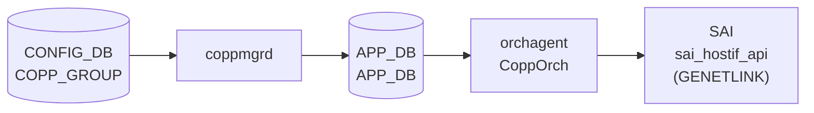

# COPP port-binding (genetlink フィールド)

## 概要

`COPP_GROUP` テーブルの `genetlink_name` / `genetlink_mcgrp_name` フィールドは、[CoPP](../../reference/glossary.md#term-copp) トラップグループをカーネル **genetlink** ホストインタフェース（例: `psample`）に束ねる *port-binding* 機能を提供する[^1]。

これらのフィールドが設定されたグループに属する trap は、`SAI_HOSTIF_TABLE_ENTRY_CHANNEL_TYPE_GENETLINK` 経由でカーネルの genetlink ソケットへ転送される。sflow のパケットサンプリング（`sample_packet` trap）に使用され、`queue2_group1` がその典型例。

[YANG](../../reference/glossary.md#term-yang) モデル (`sonic-copp.yang`) にはこれらフィールドの定義がなく、APPL_DB 経由の拡張フィールドとして実装されている。

<!-- cdb-mermaid -->
### データフロー (自動生成)



!!! note "凡例"
    CONFIG_DB から SAI までの典型経路。`genetlink_name` が存在する場合は `SAI_HOSTIF_TYPE_GENETLINK` 型の HostIf が作成され、trap ごとに HOSTIF_TABLE_ENTRY (CHANNEL_TYPE_GENETLINK) が紐付けられる。

<!-- /cdb-mermaid -->

## key 構造

```text
COPP_GROUP|<name>
```

`genetlink_name` / `genetlink_mcgrp_name` は `COPP_GROUP` テーブルのフィールド。`COPP_PORT` という独立テーブルは存在しない。

## port-binding フィールド

| フィールド | 型 | 必須 | 既定 | 説明 |
|-----------|----|------|------|------|
| `genetlink_name` | string | no | (フィールドなし) | 紐付ける SAI genetlink HostIf 名。例: `psample`。存在しない場合 genetlink HostIf は未作成 |
| `genetlink_mcgrp_name` | string | no | SAI 実装依存 | genetlink multicast group 名。例: `packets`。`genetlink_name` と併用 |

## 動作フロー

1. `coppmgr` が `COPP_GROUP` エントリを [APPL_DB](../../reference/glossary.md#term-appl_db) `APP_COPP_TABLE` に書き込む
2. `CoppOrch::processCoppTrapGroup()` が `getAttribsFromTrapGroup()` で `genetlink_attribs` を収集
3. `genetlink_attribs` が空でない場合、`createGenetlinkHostIf()` で `SAI_HOSTIF_TYPE_GENETLINK` の HostIf を作成
4. `createGenetlinkHostIfTable()` で配下 trap_id ごとに `SAI_HOSTIF_TABLE_ENTRY_CHANNEL_TYPE_GENETLINK` の table entry を作成

## デフォルト設定 (`copp_cfg.j2`)

`queue2_group1` のみが genetlink フィールドを持つ:

```json
"queue2_group1": {
    "cbs": "1000",
    "cir": "1000",
    "genetlink_mcgrp_name": "packets",
    "genetlink_name": "psample",
    "meter_type": "packets",
    "mode": "sr_tcm",
    "queue": "2",
    "red_action": "drop",
    "trap_action": "trap",
    "trap_priority": "1"
}
```

他のグループ (`default`, `queue4_group*`, `queue1_group*`) には `genetlink_name` / `genetlink_mcgrp_name` フィールドが存在しない。

## 制約

- `genetlink_name` のみ設定し `genetlink_mcgrp_name` を省略した場合、SAI HostIf は作成されるが `SAI_HOSTIF_ATTR_GENETLINK_MCGRP_NAME` が未設定となり、SAI 実装依存の挙動となる
- `genetlink_name` なしで `genetlink_mcgrp_name` のみ設定すると `SAI_HOSTIF_ATTR_TYPE` が未設定のまま `create_hostif()` が呼ばれ、SAI 実装によっては失敗する
- `genetlink_name` の値は `sizeof(chardata)-1` バイトに切り詰められる（末尾 NUL 保証）

<!-- cdb-exceptions -->
## 例外条件・特殊挙動

- **genetlink HostIf 作成失敗 → task_failed**: `sai_hostif_api->create_hostif()` が `SAI_STATUS_SUCCESS` 以外を返した場合、`handleSaiCreateStatus()` によりエラー処理され、プロセス終了に至る可能性がある。<!-- evidence: copporch.cpp L667-675 -->
- **genetlink HostIfTable 作成失敗 → task_failed**: `create_hostif_table_entry()` 失敗時も同様のエラーパスを通る。<!-- evidence: copporch.cpp L457-464 -->
- **DEL → 自動復元**: `COPP_GROUP` エントリが削除されても init cfg (`copp_cfg.j2` 由来) に同名エントリが存在する場合、`coppmgrd` が init 値で APPL_DB に再書き込みし、genetlink HostIf が再作成される。<!-- evidence: coppmgr.cpp L898-921 -->
- **YANG 未定義フィールド**: `genetlink_name` / `genetlink_mcgrp_name` は `sonic-copp.yang` に定義がなく、YANG バリデーション対象外。不正な値は SAI レイヤでのみ検出される。

<!-- /cdb-exceptions -->

<!-- value-behavior -->
## 値依存挙動マトリクス

| フィールド | 値 | 挙動 |
|-----------|-----|------|
| `genetlink_name` | なし | genetlink HostIf 未作成。trap はデフォルト NETDEV_PHYSICAL_PORT チャネルで処理 |
| `genetlink_name` | `"psample"` 等 | `SAI_HOSTIF_TYPE_GENETLINK` の HostIf を作成。trap_id ごとに HOSTIF_TABLE_ENTRY (GENETLINK) を作成 |
| `genetlink_mcgrp_name` | なし | SAI HostIf 作成時に mcgrp_name を渡さない。SAI 実装のデフォルト適用 |
| `genetlink_mcgrp_name` | `"packets"` 等 | `SAI_HOSTIF_ATTR_GENETLINK_MCGRP_NAME` を設定してカーネル psample/packets グループに転送 |

<!-- /value-behavior -->

## 購読者

- `coppmgr` (`docker-swss` 内): [CONFIG_DB](../../reference/glossary.md#term-config_db) `COPP_GROUP` を読み [APPL_DB](../../reference/glossary.md#term-appl_db) `APP_COPP_TABLE` へ書き込む
- `orchagent` の `CoppOrch`: APPL_DB を購読し SAI genetlink HostIf を作成

## 関連 CONFIG_DB / YANG / CLI

- 関連 [CONFIG_DB](../../reference/glossary.md#term-config_db): `COPP_GROUP`、`COPP_TRAP`
- 関連 CLI: `config copp`、`show copp`
- 関連 [YANG](../../reference/glossary.md#term-yang): `sonic-copp`（genetlink フィールドは YANG 未定義）

<!-- ref-triangle:start -->

## 関連リファレンス

- [CONFIG_DB: COPP_GROUP](./copp-group.md)
- [CONFIG_DB: COPP_TRAP](./copp-trap.md)
- [YANG](../../reference/glossary.md#term-yang): [`sonic-copp`](../yang/sonic-copp.md)

<!-- ref-triangle:end -->

## 引用元

[^1]: `CoppOrch` 実装: `sonic-swss/orchagent/copporch.cpp`. <https://github.com/sonic-net/sonic-swss/blob/master/orchagent/copporch.cpp>

<!-- topics-back-ref -->
## 関連 Topics

- [Topics: ACL / CoPP / Mirror / Packet Action](../../topics/07-acl-copp-mirror/index.md)

<!-- /topics-back-ref -->

<!-- ops-hint -->
## 運用ヒント

### 典型値

- `genetlink_name`: `"psample"` — sflow パケットサンプリング用カーネルモジュール名
- `genetlink_mcgrp_name`: `"packets"` — psample の multicast group 名

### 確認コマンド

```bash
sonic-db-cli CONFIG_DB hgetall 'COPP_GROUP|queue2_group1'
show copp config
```

### よくある誤設定

- `genetlink_name` のみ設定し `genetlink_mcgrp_name` を省略すると、SAI HostIf は作成されるが sflow サンプリングが機能しない場合がある（SAI 実装依存）
- sflow 機能が無効の場合、`sample_packet` trap は `coppmgr` によって APPL_DB から除外されるため、genetlink HostIf が作成されても trap は来ない

<!-- /ops-hint -->

<!-- runtime-trace -->
## 実コンテナ動作トレース

### 段階 1 — Consumer 登録

`coppmgrd` が [CONFIG_DB](../../reference/glossary.md#term-config_db) の `COPP_GROUP` テーブルを購読する。`genetlink_name` フィールドが含まれるエントリを検知すると APPL_DB `APP_COPP_TABLE` に全フィールドを書き込む。

### 段階 2 — CFG→APPL 翻訳

`APP_COPP_TABLE` に書き込み。`genetlink_name` / `genetlink_mcgrp_name` はそのまま APPL_DB に転記される（coppmgr は genetlink フィールドを特別扱いしない）。

### 段階 3 — APPL→SAI

`CoppOrch::getAttribsFromTrapGroup()` で `genetlink_name` / `genetlink_mcgrp_name` を `genetlink_attribs` に収集。`processCoppTrapGroup()` の `op == SET_COMMAND` パスで:

1. `createGenetlinkHostIf()` → `sai_hostif_api->create_hostif()` (SAI_HOSTIF_TYPE_GENETLINK)
2. `createGenetlinkHostIfTable()` → 各 trap_id に `sai_hostif_api->create_hostif_table_entry()` (CHANNEL_TYPE_GENETLINK)

### 段階 4 — タイミングと副作用

**適用タイミング**: CONFIG_DB 変化を `coppmgrd` が検知後 APPL_DB に書き込み → `CoppOrch` が SAI HostIf を更新。

**副作用**: genetlink HostIf の削除・再作成中は sflow サンプリングが一時停止する。

<!-- /runtime-trace -->

<!-- entry-points -->
## 書き込み入り口 (Direction A)

対象テーブル: `COPP_GROUP` (genetlink フィールド)

### CLI
- `config copp` — COPP_GROUP の更新（genetlink フィールドの直接 CLI サポートは限定的）

### ビルド時デフォルト (init_cfg / j2 テンプレート)
- `files/image_config/copp/copp_cfg.j2` が `queue2_group1` に `genetlink_name: psample` / `genetlink_mcgrp_name: packets` を設定

### ハードコードデフォルト
- なし（YANG 未定義フィールドのため）

### ランタイム注入 (デーモン自動書き込み)
- なし

<!-- /entry-points -->

<!-- derivation -->
## 派生・条件付き登録 (Phase 6/7)

### Phase 6: 値による他フィールド自動派生

| 条件 | 派生先 | evidence |
|---|---|---|
| `genetlink_name` フィールドあり | `SAI_HOSTIF_ATTR_TYPE = GENETLINK` が genetlink_attribs に追加される | copporch.cpp L1267-1268 |
| `genetlink_name` フィールドあり | `SAI_HOSTIF_ATTR_NAME = <値>` が genetlink_attribs に追加される | copporch.cpp L1271-1275 |
| `genetlink_mcgrp_name` フィールドあり | `SAI_HOSTIF_ATTR_GENETLINK_MCGRP_NAME = <値>` が genetlink_attribs に追加される | copporch.cpp L1281-1285 |

### Phase 7: 条件付き module/manager 登録

| 条件 | 登録 module | evidence |
|---|---|---|
| `genetlink_attribs` が空でない | `createGenetlinkHostIf()` が呼ばれ SAI GENETLINK HostIf を作成 | copporch.cpp L833-844 |
| COPP_GROUP DEL かつ `m_trap_group_hostif_map` に存在 | `removeGenetlinkHostIf()` が呼ばれ SAI HostIf を削除 | copporch.cpp L1099-1119 |

<!-- /derivation -->

<!-- handler-branching -->
### Phase 8: Handler メソッド内分岐

| Manager / Handler | メソッド | 分岐条件 | 効果 | evidence |
|---|---|---|---|---|
| `CoppOrch` | `getAttribsFromTrapGroup()` | `fvField == "genetlink_name"` | `SAI_HOSTIF_ATTR_TYPE=GENETLINK` + `SAI_HOSTIF_ATTR_NAME` を genetlink_attribs に追加 | copporch.cpp L1265-1276 |
| `CoppOrch` | `getAttribsFromTrapGroup()` | `fvField == "genetlink_mcgrp_name"` | `SAI_HOSTIF_ATTR_GENETLINK_MCGRP_NAME` を genetlink_attribs に追加 | copporch.cpp L1279-1286 |
| `CoppOrch` | `processCoppTrapGroup()` | `!genetlink_attribs.empty()` | `createGenetlinkHostIf()` + `createGenetlinkHostIfTable()` を呼び出し | copporch.cpp L833-848 |
| `CoppOrch` | `processCoppTrapGroup()` | `op == DEL_COMMAND` かつ `m_trap_group_hostif_map` に存在 | `removeGenetlinkHostIf()` で HostIf + table entry を削除 | copporch.cpp L1099-1119 |

> **スキャン証跡**: `getAttribsFromTrapGroup` L1154-1294 全行読了、`processCoppTrapGroup` L730-872 + L1099-1151 読了。4 件分岐抽出。

<!-- /handler-branching -->

<!-- defaults -->
## コード由来の暗黙デフォルト (Phase A)

### `genetlink_name` — フィールド不在 = genetlink HostIf 未作成

`COPP_GROUP` エントリに `genetlink_name` フィールドが存在しない場合、`getAttribsFromTrapGroup()` は `genetlink_attribs` リストに何も追加しない。`processCoppTrapGroup()` は `genetlink_attribs.empty()` を確認し、空の場合は `createGenetlinkHostIf()` / `createGenetlinkHostIfTable()` を呼ばない。結果として当該グループの trap は `initDefaultHostIntfTable()` で作成された `SAI_HOSTIF_TABLE_ENTRY_CHANNEL_TYPE_NETDEV_PHYSICAL_PORT` チャネル（wildcard エントリ）経由で処理される。<!-- evidence: copporch.cpp L833-844, L302-330 -->

### `genetlink_mcgrp_name` — フィールド不在 = SAI 実装デフォルト適用

`genetlink_name` が存在するが `genetlink_mcgrp_name` が存在しない場合、`SAI_HOSTIF_ATTR_GENETLINK_MCGRP_NAME` は設定されずに `create_hostif()` が呼ばれる。SAI 実装（ベンダー依存）のデフォルト multicast group 名が適用される。psample の場合は通常 `"packets"` がデフォルトだが、SAI 仕様上は保証されない。<!-- evidence: copporch.cpp L1279-1286 -->

### `genetlink_name` の文字列長上限 — `sizeof(chardata)-1` バイト切り詰め

`genetlink_name` の値は `sai_attribute_t::value.chardata` に格納される。`strncpy(attr.value.chardata, fvValue(*i).c_str(), size - 1)` により最大 `sizeof(chardata)-1` バイトに切り詰められ、末尾 NUL が保証される。`sizeof(chardata)` は SAI ヘッダ定義次第だが通常 32 バイト。31 文字超の名前は切り詰められ、SAI HostIf 作成失敗の原因となる。同様に `genetlink_mcgrp_name` も同じ処理が適用される。<!-- evidence: copporch.cpp L1272-1275, L1282-1285 -->

### init cfg のデフォルト (`queue2_group1`)

`copp_cfg.j2` において `genetlink_name` / `genetlink_mcgrp_name` を持つグループは `queue2_group1` のみ。値は `genetlink_name="psample"` / `genetlink_mcgrp_name="packets"`。これらは sflow (`sample_packet` trap) 専用。他の全グループにはこれらフィールドが存在せず、genetlink port-binding は適用されない。<!-- evidence: copp_cfg.j2 L76-88 -->

### DEL 後の genetlink HostIf 自動復元

`COPP_GROUP|queue2_group1` が CONFIG_DB から削除されても、`coppmgrd` が init cfg 値で APPL_DB に再書き込みし、`CoppOrch` が genetlink HostIf を再作成する。sflow が有効な場合、一時的な停止後に自動復旧する。<!-- evidence: coppmgr.cpp L898-921, copporch.cpp L657-679 -->

> **スキャン証跡**: copporch.cpp L1154-1295 (getAttribsFromTrapGroup 全行)、copporch.cpp L302-330 (initDefaultHostIntfTable)、copporch.cpp L419-493 (createGenetlinkHostIfTable/removeGenetlinkHostIfTable)、copporch.cpp L657-714 (createGenetlinkHostIf/removeGenetlinkHostIf)、copporch.cpp L730-872 (processCoppTrapGroup)、copp_cfg.j2 全行、coppmgr.cpp L898-921。発見 5 件。

<!-- /defaults -->

<!-- ordering -->
## 書込み順依存 (Phase B)

### allPortsReady() ゲート

`CoppOrch::doTask()` の先頭 (`copporch.cpp:885-888`) に次のガードが存在する:

```cpp
if (!gPortsOrch->allPortsReady())
{
    return;
}
```

**全物理ポートが ready になるまで、genetlink フィールドを含む `COPP_GROUP` の全処理がブロックされる。**
起動時に CONFIG_DB へ `COPP_GROUP|queue2_group1` を書き込んでも、`PortsOrch` の初期化完了前は `m_toSync` キューに蓄積されるのみで SAI HostIf 作成は実行されない。`allPortsReady()` が true になった後に順次処理される。<!-- evidence: copporch.cpp L885-888 -->

### orchdaemon.cpp における初期化順序

`OrchDaemon::init()` での生成順序:

```
L232: gPortsOrch = new PortsOrch(...)   # 最初に生成 (gPortsOrch が確定)
...
L341: gCoppOrch = new CoppOrch(...)     # PortsOrch 生成後に生成
```

`CoppOrch` コンストラクタ内で `initDefaultHostIntfTable()` / `initDefaultTrapGroup()` / `initDefaultTrapIds()` が実行されるが、これらは `allPortsReady()` ガードに依存しない（SAI 初期状態で直接実行）。genetlink HostIf の作成は `doTask()` 経由のため、ポート初期化完了後となる。<!-- evidence: orchdaemon.cpp L232, L341; copporch.cpp L191-213 -->

### CONFIG_DB 書込み順序（運用）

| 操作 | 推奨順序 | 違反時の結果 |
|------|---------|------------|
| 起動時 genetlink HostIf 作成 | `allPortsReady()` が true になるまで自動遅延 | `m_toSync` に蓄積。PortsOrch 初期化完了後に自動処理（問題なし） |
| 新規 `COPP_GROUP` (genetlink フィールド付き) 書込み | PortsOrch 初期化後が理想だが事前書込みも可 | `allPortsReady()` 前は処理スキップ、次回 `doTask()` で再試行 |
| `COPP_GROUP` DEL (genetlink フィールドあり) | 順序制約なし | `allPortsReady()` 前は DEL も遅延（自動再試行） |

### coppmgr 側の TRAP → GROUP 順序

`coppmgr` コンストラクタ (`coppmgr.cpp:334, L372`) は `COPP_TRAP` を先にマージしてから `COPP_GROUP` をマージする。genetlink フィールドを持つ `queue2_group1` を APPL_DB に書き込む際、`sample_packet` を担当する COPP_TRAP エントリが先に処理されていれば `trap_ids` が正しく付与される。直接 APPL_DB を操作する場合は `COPP_TRAP` エントリを先に書き込むこと。<!-- evidence: coppmgr.cpp L334, L372 -->

<!-- /ordering -->

<!-- ordering -->
## 書込み順依存 (Phase B)

### `allPortsReady()` ゲート

`CoppOrch::doTask()` の先頭で `gPortsOrch->allPortsReady()` を確認する（`copporch.cpp:885-888`）。全ポートの SAI 初期化が完了するまで `COPP_GROUP`（genetlink フィールド含む）の処理はスキップされ、`m_toSync` キューに蓄積される。`allPortsReady()` が true になった後に順次処理される。

### orchdaemon.cpp における初期化順序

```
L232: gPortsOrch = new PortsOrch(...)   # PortsOrch を最初に生成
...
L341: gCoppOrch = new CoppOrch(...)     # PortsOrch 生成後に CoppOrch を生成
```

`CoppOrch` コンストラクタ内の `initDefaultHostIntfTable()` / `initDefaultTrapGroup()` / `initDefaultTrapIds()` は `allPortsReady()` に依存せず即時実行される。`m_orchList` では `gCoppOrch` は `gPortsOrch`・`gBufferOrch` の後に位置し、ポート・バッファ初期化後に COPP 処理が行われる。<!-- evidence: orchdaemon.cpp L232,341,500 -->

### CONFIG_DB 書込み順序（運用）

| 操作 | 制約 | 違反時の結果 |
|------|------|------------|
| 起動時 genetlink HostIf 作成 | `allPortsReady()` が true になるまで自動遅延 | `m_toSync` に蓄積 → PortsOrch 初期化後に自動処理 |
| 新規 COPP_GROUP (genetlink フィールド付き) 書込み | PortsOrch 初期化後が理想。事前書込みは自動遅延 | `allPortsReady()` 前はスキップ、次回 `doTask` 呼出しで再処理 |
| COPP_GROUP DEL (genetlink フィールドあり) | 順序制約なし（`allPortsReady()` ゲートは存在） | `allPortsReady()` 前は DEL も遅延 |

<!-- /ordering -->

<!-- cross-refs -->
## 暗黙参照テーブル (Phase C)

`COPP_GROUP` の genetlink フィールド (`genetlink_name` / `genetlink_mcgrp_name`) が処理される際に
`coppmgr` / `CoppOrch` が暗黙的に参照する他テーブル・内部マップの依存関係を示す。

| 依存方向 | 参照元 | 参照先テーブル / マップ | 参照先キー形式 | 依存内容 | 証跡 |
|---------|-------|----------------------|--------------|---------|------|
| 間接依存（sflow feature 経由） | `queue2_group1` の genetlink HostIf 有効性 | `FEATURE` | `FEATURE\|sflow` | sflow feature `state=disabled` の場合、`sample_packet` trap が APPL_DB から除外される。genetlink HostIf / HostIfTable は SAI に作成されるが、trap が届かないため実質無効。feature enabled 時に `doCoppTrapTask()` が trap_ids を再評価して APPL_DB を更新 | `coppmgr.cpp:173-191`, `coppmgr.cpp:928-965` |
| 内部マップ依存（HostIfTable 作成時） | `createGenetlinkHostIfTable()` | `m_syncdTrapIds` (内部マップ) | trap_type → {trap_group_obj, trap_obj} | genetlink HostIfTable の `SAI_HOSTIF_TABLE_ENTRY_ATTR_TRAP_ID` は `m_syncdTrapIds[trap_id].trap_obj` から取得する。`trap_id_list` 内の trap が `m_syncdTrapIds` に未登録の場合、`SAI_HOSTIF_TABLE_ENTRY_ATTR_TRAP_ID` に無効 OID が渡り、SAI 操作が失敗する可能性がある | `copporch.cpp:429,442` |
| 内部マップ依存（HostIf OID 参照） | `createGenetlinkHostIfTable()` | `m_trap_group_hostif_map` (内部マップ) | trap_group_id → hostif_oid | `SAI_HOSTIF_TABLE_ENTRY_ATTR_HOST_IF` を設定するために `m_trap_group_hostif_map` から genetlink HostIf の OID を取得する。`createGenetlinkHostIf()` が先に完了していない場合、`hostif_map == end()` となり HostIfTable エントリが未作成のままスキップされる | `copporch.cpp:430-431,466` |
| ビルド時依存 | `queue2_group1` の `genetlink_name` / `genetlink_mcgrp_name` 初期値 | `/etc/sonic/copp_cfg.json` (= `copp_cfg.j2` 展開物) | — | `genetlink_name="psample"` / `genetlink_mcgrp_name="packets"` は `copp_cfg.j2` でハードコードされ、起動時に `coppmgrd` が初期値として読み込む。ユーザーが DEL しても init cfg に同名キーがあれば自動復元される | `copp_cfg.j2:76-88`, `coppmgr.cpp:898-921` |
| 初期化順序依存 | genetlink HostIfTable (`CHANNEL_TYPE_GENETLINK`) | `initDefaultHostIntfTable()` が作成する wildcard エントリ | — | `initDefaultHostIntfTable()` は起動時に `SAI_HOSTIF_TABLE_ENTRY_TYPE_WILDCARD` / `CHANNEL_TYPE_NETDEV_PHYSICAL_PORT` のデフォルトエントリを作成する。genetlink trap_id の `HOSTIF_TABLE_ENTRY` はこのデフォルトエントリより優先されるが、先にデフォルトエントリが存在することで「genetlink HostIfTable 未登録の trap は NETDEV_PHYSICAL_PORT チャネルで処理」という fallback が保証される | `copporch.cpp:209,211,302-330,419-468` |

### 解決タイミング

- **FEATURE → sflow 有効性**: `doFeatureTask()` が `FEATURE` テーブルの変化を購読し、state 変更時に `setFeatureTrapIdsStatus()` 経由で `sample_packet` trap の APPL_DB 登録状態を再評価する。genetlink HostIf / HostIfTable 自体は feature state に関わらず SAI に残留する。
- **m_syncdTrapIds 依存**: `trapGroupProcessTrapIdChange()` が `processCoppRule()` 内で呼ばれ、trap_ids を `m_syncdTrapIds` に同期した後に `createGenetlinkHostIfTable()` が呼ばれる。同一 `processCoppRule()` 呼び出し内で順序が保証される（`copporch.cpp:848-855`）。
- **m_trap_group_hostif_map 依存**: `createGenetlinkHostIf()` → `createGenetlinkHostIfTable()` の呼び出し順序は `processCoppRule()` 内でハードコードされており（`copporch.cpp:844,848`）、HostIf OID が `m_trap_group_hostif_map` に登録された後に HostIfTable が作成される。
<!-- /cross-refs -->

<!-- failure -->
## 失敗挙動 (Phase D)

`COPP_GROUP` の genetlink フィールド (`genetlink_name` / `genetlink_mcgrp_name`) を処理する `CoppOrch::processCoppRule()` と `doTask()` の失敗分岐を整理する。

### A. `allPortsReady()` ガード — 全処理保留

`doTask()` 冒頭の `allPortsReady()` チェック (`copporch.cpp:885-888`) が false の場合、即 `return` して全エントリを `m_toSync` に保留する。genetlink HostIf / HostIfTable は一切作成されず、PortsOrch 初期化完了後に次サイクルで自動再処理される。

### B. Genetlink HostIf 二重作成 → `task_failed` → 後続処理停止

`copporch.cpp:835-840`:

```cpp
if (m_trap_group_hostif_map.find(m_trap_group_map[trap_group_name]) !=
        m_trap_group_hostif_map.end())
{
    SWSS_LOG_ERROR("Genetlink hostif exists for the trap group %s", ...);
    return task_process_status::task_failed;
}
```

同一 trap_group に genetlink フィールドを持つエントリが重複 SET された場合（orchagent 再起動なしに CONFIG_DB を再書き込みした場合など）、`processCoppRule()` が `task_failed` を返す。`doTask()` は当該エントリを erase して `return` し、**後続の全 pending エントリの処理も停止する**（`copporch.cpp:920-923`）。

### C. `create_hostif()` SAI 失敗 → `task_failed`

`createGenetlinkHostIf()` 内で `sai_hostif_api->create_hostif()` が `SAI_STATUS_SUCCESS` 以外を返した場合、`handleSaiCreateStatus()` + `parseHandleSaiStatusFailure()` により `false` が返り、`processCoppRule()` が `task_failed` に変換する（`copporch.cpp:667-675`, `L844-846`）。

### D. `create_hostif_table_entry()` SAI 失敗 → `task_failed`

`createGenetlinkHostIfTable()` 内で trap_id ごとに `create_hostif_table_entry()` を呼び出す。失敗すると `false` 返却 → `processCoppRule()` が `task_failed`（`copporch.cpp:457-464`, `L848-850`）。

### E. `trapGroupProcessTrapIdChange()` 失敗 → `task_failed`

genetlink HostIf / HostIfTable を SAI に作成済みの後に呼ばれる `trapGroupProcessTrapIdChange()` が失敗した場合も `task_failed` となる（`copporch.cpp:853-856`）。genetlink HostIf は SAI に残存するが trap_id への適用が不完全な状態となる。

### F. DEL — `default_trap_group` → `task_ignore`

`COPP_GROUP|default_trap_group` の DEL は `task_ignore` として扱われ、erase 後に次アイテムへ進む（`copporch.cpp:861-865`）。

### G. 例外 → `task_invalid_entry` → erase & continue

`processCoppRule()` が `out_of_range` / `std::exception` を送出した場合、`doTask()` が `task_invalid_entry` として当該エントリを erase して後続処理を継続する（`copporch.cpp:900-909`）。当該エントリは永久スキップとなり、orchagent 再起動後に再処理される。

### `task_status` 処理まとめ

| task_status | 主な発生条件 | `doTask()` 動作 |
|---|---|---|
| `task_success` / `task_ignore` | 正常完了 / `default_trap_group` DEL | erase → 次アイテム |
| `task_invalid_entry` | 例外、未知 op | erase → 次アイテム（永久スキップ） |
| `task_failed` | SAI 失敗、二重作成、`trapGroupProcessTrapIdChange` 失敗 | erase → **return**（後続処理停止） |
| `task_need_retry` | SAI 一時失敗（transient error） | `it++` → 次サイクルで再試行 |

`task_failed` 時は SWSS_LOG_ERROR が記録される。orchagent はプロセス終了せず生存するが、次回 `doTask()` 呼び出しまで他 COPP グループの処理も停止する点に注意。

> **スキャン証跡**: `copporch.cpp` L419-471 (createGenetlinkHostIfTable)、L657-680 (createGenetlinkHostIf)、L833-856 (processCoppRule genetlink 分岐)、L880-933 (doTask)。失敗分岐 6 系統確認。詳細は `meta/_intermediate/cdb-flow/copp-port-failure.md` 参照。
<!-- /failure -->

<!-- constants -->
## ハードコード定数 (Phase E)

### フィールド名文字列リテラル (copporch.h)

| 定数名 | 値 | 用途 | evidence |
|-------|-----|------|---------|
| `copp_genetlink_name` | `"genetlink_name"` | `getAttribsFromTrapGroup()` でのフィールド照合キー | `copporch.h:45` |
| `copp_genetlink_mcgrp_name` | `"genetlink_mcgrp_name"` | MCGRP 名フィールドの照合キー | `copporch.h:46` |

これらは YANG モデルに対応する定義がなく、CONFIG_DB / APPL_DB への書き込み時はこの文字列と完全一致する必要がある。

### chardata バッファサイズ上限

`getAttribsFromTrapGroup()` 内の genetlink フィールド格納処理 (`copporch.cpp:1271-1275`, `1281-1285`):

```cpp
auto size = sizeof(attr.value.chardata);
strncpy(attr.value.chardata, fvValue(*i).c_str(), size - 1);
attr.value.chardata[size - 1] = '\0';
```

`sai_attribute_value_t::chardata` は標準 SAI で **32 バイト**。`strncpy` 上限は `size - 1 = 31` 文字で、末尾 NUL を強制書き込みするため **実効最大長は 31 文字**。31 文字超の値はサイレントに切り詰められ、SAI `create_hostif()` が失敗する可能性がある。

### FlexCounter 関連定数

| 定数名 | 値 | 用途 | evidence |
|-------|-----|------|---------|
| `HOSTIF_TRAP_COUNTER_FLEX_COUNTER_GROUP` | `"HOSTIF_TRAP_FLOW_COUNTER"` | FlexCounter グループ名 (COUNTERS_DB キー) | `copporch.h:23` |
| `HOSTIF_TRAP_COUNTER_POLLING_INTERVAL_MS` | `10000` ms | HostIF trap FlexCounter ポーリング間隔 (10 秒) | `copporch.cpp:189` |
| `FLEX_COUNTER_UPD_INTERVAL` | `1` 秒 | FlexCounter 更新タイマー間隔 | `copporch.cpp:37` |

> **スキャン証跡**: `copporch.h` 全行、`copporch.cpp` L37,189,1265-1286 精読。定数 7 件抽出。中間ファイル: `meta/_intermediate/cdb-flow/copp-port-constants.md`
<!-- /constants -->

<!-- side-effects -->
## 副次 DB 書込 (Phase F)

`COPP_GROUP` の `genetlink_name` / `genetlink_mcgrp_name` を SET/DEL したときに CONFIG_DB 以外の DB へ書き込まれるエントリを示す。

### APPL_DB 書込

| 操作 | テーブル | キー | フィールド | タイミング | evidence |
|---|---|---|---|---|---|
| `set` | `COPP_TABLE` | `COPP_TABLE\|<group-name>` | `genetlink_name`, `genetlink_mcgrp_name` 他全フィールド | CONFIG_DB 変化を `coppmgrd` が検知後 | `coppmgr.cpp:152,511,526` |
| `del` | `COPP_TABLE` | `COPP_TABLE\|<group-name>` | (全削除) | グループ pending / DEL 時 | `coppmgr.cpp:126,288,891` |

### STATE_DB 書込

`genetlink_name` フィールド自体は STATE_DB への書込を追加しない。ただし同一 `COPP_GROUP` エントリに `trap_ids` が含まれる場合、`applyAttributesToTrapIds()` 内で `updateTrapOperStatus()` が呼ばれ、STATE_DB に副次書込が発生する。

| 操作 | テーブル | キー | フィールド | タイミング | evidence |
|---|---|---|---|---|---|
| `set` | `COPP_TRAP_TABLE` | `COPP_TRAP_TABLE\|<trap-name>` | `hw_status="installed"` | SAI `create_hostif_trap()` 成功後 | `copporch.cpp:526, 222-236` |
| `set` | `COPP_TRAP_TABLE` | `COPP_TRAP_TABLE\|<trap-name>` | `hw_status="not-installed"` | SAI trap 削除時 | `copporch.cpp:1413` |

### COUNTERS_DB / FLEX_COUNTER_DB 書込

trap_ids 追加に伴い `bindTrapCounter()` が呼ばれ、カウンタ登録が行われる。

| 操作 | DB | テーブル | キー | フィールド | evidence |
|---|---|---|---|---|---|
| `set` | COUNTERS_DB | `COUNTERS_TRAP_NAME_MAP` | `""` (hash) | `<trap_name>=<counter_oid>` | `copporch.cpp:1452-1456` |
| `hdel` | COUNTERS_DB | `COUNTERS_TRAP_NAME_MAP` | `""` (hash) | `<trap_name>` | `copporch.cpp:1494-1495` |
| `setCounterIdList` | FLEX_COUNTER_DB | `HOSTIF_TRAP_FLOW_COUNTER` | `<counter_oid>` | 統計 ID リスト | `copporch.cpp:950` |
| `clearCounterIdList` | FLEX_COUNTER_DB | `HOSTIF_TRAP_FLOW_COUNTER` | `<counter_oid>` | (クリア) | `copporch.cpp:1487` |

FLEX_COUNTER_DB 登録は `FLEX_COUNTER_UPD_TIMER`（1 秒間隔）経由で非同期に実行される。

### ASIC_DB 副次書込 (syncd 経由)

`CoppOrch` は ASIC_DB に直接書き込まない。SAI API 呼び出しを受けた `syncd` が ASIC_DB `VIDTORID` に OID を記録する。`genetlink_name` が設定されると以下の SAI 呼び出しが追加で発生する:

| SAI API | 条件 | evidence |
|---|---|---|
| `sai_hostif_api->create_hostif()` (TYPE_GENETLINK) | `genetlink_attribs` 非空 | `copporch.cpp:680` |
| `sai_hostif_api->create_hostif_table_entry()` (CHANNEL_TYPE_GENETLINK) | 当該グループ内の各 trap_id に対して | `copporch.cpp:453-466` |
| `sai_hostif_api->remove_hostif()` | DEL または既存 hostif 検知時 | `copporch.cpp:702` |
| `sai_hostif_api->remove_hostif_table_entry()` | trap_id 除去時 | `copporch.cpp:481-487` |

> **スキャン証跡**: `copporch.cpp` L126-152 (coppmgrd APPL_DB 書込)、L222-236 (updateTrapOperStatus)、L419-493 (genetlink hostif table create/remove)、L499-533 (applyAttributesToTrapIds + bindTrapCounter)、L657-714 (createGenetlinkHostIf/removeGenetlinkHostIf)、L833-851 (processCoppRule genetlink 分岐)、L1418-1495 (bindTrapCounter/unbindTrapCounter)。中間ファイル: `meta/_intermediate/cdb-flow/copp-port-side-effects.md`
<!-- /side-effects -->

<!-- pubsub -->
## 通信メカニズム (Phase G)

`genetlink_name` / `genetlink_mcgrp_name` フィールドは CONFIG_DB → coppmgrd → APPL_DB → CoppOrch → SAI という多段 Producer/Consumer パイプラインを経由して適用される。フィールド値は各段で透過的に転送され、最終的に SAI genetlink HostIf の生成に使われる。

### Producer/Consumer ペア

| 区間 | 方式 | チャンネル/テーブル |
|------|------|-------------------|
| CONFIG_DB `COPP_GROUP\|*` → `CoppMgr` | `SubscriberStateTable` | keyspace notification (`CFG_COPP_GROUP_TABLE_NAME` 等) |
| `CoppMgr` → APPL_DB `COPP_TABLE\|*` | `ProducerStateTable` | Redis Streams (`APP_COPP_TABLE_NAME`) |
| APPL_DB `COPP_TABLE\|*` → `CoppOrch` | `Consumer`（`Orch` 基底） | keyspace notification (`APP_COPP_TABLE_NAME`) |
| `CoppOrch` → SAI | 直接 API 呼び出し | `sai_hostif_api->create_hostif()` / `create_hostif_table_entry()` |

### SubscriberStateTable の動作

`coppmgrd.cpp:28-32` で `cfg_copp_tables = {CFG_COPP_TRAP_TABLE_NAME, CFG_COPP_GROUP_TABLE_NAME, CFG_FEATURE_TABLE_NAME}` を引数に `CoppMgr` を生成する。基底クラス `Orch` が `SubscriberStateTable` を生成し、CONFIG_DB `COPP_GROUP|*` の変化を keyspace notification で受信する。`doCoppGroupTask()` が全フィールド（`genetlink_name` / `genetlink_mcgrp_name` を含む）を読み出し、`m_appCoppTable.set()` で APPL_DB に転記する（`coppmgr.cpp:510-530`）。coppmgr はこれらフィールドを特別処理せず透過転送する。

### select() ループとブロッキングポイント

- `coppmgrd`: `SELECT_TIMEOUT = 1000 ms` (`coppmgrd.cpp:17`)。タイムアウト時も `coppmgr.doTask()` を呼ぶため、定常ポーリングとして機能する。
- `orchagent`: `CoppOrch::doTask(Consumer&)` 冒頭 (`copporch.cpp:885-888`) で `gPortsOrch->allPortsReady()` をチェックする。全ポート初期化完了まで APPL_DB イベントは `m_toSync` に蓄積され、genetlink HostIf 作成は保留される。これが genetlink port-binding 適用の**唯一のブロッキングポイント**。

### genetlink_name / genetlink_mcgrp_name を読む consumer

| コンポーネント | 読み出し方式 | 用途 |
|--------------|------------|------|
| `show copp config` (`show/copp.py`) | CONFIG_DB `COPP_GROUP` フィールドを直接表示 | 設定値の確認 |
| `dump copp` プラグイン (`dump/plugins/copp.py`) | APPL_DB `COPP_TABLE` フィールドを集約表示 | デバッグ用 DB エントリ一覧 |

APPL_DB の `COPP_TABLE` から `genetlink_name` / `genetlink_mcgrp_name` を非同期 subscribe するデーモンは存在しない。`CoppOrch` が受信して SAI に適用するのみ。

### データフロー図

```
CONFIG_DB[COPP_GROUP|<group-name>] (genetlink_name, genetlink_mcgrp_name, ...)
  ↓ SubscriberStateTable (keyspace notification)
coppmgrd: CoppMgr::doCoppGroupTask()
  ↓ ProducerStateTable::set()
APPL_DB[COPP_TABLE|<group-name>] (全フィールド透過転送)
  ↓ Consumer (keyspace notification)
orchagent: CoppOrch::doTask()
  ↓   [allPortsReady() チェック — PortsOrch 完了まで保留]
  ↓ processCoppRule() → getAttribsFromTrapGroup()
  ↓   genetlink_attribs が非空の場合のみ:
  ↓ createGenetlinkHostIf() → sai_hostif_api->create_hostif() (TYPE_GENETLINK)
  ↓ createGenetlinkHostIfTable() → sai_hostif_api->create_hostif_table_entry() (CHANNEL_TYPE_GENETLINK)
```

> **スキャン証跡**: `coppmgrd.cpp` 全行読了。`coppmgr.cpp` L298-310, L510-530 読了。`copporch.cpp` L191-215, L880-935 読了。`orchdaemon.cpp` L341 確認。`show/copp.py` `dump/plugins/copp.py` で genetlink 読み出し consumer 不在を確認。中間ファイル: `meta/_intermediate/cdb-flow/copp-port-pubsub.md`
<!-- /pubsub -->

<!-- platform -->
## プラットフォーム差 (Phase H)

### SAI genetlink HostIf サポート

`createGenetlinkHostIf()` は `sai_hostif_api->create_hostif()` に `SAI_HOSTIF_ATTR_TYPE = SAI_HOSTIF_TYPE_GENETLINK` を渡す。`SAI_HOSTIF_TYPE_GENETLINK` をサポートしないベンダー SAI では `SAI_STATUS_SUCCESS` 以外が返り、`handleSaiCreateStatus()` でエラー処理 → `task_failed` となる。<!-- evidence: copporch.cpp L657-679 -->

**genetlink フィールド自体に `platform` 環境変数チェックは存在しない。** 非対応 SAI ではエラーログが出力され、処理は `task_failed` で終了する。

### psample カーネルモジュール依存

`genetlink_name = "psample"` は Linux カーネルの psample モジュール（`CONFIG_PSAMPLE`）が必要。SONiC の標準カーネルパッケージには psample が含まれるが、カスタムカーネルや一部ハードウェアアプライアンスではモジュールが存在しない場合がある。この場合 SAI が `create_hostif()` で GENETLINK HostIf を作成しようとしても、カーネル側の netlink ソケット生成が失敗し SAI エラーが返る。

### trap_priority の Mellanox / Marvell 除外（間接的影響）

genetlink フィールド自体の処理は `platform` 環境変数でゲートされないが、同じ `queue2_group1` グループに `trap_priority` が設定されている場合、Mellanox (`"mellanox"`) および Marvell Prestera (`"marvell-prestera"`) では `SAI_HOSTIF_TRAP_ATTR_TRAP_PRIORITY` の SET が **サイレントスキップ** される（`orch.h:42` の `MLNX_PLATFORM_SUBSTRING` / `MRVL_PRST_PLATFORM_SUBSTRING` 定義に基づく）。genetlink HostIf 自体の作成は行われるが、trap の優先度設定は無効化される。<!-- evidence: copporch.cpp L1184-1194, orch.h L41-42 -->

### VOQ / Chassis 差

`copporch.cpp` に VOQ chassis 固有のコードパスは存在しない。genetlink port-binding は CPU 宛トラフィック処理のためのホストインタフェース機能であり、VOQ ファブリックの転送パスとは独立している。

### プラットフォーム差サマリー

| プラットフォーム条件 | 影響 | 挙動 |
|---|---|---|
| SAI が `SAI_HOSTIF_TYPE_GENETLINK` 非対応 | `genetlink_name` / `genetlink_mcgrp_name` | `create_hostif()` 失敗 → task_failed |
| psample カーネルモジュール不在 | `genetlink_name = "psample"` | SAI / カーネル netlink 生成失敗 |
| `platform` 環境変数に `"mellanox"` 含む | `trap_priority` のみ（genetlink 自体は影響なし） | trap_priority SET をサイレントスキップ |
| `platform` 環境変数に `"marvell-prestera"` 含む | 同上 | 同上 |
| VOQ / Chassis 構成 | なし | genetlink 処理に変化なし |

> **スキャン証跡**: `copporch.cpp` L657-679 (`createGenetlinkHostIf`)、L1265-1286 (`getAttribsFromTrapGroup` genetlink 処理 — platform チェックなし確認)、L1184-1194 (trap_priority platform チェック)、L347-359 (`initDefaultTrapIds` platform チェック) 読了。`orch.h` L41-42 定義確認。中間ファイル: `meta/_intermediate/cdb-flow/copp-port-platform.md`
<!-- /platform -->

