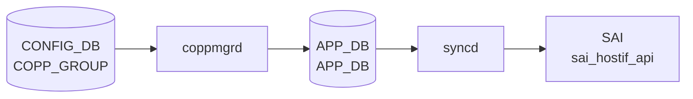

# STATE_DB COPP 状態テーブル

## 概要

[STATE_DB](../../reference/glossary.md#term-state_db) には [CoPP](../../reference/glossary.md#term-copp) に関連する 3 つのテーブルが存在する。`COPP_GROUP_TABLE` と `COPP_TRAP_TABLE` は `coppmgrd` が書き込む適用状態フラグであり、`COPP_TRAP_TABLE` の `hw_status` フィールドは `orchagent` (`CoppOrch`) が [SAI](../../reference/glossary.md#term-sai) 操作の結果を反映する。`COPP_TRAP_CAPABILITY_TABLE` はプラットフォームがサポートするトラップ ID 一覧を `CoppOrch` 初期化時に公開する。

<!-- cdb-mermaid -->
### データフロー (自動生成)



!!! note "凡例"
    CONFIG_DB から SAI までの典型経路を `docs/reference/config-db-orch-map.md` から機械生成したミニ図。詳細・例外は本ページ本文と対応表を参照。
<!-- /cdb-mermaid -->

## テーブル一覧

| テーブル名 | キー | 書き手 | 役割 |
|---|---|---|---|
| `COPP_GROUP_TABLE` | グループ名 | `coppmgr` | グループの適用状態 (`state`) |
| `COPP_TRAP_TABLE` | トラップ名 | `coppmgr` + `CoppOrch` | トラップの適用状態 (`state`) と [SAI](../../reference/glossary.md#term-sai) 状態 (`hw_status`) |
| `COPP_TRAP_CAPABILITY_TABLE` | `traps` (固定) | `CoppOrch` | [SAI](../../reference/glossary.md#term-sai) capability — プラットフォームがサポートするトラップ ID 一覧 |

---

## COPP_GROUP_TABLE

### key 構造

```text
COPP_GROUP_TABLE|<group-name>
```

`<group-name>` は `COPP_GROUP|<name>` と同一（例: `queue4_group1`, `default`）。

### フィールド

| フィールド | 型 | 説明 |
|---|---|---|
| `state` | string | 常に `"ok"`。エントリの存在自体がグループが [APP_DB](../../reference/glossary.md#term-appl_db) に書き込まれたことを示す。 |

### 書き込みタイミング

`coppmgr` の `setCoppGroupStateOk()` が以下のタイミングで呼ばれる:

1. 起動時 (`CoppMgr` コンストラクタ) — マージ後の `group_cfg` を [APPL_DB](../../reference/glossary.md#term-appl_db) に書き込んだ直後
2. `doCoppGroupTask()` — [CONFIG_DB](../../reference/glossary.md#term-config_db) の `COPP_GROUP` 変更受信後
3. `doCoppTrapTask()` / `setFeatureTrapIdsStatus()` — トラップ追加・削除により trap_ids が変化した後

### 削除タイミング

`delCoppGroupStateOk()` は以下のタイミングで呼ばれる:

- グループが pending 状態になったとき (feature 無効化によりグループに有効なトラップが 0 件になった場合)
- `doCoppGroupTask()` の DEL 処理時

### エントリ不在の意味

- グループが **pending** 状態 — そのグループに関連する feature がすべて無効
- または [CoPP](../../reference/glossary.md#term-copp) の初期処理未完了

---

## COPP_TRAP_TABLE

### key 構造

```text
COPP_TRAP_TABLE|<trap-name>
```

`<trap-name>` は `COPP_TRAP|<name>` と同一（例: `bgp`, `arp`, `snmp_grp`）。

### フィールド

| フィールド | 型 | 書き手 | 説明 |
|---|---|---|---|
| `state` | string | `coppmgr` | 常に `"ok"`。エントリ存在 = トラップが coppmgr によって有効化済み。 |
| `hw_status` | string | `CoppOrch` | SAI 操作の結果。`"installed"` または `"not-installed"`。 |

`state` と `hw_status` は**同一テーブル・同一 key** に異なるプロセスが書き込む独立したフィールド。

### `state` フィールドの書き込みタイミング

`setCoppTrapStateOk()` が呼ばれる条件:

1. 起動時 — `is_always_enabled == "true"` または feature が有効な場合
2. `doCoppTrapTask()` — SET 操作の完了後
3. feature 有効化時 (`setFeatureTrapIdsStatus(feature, true)`)
4. DEL 後に init cfg に同名キーが存在する場合の自動復元時

`delCoppTrapStateOk()` が呼ばれる条件:

- feature 無効化後にグループが pending → `setFeatureTrapIdsStatus(feature, false)` 経路
- `doCoppTrapTask()` の DEL 処理時

### `hw_status` フィールドの書き込みタイミング

`CoppOrch::updateTrapOperStatus()` が呼ばれる:

| 値 | タイミング | ソース行 |
|---|---|---|
| `"installed"` | `sai_hostif_api->create_hostif_trap()` 成功後 | `copporch.cpp:526` |
| `"not-installed"` | `sai_hostif_api->remove_hostif_trap()` 成功後 | `copporch.cpp:1413` |

key は `get_trap_name_by_type()` で `sai_hostif_trap_type_t` を文字列に変換したもの（`trap_id_map` の逆引き）。

### エントリ不在の意味

- `state` なし → coppmgr がトラップをまだ有効化していない（pending / feature 無効 / DEL 済み）
- `hw_status` なし → CoppOrch がそのトラップに対して SAI 操作をまだ実行していない

---

## COPP_TRAP_CAPABILITY_TABLE

### key 構造

```text
COPP_TRAP_CAPABILITY_TABLE|traps
```

key は常に `traps` 固定。

### フィールド

| フィールド | 型 | 説明 |
|---|---|---|
| `trap_ids` | string | プラットフォームがサポートするトラップ ID 名のカンマ区切りリスト |

### 書き込みタイミング

`CoppOrch` コンストラクタの `publishTrapIdsCapability()` が [orchagent](../../reference/glossary.md#term-orchagent) 起動時に 1 回だけ書き込む。

### 値の決定ロジック

```
sai_query_attribute_enum_values_capability() 成功
  → SAI が返したトラップ ID を文字列リストに変換して書き込み

sai_query_attribute_enum_values_capability() 失敗
  → default_supported_trap_ids (静的リスト, 42 種) にフォールバック
```

フォールバックリストには `neighbor_miss` が意図的に含まれない（コードコメント: "This list is intended to remain static and should not be updated with new traps."）。

---

<!-- defaults -->
## コード由来の暗黙デフォルト (Phase A)

### `state` フィールド — 値は常に `"ok"` でハードコード

`setCoppGroupStateOk()` と `setCoppTrapStateOk()` はともに文字列 `"ok"` をハードコードで書き込む。外部設定やフィールドの選択肢は存在しない。エントリの**存在/不在**がステータスを表す二値表現。<!-- evidence: coppmgr.cpp L426, L441 -->

### `hw_status` フィールド — 値は `"installed"` / `"not-installed"` の 2 値のみ

`updateTrapOperStatus()` に渡される文字列はコード内で直接指定される (`"installed"` または `"not-installed"`)。中間状態を表す値は存在しない。<!-- evidence: copporch.cpp L526, L1413 -->

### `COPP_TRAP_TABLE` の二重書き込み — `state` と `hw_status` の非同期

`state` (coppmgr) と `hw_status` (copporch) は同一 [Redis](../../reference/glossary.md#term-redis) key に別プロセスが独立して書き込む。`state=ok` であっても `hw_status` がまだ存在しない（SAI 登録前）、あるいは逆に `hw_status=installed` であっても `state` が存在しない（coppmgr での DEL 後に [orchagent](../../reference/glossary.md#term-orchagent) がまだ操作を受け取っていない）状態が短時間発生しうる。

### `COPP_TRAP_CAPABILITY_TABLE` — フォールバック時の `neighbor_miss` silent drop

SAI capability query が失敗した場合、`neighbor_miss` は `default_supported_trap_ids` に含まれないため `supported_trap_ids` セットに登録されない。結果として `neighbor_miss` trap を含む COPP グループは SAI への適用がスキップされ、ログ (`SWSS_LOG_NOTICE("Ignoring the trap_id: %s, since not supported by vendor SAI", ...)`) のみが出力される。<!-- evidence: copporch.cpp L104-151, L263-270, L408-413 -->

### `hw_status` キーの導出 — `trap_id_map` 逆引き

`updateTrapOperStatus()` は `get_trap_name_by_type()` で `sai_hostif_trap_type_t` を文字列に変換する。`trap_id_map` に存在しない SAI 内部トラップ型は文字列変換に失敗し、`SWSS_LOG_ERROR` を出力したうえで `COPP_TRAP_TABLE` への書き込みをスキップする。<!-- evidence: copporch.cpp L226-231 -->

> **スキャン証跡**: coppmgr.cpp L424-451 全行読了。copporch.cpp L104-300, L499-540, L1390-1420 読了。schema.h L448-450 読了。state_db.json (UT mock) 読了。発見 4 件。
<!-- /defaults -->

<!-- ordering -->
## STATE_DB 書き込み順序 (Phase B)

### 通常起動シーケンス

[STATE_DB](../../reference/glossary.md#term-state_db) への書き込みは 3 段階に分かれ、2 プロセスが非同期に関与する。

#### ステップ 1: `CoppOrch` コンストラクタ（orchagent 起動直後）

```
CoppOrch::CoppOrch()
  └─ publishTrapIdsCapability()
       └─ COPP_TRAP_CAPABILITY_TABLE|traps  ← 起動時 1 回のみ書き込み
```

SAI の `sai_query_attribute_enum_values_capability()` でプラットフォームサポート情報を取得し、即座に書き込む。失敗時は静的デフォルトリスト（42 種、`neighbor_miss` 除外）にフォールバック。`initDefaultHostIntfTable()` 等の初期化はこの後に実行される。<!-- evidence: copporch.cpp L208-209, L240-300 -->

#### ステップ 2: `CoppMgr` コンストラクタ（coppmgrd 起動時）

```
CoppMgr::CoppMgr()
  ├─ [init cfg + CONFIG_DB をマージ]
  ├─ for each trap: setCoppTrapStateOk(trap)
  │    → COPP_TRAP_TABLE|<trap>  state=ok
  ├─ for each group: m_appCoppTable.set(group, ...)
  │    → APPL_DB APP_COPP_TABLE|<group>
  └─ setCoppGroupStateOk(group)
       → COPP_GROUP_TABLE|<group>  state=ok
```

`COPP_TRAP_TABLE` の `state` が先に書かれ、その後 APPL_DB への書き込みと `COPP_GROUP_TABLE` の `state` が書かれる。`COPP_TRAP_TABLE` の `hw_status` はこの時点では書かれない。<!-- evidence: coppmgr.cpp L334-411 -->

#### ステップ 3: orchagent が APPL_DB を処理した後

```
CoppOrch::applyAttributesToTrapIds()
  ├─ sai_hostif_api->create_hostif_trap()  [SAI 成功]
  └─ updateTrapOperStatus(trap_id, "installed")
       → COPP_TRAP_TABLE|<trap-name>  hw_status=installed
```

SAI 操作が成功した場合のみ `hw_status=installed` が書き込まれる。SAI 失敗時は書き込みをスキップし、エラーログのみ出力。<!-- evidence: copporch.cpp L515-526 -->

### 削除・無効化シーケンス

| 操作 | 書き込み順 |
|---|---|
| feature 無効化 | `APPL_DB del(group)` → `COPP_GROUP_TABLE del(group)` |
| SAI remove 成功 | `hw_status=not-installed` |
| `doCoppTrapTask` DEL | `COPP_TRAP_TABLE del(trap)` → init cfg がある場合は自動復元 |

### Warm-reboot の扱い

`coppmgr.cpp` は `warm_restart.h` を include するが `WarmStart::` の呼び出しは存在しない。STATE_DB への書き込みが **冪等**（同一 key への上書き set）であるため、warm-reboot 時も通常起動と同一フローで再書き込みし、orchagent 側の SAI reconciliation に委ねる設計となっている。<!-- evidence: coppmgr.cpp L10 include のみ、WarmStart:: 呼び出し 0 件 -->

### 依存グラフ

```
orchagent 起動
  → COPP_TRAP_CAPABILITY_TABLE|traps

coppmgrd 起動
  → COPP_TRAP_TABLE|<trap> state=ok  (各トラップ)
  → APPL_DB APP_COPP_TABLE|<group>
  → COPP_GROUP_TABLE|<group> state=ok

orchagent が APPL_DB を処理
  → SAI create_hostif_trap 成功
  → COPP_TRAP_TABLE|<trap> hw_status=installed
```

`state` (coppmgr) と `hw_status` (copporch) は同一 [Redis](../../reference/glossary.md#term-redis) キーに非同期で書き込まれるため、両フィールドが揃うタイミングは保証されない。短時間の不整合（`state=ok` だが `hw_status` 未設定、またはその逆）は正常動作である。
<!-- /ordering -->

<!-- cross-refs -->
## 暗黙参照テーブル (Phase C)

本ページの [STATE_DB](../../reference/glossary.md#term-state_db) 3 テーブル（`COPP_GROUP_TABLE` / `COPP_TRAP_TABLE` / `COPP_TRAP_CAPABILITY_TABLE`）はいずれも [YANG](../../reference/glossary.md#term-yang) 未モデル化のオペレーショナルテーブルで、`coppmgrd` および `CoppOrch` が**書き手 (producer only)** として書き込む。以下では各 STATE_DB エントリの**生成トリガ・キー値・フィールド値**が依存する入力側テーブルと前提リソースを整理する。

| 参照先テーブル / リソース | 参照方向 | 条件 | 参照元 evidence |
|--------------------------|---------|------|----------------|
| `COPP_TRAP\|<trap-name>` ([CONFIG_DB](../../reference/glossary.md#term-config_db)) | キー転写 + SET/DEL トリガ | 常時。`<trap-name>` は `COPP_TRAP_TABLE` キーに転写される。`trap_group` / `trap_ids` / `always_enabled` フィールドを参照 | `coppmgr.cpp` L298-303 (テーブル参照), L531-815 (`doCoppTrapTask`) |
| `COPP_GROUP\|<group-name>` (CONFIG_DB) | キー転写 + SET/DEL トリガ | 常時。`<group-name>` は `COPP_GROUP_TABLE` キーに転写 | `coppmgr.cpp` L299, L840-927 (`doCoppGroupTask`) |
| `FEATURE\|<feature-name>` (CONFIG_DB) | feature 有効フラグ参照 | 常時。`state` フィールドが `enabled` かどうかで `COPP_TRAP_TABLE` / `COPP_GROUP_TABLE` のエントリ追加・削除が決まる | `coppmgr.cpp` L300, L323-330, L928-967 (`doFeatureTask`), L157-172 (`isFeatureEnabled`) |
| `APP_COPP_TABLE\|<group-name>` ([APPL_DB](../../reference/glossary.md#term-appl_db)) | 中継テーブル — coppmgr が書き込み、CoppOrch が読み出す | 常時。`coppmgrd` が `APPL_DB` に書いた後、`CoppOrch` が SAI に反映し `hw_status` を STATE_DB に返す | `coppmgr.cpp` L301 (`m_appCoppTable`), `copporch.cpp` L191 (Consumer) |
| `PortsOrch::allPortsReady()` | 起動順序ガード | 常時。全ポートが Ready でない間は `CoppOrch::doTask()` が即 return し、`COPP_TRAP_TABLE.hw_status` が書き込まれない | `copporch.cpp` L885-888 |
| SAI `sai_query_attribute_enum_values_capability()` | SAI クエリ → `COPP_TRAP_CAPABILITY_TABLE` 書込み | 起動時 1 回。成功時は SAI 返値、失敗時は `default_supported_trap_ids`（42 種、`neighbor_miss` 除く）にフォールバック | `copporch.cpp` L240-300 (`publishTrapIdsCapability`) |
| SAI `sai_hostif_api->create_hostif_trap()` / `remove_hostif_trap()` | SAI 戻り値 → `hw_status` 値 | 常時。成功時のみ `"installed"` / `"not-installed"` を書込む。失敗時は書込みをスキップしエラーログのみ | `copporch.cpp` L526, L1413 (`updateTrapOperStatus`) |
| `COUNTERS_DB COUNTERS_TRAP_NAME_MAP` | トラップカウンタ名マップ書込み | `bindTrapCounter()` 成功時。[FlexCounter](../../reference/glossary.md#term-flexcounter) 経由の統計収集に必要。STATE_DB への書込みには直接影響しない | `copporch.cpp` L1455-1456 (`m_counter_table->set`) |
| `platform` 環境変数 (`getenv("platform")`) | プラットフォーム分岐 | Mellanox / Marvell プラットフォームでは SAI への trap priority 設定をスキップ。`COPP_TRAP_TABLE.hw_status` の書込み自体には影響しないが SAI 操作の成否に間接影響 | `copporch.cpp` L353-354, L1188-1189 (`initDefaultTrapIds`, `getAttribsFromTrapGroup`) |

!!! note "STATE_DB エントリは「書き出し専用」のステータスレジスタ"
    `coppmgrd` / `CoppOrch` 以外の書き手は存在しない。`show copp` / `dump copp` 等の CLI ツールは読み手のみ。
    orchagent 再起動時も `coppmgrd` は同一キーへの上書き set で再書き込みするため、冪等性が保たれる。

!!! note "`COPP_TRAP_CAPABILITY_TABLE` は orchagent 起動時 1 回のみ更新"
    `publishTrapIdsCapability()` は `CoppOrch` コンストラクタ (`copporch.cpp:208-209`) で呼ばれるのみで、CONFIG_DB / APPL_DB の動的変更による再書込みは発生しない。プラットフォームの SAI 実装が変わらない限り、起動後の値は固定である。

> **スキャン証跡**: coppmgr.cpp L296-411, L531-985 全行読了。copporch.cpp L32-36, L191-215, L240-300, L392-420, L880-960, L1370-1492 読了。cross-refs 8 件検出。
<!-- /cross-refs -->

<!-- failure -->
## 失敗挙動 (Phase D)

`COPP_GROUP_TABLE` / `COPP_TRAP_TABLE` / `COPP_TRAP_CAPABILITY_TABLE` への書き手は `coppmgrd` と `CoppOrch`（[orchagent](../../reference/glossary.md#term-orchagent)）の 2 プロセス。両プロセスとも STATE_DB への書き込みは `swss::Table::set/del`（void 戻り値）で行うため、**[Redis](../../reference/glossary.md#term-redis) 書き込み失敗はアプリ層では検出できず**、例外伝播によるプロセス abort → systemd 再起動が唯一の回復経路となる。以下では各プロセスの失敗分岐と STATE_DB への影響を整理する。

### A. `CoppOrch` 初期化失敗（orchagent 起動時）

| 失敗箇所 | 失敗条件 | 致死性 | STATE_DB への影響 |
|---|---|---|---|
| `publishTrapIdsCapability()` — SAI capability クエリ | `sai_query_attribute_enum_values_capability()` 失敗 | **非致死** (フォールバック) | `COPP_TRAP_CAPABILITY_TABLE|traps` に `default_supported_trap_ids`（42 種、`neighbor_miss` 除く）で書き込み。orchagent は継続 |
| `initDefaultHostIntfTable()` — デフォルト hostif テーブル作成 | `sai_hostif_api->create_hostif_table_entry()` 失敗 | **致死** | `throw "CoppOrch initialization failure"` → orchagent abort → systemd 再起動。`COPP_TRAP_CAPABILITY_TABLE` は直前に書き込み済み |
| `initDefaultTrapGroup()` — デフォルトトラップグループ取得 | `sai_switch_api->get_switch_attribute()` 失敗 | **致死** | 同上 |
| `initDefaultTrapIds()` — デフォルトトラップ ID 適用 | `applyAttributesToTrapIds()` 失敗 | **致死** | 同上 |

<!-- evidence: copporch.cpp L208-215, L262-299, L318-326, L361-365, L377-385 -->

### B. `CoppOrch::doTask()` — `processCoppRule` の失敗分岐

**起動ガード（`allPortsReady()` false）**: `doTask()` 冒頭で全ポート未 ready を検出した場合、即 `return` して全 APPL_DB アイテムを保留。`COPP_TRAP_TABLE.hw_status` は一切書き込まれない。ポートが ready になれば次サイクルで自動再開する。<!-- evidence: copporch.cpp L885-888 -->

| `task_status` | 発生条件 | `doTask()` の動作 | STATE_DB 影響 |
|---|---|---|---|
| `task_success` / `task_ignore` | 正常完了 / 無視可能 | `m_toSync.erase(it)` → 次アイテムへ | 正常書き込み |
| `task_need_retry` | SAI 一時失敗（transient error） | `it++` でアイテム保留 → 次サイクルで再試行 | `hw_status` 未書き込み（次回再試行） |
| `task_failed` | SAI 致命的失敗（ポリサー作成失敗、genetlink 重複等） | `m_toSync.erase(it)` → **`return`（残アイテム処理停止）** | `hw_status` 未書き込み。orchagent は生存するが次イテレーションまで他グループも処理されない |
| `task_invalid_entry` | 例外（`out_of_range` / `std::exception`）または未知 op | `m_toSync.erase(it)` → 次アイテムへ（永久スキップ） | `hw_status` 未書き込み。当該エントリは再試行されない |

<!-- evidence: copporch.cpp L896-932 -->

**`create_hostif_trap` SAI 失敗 → `hw_status` 未書き込み**: `applyAttributesToTrapIds()` 内で SAI 操作が失敗した場合、`updateTrapOperStatus()` の呼び出しがスキップされ `COPP_TRAP_TABLE.hw_status` は書き込まれない。`handleSaiCreateStatus()` が返す status に応じて `task_need_retry` または `task_failed` として伝播する。<!-- evidence: copporch.cpp L515-526 -->

**Genetlink 重複作成 — `task_failed` 即時**:  `m_trap_group_hostif_map` に既存エントリが存在する状態で再度 genetlink trap group を作成しようとすると `task_failed` が即時返却される。当該グループへの `hw_status` 書き込みはスキップされ、`doTask()` が `return` して後続グループの処理も停止する。<!-- evidence: copporch.cpp L835-840 -->

### C. `coppmgrd` — STATE_DB 書き込みの失敗挙動

**`setCoppGroupStateOk()` / `setCoppTrapStateOk()` の戻り値なし**: `swss::Table::set()` は void。Redis I/O エラーは例外として伝播し coppmgrd プロセス abort → systemd 再起動で自己回復する。STATE_DB の書き込み失敗が永続する設計は存在しない。

**`trap_group` / `trap_ids` 欠落によるサイレントスキップ**: `doCoppTrapTask()` で `trap_group.empty() || trap_ids.empty()` の場合、エラーログなしで `m_toSync.erase(it)` し永久スキップする。`setCoppTrapStateOk()` は呼ばれず `COPP_TRAP_TABLE.state` は書き込まれない。<!-- evidence: coppmgr.cpp L609-613 -->

### D. STATE_DB 不整合が発生しうる中間状態

| 状態 | 原因 | 挙動 |
|---|---|---|
| `state=ok` あり、`hw_status` なし | coppmgrd 書き込み完了、orchagent の SAI 処理未完了 | 正常な起動中間状態。SAI 成功後に `hw_status=installed` が追記される |
| `hw_status=installed` あり、`state` なし | coppmgrd が DEL した後、orchagent の `remove_hostif_trap` が未実行 | 短時間の過渡状態。次サイクルで `hw_status=not-installed` に更新される |
| `hw_status` 未書き込み（永続） | SAI `create_hostif_trap` の `task_invalid_entry` 系失敗 | 当該エントリは永久スキップ。orchagent 再起動後に再処理 |
| `COPP_TRAP_TABLE.state` 未書き込み | `trap_group` / `trap_ids` 欠落による coppmgrd サイレントスキップ | CONFIG_DB の当該 COPP_TRAP エントリを修正して再投入するまで回復しない |

> **スキャン証跡**: `copporch.cpp` L208-215, L240-300, L315-390, L499-532, L880-934 読了。`coppmgr.cpp` L424-451, L531-815 読了。失敗分岐 4 系統（SAI init / doTask status / SAI trap create / coppmgrd skip）を確認。詳細は `meta/_intermediate/cdb-flow/copp-state-failure.md` 参照。
<!-- /failure -->

<!-- constants -->
## ハードコード定数 (Phase E)

`CoppOrch` (`copporch.cpp` / `copporch.h`) および `CoppMgr` (`coppmgr.cpp`) 内に存在する、CONFIG_DB / [YANG](../../reference/glossary.md#term-yang) で管理されないハードコード定数の一覧。これらの値は STATE_DB テーブルの書き込みタイミング・フィールド値・capability 公開内容に直接影響する。

### FlexCounter / タイマー定数

| 定数 | 値 | 用途 | ソース |
|------|----|------|--------|
| `FLEX_COUNTER_UPD_INTERVAL` | `1` 秒 | `SelectableTimer` の更新周期。[FlexCounter](../../reference/glossary.md#term-flexcounter) グループパラメータ設定タイミングに影響 | `copporch.cpp` L37 |
| `HOSTIF_TRAP_COUNTER_POLLING_INTERVAL_MS` | `10000` ms | ホストインタフェーストラップカウンタの [FlexCounter](../../reference/glossary.md#term-flexcounter) ポーリング間隔 | `copporch.cpp` L189 |
| `HOSTIF_TRAP_COUNTER_FLEX_COUNTER_GROUP` | `"HOSTIF_TRAP_FLOW_COUNTER"` | [COUNTERS_DB](../../reference/glossary.md#term-counters_db) FlexCounter グループ名。`bindTrapCounter()` / `unbindTrapCounter()` 経由で `COUNTERS_TRAP_NAME_MAP` への書き込みを制御 | `copporch.h` L23 |

### STATE_DB フィールド値定数

| 定数 / リテラル | 値 | 用途 | ソース |
|---------------|----|------|--------|
| `hw_status` 値 ("installed") | `"installed"` | `create_hostif_trap()` 成功後に `COPP_TRAP_TABLE.<trap-name>.hw_status` へ書き込む文字列。ハードコード | `copporch.cpp` L526 |
| `hw_status` 値 ("not-installed") | `"not-installed"` | `remove_hostif_trap()` 成功後に書き込む文字列。ハードコード | `copporch.cpp` L1413 |
| `state` 値 ("ok") | `"ok"` | `setCoppGroupStateOk()` / `setCoppTrapStateOk()` が書き込む固定値。COPP_GROUP_TABLE / COPP_TRAP_TABLE の `state` フィールドはこの 1 値のみ取る | `coppmgr.cpp` L426, L441 |
| `COPP_TRAP_CAPABILITY_TABLE` key | `"traps"` | `publishTrapIdsCapability()` が書き込む固定 key。1 エントリのみ存在し、フィールド名は `"trap_ids"` | `copporch.cpp` L298-299 |

### デフォルトトラップグループ / トラップ ID

| 定数 | 値 | 用途 | ソース |
|------|----|------|--------|
| `default_trap_group` | `"default"` | orchagent 起動時に `initDefaultTrapGroup()` で取得するデフォルトトラップグループ名 | `copporch.cpp` L184 |
| `default_trap_ids` | `{SAI_HOSTIF_TRAP_TYPE_TTL_ERROR}` (1 種) | `initDefaultTrapIds()` で初期適用される固定トラップ ID。TTL エラーのみ | `copporch.cpp` L185-187 |
| `default_supported_trap_ids` フォールバックリスト | 44 エントリ (`stp`～`bfdv6_micro`、`neighbor_miss` **除外**) | SAI capability クエリ失敗時に `COPP_TRAP_CAPABILITY_TABLE|traps.trap_ids` へ書き込まれるリスト。`neighbor_miss` は意図的に除外（コメント: "This list is intended to remain static and should not be updated with new traps."）| `copporch.cpp` L106-151 |

### プラットフォーム環境変数分岐

| 定数 / 検査値 | 用途 | ソース |
|--------------|------|--------|
| `getenv("platform")` 文字列比較 | `"x86_64-mlnx_msn*"` (Mellanox) または `"arm64-marvell_*"` パターンで trap priority 設定をスキップ。SAI create_hostif_trap の attrib リストに `SAI_HOSTIF_TRAP_ATTR_TRAP_PRIORITY` を含めない | `copporch.cpp` L353-354, L1188-1189 |

> **スキャン証跡**: `copporch.cpp` L37, L106-151, L184-215, L296-299, L350-360, L499-532, L1185-1195, L1385-1395, L1413 読了。`copporch.h` L23-46 読了。`coppmgr.cpp` L424-451 読了。定数 5 種別 13 件を確認。
<!-- /constants -->

<!-- side-effects -->
## 副次 DB 書込 (Phase F)

`CoppOrch` (`copporch.cpp`) が STATE_DB 3 テーブルへの書き込みと並行して行う、[COUNTERS_DB](../../reference/glossary.md#term-counters_db) および [FLEX_COUNTER_DB](../../reference/glossary.md#term-flex_counter_db) への副次書き込みを整理する。`coppmgrd` が書く [APPL_DB](../../reference/glossary.md#term-appl_db) は本ページのテーブルの直接の生成トリガ（Phase B 参照）であるため除外する。

### SAI トラップ作成成功時 — COUNTERS_DB 書き込み

`applyAttributesToTrapIds()` 内で `create_hostif_trap()` が成功し、`bindTrapCounter()` が呼ばれた場合、以下が書き込まれる。

| 副次 DB | テーブル / キー | フィールド | 書込内容 | 根拠 |
|---------|---------------|---------|---------|------|
| [COUNTERS_DB](../../reference/glossary.md#term-counters_db) | `COUNTERS_TRAP_NAME_MAP` | `<trap-name>` | SAI generic counter OID 文字列 | `copporch.cpp` L1452-1456 (`bindTrapCounter`) |

書き込みは `FlexCounterOrch::getHostIfTrapCounterState()` が `true` を返す場合のみ実行される。FlexCounter 機能が無効な場合は `bindTrapCounter()` が即 `return false` し COUNTERS_DB への書き込みは発生しない。<!-- evidence: copporch.cpp L1420-1425 -->

### SAI トラップ作成成功後 — FLEX_COUNTER_DB 書き込み（タイマー非同期）

`bindTrapCounter()` は counter_id を `m_pendingAddToFlexCntr` に積み、`SelectableTimer`（1 秒周期）を起動する。タイマー発火時の `doTask(SelectableTimer&)` が [FLEX_COUNTER_DB](../../reference/glossary.md#term-flex_counter_db) へ書き込む。

| 副次 DB | テーブル / キー | 書込内容 | 書込タイミング | 根拠 |
|---------|---------------|---------|--------------|------|
| [FLEX_COUNTER_DB](../../reference/glossary.md#term-flex_counter_db) | `HOSTIF_TRAP_FLOW_COUNTER\|<counter_oid>` | `HOSTIF_TRAP_STAT_PACKETS` カウンタ ID リスト | タイマー発火時（≤1 秒後）。`gTraditionalFlexCounter` が true の場合は VID→RID マップ確認後に書き込み | `copporch.cpp` L944-951 (`doTask` timer), `L1463` (timer start) |

`gTraditionalFlexCounter` が false（デフォルト: SONiC 4.x 以降）の場合は VID 確認なしで即書き込み。true の場合は `VIDTORID` テーブルで対応 RID が確認できるまでペンディングされ続ける。<!-- evidence: copporch.cpp L944-951 -->

また、`initTrapRatePlugin()` が初回のみ呼ばれ、FlexCounter グループにカスタム Lua スクリプト SHA を設定する:

| 副次 DB | テーブル / キー | 書込内容 | 根拠 |
|---------|---------------|---------|------|
| FLEX_COUNTER_DB | `FLEX_COUNTER_GROUP_TABLE\|HOSTIF_TRAP_FLOW_COUNTER` | `FLOW_COUNTER_PLUGIN_FIELD` = Lua スクリプト SHA | `copporch.cpp` L1389-1396 (`setFlexCounterGroupParameter`) |

### SAI トラップ削除時 — COUNTERS_DB / FLEX_COUNTER_DB クリーンアップ

`removeTrap()` → `unbindTrapCounter()` が呼ばれると以下が削除される。

| 副次 DB | テーブル / キー | 操作 | 根拠 |
|---------|---------------|------|------|
| COUNTERS_DB | `COUNTERS_TRAP_NAME_MAP` | `hdel(<trap-name>)` で当該トラップ OID マッピングを削除 | `copporch.cpp` L1494-1495 |
| FLEX_COUNTER_DB | `HOSTIF_TRAP_FLOW_COUNTER\|<counter_oid>` | `clearCounterIdList(counter_id)` でカウンタ ID リストをクリア | `copporch.cpp` L1487 |

`m_pendingAddToFlexCntr` にまだ pending 中の場合は FLEX_COUNTER_DB への書き込みをキャンセルし `clearCounterIdList` をスキップする（二重クリーンアップ防止）。<!-- evidence: copporch.cpp L1484-1491 -->

### 副次書き込みが発生しないケース

| ケース | 理由 |
|--------|------|
| FlexCounter 無効時 (`getHostIfTrapCounterState() = false`) | `bindTrapCounter()` が即 `return false`。COUNTERS_DB / FLEX_COUNTER_DB への書き込みなし |
| SAI `create_hostif_trap` 失敗時 | `applyAttributesToTrapIds()` が `hw_status` 書き込みもスキップするため `bindTrapCounter()` は呼ばれない (`copporch.cpp` L515-526) |
| APPL_DB / CONFIG_DB | `CoppOrch` は CONFIG_DB / APPL_DB への書き戻しを行わない |
| STATE_DB 以外の STATE 系 | APPL_STATE_DB への `ResponsePublisher` 書き込みは COPP テーブルには存在しない |

> **スキャン証跡**: `copporch.cpp` L35-37, L193-215, L520-532, L935-965, L1375-1530 読了。副次書き込み先は COUNTERS_DB (`COUNTERS_TRAP_NAME_MAP`) と FLEX_COUNTER_DB (`HOSTIF_TRAP_FLOW_COUNTER|*`, `FLEX_COUNTER_GROUP_TABLE|HOSTIF_TRAP_FLOW_COUNTER`) の 3 テーブルのみ。詳細は `meta/_intermediate/cdb-flow/copp-state-side.md` 参照。
<!-- /side-effects -->

<!-- pubsub -->
## 通信メカニズム (Phase G)

STATE_DB の COPP 3 テーブルは、CONFIG_DB → coppmgrd → APPL_DB → CoppOrch → STATE_DB という多段 Producer/Consumer パイプラインの終端に位置する。

### Producer/Consumer ペア

| 区間 | 方式 | チャンネル/パターン |
|------|------|--------------------|
| CONFIG_DB (`COPP_TRAP`, `COPP_GROUP`, `FEATURE`) → `CoppMgr` | `SubscriberStateTable` | keyspace notification (`__keyspace@{cfg_db_id}__:COPP_TRAP\|*` 等) |
| `CoppMgr` → APPL_DB (`COPP_TABLE`) | `ProducerStateTable` | Redis Streams (`COPP_TABLE`) |
| APPL_DB (`COPP_TABLE`) → `CoppOrch` | `Consumer`（`Orch` 基底） | keyspace notification (`__keyspace@{appl_db_id}__:COPP_TABLE\|*`) |
| `CoppOrch` → STATE_DB (`COPP_GROUP_TABLE`, `COPP_TRAP_TABLE`, `COPP_TRAP_CAPABILITY_TABLE`) | `Table::set()` / `Table::del()` (直接書き込み) | 通知なし |

### SubscriberStateTable の動作

`CoppMgr` は `Orch(cfgDb, {CFG_COPP_TRAP_TABLE_NAME, CFG_COPP_GROUP_TABLE_NAME, CFG_FEATURE_TABLE_NAME})` 基底を通じて 3 テーブルの `SubscriberStateTable` を生成する (`coppmgrd.cpp:28-31`)。CONFIG_DB の keyspace notification でエントリ変化を検出し、`pops()` で現在値を読み出す。起動時は既存エントリを先読み (`getKeys()`) して起動前の設定を取りこぼさない。

`CoppOrch` は `Orch(applDb, APP_COPP_TABLE_NAME)` 基底を通じて APPL_DB の `APP_COPP_TABLE` の `Consumer` を生成し、`coppmgrd` が `ProducerStateTable::set()` で書き込んだエントリを受信する (`orchdaemon.cpp:341`)。

### select() ループと doTask 実行順序

`coppmgrd` と `orchagent` はそれぞれ独立した `Select::select()` ループ（タイムアウト 1000 ms）を持つ。

- `coppmgrd`: `CoppMgr::doTask()` を呼び出し、`doCoppTrapTask()` / `doCoppGroupTask()` / `setFeatureTrapIdsStatus()` で CONFIG_DB 変更を APPL_DB に反映、その後 STATE_DB の `COPP_GROUP_TABLE` / `COPP_TRAP_TABLE` に `state=ok` を書き込む (`coppmgr.cpp:424-451`)
- `orchagent`: `CoppOrch::doTask(Consumer&)` の冒頭で `gPortsOrch->allPortsReady()` をチェックし、全ポート初期化完了まで APPL_DB イベントを保留する (`copporch.cpp:885-888`)

### COPP_TRAP_CAPABILITY_TABLE の特殊経路

`COPP_TRAP_CAPABILITY_TABLE` は上記パイプラインとは独立して、`CoppOrch` コンストラクタ内の `publishTrapIdsCapability()` が **orchagent 起動時に 1 回だけ**直接書き込む。CONFIG_DB / APPL_DB 変化には依存しない (`copporch.cpp:208-215`)。

### STATE_DB の読み出し側（subscriber）

STATE_DB の COPP テーブルを読み出すコンポーネント:

| コンポーネント | 読み出し方式 | 用途 |
|---------------|-------------|------|
| `sonic-utilities` `show copp policer` (`show/copp.py:21`) | `db.get_all(STATE_DB, "COPP_TRAP_TABLE\|{trap_id}")` | トラップの hw_status を CLI 表示 |
| `sonic-utilities` `dump copp` プラグイン (`dump/plugins/copp.py:109-113`) | `MatchRequest(db="STATE_DB", table="COPP_TRAP_TABLE")` 等 | デバッグ用 DB エントリ集約 |

STATE_DB の COPP テーブルを `SubscriberStateTable` で非同期購読するデーモンは存在しない（poll/snapshot 読み出しのみ）。

### データフロー図

```
CONFIG_DB[COPP_TRAP|*, COPP_GROUP|*, FEATURE|*]
  ↓ SubscriberStateTable (keyspace notification)
coppmgrd: CoppMgr::doTask()
  ↓ doCoppTrapTask() / doCoppGroupTask() / setFeatureTrapIdsStatus()
  ↓ ProducerStateTable::set()/del()
APPL_DB[COPP_TABLE|<group-name>]
  ↓ Consumer (keyspace notification)
orchagent: CoppOrch::doTask()
  ↓   [allPortsReady() チェック — PortsOrch 完了まで保留]
  ↓ processCoppRule()
  ↓   → sai_hostif_api (SAI create/remove)
  ↓ Table::set() (直接書き込み)
STATE_DB[COPP_GROUP_TABLE|*, COPP_TRAP_TABLE|*, COPP_TRAP_CAPABILITY_TABLE|traps]
  ↓ snapshot read (poll)
sonic-utilities (show copp / dump copp)
```

> **スキャン証跡**: `coppmgrd.cpp` L21-65 全行読了。`coppmgr.cpp` L71, L296-310, L424-451 読了。`copporch.cpp` L191-215, L880-892 読了。`orchdaemon.cpp` L341, L500 読了。`show/copp.py` L21 読了。`dump/plugins/copp.py` L109-113 読了。
<!-- /pubsub -->

<!-- platform -->
## プラットフォーム差 (Phase H)

### Mellanox / Marvell Prestera — `trap_priority` 設定のスキップと `hw_status` への影響

`CoppOrch` は `getenv("platform")` 環境変数を参照し、`"mellanox"` (`MLNX_PLATFORM_SUBSTRING`) または `"marvell-prestera"` (`MRVL_PRST_PLATFORM_SUBSTRING`) を含むプラットフォームでは `SAI_HOSTIF_TRAP_ATTR_TRAP_PRIORITY` 属性を SAI 呼び出しのリストから除外する。この分岐は 2 箇所に存在する。

| 呼び出し箇所 | 分岐条件 | 影響 |
|-------------|---------|------|
| `initDefaultTrapIds()` — 起動時デフォルトトラップ適用 | `platform` に `"mellanox"` / `"marvell-prestera"` を含む | `SAI_HOSTIF_TRAP_ATTR_TRAP_PRIORITY = 1` を attrib リストに含めずに `create_hostif_trap()` を呼ぶ | `copporch.cpp:354` |
| `getAttribsFromTrapGroup()` — COPP_GROUP の `trap_priority` フィールド処理 | 同上 | CONFIG_DB / APPL_DB から `trap_priority` が来ても SAI へは渡さず無視する | `copporch.cpp:1189` |

**STATE_DB `COPP_TRAP_TABLE.hw_status` への影響**: `trap_priority` のスキップは SAI `create_hostif_trap()` の成否には直接影響しない。成功すれば `hw_status=installed` が書き込まれ、失敗すれば書き込みがスキップされる点はすべてのプラットフォームで共通。ただし Mellanox / Marvell Prestera では `trap_priority` に依存した SAI 実装側の挙動（デフォルト priority の扱い）が異なるため、SAI 失敗率に間接影響しうる。

**`COPP_TRAP_CAPABILITY_TABLE` への影響**: `publishTrapIdsCapability()` はプラットフォーム環境変数を参照しない。`sai_query_attribute_enum_values_capability()` の結果はプラットフォームごとに異なる（返却される trap ID リストが異なる）が、書き込みロジック自体はプラットフォーム非依存。SAI capability クエリが失敗した場合のフォールバックリストも全プラットフォーム共通の静的リストが使用される。

| プラットフォーム | `trap_priority` SAI 設定 | `hw_status` 書込みロジック | `COPP_TRAP_CAPABILITY_TABLE` |
|----------------|------------------------|--------------------------|------------------------------|
| Mellanox (`"mellanox"` 含む) | スキップ | 共通 (SAI 成否に依存) | SAI capability 返却値依存 |
| Marvell Prestera (`"marvell-prestera"` 含む) | スキップ | 共通 (SAI 成否に依存) | SAI capability 返却値依存 |
| その他 (x86, Broadcom 等) | `priority=1` を設定 | 共通 (SAI 成否に依存) | SAI capability 返却値依存 |

> **スキャン証跡**: `copporch.cpp` L348-362 (`initDefaultTrapIds` platform 分岐)、`copporch.cpp` L1183-1195 (`getAttribsFromTrapGroup` platform 分岐)、`orchagent/orch.h` L41-42 (定数定義 `MLNX_PLATFORM_SUBSTRING="mellanox"`, `MRVL_PRST_PLATFORM_SUBSTRING="marvell-prestera"`)、`copporch.cpp` L240-300 (`publishTrapIdsCapability` — platform 分岐なし) 読了。
<!-- /platform -->

## 確認コマンド

```bash
# グループ状態確認
sonic-db-cli STATE_DB hgetall 'COPP_GROUP_TABLE|queue4_group1'

# トラップ状態確認
sonic-db-cli STATE_DB hgetall 'COPP_TRAP_TABLE|bgp'

# プラットフォームサポートトラップ一覧
sonic-db-cli STATE_DB hgetall 'COPP_TRAP_CAPABILITY_TABLE|traps'

# 全 COPP 状態を一覧
sonic-db-cli STATE_DB keys 'COPP_*TABLE|*'
```

## 購読者

- `sonic-utilities` の `dump copp` プラグイン (`dump/plugins/copp.py`): デバッグ用にすべての COPP 関連 DB エントリを集約して表示

## 関連 CONFIG_DB / YANG / CLI

- 関連 [CONFIG_DB](../../reference/glossary.md#term-config_db): `COPP_GROUP`, `COPP_TRAP`
- 関連 CLI: `show copp config`, `show copp policer`, `sonic-db-cli STATE_DB`

<!-- ref-triangle:start -->

## 関連リファレンス

- CONFIG_DB: [`COPP_GROUP`](copp-group.md)
- CONFIG_DB: [`COPP_TRAP`](copp-trap.md)

<!-- ref-triangle:end -->

## 引用元

[^1]: `sonic-swss/cfgmgr/coppmgr.cpp` — `setCoppGroupStateOk()` / `setCoppTrapStateOk()` の実装。  
[^2]: `sonic-swss/orchagent/copporch.cpp` — `updateTrapOperStatus()` / `publishTrapIdsCapability()` の実装。  
[^3]: `sonic-swss-common/common/schema.h` L448-450 — テーブル名定数定義。

<!-- glossary-links-injected: 4a79e2a68815 -->
