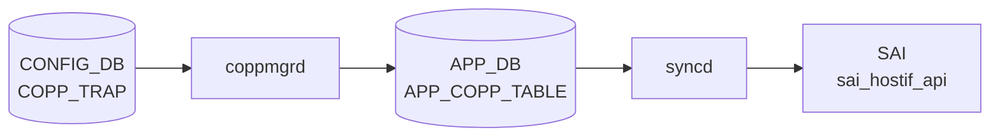

# COPP_TRAP テーブル

## 概要

[CoPP](../../reference/glossary.md#term-copp) の trap エントリを定義し、[SAI](../../reference/glossary.md#term-sai) hostif trap ID 群を `COPP_GROUP` に束ねる。各 trap は `trap_ids` フィールドにカンマ区切り識別子 (`bgp`、`lldp`、`arp_req` など) を列挙し、`trap_group` で `COPP_GROUP` に紐付ける[^1]。`coppmgr` が両テーブルを結合し [APPL_DB](../../reference/glossary.md#term-appl_db) の `COPP_TABLE` に書く。

<!-- cdb-mermaid -->
### データフロー (自動生成)



!!! note "凡例"
    CONFIG_DB から SAI までの典型経路を `docs/reference/config-db-orch-map.md` から機械生成したミニ図。詳細・例外は本ページ本文と対応表を参照。
<!-- /cdb-mermaid -->

## key 構造

```
COPP_TRAP|<name>
```

## 主要フィールド

| フィールド | 型 | 必須 | 既定 | 説明 |
|-----------|----|------|------|------|
| `trap_ids` | string | yes | - | カンマ区切り trap 識別子。例: `bgp,bgpv6` |
| `trap_group` | leafref `COPP_GROUP.name` | no | - | 適用する [CoPP](../../reference/glossary.md#term-copp) group |
| `always_enabled` | boolean | no | - | true なら feature の有効/無効に関わらず常時インストール |

## 動作上の注意

- `always_enabled = true` のエントリ (例: [BGP](../../reference/glossary.md#term-bgp) / [LLDP](../../reference/glossary.md#term-lldp) のシステム必須 trap) はユーザの `config feature state` 操作と独立にインストールされる
- 既定の `COPP_TRAP` 群は `dockers/docker-orchagent/copp_cfg.j2` および `files/image_config/copp/copp_cfg.j2` 由来でビルド時に生成される

## 購読者

- `coppmgr`: [CONFIG_DB](../../reference/glossary.md#term-config_db) → [APPL_DB](../../reference/glossary.md#term-appl_db) `COPP_TABLE`
- `orchagent` `CoppOrch`: [SAI](../../reference/glossary.md#term-sai) HOSTIF_TRAP オブジェクト生成

## 関連 CONFIG_DB / YANG / CLI

- 関連 [CONFIG_DB](../../reference/glossary.md#term-config_db): `COPP_GROUP`、`FEATURE`
- 関連 CLI: `config copp`、`show copp`
- 関連 [YANG](../../reference/glossary.md#term-yang): `sonic-copp`

<!-- ref-triangle:start -->

## 関連リファレンス

- [YANG](../../reference/glossary.md#term-yang): [`sonic-copp`](../yang/sonic-copp.md)
- CLI: `config copp`

<!-- ref-triangle:end -->

## 引用元

[^1]: [YANG](../../reference/glossary.md#term-yang) 定義: `sonic-copp.yang`. <https://github.com/sonic-net/sonic-buildimage/blob/9ea932ec2e18f35e58268ec2e4456b1d4afd65cd/src/sonic-yang-models/yang-models/sonic-copp.yang>

<!-- topics-back-ref -->
## 関連 Topics

- [Topics: ACL / CoPP / Mirror / Packet Action](../../topics/07-acl-copp-mirror/index.md)

<!-- /topics-back-ref -->

<!-- ops-hint -->
## 運用ヒント

### 典型値

- key 形式: `COPP_TRAP|<trap-name>` (`bgp`, `lldp`, `arp` 等)。
- `trap_ids`: `bgp,bgpv6` 等のカンマ区切り。
- `trap_group`: 紐付ける `COPP_GROUP` 名。

### よくある誤設定

- 存在しない `trap_group` を参照すると copporch が trap を install しない。
- `trap_ids` のスペル違いは silently 無視され該当トラフィックが CPU に上がらない。

### 確認コマンド

```bash
sonic-db-cli CONFIG_DB keys 'COPP_TRAP|*'
show copp config
```
<!-- /ops-hint -->

<!-- glossary-links-injected: 7a3847939b09 -->
