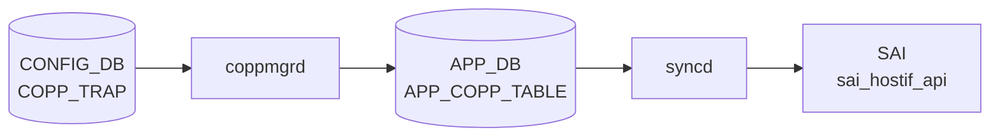

# COPP_TRAP テーブル

## 概要

[CoPP](../../reference/glossary.md#term-copp) の trap エントリを定義し、[SAI](../../reference/glossary.md#term-sai) hostif trap ID 群を `COPP_GROUP` に束ねる。各 trap は `trap_ids` フィールドにカンマ区切り識別子 (`bgp`、`lldp`、`arp_req` など) を列挙し、`trap_group` で `COPP_GROUP` に紐付ける[^1]。`coppmgr` が両テーブルを結合し [APPL_DB](../../reference/glossary.md#term-appl_db) の `COPP_TABLE` に書く。

<!-- cdb-mermaid -->
### データフロー (自動生成)



!!! note "凡例"
    CONFIG_DB から SAI までの典型経路を `docs/reference/config-db-orch-map.md` から機械生成したミニ図。詳細・例外は本ページ本文と対応表を参照。
<!-- /cdb-mermaid -->

## key 構造

```text
COPP_TRAP|<name>
```

## 主要フィールド

| フィールド | 型 | 必須 | 既定 | 説明 |
|-----------|----|------|------|------|
| `trap_ids` | string | yes | - | カンマ区切り trap 識別子。例: `bgp,bgpv6` |
| `trap_group` | leafref `COPP_GROUP.name` | no | - | 適用する [CoPP](../../reference/glossary.md#term-copp) group |
| `always_enabled` | boolean | no | - | true なら feature の有効/無効に関わらず常時インストール |

## 動作上の注意

- `always_enabled = true` のエントリ (例: [BGP](../../reference/glossary.md#term-bgp) / [LLDP](../../reference/glossary.md#term-lldp) のシステム必須 trap) はユーザの `config feature state` 操作と独立にインストールされる
- 既定の `COPP_TRAP` 群は `dockers/docker-orchagent/copp_cfg.j2` および `files/image_config/copp/copp_cfg.j2` 由来でビルド時に生成される

<!-- cdb-exceptions -->
## 例外条件・特殊挙動

- **NAT trap_id → NAT 非対応時 ignore**: スイッチが NAT 非対応 (`gIsNatSupported == false`) の場合、`SNAT_MISS` / `DNAT_MISS` の trap_id は `SWSS_LOG_NOTICE("Ignoring the trap_id: %s, as NAT is not supported")` を出力してスキップされる。<!-- evidence: copporch.cpp L400-406 -->
- **SAI 非対応 trap_id → ignore**: `isTrapIdSupported()` が false の場合 `SWSS_LOG_NOTICE("Ignoring the trap_id: %s, since not supported by vendor SAI")` を出力してスキップ。ベンダー SAI が実装していない trap は適用されない。<!-- evidence: copporch.cpp L408-413 -->
- **COPP_GROUP 未到着時の trap_group 参照 → 書き込み保留**: `trap_group` に指定したグループが pending の場合、`coppmgr` は APPL_DB への書き込みを保留し COPP_GROUP 到着後に再処理する。<!-- evidence: coppmgr.cpp L62-81 checkTrapGroupPending -->
- **feature 無効な trap_id → COPP_TABLE から除外**: feature が off の trap_id は `isTrapIdDisabled()` で除外される。trap_group の trap_ids が空になった場合は APPL_DB エントリを削除。<!-- evidence: coppmgr.cpp L173-191 isTrapIdDisabled -->
- **task_failed → doTask ループ中断**: `CoppOrch` は `task_failed` が返った場合 `doTask()` ループを即時 return して中断する（プロセス自体は継続）。<!-- evidence: copporch.cpp L920-923 -->

<!-- value-behavior -->
## 値依存挙動マトリクス

| フィールド | 値 | 挙動 |
|-----------|-----|------|
| `always_enabled` | `true` | `coppmgr` が feature の有効/無効に関わらず trap を [APPL_DB](../../reference/glossary.md#term-appl_db) に書き込む（`coppmgr.cpp:90`）。`config feature state <feature> disabled` を実行しても trap はアクティブのまま。[BGP](../../reference/glossary.md#term-bgp) / [LLDP](../../reference/glossary.md#term-lldp) など必須プロトコルに使用。 |
| `always_enabled` | `false` / 未設定 | feature が enabled のときのみ trap をインストール。feature が disabled になると trap が削除される。 |
| `trap_ids` | 有効な trap_id（例: `bgp`） | `CoppOrch` が `trap_id_map` で [SAI](../../reference/glossary.md#term-sai) hostif trap type に変換してインストール。 |
| `trap_ids` | 未知の trap_id | `CoppOrch` の `trap_id_map.at()` が例外を投げ、当該エントリ全体が適用されない（サイレント失敗）。 |
| `trap_ids` | プラットフォーム SAI 非対応の trap_id | `isTrapIdSupported()=false` で個別 trap がスキップ（NOTICE ログのみ）（`copporch.cpp:408-413`）。他の trap_id は継続適用。 |
| `trap_ids` | `snat_miss` / `dnat_miss` | [NAT](../../reference/glossary.md#term-nat) 非対応スイッチ（`gIsNatSupported=false`）ではスキップ（NOTICE ログ）（`copporch.cpp:400-406`）。 |
<!-- /value-behavior -->

## 購読者

- `coppmgr`: [CONFIG_DB](../../reference/glossary.md#term-config_db) → [APPL_DB](../../reference/glossary.md#term-appl_db) `COPP_TABLE`
- `orchagent` `CoppOrch`: [SAI](../../reference/glossary.md#term-sai) HOSTIF_TRAP オブジェクト生成

## 関連 CONFIG_DB / YANG / CLI

- 関連 [CONFIG_DB](../../reference/glossary.md#term-config_db): `COPP_GROUP`、`FEATURE`
- 関連 CLI: `config copp`、`show copp`
- 関連 [YANG](../../reference/glossary.md#term-yang): `sonic-copp`

<!-- ref-triangle:start -->

## 関連リファレンス

- [YANG](../../reference/glossary.md#term-yang): [`sonic-copp`](../yang/sonic-copp.md)
- CLI: `config copp`

<!-- ref-triangle:end -->

## 引用元

[^1]: [YANG](../../reference/glossary.md#term-yang) 定義: `sonic-copp.yang`. <https://github.com/sonic-net/sonic-buildimage/blob/9ea932ec2e18f35e58268ec2e4456b1d4afd65cd/src/sonic-yang-models/yang-models/sonic-copp.yang>

<!-- topics-back-ref -->
## 関連 Topics

- [Topics: ACL / CoPP / Mirror / Packet Action](../../topics/07-acl-copp-mirror/index.md)

<!-- /topics-back-ref -->

<!-- ops-hint -->
## 運用ヒント

### 典型値

- key 形式: `COPP_TRAP|<trap-name>` (`bgp`, `lldp`, `arp` 等)。
- `trap_ids`: `bgp,bgpv6` 等のカンマ区切り。
- `trap_group`: 紐付ける `COPP_GROUP` 名。

### よくある誤設定

- 存在しない `trap_group` を参照すると copporch が trap を install しない。
- `trap_ids` のスペル違いは silently 無視され該当トラフィックが CPU に上がらない。

### 確認コマンド

```bash
sonic-db-cli CONFIG_DB keys 'COPP_TRAP|*'
show copp config
```
<!-- /ops-hint -->

<!-- runtime-trace -->
## 実コンテナ動作トレース

### 段階 1 — Consumer 登録

`coppmgrd` → `CoppOrch` (APPL_DB 経由) が [CONFIG_DB](../../reference/glossary.md#term-config_db) の `COPP_TRAP` テーブルを購読する。

`COPP_TRAP` の key はトラップ名 (例: `bgp`, `arp_req`, `lldp`)。`COPP_GROUP` を `trap_group` フィールドで参照。

### 段階 2 — CFG→APPL 翻訳

`APP_COPP_TABLE` に書き込み

### 段階 3 — APPL→SAI

`sai_hostif_api` — `sai_create_hostif_trap` でトラップ ([BGP](../../reference/glossary.md#term-bgp)/[ARP](../../reference/glossary.md#term-arp)/OSPF 等) を作成/更新

### 段階 4 — タイミングと副作用

**適用タイミング**: CONFIG_DB 変化を `coppmgrd` が検知後 APPL_DB に書き込み。`CoppOrch` が SAI hostif trap を更新。`FEATURE` テーブルの state により一部トラップが有効化される。

**副作用**: トラップの `trap_action` 変更 (`drop`/`trap`/`copy`) は直ちに該当プロトコルの CPU 転送動作に影響。`OSPF` トラップ無効化で routing protocol が停止する可能性。
<!-- /runtime-trace -->

<!-- entry-points -->
## 書き込み入り口 (Direction A)

対象テーブル: `COPP_TRAP`

### CLI
- `config copp trap add/del <trap-name> ...`
  - ソース: `sonic-utilities/config/main.py (copp グループ)`

### minigraph / sonic-cfggen
- なし

### REST / gNMI (sonic-mgmt-common)
- なし (対応 OpenConfig/[SONiC](../../reference/glossary.md#term-sonic) YANG transformer なし)

### db_migrator
- なし

### ビルド時デフォルト (init_cfg / j2 テンプレート)
- `copp_cfg.j2` が `sonic-cfggen` 経由でデフォルトトラップセットを生成

### ハードコードデフォルト
- なし

### ランタイム注入 (デーモン自動書き込み)
- なし
<!-- /entry-points -->

<!-- derivation -->
## 派生・条件付き登録 (Phase 6/7)

### Phase 6: 値による他フィールド自動派生

| 条件 | 派生先 | evidence |
|---|---|---|
| COPP_TRAP は `copp_cfg.json` からロードされ、minigraph/init_cfg.json.j2 では生成されない | — | `/etc/sonic/copp_cfg.json` 参照 |
| 派生なし | — | — |

### Phase 7: 条件付き module/manager 登録

| 条件 | 登録 module | evidence |
|---|---|---|
| 常時（条件なし） | `CoppOrch` が `COPP_TRAP` を `doTask` で購読 | `sonic-swss/orchagent/copporch.cpp:880` |

### grep カバレッジ

- copporch.cpp L880: COPP_TRAP を含む doTask ディスパッチ
<!-- /derivation -->
<!-- handler-branching -->
### Phase 8: Handler メソッド内分岐

| Manager / Handler | メソッド | 分岐条件 | 効果 | evidence |
|---|---|---|---|---|
| `CoppOrch` | `doTask()` | `table_name == CFG_COPP_TRAP_TABLE_NAME`（COPP_TRAP テーブル） | `processCoppTrap()` を呼び出し（COPP_GROUP と別パス） | `sonic-swss/orchagent/copporch.cpp:880-935` |
| `CoppOrch` | `processCoppTrap()` | `trap_id` が `snat_miss` / `dnat_miss` かつ [NAT](../../reference/glossary.md#term-nat) が無効 | SAI ホストインターフェーストラップ作成をスキップ | `sonic-swss/orchagent/copporch.cpp:401-404` |
| `CoppOrch` | `processCoppTrap()` | `trap_group` が `m_trap_group_map` に未存在 | `task_need_retry`（グループ未作成ガード） | `sonic-swss/orchagent/copporch.cpp:584` |
| `CoppOrch` | `processCoppTrap()` | `op == DEL_COMMAND` | SAI トラップを削除しグループからアンバインド | `sonic-swss/orchagent/copporch.cpp:1102` |

> **スキャン証跡**: `doTask` L880-935 + `processCoppTrap` L1164-1200 全行読了。4 件分岐抽出。
<!-- /handler-branching -->

<!-- constants -->
## ハードコード定数 (Phase E)

> 証跡: `meta/_intermediate/cdb-flow/copp-trap-constants.md`

### フィールド名定数 (copporch.h)

| 定数 | 値 | 定義ファイル | 用途 |
|------|----|------------|------|
| `copp_trap_id_list` | `"trap_ids"` | `copporch.h:26` | COPP_TRAP の trap_ids フィールド識別子 |
| `copp_trap_action_field` | `"trap_action"` | `copporch.h:27` | COPP_GROUP の trap_action フィールド識別子 |
| `copp_trap_priority_field` | `"trap_priority"` | `copporch.h:28` | COPP_GROUP の trap_priority フィールド識別子 |
| `copp_queue_field` | `"queue"` | `copporch.h:30` | COPP_GROUP の queue フィールド識別子 |
| `copp_policer_cbs_field` | `"cbs"` | `copporch.h:36` | policer の CBS フィールド識別子 |
| `copp_policer_cir_field` | `"cir"` | `copporch.h:37` | policer の CIR フィールド識別子 |

### ランタイム定数 (copporch.cpp)

| 定数 | 値 | 定義ファイル | 用途 |
|------|----|------------|------|
| `default_trap_group` | `"default"` | `copporch.cpp:184` | デフォルトトラップグループ名 |
| `default_trap_ids` | `SAI_HOSTIF_TRAP_TYPE_TTL_ERROR` | `copporch.cpp:185-187` | 起動時自動インストールされる trap (CONFIG_DB 記載なし) |
| default trap priority | **1** | `copporch.cpp:357` | デフォルト trap の `SAI_HOSTIF_TRAP_ATTR_TRAP_PRIORITY` 値 |
| `HOSTIF_TRAP_COUNTER_POLLING_INTERVAL_MS` | **10000** ms | `copporch.cpp:189` | hostif trap カウンタポーリング間隔 |

### ビルド時デフォルト値 (copp_cfg.j2)

`copp_cfg.j2` が生成する `COPP_GROUP` の queue / trap_priority / cir / cbs 値。COPP_TRAP は `trap_group` 経由でこれらを間接参照する。

| COPP_GROUP 名 | queue | trap_priority | cir (pps) | cbs (packets) |
|--------------|-------|--------------|-----------|----------------|
| `default` | **0** | — | **600** | **600** |
| `queue4_group1` | **4** | **4** | **6000** | **6000** |
| `queue4_group2` | **4** | **4** | **600** | **600** |
| `queue4_group3` | **4** | **4** | **100** / **300**※ | **100** / **300**※ |
| `queue1_group1` | **1** | **1** | **6000** | **6000** |
| `queue1_group2` | **1** | **1** | **600** | **600** |
| `queue1_group3` | **1** | **1** | **200** | **200** |
| `queue2_group1` | **2** | **1** | **1000** | **1000** |

※ `queue4_group3` の cir/cbs は `DEVICE_METADATA.localhost.type` に `'Mgmt'` が含まれる場合 **300**、含まれない場合 **100** (`copp_cfg.j2:36-43`)。

!!! note "trap_priority はプラットフォーム依存"
    Mellanox (`MLNX_PLATFORM_SUBSTRING`) および Marvell (`MRVL_PRST_PLATFORM_SUBSTRING`) では `processCoppTrap()` が `SAI_HOSTIF_TRAP_ATTR_TRAP_PRIORITY` を設定しない。これらプラットフォームでは `trap_priority` フィールドの値は実質 no-op となる (`copporch.cpp:1186-1194`)。

<!-- /constants -->

<!-- ordering -->
## 書込み順依存 (Phase B)

### 強制先行条件

| 順序 | 先行リソース | 後続 | 違反時の挙動 | evidence |
|------|-------------|------|-------------|---------|
| 1 | `PORT` 初期化完了（`allPortsReady()`） | COPP_TRAP の SAI 適用 | `CoppOrch::doTask()` が即 return。CONFIG_DB エントリはキューに保留され、ポート初期化完了後に一括処理 | `copporch.cpp:885` |
| 2 | `COPP_GROUP|<name>` が CONFIG_DB に存在・処理済み | `COPP_TRAP` の APPL_DB 書き込み | `CoppMgr` が書き込みを保留（`checkTrapGroupPending`）、`CoppOrch` が `task_need_retry` を返して次ループで再試行 | `coppmgr.cpp:62-79`, `copporch.cpp:584` |

### 推奨先行条件

| 順序 | 先行リソース | 後続 | 理由 | evidence |
|------|-------------|------|------|---------|
| 3 | `FEATURE|<name> state=enabled` | `always_enabled=false` の COPP_TRAP | feature 未存在だと `isTrapIdDisabled()=true` となり trap がインストールされない。後から feature を有効化すれば `doFeatureTask` で自動補完される | `coppmgr.cpp:90`, `coppmgr.cpp:173-191` |
| 4 | COPP_TRAP の書き込み | COPP_GROUP の書き込み | コンストラクタ内で COPP_TRAP 処理（`m_coppTrapIdTrapGroupMap` 構築）が COPP_GROUP の APPL_DB 書き込みより先に実行されるため、逆順だと COPP_GROUP の `trap_ids` が空になる | `coppmgr.cpp:334-411` |

### 特殊シーケンス

| 操作 | 推奨順序 | 根拠 |
|------|---------|------|
| `trap_group` 変更 | DEL → SET | SET 単体でも動作するが、旧グループの `trap_ids` 更新処理に変数代入の順序上の懸念があるため DEL → SET が確実。`coppmgr.cpp:706-738` |
| init_cfg 由来エントリの削除 | DEL は完全削除にならない | DEL コマンド後、`m_coppTrapInitCfg` に当該 key が存在する場合は init 値で自動復元される。`coppmgr.cpp:769-805` |
| NULL フィールド SET による削除 | NULL SET → 通常 SET | NULL フィールドを含む SET は削除として機能する。再追加には別途通常 SET が必要。`coppmgr.cpp:580-595` |

<!-- /ordering -->
<!-- defaults -->
## フィールド暗黙デフォルト (Phase A)

### 検出種類の凡例

| 記号 | 意味 |
|------|------|
| IF | init cfg フォールバック |
| AR | 暗黙 reset on DEL |
| PD | 前提条件依存 |
| ID | 暗黙デフォルト値 |
| CS | 大文字小文字制約 |

### `trap_ids`

- **YANG default**: なし (`mandatory true`)
- **実装上の挙動 [IF, AR]**: `coppmgr` は起動時に `/etc/sonic/copp_cfg.json`（`copp_cfg.j2` 由来）を読み込み `m_coppTrapInitCfg` に保持する。ユーザが `COPP_TRAP|<name>` を CONFIG_DB から DELETE しても、init cfg に同名エントリが存在すれば init 値でトラップを自動再登録する（実質「ユーザ設定削除 = init 値リセット」）。<!-- evidence: coppmgr.cpp L773-805 -->
- **SET 時・不完全設定のスキップ [PD]**: `trap_ids` が空かつ `trap_group` も空の SET は incomplete configuration として処理スキップ（no-op）。<!-- evidence: coppmgr.cpp L609-615 -->

### `trap_group`

- **YANG default**: なし (optional leafref)
- **GROUP 未到着時の書き込み保留 [PD]**: 参照先 `COPP_GROUP` が未作成の場合、`coppmgr` は APPL_DB への書き込みを保留し、GROUP 作成後に再処理する（`checkTrapGroupPending()` が true の間は書き込みなし）。<!-- evidence: coppmgr.cpp L62-79, copporch.cpp L584 -->
- **暗黙 reset on DEL [AR]**: DELETE 後に init cfg の同名エントリが存在すれば `trap_group` も init 値に自動復元。<!-- evidence: coppmgr.cpp L777-802 -->

### `always_enabled`

- **YANG default**: なし (optional boolean)
- **未設定 = `"false"` [ID]**: フィールドが存在しない場合、`coppmgr` 初期化コードは `is_always_enabled = "false"` として扱う。feature の有効/無効に応じてトラップのインストール可否が決まる通常動作となる。<!-- evidence: coppmgr.cpp L340, L354-357 -->
- **DELETE 後の復元時も `"false"` [ID, AR]**: init cfg 側に `always_enabled` が存在しない場合、DELETE 後の自動復元でも `"false"` が補完される。<!-- evidence: coppmgr.cpp L792-795 -->
- **大文字小文字制約 [CS]**: 実装は文字列比較 (`== "true"`)。YANG boolean 型であっても `"True"` / `"TRUE"` は `"false"` として扱われる（サイレント誤動作）。<!-- evidence: coppmgr.cpp L90, L183 -->

### マージ優先度（書き込み順依存）

`mergeConfig()` は init cfg を基底として user cfg フィールドで上書きする。同一フィールドが user cfg に存在すれば user 値優先、存在しないフィールドのみ init 値が補完される。`NULL` フィールドを持つ key は init 側もスキップ（無効化）される。<!-- evidence: coppmgr.cpp L196-258 -->

<!-- /defaults -->

<!-- cross-refs -->
## 暗黙参照テーブル (Phase C)

`COPP_TRAP` エントリが処理される際に `coppmgr` / `CoppOrch` が暗黙的に参照する
他テーブルを示す。YANG の `leafref` として定義された `trap_group` に加え、
コードのみで表現された依存がある。

| 参照元フィールド | 参照先テーブル | 参照先キー形式 | 依存内容 | 証跡 |
|---|---|---|---|---|
| `trap_group` | [`COPP_GROUP`](./copp-group.md) | `COPP_GROUP\|<name>` | グループ未登録の場合 `coppmgr` は APPL_DB 書き込みを保留。`CoppOrch` は `task_need_retry` を返して再試行 | `coppmgr.cpp:62-79`, `copporch.cpp:584` |
| `trap_ids` (各 trap_id) | [`FEATURE`](./feature.md) | `FEATURE\|<feature-name>` | feature の `state=disabled` の場合、対応 trap_id を APPL_DB から除外（`always_enabled=false` のみ対象） | `coppmgr.cpp:173-191` |
| `always_enabled` | [`FEATURE`](./feature.md) | `FEATURE\|<feature-name>` | `true` の場合は feature state に関わらず常時インストール。未設定は `false` 扱い | `coppmgr.cpp:90` |
| `trap_group` (間接、queue4_group3 指定時) | [`DEVICE_METADATA`](./device-metadata.md) | `DEVICE_METADATA\|localhost` | `copp_cfg.j2` が `DEVICE_METADATA.localhost.type` に `'Mgmt'` を含む場合、COPP_GROUP `queue4_group3` の policer cir/cbs を 300 pps に設定（通常は 100 pps）。ビルド時 [sonic-cfggen](../../reference/glossary.md#term-sonic-cfggen) 展開時のみ評価 | `copp_cfg.j2:37-43` |
| `trap_ids` (SAI 適用時) | SAI HOSTIF オブジェクト | SAI OID（非 CONFIG_DB） | `CoppOrch` が `sai_hostif_api->create_hostif_trap()` / `create_hostif_trap_group()` で SAI HOSTIF_TRAP・HOSTIF_TRAP_GROUP を生成。Genetlink 型の `trap_group` では `create_hostif()` で netdev ソケットも作成しトラップ受信チャネルに紐付ける | `copporch.cpp:661-678`, `copporch.cpp:780-792` |

### 解決タイミング

- **COPP_GROUP**: SET 処理時に即座に参照確認。未解決は保留キューで管理され、GROUP 登録後に `doTask` 再実行で解消する。
- **FEATURE**: `doFeatureTask()` が FEATURE テーブルの変化を購読し、state 変更のたびに影響する COPP_TRAP を再評価・再書き込みする。
- **[DEVICE_METADATA](../../reference/glossary.md#term-device_metadata)**: `copp_cfg.j2` 展開時（ビルド時または初回起動時）にのみ評価。ランタイムでの再評価はない。
- **SAI HOSTIF**: `CoppOrch::processCoppTrap()` 内でポート初期化完了後に即時生成。SAI オブジェクト ID は `m_trap_group_hostif_map` / `m_trapid_hostif_table_map` にキャッシュされる。

### init_cfg 由来の暗黙初期化

`coppmgr` は起動時に `/etc/sonic/copp_cfg.json`（`files/image_config/copp/copp_cfg.j2` の展開物）を
読み込み、`COPP_TRAP` と `COPP_GROUP` の初期セットを `m_coppTrapInitCfg` / `m_coppGroupInitCfg` に保持する。
ユーザが CONFIG_DB から DEL した場合も、init cfg に同名キーがあれば init 値で自動復元される（実質「DEL = init リセット」）。`coppmgr.cpp:773-805`

- 既定エントリ例: `bgp` → `trap_ids: bgp,bgpv6` / `trap_group: queue4_group1`
- `always_enabled=true` の例: `lacp`、`arp`、`udld`、`ip2me`、`neighbor_miss`
<!-- /cross-refs -->

<!-- failure -->
## 失敗挙動マトリクス (Phase D)

ソース: `sonic-net/sonic-swss/orchagent/copporch.cpp`・`cfgmgr/coppmgr.cpp`

### SET 処理

| 失敗条件 | 結果 | evidence |
|---|---|---|
| 未知の `trap_id` 文字列 (`trap_id_map.at()` が `out_of_range` 例外) | ERROR ログ → `task_invalid_entry` → エントリ破棄（恒久スキップ）、ループ継続 | `copporch.cpp:900-903` |
| `getAttribsFromTrapGroup()` が false（不明フィールド等） | `task_invalid_entry` → 即時エントリ破棄 | `copporch.cpp:749-753` |
| SAI `create_hostif_trap_group` 失敗 | ERROR ログ → `handleSaiCreateStatus()` 結果次第: `task_failed` → ループ中断、`task_need_retry` → リトライ | `copporch.cpp:780-788` |
| SAI `create_hostif_trap` 失敗 | ERROR ログ → `parseHandleSaiStatusFailure()` → `task_failed` 伝播 → ループ中断 | `copporch.cpp:516-523` |
| ポリサー作成失敗 (`trapGroupUpdatePolicer()` = false) | `task_failed` → `"Processing copp task item failed, exiting."` → ループ中断 | `copporch.cpp:796-800, 920-923` |
| Genetlink hostif 重複作成 | ERROR ログ → `task_failed` → ループ中断 | `copporch.cpp:835-840` |
| `trapGroupProcessTrapIdChange()` 失敗 | `task_failed` → ループ中断 | `copporch.cpp:853-856` |
| [NAT](../../reference/glossary.md#term-nat) 非対応時の `snat_miss`/`dnat_miss` | NOTICE ログ → 当該 trap_id のみ `continue` スキップ（他は継続） | `copporch.cpp:401-406` |
| SAI 非対応 trap_id (`isTrapIdSupported()=false`) | NOTICE ログ → 当該 trap_id のみスキップ（他は継続） | `copporch.cpp:408-413` |

### DEL 処理

| 失敗条件 | 結果 | evidence |
|---|---|---|
| default trap group の削除試行 | WARN ログ → `task_ignore` → エントリ破棄（サイレント無視） | `copporch.cpp:861-865` |
| `processTrapGroupDel()` 失敗 (SAI 削除失敗等) | `task_failed` → ループ中断 | `copporch.cpp:867-870` |

### coppmgr 側

| 失敗条件 | 結果 | evidence |
|---|---|---|
| init cfg (`copp_cfg.json`) が不在 | ERROR ログ → `return`（デフォルトトラップなしで起動継続） | `coppmgr.cpp:26-30` |
| `trap_group` / `trap_ids` ともに空かつ `always_enabled` も空 | 不完全設定として `erase(it)` → スキップ | `coppmgr.cpp:609-615` |

### task_failed の影響範囲

`task_failed` は `doTask()` でループを即時 `return` して中断する。プロセス強制終了はしないが、未処理エントリは次の `doTask()` 呼び出しまで停止する。`task_invalid_entry` は `erase(it)` のみでループ継続。

<!-- /failure -->

<!-- pubsub -->
## 通信メカニズム (Redis PUBSUB / keyspace notification)

<!-- evidence: meta/_intermediate/cdb-flow/copp-trap-pubsub.md -->

### CONFIG_DB → CoppMgr (SubscriberStateTable / keyspace notification)

`coppmgrd` は `Orch` 基底クラス経由で CONFIG_DB の `COPP_TRAP`・`COPP_GROUP`・`FEATURE` テーブルに対して `SubscriberStateTable` を登録し、[Redis](../../reference/glossary.md#term-redis) keyspace notification を PSUBSCRIBE する。

```
PSUBSCRIBE __keyspace@4__:COPP_TRAP|*
PSUBSCRIBE __keyspace@4__:COPP_GROUP|*
PSUBSCRIBE __keyspace@4__:FEATURE|*
```

| 項目 | 値 |
|------|----|
| 購読テーブル | `COPP_TRAP`、`COPP_GROUP`、`FEATURE` |
| Consumer クラス | `Consumer` (wraps `SubscriberStateTable`) |
| イベント起因 | hash 操作 (`hset`、`hdel`、`del`) |
| Select タイムアウト | 1000 ms（タイムアウト時は pending タスクを `doTask()` で再試行） |
| 初回起動 | コンストラクタが既存キーを `m_buffer` に先読みして missed event を回避 |

### CoppMgr → APPL_DB (ProducerStateTable / PUBLISH)

CoppMgr は `ProducerStateTable m_appCoppTable`（`coppmgr.h:71`）を通じて APPL_DB に書き込む。Lua スクリプト (`EVALSHA`) による原子的書き込み:

1. `SADD COPP_TABLE_KEY_SET <group>` — 変更キーをセットに追加
2. `HSET _COPP_TABLE:<group> trap_ids <value> ...` — 一時 hash に値を書き込む
3. `PUBLISH COPP_TABLE_CHANNEL@0 G` — [orchagent](../../reference/glossary.md#term-orchagent) を wake-up する通知を送信

**変換ポイント**: CONFIG_DB は 1 trap/key (`COPP_TRAP|<name>`) だが、APPL_DB は 1 group/key (`COPP_TABLE|<group>`) に再集計される。CoppMgr がこの変換を担う。

### APPL_DB → CoppOrch (ConsumerStateTable / SUBSCRIBE)

[orchagent](../../reference/glossary.md#term-orchagent) の `CoppOrch` は `ConsumerStateTable` で `COPP_TABLE_CHANNEL@0` を SUBSCRIBE し、`consumer_state_table_pops.lua` でバッチ取り出しを行う:

```
SUBSCRIBE COPP_TABLE_CHANNEL@0
→ wake-up → EVALSHA pops.lua → SPOP KEY_SET + HGETALL _COPP_TABLE:<group>
→ CoppOrch::doTask(Consumer&) → processCoppRule() → SAI sai_hostif_api
```

ポートが初期化完了するまで (`!gPortsOrch->allPortsReady()`) タスクは保留される（`copporch.cpp:885`）。

### STATE_DB へのステータス書き込み

- **CoppMgr 書き込み成功時**: `STATE_DB[COPP_TRAP_TABLE|<name>] state=ok`
- **CoppOrch SAI 適用後**: `STATE_DB[COPP_TRAP_TABLE|<name>] hw_status=<value>`（`updateTrapOperStatus()`）

### FEATURE 変化との連動

`doFeatureTask()` が `FEATURE` テーブルの変化を検知し、feature state 変化のたびに影響する `COPP_TRAP` を再評価して APPL_DB を更新する。`always_enabled=true` の trap は feature state に関わらず常時インストール（`coppmgr.cpp:90`）。

### TTL

APPL_DB・[STATE_DB](../../reference/glossary.md#term-state_db) への書き込みはいずれも TTL なし (`DEFAULT_DB_TTL = -1`)。

### 通信フロー全体図

```
CONFIG_DB[COPP_TRAP|<name>]
  ↓ SubscriberStateTable (PSUBSCRIBE __keyspace@4__:COPP_TRAP|*)
coppmgrd :: CoppMgr::doCoppTrapTask()
  ↓ ProducerStateTable (EVALSHA: SADD KEY_SET + HSET + PUBLISH COPP_TABLE_CHANNEL@0)
  ↓ ※ 1 trap/key → 1 group/key に再集計
APPL_DB[COPP_TABLE|<group>]
  ↓ ConsumerStateTable (SUBSCRIBE COPP_TABLE_CHANNEL@0 → pops.lua)
CoppOrch::doTask(Consumer&) → processCoppRule() → SAI sai_hostif_api
                                                       ↓
                                           STATE_DB[COPP_TRAP_TABLE|<name>] hw_status
```

<!-- /pubsub -->

<!-- side-effects -->
## 副次 DB 書き込み (Phase F)

> 証跡: `meta/_intermediate/cdb-flow/copp-trap-side.md`

`COPP_TRAP` の SET/DEL 処理は CONFIG_DB 以外の以下 DB・テーブルへも書き込みを行う。

### APPL_DB — COPP_TABLE

| テーブル | キー形式 | 主要フィールド | 書き込み元 | タイミング |
|---|---|---|---|---|
| `COPP_TABLE` | `COPP_TABLE\|<group>` | `trap_ids`, `trap_action`, `trap_priority`, `queue`, `cir`, `cbs` 等 | `CoppMgr::doCoppTrapTask()` (coppmgr.cpp:511, 526) | COPP_TRAP SET 処理完了後 |

**集約変換**: CONFIG_DB は 1 trap/key (`COPP_TRAP|<name>`) だが、APPL_DB は 1 group/key (`COPP_TABLE|<group>`) に再集計される。同一 `trap_group` に属する複数の COPP_TRAP が束ねられて 1 エントリになる。

当該グループに属する全 trap が削除された場合は `m_appCoppTable.del(trap_group)` でエントリ自体が削除される（coppmgr.cpp:126）。

### STATE_DB — COPP_TRAP_TABLE (state フィールド)

| テーブル | キー形式 | フィールド | 値 | 書き込み元 | タイミング |
|---|---|---|---|---|---|
| `COPP_TRAP_TABLE` | `COPP_TRAP_TABLE\|<name>` | `state` | `ok` | `CoppMgr::setCoppTrapStateOk()` (coppmgr.cpp:589, 740, 803) | APPL_DB 書き込み成功後 |
| `COPP_TRAP_TABLE` | `COPP_TRAP_TABLE\|<name>` | `state` | (削除) | `CoppMgr::delCoppTrapStateOk()` (coppmgr.cpp:660, 700, 767) | COPP_TRAP DEL 処理後 |

### STATE_DB — COPP_TRAP_TABLE (hw_status フィールド)

| テーブル | キー形式 | フィールド | 値 | 書き込み元 | タイミング |
|---|---|---|---|---|---|
| `COPP_TRAP_TABLE` | `COPP_TRAP_TABLE\|<trap_name>` | `hw_status` | `installed` | `CoppOrch::updateTrapOperStatus()` (copporch.cpp:526) | SAI `sai_create_hostif_trap` 成功後 |
| `COPP_TRAP_TABLE` | `COPP_TRAP_TABLE\|<trap_name>` | `hw_status` | `not-installed` | `CoppOrch::updateTrapOperStatus()` (copporch.cpp:1413) | SAI `sai_remove_hostif_trap` 後 |

`state` フィールド（coppmgr 書き込み）と `hw_status` フィールド（CoppOrch 書き込み）は同一キーの別フィールドであり上書き競合はない。

### STATE_DB — COPP_GROUP_TABLE (state フィールド)

`COPP_TRAP` の処理中に影響する `trap_group` の状態も連動して更新される。

| テーブル | キー形式 | フィールド | 値 | 書き込み元 | タイミング |
|---|---|---|---|---|---|
| `COPP_GROUP_TABLE` | `COPP_GROUP_TABLE\|<group>` | `state` | `ok` | `CoppMgr::setCoppGroupStateOk()` (coppmgr.cpp:512, 527, 734) | COPP_TRAP 処理で当該 group の APPL_DB 書き込み成功後 |
| `COPP_GROUP_TABLE` | `COPP_GROUP_TABLE\|<group>` | `state` | (削除) | `CoppMgr::delCoppGroupStateOk()` (coppmgr.cpp:127) | 当該 group が空になった場合 |

### STATE_DB — COPP_TRAP_CAPABILITY_TABLE (起動時 1 回)

`CoppOrch` 起動時に SAI capability クエリ結果をプラットフォームサポート済み trap_id 一覧として書き込む。`COPP_TRAP` の変更契機ではなく起動時のみ実行される。

| テーブル | キー | フィールド | 値 | 書き込み元 |
|---|---|---|---|---|
| `COPP_TRAP_CAPABILITY_TABLE` | `traps` | `trap_ids` | カンマ区切りサポート trap_id リスト | `CoppOrch::publishTrapIdsCapability()` (copporch.cpp:299) |

```bash
# 確認コマンド
sonic-db-cli STATE_DB keys 'COPP_TRAP_TABLE|*'
sonic-db-cli STATE_DB hgetall 'COPP_TRAP_TABLE|bgp'
sonic-db-cli APPL_DB hgetall 'COPP_TABLE|queue4_group1'
sonic-db-cli STATE_DB hgetall 'COPP_TRAP_CAPABILITY_TABLE|traps'
```
<!-- /side-effects -->

<!-- platform -->
## プラットフォーム差 (SAI capability / vendor)

### SAI capability クエリと fallback

`CoppOrch` 起動時に `sai_query_attribute_enum_values_capability()` で `SAI_HOSTIF_TRAP_ATTR_TRAP_TYPE` の対応 enum 一覧を取得し、`supported_trap_ids` セットに格納して STATE_DB `COPP_TRAP_CAPABILITY_TABLE|traps` に publish する。<!-- evidence: copporch.cpp:240-299 -->

クエリが失敗した場合（`SAI_STATUS != SUCCESS`）、ソースコード内に static 定義された `default_supported_trap_ids` リストへフォールバックする。このリストは変更凍結（コメント参照）されており、新しい trap_id は追加されない。<!-- evidence: copporch.cpp:106-151 -->

!!! note "neighbor_miss の制約"
    `copp_cfg.j2` は `neighbor_miss` エントリを定義するが、`default_supported_trap_ids` には含まれない。SAI capability クエリが失敗するベンダー環境では `neighbor_miss` は非サポート扱いとなり NOTICE ログでスキップされる。

### NAT 非対応プラットフォーム

`SAI_SWITCH_ATTR_AVAILABLE_SNAT_ENTRY` が 0 を返す（または取得失敗）スイッチでは `gIsNatSupported = false` のまま。この場合 `src_nat_miss` / `dest_nat_miss` の trap_id は適用されない。<!-- evidence: main.cpp:935-948, copporch.cpp:401-405 -->

### Mellanox / Marvell-Prestera — trap_priority 非対応

`getenv("platform")` で `"mellanox"` または `"marvell-prestera"` を含む場合、`SAI_HOSTIF_TRAP_ATTR_TRAP_PRIORITY` の SET を skip する（サイレント — NOTICE ログなし）。これはデフォルト trap 初期化時と `processCoppTrap()` でのフィールド処理の両方に適用される。<!-- evidence: copporch.cpp:354, 1186-1194 -->

Broadcom 等その他プラットフォームでは priority=1 をデフォルトとして設定し、`COPP_GROUP.trap_priority` のカスタム値も有効になる。

### プラットフォーム差サマリー

| プラットフォーム条件 | 影響 | 挙動 |
|---|---|---|
| SAI capability クエリ非対応 | `trap_ids` の一部 | `default_supported_trap_ids` フォールバック。`neighbor_miss` 等が無効 |
| `SAI_SWITCH_ATTR_AVAILABLE_SNAT_ENTRY == 0` | `src_nat_miss`, `dest_nat_miss` | スキップ (NOTICE ログ) |
| `platform` 環境変数に `"mellanox"` | `trap_priority` | SAI 属性 SET なし (サイレント skip) |
| `platform` 環境変数に `"marvell-prestera"` | `trap_priority` | 同上 |
| Broadcom 等その他 | `trap_priority` | priority 有効。SET コマンドが SAI に反映される |

<!-- /platform -->

<!-- glossary-links-injected: 16fd43304498 -->
