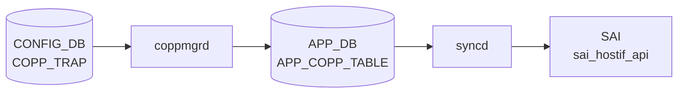

# COPP_TRAP テーブル

## 概要

[CoPP](../../reference/glossary.md#term-copp) の trap エントリを定義し、[SAI](../../reference/glossary.md#term-sai) hostif trap ID 群を `COPP_GROUP` に束ねる。各 trap は `trap_ids` フィールドにカンマ区切り識別子 (`bgp`、`lldp`、`arp_req` など) を列挙し、`trap_group` で `COPP_GROUP` に紐付ける[^1]。`coppmgr` が両テーブルを結合し [APPL_DB](../../reference/glossary.md#term-appl_db) の `COPP_TABLE` に書く。

<!-- cdb-mermaid -->
### データフロー (自動生成)



!!! note "凡例"
    CONFIG_DB から SAI までの典型経路を `docs/reference/config-db-orch-map.md` から機械生成したミニ図。詳細・例外は本ページ本文と対応表を参照。
<!-- /cdb-mermaid -->

## key 構造

```text
COPP_TRAP|<name>
```

## 主要フィールド

| フィールド | 型 | 必須 | 既定 | 説明 |
|-----------|----|------|------|------|
| `trap_ids` | string | yes | - | カンマ区切り trap 識別子。例: `bgp,bgpv6` |
| `trap_group` | leafref `COPP_GROUP.name` | no | - | 適用する [CoPP](../../reference/glossary.md#term-copp) group |
| `always_enabled` | boolean | no | - | true なら feature の有効/無効に関わらず常時インストール |

## 動作上の注意

- `always_enabled = true` のエントリ (例: [BGP](../../reference/glossary.md#term-bgp) / [LLDP](../../reference/glossary.md#term-lldp) のシステム必須 trap) はユーザの `config feature state` 操作と独立にインストールされる
- 既定の `COPP_TRAP` 群は `dockers/docker-orchagent/copp_cfg.j2` および `files/image_config/copp/copp_cfg.j2` 由来でビルド時に生成される

<!-- cdb-exceptions -->
## 例外条件・特殊挙動

- **NAT trap_id → NAT 非対応時 ignore**: スイッチが NAT 非対応 (`gIsNatSupported == false`) の場合、`SNAT_MISS` / `DNAT_MISS` の trap_id は `SWSS_LOG_NOTICE("Ignoring the trap_id: %s, as NAT is not supported")` を出力してスキップされる。<!-- evidence: copporch.cpp L400-406 -->
- **SAI 非対応 trap_id → ignore**: `isTrapIdSupported()` が false の場合 `SWSS_LOG_NOTICE("Ignoring the trap_id: %s, since not supported by vendor SAI")` を出力してスキップ。ベンダー SAI が実装していない trap は適用されない。<!-- evidence: copporch.cpp L408-413 -->
- **COPP_GROUP 未到着時の trap_group 参照 → 書き込み保留**: `trap_group` に指定したグループが pending の場合、`coppmgr` は APPL_DB への書き込みを保留し COPP_GROUP 到着後に再処理する。<!-- evidence: coppmgr.cpp L62-81 checkTrapGroupPending -->
- **feature 無効な trap_id → COPP_TABLE から除外**: feature が off の trap_id は `isTrapIdDisabled()` で除外される。trap_group の trap_ids が空になった場合は APPL_DB エントリを削除。<!-- evidence: coppmgr.cpp L173-191 isTrapIdDisabled -->
- **task_failed → プロセス終了**: `CoppOrch` は `task_failed` が返った場合プロセスを終了する。<!-- evidence: copporch.cpp L922 -->

<!-- value-behavior -->
## 値依存挙動マトリクス

| フィールド | 値 | 挙動 |
|-----------|-----|------|
| `always_enabled` | `true` | `coppmgr` が feature の有効/無効に関わらず trap を APPL_DB に書き込む（`coppmgr.cpp:90`）。`config feature state <feature> disabled` を実行しても trap はアクティブのまま。BGP / LLDP など必須プロトコルに使用。 |
| `always_enabled` | `false` / 未設定 | feature が enabled のときのみ trap をインストール。feature が disabled になると trap が削除される。 |
| `trap_ids` | 有効な trap_id（例: `bgp`） | `CoppOrch` が `trap_id_map` で SAI hostif trap type に変換してインストール。 |
| `trap_ids` | 未知の trap_id | `CoppOrch` の `trap_id_map.at()` が例外を投げ、当該エントリ全体が適用されない（サイレント失敗）。 |
| `trap_ids` | プラットフォーム SAI 非対応の trap_id | `isTrapIdSupported()=false` で個別 trap がスキップ（NOTICE ログのみ）（`copporch.cpp:408-413`）。他の trap_id は継続適用。 |
| `trap_ids` | `snat_miss` / `dnat_miss` | NAT 非対応スイッチ（`gIsNatSupported=false`）ではスキップ（NOTICE ログ）（`copporch.cpp:400-406`）。 |
<!-- /value-behavior -->

## 購読者

- `coppmgr`: [CONFIG_DB](../../reference/glossary.md#term-config_db) → [APPL_DB](../../reference/glossary.md#term-appl_db) `COPP_TABLE`
- `orchagent` `CoppOrch`: [SAI](../../reference/glossary.md#term-sai) HOSTIF_TRAP オブジェクト生成

## 関連 CONFIG_DB / YANG / CLI

- 関連 [CONFIG_DB](../../reference/glossary.md#term-config_db): `COPP_GROUP`、`FEATURE`
- 関連 CLI: `config copp`、`show copp`
- 関連 [YANG](../../reference/glossary.md#term-yang): `sonic-copp`

<!-- ref-triangle:start -->

## 関連リファレンス

- [YANG](../../reference/glossary.md#term-yang): [`sonic-copp`](../yang/sonic-copp.md)
- CLI: `config copp`

<!-- ref-triangle:end -->

## 引用元

[^1]: [YANG](../../reference/glossary.md#term-yang) 定義: `sonic-copp.yang`. <https://github.com/sonic-net/sonic-buildimage/blob/9ea932ec2e18f35e58268ec2e4456b1d4afd65cd/src/sonic-yang-models/yang-models/sonic-copp.yang>

<!-- topics-back-ref -->
## 関連 Topics

- [Topics: ACL / CoPP / Mirror / Packet Action](../../topics/07-acl-copp-mirror/index.md)

<!-- /topics-back-ref -->

<!-- ops-hint -->
## 運用ヒント

### 典型値

- key 形式: `COPP_TRAP|<trap-name>` (`bgp`, `lldp`, `arp` 等)。
- `trap_ids`: `bgp,bgpv6` 等のカンマ区切り。
- `trap_group`: 紐付ける `COPP_GROUP` 名。

### よくある誤設定

- 存在しない `trap_group` を参照すると copporch が trap を install しない。
- `trap_ids` のスペル違いは silently 無視され該当トラフィックが CPU に上がらない。

### 確認コマンド

```bash
sonic-db-cli CONFIG_DB keys 'COPP_TRAP|*'
show copp config
```
<!-- /ops-hint -->


<!-- runtime-trace -->
## 実コンテナ動作トレース

### 段階 1 — Consumer 登録

`coppmgrd` → `CoppOrch` (APPL_DB 経由) が CONFIG_DB の `COPP_TRAP` テーブルを購読する。

`COPP_TRAP` の key はトラップ名 (例: `bgp`, `arp_req`, `lldp`)。`COPP_GROUP` を `trap_group` フィールドで参照。

### 段階 2 — CFG→APPL 翻訳

`APP_COPP_TABLE` に書き込み

### 段階 3 — APPL→SAI

`sai_hostif_api` — `sai_create_hostif_trap` でトラップ (BGP/ARP/OSPF 等) を作成/更新

### 段階 4 — タイミングと副作用

**適用タイミング**: CONFIG_DB 変化を `coppmgrd` が検知後 APPL_DB に書き込み。`CoppOrch` が SAI hostif trap を更新。`FEATURE` テーブルの state により一部トラップが有効化される。

**副作用**: トラップの `trap_action` 変更 (`drop`/`trap`/`copy`) は直ちに該当プロトコルの CPU 転送動作に影響。`OSPF` トラップ無効化で routing protocol が停止する可能性。
<!-- /runtime-trace -->

<!-- entry-points -->
## 書き込み入り口 (Direction A)

対象テーブル: `COPP_TRAP`

### CLI
- `config copp trap add/del <trap-name> ...`
  - ソース: `sonic-utilities/config/main.py (copp グループ)`

### minigraph / sonic-cfggen
- なし

### REST / gNMI (sonic-mgmt-common)
- なし (対応 OpenConfig/SONiC YANG transformer なし)

### db_migrator
- なし

### ビルド時デフォルト (init_cfg / j2 テンプレート)
- `copp_cfg.j2` が `sonic-cfggen` 経由でデフォルトトラップセットを生成

### ハードコードデフォルト
- なし

### ランタイム注入 (デーモン自動書き込み)
- なし
<!-- /entry-points -->


<!-- derivation -->
## 派生・条件付き登録 (Phase 6/7)

### Phase 6: 値による他フィールド自動派生

| 条件 | 派生先 | evidence |
|---|---|---|
| COPP_TRAP は `copp_cfg.json` からロードされ、minigraph/init_cfg.json.j2 では生成されない | — | `/etc/sonic/copp_cfg.json` 参照 |
| 派生なし | — | — |

### Phase 7: 条件付き module/manager 登録

| 条件 | 登録 module | evidence |
|---|---|---|
| 常時（条件なし） | `CoppOrch` が `COPP_TRAP` を `doTask` で購読 | `sonic-swss/orchagent/copporch.cpp:880` |

### grep カバレッジ

- copporch.cpp L880: COPP_TRAP を含む doTask ディスパッチ
<!-- /derivation -->
<!-- handler-branching -->
### Phase 8: Handler メソッド内分岐

| Manager / Handler | メソッド | 分岐条件 | 効果 | evidence |
|---|---|---|---|---|
| `CoppOrch` | `doTask()` | `table_name == CFG_COPP_TRAP_TABLE_NAME`（COPP_TRAP テーブル） | `processCoppTrap()` を呼び出し（COPP_GROUP と別パス） | `sonic-swss/orchagent/copporch.cpp:880-935` |
| `CoppOrch` | `processCoppTrap()` | `trap_id` が `snat_miss` / `dnat_miss` かつ NAT が無効 | SAI ホストインターフェーストラップ作成をスキップ | `sonic-swss/orchagent/copporch.cpp:401-404` |
| `CoppOrch` | `processCoppTrap()` | `trap_group` が `m_trap_group_map` に未存在 | `task_need_retry`（グループ未作成ガード） | `sonic-swss/orchagent/copporch.cpp:584` |
| `CoppOrch` | `processCoppTrap()` | `op == DEL_COMMAND` | SAI トラップを削除しグループからアンバインド | `sonic-swss/orchagent/copporch.cpp:1102` |

> **スキャン証跡**: `doTask` L880-935 + `processCoppTrap` L1164-1200 全行読了。4 件分岐抽出。
<!-- /handler-branching -->

<!-- ordering -->
## 書込み順依存 (Phase B)

### 強制先行条件

| 順序 | 先行リソース | 後続 | 違反時の挙動 | evidence |
|------|-------------|------|-------------|---------|
| 1 | `PORT` 初期化完了（`allPortsReady()`） | COPP_TRAP の SAI 適用 | `CoppOrch::doTask()` が即 return。CONFIG_DB エントリはキューに保留され、ポート初期化完了後に一括処理 | `copporch.cpp:885` |
| 2 | `COPP_GROUP|<name>` が CONFIG_DB に存在・処理済み | `COPP_TRAP` の APPL_DB 書き込み | `CoppMgr` が書き込みを保留（`checkTrapGroupPending`）、`CoppOrch` が `task_need_retry` を返して次ループで再試行 | `coppmgr.cpp:62-79`, `copporch.cpp:584` |

### 推奨先行条件

| 順序 | 先行リソース | 後続 | 理由 | evidence |
|------|-------------|------|------|---------|
| 3 | `FEATURE|<name> state=enabled` | `always_enabled=false` の COPP_TRAP | feature 未存在だと `isTrapIdDisabled()=true` となり trap がインストールされない。後から feature を有効化すれば `doFeatureTask` で自動補完される | `coppmgr.cpp:90`, `coppmgr.cpp:173-191` |
| 4 | COPP_TRAP の書き込み | COPP_GROUP の書き込み | コンストラクタ内で COPP_TRAP 処理（`m_coppTrapIdTrapGroupMap` 構築）が COPP_GROUP の APPL_DB 書き込みより先に実行されるため、逆順だと COPP_GROUP の `trap_ids` が空になる | `coppmgr.cpp:334-411` |

### 特殊シーケンス

| 操作 | 推奨順序 | 根拠 |
|------|---------|------|
| `trap_group` 変更 | DEL → SET | SET 単体でも動作するが、旧グループの `trap_ids` 更新処理に変数代入の順序上の懸念があるため DEL → SET が確実。`coppmgr.cpp:706-738` |
| init_cfg 由来エントリの削除 | DEL は完全削除にならない | DEL コマンド後、`m_coppTrapInitCfg` に当該 key が存在する場合は init 値で自動復元される。`coppmgr.cpp:769-805` |
| NULL フィールド SET による削除 | NULL SET → 通常 SET | NULL フィールドを含む SET は削除として機能する。再追加には別途通常 SET が必要。`coppmgr.cpp:580-595` |

<!-- /ordering -->
<!-- defaults -->
## フィールド暗黙デフォルト (Phase A)

### 検出種類の凡例

| 記号 | 意味 |
|------|------|
| IF | init cfg フォールバック |
| AR | 暗黙 reset on DEL |
| PD | 前提条件依存 |
| ID | 暗黙デフォルト値 |
| CS | 大文字小文字制約 |

### `trap_ids`

- **YANG default**: なし (`mandatory true`)
- **実装上の挙動 [IF, AR]**: `coppmgr` は起動時に `/etc/sonic/copp_cfg.json`（`copp_cfg.j2` 由来）を読み込み `m_coppTrapInitCfg` に保持する。ユーザーが `COPP_TRAP|<name>` を CONFIG_DB から DELETE しても、init cfg に同名エントリが存在すれば init 値でトラップを自動再登録する（実質「ユーザー設定削除 = init 値リセット」）。<!-- evidence: coppmgr.cpp L773-805 -->
- **SET 時・不完全設定のスキップ [PD]**: `trap_ids` が空かつ `trap_group` も空の SET は incomplete configuration として処理スキップ（no-op）。<!-- evidence: coppmgr.cpp L609-615 -->

### `trap_group`

- **YANG default**: なし (optional leafref)
- **GROUP 未到着時の書き込み保留 [PD]**: 参照先 `COPP_GROUP` が未作成の場合、`coppmgr` は APPL_DB への書き込みを保留し、GROUP 作成後に再処理する（`checkTrapGroupPending()` が true の間は書き込みなし）。<!-- evidence: coppmgr.cpp L62-79, copporch.cpp L584 -->
- **暗黙 reset on DEL [AR]**: DELETE 後に init cfg の同名エントリが存在すれば `trap_group` も init 値に自動復元。<!-- evidence: coppmgr.cpp L777-802 -->

### `always_enabled`

- **YANG default**: なし (optional boolean)
- **未設定 = `"false"` [ID]**: フィールドが存在しない場合、`coppmgr` 初期化コードは `is_always_enabled = "false"` として扱う。feature の有効/無効に応じてトラップのインストール可否が決まる通常動作となる。<!-- evidence: coppmgr.cpp L340, L354-357 -->
- **DELETE 後の復元時も `"false"` [ID, AR]**: init cfg 側に `always_enabled` が存在しない場合、DELETE 後の自動復元でも `"false"` が補完される。<!-- evidence: coppmgr.cpp L792-795 -->
- **大文字小文字制約 [CS]**: 実装は文字列比較 (`== "true"`)。YANG boolean 型であっても `"True"` / `"TRUE"` は `"false"` として扱われる（サイレント誤動作）。<!-- evidence: coppmgr.cpp L90, L183 -->

### マージ優先度（書き込み順依存）

`mergeConfig()` は init cfg を基底として user cfg フィールドで上書きする。同一フィールドが user cfg に存在すれば user 値優先、存在しないフィールドのみ init 値が補完される。`NULL` フィールドを持つ key は init 側もスキップ（無効化）される。<!-- evidence: coppmgr.cpp L196-258 -->

<!-- /defaults -->

<!-- cross-refs -->
## 暗黙参照テーブル (Phase C)

`COPP_TRAP` エントリが処理される際に `coppmgr` / `CoppOrch` が暗黙的に参照する
他テーブルを示す。YANG の `leafref` として定義された `trap_group` に加え、
コードのみで表現された依存がある。

| 参照元フィールド | 参照先テーブル | 参照先キー形式 | 依存内容 | 証跡 |
|---|---|---|---|---|
| `trap_group` | [`COPP_GROUP`](./copp-group.md) | `COPP_GROUP\|<name>` | グループ未登録の場合 `coppmgr` は APPL_DB 書き込みを保留。`CoppOrch` は `task_need_retry` を返して再試行 | `coppmgr.cpp:62-79`, `copporch.cpp:584` |
| `trap_ids` (各 trap_id) | [`FEATURE`](./feature.md) | `FEATURE\|<feature-name>` | feature の `state=disabled` の場合、対応 trap_id を APPL_DB から除外（`always_enabled=false` のみ対象） | `coppmgr.cpp:173-191` |
| `always_enabled` | [`FEATURE`](./feature.md) | `FEATURE\|<feature-name>` | `true` の場合は feature state に関わらず常時インストール。未設定は `false` 扱い | `coppmgr.cpp:90` |

### 解決タイミング

- **COPP_GROUP**: SET 処理時に即座に参照確認。未解決は保留キューで管理され、GROUP 登録後に `doTask` 再実行で解消する。
- **FEATURE**: `doFeatureTask()` が FEATURE テーブルの変化を購読し、state 変更のたびに影響する COPP_TRAP を再評価・再書き込みする。

### init_cfg 由来の暗黙初期化

`coppmgr` は起動時に `/etc/sonic/copp_cfg.json`（`files/image_config/copp/copp_cfg.j2` の展開物）を
読み込み、`COPP_TRAP` と `COPP_GROUP` の初期セットを `m_coppTrapInitCfg` / `m_coppGroupInitCfg` に保持する。
ユーザーが CONFIG_DB から DEL した場合も、init cfg に同名キーがあれば init 値で自動復元される（実質「DEL = init リセット」）。`coppmgr.cpp:773-805`

- 既定エントリ例: `bgp` → `trap_ids: bgp,bgpv6` / `trap_group: queue4_group1`
- `always_enabled=true` の例: `lacp`、`arp`、`udld`、`ip2me`、`neighbor_miss`
<!-- /cross-refs -->

<!-- failure -->
## 失敗挙動マトリクス (Phase D)

ソース: `sonic-net/sonic-swss/orchagent/copporch.cpp`・`cfgmgr/coppmgr.cpp`

### SET 処理

| 失敗条件 | 結果 | evidence |
|---|---|---|
| 未知の `trap_id` 文字列 (`trap_id_map.at()` が `out_of_range` 例外) | ERROR ログ → `task_invalid_entry` → エントリ破棄（恒久スキップ）、ループ継続 | `copporch.cpp:900-903` |
| `getAttribsFromTrapGroup()` が false（不明フィールド等） | `task_invalid_entry` → 即時エントリ破棄 | `copporch.cpp:749-753` |
| SAI `create_hostif_trap_group` 失敗 | ERROR ログ → `handleSaiCreateStatus()` 結果次第: `task_failed` → ループ中断、`task_need_retry` → リトライ | `copporch.cpp:780-788` |
| SAI `create_hostif_trap` 失敗 | ERROR ログ → `parseHandleSaiStatusFailure()` → `task_failed` 伝播 → ループ中断 | `copporch.cpp:516-523` |
| ポリサー作成失敗 (`trapGroupUpdatePolicer()` = false) | `task_failed` → `"Processing copp task item failed, exiting."` → ループ中断 | `copporch.cpp:796-800, 920-923` |
| Genetlink hostif 重複作成 | ERROR ログ → `task_failed` → ループ中断 | `copporch.cpp:835-840` |
| `trapGroupProcessTrapIdChange()` 失敗 | `task_failed` → ループ中断 | `copporch.cpp:853-856` |
| NAT 非対応時の `snat_miss`/`dnat_miss` | NOTICE ログ → 当該 trap_id のみ `continue` スキップ（他は継続） | `copporch.cpp:401-406` |
| SAI 非対応 trap_id (`isTrapIdSupported()=false`) | NOTICE ログ → 当該 trap_id のみスキップ（他は継続） | `copporch.cpp:408-413` |

### DEL 処理

| 失敗条件 | 結果 | evidence |
|---|---|---|
| default trap group の削除試行 | WARN ログ → `task_ignore` → エントリ破棄（サイレント無視） | `copporch.cpp:861-865` |
| `processTrapGroupDel()` 失敗 (SAI 削除失敗等) | `task_failed` → ループ中断 | `copporch.cpp:867-870` |

### coppmgr 側

| 失敗条件 | 結果 | evidence |
|---|---|---|
| init cfg (`copp_cfg.json`) が不在 | ERROR ログ → `return`（デフォルトトラップなしで起動継続） | `coppmgr.cpp:26-30` |
| `trap_group` / `trap_ids` ともに空かつ `always_enabled` も空 | 不完全設定として `erase(it)` → スキップ | `coppmgr.cpp:609-615` |

### task_failed の影響範囲

`task_failed` は `doTask()` でループを即時 `return` して中断する。プロセス強制終了はしないが、未処理エントリは次の `doTask()` 呼び出しまで停止する。`task_invalid_entry` は `erase(it)` のみでループ継続。

<!-- /failure -->

<!-- glossary-links-injected: 7a3847939b09 -->
