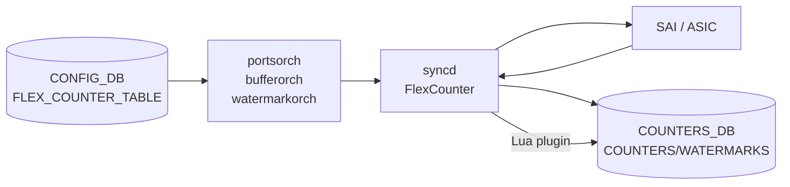

# COUNTERS_DB バッファ / ウォーターマーク カウンタ

## 概要

[portsorch](../../reference/glossary.md#term-portsorch)（[orchagent](../../reference/glossary.md#term-orchagent) 内）および `bufferorch`・`watermarkorch` が [SAI](../../reference/glossary.md#term-sai) の flex counter 機構を通じて Queue / Priority Group (PG) / Buffer Pool ごとに収集するバッファ統計カウンタ群[^1]。

- **Queue カウンタ**: パケット数・バイト数・ドロップ数を `COUNTERS:<oid>` に格納
- **Queue ウォーターマーク**: 共有バッファ最大占有量 (bytes) を `COUNTERS/<PERIODIC/PERSISTENT/USER_WATERMARKS:<oid>` に格納
- **PG ウォーターマーク**: shared / xoff headroom の最大占有量を同テーブルに格納
- **PG ドロップカウンタ**: PG ごとのドロップパケット数を `COUNTERS:<oid>` に格納
- **Port バッファドロップ**: ポート単位 in/out バッファドロップ数を `COUNTERS:<oid>` に格納
- **Buffer Pool ウォーターマーク**: プール単位の最大占有量を `USER/PERSISTENT/PERIODIC_WATERMARKS:<oid>` に格納

<!-- cdb-mermaid -->
### データフロー (自動生成)



!!! note "凡例"
    `FLEX_COUNTER_TABLE|QUEUE_WATERMARK` / `PG_WATERMARK` / `PORT_BUFFER_DROP` 等が `enable` になると、portsorch / bufferorch が SAI カウンタ ID リストを syncd へ投入し、syncd が定周期でポーリングして COUNTERS_DB を更新する。ウォーターマークは Lua plugin が max 集計して PERIODIC/PERSISTENT/USER_WATERMARKS テーブルへ書き込む。

<!-- /cdb-mermaid -->

## key 構造

### Queue カウンタ

```text
COUNTERS_DB / COUNTERS_QUEUE_NAME_MAP   (Hash)
  field: <port_name>:<queue_index>        (例: Ethernet0:0)
  value: <SAI OID>

COUNTERS_DB / COUNTERS:<oid>            (Hash)
  field: <SAI_QUEUE_STAT_*>
  value: <uint64 値 (文字列)>
```

### Priority Group カウンタ / ウォーターマーク

```text
COUNTERS_DB / COUNTERS_PG_NAME_MAP      (Hash)
  field: <port_name>:<pg_index>
  value: <SAI OID>

COUNTERS_DB / COUNTERS:<oid>            (Hash — PG ドロップ)
  field: SAI_INGRESS_PRIORITY_GROUP_STAT_DROPPED_PACKETS
  value: <uint64>

COUNTERS_DB / PERIODIC_WATERMARKS:<oid>
COUNTERS_DB / PERSISTENT_WATERMARKS:<oid>
COUNTERS_DB / USER_WATERMARKS:<oid>     (Hash — PG ウォーターマーク)
  field: SAI_INGRESS_PRIORITY_GROUP_STAT_SHARED_WATERMARK_BYTES
  field: SAI_INGRESS_PRIORITY_GROUP_STAT_XOFF_ROOM_WATERMARK_BYTES
  value: <uint64 bytes>
```

### Buffer Pool ウォーターマーク

```text
COUNTERS_DB / USER_WATERMARKS:<oid>
COUNTERS_DB / PERSISTENT_WATERMARKS:<oid>
COUNTERS_DB / PERIODIC_WATERMARKS:<oid>  (Hash — Buffer Pool ウォーターマーク)
  field: SAI_BUFFER_POOL_STAT_WATERMARK_BYTES
  field: SAI_BUFFER_POOL_STAT_XOFF_ROOM_WATERMARK_BYTES
  value: <uint64 bytes>
```

## フィールド一覧

### Queue カウンタ (`QUEUE_STAT_COUNTER` グループ)[^2]

| SAI フィールド | 意味 |
|---------------|------|
| `SAI_QUEUE_STAT_PACKETS` | 送信パケット数 |
| `SAI_QUEUE_STAT_BYTES` | 送信バイト数 |
| `SAI_QUEUE_STAT_DROPPED_PACKETS` | ドロップパケット数 |
| `SAI_QUEUE_STAT_DROPPED_BYTES` | ドロップバイト数 |
| `SAI_QUEUE_STAT_TRIM_PACKETS` | トリムパケット数 |
| `SAI_QUEUE_STAT_DROPPED_TRIM_PACKETS` | トリムドロップパケット数 |
| `SAI_QUEUE_STAT_TX_TRIM_PACKETS` | トリム送信パケット数 |

VoQ (Virtual Output Queue) 環境では追加で:

| SAI フィールド | 意味 |
|---------------|------|
| `SAI_QUEUE_STAT_CREDIT_WD_DELETED_PACKETS` | Credit Watchdog 削除パケット数 |

WRED 対応 ASIC の場合 (`WRED_ECN_QUEUE_STAT_COUNTER` グループ):

| SAI フィールド | 意味 |
|---------------|------|
| `SAI_QUEUE_STAT_WRED_ECN_MARKED_PACKETS` | WRED ECN マークパケット数 |
| `SAI_QUEUE_STAT_WRED_ECN_MARKED_BYTES` | WRED ECN マークバイト数 |
| `SAI_QUEUE_STAT_WRED_DROPPED_PACKETS` | WRED ドロップパケット数 |
| `SAI_QUEUE_STAT_WRED_DROPPED_BYTES` | WRED ドロップバイト数 |

### Queue ウォーターマーク (`QUEUE_WATERMARK_STAT_COUNTER` グループ)

| SAI フィールド | 意味 |
|---------------|------|
| `SAI_QUEUE_STAT_SHARED_WATERMARK_BYTES` | 共有バッファ最大占有量 (bytes) |

### Priority Group ウォーターマーク (`PG_WATERMARK_STAT_COUNTER` グループ)

| SAI フィールド | 意味 |
|---------------|------|
| `SAI_INGRESS_PRIORITY_GROUP_STAT_XOFF_ROOM_WATERMARK_BYTES` | ヘッドルーム (xoff room) 最大占有量 |
| `SAI_INGRESS_PRIORITY_GROUP_STAT_SHARED_WATERMARK_BYTES` | 共有バッファ最大占有量 |

### Priority Group ドロップカウンタ (`PG_DROP_STAT_COUNTER` グループ)

| SAI フィールド | 意味 |
|---------------|------|
| `SAI_INGRESS_PRIORITY_GROUP_STAT_DROPPED_PACKETS` | PG 受信ドロップパケット数 |

### Port バッファドロップカウンタ (`PORT_BUFFER_DROP_STAT` グループ)

| SAI フィールド | 意味 |
|---------------|------|
| `SAI_PORT_STAT_IN_DROPPED_PKTS` | 受信バッファドロップパケット数 |
| `SAI_PORT_STAT_OUT_DROPPED_PKTS` | 送信バッファドロップパケット数 |

### Buffer Pool ウォーターマーク (`BUFFER_POOL_WATERMARK_STAT_COUNTER` グループ)

| SAI フィールド | 意味 |
|---------------|------|
| `SAI_BUFFER_POOL_STAT_WATERMARK_BYTES` | プール共有バッファ最大占有量 (bytes) |
| `SAI_BUFFER_POOL_STAT_XOFF_ROOM_WATERMARK_BYTES` | プールヘッドルーム最大占有量 |

## ウォーターマーク Lua plugin の動作

`watermark_pg.lua` / `watermark_queue.lua` / `watermark_bufferpool.lua` が syncd の flex counter エンジンから定周期で呼び出され、`COUNTERS:<oid>` の瞬時値と各ウォーターマークテーブルの既存値を比較して `max()` を書き込む[^3]。

| テーブル | 意味 | クリア方法 |
|---------|------|----------|
| `PERIODIC_WATERMARKS` | 定周期 (`DEFAULT_TELEMETRY_INTERVAL = 120s`) でゼロリセット | タイマー (`WM_TELEMETRY_TIMER`) |
| `PERSISTENT_WATERMARKS` | リブートまたは明示的クリア要求まで保持 | `WATERMARK_CLEAR_REQUEST` notification (`op=PERSISTENT`) |
| `USER_WATERMARKS` | ユーザーが `sonic-clear` で個別リセット | `WATERMARK_CLEAR_REQUEST` notification (`op=USER`) |

クリア操作はフィールドを `"0"` に設定する (`clearSingleWm` — `watermarkorch.cpp:329`)[^4]。

## 書き込み経路

| 経路 | 対象テーブル | 詳細 |
|------|------------|------|
| portsorch 初期化 | `COUNTERS_QUEUE_NAME_MAP`, `COUNTERS_PG_NAME_MAP` | 名前→OID マッピング書き込み |
| syncd FlexCounter (QUEUE_STAT) | `COUNTERS:<oid>` | Queue 統計を 10000ms ごとにポーリング |
| syncd FlexCounter (PG_DROP) | `COUNTERS:<oid>` | PG ドロップを 10000ms ごとにポーリング |
| syncd FlexCounter (PORT_BUFFER_DROP) | `COUNTERS:<oid>` | Port バッファドロップを 60000ms ごとにポーリング |
| syncd + Lua (QUEUE_WATERMARK) | `*_WATERMARKS:<oid>` | Queue WM を 60000ms ごとに max 集計 |
| syncd + Lua (PG_WATERMARK) | `*_WATERMARKS:<oid>` | PG WM を 60000ms ごとに max 集計 |
| bufferorch + Lua (BUFFER_POOL_WATERMARK) | `*_WATERMARKS:<oid>` | Buffer Pool WM を 60000ms ごとに max 集計 |
| watermarkorch timer | `PERIODIC_WATERMARKS` | 120s 周期でゼロリセット |

## 関連 CONFIG_DB / CLI

- CONFIG_DB: `FLEX_COUNTER_TABLE` — グループ別有効化と間隔設定
- CONFIG_DB: `BUFFER_POOL`, `BUFFER_PG`, `BUFFER_QUEUE` — バッファ設定
- CLI: `show queue counters`, `show priority-group watermark`, `show buffer pool watermark`
- CLI: `counterpoll queue enable/disable`, `counterpoll pg-watermark enable/disable`
- CLI: `sonic-clear queue counters`, `sonic-clear priority-group drop counters`

<!-- defaults -->
## 暗黙デフォルト・コード由来挙動 (Phase A)

<!-- evidence: sonic-swss/orchagent/portsorch.cpp, portsorch.h,
     bufferorch.cpp, bufferorch.h,
     watermarkorch.cpp, watermarkorch.h,
     watermark_pg.lua, watermark_queue.lua, watermark_bufferpool.lua -->

### ポーリング間隔のコード由来デフォルト

各バッファカウンタグループの polling interval は `portsorch.cpp` / `portsorch.h` / `bufferorch.h` にハードコードされており、`FLEX_COUNTER_TABLE` の `POLL_INTERVAL` が未設定の場合この値が syncd に投入される[^5]。

| カウンタグループ | ハードコード定数 / 定義箇所 | デフォルト値 |
|----------------|--------------------------|------------|
| `QUEUE_STAT_COUNTER` | `QUEUE_STAT_FLEX_COUNTER_POLLING_INTERVAL_MS` (portsorch.cpp:90) | **10000 ms** |
| `QUEUE_WATERMARK_STAT_COUNTER` | `QUEUE_WATERMARK_STAT_FLEX_COUNTER_POLLING_INTERVAL_MS` (portsorch.cpp:91) | **60000 ms** |
| `PG_WATERMARK_STAT_COUNTER` | `PG_WATERMARK_STAT_FLEX_COUNTER_POLLING_INTERVAL_MS` (portsorch.cpp:92) / `PG_WATERMARK_FLEX_STAT_COUNTER_POLL_MSECS` (portsorch.h:39) = `"60000"` | **60000 ms** |
| `PG_DROP_STAT_COUNTER` | `PG_DROP_STAT_FLEX_COUNTER_POLLING_INTERVAL_MS` (portsorch.cpp:93) / `PG_DROP_FLEX_STAT_COUNTER_POLL_MSECS` (portsorch.h:40) = `"10000"` | **10000 ms** |
| `PORT_BUFFER_DROP_STAT` | `PORT_BUFFER_DROP_STAT_POLLING_INTERVAL_MS` (portsorch.cpp:88) | **60000 ms** |
| `BUFFER_POOL_WATERMARK_STAT_COUNTER` | `BUFFER_POOL_WATERMARK_FLEX_STAT_COUNTER_POLL_MSECS` (bufferorch.h:16) = `"60000"` | **60000 ms** |
| `WRED_ECN_QUEUE_STAT_COUNTER` | `QUEUE_STAT_FLEX_COUNTER_POLLING_INTERVAL_MS` と同値 (portsorch.cpp:739) | **10000 ms** |

### StatsMode: READ vs READ_AND_CLEAR

ウォーターマーク系グループは `StatsMode::READ_AND_CLEAR` で初期化されており、syncd が SAI からカウンタ値を読み取った後、直ちに SAI ハードウェアカウンタをゼロリセットする[^6]。

| グループ | StatsMode | 意味 |
|---------|----------|------|
| `QUEUE_WATERMARK_STAT_COUNTER` | `READ_AND_CLEAR` | SAI 読取後に HW カウンタをリセット。Lua が max 値を保持 |
| `PG_WATERMARK_STAT_COUNTER` | `READ_AND_CLEAR` | 同上 |
| `BUFFER_POOL_WATERMARK_STAT_COUNTER` | 条件付き READ_AND_CLEAR | `clear_buffer_pool_stats` SAI API で個別クリア。未対応プールは READ のみ |
| `QUEUE_STAT_COUNTER` | `READ` | リセットなし。累積カウンタ |
| `PG_DROP_STAT_COUNTER` | `READ` | リセットなし。累積カウンタ |
| `PORT_BUFFER_DROP_STAT` | `READ` | リセットなし。累積カウンタ |

!!! warning "BUFFER_POOL のクリア能力差異"
    `bufferorch.cpp:318-324` で各プールに対して `sai_buffer_api->clear_buffer_pool_stats()` を試み、`SAI_STATUS_NOT_SUPPORTED` が返った場合は当該プールの clear フラグをオフにして READ のみに切り替える。能力確認に失敗したプールはウォーターマークが単調増加し続ける。

### 定周期クリアのデフォルト間隔

`WatermarkOrch` のテレメトリタイマー初期値は `DEFAULT_TELEMETRY_INTERVAL = 120` 秒 (`watermarkorch.cpp:9`) にハードコードされている。`WATERMARK_TABLE|TELEMETRY_INTERVAL` で上書き可能だが、CONFIG_DB 未設定の場合は **120 秒**が実効値になる[^7]。

| 種類 | 詳細 |
|------|------|
| ハードコードデフォルト | `DEFAULT_TELEMETRY_INTERVAL = 120` (watermarkorch.cpp:9) |
| 上書き方法 | `CONFIG_DB` `WATERMARK_TABLE|TELEMETRY_INTERVAL: {interval: <秒>}` |
| 乖離 | YANG / CLI に `default` 宣言なし。counterpoll では "120" と表示するが orchagent ハードコード由来 |

### ウォーターマーク Lua plugin の暗黙 max 初期値

`watermark_pg.lua` / `watermark_queue.lua` は PERIODIC/PERSISTENT/USER テーブルの既存値が `nil` の場合、`math.max()` 比較をスキップして SAI から読んだ最新値をそのまま書き込む（初回は常に実測値が最大値になる）[^8]。

```lua
-- watermark_pg.lua:36
redis.call('HSET', ..., periodic_shared_wm and math.max(...) or pg_shared_wm)
```

つまり **テーブルエントリが存在しない場合は nil チェックが fallback として機能し、最初の測定値が初期ウォーターマークになる**。クリア後は `"0"` が書かれ、次の Lua 実行で max(実測値, 0) が新たなウォーターマークになる。

### WRED Queue カウンタの SAI 能力ガード

`portsorch.cpp:1882-1909` で `sai_query_stats_capability()` を呼び出し、ASIC が対応する SAI_QUEUE_STAT_WRED_* を確認する。未対応フィールドは `wred_queue_stat_ids` から除外されて syncd へ投入されない。能力照会自体が失敗した場合 (`SAI_STATUS_NOT_SUPPORTED`) は全 WRED フィールドをスキップする[^9]。

### PG ウォーターマークの登録タイミング依存

`pg_watermark_manager.setCounterIdList()` は `enablePriorityGroupWatermarkStats()` が呼ばれるたびに実行される (`portsorch.cpp:9051`)。`FLEX_COUNTER_TABLE|PG_WATERMARK` の `FLEX_COUNTER_STATUS = enable` を受信した時点で全ポートが `allPortsReady()` でなければ `doTask` が早期 return し、ポート ready 後に再適用される（書き込み順依存の遅延がある）。

### Buffer Pool ウォーターマーク: bufferorch 初期化シーケンス

`bufferorch.cpp:234-244` で `watermark_bufferpool.lua` を `BUFFER_POOL_WATERMARK_STAT_COUNTER` に登録する。登録に失敗した場合は `runtime_error` をキャッチして `LOG_ERROR` を出力し続行する（クラッシュしない）。プール OID が未生成の状態でも登録コードは実行されるが、実際のポーリングはプール OID がある場合のみ機能する。

### 書き込み経路別 polling interval 早見表

| グループ | FLEX_COUNTER_TABLE キー | コード由来デフォルト | CLI counterpoll デフォルト |
|---------|----------------------|-------------------|--------------------------|
| Queue Stats | `QUEUE_STAT_COUNTER` | 10000 ms | 10000 ms (一致) |
| Queue WM | `QUEUE_WATERMARK` | 60000 ms | 60000 ms (一致) |
| PG WM | `PG_WATERMARK` | 60000 ms | 60000 ms (一致) |
| PG Drop | `PG_DROP` | 10000 ms | 10000 ms (一致) |
| Port Buffer Drop | `PORT_BUFFER_DROP` | 60000 ms | 60000 ms (一致) |
| Buffer Pool WM | `BUFFER_POOL_WATERMARK` | 60000 ms | 60000 ms (一致) |

!!! note "PORT_BUFFER_DROP_STAT_POLLING_INTERVAL_MS の注意点"
    `portsorch.cpp:88` の `PORT_BUFFER_DROP_STAT_POLLING_INTERVAL_MS = 60000` と `PORT_BUFFER_DROP_STAT_FLEX_COUNTER_POLLING_INTERVAL_MS` (counterpoll デフォルト `30000`) は**別定数**。portsorch がマネージャーを初期化する際には 60000ms を投入するが、counterpoll が `FLEX_COUNTER_TABLE|PORT_BUFFER_DROP` に 30000ms を書くと上書きされる。未設定の場合は orchagent の 60000ms が有効。

> **証跡**: `portsorch.cpp` L88-93, L389-435, L733-750, L866-885, L1852-1909, L8597-8680, L8932-9051, L9138-9146 全行読了。`bufferorch.cpp` L29-32, L234-344 全行読了。`watermarkorch.cpp` L1-349 全行読了。`watermark_pg.lua` / `watermark_queue.lua` / `watermark_bufferpool.lua` 全行読了。
<!-- /defaults -->

<!-- ordering -->
## 処理順序・依存関係 (Phase B)

<!-- evidence: sonic-swss/orchagent/bufferorch.cpp, flexcounterorch.cpp, orchdaemon.cpp -->

### orchdaemon 初期化順序

`orchdaemon.cpp` でオーケストレータは以下の順に生成され、後段は前段の完了を前提とする[^10]。

| 生成順 | オーケストレータ | 役割 |
|--------|----------------|------|
| 1 | `PortsOrch` | ポート OID 生成・`allPortsReady()` 提供 |
| 2 | `BufferOrch` | `BUFFER_POOL` SAI オブジェクト生成 |
| 3 | `WatermarkOrch` | テレメトリタイマー管理 |
| 4 | `FlexCounterOrch` | `FLEX_COUNTER_STATUS=enable` 受信でカウンタ登録トリガー |

### BUFFER_POOL 内の処理順序

`BufferOrch::doTask()` (`bufferorch.cpp:2040`) は SAI ドキュメント記載の依存ツリーに従い、drain 順を固定している[^11]。

```
1. APP_BUFFER_POOL_TABLE       を drain  ← 先頭
2. APP_BUFFER_PROFILE_TABLE    を drain
3. その他（BUFFER_PG / BUFFER_QUEUE / PORT_INGRESS_PROFILE_LIST 等）を drain
```

この順序を SAI 仕様コメントが明示している:

```
buffer pool
└── buffer profile
    ├── buffer port ingress/egress profile list
    ├── buffer queue
    └── buffer pq table
```

`doTask(Consumer)` 先頭のガード (`bufferorch.cpp:2090-2099`) により、非 VOQ 構成では `gPortsOrch->isConfigDone()` が `true` になるまで全バッファタスクが早期 return する。

### BUFFER_POOL_WATERMARK カウンタ登録の 2 段階起動

```
段階 1 — BufferOrch コンストラクタ (bufferorch.cpp:234-250)
  watermark_bufferpool.lua を BUFFER_POOL_WATERMARK グループに登録し
  ポーリング間隔 60000ms を設定する。
  ただしプール OID は未生成のためポーリングは実質無効。

段階 2 — FlexCounterOrch::doTask (flexcounterorch.cpp:287-289)
  FLEX_COUNTER_STATUS=enable 受信時に
  gBufferOrch->generateBufferPoolWatermarkCounterIdList() を呼出し、
  全既存プール OID に対して COUNTER_ID_LIST を FLEX_COUNTER_DB に push する。
  m_isBufferPoolWatermarkCounterIdListGenerated フラグを true に設定し再実行を防止。
```

段階 2 が段階 1 より必ず後に実行される理由:

- `FlexCounterOrch` は `orchdaemon` で `BufferOrch` より後に生成される
- `m_delayTimerExpired` が `false` の間は `doTask` が早期 return する
- `allPortsReady()` が `false` ならスキップ (`flexcounterorch.cpp:166-169`)

!!! warning "generateBufferPoolWatermarkCounterIdList の冪等性"
    `m_isBufferPoolWatermarkCounterIdListGenerated` フラグにより、`BUFFER_POOL_WATERMARK` キースペースへの追加書き込みがあるたびに `SubscriberStateTable` が再通知を受けても、実際の登録は初回のみ実行される (`bufferorch.cpp:294`)。

### Queue / PG カウンタ登録と BufferOrch の協調

`getPgConfigurations()` / `getQueueConfigurations()` (`flexcounterorch.cpp`) は内部で `gBufferOrch->getBufferObjectsWithNonZeroProfile()` を呼び出し、非ゼロプロファイル付き PG / Queue エントリを取得してから `gPortsOrch->addPriorityGroupFlexCounters()` 等を呼ぶ[^12]。

つまり PG / Queue のカウンタ登録は:
1. `BufferOrch` が `BUFFER_PG` / `BUFFER_QUEUE` を SAI に適用する
2. `FlexCounterOrch` が `FLEX_COUNTER_STATUS=enable` を受信する

の **両方** が完了して初めて実行される。

### BUFFER_POOL 名→OID マッピングの書き込みタイミング差異

| 対象 | 書き込みタイミング | 実装箇所 |
|------|----------------|---------|
| `BUFFER_POOL` | SAI `create_buffer_pool` 成功直後 | `bufferorch.cpp:546` |
| `BUFFER_PG` / `BUFFER_QUEUE` | `FLEX_COUNTER_STATUS=enable` 受信後 | `flexcounterorch.cpp:262-268` |

!!! note "設計上の意図"
    コード上のコメント (`bufferorch.cpp:542-545`) に明示: *"In pg and queue case, this mapping installment is deferred to FlexCounterOrch at a reception of field FLEX_COUNTER_STATUS"*

<!-- /ordering -->

<!-- cross-refs -->
## 暗黙参照テーブル (Phase C)

> 調査証跡: `meta/_intermediate/cdb-flow/counter-buffer-cross-refs.md`

以下はすべて実装レベルの暗黙参照（YANG leafref なし）。

| 参照元処理 | 参照先テーブル | 参照先キー形式 | 依存内容 | 証跡 |
|-----------|--------------|--------------|---------|------|
| `generateBufferPoolWatermarkCounterIdList()` のトリガー | [`FLEX_COUNTER_TABLE`](flex-counter-table.md) | `FLEX_COUNTER_TABLE\|BUFFER_POOL_WATERMARK` | `FlexCounterOrch::doTask()` が `FLEX_COUNTER_STATUS=enable` を検知し `gBufferOrch->generateBufferPoolWatermarkCounterIdList()` を呼び出す。`disable` では `clearBufferPoolWatermarkCounterIdList()` が呼ばれ各プール OID の `COUNTER_ID_LIST` を削除 | `flexcounterorch.cpp:287-289` |
| `createPortBufferQueueCounters()` の FlexCounter 登録判断 | [`FLEX_COUNTER_TABLE`](flex-counter-table.md) | `FLEX_COUNTER_TABLE\|QUEUE` | `getQueueCountersState()=true`（`FLEX_COUNTER_STATUS=enable`）のときのみ SAI カウンタを FLEX_COUNTER_DB に登録。`false` の場合は `COUNTERS_QUEUE_NAME_MAP` へのマッピングのみ | `portsorch.cpp:8731`, `flexcounterorch.cpp:453` |
| `createPortBufferPgCounters()` の PG_DROP 登録 | [`FLEX_COUNTER_TABLE`](flex-counter-table.md) | `FLEX_COUNTER_TABLE\|PG_DROP` | `getPgCountersState()=true` のときのみ PG ドロップカウンタを FLEX_COUNTER_DB に登録 | `portsorch.cpp:8925-8927` |
| `createPortBufferQueueCounters()` の Watermark 登録 | [`FLEX_COUNTER_TABLE`](flex-counter-table.md) | `FLEX_COUNTER_TABLE\|QUEUE_WATERMARK` | `getQueueWatermarkCountersState()=true` のときのみ Queue Watermark を登録 | `portsorch.cpp:8736-8738` |
| `createPortBufferPgCounters()` の PG_WATERMARK 登録 | [`FLEX_COUNTER_TABLE`](flex-counter-table.md) | `FLEX_COUNTER_TABLE\|PG_WATERMARK` | `getPgWatermarkCountersState()=true` のときのみ PG Watermark を登録 | `portsorch.cpp:8930-8933` |
| `getQueueConfigurations()` / `getPgConfigurations()` のモード分岐 | `DEVICE_METADATA` | `DEVICE_METADATA\|localhost` フィールド `create_only_config_db_buffers` | 起動時に 1 回読込み `m_createOnlyConfigDbBuffers` にキャッシュ。`true` → 非ゼロプロファイル付き Queue / PG のみ FlexCounter 対象。`false`（デフォルト）または VoQ → 全対象。実行時変更は `handleDeviceMetadataTable()` で反映されるが**既登録カウンタへの遡及なし** | `flexcounterorch.cpp:110-124`, `flexcounterorch.cpp:508-513` |
| `generateBufferPoolWatermarkCounterIdList()` の OID 取得元 | `APP_DB:BUFFER_POOL_TABLE` | `APP_BUFFER_POOL_TABLE\|<pool_name>` | `BufferOrch::processBufferPool()` が SAI `create_buffer_pool` 後に OID を `m_buffer_type_maps` に蓄積。`generateBufferPoolWatermarkCounterIdList()` が全プール OID をイテレートして `COUNTER_ID_LIST` を FLEX_COUNTER_DB に push する | `bufferorch.cpp:316-344`, `bufferorch.cpp:540-547` |
| `COUNTERS_DB:COUNTERS_BUFFER_POOL_NAME_MAP` への書き込み | `APP_DB:BUFFER_POOL_TABLE` | `APP_BUFFER_POOL_TABLE\|<pool_name>` | `processBufferPool()` で SAI create 成功直後に `m_counterNameMapUpdater->setCounterNameMap()` で書き込み。Queue / PG と異なり `FLEX_COUNTER_STATUS` に依存せず即時書き込まれる | `bufferorch.cpp:542-547` |
| 全バッファカウンタグループの enable 処理 | `APP_DB:PORT_TABLE` | `PORT_TABLE\|PortInitDone` | `allPortsReady()` が `false` の間 `FlexCounterOrch::doTask()` は先頭で `return`。BUFFER_POOL_WATERMARK / QUEUE / PG の enable イベントはすべて PortInitDone 後まで保留される | `flexcounterorch.cpp:164-169` |

!!! note "COUNTERS_BUFFER_POOL_NAME_MAP の書き込みタイミング"
    Queue / PG カウンタのマッピング（`COUNTERS_QUEUE_NAME_MAP` 等）が `FLEX_COUNTER_STATUS=enable` 受信後に書かれるのと対照的に、`COUNTERS_BUFFER_POOL_NAME_MAP` は `BufferOrch` が SAI プール生成直後に即時書き込む。`flexcounterorch.cpp` のコメントにも "In pg and queue case, this mapping installment is deferred to FlexCounterOrch..." と明示されている (`bufferorch.cpp:542-545`)。

!!! note "create_only_config_db_buffers の遡及不可"
    `DEVICE_METADATA|localhost|create_only_config_db_buffers` を実行時に変更しても、`handleDeviceMetadataTable()` は `m_createOnlyConfigDbBuffers` フラグを更新するだけで既登録カウンタを削除・再登録しない。変更を完全に反映するには orchagent の再起動が必要となる (`flexcounterorch.cpp:508-516`)。

<!-- /cross-refs -->

<!-- ref-triangle:start -->

## 関連リファレンス

- [CONFIG_DB FLEX_COUNTER_TABLE](flex-counter-table.md)
- [CONFIG_DB BUFFER_POOL](buffer-pool.md)
- [CONFIG_DB BUFFER_PG](buffer-pg.md)
- [CONFIG_DB BUFFER_QUEUE](buffer-queue.md)
- [COUNTERS_DB PORT カウンタ](counters-port.md)
- [COUNTERS_DB Queue カウンタ](counters-queue.md)

<!-- ref-triangle:end -->

## 引用元

[^1]: portsorch バッファカウンタ ID リスト定義: `sonic-swss/orchagent/portsorch.cpp`. <https://github.com/sonic-net/sonic-swss/blob/4305596156d7/orchagent/portsorch.cpp#L383>
[^2]: queue_stat_ids 全定義: `sonic-swss/orchagent/portsorch.cpp:389-398`. <https://github.com/sonic-net/sonic-swss/blob/4305596156d7/orchagent/portsorch.cpp#L389>
[^3]: watermark Lua プラグイン: `sonic-swss/orchagent/watermark_pg.lua`. <https://github.com/sonic-net/sonic-swss/blob/4305596156d7/orchagent/watermark_pg.lua>
[^4]: clearSingleWm ゼロリセット: `sonic-swss/orchagent/watermarkorch.cpp:329`. <https://github.com/sonic-net/sonic-swss/blob/4305596156d7/orchagent/watermarkorch.cpp#L329>
[^5]: ポーリング間隔ハードコード: `sonic-swss/orchagent/portsorch.cpp:88-93`, `portsorch.h:39-40`. <https://github.com/sonic-net/sonic-swss/blob/4305596156d7/orchagent/portsorch.cpp#L88>
[^6]: StatsMode::READ_AND_CLEAR: `sonic-swss/orchagent/portsorch.cpp:735-736`. <https://github.com/sonic-net/sonic-swss/blob/4305596156d7/orchagent/portsorch.cpp#L735>
[^7]: DEFAULT_TELEMETRY_INTERVAL: `sonic-swss/orchagent/watermarkorch.cpp:9`. <https://github.com/sonic-net/sonic-swss/blob/4305596156d7/orchagent/watermarkorch.cpp#L9>
[^8]: Lua nil fallback: `sonic-swss/orchagent/watermark_pg.lua:36`. <https://github.com/sonic-net/sonic-swss/blob/4305596156d7/orchagent/watermark_pg.lua#L36>
[^9]: WRED 能力照会: `sonic-swss/orchagent/portsorch.cpp:1882-1909`. <https://github.com/sonic-net/sonic-swss/blob/4305596156d7/orchagent/portsorch.cpp#L1882>
[^10]: orchdaemon 初期化順序: `sonic-swss/orchagent/orchdaemon.cpp:232,394,437,625`. <https://github.com/sonic-net/sonic-swss/blob/4305596156d7/orchagent/orchdaemon.cpp#L232>
[^11]: BufferOrch::doTask 処理順: `sonic-swss/orchagent/bufferorch.cpp:2040-2073`. <https://github.com/sonic-net/sonic-swss/blob/4305596156d7/orchagent/bufferorch.cpp#L2040>
[^12]: getPgConfigurations と BufferOrch 連携: `sonic-swss/orchagent/flexcounterorch.cpp:621-624`. <https://github.com/sonic-net/sonic-swss/blob/4305596156d7/orchagent/flexcounterorch.cpp#L621>
