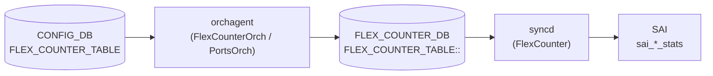

# FLEX_COUNTER 個別カウンタフィールド

## 概要

[orchagent](../../reference/glossary.md#term-orchagent) は `FLEX_COUNTER_TABLE` のグループ設定（`FLEX_COUNTER_STATUS = enable`）を受信すると、ハードウェアオブジェクト（ポート・キュー・PG 等）ごとに **`FLEX_COUNTER_DB`** へ per-OID エントリを書き込む[^1]。このエントリに含まれる `PORT_COUNTER_ID_LIST`、`QUEUE_COUNTER_ID_LIST` などが **個別カウンタフィールド** であり、`syncd` の `FlexCounter` モジュールが参照してどの SAI stat を収集するかを決定する。

これらのフィールドは CONFIG_DB 経由でユーザーが設定する手段はなく、orchagent が内部的にハードコードした stat リストから自動生成する。

<!-- cdb-mermaid -->
### データフロー (自動生成)



!!! note "凡例"
    CONFIG_DB からの設定が orchagent を経て FLEX_COUNTER_DB に書き込まれ、syncd が SAI bulk counter API で収集する流れ。
<!-- /cdb-mermaid -->

## FLEX_COUNTER_DB エントリ構造

```text
FLEX_COUNTER_TABLE|<group>|<oid>
  <COUNTER_ID_LIST_FIELD> = <comma-separated SAI stat enum list>
```

グループ名と対応するフィールド名:

| グループ | FLEX_COUNTER_DB フィールド |
|---------|--------------------------|
| `PORT` | `PORT_COUNTER_ID_LIST` |
| `PORT_BUFFER_DROP` | `PORT_COUNTER_ID_LIST` (別 stat セット) |
| `QUEUE` | `QUEUE_COUNTER_ID_LIST` |
| `QUEUE_WATERMARK` | `QUEUE_COUNTER_ID_LIST` |
| `PG_DROP` | `PG_COUNTER_ID_LIST` |
| `PG_WATERMARK` | `PG_COUNTER_ID_LIST` |
| `WRED_ECN_PORT` | `PORT_COUNTER_ID_LIST` |
| `WRED_ECN_QUEUE` | `QUEUE_COUNTER_ID_LIST` |
| `RIF` | `RIF_COUNTER_ID_LIST` |
| `TUNNEL` | `TUNNEL_COUNTER_ID_LIST` |
| `ACL` | `ACL_COUNTER_ATTR_ID_LIST` |
| `FLOW_CNT_TRAP` | `FLOW_COUNTER_ID_LIST` |
| `SWITCH` | `SWITCH_COUNTER_ID_LIST` |
| `ENI` | `ENI_COUNTER_ID_LIST` |
| `PORT_PHY_ATTR` | `PORT_PHY_ATTR_ID_LIST` / `PORT_PHY_SERDES_ATTR_ID_LIST` |

<!-- defaults -->
## 暗黙デフォルト・コード由来挙動 (Phase A)

<!-- evidence: sonic-swss/orchagent/portsorch.cpp,
     sonic-swss-common/common/schema.h -->

### PORT_COUNTER_ID_LIST のハードコード stat

`portsorch.cpp:242-381` の `port_stat_ids[]` で定義。`FLEX_COUNTER_STATUS = enable`（PORT グループ）受信時に `generatePortCounterMap()` が呼ばれ、PHY ポート全台に一括設定される。

**主要 SAI stat（抜粋）:**

| SAI stat | 意味 |
|---------|------|
| `SAI_PORT_STAT_IF_IN_OCTETS` | 受信バイト数 |
| `SAI_PORT_STAT_IF_IN_UCAST_PKTS` | 受信ユニキャストパケット数 |
| `SAI_PORT_STAT_IF_IN_NON_UCAST_PKTS` | 受信非ユニキャストパケット数 |
| `SAI_PORT_STAT_IF_IN_DISCARDS` | 受信ドロップパケット数 |
| `SAI_PORT_STAT_IF_IN_ERRORS` | 受信エラーパケット数 |
| `SAI_PORT_STAT_IF_OUT_OCTETS` | 送信バイト数 |
| `SAI_PORT_STAT_IF_OUT_UCAST_PKTS` | 送信ユニキャストパケット数 |
| `SAI_PORT_STAT_IF_OUT_DISCARDS` | 送信ドロップパケット数 |
| `SAI_PORT_STAT_IF_OUT_ERRORS` | 送信エラーパケット数 |
| `SAI_PORT_STAT_ETHER_IN_PKTS_64_OCTETS` | フレームサイズ別受信 (64B) |
| … | フレームサイズ bucket (65-127, 128-255, ..., 9217-16383) |

合計 ~60 stat がハードコードリストに含まれる。ユーザーが個別追加・削除する手段はない。

#### 特殊挙動

| 種類 | 内容 |
|------|------|
| PHY ポートのみ | `m_type != Port::PHY` のポート（LAG, VLAN, CPU）はスキップ。FLEX_COUNTER_DB にエントリ書き込みなし |
| 一度きり生成 | `m_isPortCounterMapGenerated` フラグ。再度 `enable` を書いても no-op。`disable` 後に `enable` し直した場合も再生成されない |
| gearbox 時の別リスト | gearbox enabled 環境では `gbport_stat_ids[]` が別途登録される（portsorch.cpp:9110-9125） |

### PORT_BUFFER_DROP のハードコード stat

`portsorch.cpp:383-387` `port_buffer_drop_stat_ids[]`:

| SAI stat | 意味 |
|---------|------|
| `SAI_PORT_STAT_IN_DROPPED_PKTS` | バッファ起因受信ドロップ |
| `SAI_PORT_STAT_OUT_DROPPED_PKTS` | バッファ起因送信ドロップ |

2 stat のみ。ポーリング間隔の初期ハードコード値: `PORT_BUFFER_DROP_STAT_POLLING_INTERVAL_MS = 60000` ms（portsorch.cpp:88）。

### QUEUE_COUNTER_ID_LIST のハードコード stat

`portsorch.cpp:389-398` `queue_stat_ids[]`:

| SAI stat | 意味 |
|---------|------|
| `SAI_QUEUE_STAT_PACKETS` | キュー送信パケット数 |
| `SAI_QUEUE_STAT_BYTES` | キュー送信バイト数 |
| `SAI_QUEUE_STAT_DROPPED_PACKETS` | キュードロップパケット数 |
| `SAI_QUEUE_STAT_DROPPED_BYTES` | キュードロップバイト数 |
| `SAI_QUEUE_STAT_TRIM_PACKETS` | トリムパケット数 |
| `SAI_QUEUE_STAT_DROPPED_TRIM_PACKETS` | ドロップトリムパケット数 |
| `SAI_QUEUE_STAT_TX_TRIM_PACKETS` | 送信トリムパケット数 |

VoQ 対応時は `SAI_QUEUE_STAT_CREDIT_WD_DELETED_PACKETS` が追加される（`voq_stat_ids[]` portsorch.cpp:399-402）。ポーリング間隔初期値: `QUEUE_STAT_FLEX_COUNTER_POLLING_INTERVAL_MS = 10000` ms（portsorch.cpp:90）。

### QUEUE_WATERMARK のハードコード stat

`portsorch.cpp:405-408` `queueWatermarkStatIds[]`: `SAI_QUEUE_STAT_SHARED_WATERMARK_BYTES` 1 stat のみ。

### PG_COUNTER_ID_LIST のハードコード stat

| 用途 | SAI stat |
|------|---------|
| PG_WATERMARK | `SAI_INGRESS_PRIORITY_GROUP_STAT_XOFF_ROOM_WATERMARK_BYTES`, `SAI_INGRESS_PRIORITY_GROUP_STAT_SHARED_WATERMARK_BYTES` |
| PG_DROP | `SAI_INGRESS_PRIORITY_GROUP_STAT_DROPPED_PACKETS` |

### WRED_ECN_PORT / WRED_ECN_QUEUE のハードコード stat

**WRED port** (`wred_port_stat_ids[]` portsorch.cpp:421-427):

| SAI stat | 意味 |
|---------|------|
| `SAI_PORT_STAT_GREEN_WRED_DROPPED_PACKETS` | 緑 WRED ドロップ |
| `SAI_PORT_STAT_YELLOW_WRED_DROPPED_PACKETS` | 黄 WRED ドロップ |
| `SAI_PORT_STAT_RED_WRED_DROPPED_PACKETS` | 赤 WRED ドロップ |
| `SAI_PORT_STAT_WRED_DROPPED_PACKETS` | WRED ドロップ合計 |

**WRED queue** (`wred_queue_stat_ids[]` portsorch.cpp:429-435):

| SAI stat | 意味 |
|---------|------|
| `SAI_QUEUE_STAT_WRED_ECN_MARKED_PACKETS` | ECN マーキングパケット数 |
| `SAI_QUEUE_STAT_WRED_ECN_MARKED_BYTES` | ECN マーキングバイト数 |
| `SAI_QUEUE_STAT_WRED_DROPPED_PACKETS` | WRED ドロップパケット数 |
| `SAI_QUEUE_STAT_WRED_DROPPED_BYTES` | WRED ドロップバイト数 |

!!! warning "ASIC 能力依存"
    WRED 統計は `sai_query_object_stage_capability` で ASIC サポートを確認してから登録する。未対応 ASIC では FLEX_COUNTER_DB へのエントリが書き込まれず、`counterpoll show` で STATUS が `enable` に見えても実カウンタはゼロのまま。

### COUNTER_ID_LIST 共通特性

| 種類 | 内容 |
|------|------|
| 書き込み先は FLEX_COUNTER_DB | CONFIG_DB ではなく `FLEX_COUNTER_DB`（DB 番号 5）の `FLEX_COUNTER_TABLE:<group>:<oid>` に書き込まれる |
| ユーザー設定不可 | YANG 定義なし、CONFIG_DB 経由での変更手段なし |
| グループ初期 polling interval | FlexCounterManager コンストラクタ引数で PORT: 1000ms、QUEUE: 10000ms、PORT_BUFFER_DROP: 60000ms がハードコード設定される。CONFIG_DB の `POLL_INTERVAL` で後から上書き可能 |
| schema.h 定数 | フィールド名は `sonic-swss-common/common/schema.h` で `PORT_COUNTER_ID_LIST`、`QUEUE_COUNTER_ID_LIST` 等として定義 |

<!-- /defaults -->

## 引用元

[^1]: `sonic-swss/orchagent/portsorch.cpp` `port_stat_ids[]` (line 242), `queue_stat_ids[]` (line 389), `wred_port_stat_ids[]` (line 421), `wred_queue_stat_ids[]` (line 429). <https://github.com/sonic-net/sonic-swss/blob/master/orchagent/portsorch.cpp>

<!-- ref-triangle:start -->

## 関連リファレンス

- [FLEX_COUNTER_TABLE テーブル](flex-counter-table.md) — グループレベルの enable/disable・polling interval 設定
- [YANG](../../reference/glossary.md#term-yang): [`sonic-flex_counter`](../yang/sonic-flex_counter.md)
- CLI: `counterpoll`

<!-- ref-triangle:end -->

<!-- topics-back-ref -->
## 関連 Topics

- [Topics: Telemetry / SNMP / Observability](../../topics/09-telemetry-snmp/index.md)

<!-- /topics-back-ref -->
