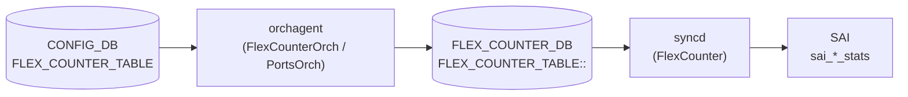

# FLEX_COUNTER 個別カウンタフィールド

## 概要

[orchagent](../../reference/glossary.md#term-orchagent) は `FLEX_COUNTER_TABLE` のグループ設定（`FLEX_COUNTER_STATUS = enable`）を受信すると、ハードウェアオブジェクト（ポート・キュー・PG 等）ごとに **`FLEX_COUNTER_DB`** へ per-OID エントリを書き込む[^1]。このエントリに含まれる `PORT_COUNTER_ID_LIST`、`QUEUE_COUNTER_ID_LIST` などが **個別カウンタフィールド** であり、`syncd` の `FlexCounter` モジュールが参照してどの SAI stat を収集するかを決定する。

これらのフィールドは CONFIG_DB 経由でユーザーが設定する手段はなく、orchagent が内部的にハードコードした stat リストから自動生成する。

<!-- cdb-mermaid -->
### データフロー (自動生成)



!!! note "凡例"
    CONFIG_DB からの設定が orchagent を経て FLEX_COUNTER_DB に書き込まれ、syncd が SAI bulk counter API で収集する流れ。
<!-- /cdb-mermaid -->

## FLEX_COUNTER_DB エントリ構造

```text
FLEX_COUNTER_TABLE|<group>|<oid>
  <COUNTER_ID_LIST_FIELD> = <comma-separated SAI stat enum list>
```

グループ名と対応するフィールド名:

| グループ | FLEX_COUNTER_DB フィールド |
|---------|--------------------------|
| `PORT` | `PORT_COUNTER_ID_LIST` |
| `PORT_BUFFER_DROP` | `PORT_COUNTER_ID_LIST` (別 stat セット) |
| `QUEUE` | `QUEUE_COUNTER_ID_LIST` |
| `QUEUE_WATERMARK` | `QUEUE_COUNTER_ID_LIST` |
| `PG_DROP` | `PG_COUNTER_ID_LIST` |
| `PG_WATERMARK` | `PG_COUNTER_ID_LIST` |
| `WRED_ECN_PORT` | `PORT_COUNTER_ID_LIST` |
| `WRED_ECN_QUEUE` | `QUEUE_COUNTER_ID_LIST` |
| `RIF` | `RIF_COUNTER_ID_LIST` |
| `TUNNEL` | `TUNNEL_COUNTER_ID_LIST` |
| `ACL` | `ACL_COUNTER_ATTR_ID_LIST` |
| `FLOW_CNT_TRAP` | `FLOW_COUNTER_ID_LIST` |
| `SWITCH` | `SWITCH_COUNTER_ID_LIST` |
| `ENI` | `ENI_COUNTER_ID_LIST` |
| `PORT_PHY_ATTR` | `PORT_PHY_ATTR_ID_LIST` / `PORT_PHY_SERDES_ATTR_ID_LIST` |

<!-- defaults -->
## 暗黙デフォルト・コード由来挙動 (Phase A)

<!-- evidence: sonic-swss/orchagent/portsorch.cpp,
     sonic-swss-common/common/schema.h -->

### PORT_COUNTER_ID_LIST のハードコード stat

`portsorch.cpp:242-381` の `port_stat_ids[]` で定義。`FLEX_COUNTER_STATUS = enable`（PORT グループ）受信時に `generatePortCounterMap()` が呼ばれ、PHY ポート全台に一括設定される。

**主要 SAI stat（抜粋）:**

| SAI stat | 意味 |
|---------|------|
| `SAI_PORT_STAT_IF_IN_OCTETS` | 受信バイト数 |
| `SAI_PORT_STAT_IF_IN_UCAST_PKTS` | 受信ユニキャストパケット数 |
| `SAI_PORT_STAT_IF_IN_NON_UCAST_PKTS` | 受信非ユニキャストパケット数 |
| `SAI_PORT_STAT_IF_IN_DISCARDS` | 受信ドロップパケット数 |
| `SAI_PORT_STAT_IF_IN_ERRORS` | 受信エラーパケット数 |
| `SAI_PORT_STAT_IF_OUT_OCTETS` | 送信バイト数 |
| `SAI_PORT_STAT_IF_OUT_UCAST_PKTS` | 送信ユニキャストパケット数 |
| `SAI_PORT_STAT_IF_OUT_DISCARDS` | 送信ドロップパケット数 |
| `SAI_PORT_STAT_IF_OUT_ERRORS` | 送信エラーパケット数 |
| `SAI_PORT_STAT_ETHER_IN_PKTS_64_OCTETS` | フレームサイズ別受信 (64B) |
| … | フレームサイズ bucket (65-127, 128-255, ..., 9217-16383) |

合計 ~60 stat がハードコードリストに含まれる。ユーザーが個別追加・削除する手段はない。

#### 特殊挙動

| 種類 | 内容 |
|------|------|
| PHY ポートのみ | `m_type != Port::PHY` のポート（LAG, VLAN, CPU）はスキップ。FLEX_COUNTER_DB にエントリ書き込みなし |
| 一度きり生成 | `m_isPortCounterMapGenerated` フラグ。再度 `enable` を書いても no-op。`disable` 後に `enable` し直した場合も再生成されない |
| gearbox 時の別リスト | gearbox enabled 環境では `gbport_stat_ids[]` が別途登録される（portsorch.cpp:9110-9125） |

### PORT_BUFFER_DROP のハードコード stat

`portsorch.cpp:383-387` `port_buffer_drop_stat_ids[]`:

| SAI stat | 意味 |
|---------|------|
| `SAI_PORT_STAT_IN_DROPPED_PKTS` | バッファ起因受信ドロップ |
| `SAI_PORT_STAT_OUT_DROPPED_PKTS` | バッファ起因送信ドロップ |

2 stat のみ。ポーリング間隔の初期ハードコード値: `PORT_BUFFER_DROP_STAT_POLLING_INTERVAL_MS = 60000` ms（portsorch.cpp:88）。

### QUEUE_COUNTER_ID_LIST のハードコード stat

`portsorch.cpp:389-398` `queue_stat_ids[]`:

| SAI stat | 意味 |
|---------|------|
| `SAI_QUEUE_STAT_PACKETS` | キュー送信パケット数 |
| `SAI_QUEUE_STAT_BYTES` | キュー送信バイト数 |
| `SAI_QUEUE_STAT_DROPPED_PACKETS` | キュードロップパケット数 |
| `SAI_QUEUE_STAT_DROPPED_BYTES` | キュードロップバイト数 |
| `SAI_QUEUE_STAT_TRIM_PACKETS` | トリムパケット数 |
| `SAI_QUEUE_STAT_DROPPED_TRIM_PACKETS` | ドロップトリムパケット数 |
| `SAI_QUEUE_STAT_TX_TRIM_PACKETS` | 送信トリムパケット数 |

VoQ 対応時は `SAI_QUEUE_STAT_CREDIT_WD_DELETED_PACKETS` が追加される（`voq_stat_ids[]` portsorch.cpp:399-402）。ポーリング間隔初期値: `QUEUE_STAT_FLEX_COUNTER_POLLING_INTERVAL_MS = 10000` ms（portsorch.cpp:90）。

### QUEUE_WATERMARK のハードコード stat

`portsorch.cpp:405-408` `queueWatermarkStatIds[]`: `SAI_QUEUE_STAT_SHARED_WATERMARK_BYTES` 1 stat のみ。

### PG_COUNTER_ID_LIST のハードコード stat

| 用途 | SAI stat |
|------|---------|
| PG_WATERMARK | `SAI_INGRESS_PRIORITY_GROUP_STAT_XOFF_ROOM_WATERMARK_BYTES`, `SAI_INGRESS_PRIORITY_GROUP_STAT_SHARED_WATERMARK_BYTES` |
| PG_DROP | `SAI_INGRESS_PRIORITY_GROUP_STAT_DROPPED_PACKETS` |

### WRED_ECN_PORT / WRED_ECN_QUEUE のハードコード stat

**WRED port** (`wred_port_stat_ids[]` portsorch.cpp:421-427):

| SAI stat | 意味 |
|---------|------|
| `SAI_PORT_STAT_GREEN_WRED_DROPPED_PACKETS` | 緑 WRED ドロップ |
| `SAI_PORT_STAT_YELLOW_WRED_DROPPED_PACKETS` | 黄 WRED ドロップ |
| `SAI_PORT_STAT_RED_WRED_DROPPED_PACKETS` | 赤 WRED ドロップ |
| `SAI_PORT_STAT_WRED_DROPPED_PACKETS` | WRED ドロップ合計 |

**WRED queue** (`wred_queue_stat_ids[]` portsorch.cpp:429-435):

| SAI stat | 意味 |
|---------|------|
| `SAI_QUEUE_STAT_WRED_ECN_MARKED_PACKETS` | ECN マーキングパケット数 |
| `SAI_QUEUE_STAT_WRED_ECN_MARKED_BYTES` | ECN マーキングバイト数 |
| `SAI_QUEUE_STAT_WRED_DROPPED_PACKETS` | WRED ドロップパケット数 |
| `SAI_QUEUE_STAT_WRED_DROPPED_BYTES` | WRED ドロップバイト数 |

!!! warning "ASIC 能力依存"
    WRED 統計は `sai_query_object_stage_capability` で ASIC サポートを確認してから登録する。未対応 ASIC では FLEX_COUNTER_DB へのエントリが書き込まれず、`counterpoll show` で STATUS が `enable` に見えても実カウンタはゼロのまま。

### COUNTER_ID_LIST 共通特性

| 種類 | 内容 |
|------|------|
| 書き込み先は FLEX_COUNTER_DB | CONFIG_DB ではなく `FLEX_COUNTER_DB`（DB 番号 5）の `FLEX_COUNTER_TABLE:<group>:<oid>` に書き込まれる |
| ユーザー設定不可 | YANG 定義なし、CONFIG_DB 経由での変更手段なし |
| グループ初期 polling interval | FlexCounterManager コンストラクタ引数で PORT: 1000ms、QUEUE: 10000ms、PORT_BUFFER_DROP: 60000ms がハードコード設定される。CONFIG_DB の `POLL_INTERVAL` で後から上書き可能 |
| schema.h 定数 | フィールド名は `sonic-swss-common/common/schema.h` で `PORT_COUNTER_ID_LIST`、`QUEUE_COUNTER_ID_LIST` 等として定義 |

<!-- /defaults -->

<!-- ordering -->
## 書込み順依存 (Phase B)

> 調査証跡: `meta/_intermediate/cdb-flow/counters-flex-ordering.md`

### doTask 処理ガード順序

`FlexCounterOrch::doTask()` は以下の条件を **順番に** チェックし、いずれかが成立すると即リターンする (`flexcounterorch.cpp`):

| 優先順 | ガード条件 | 挙動 |
|--------|-----------|------|
| 1 | テーブル名が `CFG_DEVICE_METADATA_TABLE_NAME` | `handleDeviceMetadataTable()` に委譲して即リターン |
| 2 | `!m_delayTimerExpired`（Warm-reboot 遅延期間） | 全エントリ処理を保留（キュー保持）。60 秒後に自動解除 |
| 3 | `gPortsOrch && !gPortsOrch->allPortsReady()` | 全エントリを保留。PortInitDone 発行後に再処理 |
| 4 | `gFabricPortsOrch && !gFabricPortsOrch->allPortsReady()` | Fabric ポート初期化待ち |
| 5 | `flexCounterGroupMap` に存在しないキー | `task_invalid_entry`（破棄、リトライなし） |

!!! warning "PortInitDone 前投入は恒久保留"
    `portsyncd` が PortInitDone を発行するまで、FLEX_COUNTER_TABLE へのすべての SET/DEL は
    `doTask` でキューに残り続ける。ただし Warm-reboot 遅延（60 秒）とは別カウントなため、
    冷起動時でも PORT 初期化が終わるまで有効にならない。

### enable 時の先行必須条件（グループ別）

`FLEX_COUNTER_STATUS = enable` を受信した際に orchagent が呼び出す generate 関数と、
それが必要とする先行テーブル:

| グループキー | generate 関数 | 先行必須テーブル / 条件 |
|---|---|---|
| `PORT` | `gPortsOrch->generatePortCounterMap()` | allPortsReady。一度きり（`m_port_counter_enabled` フラグ） |
| `PORT_BUFFER_DROP` | `gPortsOrch->generatePortBufferDropCounterMap()` | allPortsReady。一度きり |
| `QUEUE` | `generateQueueMap()` + `addQueueFlexCounters()` | allPortsReady。`create_only_config_db_buffers=true` 時は `BUFFER_QUEUE` (APP_DB) で non-zero profile 設定済みであること |
| `QUEUE_WATERMARK` | `generateQueueMap()` + `addQueueWatermarkFlexCounters()` | 同上 |
| `PG_DROP` | `generatePriorityGroupMap()` + `addPriorityGroupFlexCounters()` | allPortsReady。`create_only_config_db_buffers=true` 時は `BUFFER_PG` (APP_DB) で non-zero profile 設定済みであること |
| `PG_WATERMARK` | `generatePriorityGroupMap()` + `addPriorityGroupWatermarkFlexCounters()` | 同上 |
| `WRED_ECN_PORT` | `gPortsOrch->generateWredPortCounterMap()` | allPortsReady |
| `WRED_ECN_QUEUE` | `generateQueueMap()` + `addWredQueueFlexCounters()` | allPortsReady |
| `RIF` | `gIntfsOrch->generateInterfaceMap()` | `gIntfsOrch` 初期化済み |
| `BUFFER_POOL_WATERMARK` | `gBufferOrch->generateBufferPoolWatermarkCounterIdList()` | `gBufferOrch` 初期化済み |
| `TUNNEL` | `vxlan_tunnel_orch->generateTunnelCounterMap()` | VxlanTunnelOrch が gDirectory 登録済み |
| `FLOW_CNT_TRAP` | `gCoppOrch->generateHostIfTrapCounterIdList()` | `gCoppOrch` 初期化済み |
| `FLOW_CNT_ROUTE` | `gFlowCounterRouteOrch->generateRouteFlowStats()` | `gFlowCounterRouteOrch` 初期化済み かつ `getRouteFlowCounterSupported()` = true |
| `SRV6` | `gSrv6Orch->setCountersState(true)` | `gSrv6Orch` 初期化済み |
| `PORT_PHY_ATTR` | `generatePortPhyAttrCounterMap()` + `generatePortPhySerdesAttrCounterMap()` | allPortsReady。`PORT_PHY_SERDES_ATTR` は `PORT_PHY_ATTR` の enable/disable と連動 |
| `SWITCH` | `gSwitchOrch->generateSwitchCounterIdList()` | `gSwitchOrch` 初期化済み |
| `ENI` / `DASH_METER` / `HA_SET` | DashOrch / DashHaOrch ハンドラ | 対応 Orch が gDirectory 登録済み |

### disable 時の挙動

disable 受信時に FLEX_COUNTER_DB の per-OID エントリを **削除するグループ** と
**削除しないグループ** が存在する:

| 挙動 | グループ |
|------|---------|
| ID リストを明示削除 | `FLOW_CNT_TRAP`（`clearHostIfTrapCounterIdList()`）、`FLOW_CNT_ROUTE`（`clearRouteFlowStats()`）、`PORT_PHY_ATTR`（`clearPortPhyAttrCounterMap()` + `clearPortPhySerdesAttrCounterMap()`） |
| per-OID エントリを残したまま polling 停止のみ | `PORT`、`QUEUE`、`RIF`、`TUNNEL`、`BUFFER_POOL_WATERMARK` 等その他すべて |

!!! note "disable 後の再 enable"
    PORT / QUEUE 等は disable → enable しても `m_xxx_enabled` フラグが立ったままのため
    `generateXxxMap()` が再呼び出しされない（per-OID エントリは FLEX_COUNTER_DB に残存）。
    ID リストを明示削除するグループ（FLOW_CNT_TRAP 等）は再 enable で再生成される。

### Warm-reboot 遅延メカニズム

| 場面 | 挙動 |
|------|------|
| cold-start | コンストラクタで `m_delayTimerExpired = true`。タイマー不使用で即処理 |
| warm-reboot | コンストラクタでタイマー（60 秒）を開始。`m_delayTimerExpired = false` のまま全 doTask が保留 |
| タイムアウト | `doTask(SelectableTimer&)` が呼ばれ `m_delayTimerExpired = true` に変更。以降は通常処理 |
| `bake()` | 意図的 no-op（`return true`）。FC は reconciling 対象外のため warm-reboot 中にリプレイしない |

### フィールド処理内部順序

同一 SET エントリ内に複数フィールドを含む場合、ループで順次処理される:

1. `POLL_INTERVAL_FIELD` → `setFlexCounterGroupPollInterval()` （先に適用）
2. `BULK_CHUNK_SIZE_FIELD` / `BULK_CHUNK_SIZE_PER_PREFIX_FIELD` → 変数に保存
3. `FLEX_COUNTER_STATUS_FIELD` → generate アクション + `setFlexCounterGroupOperation()`
4. 上記以外 → `SWSS_LOG_NOTICE("Unsupported field")` で無視・破棄

`POLL_INTERVAL` と `FLEX_COUNTER_STATUS` を同一トランザクションで書いた場合、
`POLL_INTERVAL` が先に syncd へ伝達されてから enable が実行される。

### gearbox 環境での追加書き込み

`gPortsOrch->isGearboxEnabled()` が true の場合、`PORT` と `MACSEC` 系グループは
`setFlexCounterGroupPollInterval()` と `setFlexCounterGroupOperation()` を
通常 flexcounter 用と gearbox 用に **2 回** 呼び出す。
他グループへの影響はない。
<!-- /ordering -->

<!-- cross-refs -->
## 暗黙参照マップ (Phase C)

> 調査証跡: `meta/_intermediate/cdb-flow/counters-flex-cross-refs.md`

`FlexCounterOrch` は YANG leafref として定義されていない以下のテーブル・グローバル Orch を暗黙参照して、個別カウンタフィールドの生成範囲を決定する。

| 参照先 | DB | 参照タイミング | YANG leafref | 実装上の必須度 | 証拠 |
|---|---|---|---|---|---|
| `DEVICE_METADATA\|localhost` (`create_only_config_db_buffers`) | CONFIG_DB | コンストラクタ初期化時・変更通知 | なし | QUEUE/PG 生成範囲に影響 | flexcounterorch.cpp:110-125 |
| `APP_BUFFER_QUEUE_TABLE` (APP_DB) | APP_DB | QUEUE/QUEUE_WATERMARK/WRED_ECN_QUEUE enable 時 | なし | `create_only_config_db_buffers=true` 時必須 | flexcounterorch.cpp:554 |
| `APP_BUFFER_PG_TABLE` (APP_DB) | APP_DB | PG_DROP/PG_WATERMARK enable 時 | なし | `create_only_config_db_buffers=true` 時必須 | flexcounterorch.cpp:623 |
| `gPortsOrch`（PORT_TABLE/APP_DB） | APP_DB | 全 PORT 系グループ enable 時 | なし | allPortsReady 待ち必須 | flexcounterorch.cpp:164-167 |
| `gIntfsOrch`（INTF_TABLE/APP_DB） | APP_DB | RIF enable 時 | なし | null 時はスキップ | flexcounterorch.cpp:283 |
| `gBufferOrch`（BUFFER_POOL_TABLE/APP_DB） | APP_DB | BUFFER_POOL_WATERMARK enable 時 | なし | null 時はスキップ | flexcounterorch.cpp:287 |
| `gCoppOrch`（COPP_TABLE/APP_DB） | APP_DB | FLOW_CNT_TRAP enable 時 | なし | null 時はスキップ | flexcounterorch.cpp:313-315 |
| `gSwitchOrch` | — | SWITCH enable 時 | なし | null 時はスキップ | flexcounterorch.cpp:370 |
| `vxlan_tunnel_orch`（gDirectory） | — | TUNNEL enable 時 | なし | null 時はスキップ | flexcounterorch.cpp:295 |
| `dash_orch`/`dash_ha_orch`（gDirectory） | — | ENI/DASH_METER/HA_SET enable 時 | なし | null 時はスキップ | flexcounterorch.cpp:301-309 |

### create_only_config_db_buffers によるフィルタリング

`DEVICE_METADATA|localhost|create_only_config_db_buffers = true` かつ VoQ 非使用環境では:

- **QUEUE 系**: `APP_BUFFER_QUEUE_TABLE` で non-zero buffer profile が設定されたポート+キュー範囲のみを FLEX_COUNTER_DB に登録。未設定ポートの QUEUE カウンタはゼロリストになる。
- **PG 系**: `APP_BUFFER_PG_TABLE` で non-zero profile の PG のみを登録。

`create_only_config_db_buffers = false`（デフォルト）または VoQ 環境では、全ポートの全キュー / 全 PG を対象とする。

!!! note "YANG 非定義の暗黙制約"
    これらの依存関係はいずれも `sonic-flex_counter.yang` に leafref として記述されていない[^2]。
    `counterpoll enable` 後にカウンタが全ゼロに見える場合、`DEVICE_METADATA` と
    APP_DB の `BUFFER_QUEUE`/`BUFFER_PG` エントリの存在を確認すること。

<!-- /cross-refs -->

<!-- failure -->
## 失敗挙動・retry / recovery (Phase D)

<!-- evidence: sonic-swss/orchagent/flexcounterorch.cpp:145-418,
     sonic-swss/orchagent/flex_counter_manager.cpp:203-260,
     sonic-swss/orchagent/portsorch.cpp:9102-9165 -->

> 調査証跡: `meta/_intermediate/cdb-flow/counters-flex-failure.md`

`FlexCounterOrch` と `FlexCounterManager` における失敗パターンと回復挙動のまとめ。

| # | トリガー | ログレベル | FLEX_COUNTER_DB への影響 | 自動回復 | 証拠 |
|---|---------|---------|----------------------|---------|------|
| 1 | 無効グループキー | NOTICE | なし | なし（再書き込みが必要） | `flexcounterorch.cpp:183` |
| 2 | `allPortsReady() = false` | なし | 保留 | 自動（PortInitDone 後） | `flexcounterorch.cpp:164` |
| 3 | Warm-reboot 60 秒タイマー中 | NOTICE（タイムアウト後） | 保留 | 自動（60 秒後） | `flexcounterorch.cpp:128-136` |
| 4 | 未サポートフィールド名 | NOTICE | なし | 不要（他フィールドは継続） | `flexcounterorch.cpp:396` |
| 5 | Redis 接続断 (例外) | — (未キャッチ例外) | 不定（orchagent クラッシュ） | supervisor 再起動後 | `flex_counter_manager.cpp` |
| 6 | 未対応 CounterType | ERROR | なし（書き込みスキップ） | なし（コード修正要） | `flex_counter_manager.cpp:216` |
| 7 | `m_isXxxMapGenerated = true` | なし | なし（設計上の冪等） | 不要 | `portsorch.cpp:generateXxxMap` |
| 8 | DEVICE_METADATA 読み込み失敗 | ERROR | なし | 自動（デフォルト `false` で継続） | `flexcounterorch.cpp:122` |

### 主要失敗パターン詳細

#### 無効グループキー（パターン 1）

`FLEX_COUNTER_TABLE` に `flexCounterGroupMap` 未登録のキーが書かれた場合（`flexcounterorch.cpp:183-188`）:

```text
SWSS_LOG_NOTICE("Invalid flex counter group input, %s", key)
→ consumer.m_toSync.erase(it++)  # 即削除、retry なし
```

復旧には正しいキーで再書き込みが必要。FLEX_COUNTER_DB は無変更。

#### `allPortsReady() = false` 保留（パターン 2）

PortsOrch 初期化完了前は `doTask()` が全エントリを `m_toSync` に保持してリターン。`portsyncd` が PortInitDone を発行した後の最初のイベントループで自動処理される。保留の上限なし。

#### Redis 接続断でクラッシュ（パターン 5）

`FlexCounterManager::setCounterIdList()` 内で `RedisReply` 例外が発生すると orchagent がクラッシュする。supervisor（supervisord）による自動再起動後、warm-reboot 相当の処理で再初期化される。通常は発生しない（Redis は systemd socket activation で確保）。

#### `m_isPortCounterMapGenerated` ガード（パターン 7）

`generatePortCounterMap()` / `generateQueueMap()` 等は先頭のフラグでガードされており、初回 enable 後は再呼び出しが no-op になる（設計上の冪等保護）。`disable` → `enable` 繰り返しでも per-OID エントリは再生成されない。FLOW_CNT_TRAP / FLOW_CNT_ROUTE / PORT_PHY_ATTR はフラグガードなしで disable 時に明示削除 → re-enable で再生成される（グループ別の差異）。

!!! warning "silent 失敗の識別"
    パターン 1・4・7 はログが NOTICE / なしで、障害と区別しにくい。
    `counterpoll show` で STATUS が `enable` になっているのにカウンタがゼロの場合、
    orchagent ログ（`swssloglevel -l NOTICE -c orchagent`）でこれらのパターンを確認すること。
<!-- /failure -->

## 引用元

[^1]: `sonic-swss/orchagent/portsorch.cpp` `port_stat_ids[]` (line 242), `queue_stat_ids[]` (line 389), `wred_port_stat_ids[]` (line 421), `wred_queue_stat_ids[]` (line 429). <https://github.com/sonic-net/sonic-swss/blob/master/orchagent/portsorch.cpp>

[^2]: `sonic-swss/orchagent/flexcounterorch.cpp` `FlexCounterOrch::FlexCounterOrch()` (line ~102-138), `getQueueConfigurations()` (line ~538-607), `getPgConfigurations()` (line ~609-668). <https://github.com/sonic-net/sonic-swss/blob/master/orchagent/flexcounterorch.cpp>

<!-- ref-triangle:start -->

## 関連リファレンス

- [FLEX_COUNTER_TABLE テーブル](flex-counter-table.md) — グループレベルの enable/disable・polling interval 設定
- [YANG](../../reference/glossary.md#term-yang): [`sonic-flex_counter`](../yang/sonic-flex_counter.md)
- CLI: `counterpoll`

<!-- ref-triangle:end -->

<!-- topics-back-ref -->
## 関連 Topics

- [Topics: Telemetry / SNMP / Observability](../../topics/09-telemetry-snmp/index.md)

<!-- /topics-back-ref -->
