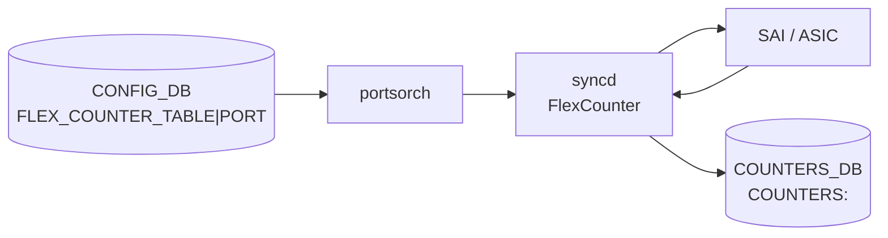

# COUNTERS_DB PORT カウンタ

## 概要

[portsorch](../../reference/glossary.md#term-portsorch)（[orchagent](../../reference/glossary.md#term-orchagent) 内）が [SAI](../../reference/glossary.md#term-sai) の flex counter 機構を通じて物理ポートごとに取得する統計カウンタ群[^1]。値は `COUNTERS_DB` の `COUNTERS:<oid>` に格納され、`portstat` / `show interface counters` が読み出す。

<!-- cdb-mermaid -->
### データフロー (自動生成)



!!! note "凡例"
    CONFIG_DB の `FLEX_COUNTER_TABLE|PORT` が `enable` になると portsorch が SAI カウンタ ID リストを syncd へ投入。syncd が 1 s ごとにポーリングして COUNTERS_DB を更新する。

<!-- /cdb-mermaid -->

## key 構造

### ポート名→OID マップ

```text
COUNTERS_DB / COUNTERS_PORT_NAME_MAP   (Hash)
  field: <port_name>  (例: Ethernet0)
  value: <SAI OID>    (例: oid:0x1000000000001)
```

### カウンタハッシュ

```text
COUNTERS_DB / COUNTERS:<oid>           (Hash)
  field: <SAI_PORT_STAT_*>
  value: <uint64 カウンタ値 (文字列)>
```

## フィールド一覧

以下は `portsorch.cpp` の `port_stat_ids[]`（物理ポート）に定義されている全 SAI カウンタ ID[^2]。

### 基本 IF カウンタ (RFC 2863)

| SAI フィールド | 意味 |
|---------------|------|
| `SAI_PORT_STAT_IF_IN_OCTETS` | 受信バイト数 |
| `SAI_PORT_STAT_IF_IN_UCAST_PKTS` | 受信ユニキャストパケット数 |
| `SAI_PORT_STAT_IF_IN_NON_UCAST_PKTS` | 受信非ユニキャスト（MC+BC）パケット数 |
| `SAI_PORT_STAT_IF_IN_DISCARDS` | 受信ディスカードパケット数 |
| `SAI_PORT_STAT_IF_IN_ERRORS` | 受信エラーパケット数 |
| `SAI_PORT_STAT_IF_IN_UNKNOWN_PROTOS` | 未知プロトコル受信数 |
| `SAI_PORT_STAT_IF_OUT_OCTETS` | 送信バイト数 |
| `SAI_PORT_STAT_IF_OUT_UCAST_PKTS` | 送信ユニキャストパケット数 |
| `SAI_PORT_STAT_IF_OUT_NON_UCAST_PKTS` | 送信非ユニキャストパケット数 |
| `SAI_PORT_STAT_IF_OUT_DISCARDS` | 送信ディスカードパケット数 |
| `SAI_PORT_STAT_IF_OUT_ERRORS` | 送信エラーパケット数 |
| `SAI_PORT_STAT_IF_OUT_QLEN` | 送信キュー現在長 |
| `SAI_PORT_STAT_IF_IN_MULTICAST_PKTS` | 受信マルチキャストパケット数 |
| `SAI_PORT_STAT_IF_IN_BROADCAST_PKTS` | 受信ブロードキャストパケット数 |
| `SAI_PORT_STAT_IF_OUT_MULTICAST_PKTS` | 送信マルチキャストパケット数 |
| `SAI_PORT_STAT_IF_OUT_BROADCAST_PKTS` | 送信ブロードキャストパケット数 |

### Ether サイズ別カウンタ

| SAI フィールド | 意味 |
|---------------|------|
| `SAI_PORT_STAT_ETHER_RX_OVERSIZE_PKTS` | 受信オーバーサイズパケット数 |
| `SAI_PORT_STAT_ETHER_TX_OVERSIZE_PKTS` | 送信オーバーサイズパケット数 |
| `SAI_PORT_STAT_ETHER_IN_PKTS_64_OCTETS` | 受信 64 バイトパケット数 |
| `SAI_PORT_STAT_ETHER_IN_PKTS_65_TO_127_OCTETS` | 受信 65〜127 バイトパケット数 |
| `SAI_PORT_STAT_ETHER_IN_PKTS_128_TO_255_OCTETS` | 受信 128〜255 バイトパケット数 |
| `SAI_PORT_STAT_ETHER_IN_PKTS_256_TO_511_OCTETS` | 受信 256〜511 バイトパケット数 |
| `SAI_PORT_STAT_ETHER_IN_PKTS_512_TO_1023_OCTETS` | 受信 512〜1023 バイトパケット数 |
| `SAI_PORT_STAT_ETHER_IN_PKTS_1024_TO_1518_OCTETS` | 受信 1024〜1518 バイトパケット数 |
| `SAI_PORT_STAT_ETHER_IN_PKTS_1519_TO_2047_OCTETS` | 受信 1519〜2047 バイトパケット数 |
| `SAI_PORT_STAT_ETHER_IN_PKTS_2048_TO_4095_OCTETS` | 受信 2048〜4095 バイトパケット数 |
| `SAI_PORT_STAT_ETHER_IN_PKTS_4096_TO_9216_OCTETS` | 受信 4096〜9216 バイトパケット数 |
| `SAI_PORT_STAT_ETHER_IN_PKTS_9217_TO_16383_OCTETS` | 受信 9217〜16383 バイトパケット数 |
| `SAI_PORT_STAT_ETHER_OUT_PKTS_64_OCTETS` | 送信 64 バイトパケット数 |
| `SAI_PORT_STAT_ETHER_OUT_PKTS_65_TO_127_OCTETS` | 送信 65〜127 バイトパケット数 |
| `SAI_PORT_STAT_ETHER_OUT_PKTS_128_TO_255_OCTETS` | 送信 128〜255 バイトパケット数 |
| `SAI_PORT_STAT_ETHER_OUT_PKTS_256_TO_511_OCTETS` | 送信 256〜511 バイトパケット数 |
| `SAI_PORT_STAT_ETHER_OUT_PKTS_512_TO_1023_OCTETS` | 送信 512〜1023 バイトパケット数 |
| `SAI_PORT_STAT_ETHER_OUT_PKTS_1024_TO_1518_OCTETS` | 送信 1024〜1518 バイトパケット数 |
| `SAI_PORT_STAT_ETHER_OUT_PKTS_1519_TO_2047_OCTETS` | 送信 1519〜2047 バイトパケット数 |
| `SAI_PORT_STAT_ETHER_OUT_PKTS_2048_TO_4095_OCTETS` | 送信 2048〜4095 バイトパケット数 |
| `SAI_PORT_STAT_ETHER_OUT_PKTS_4096_TO_9216_OCTETS` | 送信 4096〜9216 バイトパケット数 |
| `SAI_PORT_STAT_ETHER_OUT_PKTS_9217_TO_16383_OCTETS` | 送信 9217〜16383 バイトパケット数 |

### PFC カウンタ

| SAI フィールド | 意味 |
|---------------|------|
| `SAI_PORT_STAT_PFC_0_TX_PKTS` 〜 `SAI_PORT_STAT_PFC_7_TX_PKTS` | PFC 優先度 0〜7 送信 PAUSE フレーム数 |
| `SAI_PORT_STAT_PFC_0_RX_PKTS` 〜 `SAI_PORT_STAT_PFC_7_RX_PKTS` | PFC 優先度 0〜7 受信 PAUSE フレーム数 |
| `SAI_PORT_STAT_PAUSE_RX_PKTS` | 受信 PAUSE フレーム総数 |
| `SAI_PORT_STAT_PAUSE_TX_PKTS` | 送信 PAUSE フレーム総数 |

### その他統計

| SAI フィールド | 意味 |
|---------------|------|
| `SAI_PORT_STAT_ETHER_STATS_TX_NO_ERRORS` | エラーなし送信フレーム数 |
| `SAI_PORT_STAT_IP_IN_UCAST_PKTS` | 受信 IP ユニキャストパケット数 |
| `SAI_PORT_STAT_ETHER_STATS_JABBERS` | ジャバーフレーム受信数 |
| `SAI_PORT_STAT_ETHER_STATS_FRAGMENTS` | フラグメントフレーム受信数 |
| `SAI_PORT_STAT_ETHER_STATS_UNDERSIZE_PKTS` | アンダーサイズパケット受信数 |
| `SAI_PORT_STAT_IP_IN_RECEIVES` | 受信 IP パケット総数 |

### FEC カウンタ

| SAI フィールド | 意味 |
|---------------|------|
| `SAI_PORT_STAT_IF_IN_FEC_CORRECTABLE_FRAMES` | FEC 訂正済みフレーム数 |
| `SAI_PORT_STAT_IF_IN_FEC_NOT_CORRECTABLE_FRAMES` | FEC 訂正不能フレーム数 |
| `SAI_PORT_STAT_IF_IN_FEC_SYMBOL_ERRORS` | FEC シンボルエラー数 |
| `SAI_PORT_STAT_IF_IN_FEC_CODEWORD_ERRORS_S0` 〜 `_S15` | FEC コードワードエラー（バケット S0〜S15） |
| `SAI_PORT_STAT_IF_IN_FEC_CORRECTED_BITS` | FEC 訂正ビット数 |

### Packet Trimming カウンタ

| SAI フィールド | 意味 |
|---------------|------|
| `SAI_PORT_STAT_TRIM_PACKETS` | トリムパケット数（受信） |
| `SAI_PORT_STAT_DROPPED_TRIM_PACKETS` | トリムドロップパケット数 |
| `SAI_PORT_STAT_TX_TRIM_PACKETS` | トリム送信パケット数 |

### DOT3 / IEEE 802.3 カウンタ

| SAI フィールド | 意味 |
|---------------|------|
| `SAI_PORT_STAT_DOT3_STATS_ALIGNMENT_ERRORS` | アラインメントエラー |
| `SAI_PORT_STAT_DOT3_STATS_FCS_ERRORS` | FCS エラー |
| `SAI_PORT_STAT_DOT3_STATS_SINGLE_COLLISION_FRAMES` | シングルコリジョンフレーム |
| `SAI_PORT_STAT_DOT3_STATS_MULTIPLE_COLLISION_FRAMES` | マルチコリジョンフレーム |
| `SAI_PORT_STAT_DOT3_STATS_SQE_TEST_ERRORS` | SQE テストエラー |
| `SAI_PORT_STAT_DOT3_STATS_DEFERRED_TRANSMISSIONS` | 遅延送信 |
| `SAI_PORT_STAT_DOT3_STATS_LATE_COLLISIONS` | レートコリジョン |
| `SAI_PORT_STAT_DOT3_STATS_EXCESSIVE_COLLISIONS` | 過剰コリジョン |
| `SAI_PORT_STAT_DOT3_STATS_INTERNAL_MAC_TRANSMIT_ERRORS` | 内部 MAC 送信エラー |
| `SAI_PORT_STAT_DOT3_STATS_CARRIER_SENSE_ERRORS` | キャリアセンスエラー |
| `SAI_PORT_STAT_DOT3_STATS_FRAME_TOO_LONGS` | フレーム過長 |
| `SAI_PORT_STAT_DOT3_STATS_INTERNAL_MAC_RECEIVE_ERRORS` | 内部 MAC 受信エラー |
| `SAI_PORT_STAT_DOT3_STATS_SYMBOL_ERRORS` | シンボルエラー |

### PORT_BUFFER_DROP 専用カウンタ

`FLEX_COUNTER_TABLE|PORT_BUFFER_DROP` が `enable` の場合のみ収集される（別 flex counter グループ）。

| SAI フィールド | 意味 |
|---------------|------|
| `SAI_PORT_STAT_IN_DROPPED_PKTS` | 受信バッファドロップパケット数 |
| `SAI_PORT_STAT_OUT_DROPPED_PKTS` | 送信バッファドロップパケット数 |

### WRED ポートカウンタ

`FLEX_COUNTER_TABLE|WRED_ECN_PORT` が `enable` かつプラットフォームが対応している場合のみ収集。

| SAI フィールド | 意味 |
|---------------|------|
| `SAI_PORT_STAT_GREEN_WRED_DROPPED_PACKETS` | WRED Green ドロップパケット数 |
| `SAI_PORT_STAT_YELLOW_WRED_DROPPED_PACKETS` | WRED Yellow ドロップパケット数 |
| `SAI_PORT_STAT_RED_WRED_DROPPED_PACKETS` | WRED Red ドロップパケット数 |
| `SAI_PORT_STAT_WRED_DROPPED_PACKETS` | WRED 合計ドロップパケット数 |

## RATES テーブル

syncd が `port_rates.lua` を定期実行して計算した派生レートを `RATES:<oid>` に書く。

| フィールド | 意味 |
|-----------|------|
| `RX_BPS` | 受信ビットレート (bps) |
| `RX_PPS` | 受信パケットレート (pps) |
| `RX_UTIL` | 受信ポート利用率 (%) |
| `TX_BPS` | 送信ビットレート (bps) |
| `TX_PPS` | 送信パケットレート (pps) |
| `TX_UTIL` | 送信ポート利用率 (%) |
| `FEC_PRE_BER` | FEC 前 BER |
| `FEC_POST_BER` | FEC 後 BER |
| `FEC_PRE_BER_MAX` | FEC 前 BER 最大値 |
| `FEC_FLR` | Frame Loss Rate |
| `FEC_FLR_PREDICTED` | FLR 予測値 |
| `FEC_FLR_R_SQUARED` | FLR R^2 |
| `FEC_MAX_T` | FEC 最大 T 値 |

## 書き込み経路

`COUNTERS_DB` は直接 CONFIG_DB から書かれず、すべて orchagent / syncd 経由で書かれる。

| 経路 | 詳細 |
|------|------|
| portsorch 初期化 | `COUNTERS_PORT_NAME_MAP` にポート名→OID マッピングを書き込み |
| syncd FlexCounter | `FLEX_COUNTER_TABLE|PORT` が `enable` になった後、1 秒ごとに SAI カウンタをポーリングして `COUNTERS:<oid>` を更新 |
| syncd Lua プラグイン | `port_rates.lua` / `port_flr.lua` が `RATES:<oid>` および FLR 関連フィールドを書き込み |

## 関連 CONFIG_DB / CLI

- CONFIG_DB: `FLEX_COUNTER_TABLE` — ポーリング有効化と間隔設定
- CLI: `show interface counters` (`portstat`)、`counterpoll port enable/disable/interval`

<!-- defaults -->
## 暗黙デフォルト・コード由来挙動 (Phase A)

<!-- evidence: sonic-swss/orchagent/portsorch.cpp, sonic-swss/orchagent/portsorch.h,
     sonic-swss/orchagent/flexcounterorch.cpp,
     sonic-utilities/utilities_common/portstat.py -->

### ポーリング間隔のコード由来デフォルト

`FLEX_COUNTER_TABLE|PORT` に `POLL_INTERVAL` が設定されていない場合、portsorch が **ハードコードした初期値**で syncd に投入する[^3]。

| カウンタグループ | ハードコード定数 | 値 |
|----------------|---------------|-----|
| `PORT` (通常カウンタ) | `PORT_STAT_FLEX_COUNTER_POLLING_INTERVAL_MS` (portsorch.cpp:87) | **1000 ms** |
| `PORT` (rate プラグイン) | `PORT_RATE_FLEX_COUNTER_POLLING_INTERVAL_MS` (portsorch.h:41) | **1000 ms** |
| `WRED_ECN_PORT` | `PORT_STAT_FLEX_COUNTER_POLLING_INTERVAL_MS` と同じ (portsorch.cpp:738) | **1000 ms** |
| `PORT_BUFFER_DROP` | `PORT_BUFFER_DROP_STAT_FLEX_COUNTER_POLLING_INTERVAL_MS` | `counterpoll` CLI 許容下限 **30000 ms** |
| `PG_DROP` | `PG_DROP_FLEX_STAT_COUNTER_POLL_MSECS` (portsorch.h:40) | **10000 ms** |

!!! warning "CLI ソフトデフォルトとの違い"
    `counterpoll show` の表示では PORT グループを「default (1000)」と表示するが、これは CLI 側の表示ロジックのみ。orchagent 側の `PORT_STAT_FLEX_COUNTER_POLLING_INTERVAL_MS = 1000` と偶然一致しているだけで、`POLL_INTERVAL` を CONFIG_DB に書かなかった場合は orchagent のハードコード値が実際に syncd へ投入される。

### `FLEX_COUNTER_STATUS` 未設定時の挙動

`FLEX_COUNTER_TABLE|PORT` の `FLEX_COUNTER_STATUS` が `enable` になるまで、syncd は SAI ポーリングを行わない。カウンタ値は 0 のまま（または古い値）。

| 種類 | 詳細 |
|------|------|
| コード由来デフォルト | `m_port_counter_enabled = false`（flexcounterorch.h:66）。起動直後はカウンタ収集ゼロ |
| ビルド時デフォルト | `init_cfg.json.j2` が `FLEX_COUNTER_TABLE|PORT: {FLEX_COUNTER_STATUS: enable}` を書き込む（PHY カウンタ有効） |
| allPortsReady 依存 | `enable` を受信した時点でポート初期化が完了していない場合、`doTask` が早期 return。ポート ready 後に再適用される |

### PHY ポートのみ対象

```text
// Set counter stats only for PHY ports to ensure syncd will not try to query
// the counter statistics from the HW for non-PHY ports.
if (it.second.m_type != Port::Type::PHY) continue;
```
(portsorch.cpp:9113-9117)

LAG / VLAN / CPU ポートは `COUNTERS_PORT_NAME_MAP` に登録されず、`COUNTERS:<oid>` も書かれない。

### SAI フィールド未サポート時の挙動

ASIC が対応していない SAI カウンタは `portstat.py` の `get_counters()` で `STATUS_NA` ('N/A') として扱われ、表示に `N/A` が出る。WRED カウンタは `STATE_DB` の `PORT_COUNTER_CAPABILITIES` で対応確認後、未サポートなら `counter_bucket_dict` から除外される (portstat.py:297-329)。

### gearbox (gb) ポートの別テーブル

gearbox 有効環境では `gb_port_stat_manager` が `GB_COUNTERS_DB` に別途カウンタを書き込む。通常の `COUNTERS_DB` とは独立した DB インデックスを使用。

### WRED カウンタの追加有効化要件

`WRED_ECN_PORT` グループは `FLEX_COUNTER_STATUS = enable` に加え、`STATE_DB` の `PORT_COUNTER_CAPABILITIES|WRED_ECN_PORT_WRED_*_DROP_COUNTER` フィールドが `"true"` である場合のみ収集対象となる。プラットフォームが WRED drop counter を実装していない場合は silent skip。

<!-- /defaults -->

<!-- ordering -->
## 書込み順依存 (Phase B)

> 調査証跡: `meta/_intermediate/cdb-flow/counters-port-ordering.md`

### SET 時の先行必須テーブル / イベント

| 先行必須テーブル / イベント | 理由 | ソース |
|---|---|---|
| `APP_DB PORT_TABLE\|PortInitDone` | `FlexCounterOrch::doTask()` が冒頭で `gPortsOrch->allPortsReady()` を確認し、`false` の間は全リターン。エントリは `m_toSync` に保留され PortInitDone 後に自動処理される | `flexcounterorch.cpp:164-166` / `portsorch.cpp:1685-1687` |
| `FLEX_COUNTER_TABLE\|PORT FLEX_COUNTER_STATUS=enable` | enable 受信時に `gPortsOrch->generatePortCounterMap()` を呼び `COUNTER_ID_LIST` を syncd へ登録。enable 前は syncd へポーリング登録されず `COUNTERS:<oid>` が更新されない | `flexcounterorch.cpp:235-240` |
| SAI PHY ポート作成完了（`portsorch` による `m_portList` 登録） | `generatePortCounterMap()` は `m_portList` をイテレートし `m_type != PHY` をスキップ。ポートが未作成の場合は登録対象なし | `portsorch.cpp:9112-9117` |

!!! warning "PortInitDone 前の enable は保留される"
    `FLEX_COUNTER_TABLE|PORT` への `FLEX_COUNTER_STATUS=enable` を `PortInitDone` より先に書いても
    `flexcounterorch` は何もしない。エントリは `m_toSync` に留まり、`PortInitDone` 後の次 Consumer tick
    で自動的に処理される。

### フィールド解決順序

`generatePortCounterMap()` が呼ばれると以下の順で syncd へ登録される（`portsorch.cpp:9109-9128`）:

1. **`port_stat_manager.setCounterIdList()`** — 物理ポートに `port_stat_ids[]`（RFC2863 + 拡張）を登録
2. **`gb_port_stat_manager.setCounterIdList()`** — Gearbox 有効ポートに `gbport_stat_ids[]` を登録（`m_system_side_id` / `m_line_side_id`）

`m_isPortCounterMapGenerated` フラグにより、`generatePortCounterMap()` は一度成功した後は noop（冪等）。

### counterpoll enable 後に追加されたポートの扱い

enable 済み状態で `portsorch` が新規 PHY ポートを作成した場合、`flex_counters_orch->getPortCountersState()` が `true` であれば即座に `port_stat_manager.setCounterIdList()` を呼ぶ（`portsorch.cpp:4143-4148`）。`generatePortCounterMap()` は経由しない。

- **enable 前に存在したポート**: `generatePortCounterMap()` で一括登録
- **enable 後に追加されたポート**: ポート作成時に即時登録

どちらの経路でも `COUNTERS_PORT_NAME_MAP` への `<alias>:<OID>` 書き込みはポート作成時に常時行われる（counterpoll の enable/disable に依存しない）。

### Warm Start 時の遅延

Warm Start の場合、`FlexCounterOrch` ctor は `FLEX_COUNTER_DELAY_SEC = 60` 秒のタイマを起動し、満了まで `doTask()` が全リターンする（`flexcounterorch.cpp:127-136`, `155-158`）。通常起動では即時 `m_delayTimerExpired = true`（`flexcounterorch.cpp:137`）。

### DEL 時の挙動

`FLEX_COUNTER_TABLE|PORT FLEX_COUNTER_STATUS=disable` を受信すると syncd はポーリングを停止する。`COUNTERS_DB:COUNTERS:<oid>` のハッシュは**削除されず**、最後の値が残留する。ポート削除時は `COUNTERS_PORT_NAME_MAP` から当該エントリが除去される（`portsorch.cpp:4312`）。

### 起動時シーケンス

```
portsyncd → APP_DB:PORT_TABLE|PortInitDone
  ↓
portsorch: m_initDone = true → allPortsReady() = true
  ↓
flexcounterorch: doTask() ブロック解除
  ↓
FLEX_COUNTER_TABLE|PORT に FLEX_COUNTER_STATUS=enable が届く
  (counterpoll コマンドまたは起動時設定)
  ↓
gPortsOrch->generatePortCounterMap()
  ↓ for each PHY port in m_portList:
      port_stat_manager.setCounterIdList(m_port_id, PORT, port_stat_ids[])
      gb_port_stat_manager.setCounterIdList(...)  ← gearbox 有効時のみ
  ↓
syncd: FlexCounter が COUNTER_ID_LIST を受信 → 1 s ごとポーリング開始
  ↓
COUNTERS_DB:COUNTERS:<oid> フィールドが更新される
```

<!-- /ordering -->

<!-- cross-refs -->
## 暗黙参照テーブル (Phase C)

> 調査証跡: `meta/_intermediate/cdb-flow/counters-port-cross-refs.md`

以下はすべて実装レベルの暗黙参照（YANG leafref なし）。

| 参照先テーブル / リソース | 参照方向 | 条件 | 参照元 evidence |
|--------------------------|---------|------|----------------|
| `APP_DB:PORT_TABLE\|PortInitDone` | 読み取り（存在確認）— 起動ブロック | 常時。`allPortsReady()` が `false` の間 `FlexCounterOrch::doTask()` が全リターンし enable イベントが保留される | `flexcounterorch.cpp:164-166`, `portsorch.cpp:1685-1687` |
| `STATE_DB:PORT_COUNTER_CAPABILITIES\|WRED_ECN_PORT_WRED_*_DROP_COUNTER` | 書き込み（`portsorch`）/ 読み取り（`portstat.py`） | 起動時に `initCounterCapabilities()` が SAI ケイパビリティを問い合わせ結果を書き込む。`portstat` はここを読んで WRED フィールドを silent skip するか判定 | `portsorch.cpp:1876-1879,1928-1980`, `portstat.py:297-329` |
| `COUNTERS_DB:COUNTERS_PORT_NAME_MAP` | 書き込み（`portsorch`）/ 読み取り（`portstat.py` / `sonic-db-cli`） | 常時。counterpoll の enable/disable に関係なく、ポート作成時に `<alias>:<OID>` を書き込み、ポート削除時に除去 | `portsorch.cpp:759`, `portsorch.cpp:4312` |
| `FLEX_COUNTER_DB:PORT_STAT_COUNTER_FLEX_COUNTER_GROUP:<OID>:COUNTER_ID_LIST` | 書き込み（`port_stat_manager.setCounterIdList()`） | `FLEX_COUNTER_TABLE\|PORT FLEX_COUNTER_STATUS=enable` 受信後に `generatePortCounterMap()` / ポート追加時の即時登録経由で書き込まれる | `flexcounterorch.cpp:237-241`, `portsorch.cpp:9118-9119`, `portsorch.cpp:4144-4148` |

!!! note "WRED カウンタと STATE_DB の関係"
    `STATE_DB:PORT_COUNTER_CAPABILITIES` は `portsorch` が起動時に 1 回書き込む。`portstat` はこのテーブルを参照して WRED drop カウンタ (`SAI_PORT_STAT_GREEN/YELLOW/RED/WRED_DROPPED_PACKETS`) を表示するかどうかを判断する。ASIC が WRED drop counter をサポートしない場合は `isSupported=false` が書かれ、`portstat` は当該カウンタを `counter_bucket_dict` から除外する (`portstat.py:297-329`)。`COUNTERS_DB` 自体には当該フィールドが存在しないか 0 のままとなる。

!!! note "COUNTERS_PORT_NAME_MAP とポーリング登録の独立性"
    `COUNTERS_PORT_NAME_MAP` への書き込み（ポート名 → OID マッピング）はポート作成時に常時行われ、counterpoll 状態に依存しない。syncd への実際のポーリング登録（`FLEX_COUNTER_DB` への `COUNTER_ID_LIST` 書き込み）は `FLEX_COUNTER_TABLE|PORT=enable` 受信後にのみ行われる。この 2 つは独立したパスであり、マップが存在していてもポーリングが始まるまでは `COUNTERS:<OID>` の各フィールドは更新されない。

<!-- /cross-refs -->

<!-- failure -->
## 失敗挙動・retry / recovery (Phase D)

<!-- evidence: meta/_intermediate/cdb-flow/counters-port-failure.md -->

### retry パターン概要

`FlexCounterOrch::doTask()` はタスクキュー (`m_toSync`) ベースで動作し、失敗時の挙動は以下の通り。

| パターン | 代表的なトリガー | 挙動 |
|---|---|---|
| **保留 (m_toSync 残留)** | `allPortsReady() = false` / Warm Start 60 秒タイマー中 | エントリを `m_toSync` に保持し次 `doTask()` 呼び出しで自動再試行。上限なし |
| **即削除** | 不正 flex counter グループキー（`flexCounterGroupMap` 未登録） | `SWSS_LOG_NOTICE "Invalid flex counter group input, <key>"` 出力後エントリ削除。retry なし |
| **silent skip** | 未サポートフィールド (`POLL_INTERVAL`/`FLEX_COUNTER_STATUS` 以外) | `SWSS_LOG_NOTICE "Unsupported field <field>"` 出力のみ。エントリは削除されず他フィールドの処理は継続 |
| **プロセスクラッシュ** | Redis 接続断（`setCounterIdList` 内部の `RedisReply` 例外） | 未 catch のため orchagent クラッシュ。supervisor が再起動するまで全カウンタ収集停止 |

### 不正グループキーの即削除

`FLEX_COUNTER_TABLE` に `flexCounterGroupMap` 未登録のキー（タイポ等）を書いた場合、
`SWSS_LOG_NOTICE` 出力後にエントリが即削除される (flexcounterorch.cpp:183-188)。

```cpp
if (!flexCounterGroupMap.count(key))
{
    SWSS_LOG_NOTICE("Invalid flex counter group input, %s", key.c_str());
    consumer.m_toSync.erase(it++);
    continue;
}
```

PORT カウンタ自体には影響しない（`PORT` キーは登録済み）。

### Warm Start 時の 60 秒全保留

Warm Start の場合、`FlexCounterOrch` ctor が `FLEX_COUNTER_DELAY_SEC = 60` 秒タイマーを起動し、
タイマー満了まで `doTask()` が全リターンする (flexcounterorch.cpp:127-136, 155-158)。
通常起動時は `m_delayTimerExpired = true` が即設定されるため遅延なし。

!!! warning "Warm Start 後 60 秒間は PORT カウンタ収集停止"
    Warm Start 環境では PortInitDone 後も 60 秒間、`FLEX_COUNTER_TABLE|PORT` への書き込みが
    処理されない。再起動直後に `portstat` で参照される値は最後のポーリング時点の stale 値。

### SAI カウンタ非サポート時の N/A 表示

SAI が特定の counter stat を返せない場合（ASIC 実装なし等）、syncd は当該フィールドを
`COUNTERS:<oid>` に書き込まない。`portstat.py` はフィールドが取得できない場合 `STATUS_NA`
('N/A') を返す (portstat.py:297-329)。WRED drop counter は起動時に
`STATE_DB:PORT_COUNTER_CAPABILITIES` を確認し、未サポートなら `counter_bucket_dict` から
事前に除外される。

| ケース | portstat 表示 | COUNTERS_DB 状態 |
|--------|-------------|-----------------|
| ASIC サポートあり | 数値 | 値あり |
| ASIC 非サポート (WRED 等) | N/A | フィールド不在 or 0 |
| counterpoll disable 後 | 前回値 (stale) | 最後の値が残留 |

### counterpoll disable 後の値残留

`FLEX_COUNTER_TABLE|PORT FLEX_COUNTER_STATUS=disable` 書き込み後、syncd はポーリングを停止するが
`COUNTERS_DB:COUNTERS:<oid>` のハッシュは**削除されない**。最後のポーリング値がそのまま残る。
ポート削除時のみ `COUNTERS_PORT_NAME_MAP` から当該エントリが除去される (portsorch.cpp:4312)。

<!-- /failure -->

<!-- constants -->
## ハードコード定数 (Phase E)

`portsorch` / `flexcounterorch` 内に存在する、CONFIG_DB / YANG で管理されないハードコード定数の一覧。

### ポーリング間隔定数

| 定数名 | 値 | 対象グループ | ソース |
|--------|----|------------|--------|
| `PORT_STAT_FLEX_COUNTER_POLLING_INTERVAL_MS` | **1000 ms** | `PORT_STAT_COUNTER` / `WRED_ECN_PORT_STAT_COUNTER` | portsorch.cpp:87 |
| `PORT_BUFFER_DROP_STAT_POLLING_INTERVAL_MS` | **60000 ms** | `PORT_BUFFER_DROP_STAT` | portsorch.cpp:88 |
| `PORT_PHY_ATTR_FLEX_COUNTER_POLLING_INTERVAL_MS` | **10000 ms** | `PORT_PHY_ATTR` | portsorch.cpp:89 |
| `PORT_RATE_FLEX_COUNTER_POLLING_INTERVAL_MS` | **"1000" ms**（文字列） | `PORT_RATE_COUNTER` | portsorch.h:41 |
| `FLEX_COUNTER_DELAY_SEC` | **60 秒** | warm-reboot 時の全グループ処理遅延タイマー | flexcounterorch.cpp:44 |

`FLEX_COUNTER_TABLE|<group>|POLL_INTERVAL` が CONFIG_DB で指定されない場合、これらの値が syncd へのデフォルトとして投入される。`counterpoll show` で表示される「default」値とは概念上独立しており、コード側のハードコードが実効値となる。

### flex counter グループ名定数

FLEX_COUNTER_DB でのグループキーとして使われる文字列定数。

| 定数名 | 値 | ソース |
|--------|----|--------|
| `PORT_STAT_COUNTER_FLEX_COUNTER_GROUP` | `"PORT_STAT_COUNTER"` | portsorch.h:29 |
| `PORT_RATE_COUNTER_FLEX_COUNTER_GROUP` | `"PORT_RATE_COUNTER"` | portsorch.h:30 |
| `PORT_BUFFER_DROP_STAT_FLEX_COUNTER_GROUP` | `"PORT_BUFFER_DROP_STAT"` | portsorch.h:31 |
| `WRED_PORT_STAT_COUNTER_FLEX_COUNTER_GROUP` | `"WRED_ECN_PORT_STAT_COUNTER"` | portsorch.h:43 |

### FLEX_COUNTER_TABLE キー定数

`FLEX_COUNTER_TABLE|<key>` の `<key>` 部分に対応するハードコード定数。

| 定数名 | 値 | ソース |
|--------|-----|--------|
| `PORT_KEY` | `"PORT"` | flexcounterorch.cpp:47 |
| `PORT_BUFFER_DROP_KEY` | `"PORT_BUFFER_DROP"` | flexcounterorch.cpp:50 |
| `WRED_PORT_KEY` | `"WRED_ECN_PORT"` | flexcounterorch.cpp:63 |

<!-- /constants -->

<!-- side-effects -->
## 副作用・他テーブルへの波及 (Phase F)

> 調査証跡: `meta/_intermediate/cdb-flow/counters-port-side-effects.md`

`FLEX_COUNTER_TABLE|PORT` の enable/disable は COUNTERS_DB の更新だけでなく、以下の DB・テーブルにも波及する。

### FLEX_COUNTER_DB への COUNTER_ID_LIST 書き込み

`FLEX_COUNTER_TABLE|PORT FLEX_COUNTER_STATUS=enable` を受信すると `flexcounterorch.cpp:239` が
`generatePortCounterMap()` を呼び、各 PHY ポートに対して `port_stat_manager.setCounterIdList()` を実行する。
書き込み先は COUNTERS_DB ではなく **FLEX_COUNTER_DB**（Redis DB index 5）:

```text
FLEX_COUNTER_DB:PORT_STAT_COUNTER_FLEX_COUNTER_GROUP:<oid>:COUNTER_ID_LIST
  = "SAI_PORT_STAT_IF_IN_OCTETS,SAI_PORT_STAT_IF_OUT_OCTETS,..."
```

syncd がこのエントリを監視し、リストを受け取って SAI ポーリングを開始する。
`disable` 時または物理ポート削除時は `port_stat_manager.clearCounterIdList()` でエントリが即削除される
（`portsorch.cpp:3954`、`portsorch.cpp:4280`）。

!!! warning "disable 後も COUNTERS_DB 値は残留"
    FLEX_COUNTER_DB の COUNTER_ID_LIST が削除されてもポーリング停止するだけで、
    `COUNTERS_DB:COUNTERS:<oid>` のハッシュ自体は削除されない。最後のポーリング値が stale として残る。

### STATE_DB:PORT_COUNTER_CAPABILITIES の書き込み（起動時一回）

orchagent 起動時の `initCounterCapabilities()` が ASIC の SAI ケイパビリティを問い合わせ、
`PORT カウンタ enable/disable とは独立して` 以下を **STATE_DB** に書き込む:

| STATE_DB キー | 値 |
|---|---|
| `PORT_COUNTER_CAPABILITIES\|WRED_ECN_PORT_WRED_GREEN_DROP_COUNTER` | `{isSupported: "true"\|"false"}` |
| `PORT_COUNTER_CAPABILITIES\|WRED_ECN_PORT_WRED_YELLOW_DROP_COUNTER` | 同上 |
| `PORT_COUNTER_CAPABILITIES\|WRED_ECN_PORT_WRED_RED_DROP_COUNTER` | 同上 |
| `PORT_COUNTER_CAPABILITIES\|WRED_ECN_PORT_WRED_TOTAL_DROP_COUNTER` | 同上 |

`portstat.py` はこの値を参照して WRED drop カウンタフィールドを `counter_bucket_dict` に含めるか判断する
（`portstat.py:297-329`）。ASIC が未サポートの場合、`portstat` 表示から WRED フィールドが事前除外される。
evidence: `portsorch.cpp:1842-1980`

### COUNTERS_DB:RATES:<oid> への Lua プラグイン書き込み

orsorch コンストラクタで `port_rates.lua` と `port_flr.lua` を Redis にロードし、
`PORT_STAT_COUNTER_FLEX_COUNTER_GROUP` に Lua プラグインとして登録する
（`portsorch.cpp:879-882`）。syncd が 1 s ごとのポーリングサイクルで Lua を実行し、
SAI 生カウンタからレートを計算して **COUNTERS_DB:RATES:<oid>** に書き込む:

| フィールド（RATES:<oid>） | 計算内容 |
|---|---|
| `RX_BPS` / `TX_BPS` | 受信 / 送信ビットレート |
| `RX_PPS` / `TX_PPS` | 受信 / 送信パケットレート |
| `RX_UTIL` / `TX_UTIL` | ポート利用率 (%) |
| `FEC_PRE_BER` / `FEC_POST_BER` / `FEC_FLR` 等 | FEC 由来派生値 |

`FLEX_COUNTER_TABLE|PORT=disable` 後は Lua 実行が停止し、`RATES:<oid>` の値が stale のまま残る。

### プラットフォーム固有の副作用

| 条件 | 追加副作用 | 証跡 |
|---|---|---|
| `isMlnxPlatform()` かつ `TRIM_PACKETS` サポート / `DROPPED_TRIM_PACKETS` 非サポート | `nvda_port_trim_drop.lua` が `portStatPlugins` に追加され、Trimming 派生カウンタを COUNTERS_DB に書き込む | `portsorch.cpp:862-870` |
| Gearbox 有効 (`m_gearboxEnabled=true`) | `GB_COUNTERS_DB` に Gearbox system/line-side の COUNTER_ID_LIST を書き込み、独立した DB インデックスで Gearbox ポートカウンタを収集する | `portsorch.cpp:9121-9126`, `portsorch.cpp:10392-10393` |

<!-- /side-effects -->

<!-- ref-triangle:start -->

## 関連リファレンス

- [CONFIG_DB FLEX_COUNTER_TABLE](flex-counter-table.md)
- [CONFIG_DB PORT](port.md)
- CLI: `portstat`, `counterpoll`

<!-- ref-triangle:end -->

## 引用元

[^1]: portsorch SAI カウンタ ID リスト定義: `sonic-swss/orchagent/portsorch.cpp`. <https://github.com/sonic-net/sonic-swss/blob/4305596156d7/orchagent/portsorch.cpp#L242>
[^2]: `port_stat_ids[]` 全定義: `sonic-swss/orchagent/portsorch.cpp:242-342`. <https://github.com/sonic-net/sonic-swss/blob/4305596156d7/orchagent/portsorch.cpp#L242>
[^3]: ポーリング間隔ハードコード: `sonic-swss/orchagent/portsorch.cpp:87`, `portsorch.h:40-41`. <https://github.com/sonic-net/sonic-swss/blob/4305596156d7/orchagent/portsorch.cpp#L87>
