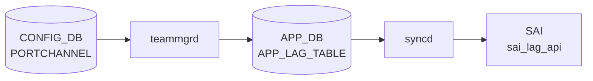

# COUNTERS_DB PortChannel/LAG カウンタ

## 概要

[COUNTERS_DB](../../reference/glossary.md#term-counters_db) は [SAI](../../reference/glossary.md#term-sai) から定期的に収集するカウンタ値を格納する揮発性 DB（DB index 2）。
PortChannel/[LAG](../../reference/glossary.md#term-lag) に関係するカウンタは 2 種類の名前マップで管理される。

- **`COUNTERS_LAG_NAME_MAP`**: LAG 名 → SAI OID のルックアップ。`portsorch` が LAG 作成/削除時に書き込む。
- **`COUNTERS_RIF_NAME_MAP`**: RIF 名 → SAI RIF OID のルックアップ。`intfsorch` が PORTCHANNEL_INTERFACE エントリが追加されたとき（L3 RIF 作成時）に書き込む。

実際のカウンタ値は `COUNTERS:<oid>` テーブルに格納され、FlexCounter が定期 polling する。
レート値（BPS/PPS）は `rif_rates.lua` Lua プラグインが `RATES:<oid>` テーブルに書き込む。

<!-- cdb-mermaid -->
### データフロー (自動生成)



!!! note "凡例"
    CONFIG_DB から SAI までの典型経路を `docs/reference/config-db-orch-map.md` から機械生成したミニ図。詳細・例外は本ページ本文と対応表を参照。
<!-- /cdb-mermaid -->

## テーブル構造

### COUNTERS_LAG_NAME_MAP

```
COUNTERS_LAG_NAME_MAP  (hash、key = "")
  <PortChannel名>  ->  <SAI LAG OID (oid:0x...)>
```

書き込み: `portsorch.cpp::addLag()` / 削除: `portsorch.cpp::removeLag()`

### COUNTERS_RIF_NAME_MAP

```
COUNTERS_RIF_NAME_MAP  (hash、key = "")
  <PortChannel名>  ->  <SAI RIF OID>
  <Ethernet名>     ->  <SAI RIF OID>
  <Vlan名>         ->  <SAI RIF OID>
```

書き込み: `intfsorch.cpp::addRifToFlexCounter()` — L3 インタフェース（PORTCHANNEL_INTERFACE エントリ存在時のみ）

### COUNTERS:\<rif\_oid\>

FlexCounter が `rifStatIds` 配列（`intfsorch.cpp:49-58`）に定義された SAI 統計を収集して格納。

## フィールド一覧 (COUNTERS:\<rif\_oid\>)

| フィールド | 型 | 説明 |
|---|---|---|
| `SAI_ROUTER_INTERFACE_STAT_IN_PACKETS` | uint64 | RIF 受信パケット数 |
| `SAI_ROUTER_INTERFACE_STAT_IN_OCTETS` | uint64 | RIF 受信バイト数 |
| `SAI_ROUTER_INTERFACE_STAT_IN_ERROR_PACKETS` | uint64 | RIF 受信エラーパケット数 |
| `SAI_ROUTER_INTERFACE_STAT_IN_ERROR_OCTETS` | uint64 | RIF 受信エラーバイト数 |
| `SAI_ROUTER_INTERFACE_STAT_OUT_PACKETS` | uint64 | RIF 送信パケット数 |
| `SAI_ROUTER_INTERFACE_STAT_OUT_OCTETS` | uint64 | RIF 送信バイト数 |
| `SAI_ROUTER_INTERFACE_STAT_OUT_ERROR_PACKETS` | uint64 | RIF 送信エラーパケット数 |
| `SAI_ROUTER_INTERFACE_STAT_OUT_ERROR_OCTETS` | uint64 | RIF 送信エラーバイト数 |

定義箇所: `sonic-swss/orchagent/intfsorch.cpp:49-58`（`rifStatIds` 配列）

## フィールド一覧 (RATES:\<rif\_oid\>)

`rif_rates.lua` Lua プラグインが `COUNTERS` の差分から計算・書き込むレート値。

| フィールド | 型 | 説明 |
|---|---|---|
| `RX_BPS` | float | 受信ビットレート (bytes/sec) — EWMA スムージング適用 |
| `TX_BPS` | float | 送信ビットレート (bytes/sec) — EWMA スムージング適用 |
| `RX_PPS` | float | 受信パケットレート (pkts/sec) — EWMA スムージング適用 |
| `TX_PPS` | float | 送信パケットレート (pkts/sec) — EWMA スムージング適用 |

定義箇所: `sonic-swss/orchagent/rif_rates.lua:69-78`

## 関連 CONFIG_DB / CLI

- CONFIG_DB: `PORTCHANNEL`、`PORTCHANNEL_INTERFACE`
- CLI: `show interfaces counters rif`（`intfstat` コマンドが `COUNTERS_RIF_NAME_MAP` を参照）
- YANG: `sonic-portchannel`

<!-- defaults -->
## コード由来暗黙デフォルト (Phase A)

> 調査証跡: `meta/_intermediate/cdb-flow/counters-portchannel-defaults.md`

COUNTERS_DB は書き込み元がコードのみであり、ユーザが直接フィールドを設定することはない。以下は orchagent / FlexCounter がどのような初期値・条件でフィールドを登録するかを示す。

### フィールド別ハードコードデフォルト・初期挙動

| フィールド/テーブル | 初期値 / デフォルト | 定義箇所 | 備考 |
|---|---|---|---|
| `COUNTERS_LAG_NAME_MAP` エントリ | LAG 作成と同時に OID を書き込み | `portsorch.cpp:8022` | LAG 削除時に `hdel` で削除 |
| `COUNTERS_RIF_NAME_MAP` エントリ | PORTCHANNEL_INTERFACE エントリ追加時のみ書き込み | `intfsorch.cpp:1537` | L2 LAG は RIF が存在しないため **登録されない** |
| `COUNTERS:<oid>` カウンタフィールド | FlexCounter 初回 poll まで存在しない | FlexCounter | HW リセット後 / 初期状態は `"0"` |
| `RATES:<oid>.RX_BPS` / `TX_BPS` / `RX_PPS` / `TX_PPS` | FlexCounter 初回実行まで存在しない | `rif_rates.lua:69-78` | 初回 poll: `INIT_DONE = "COUNTERS_LAST"` でスキップ; 2回目以降から値が書かれる |
| `RATES:RIF.RIF_ALPHA` | 外部設定（FlexCounter 設定から注入） | `rif_rates.lua:20` | 未設定時 `rif_rates.lua` は早期 return → RATES フィールドが永遠に N/A |

### Dead Field / 条件付き登録

| 条件 | 挙動 |
|---|---|
| L2 PortChannel (PORTCHANNEL_INTERFACE なし) | `COUNTERS_RIF_NAME_MAP` に登録されない。`intfstat` / `show interfaces counters rif` で参照不可 |
| L3 PortChannel (PORTCHANNEL_INTERFACE あり) | `COUNTERS_RIF_NAME_MAP` に登録され、FlexCounter が RIF カウンタを収集 |
| PortChannel 削除 | `COUNTERS_LAG_NAME_MAP` から `hdel` で即時削除 |

### SNMP 経路との差異

SNMP ifMIB (`sonic-snmpagent/mibs/ietf/rfc2863.py`) はPortChannel の統計を**各メンバポートの `SAI_PORT_STAT_*` を合算**して返す。これは `intfstat` が使う RIF ベース (`SAI_ROUTER_INTERFACE_STAT_*`) と異なる経路であり、値が一致しないことがある。

| 経路 | カウンタ種別 | 対象 LAG |
|---|---|---|
| `intfstat` / `show interfaces counters rif` | `SAI_ROUTER_INTERFACE_STAT_*` (RIF) | L3 PortChannel のみ |
| SNMP ifMIB | `SAI_PORT_STAT_*` の member ポート合算 | L2/L3 PortChannel |

### YANG-実装 Discrepancy

COUNTERS_DB にスキーマを定義する YANG は存在しない（orchagent が動的に書き込む）。以下は実装レベルの discrepancy。

- **L2 PortChannel のカウンタ空白**: `intfstat` は L2 LAG に対して "Interface missing from COUNTERS_RIF_NAME_MAP" エラーを返す。カウンタを得るには `show interfaces portchannel` または SNMP を使う必要がある。
- **RATES 初期欠損**: FlexCounter 起動直後は `RX_BPS` 等が欠損しており `N/A` になる。alpha 未設定時は再起動しても `N/A` のまま。

<!-- /defaults -->

<!-- ordering -->
## 書込み順依存 (Phase B)

> 調査証跡: `meta/_intermediate/cdb-flow/counters-portchannel-ordering.md`

### COUNTERS_LAG_NAME_MAP の書込み順序

`portsorch` が `APP_LAG_TABLE_NAME`（`teamd` → `intfmgrd` → `orchagent`）からの SET イベントを受けて `doLagTask()` → `addLag()` を呼び出す。

```
[前提] allPortsReady() == true（全物理ポート初期化完了）   # portsorch.cpp:6513-6514
  ↓
doLagTask() → addLag(alias, lag_id, switch_id)             # portsorch.cpp:6529, 7941
  ↓
sai_lag_api->create_lag()                                  # portsorch.cpp:7994
  ↓
m_counterLagTable->set("", fields)                         # portsorch.cpp:8022
  → COUNTERS_DB COUNTERS_LAG_NAME_MAP に <alias> → <lag_oid> を書き込み
```

**全物理ポートの初期化完了（PortInitDone）が LAG カウンタ登録より前に必要**。
`allPortsReady()` = `m_initDone && m_pendingPortSet.empty()` (`portsorch.cpp:1685-1688`)。
LAG 設定が PortInitDone 前に届いた場合、`doLagTask()` はスキップされ PortInitDone 受信後に自動処理される。<!-- evidence: portsorch.cpp L6513-6517 -->

削除時: `removeLag()` が SAI DEL 後に `m_counterLagTable->hdel("")` で即時削除する (`portsorch.cpp:8045+`)。

### COUNTERS_RIF_NAME_MAP の書込み順序

RIF カウンタ登録は 2 段階の遅延登録（`m_rifsToAdd` キュー＋タイマー）で行われる。

```
[step 1] intfsorch::doTask(Consumer)              # intfsorch.cpp:661
  前提: allPortsReady() == true                   # intfsorch.cpp:665
  前提: gPortsOrch->getPort(alias, port) が成功
        （portsorch が PORTCHANNEL を先に処理し m_portList に登録済み）
                                                  # intfsorch.cpp:905, 922-924
  ↓
  setIntf() → create_router_interface()           # intfsorch.cpp:1296
  ↓
  m_rifsToAdd.push_back(port)                     # intfsorch.cpp:1310
  （RIF 作成済みだが FlexCounter 登録はまだ）

[step 2] intfsorch::doTask(SelectableTimer)       # intfsorch.cpp:1598
  ループで m_rifsToAdd を走査
  ↓
  m_vidToRidTable->hget("", id, value) が成功
  （ASIC_DB の VID→RID マッピング確定まで 1 s 周期で再試行）
  ↓
  addRifToFlexCounter(id, alias, type)            # intfsorch.cpp:1630
  → m_rifNameTable->set()
     = COUNTERS_DB COUNTERS_RIF_NAME_MAP に <alias> → <rif_oid> を書き込み
```

### 依存グラフ

```
CONFIG_DB PORTCHANNEL
  ↓ teamd → intfmgrd → APP_DB APP_LAG_TABLE_NAME
portsorch::doLagTask()            [前提: allPortsReady()]
  → sai_lag_api::create_lag()
  → COUNTERS_DB COUNTERS_LAG_NAME_MAP  ← LAG OID 登録

CONFIG_DB PORTCHANNEL_INTERFACE
  ↓ intfmgrd → APP_DB INTF_TABLE_NAME
intfsorch::doTask(Consumer)       [前提: allPortsReady() + LAG が m_portList に存在]
  → create_router_interface()
  → m_rifsToAdd.push_back()
  ↓ (タイマー、ASIC_DB VID→RID 確定後)
intfsorch::doTask(SelectableTimer)
  → addRifToFlexCounter()
  → COUNTERS_DB COUNTERS_RIF_NAME_MAP  ← RIF OID 登録
  ↓
FlexCounter (RIF_STAT_COUNTER_FLEX_COUNTER_GROUP)  → COUNTERS:<rif_oid>
```

### 書込み順序違反時の挙動

| 違反パターン | 結果 |
|---|---|
| `PORTCHANNEL_INTERFACE` が `PORTCHANNEL` より先に設定された場合 | `intfsorch` が `getPort()` 失敗 → `it++` で retry。`PORTCHANNEL` 処理完了後の次サイクルで自動回復 |
| PortInitDone 前に LAG 設定が届いた場合 | `allPortsReady()` = false → `doLagTask()` スキップ。PortInitDone 受信後に自動処理 |
| ASIC_DB VID→RID 未確定時 | `m_rifsToAdd` にキューイング、タイマー周期（約 1 s）ごとに再試行 |

<!-- /ordering -->

<!-- cross-refs -->
## 暗黙参照テーブル (Phase C)

> 調査証跡: `meta/_intermediate/cdb-flow/counters-portchannel-cross-refs.md`

`portsorch` / `intfsorch` が `COUNTERS_LAG_NAME_MAP` / `COUNTERS_RIF_NAME_MAP` を書き込む際に
YANG leafref として宣言されていない以下の DB / テーブルを暗黙的に参照する。

| 参照先 | DB | 参照タイミング | YANG leafref | 実装上の必須度 | 証拠 |
|---|---|---|---|---|---|
| `gPortsOrch` (`m_portList` / `allPortsReady()`) | APP_DB (LAG/PORT テーブル) | `intfsorch::doTask()` 冒頭・`PORTCHANNEL_INTERFACE` SET 処理時 | なし | `allPortsReady() = false` → doTask 早期 return。LAG が `m_portList` 未登録 → `getPort()` 失敗 → retry | `intfsorch.cpp:665`, `intfsorch.cpp:905` |
| `ASIC_DB VIDTORID` | ASIC_DB | タイマーループ内（gTraditionalFlexCounter 時のみ） | なし | VID→RID 確定前は `addRifToFlexCounter()` を呼ばない。約 1 s 周期で再試行 | `intfsorch.cpp:68,75,1627` |
| `COUNTERS_DB COUNTERS_RIF_TYPE_MAP` | COUNTERS_DB | `addRifToFlexCounter()` 内 | なし | `COUNTERS_RIF_NAME_MAP` と同時書き込み。削除も同時 (`removeRifFromFlexCounter`) | `intfsorch.cpp:71,1535-1538,1561` |
| `FLEX_COUNTER_DB RIF_STAT グループ` | FLEX_COUNTER_DB | `addRifToFlexCounter()` の末尾 | なし | `startFlexCounterPolling()` で `RIF_STAT_COUNTER_FLEX_COUNTER_GROUP:<rif_oid>` に `RIF_COUNTER_ID_LIST` を書き込む。FlexCounter が実際の SAI 収集を担う | `intfsorch.cpp:1540-1551` |

### 参照関係の解決タイミング

- **gPortsOrch 依存**: `intfsorch::doTask()` 冒頭の `allPortsReady()` チェックおよび `getPort()` で即座に解決。失敗時は当該イテレーションをスキップし、次のサイクルで自動再試行。
- **ASIC_DB VIDTORID 依存**: `gTraditionalFlexCounter = true` 環境でのみ有効。タイマー（約 1 s 間隔）ループで `hget` 成功後に `addRifToFlexCounter()` を呼び出す。VIDTORID エントリが存在しない間は `COUNTERS_RIF_NAME_MAP` に登録されない。
- **COUNTERS_RIF_TYPE_MAP**: `COUNTERS_RIF_NAME_MAP` と常にアトミックに同期。どちらか一方のみが残存する状態は発生しない（同一関数内で連続書き込み）。
- **FLEX_COUNTER_DB**: COUNTERS_RIF_NAME_MAP への書き込み直後に `startFlexCounterPolling()` を呼ぶ。FLEX_COUNTER_DB エントリがない場合、FlexCounter は RIF カウンタを収集せず `COUNTERS:<rif_oid>` フィールドが存在しない。

!!! note "YANG 非定義の暗黙制約"
    上記いずれの参照も `sonic-portchannel.yang` / `sonic-flex_counter.yang` に leafref として記述されていない。
    `show interfaces counters rif` でカウンタが表示されない場合は `COUNTERS_RIF_NAME_MAP` の存在確認（RIF 未登録）、
    `allPortsReady()` の完了状態、ASIC_DB VIDTORID の確定状態を順番に確認すること。

<!-- /cross-refs -->

<!-- failure -->
## 障害挙動 (Phase D)

> 調査証跡: `meta/_intermediate/cdb-flow/counters-portchannel-failure.md`

### SAI LAG 作成失敗（`addLag`）

`sai_lag_api->create_lag()` が失敗した場合、`handleSaiCreateStatus()` + `parseHandleSaiStatusFailure()` で以下に分岐する（`portsorch.cpp:7994-8003`）。

| SAI 失敗種別 | `parseHandleSaiStatusFailure` 返値 | `doLagTask` の処理 | COUNTERS_LAG_NAME_MAP |
|---|---|---|---|
| `task_need_retry` | `false` | `it++` で `m_toSync` に残し次サイクル retry | 書き込まれない |
| `task_failed` | `true` | エントリ破棄（`erase`） | 書き込まれない |

どちらの場合も **COUNTERS_LAG_NAME_MAP への書き込みは発生しない**。LAG の再設定（DEL → SET）が回復策。

### SAI LAG 削除失敗（`removeLag`）

`sai_lag_api->remove_lag()` が `task_failed` を返した場合、`m_counterLagTable->hdel()` に到達しない（`portsorch.cpp:8074-8095`）。

- **COUNTERS_LAG_NAME_MAP に stale OID が残存する**。
- HW 上の LAG は存在しないが COUNTERS_DB 上のマップエントリは残り、`intfstat` / FlexCounter が無効 OID を参照し続ける。

`m_port_ref_count > 0` / `m_members.size() > 0` / VLAN 残存でのガード失敗は SAI を呼ばず `return false` するため、COUNTERS_LAG_NAME_MAP は変化しない（consumer.m_toSync で retry）。

### RIF 作成失敗（`setIntf` / `intfsorch`）

`create_router_interface()` 失敗時は `throw runtime_error` で即座に例外終了する（`intfsorch.cpp:1296-1303`）。`m_rifsToAdd.push_back()` に到達しないため **COUNTERS_RIF_NAME_MAP への書き込みが発生しない**。PORTCHANNEL_INTERFACE エントリの再設定が必要。

### FlexCounter 登録遅延（VID→RID 未確定）

RIF が `m_rifsToAdd` にキューイング後、タイマーループ（`intfsorch.cpp:1598-1637`）で `ASIC_DB VIDTORID` の確定を待つ間は `addRifToFlexCounter()` が呼ばれない。約 1 秒周期で自動再試行されるため、通常は起動後数秒以内に自動回復する。`gTraditionalFlexCounter = false` の環境ではこの待機なしで即座に登録される。

### 障害パターン一覧

| 障害パターン | COUNTERS_LAG_NAME_MAP | COUNTERS_RIF_NAME_MAP | 回復経路 |
|---|---|---|---|
| SAI create_lag 失敗（need_retry） | 書き込まれない | — | 次サイクル自動 retry |
| SAI create_lag 失敗（task_failed） | 書き込まれない | — | LAG 再設定（DEL→SET）が必要 |
| SAI remove_lag 失敗（task_failed） | **stale OID 残存** | 変化なし | SAI リセット / LAG 再設定が必要 |
| LAG メンバ/VLAN 残存での remove 試行 | 変化なし | 変化なし | 依存解消後に自動 retry |
| create_router_interface 失敗 | 変化なし | 書き込まれない | INTF エントリ再設定が必要 |
| VID→RID 未確定（gTraditionalFlexCounter） | 変化なし | 遅延（自動回復） | タイマーループが約 1 s 周期で再試行 |

<!-- /failure -->

<!-- constants -->
## ハードコード定数 (Phase E)

> 調査証跡: `meta/_intermediate/cdb-flow/counters-portchannel-ordering.md`

`portsorch` / `intfsorch` が COUNTERS_DB に書き込む際に使用する、CONFIG_DB / YANG で管理されないハードコード定数の一覧。

### FlexCounter グループパラメータ (RIF カウンタ)

| 定数名 | 値 | 用途 | ソース |
|---|---|---|---|
| `RIF_STAT_COUNTER_FLEX_COUNTER_GROUP` | `"RIF_STAT_COUNTER"` | FlexCounter グループ名。`FLEX_COUNTER_DB` のキーに使用 | `intfsorch.h:19` |
| `RIF_FLEX_STAT_COUNTER_POLL_MSECS` | `"1000"` ms | RIF カウンタのポーリング間隔デフォルト値（1 秒）。CONFIG_DB `FLEX_COUNTER_TABLE|RIF` の `POLL_INTERVAL` で上書き可能 | `intfsorch.h:21` |
| `STATS_MODE_READ` | `"STATS_MODE_READ"` | カウンタ収集モード。RIF はリードオンリー（クリアなし）で固定 | `intfsorch.cpp:98`, `swss-common/schema.h:323` |
| `RIF_COUNTER_ID_LIST` | `"RIF_COUNTER_ID_LIST"` | FlexCounter に登録する際のフィールドキー名 | `swss-common/schema.h:302` |

### `rifStatIds` — FlexCounter に登録する SAI 統計 ID

`intfsorch.cpp:49-58` に `static const vector<sai_router_interface_stat_t>` としてハードコードされた 8 統計。CONFIG_DB / YANG での変更は不可。

| 位置 | 統計 ID |
|---|---|
| `[0]` | `SAI_ROUTER_INTERFACE_STAT_IN_PACKETS` |
| `[1]` | `SAI_ROUTER_INTERFACE_STAT_IN_OCTETS` |
| `[2]` | `SAI_ROUTER_INTERFACE_STAT_IN_ERROR_PACKETS` |
| `[3]` | `SAI_ROUTER_INTERFACE_STAT_IN_ERROR_OCTETS` |
| `[4]` | `SAI_ROUTER_INTERFACE_STAT_OUT_PACKETS` |
| `[5]` | `SAI_ROUTER_INTERFACE_STAT_OUT_OCTETS` |
| `[6]` | `SAI_ROUTER_INTERFACE_STAT_OUT_ERROR_PACKETS` |
| `[7]` | `SAI_ROUTER_INTERFACE_STAT_OUT_ERROR_OCTETS` |

### `rif_rates.lua` — RATES テーブル計算の埋め込み定数

| 定数 | 用途 | ソース |
|---|---|---|
| `"RIF_ALPHA"` キー | EWMA 平滑化係数。`RATES:RIF:RIF_ALPHA` を `HGET` して取得。未設定（nil）時は Lua スクリプトが即 return → RATES フィールドが永遠に書かれない | `rif_rates.lua:20-22` |
| `"INIT_DONE"` / `"COUNTERS_LAST"` / `"DONE"` | RATES 計算の初期化状態フラグ。初回 poll は `"COUNTERS_LAST"` を書いてスキップし、2 回目以降から差分計算を実施 | `rif_rates.lua:31,44,79,82` |
| `"RX_BPS"`, `"TX_BPS"`, `"RX_PPS"`, `"TX_PPS"` | `RATES:<rif_oid>` に書き込むフィールド名（固定文字列） | `rif_rates.lua:69-72` |

!!! warning "RIF_ALPHA 未設定時の永続 N/A"
    `RATES:RIF:RIF_ALPHA` が設定されていない場合、`rif_rates.lua` は `alpha` を `nil` として EWMA を計算できず即 return する。その結果、`RATES:<rif_oid>` の `RX_BPS` 等は**再起動しても N/A のまま**となる。`intfstat` コマンドが BPS/PPS を表示しない場合は `sonic-db-cli COUNTERS_DB hget RATES:RIF RIF_ALPHA` で確認すること。

<!-- /constants -->

<!-- side-effects -->
## 副次 DB 書込 (Phase F)

> 調査証跡: `meta/_intermediate/cdb-flow/counters-portchannel-ordering.md`

`portsorch` / `intfsorch` が `COUNTERS_LAG_NAME_MAP` / `COUNTERS_RIF_NAME_MAP` を書き込む際に、
CONFIG_DB とは別の DB（FLEX_COUNTER_DB / COUNTERS_DB 内の他テーブル）に以下を副次的に書き込む。

### COUNTERS_RIF_TYPE_MAP（同時書き込み）

`addRifToFlexCounter()` は `COUNTERS_RIF_NAME_MAP` と**同一関数内で連続して** `COUNTERS_RIF_TYPE_MAP` にも書き込む (`intfsorch.cpp:1535-1538`)。

| タイミング | テーブル | フィールド | 値 |
|---|---|---|---|
| RIF 作成 (`addRifToFlexCounter`) | `COUNTERS_RIF_TYPE_MAP` | `<rif_oid>` | `"SAI_ROUTER_INTERFACE_TYPE_PORT"` (LAG/PHY) / `"SAI_ROUTER_INTERFACE_TYPE_VLAN"` / `"SAI_ROUTER_INTERFACE_TYPE_SUB_PORT"` |
| RIF 削除 (`removeRifFromFlexCounter`) | `COUNTERS_RIF_TYPE_MAP` | `<rif_oid>` | `hdel` で削除 |

`COUNTERS_RIF_NAME_MAP` と `COUNTERS_RIF_TYPE_MAP` は常にアトミックに同期する（どちらか一方のみが残存する状態は発生しない）。

確認コマンド:

```bash
sonic-db-cli COUNTERS_DB hgetall COUNTERS_RIF_TYPE_MAP
```

### FLEX_COUNTER_DB（RIF ポーリング登録）

`addRifToFlexCounter()` の末尾で `startFlexCounterPolling()` が呼ばれ、`FLEX_COUNTER_DB` の `RIF_STAT_COUNTER_FLEX_COUNTER_GROUP` グループにエントリを書き込む (`intfsorch.cpp:1541-1551`, `saihelper.cpp:1033-1050`)。

| タイミング | DB | キー | フィールド | 値 |
|---|---|---|---|---|
| RIF 作成（gTraditionalFlexCounter=true 時） | `FLEX_COUNTER_DB` | `RIF_STAT_COUNTER:<rif_oid>` | `RIF_COUNTER_ID_LIST` | 8 統計 ID の comma 区切り文字列 |
| RIF 作成（gTraditionalFlexCounter=true 時） | `FLEX_COUNTER_DB` | `RIF_STAT_COUNTER:<rif_oid>` | `STATS_MODE` | `"STATS_MODE_READ"` |
| RIF 削除 | `FLEX_COUNTER_DB` | `RIF_STAT_COUNTER:<rif_oid>` | — | エントリ削除 (`stopFlexCounterPolling`) |

`gTraditionalFlexCounter=false`（非 traditional モード）の場合は `FLEX_COUNTER_DB` に書かず SAI API を直接呼ぶ (`saihelper.cpp:1052-1063`)。

### COUNTERS_DB COUNTERS:\<rif_oid\>（FlexCounter 経由）

`FLEX_COUNTER_DB` にエントリが登録されると `syncd` の FlexCounter が定期的に SAI から統計を収集し、`COUNTERS_DB` の `COUNTERS:<rif_oid>` ハッシュを更新する。

| 誰が書くか | テーブル | タイミング |
|---|---|---|
| `syncd` FlexCounter | `COUNTERS:<rif_oid>` | RIF 登録後、`POLL_INTERVAL`（デフォルト 1000 ms）ごとに更新 |

### COUNTERS_DB RATES:\<rif_oid\>（rif_rates.lua 経由）

`intfsorch` コンストラクタが `rif_rates.lua` を Redis に登録し、FlexCounter プラグインとして定期実行する。プラグインは `COUNTERS:<rif_oid>` の差分から BPS/PPS を計算して `RATES:<rif_oid>` に書き込む。

| 前提条件 | テーブル | フィールド | 値 |
|---|---|---|---|
| `RATES:RIF:RIF_ALPHA` が設定済み | `RATES:<rif_oid>` | `RX_BPS`, `TX_BPS`, `RX_PPS`, `TX_PPS` | EWMA 平滑化後の float 値 |
| `RATES:RIF:RIF_ALPHA` が未設定 | — | — | プラグインが早期 return → フィールドが N/A のまま |

### 副次書込み一覧

| 操作 | 副次書込み先 | 内容 |
|---|---|---|
| LAG 作成 (`addLag`) | `COUNTERS_DB COUNTERS_LAG_NAME_MAP` | LAG OID 登録（主テーブル） |
| RIF 作成 (`addRifToFlexCounter`) | `COUNTERS_DB COUNTERS_RIF_NAME_MAP` | RIF OID 登録（主テーブル） |
| RIF 作成 (`addRifToFlexCounter`) | `COUNTERS_DB COUNTERS_RIF_TYPE_MAP` | RIF タイプ文字列登録（副次） |
| RIF 作成 (`startFlexCounterPolling`) | `FLEX_COUNTER_DB RIF_STAT_COUNTER:<rif_oid>` | ポーリング対象登録（副次） |
| FlexCounter ループ | `COUNTERS_DB COUNTERS:<rif_oid>` | SAI 統計値（副次・定期更新） |
| rif_rates.lua プラグイン | `COUNTERS_DB RATES:<rif_oid>` | BPS/PPS レート値（副次・定期更新） |

<!-- /side-effects -->

<!-- pubsub -->
## Redis 通知メカニズム (Phase G)

> 調査証跡: `meta/_intermediate/cdb-flow/counters-portchannel-ordering.md`

### 書き込み方式 — ProducerStateTable を使わない直接 HSET

`portsorch` の `m_counterLagTable` および `intfsorch` の `m_rifNameTable` / `m_rifTypeTable` はいずれも **`swsscommon::Table`** インスタンスであり、`ProducerStateTable` ではない (`portsorch.cpp:762`, `intfsorch.cpp:70-71`)。

このため `COUNTERS_LAG_NAME_MAP` / `COUNTERS_RIF_NAME_MAP` / `COUNTERS_RIF_TYPE_MAP` への書き込みは Redis HSET コマンドで直接実行され、**`<TABLE>_CHANNEL@2` への PUBLISH は発生しない**。

### 消費側のポーリングアクセス

これらのマップを参照するツールはすべてポーリング（都度 HGET / HGETALL）でアクセスする。keyspace notification の購読は行っていない。

| 消費プロセス / CLI | アクセス方式 | 参照テーブル | 用途 |
|---|---|---|---|
| `intfstat` (sonic-utilities) | 起動時 1 回の `HGETALL` | `COUNTERS_RIF_NAME_MAP` | RIF 名 → OID 解決 |
| `vnet_route_check.py` | 起動時 1 回の `swsscommon::Table` 参照 | `COUNTERS_RIF_NAME_MAP` | VNet ルート確認用 RIF OID 解決 |
| `FlexCounter` (syncd) | `FLEX_COUNTER_DB` エントリを直接読み取り | `FLEX_COUNTER_DB RIF_STAT_COUNTER:<rif_oid>` | SAI 統計ポーリング（`COUNTERS_RIF_NAME_MAP` は参照しない） |
| `snmpagent` | SNMP ポーリングごとに `COUNTERS_DB` HGET | `COUNTERS_LAG_NAME_MAP` / `COUNTERS:<oid>` | LAG OID 経由のポート統計集計 |

### FlexCounter が `COUNTERS_DB COUNTERS:<rif_oid>` を更新する仕組み

`COUNTERS_RIF_NAME_MAP` は FlexCounter から直接購読されるのではなく、`intfsorch` が `addRifToFlexCounter()` 内で `FLEX_COUNTER_DB RIF_STAT_COUNTER:<rif_oid>` に `RIF_COUNTER_ID_LIST` を書き込む副次操作によって FlexCounter のポーリング対象が登録される。FlexCounter は `FLEX_COUNTER_DB` のエントリを購読し（`ConsumerStateTable` 経由）、SAI 収集結果を `COUNTERS_DB COUNTERS:<rif_oid>` に書き込む。

```
FLEX_COUNTER_DB (ConsumerStateTable / subscribe)
  ← intfsorch が addRifToFlexCounter() で RIF_STAT_COUNTER:<rif_oid> を書き込む
     ↓ (FlexCounter ループ)
COUNTERS_DB COUNTERS:<rif_oid>  ← SAI 収集値が書き込まれる
```

### keyspace notification 不使用の影響

`COUNTERS_LAG_NAME_MAP` / `COUNTERS_RIF_NAME_MAP` は PUBLISH を発生させないため:

- **ホットパス外での参照**: `intfstat` などのツールは起動都度 HGETALL を実行する。常時更新を受け取る仕組みがない。
- **RIF 登録タイミングのズレ**: `addRifToFlexCounter()` が呼ばれるまで（タイマー非同期）、`intfstat` の HGETALL はエントリ不在を返す。エラーメッセージ `"Interface missing from COUNTERS_RIF_NAME_MAP!"` はこの中間状態で発生する。
- **外部ツールによる動的監視**: `intfstat -p <interval>` で定期ポーリングを実行する場合、内部的には毎回 HGETALL を発行している（`intfstat:168-197`）。

<!-- /pubsub -->

<!-- platform -->
## プラットフォーム / SAI Capability 差異 (Phase H)

> 調査証跡: `meta/_intermediate/cdb-flow/counters-portchannel-platform.md`

`COUNTERS_LAG_NAME_MAP` / `COUNTERS_RIF_NAME_MAP` の書き込み自体はプラットフォームを問わず同じコードパスを通るが、以下のプラットフォーム固有の差異が存在する。

### VoQ スイッチ — リモート LAG OID が COUNTERS_LAG_NAME_MAP に混在

`gMySwitchType == "voq"` 環境では `portsorch::addLag()` が `SAI_LAG_ATTR_SYSTEM_PORT_AGGREGATE_ID` を付与して `create_lag()` を呼ぶ (`portsorch.cpp:7962-7991`)。さらに `doVoqSystemLagTask()` が CHASSIS_APP_DB から届くリモートシステム LAG エントリに対しても `addLag()` を呼ぶため、**ローカル PortChannel の OID とリモートシステム LAG の OID が COUNTERS_LAG_NAME_MAP に共存する**。キー名はローカルが `PortChannelXXXX`、リモートが `<hostname>|<asic>|PortChannelXXXX` で区別できる。

| スイッチ種別 | COUNTERS_LAG_NAME_MAP に登録されるキー |
|---|---|
| 通常スイッチ | `PortChannelXXXX` のみ |
| VoQ スイッチ (multi-asic) | ローカル `PortChannelXXXX` ＋ リモート `<host>\|<asic>\|PortChannelXXXX` |

### Mellanox — LAG メンバ有効/無効の操作順序が異なる（COUNTERS_DB への影響なし）

Mellanox SAI は collection=false かつ distribution=true の「distribution-only 中間状態」をサポートしないため、`setCollectionOnLagMember()` / `setDistributionOnLagMember()` の呼び出し順が通常とは逆になる (`portsorch.cpp:6361-6382`、コメントに明記)。ただしこれは `SAI_LAG_MEMBER_ATTR_INGRESS_DISABLE` / `SAI_LAG_MEMBER_ATTR_EGRESS_DISABLE` のみの問題であり、`COUNTERS_LAG_NAME_MAP` / `COUNTERS_RIF_NAME_MAP` の書き込みには影響しない。

### `gTraditionalFlexCounter` による RIF カウンタ登録タイミング差

`gTraditionalFlexCounter = true` 環境（一部旧構成・VS デフォルト）では `intfsorch` がタイマーループで `ASIC_DB VIDTORID` の確定を待ってから `COUNTERS_RIF_NAME_MAP` を書き込む (`intfsorch.cpp:1627`)。`gTraditionalFlexCounter = false` の環境では即座に書き込まれる。前者ではポートチャンネル RIF 作成後、`COUNTERS_RIF_NAME_MAP` への反映まで最大数秒の遅延がある。

### VS（Virtual Switch）— RIF カウンタ値は 0 固定

Virtual Switch SAI（`sonic-sairedis/vslib`）は `SAI_OBJECT_TYPE_ROUTER_INTERFACE` 統計を stub 応答するため、`COUNTERS:<rif_oid>` の IN/OUT パケット・バイト数は常に 0。`RATES:<rif_oid>` の BPS/PPS も計算上 0 となる。`intfstat` は動作するが実トラフィックを反映しない。

### RIF stat セット — プラットフォーム共通

`rifStatIds`（`intfsorch.cpp:49-58`）の 8 統計はすべてのプラットフォームで共通であり、プラットフォームごとに変化しない。SAI が特定の stat に対して `SAI_STATUS_NOT_SUPPORTED` を返した場合、FlexCounter はその stat を 0 で書き込む（エラーをログして継続）。個別 stat の capability チェックはコード中に存在しない。

<!-- /platform -->

## 運用ヒント

```bash
# L3 PortChannel の RIF カウンタ確認
show interfaces counters rif

# 個別 PortChannel の詳細
intfstat -i PortChannel0001

# COUNTERS_DB を直接確認 (OID は COUNTERS_RIF_NAME_MAP から取得)
sonic-db-cli COUNTERS_DB hget COUNTERS_RIF_NAME_MAP PortChannel0001
sonic-db-cli COUNTERS_DB hgetall 'COUNTERS:<取得した OID>'

# RATES フィールド確認
sonic-db-cli COUNTERS_DB hgetall 'RATES:<取得した OID>'

# LAG OID マップ確認
sonic-db-cli COUNTERS_DB hgetall COUNTERS_LAG_NAME_MAP
```

## 引用元

- `intfsorch.cpp:49-58`: `rifStatIds` — FlexCounter に登録する SAI_ROUTER_INTERFACE_STAT_* 一覧
- `portsorch.cpp:762`: `COUNTERS_LAG_NAME_MAP` テーブル初期化
- `rif_rates.lua:1-92`: RATES テーブルへの BPS/PPS 書き込みロジック
- `sonic-utilities/scripts/intfstat:63-71`: `counter_names` 定義（`show interfaces counters rif` が参照）
- `sonic-snmpagent/mibs/__init__.py:407`: SNMP LAG カウンタ取得経路

<!-- ref-triangle:start -->

## 関連リファレンス

- CONFIG_DB: [`PORTCHANNEL`](./portchannel.md)
- CONFIG_DB: [`PORTCHANNEL_INTERFACE`](./portchannel-interface.md)

<!-- ref-triangle:end -->
