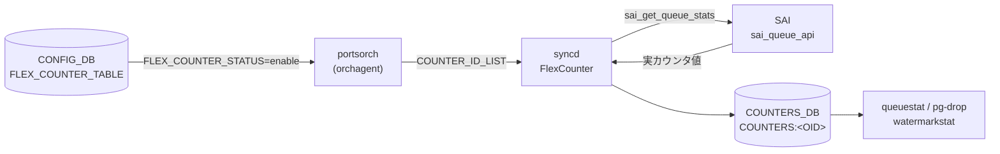

# COUNTERS_DB キュー / PG カウンタテーブル群

## 概要

[SONiC](../../reference/glossary.md#term-sonic) の `portsorch`（[orchagent](../../reference/glossary.md#term-orchagent) 内）は、ポートの Queue（送信キュー）と Priority Group（優先度グループ、PG）ごとの [SAI](../../reference/glossary.md#term-sai) ハードウェアカウンタを [COUNTERS_DB](../../reference/glossary.md#term-counters_db) に収集する[^1]。このページではカウンタ収集に使われる Redis テーブル群・フィールド一覧・FlexCounter グループのコード由来デフォルトを解説する。

<!-- cdb-mermaid -->
### データフロー (自動生成)



!!! note "凡例"
    CONFIG_DB の `FLEX_COUNTER_TABLE` でポーリングを有効化し、orchagent が `COUNTER_ID_LIST` を syncd に投入することでカウンタ収集が開始する。
<!-- /cdb-mermaid -->

---

## COUNTERS_DB テーブル体系

### ベースカウンタ / マッピングテーブル

| テーブル名 | 内容 | 書き込み主体 |
|-----------|------|------------|
| `COUNTERS:<OID>` | 各 Queue / PG の SAI カウンタ値（field=value） | syncd FlexCounter |
| `COUNTERS_QUEUE_NAME_MAP` | `<port>:<queue_index>` → SAI OID のハッシュ | portsorch |
| `COUNTERS_VOQ_NAME_MAP` | VoQ 用 `<sysport>:<index>` → SAI OID | portsorch（VoQ モードのみ） |
| `COUNTERS_QUEUE_PORT_MAP` | Queue OID → ポート OID のハッシュ | portsorch |
| `COUNTERS_QUEUE_INDEX_MAP` | Queue OID → キューインデックス（0 始まり） | portsorch |
| `COUNTERS_QUEUE_TYPE_MAP` | Queue OID → `SAI_QUEUE_TYPE_UNICAST` / `SAI_QUEUE_TYPE_MULTICAST` 等 | portsorch |
| `COUNTERS_PG_NAME_MAP` | `<port>:<pg_index>` → SAI OID のハッシュ | portsorch |
| `COUNTERS_PG_PORT_MAP` | PG OID → ポート OID のハッシュ | portsorch |
| `COUNTERS_PG_INDEX_MAP` | PG OID → PG インデックス（0 始まり） | portsorch |

### ウォーターマークテーブル

| テーブルプレフィクス | 内容 |
|--------------------|------|
| `PERIODIC_WATERMARKS:<OID>` | 周期リセット型ウォーターマーク（counterpoll 周期ごとにクリア） |
| `PERSISTENT_WATERMARKS:<OID>` | 永続型ウォーターマーク（手動 clear まで保持） |
| `USER_WATERMARKS:<OID>` | ユーザークリア後からの累積（`watermarkstat -c` でリセット） |

---

## キー形式

```text
COUNTERS:<hex_oid>
COUNTERS_QUEUE_NAME_MAP  field="Ethernet0:0"  value="0x00000000000001a0"
COUNTERS_PG_NAME_MAP     field="Ethernet0:3"  value="0x00000000000001b0"
```

- Queue: `<port_alias>:<queue_index>`（例: `Ethernet0:0`）
- VoQ: `<system_port_alias>:<queue_index>`（例: `Linecard1|ASIC0|Ethernet0:0`）
- PG: `<port_alias>:<pg_index>`（例: `Ethernet0:3`）

---

## SAI カウンタフィールド一覧

### Queue 通常カウンタ（QUEUE グループ）

`FLEX_COUNTER_TABLE|QUEUE` が `enable` のときに収集。ソース: `portsorch.cpp` の `queue_stat_ids`[^2]。

| COUNTERS:<OID> フィールド | 説明 |
|--------------------------|------|
| `SAI_QUEUE_STAT_PACKETS` | 送信パケット数（合計） |
| `SAI_QUEUE_STAT_BYTES` | 送信バイト数（合計） |
| `SAI_QUEUE_STAT_DROPPED_PACKETS` | ドロップパケット数 |
| `SAI_QUEUE_STAT_DROPPED_BYTES` | ドロップバイト数 |
| `SAI_QUEUE_STAT_TRIM_PACKETS` | パケットトリミング発生数 |
| `SAI_QUEUE_STAT_DROPPED_TRIM_PACKETS` | トリミング後ドロップ数 |
| `SAI_QUEUE_STAT_TX_TRIM_PACKETS` | トリミング後送信数 |

VoQ モードでは追加フィールド `SAI_QUEUE_STAT_CREDIT_WD_DELETED_PACKETS`（Credit Watchdog 削除パケット数）が加わる。

### Queue ウォーターマーク（QUEUE_WATERMARK グループ）

`FLEX_COUNTER_TABLE|QUEUE_WATERMARK` が `enable` のときに収集。`StatsMode::READ_AND_CLEAR`（ポーリングごとに SAI 側リセット）。

| フィールド | 説明 |
|---------|------|
| `SAI_QUEUE_STAT_SHARED_WATERMARK_BYTES` | 共有バッファ使用量ウォーターマーク（バイト） |

### WRED/ECN Queue カウンタ（WRED_ECN_QUEUE グループ）

`FLEX_COUNTER_TABLE|WRED_ECN_QUEUE` が `enable` かつ SAI が WRED ケイパビリティをサポートする場合のみ収集[^3]。

| フィールド | 説明 |
|---------|------|
| `SAI_QUEUE_STAT_WRED_ECN_MARKED_PACKETS` | ECN マーキングパケット数 |
| `SAI_QUEUE_STAT_WRED_ECN_MARKED_BYTES` | ECN マーキングバイト数 |
| `SAI_QUEUE_STAT_WRED_DROPPED_PACKETS` | WRED ドロップパケット数 |
| `SAI_QUEUE_STAT_WRED_DROPPED_BYTES` | WRED ドロップバイト数 |

### PG ドロップカウンタ（PG_DROP グループ）

`FLEX_COUNTER_TABLE|PG_DROP` が `enable` のときに収集。`StatsMode::READ`。

| フィールド | 説明 |
|---------|------|
| `SAI_INGRESS_PRIORITY_GROUP_STAT_DROPPED_PACKETS` | イングレス PG ドロップパケット数 |

### PG ウォーターマーク（PG_WATERMARK グループ）

`FLEX_COUNTER_TABLE|PG_WATERMARK` が `enable` のときに収集。`StatsMode::READ_AND_CLEAR`。

| フィールド | 説明 |
|---------|------|
| `SAI_INGRESS_PRIORITY_GROUP_STAT_XOFF_ROOM_WATERMARK_BYTES` | XOFF リザーブ使用量ウォーターマーク（バイト） |
| `SAI_INGRESS_PRIORITY_GROUP_STAT_SHARED_WATERMARK_BYTES` | 共有バッファ使用量ウォーターマーク（バイト） |

---

## FlexCounter グループとハードコードデフォルト

各グループは `portsorch.h` / `portsorch.cpp` にコード直書きの FlexCounter グループ名とポーリング間隔を持つ[^4]。

| FlexCounter グループ名 | CONFIG_DB キー | StatsMode | コードデフォルトポーリング間隔 | counterpoll CLI 上書き可否 |
|--------------------|--------------|-----------|--------------------------|--------------------------|
| `QUEUE_STAT_COUNTER` | `FLEX_COUNTER_TABLE\|QUEUE` | READ | 10000 ms | 可（`counterpoll queue interval`） |
| `QUEUE_WATERMARK_STAT_COUNTER` | `FLEX_COUNTER_TABLE\|QUEUE_WATERMARK` | READ_AND_CLEAR | 60000 ms | 可 |
| `PG_DROP_STAT_COUNTER` | `FLEX_COUNTER_TABLE\|PG_DROP` | READ | 10000 ms | 可 |
| `PG_WATERMARK_STAT_COUNTER` | `FLEX_COUNTER_TABLE\|PG_WATERMARK` | READ_AND_CLEAR | 60000 ms | 可 |
| `WRED_ECN_QUEUE_STAT_COUNTER` | `FLEX_COUNTER_TABLE\|WRED_ECN_QUEUE` | READ | 10000 ms | 可 |

!!! warning "READ_AND_CLEAR の副作用"
    `QUEUE_WATERMARK` / `PG_WATERMARK` グループは `READ_AND_CLEAR` モードで動作する。SAI からポーリングするたびにハードウェアのウォーターマークレジスタがクリアされる。`watermarkstat` の PERIODIC / PERSISTENT / USER テーブル分岐は syncd 側の lua スクリプトが処理する。

<!-- defaults -->
## 暗黙デフォルト・コード由来挙動 (Phase A)

<!-- evidence: sonic-swss/orchagent/portsorch.cpp, sonic-swss/orchagent/portsorch.h,
     sonic-swss-common/common/schema.h, sonic-sairedis/syncd/FlexCounter.cpp,
     sonic-utilities/scripts/queuestat, sonic-utilities/scripts/pg-drop,
     sonic-utilities/scripts/watermarkstat -->

### カウンタフィールドセットはコードハードコード

`queue_stat_ids` / `queueWatermarkStatIds` / `ingressPriorityGroupDropStatIds` / `ingressPriorityGroupWatermarkStatIds` は `portsorch.cpp` のソースコードに静的配列として定義される。YANG モデル・CONFIG_DB・FLEX_COUNTER_TABLE のいずれからも変更不可。ハードウェアが SAI で当該カウンタをサポートしない場合、syncd が `sai_get_*_stats` を呼んでも値 `0` が返るか、`SAI_STATUS_NOT_SUPPORTED` でスキップされる（COUNTERS: キーに field が存在しないケースあり）。

### WRED カウンタは SAI ケイパビリティチェック必須

`SAI_QUEUE_STAT_WRED_ECN_MARKED_PACKETS` 等の WRED 統計は `checkWredCapability()`（portsorch.cpp:1894-1909）が SAI のケイパビリティクエリを実施し、サポートを確認したポートの queue にのみ追加される。未サポートの ASIC では `FLEX_COUNTER_TABLE|WRED_ECN_QUEUE` を `enable` にしても `COUNTERS:<OID>` に WRED フィールドが現れない（silent 非追加）。

### isQueueMapGenerated / isPriorityGroupMapGenerated ガード

`generateQueueMap()` と `generatePriorityGroupMap()` は `m_isQueueMapGenerated` / `m_isPriorityGroupMapGenerated` フラグで冪等保護されており、一度だけ実行される。orchagent の再起動時に COUNTERS_DB のマッピングが二重書きされることはない。

### VoQ システムのキュー常時 enable

VoQ（Virtual Output Queue）システムでは `gMySwitchType == "voq"` 判定が入り、egress queue も含めて `FLEX_COUNTER_STATUS` の状態に関係なく `addQueueFlexCountersPerPortPerQueueIndex` が常時呼び出される。buffer queue config が sysport に紐付くためで、phy port 側の FLEX_COUNTER_TABLE 設定を `disable` にしてもカウンタが収集され続ける点に注意。

### PG カウンタは createPortBufferPgCounters 経由で条件付き追加

`createPortBufferPgCounters`（BUFFER_PG テーブルへの設定イベントで呼び出される）内で `getPgCountersState()` / `getPgWatermarkCountersState()` を確認後にのみ SAI カウンタを追加。FLEX_COUNTER_TABLE の `PG_DROP` / `PG_WATERMARK` が `enable` でない状態で BUFFER_PG を設定しても SAI カウンタは投入されない。後から `enable` にした場合は `addPriorityGroupFlexCounters()` / `addPriorityGroupWatermarkFlexCounters()` の再実行で追加される。

### allPortsReady 前の遅延

`addQueueFlexCounters` / `addPriorityGroupFlexCounters` は全ポート ready 後に呼ばれるため、orchagent 起動直後（ポート ready 前）に FLEX_COUNTER_TABLE を `enable` にしても FlexCounter への登録は遅延する。起動後に一括適用される。

<!-- /defaults -->

<!-- ops-hint -->
## 運用ヒント

### 確認コマンド

```bash
# キューカウンタ表示
queuestat

# キュー通常カウンタ + トリミング全カウンタ
queuestat -a

# PG ドロップカウンタ
pg-drop -c show

# キュー・PG ウォーターマーク（ユーザーリセット型）
watermarkstat queue unicast
watermarkstat priority-group headroom

# COUNTERS_DB を直接確認
sonic-db-cli COUNTERS_DB hgetall COUNTERS_QUEUE_NAME_MAP
sonic-db-cli COUNTERS_DB hgetall "COUNTERS:<OID>"
```

### よくある誤解

- `FLEX_COUNTER_TABLE|QUEUE` を `enable` にしただけでは BUFFER_QUEUE 設定のないキューのカウンタは収集されない（VoQ システムを除く）
- WRED フィールドが `N/A` 表示になる場合、ASIC が WRED ケイパビリティを SAI に報告していない可能性がある
- `PG_WATERMARK` の値が頻繁に 0 にリセットされるのは `READ_AND_CLEAR` の仕様であり異常ではない
<!-- /ops-hint -->

<!-- ref-triangle:start -->

## 関連リファレンス

- CONFIG_DB: [`FLEX_COUNTER_TABLE`](flex-counter-table.md)
- CONFIG_DB: [`BUFFER_QUEUE`](buffer-queue.md)
- CONFIG_DB: [`BUFFER_PG`](buffer-pg.md)
- CLI: `queuestat`、`pg-drop`、`watermarkstat`、`counterpoll`

<!-- ref-triangle:end -->

## 引用元

[^1]: portsorch.cpp:758-787 — COUNTERS_DB 接続と各マッピングテーブル初期化。<https://github.com/sonic-net/sonic-swss/blob/master/orchagent/portsorch.cpp>

[^2]: portsorch.cpp:389-435 — `queue_stat_ids` / `voq_stat_ids` / `queueWatermarkStatIds` / `ingressPriorityGroupWatermarkStatIds` / `ingressPriorityGroupDropStatIds` 静的配列定義。

[^3]: portsorch.cpp:1894-1909 — `checkWredCapability()` による SAI ケイパビリティ問い合わせ。サポート確認後のみ FlexCounter に WRED 統計を追加。

[^4]: portsorch.h:34-42 および portsorch.cpp:90-93 — FlexCounter グループ名定数とハードコードポーリング間隔定義。
