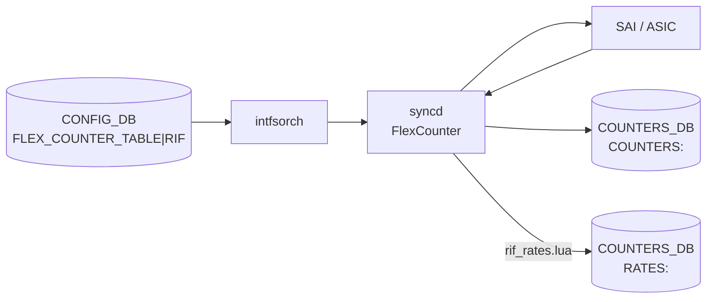

# COUNTERS_DB RIF カウンタ

## 概要

[intfsorch](../../reference/glossary.md#term-intfsorch)（[orchagent](../../reference/glossary.md#term-orchagent) 内）が [SAI](../../reference/glossary.md#term-sai) の flex counter 機構を通じて L3 Router Interface (RIF) ごとに取得する統計カウンタ群[^1]。値は `COUNTERS_DB` の `COUNTERS:<oid>` に格納され、`intfstat` コマンドが読み出す。rate 統計は `RATES:<oid>` に別途格納される。

<!-- cdb-mermaid -->
### データフロー (自動生成)



!!! note "凡例"
    CONFIG_DB の `FLEX_COUNTER_TABLE|RIF` が `enable` になると intfsorch が SAI カウンタ ID リストを syncd へ投入。syncd が 1 s ごとにポーリングして COUNTERS_DB を更新し、`rif_rates.lua` Lua プラグインがレート計算結果を RATES テーブルへ書き込む。

<!-- /cdb-mermaid -->

## key 構造

### RIF 名→OID マップ

```text
COUNTERS_DB / COUNTERS_RIF_NAME_MAP   (Hash)
  field: <rif_name>   (例: Ethernet0, Vlan1000, PortChannel0001)
  value: <SAI OID>    (例: oid:0x6000000000001)
```

### RIF タイプ→OID マップ

```text
COUNTERS_DB / COUNTERS_RIF_TYPE_MAP   (Hash)
  field: <SAI OID>
  value: <type>       (例: port, lag, vlan, subport)
```

### カウンタハッシュ

```text
COUNTERS_DB / COUNTERS:<oid>           (Hash)
  field: <SAI_ROUTER_INTERFACE_STAT_*>
  value: <uint64 カウンタ値 (文字列)>
```

### レートハッシュ

```text
COUNTERS_DB / RATES:<oid>              (Hash)
  field: RX_BPS | RX_PPS | TX_BPS | TX_PPS
  value: <float 文字列>
```

## フィールド一覧

以下は `intfsorch.cpp` の `rifStatIds[]` に定義されている全 SAI カウンタ ID[^2]。

### RIF カウンタ

| SAI フィールド | 意味 |
|---------------|------|
| `SAI_ROUTER_INTERFACE_STAT_IN_PACKETS` | 受信パケット数 |
| `SAI_ROUTER_INTERFACE_STAT_IN_OCTETS` | 受信バイト数 |
| `SAI_ROUTER_INTERFACE_STAT_IN_ERROR_PACKETS` | 受信エラーパケット数 |
| `SAI_ROUTER_INTERFACE_STAT_IN_ERROR_OCTETS` | 受信エラーバイト数 |
| `SAI_ROUTER_INTERFACE_STAT_OUT_PACKETS` | 送信パケット数 |
| `SAI_ROUTER_INTERFACE_STAT_OUT_OCTETS` | 送信バイト数 |
| `SAI_ROUTER_INTERFACE_STAT_OUT_ERROR_PACKETS` | 送信エラーパケット数 |
| `SAI_ROUTER_INTERFACE_STAT_OUT_ERROR_OCTETS` | 送信エラーバイト数 |

## RATES テーブル

syncd が `rif_rates.lua` を定期実行して計算した派生レートを `RATES:<oid>` に書く[^3]。

| フィールド | 意味 |
|-----------|------|
| `RX_BPS` | 受信ビットレート (bps) |
| `RX_PPS` | 受信パケットレート (pps) |
| `TX_BPS` | 送信ビットレート (bps) |
| `TX_PPS` | 送信パケットレート (pps) |

## 書き込み経路

`COUNTERS_DB` は直接 CONFIG_DB から書かれず、すべて orchagent / syncd 経由で書かれる。

| 経路 | 詳細 |
|------|------|
| intfsorch 初期化 | `COUNTERS_RIF_NAME_MAP` に RIF 名→OID、`COUNTERS_RIF_TYPE_MAP` に OID→タイプを書き込み |
| syncd FlexCounter | `FLEX_COUNTER_TABLE|RIF` が `enable` になった後、1 秒ごとに SAI カウンタをポーリングして `COUNTERS:<oid>` を更新 |
| syncd Lua プラグイン | `rif_rates.lua` が `RATES:<oid>` の RX_BPS / RX_PPS / TX_BPS / TX_PPS を書き込み |

## 関連 CONFIG_DB / CLI

- CONFIG_DB: `FLEX_COUNTER_TABLE` — ポーリング有効化と間隔設定
- CLI: `intfstat`（L3 インタフェース統計表示）、`counterpoll rif enable/disable/interval`

<!-- defaults -->
## 暗黙デフォルト・コード由来挙動 (Phase A)

<!-- evidence: sonic-swss/orchagent/intfsorch.cpp, sonic-swss/orchagent/intfsorch.h,
     sonic-swss/orchagent/rif_rates.lua,
     sonic-utilities/counterpoll/main.py,
     sonic-buildimage/dockers/docker-orchagent/enable_counters.py -->

### ポーリング間隔のコード由来デフォルト

`FLEX_COUNTER_TABLE|RIF` に `POLL_INTERVAL` が設定されていない場合、intfsorch が **ハードコードした初期値**で syncd に投入する[^4]。

| カウンタグループ | ハードコード定数 | 値 |
|----------------|---------------|-----|
| `RIF` (通常カウンタ) | `RIF_FLEX_STAT_COUNTER_POLL_MSECS` (intfsorch.h:21) | **1000 ms** |

`counterpoll show` の表示でも RIF_STAT グループは `DEFLT_1_SEC = "default (1000)"` をフォールバック値として使用する（counterpoll/main.py:815）。

### `FLEX_COUNTER_STATUS` 未設定時の挙動

`FLEX_COUNTER_TABLE|RIF` の `FLEX_COUNTER_STATUS` が `enable` になるまで syncd は SAI ポーリングを行わない。カウンタ値は 0 のまま（または古い値）。

| 種類 | 詳細 |
|------|------|
| コード由来デフォルト | `FLEX_COUNTER_STATUS` なし → syncd 収集なし |
| CLI デフォルト | `counterpoll show` 未設定時は `disable` 扱いで表示される（counterpoll/main.py:815） |

### レートスムージングのデフォルト

`rif_rates.lua` は COUNTERS_DB の `RATES:RIF` エントリから `RIF_SMOOTH_INTERVAL` と `RIF_ALPHA` を読み取り、指数移動平均 (EMA) でレートを平滑化する[^5]。これらの値は `enable_counters.py` によって起動時に書き込まれる。

| パラメータ | デフォルト値 | 定義箇所 |
|-----------|------------|---------|
| `RIF_SMOOTH_INTERVAL` | **10**（秒） | `enable_counters.py:10` |
| `RIF_ALPHA` | **0.18**（= 2/(10+1) ≈ 0.182）| `enable_counters.py:11` |

`RIF_ALPHA` は alpha = 2/(N+1) で、N = ウィンドウ幅（秒）から導出される。デフォルト 10 秒ウィンドウで 1 秒スパイクの影響が約 10 秒で収束するよう設計されている（enable_counters.py:7-9 コメント）。

ユーザーが `config rate smoothing-interval <interval> rif` を実行すると新しい alpha = 2.0/(interval+1) が計算され `RATES:RIF` に書き直される（config/main.py:9591-9598）。

!!! warning "RIF_ALPHA 未定義時の挙動"
    `rif_rates.lua` は `RIF_ALPHA` が未定義の場合 `"Alpha is not defined"` をログに残して即 return する（rif_rates.lua:21-23）。`enable_counters.py` が実行されていない場合はレート計算が一切行われず `RATES:<oid>` が空のままになる。

### 起動遅延（enable_counters.py）

`enable_counters.py` はシステム起動後にデフォルト率設定を書き込む前に意図的に sleep する[^6]。

| 起動後経過時間 | sleep 時間 |
|-------------|-----------|
| < 5 分（uptime < 300 s） | **180 秒**（3 分待機後に設定書き込み） |
| 5 分以上 | **60 秒**（1 分待機後に設定書き込み） |

これにより orchagent / syncd が完全に初期化される前に `RATES:RIF` が書かれることを防いでいる。

### RIF タイプ別登録

intfsorch は RIF ごとに `COUNTERS_RIF_TYPE_MAP` に OID→タイプ（`port`, `lag`, `vlan`, `subport` 等）を書く。`COUNTERS_RIF_NAME_MAP` には RIF 名（インタフェース名）→OID のマッピングが格納され、`intfstat` がこのマップを元にカウンタを引く。

### SAI フィールド未サポート時の挙動

ASIC が対応していない SAI カウンタは `intfstat` の `get_counters()` で `STATUS_NA` ('N/A') として扱われ、表示に `N/A` が出る（scripts/intfstat:93-98）。

<!-- /defaults -->

<!-- ordering -->
## 処理順序と順序依存 (Phase B)

### orchdaemon 初期化順序

`orchdaemon.cpp` における Orch 生成順序は次のとおりで、`gIntfsOrch` は `FlexCounterOrch` より前に生成される[^7]。

| 順序 | 生成クラス | 依存 |
|------|-----------|------|
| 1 | `PortsOrch` | — |
| 2 | `VRFOrch` | — |
| 3 | `IntfsOrch` | VRFOrch, PortsOrch |
| 4 | `FlexCounterOrch` | gIntfsOrch (既に設定済み) |

`FlexCounterOrch::doTask()` は `gIntfsOrch != nullptr` を確認してから `generateInterfaceMap()` を呼ぶため、IntfsOrch より前に `FLEX_COUNTER_TABLE|RIF enable` が来ても安全に無視される（`gIntfsOrch` が nullptr なら分岐しない）。

### PortsOrch ガード — 全ポート Ready 前は INTERFACE 処理なし

`IntfsOrch::doTask(Consumer)` の先頭でポート初期化完了を確認する（`intfsorch.cpp:665-668`）。

```
if (!gPortsOrch->allPortsReady()) return;
```

`APP_INTF_TABLE` の SET メッセージは Consumer キューに積まれたまま保持され、`PortsOrch::allPortsReady()` が `true` を返した後に初めて処理される。したがって `INTERFACE` エントリに対応する物理ポート（`Ethernet0`、`PortChannel0001`、`Vlan1000` 等）が PortsOrch に登録済みであることが前提になる。

### RIF 作成 → タイマー駆動の非同期 FlexCounter 登録

`addRouterIntfs()` で SAI RIF 作成後、`port` を `m_rifsToAdd` リストにキューイングするのみで FlexCounter には即時登録しない。実際の登録は `UPDATE_MAPS_SEC = 1 秒` 間隔のタイマーが発火して `doTask(SelectableTimer)` が呼ばれた後になる（`intfsorch.cpp:45, 78`）[^8]。

```
APP_INTF_TABLE SET
  → doTask(Consumer) → addRouterIntfs() → SAI RIF 作成 → m_rifsToAdd 追加
  最大 1 秒後
  → doTask(SelectableTimer) → addRifToFlexCounter()
      → COUNTERS_RIF_NAME_MAP (name→OID)
      → COUNTERS_RIF_TYPE_MAP (OID→type)
      → FLEX_COUNTER_DB: COUNTER_ID_LIST 登録
  syncd がポーリング開始 (FLEX_COUNTER_TABLE|RIF enable が前提)
      → COUNTERS:<oid> 更新
      → RATES:<oid> 更新 (rif_rates.lua)
```

この最大 1 秒の遅延の間、`COUNTERS_RIF_NAME_MAP` に当該 RIF のエントリが存在しない。`intfstat` を RIF 作成直後に実行すると表示されないことがある。

### gTraditionalFlexCounter モードでの ASIC_DB 待機

`gTraditionalFlexCounter = true`（`--use-sairedis` オプション）の場合、タイマーが発火しても ASIC_DB の `VIDTORID` テーブルに該当 OID が存在するまで `addRifToFlexCounter()` を呼ばない（`intfsorch.cpp:1629-1636`）。

`syncd` が SAI `create_router_interface` の応答を受けて `VIDTORID` を書いた後に初めて登録が完了する。新規 FlexCounter モード (`gTraditionalFlexCounter = false`) では即座に登録する。

### FLEX_COUNTER_TABLE|RIF enable → generateInterfaceMap() 連鎖

`FlexCounterOrch::doTask()` が `FLEX_COUNTER_STATUS = enable` を受信すると（`flexcounterorch.cpp:283-285`）:

```
FlexCounterOrch::doTask()
  → gIntfsOrch->generateInterfaceMap()
      → m_updateMapsTimer->start()
          → doTask(SelectableTimer) (次回発火時)
              → m_rifsToAdd の全 RIF を addRifToFlexCounter()
```

すでに `m_rifsToAdd` に積まれた RIF が一括登録される。orchdaemon 起動直後は `FlexCounterOrch::m_delayTimerExpired = false` のため、warm-reboot 完了前に enable が来ても early return する（`flexcounterorch.cpp:157-160`）。

### 削除時の順序

`removeIntf()` → `removeRouterIntfs()` → `removeRifFromFlexCounter()` の順で処理される:

1. `COUNTERS_RIF_NAME_MAP` と `COUNTERS_RIF_TYPE_MAP` から hdel
2. `FLEX_COUNTER_DB` の COUNTER_ID_LIST を `stopFlexCounterPolling()` で削除
3. `COUNTERS:<oid>` は syncd 側が SAI の remove 応答後にクリーンアップする（IntfsOrch は直接削除しない）

`m_rifsToAdd` にまだキューイングされている RIF（`addRifToFlexCounter` 未実行）は `removeRouterIntfs()` 内でリストから除去されるだけで FlexCounter 側のクリーンアップは不要（`intfsorch.cpp:1337-1344`）。

> **コード証跡**: `intfsorch.cpp` L43 (priority 35), L45,78 (UPDATE_MAPS_SEC=1), L665-668 (PortsOrch ガード), L1296-1311 (addRouterIntfs→m_rifsToAdd), L1527-1552 (addRifToFlexCounter 書き込み順序), L1576-1578 (generateInterfaceMap), L1598-1638 (doTask Timer + gTraditionalFlexCounter 分岐), L1337-1344 (削除時クリーンアップ);
> `flexcounterorch.cpp` L157-160 (delayTimer ガード), L283-285 (RIF enable → generateInterfaceMap);
> `orchdaemon.cpp` L232, L283, L296, L625 (初期化順序)

<!-- /ordering -->

<!-- cross-refs -->
## 暗黙参照テーブル (Phase C)

<!-- evidence: sonic-swss/orchagent/intfsorch.cpp (doTask Consumer, doTask SelectableTimer,
     addRifToFlexCounter, addRouterIntfs),
     sonic-swss/orchagent/flexcounterorch.cpp (doTask, generateInterfaceMap 呼出し),
     sonic-swss/orchagent/orchdaemon.cpp (初期化順序) -->

`IntfsOrch` が INTERFACE テーブルを処理して RIF を生成し、COUNTERS_DB に RIF カウンタを登録する際に暗黙的に参照する他テーブルを示す。YANG の leafref として定義されたものはなく、コードのみで表現された依存関係である。

| 参照元処理 | 参照先テーブル | 参照先キー形式 | 依存内容 | 証跡 |
|---|---|---|---|---|
| `doTask(Consumer)` の INTERFACE 処理全体 | `PORT` | `APP_PORT_TABLE\|<port_name>` | `allPortsReady()` が false の間は INTERFACE の SET/DEL をすべてブロック。PortsOrch が全ポートの SAI OID 取得完了を宣言するまで RIF 作成も削除も行われない | `intfsorch.cpp:665-668` |
| `doTask(Consumer)` の RIF 作成判断 | [`VRF_TABLE`](vrf.md) | `VRF_TABLE\|<vrf_name>` | `INTERFACE` に `vrf_name` フィールドがある場合、VRFOrch に当該 VRF が登録済みでないと Consumer キューに留まりリトライ。VRF なし（デフォルト VRF）なら依存なし | `intfsorch.cpp:824-831` |
| `generateInterfaceMap()` のトリガ | [`FLEX_COUNTER_TABLE`](flex-counter-table.md) | `FLEX_COUNTER_TABLE\|RIF` フィールド `FLEX_COUNTER_STATUS` | `enable` 受信時に `generateInterfaceMap()` → タイマーキック → `addRifToFlexCounter()` の連鎖が起動する。`disable` のままでも COUNTERS_RIF_NAME_MAP / COUNTERS_RIF_TYPE_MAP への書き込みは行われるが、syncd の SAI ポーリングは開始されず `COUNTERS:<oid>` は更新されない | `flexcounterorch.cpp:283-286`, `intfsorch.cpp:1576-1578` |
| `addRifToFlexCounter()` の実行条件 | `ASIC_DB VIDTORID` | `VIDTORID\|<oid>` | `gTraditionalFlexCounter=true` の場合、syncd が SAI `create_router_interface` 応答後に `VIDTORID` へ OID を書くまで登録を保留（最大 1 秒間隔でリトライ）。新規 FlexCounter モード (`false`) では即時登録 | `intfsorch.cpp:1627-1636` |

### 解決タイミング

- **PORT**: `allPortsReady()` による自動待機。PortsOrch が初期化完了後に IntfsOrch の INTERFACE 処理がアンブロックされる。
- **VRF_TABLE**: `doTask` ループの `continue` でリトライ。VRF が後から追加されると次の Consumer イベント処理時に解決する。
- **FLEX_COUNTER_TABLE**: `FlexCounterOrch::doTask()` が即時評価。`enable` 書込み時点でタイマーがキックされ、最大 1 秒後に登録が完了する。
- **ASIC_DB VIDTORID**: `doTask(SelectableTimer)` の 1 秒タイマーでリトライ。通常は RIF 作成後 1 秒以内に syncd が書き込む。

<!-- /cross-refs -->

<!-- failure -->
## 失敗挙動・retry / recovery (Phase D)

<!-- evidence: sonic-swss/orchagent/intfsorch.cpp (addRouterIntfs L1297-1305,
     removeRouterIntfs L1327-1357, doTask Consumer L665-668,
     doTask SelectableTimer L1604-1636, constructor L86-94);
     sonic-swss/orchagent/flexcounterorch.cpp (doTask L156-160) -->

### SAI `create_router_interface` 失敗 → `throw runtime_error`

`addRouterIntfs()` が SAI API を呼ぶ際、`SAI_STATUS_SUCCESS` 以外が返ると `handleSaiCreateStatus()` の結果に応じて動作が分岐する[^9]。

| `handleSaiCreateStatus` 結果 | 動作 |
|-------------------------------|------|
| `task_success` | ログ (`SWSS_LOG_ERROR`) のみで続行（`m_rifsToAdd` への追加は継続） |
| それ以外 | `throw runtime_error` → orchdaemon クラッシュ → systemd が再起動 |

COUNTERS_DB への書き込みは発生しない（`addRifToFlexCounter()` は `doTask(SelectableTimer)` で後続実行されるため）。

### SAI `remove_router_interface` 失敗 → COUNTERS_DB と SAI の乖離

`removeRouterIntfs()` は `removeRifFromFlexCounter()` を**先**に呼んでから SAI 削除を実行する（`intfsorch.cpp:1345-1355`）。

```
removeRifFromFlexCounter()
  → COUNTERS_RIF_NAME_MAP / COUNTERS_RIF_TYPE_MAP から hdel  ← 先に実行
  → FLEX_COUNTER_DB の COUNTER_ID_LIST 削除
SAI remove_router_interface  ← 後で実行 → 失敗した場合
  → throw runtime_error → orchdaemon 再起動
```

SAI 削除失敗時には COUNTERS_DB から RIF はすでに除去されているが、SAI レイヤーには RIF が残ったままになる。次回 orchdaemon 再起動時の reconcile で収束する。

### ref_count > 0 による DEL ブロック

IP プレフィックスが残っている間は RIF 削除を拒否する（`intfsorch.cpp:1327-1332`）。

```
APP_INTF_TABLE DEL → removeIntf() → ref_count > 0 → return false
```

Consumer の `it` は erase されず次回イベントでリトライされる（Consumer 標準 retry 機構）。COUNTERS_DB に変化なし。

### allPortsReady() false → INTERFACE 処理全停止

PortsOrch が初期化完了（全ポートの SAI OID 取得）を宣言するまで、`APP_INTF_TABLE` の全 SET/DEL が Consumer キューで保留される（`intfsorch.cpp:665-668`）。この間 COUNTERS_DB に変化はなく、ポート初期化完了後に自動的に処理が再開される。

### `rif_rates.lua` ロード失敗 → RATES テーブルが永続的に更新されない

コンストラクタでの Lua スクリプトロードが `runtime_error` をスローした場合、`catch` ブロックで `SWSS_LOG_WARN` を出力して続行する（`intfsorch.cpp:86-94`）[^10]。

| 状態 | 影響 |
|------|------|
| `rifRateSha` が空文字列 | syncd に Lua プラグインが登録されない |
| syncd の動作 | `COUNTERS:<oid>` のポーリングは継続するが `RATES:<oid>` は更新されない |
| `intfstat` 表示 | rate 列（RX_BPS / TX_BPS / RX_PPS / TX_PPS）が `N/A` になる |
| 回復方法 | orchdaemon 再起動のみ（ファイル復元後も自動再ロードなし） |

### `gTraditionalFlexCounter` モードで ASIC_DB VIDTORID 未到達

`gTraditionalFlexCounter=true` の環境で syncd が `VIDTORID` を書き込まない場合、`m_rifsToAdd` に RIF が残り続け、1 秒タイマーの毎発火でリトライするが COUNTERS_DB への登録は完了しない（`intfsorch.cpp:1627-1636`）。`SWSS_LOG_INFO` のみで `SWSS_LOG_ERROR` / `SWSS_LOG_WARN` は出ないため、監視が困難[^11]。

### warm-reboot 時の 60 秒遅延

warm-reboot 完了前に `FLEX_COUNTER_TABLE|RIF = enable` が届いても、`FlexCounterOrch::doTask()` は `m_delayTimerExpired = false` の間 early return する（`flexcounterorch.cpp:156-160`）。

| タイミング | 動作 |
|-----------|------|
| warm-reboot 開始〜60 秒後 | `generateInterfaceMap()` が呼ばれない → RIF カウンタ更新なし |
| 60 秒後 | `m_delayTimerExpired = true` → 自動再開 |

**永続的な障害ではなく**、最大 60 秒の遅延で自動回復する。

### 失敗パス要約

| ケース | ログ | retry/recovery | COUNTERS_DB 影響 |
|--------|------|----------------|-----------------|
| SAI create 失敗 (throw) | `SWSS_LOG_ERROR` | orchdaemon 再起動 | 書き込みなし |
| SAI remove 失敗 (throw) | `SWSS_LOG_ERROR` | orchdaemon 再起動 | NAME_MAP 削除済み (乖離) |
| ref_count > 0 で DEL | `SWSS_LOG_NOTICE` | Consumer 次イベント | 変化なし |
| allPortsReady false | なし | 起動完了後自動再開 | 変化なし |
| rif_rates.lua ロード失敗 | `SWSS_LOG_WARN` | 再起動のみ | RATES 永続的に更新なし |
| VIDTORID 未書込み | `SWSS_LOG_INFO` のみ | 1 秒タイマー自動リトライ | 登録保留（永続的な場合あり）|
| warm-reboot 60 秒遅延 | なし | 60 秒後自動回復 | 最大 60 秒遅延 |

> 中間調査詳細: `meta/_intermediate/cdb-flow/counters-rif-failure.md`
<!-- /failure -->

<!-- ref-triangle:start -->

## 関連リファレンス

- [CONFIG_DB FLEX_COUNTER_TABLE](flex-counter-table.md)
- [CONFIG_DB COUNTERS_DB PORT カウンタ](counters-port.md)
- CLI: `intfstat`, `counterpoll`

<!-- ref-triangle:end -->

## 引用元

[^1]: intfsorch RIF カウンタ登録: `sonic-swss/orchagent/intfsorch.cpp`. <https://github.com/sonic-net/sonic-swss/blob/4305596156d7/orchagent/intfsorch.cpp#L49>
[^2]: `rifStatIds[]` 全定義: `sonic-swss/orchagent/intfsorch.cpp:49-59`. <https://github.com/sonic-net/sonic-swss/blob/4305596156d7/orchagent/intfsorch.cpp#L49>
[^3]: `rif_rates.lua` レート計算ロジック: `sonic-swss/orchagent/rif_rates.lua`. <https://github.com/sonic-net/sonic-swss/blob/4305596156d7/orchagent/rif_rates.lua>
[^4]: ポーリング間隔ハードコード: `sonic-swss/orchagent/intfsorch.h:21`. <https://github.com/sonic-net/sonic-swss/blob/4305596156d7/orchagent/intfsorch.h#L21>
[^5]: RIF_ALPHA/SMOOTH_INTERVAL デフォルト: `sonic-buildimage/dockers/docker-orchagent/enable_counters.py:10-11`. <https://github.com/sonic-net/sonic-buildimage/blob/master/dockers/docker-orchagent/enable_counters.py#L10>
[^6]: 起動遅延ロジック: `sonic-buildimage/dockers/docker-orchagent/enable_counters.py:57-64`. <https://github.com/sonic-net/sonic-buildimage/blob/master/dockers/docker-orchagent/enable_counters.py#L57>
[^7]: orchdaemon 初期化順序: `sonic-swss/orchagent/orchdaemon.cpp:232,283,296,625`. <https://github.com/sonic-net/sonic-swss/blob/4305596156d7/orchagent/orchdaemon.cpp#L232>
[^8]: UPDATE_MAPS_SEC タイマー: `sonic-swss/orchagent/intfsorch.cpp:45`. <https://github.com/sonic-net/sonic-swss/blob/4305596156d7/orchagent/intfsorch.cpp#L45>
[^9]: SAI create_router_interface エラーハンドリング: `sonic-swss/orchagent/intfsorch.cpp:1297-1305`. <https://github.com/sonic-net/sonic-swss/blob/4305596156d7/orchagent/intfsorch.cpp#L1297>
[^10]: rif_rates.lua ロード失敗の catch: `sonic-swss/orchagent/intfsorch.cpp:86-94`. <https://github.com/sonic-net/sonic-swss/blob/4305596156d7/orchagent/intfsorch.cpp#L86>
[^11]: gTraditionalFlexCounter モードでの VIDTORID 待機ループ: `sonic-swss/orchagent/intfsorch.cpp:1627-1636`. <https://github.com/sonic-net/sonic-swss/blob/4305596156d7/orchagent/intfsorch.cpp#L1627>
