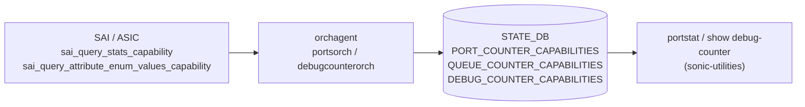

# STATE_DB カウンタ能力テーブル

## 概要

[orchagent](../../reference/glossary.md#term-orchagent) は起動時に SAI へカウンタ能力を問い合わせ、その結果を `STATE_DB` の 3 つのテーブルに書き込む[^1]。これらのテーブルは **読み取り専用** の能力情報であり、ユーザーが CONFIG_DB から書き込む設定テーブルではない。

| STATE_DB テーブル | 書き込み元 | 参照先 |
|-----------------|----------|--------|
| `PORT_COUNTER_CAPABILITIES` | portsorch (`initCounterCapabilities`) | portstat.py、portstat CLI |
| `QUEUE_COUNTER_CAPABILITIES` | portsorch (`initCounterCapabilities`) | queuestat CLI |
| `DEBUG_COUNTER_CAPABILITIES` | debugcounterorch (`publishDropCounterCapabilities`) | show debug-counter capabilities |

<!-- cdb-mermaid -->
### データフロー (自動生成)



!!! note "凡例"
    これらのテーブルは CONFIG_DB を経由しない。orchagent が SAI から直接能力を読み取り STATE_DB に書き込む。portstat などのツールが COUNTERS_DB ポーリング前にここを参照し、プラットフォームがサポートしないカウンタを事前に除外する。

<!-- /cdb-mermaid -->

---

## PORT_COUNTER_CAPABILITIES テーブル

### key 構造

```text
STATE_DB / PORT_COUNTER_CAPABILITIES | <counter_group_name>   (Hash)
  field: isSupported   value: "true" | "false"
```

### フィールド一覧

| key (counter_group_name) | isSupported 条件 | 対応 SAI 統計 |
|--------------------------|----------------|--------------|
| `WRED_ECN_PORT_WRED_GREEN_DROP_COUNTER` | `SAI_PORT_STAT_GREEN_WRED_DROPPED_PACKETS` がプラットフォームでサポートされている | `SAI_PORT_STAT_GREEN_WRED_DROPPED_PACKETS` |
| `WRED_ECN_PORT_WRED_YELLOW_DROP_COUNTER` | `SAI_PORT_STAT_YELLOW_WRED_DROPPED_PACKETS` がサポートされている | `SAI_PORT_STAT_YELLOW_WRED_DROPPED_PACKETS` |
| `WRED_ECN_PORT_WRED_RED_DROP_COUNTER` | `SAI_PORT_STAT_RED_WRED_DROPPED_PACKETS` がサポートされている | `SAI_PORT_STAT_RED_WRED_DROPPED_PACKETS` |
| `WRED_ECN_PORT_WRED_TOTAL_DROP_COUNTER` | `SAI_PORT_STAT_WRED_DROPPED_PACKETS` がサポートされている | `SAI_PORT_STAT_WRED_DROPPED_PACKETS` |

### 書き込みタイミング

1. **起動直後**: portsorch コンストラクタが `initCounterCapabilities()` を呼ぶ。まず全フィールドを `isSupported="false"` で書き込む[^2]
2. **SAI 問い合わせ後**: `sai_query_stats_capability(SAI_OBJECT_TYPE_PORT, ...)` でプラットフォームのポート統計能力を取得し、サポートされる統計 enum ごとに `isSupported="true"` に更新[^3]
3. **SAI 失敗時**: 問い合わせが失敗すると全フィールドが `"false"` のままになる。`SWSS_LOG_NOTICE` を出力するのみで orchagent はエラー終了しない

---

## QUEUE_COUNTER_CAPABILITIES テーブル

### key 構造

```text
STATE_DB / QUEUE_COUNTER_CAPABILITIES | <counter_group_name>   (Hash)
  field: isSupported   value: "true" | "false"
```

### フィールド一覧

| key (counter_group_name) | isSupported 条件 | 対応 SAI 統計 |
|--------------------------|----------------|--------------|
| `WRED_ECN_QUEUE_ECN_MARKED_PKT_COUNTER` | `SAI_QUEUE_STAT_WRED_ECN_MARKED_PACKETS` がサポートされている | `SAI_QUEUE_STAT_WRED_ECN_MARKED_PACKETS` |
| `WRED_ECN_QUEUE_ECN_MARKED_BYTE_COUNTER` | `SAI_QUEUE_STAT_WRED_ECN_MARKED_BYTES` がサポートされている | `SAI_QUEUE_STAT_WRED_ECN_MARKED_BYTES` |
| `WRED_ECN_QUEUE_WRED_DROPPED_PKT_COUNTER` | `SAI_QUEUE_STAT_WRED_DROPPED_PACKETS` がサポートされている | `SAI_QUEUE_STAT_WRED_DROPPED_PACKETS` |
| `WRED_ECN_QUEUE_WRED_DROPPED_BYTE_COUNTER` | `SAI_QUEUE_STAT_WRED_DROPPED_BYTES` がサポートされている | `SAI_QUEUE_STAT_WRED_DROPPED_BYTES` |

PORT_COUNTER_CAPABILITIES と同様に全フィールドが起動時 `"false"` で初期化され、`sai_query_stats_capability(SAI_OBJECT_TYPE_QUEUE, ...)` の結果に基づいて `"true"` に更新される[^4]。

---

## DEBUG_COUNTER_CAPABILITIES テーブル

### key 構造

```text
STATE_DB / DEBUG_COUNTER_CAPABILITIES | <counter_type>   (Hash)
  field: count     value: "<整数文字列>"   — 利用可能な debug counter 数
  field: reasons   value: '["<drop_reason>",...]'   — サポートされる drop reason 一覧
```

### counter_type キー

| counter_type | 説明 |
|-------------|------|
| `PORT_INGRESS_DROPS` | ポート単位の ingress drop カウンタ |
| `PORT_EGRESS_DROPS` | ポート単位の egress drop カウンタ |
| `SWITCH_INGRESS_DROPS` | スイッチ全体の ingress drop カウンタ |
| `SWITCH_EGRESS_DROPS` | スイッチ全体の egress drop カウンタ |

### 書き込みロジック

`DebugCounterOrch::publishDropCounterCapabilities()` が起動時に呼ばれ、以下の順で STATE_DB を更新する[^5]。

1. SAI drop reason 能力を取得: `getSupportedDropReasons(SAI_DEBUG_COUNTER_ATTR_IN_DROP_REASON_LIST)` および `..._OUT_DROP_REASON_LIST`
2. サポートされる counter_type を取得: `getSupportedCounterTypes()` が `sai_query_attribute_enum_values_capability()` を呼ぶ
3. 条件が揃ったエントリのみ書き込み:
   - `count = "0"` の counter_type は書き込まない
   - `reasons` が空文字列の counter_type は書き込まない

!!! note "エントリ不存在の意味"
    `DEBUG_COUNTER_CAPABILITIES` にキーが存在しない counter_type はプラットフォームが SAI debug counter query をサポートしないことを示す。`show debug-counter capabilities` の出力が空の場合も同様。

---

<!-- defaults -->
## 暗黙デフォルト・コード由来挙動 (Phase A)

<!-- evidence: sonic-swss/orchagent/portsorch.cpp, sonic-swss/orchagent/debugcounterorch.cpp,
     sonic-swss/orchagent/debug_counter/drop_counter.cpp,
     sonic-utilities/utilities_common/portstat.py -->

### 起動時 false 初期化と更新競合ウィンドウ

| 種類 | 詳細 |
|------|------|
| コード由来デフォルト | 全フィールドが `"false"` で先書きされる (portsorch.cpp:1868-1879)。SAI 問い合わせ完了まで数ミリ秒間、portstat.py が参照すると WRED カウンタが N/A と表示される |
| SAI 失敗時残存 | `sai_query_stats_capability()` 失敗時は全フィールドが `"false"` のまま。SWSS_LOG_NOTICE のみで silent 継続 (portsorch.cpp:1965-1968) |

### portstat.py の WRED silent skip

`portstat.py:297-329` で `isSupported` が `"true"` でない場合、対応する SAI カウンタを `counter_bucket_dict` から削除する。COUNTERS_DB のポーリング対象から外れ、エラーなく `N/A` となる[^6]。

| 条件 | 挙動 |
|------|------|
| `isSupported = "true"` | COUNTERS_DB から `SAI_PORT_STAT_GREEN_WRED_DROPPED_PACKETS` をポーリング |
| `isSupported = "false"` または キーなし | ポーリング対象から除外。portstat 表示は `N/A` |

### DEBUG_COUNTER_CAPABILITIES の選択的書き込み

| 条件 | 挙動 |
|------|------|
| プラットフォームが SAI debug counter を未サポート | `getSupportedDropReasons()` が空集合返却 → テーブルエントリ書き込みなし |
| count=0 の counter_type | `publishDropCounterCapabilities()` が書き込みをスキップ (debugcounterorch.cpp:348-354) |
| SAI query 失敗 | `getSupportedCounterTypes()` が空集合返却。全 counter_type がスキップされテーブル自体が空 |

<!-- /defaults -->

---

<!-- ordering -->
## 書込み順・タイミング依存 (Phase B)

<!-- evidence: sonic-swss/orchagent/portsorch.cpp, sonic-swss/orchagent/debugcounterorch.cpp,
     sonic-swss/orchagent/flexcounterorch.cpp, sonic-swss/orchagent/orchdaemon.cpp -->

### 1. false 先書き → SAI 問い合わせ → true 更新（自己完結型）

`PortsOrch::initCounterCapabilities()` は **単一コンストラクタ呼び出し内** で 2 フェーズに分けて STATE_DB を更新する[^7]。

1. 全 WRED フィールドを `isSupported="false"` で先書き (portsorch.cpp:1872-1879)
2. `sai_query_stats_capability()` 成功後、サポートされる enum ごとに `isSupported="true"` に上書き (portsorch.cpp:1892-1968)

| タイミング | PORT_COUNTER_CAPABILITIES | QUEUE_COUNTER_CAPABILITIES |
|-----------|--------------------------|---------------------------|
| コンストラクタ開始直後 | 全フィールド `"false"` | 全フィールド `"false"` |
| SAI 問い合わせ成功後 | サポート済みフィールドのみ `"true"` | サポート済みフィールドのみ `"true"` |
| SAI 問い合わせ失敗時 | 全フィールド `"false"` のまま | 全フィールド `"false"` のまま |

!!! note "一時的な false 観測"
    portsorch 初期化完了前に portstat 等が STATE_DB を参照すると全フィールドが `"false"` の中間状態を観測することがある。portstat はカウンタをポーリング対象から除外するだけでエラーを出さない。

### 2. portsorch → debugcounterorch の書き込み順保証

orchdaemon が STATE_DB への書き込み順序を確定的に決定する[^8]。

```
orchdaemon.cpp:232  gPortsOrch = new PortsOrch(...)
                      └─ portsorch.cpp:1107 initCounterCapabilities()
                           → PORT_COUNTER_CAPABILITIES / QUEUE_COUNTER_CAPABILITIES 書き込み
orchdaemon.cpp:452  gDebugCounterOrch = new DebugCounterOrch(...)
                      └─ debugcounterorch.cpp:37 publishDropCounterCapabilities()
                           → DEBUG_COUNTER_CAPABILITIES 書き込み
```

`DebugCounterOrch` コンストラクタ内で `gPortsOrch->attach(this)` が呼ばれるのは `publishDropCounterCapabilities()` の**後**であり、DEBUG_COUNTER_CAPABILITIES 書き込みは PORT_COUNTER_CAPABILITIES 完了後に来ることが orchdaemon 構造上保証される。

### 3. warm-reboot 時の flexcounterorch 60 秒遅延は STATE_DB に無影響

- `FlexCounterOrch` は warm-reboot 時に `FLEX_COUNTER_DELAY_SEC = 60` 秒のタイマーを起動し、`doTask()` を遅延させる (flexcounterorch.cpp:44, 127-137)。
- この遅延は **FLEX_COUNTER_DB へのカウンタポーリング登録**を遅らせるためのものであり、`STATE_DB / *_COUNTER_CAPABILITIES` の書き込みには影響しない。
- `FlexCounterOrch::bake()` は warm-reboot reconcile フェーズで意図的に何もしない（コメント: "FCs are not data plane configuration required during reconciling process"）(flexcounterorch.cpp:525-535)。
- 結果として STATE_DB 能力テーブルは常に orchagent 起動直後（warm-reboot 開始直後）に書き込まれ、60 秒遅延の影響外となる。

### 4. generatePortCounterMap() との順序関係

| ステップ | 発生タイミング | STATE_DB への影響 |
|---------|-------------|----------------|
| `initCounterCapabilities()` | portsorch コンストラクタ（orchagent 起動直後） | `PORT_COUNTER_CAPABILITIES` / `QUEUE_COUNTER_CAPABILITIES` 書き込み |
| `generatePortCounterMap()` | flexcounterorch が PORT カウンタ enable を受信したとき | `FLEX_COUNTER_DB` への登録のみ（STATE_DB 非関与） |
| portstat が `PORT_COUNTER_CAPABILITIES` を参照 | カウンタポーリング実行時 | `isSupported` に基づきポーリング対象を決定 |

`generatePortCounterMap()` は `PORT_COUNTER_CAPABILITIES` テーブルを**参照しない**。portstat.py が STATE_DB を参照する時点では常に `initCounterCapabilities()` 完了後であるため、能力情報が未書き込みの状態で参照されることはない[^9]。

### 順序依存サマリ

| # | 依存関係 | 方向 | 緩和策 |
|---|----------|------|--------|
| 1 | `"false"` 先書き → SAI query → `"true"` 更新 | 自己完結（コンストラクタ内） | 起動直後の transient `"false"` は portstat の N/A 表示のみ |
| 2 | portsorch 初期化 → debugcounterorch 初期化 | orchdaemon が強制保証 | 変更不要 |
| 3 | warm-reboot 60 秒遅延 | STATE_DB には無影響 | 能力テーブルはコンストラクタで同期書き込み済み |
| 4 | `initCounterCapabilities` < `generatePortCounterMap` | 常に保証 | portstat 参照時点では能力テーブル書き込み済み |

<!-- /ordering -->

---

<!-- ref-triangle:start -->

## 関連リファレンス

- [CONFIG_DB FLEX_COUNTER_TABLE](flex-counter-table.md) — ポーリング有効化・間隔設定
- [COUNTERS_DB PORT カウンタ](counters-port.md) — ポート統計の実体
- [COUNTERS_DB QUEUE カウンタ](counters-queue.md) — キュー統計の実体
- [CONFIG_DB DEBUG_COUNTER](debug-counter.md) — デバッグカウンタ設定
- CLI: `show interface counters` (`portstat`)、`show debug-counter capabilities`

<!-- ref-triangle:end -->

[^1]: schema.h:438,528,529 で定数定義。`STATE_PORT_COUNTER_CAPABILITIES_NAME = "PORT_COUNTER_CAPABILITIES"`、`STATE_QUEUE_COUNTER_CAPABILITIES_NAME = "QUEUE_COUNTER_CAPABILITIES"`、`STATE_DEBUG_COUNTER_CAPABILITIES_NAME = "DEBUG_COUNTER_CAPABILITIES"`
[^2]: portsorch.cpp:1868-1879。`fieldValuesFalse` に `("isSupported","false")` を格納し全 4 フィールドに書き込む
[^3]: portsorch.cpp:1936-1964。`SAI_STATUS_SUCCESS` の場合のみ更新。失敗時は SWSS_LOG_NOTICE で通知
[^4]: portsorch.cpp:1881-1918。`SAI_STATUS_SUCCESS` の場合のみ更新
[^5]: debugcounterorch.cpp:315-363。`publishDropCounterCapabilities()` はコンストラクタで呼ばれる (debugcounterorch.cpp:37)
[^6]: portstat.py:314-329。`is_wred_stats_reqd` が False または `isSupported != "true"` の場合に除外
[^7]: portsorch.cpp:1850-1968。`initCounterCapabilities()` は portsorch コンストラクタ末尾 (portsorch.cpp:1107) で呼ばれる
[^8]: orchdaemon.cpp:232 (PortsOrch), orchdaemon.cpp:452 (DebugCounterOrch)。debugcounterorch.cpp:37 で `publishDropCounterCapabilities()` が `gPortsOrch->attach(this)` より前に実行される
[^9]: portsorch.cpp:9102-9129 (`generatePortCounterMap`)。FLEX_COUNTER_DB への登録のみで STATE_DB への読み書きなし
