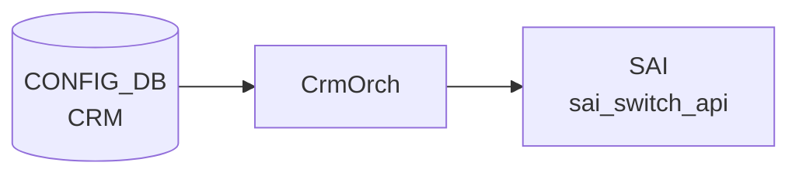

# CRM テーブル

## 概要

Critical Resource Monitoring ([CRM](../../reference/glossary.md#term-crm)) は [ASIC](../../reference/glossary.md#term-asic) の HW リソース使用率 (route / nexthop / [FDB](../../reference/glossary.md#term-fdb) / [ACL](../../reference/glossary.md#term-acl) / [NAT](../../reference/glossary.md#term-nat) / [MPLS](../../reference/glossary.md#term-mpls) / [SRv6](../../reference/glossary.md#term-srv6) / [DASH](../../reference/glossary.md#term-dash)) をポーリング監視し、閾値超過時に `THRESHOLD_EXCEEDED` / `THRESHOLD_CLEAR` アラートを生成する機能。設定は `CRM|Config` の単一エントリに集約される[^1]。`orchagent` の `CrmOrch` が [CONFIG_DB](../../reference/glossary.md#term-config_db) を購読し、`COUNTERS_DB` の [CRM](../../reference/glossary.md#term-crm) 統計を更新する。

<!-- cdb-mermaid -->
### データフロー (自動生成)



!!! note "凡例"
    CONFIG_DB から SAI までの典型経路を `docs/reference/config-db-orch-map.md` から機械生成したミニ図。詳細・例外は本ページ本文と対応表を参照。
<!-- /cdb-mermaid -->

## key 構造

```text
CRM|Config
```

(list ではなく単一 container)

## 主要フィールド

各リソースに対し `<resource>_threshold_type` / `<resource>_high_threshold` / `<resource>_low_threshold` の3つ組が並ぶ。

| 系統 | リソース key prefix |
|------|---------------------|
| [ACL](../../reference/glossary.md#term-acl) | `acl_table`, `acl_group`, `acl_entry`, `acl_counter` |
| FIB | `ipv4_route`, `ipv6_route`, `ipv4_nexthop`, `ipv6_nexthop`, `ipv4_neighbor`, `ipv6_neighbor` |
| [ECMP](../../reference/glossary.md#term-ecmp) | `nexthop_group`, `nexthop_group_member` |
| L2 | `fdb_entry` |
| [NAT](../../reference/glossary.md#term-nat) | `dnat_entry`, `snat_entry` |
| 多目的 | `ipmc_entry`, `mpls_inseg`, `mpls_nexthop` |
| [SRv6](../../reference/glossary.md#term-srv6) | `srv6_my_sid_entry`, `srv6_nexthop` |
| [DASH](../../reference/glossary.md#term-dash) | `dash_vnet`, `dash_eni`, `dash_eni_ether_address_map`, `dash_ipv4_inbound_routing`, `dash_ipv6_inbound_routing`, `dash_ipv4_outbound_routing`, `dash_ipv6_outbound_routing`, `dash_ipv4_pa_validation`, `dash_ipv6_pa_validation`, `dash_ipv4_outbound_ca_to_pa`, `dash_ipv6_outbound_ca_to_pa`, `dash_ipv4_acl_group`, `dash_ipv6_acl_group`, `dash_ipv4_acl_rule`, `dash_ipv6_acl_rule` |

各 `<resource>_threshold_type` は `crm_threshold_type` (`PERCENTAGE` / `USED` / `FREE`) を取る。`PERCENTAGE` のときは high/low ともに 0..100 でなければならない。

加えてグローバル設定:

| フィールド | 型 | 説明 |
|-----------|----|------|
| `polling_interval` | uint16 | リソース使用量ポーリング間隔 [秒] |

## 制約

- すべての three-tuple について `high_threshold > low_threshold` を `must` で強制
- [DASH](../../reference/glossary.md#term-dash) 系列は `DEVICE_METADATA.localhost.switch_type = 'dpu'` のときのみ有効 (`when`)

<!-- cdb-exceptions -->
## 例外条件・特殊挙動

- **percentage 閾値が 100 超 → runtime_error → エラーログ + return**: `threshold_type = percentage` のとき `low_threshold > 100` または `high_threshold > 100` の場合 `runtime_error("CRM percentage threshold value must be <= 100%%")` が発生し、catch → `SWSS_LOG_ERROR` + `return`。残りフィールドも適用されない。<!-- evidence: crmorch.cpp L429-431, L529-531 -->
- **low >= high → runtime_error**: `low_threshold >= high_threshold` の場合も同様に `runtime_error("CRM low threshold must be less then high threshold")` → エラーログ + return。<!-- evidence: crmorch.cpp L433-435 -->
- **DEL コマンド → 非対応エラーログのみ**: `op == DEL_COMMAND` が来ると `SWSS_LOG_ERROR("Unsupported operation type")` を出力するが閾値は変更されない。CRM 設定の削除は未サポート。<!-- evidence: crmorch.cpp L465-466 -->
- **不明属性フィールド → エラーログ + return (残フィールドも適用されない)**: `polling_interval` / 各 threshold_type / threshold_low / threshold_high 以外のフィールドが来ると `SWSS_LOG_ERROR("Failed to parse CRM ... Unknown attribute %s.")` して `return`。<!-- evidence: crmorch.cpp L526 -->
- **未対応 SAI リソース → ignore**: タイマー処理で取得できないリソースは `// ignore unsupported resources` としてスキップ。<!-- evidence: crmorch.cpp L884 -->

<!-- value-behavior -->
## 値依存挙動マトリクス

| フィールド | 値 | 挙動 |
|-----------|-----|------|
| `<resource>_threshold_type` | `percentage`（既定） | 閾値を使用率 % として解釈。`high_threshold > 100` または `low_threshold > 100` の場合 runtime_error を発生させ処理を中断（`crmorch.cpp:428-431`）。アラートは `used/total * 100 >= high_threshold` で発火。 |
| `<resource>_threshold_type` | `used` | 閾値を「使用中エントリ数」の絶対値として解釈。[ASIC](../../reference/glossary.md#term-asic) の total 数に依存せず細かく制御可能。100 超でもエラーにならない。 |
| `<resource>_threshold_type` | `free` | 閾値を「空きエントリ数」として解釈。アラートの超過/クリアの向きが percentage/used と逆（残り少なくなると EXCEEDED）。 |
| `dash_*_threshold_type` | 任意 | `DEVICE_METADATA.localhost.switch_type = 'dpu'` のときのみ有効（YANG `when` 制約）。通常スイッチでは YANG validator が拒否。 |
<!-- /value-behavior -->

## 購読者

- `orchagent` の `CrmOrch`: ポーリング、[SAI](../../reference/glossary.md#term-sai) から使用量取得、[COUNTERS_DB](../../reference/glossary.md#term-counters_db) 更新、syslog アラート

## 関連 CONFIG_DB / YANG / CLI

- 関連 [CONFIG_DB](../../reference/glossary.md#term-config_db): `DEVICE_METADATA`
- 関連 CLI: `crm config thresholds ...`、`crm show resources/thresholds`
- 関連 [YANG](../../reference/glossary.md#term-yang): `sonic-crm`

<!-- ref-triangle:start -->

## 関連リファレンス

- [YANG](../../reference/glossary.md#term-yang): [`sonic-crm`](../yang/sonic-crm.md)
- CLI: `crm config`

<!-- ref-triangle:end -->

## 引用元

[^1]: [YANG](../../reference/glossary.md#term-yang) 定義: `sonic-crm.yang`. <https://github.com/sonic-net/sonic-buildimage/blob/9ea932ec2e18f35e58268ec2e4456b1d4afd65cd/src/sonic-yang-models/yang-models/sonic-crm.yang>

<!-- topics-back-ref -->
## 関連 Topics

- [Topics: Telemetry / SNMP / Observability](../../topics/09-telemetry-snmp/index.md)

<!-- /topics-back-ref -->

<!-- ops-hint -->
## 運用ヒント

### 典型値

- key 形式: `CRM|Config`。
- `acl_table_threshold_type`: `percentage` / `used` / `free`。
- `*_high_threshold` / `*_low_threshold`: 70 / 60 など。
- `polling_interval`: 300（秒）。

### よくある誤設定

- 閾値を 100% に近く設定すると alert が遅れ、[ACL](../../reference/glossary.md#term-acl) 追加で [SAI](../../reference/glossary.md#term-sai) エラーが先に起きる。70%/80% 程度で運用するのが定石。

### 確認コマンド

```bash
sonic-db-cli CONFIG_DB hgetall 'CRM|Config'
crm show summary
crm show resources all
```
<!-- /ops-hint -->

<!-- runtime-trace -->
## 実コンテナ動作トレース

### 段階 1 — Consumer 登録

`CrmOrch` ([orchagent](../../reference/glossary.md#term-orchagent) 直接 CFG 購読) が [CONFIG_DB](../../reference/glossary.md#term-config_db) の `CRM` テーブルを購読する。

`CRM` の key は `Config` (単一エントリ)。各リソース (`ipv4_route`, `nexthop` 等) の threshold を個別設定。

### 段階 2 — CFG→APPL 翻訳

なし ([orchagent](../../reference/glossary.md#term-orchagent) が直接 CONFIG_DB を購読)

### 段階 3 — APPL→SAI

`sai_switch_api` — [SAI](../../reference/glossary.md#term-sai) resource counter の polling interval / threshold を設定

### 段階 4 — タイミングと副作用

**適用タイミング**: [orchagent](../../reference/glossary.md#term-orchagent) 起動時と CONFIG_DB 変化時に即時反映。SAI リソースカウンタの polling は設定した interval で定期実行される。

**副作用**: `polling_interval` 変更は次回 polling から有効。`threshold_type`/`threshold` 変更はリソース枯渇警告の発火条件を変更する。
<!-- /runtime-trace -->

<!-- entry-points -->
## 書き込み入り口 (Direction A)

対象テーブル: `CRM`

### CLI
- `config crm thresholds <resource> type/low/high <value>`
  - ソース: `sonic-utilities/config/main.py (crm グループ)`

### minigraph / sonic-cfggen
- なし

### REST / gNMI (sonic-mgmt-common)
- なし (対応 OpenConfig/[SONiC](../../reference/glossary.md#term-sonic) YANG transformer なし)

### db_migrator
- なし

### ビルド時デフォルト (init_cfg / j2 テンプレート)
- `init_cfg.json.j2` にデフォルト [CRM](../../reference/glossary.md#term-crm) 閾値が定義されている (`CRM.Config.*`)

### ハードコードデフォルト

`orchagent/crmorch.cpp` のプリプロセッサ定数として以下がハードコードされている:

| 定数名 | 値 | 意味 |
|-------|----|------|
| `CRM_POLLING_INTERVAL_DEFAULT` | `300` (= 5 * 60) | デフォルト polling 間隔 [秒] |
| `CRM_THRESHOLD_TYPE_DEFAULT` | `CRM_PERCENTAGE` | デフォルト閾値タイプ (percentage) |
| `CRM_THRESHOLD_LOW_DEFAULT` | `70` | デフォルト低閾値 [%] |
| `CRM_THRESHOLD_HIGH_DEFAULT` | `85` | デフォルト高閾値 [%] |
| `CRM_EXCEEDED_MSG_MAX` | `10` | 閾値超過メッセージ送出の上限回数 |
| `CRM_ACL_RESOURCE_COUNT` | `256` | ACL リソース初期確保数 |

これらの値は `CrmOrch` コンストラクタ (`crmorch.cpp:398-410`) で各リソースの初期 `CrmResourceEntry` に適用される。CONFIG_DB に対応フィールドが存在しない限り変更不可。

### ランタイム注入 (デーモン自動書き込み)
- なし
<!-- /entry-points -->

<!-- constants -->
## ハードコード定数 (Phase E)

ソース: `sonic-swss/orchagent/crmorch.cpp`

### プリプロセッサ定数

| 定数 | 値 | 説明 |
|------|----|------|
| `CRM_POLLING_INTERVAL_DEFAULT` | `300` (5×60 秒) | `CrmOrch` 起動時のデフォルト polling 間隔。CONFIG_DB に `polling_interval` が書かれていない限りこの値が使われる。`evidence: crmorch.cpp:12,402,406` |
| `CRM_THRESHOLD_TYPE_DEFAULT` | `CrmThresholdType::CRM_PERCENTAGE` | 全リソースの初期閾値タイプ。CONFIG_DB 未設定時は percentage モードで動作。`evidence: crmorch.cpp:13,410` |
| `CRM_THRESHOLD_LOW_DEFAULT` | `70` | 全リソースの初期 low threshold [%]。`evidence: crmorch.cpp:14,410` |
| `CRM_THRESHOLD_HIGH_DEFAULT` | `85` | 全リソースの初期 high threshold [%]。`evidence: crmorch.cpp:15,410` |
| `CRM_EXCEEDED_MSG_MAX` | `10` | 閾値超過通知の最大送出回数（連続アラート抑制）。`evidence: crmorch.cpp:16` |
| `CRM_ACL_RESOURCE_COUNT` | `256` | ACL リソースマップの初期確保エントリ数。`evidence: crmorch.cpp:17` |

### resource タイプ enum (CrmResourceType)

`crmResTypeNameMap` (crmorch.cpp:28-72) で定義される全リソース識別子:

| CrmResourceType 値 | CONFIG_DB キー prefix |
|--------------------|-----------------------|
| `CRM_IPV4_ROUTE` | `ipv4_route` |
| `CRM_IPV6_ROUTE` | `ipv6_route` |
| `CRM_IPV4_NEXTHOP` | `ipv4_nexthop` |
| `CRM_IPV6_NEXTHOP` | `ipv6_nexthop` |
| `CRM_IPV4_NEIGHBOR` | `ipv4_neighbor` |
| `CRM_IPV6_NEIGHBOR` | `ipv6_neighbor` |
| `CRM_NEXTHOP_GROUP_MEMBER` | `nexthop_group_member` |
| `CRM_NEXTHOP_GROUP` | `nexthop_group` |
| `CRM_ACL_TABLE` | `acl_table` |
| `CRM_ACL_GROUP` | `acl_group` |
| `CRM_ACL_ENTRY` | `acl_entry` |
| `CRM_ACL_COUNTER` | `acl_counter` |
| `CRM_FDB_ENTRY` | `fdb_entry` |
| `CRM_IPMC_ENTRY` | `ipmc_entry` |
| `CRM_SNAT_ENTRY` | `snat_entry` |
| `CRM_DNAT_ENTRY` | `dnat_entry` |
| `CRM_MPLS_INSEG` | `mpls_inseg` |
| `CRM_MPLS_NEXTHOP` | `mpls_nexthop` |
| `CRM_SRV6_MY_SID_ENTRY` | `srv6_my_sid_entry` |
| `CRM_SRV6_NEXTHOP` | `srv6_nexthop` |
| `CRM_NEXTHOP_GROUP_MAP` | `nexthop_group_map` |
| `CRM_EXT_TABLE` | `extension_table` |
| `CRM_DASH_VNET` | `dash_vnet` |
| `CRM_DASH_ENI` | `dash_eni` |
| `CRM_DASH_ENI_ETHER_ADDRESS_MAP` | `dash_eni_ether_address_map` |
| `CRM_DASH_IPV4_INBOUND_ROUTING` | `dash_ipv4_inbound_routing` |
| `CRM_DASH_IPV6_INBOUND_ROUTING` | `dash_ipv6_inbound_routing` |
| `CRM_DASH_IPV4_OUTBOUND_ROUTING` | `dash_ipv4_outbound_routing` |
| `CRM_DASH_IPV6_OUTBOUND_ROUTING` | `dash_ipv6_outbound_routing` |
| `CRM_DASH_IPV4_PA_VALIDATION` | `dash_ipv4_pa_validation` |
| `CRM_DASH_IPV6_PA_VALIDATION` | `dash_ipv6_pa_validation` |
| `CRM_DASH_IPV4_OUTBOUND_CA_TO_PA` | `dash_ipv4_outbound_ca_to_pa` |
| `CRM_DASH_IPV6_OUTBOUND_CA_TO_PA` | `dash_ipv6_outbound_ca_to_pa` |
| `CRM_DASH_IPV4_ACL_GROUP` | `dash_ipv4_acl_group` |
| `CRM_DASH_IPV6_ACL_GROUP` | `dash_ipv6_acl_group` |
| `CRM_DASH_IPV4_ACL_RULE` | `dash_ipv4_acl_rule` |
| `CRM_DASH_IPV6_ACL_RULE` | `dash_ipv6_acl_rule` |
| `CRM_DASH_IPV4_METER_POLICY` | `dash_ipv4_meter_policy` |
| `CRM_DASH_IPV4_METER_RULE` | `dash_ipv4_meter_rule` |
| `CRM_DASH_IPV6_METER_POLICY` | `dash_ipv6_meter_policy` |
| `CRM_DASH_IPV6_METER_RULE` | `dash_ipv6_meter_rule` |
| `CRM_TWAMP_ENTRY` | `twamp_entry` |

### CrmThresholdType enum

| 値 | CONFIG_DB 文字列 | 説明 |
|----|-----------------|------|
| `CRM_PERCENTAGE` | `"percentage"` | 使用率 % で閾値判定（デフォルト） |
| `CRM_USED` | `"used"` | 使用エントリ数の絶対値で判定 |
| `CRM_FREE` | `"free"` | 空きエントリ数の絶対値で判定 |

`evidence: crmorch.cpp:299-303`
<!-- /constants -->

<!-- derivation -->
## 派生・条件付き登録 (Phase 6/7)

### Phase 6: 値による他フィールド自動派生

| 条件 | 派生先 | evidence |
|---|---|---|
| ビルド時 `init_cfg.json.j2` が CRM テーブルにデフォルト閾値を設定 | `CRM.Config.polling_interval = 300`、全リソースの `*_threshold_type = percentage`、`*_low_threshold = 70`、`*_high_threshold = 85` | `sonic-buildimage/files/build_templates/init_cfg.json.j2:11-21` |

### Phase 7: 条件付き module/manager 登録

| 条件 | 登録 module | evidence |
|---|---|---|
| 常時（条件なし） | `CrmOrch` が `CRM` テーブルを `doTask` で購読 | `sonic-swss/orchagent/crmorch.cpp:440-477` |

### grep カバレッジ

- init_cfg.json.j2 L11-21: CRM デフォルト閾値設定
- crmorch.cpp L440: doTask 登録（条件なし）
<!-- /derivation -->
<!-- handler-branching -->
### Phase 8: Handler メソッド内分岐

| Manager / Handler | メソッド | 分岐条件 | 効果 | evidence |
|---|---|---|---|---|
| `CrmOrch` | `doTask()` | `op == DEL_COMMAND` | `log_error` のみ（削除操作は非サポート、無視） | `sonic-swss/orchagent/crmorch.cpp:463` |
| `CrmOrch` | `handleSetCommand()` | `field == CRM_POLLING_INTERVAL` | タイマー間隔を更新・リセット | `sonic-swss/orchagent/crmorch.cpp:487` |
| `CrmOrch` | `handleSetCommand()` | `field` が `crmThreshTypeResMap` に存在する | threshold_type を更新し exceeded カウンタをリセット | `sonic-swss/orchagent/crmorch.cpp:497` |
| `CrmOrch` | `handleSetCommand()` | `field` が `crmThreshLowResMap` に存在する | lowThreshold を更新 | `sonic-swss/orchagent/crmorch.cpp:509` |
| `CrmOrch` | `handleSetCommand()` | `field` が `crmThreshHighResMap` に存在する | highThreshold を更新 | `sonic-swss/orchagent/crmorch.cpp:515` |
| `CrmOrch` | `handleSetCommand()` | 上記いずれにも該当しない field | `log_error`（未知フィールド） | `sonic-swss/orchagent/crmorch.cpp:521` |

> **スキャン証跡**: `CrmOrch::doTask` L440-477 + `handleSetCommand` L478-537 全行読了。6 件分岐抽出。
<!-- /handler-branching -->
<!-- defaults -->
## コード由来の暗黙デフォルト (Phase A)

### ハードコードデフォルト (crmorch.cpp L12-15)

`CrmOrch` コンストラクタは、CONFIG_DB に `CRM|Config` エントリが存在しない場合でも、全リソースに対して以下の値を即時適用する。

| フィールド | 暗黙デフォルト値 | 由来 |
|---|---|---|
| `polling_interval` | **300** 秒 | `#define CRM_POLLING_INTERVAL_DEFAULT (5 * 60)` (crmorch.cpp:12) |
| `*_threshold_type` (全リソース) | **`percentage`** | `CRM_THRESHOLD_TYPE_DEFAULT` (crmorch.cpp:13) |
| `*_low_threshold` (全リソース) | **70** | `CRM_THRESHOLD_LOW_DEFAULT` (crmorch.cpp:14) |
| `*_high_threshold` (全リソース) | **85** | `CRM_THRESHOLD_HIGH_DEFAULT` (crmorch.cpp:15) |

YANG には `default` ステートメントが存在しない。実行時デフォルトは純粋に C++ マクロ定義のみで決まる。

### init_cfg.json.j2 との対象リソース乖離

`init_cfg.json.j2` がデフォルト設定するのは 18 リソース (YANG 定義済み範囲: `ipv4_route` / `fdb_entry` / `mpls_inseg` 等) のみ。一方、`crmResTypeNameMap` には以下の追加リソースが含まれており、CONFIG_DB に設定がなくてもオーケストレータ起動時に **percentage/70/85 で監視開始**する:

- `srv6_my_sid_entry`, `srv6_nexthop`, `nexthop_group_map`, `extension_table`
- `dash_vnet`, `dash_eni`, `dash_eni_ether_address_map` ほか DASH 系全リソース
- `twamp_entry`

### 暗黙副作用

| 副作用 | 条件 | 詳細 |
|---|---|---|
| [COUNTERS_DB](../../reference/glossary.md#term-counters_db) CRM 統計の初期消去 | orchagent 起動毎 | コンストラクタで `m_countersCrmTable->del("STATS")` が走り、次の polling (最大 300 秒後) まで統計が空になる (crmorch.cpp:414) |
| アラート silent drop | 同一リソースで閾値超過 10 回以上 | `exceededLogCounter >= CRM_EXCEEDED_MSG_MAX (10)` で syslog を停止。`threshold_type` 変更でリセット (crmorch.cpp:16, 1179) |
| DASH リソースの monitoring skip | `gMySwitchType != "dpu"` | `CRM_DASH_*` リソースを `CRM_RES_NOT_SUPPORTED` にセットし polling/alert を一切行わない。CONFIG_DB への書き込みは受け入れるが監視は無効 (crmorch.cpp:839, 933-936) |
| `threshold_type` 変更時の exceededLogCounter リセット | type が変化した場合のみ | 全サブカウンタ (ACL stage/bind_point 単位) の `exceededLogCounter` を 0 にリセット。次 cycle で超過があれば即 WARN (crmorch.cpp:503-507) |

### YANG-実装 discrepancy

YANG の `must` は `high_threshold < 100` (strictly less) を要求するが、実装 (`CrmResourceEntry` コンストラクタ) が例外を発生させるのは `> 100` のときのみ。**値 100 は YANG では拒否されるが、実装では通過する。** <!-- evidence: sonic-crm.yang L38-40, crmorch.cpp L428-431 -->

### 大文字小文字制約 (silent substitution なし)

`crmThreshTypeMap` は `"percentage"` / `"used"` / `"free"` の小文字のみを受け付ける。大文字 (`PERCENTAGE` 等) を CONFIG_DB に書き込むと `std::out_of_range` 例外 → `SWSS_LOG_ERROR` + `return` (残フィールドも適用されない)。YANG 型 `crm_threshold_type` は大文字も許容するため、YANG バリデーション通過後でも実装側でエラーとなる。<!-- evidence: crmorch.cpp L299-303, L496, L530-531 -->
<!-- /defaults -->

<!-- side-effects -->
## 副次 DB 書込 (Phase F)

`CRM|Config` の SET 処理後、`CrmOrch` は以下の副次書込を行う。

### COUNTERS_DB — `CRM` テーブル

書込タイミング: `polling_interval` 秒ごと (`updateCrmCountersTable()`)。

| 操作 | キー | フィールド | 条件 |
|------|------|-----------|------|
| `set` | `STATS` (通常リソース) または ACL/DASH OID キー | `crm_stats_<resource>_used` | 各リソースの使用カウンタを毎 poll 書込 (`crmorch.cpp:1082`) |
| `set` | 同上 | `crm_stats_<resource>_available` | 各リソースの空きカウンタを毎 poll 書込 (`crmorch.cpp:1106`) |
| `del` | `STATS` | — | orchagent 起動時コンストラクタで既存統計を全消去 (`crmorch.cpp:414`) |
| `del` | ACL テーブル OID キー | — | ACL テーブル削除時 (`crmorch.cpp:616`) |
| `del` | DASH ACL グループキー | — | DASH ACL グループ削除時 (`crmorch.cpp:730, 736`) |

`crm_stats_*` フィールドは全 40+ リソース (`ipv4_route`, `ipv6_route`, `ipv4_nexthop`, `acl_table`, `fdb_entry`, `dash_eni` 等) の `_used` / `_available` 二種類。[COUNTERS_DB](../../reference/glossary.md#term-counters_db) テーブル名定数 `COUNTERS_CRM_TABLE = "CRM"` (`sonic-swss-common/common/schema.h:237`)。

### syslog / Event (STATE_DB 書込なし)

| 出力先 | 内容 | 条件 |
|--------|------|------|
| syslog WARN | `THRESHOLD_EXCEEDED for <type> <N>%% Used <U> free <F>` | `utilization >= highThreshold` かつ `exceededLogCounter < 10` (`crmorch.cpp:1175`) |
| syslog WARN | `THRESHOLD_CLEAR for <type> <N>%% Used <U> free <F>` | `utilization <= lowThreshold` かつ `exceededLogCounter > 0` (`crmorch.cpp:1183`) |
| Event `chk_crm_threshold` | `{percent, used_cnt, free_cnt}` | THRESHOLD_EXCEEDED 時 (`crmorch.cpp:1178`) |

`exceededLogCounter` が 10 (`CRM_EXCEEDED_MSG_MAX`) 以上で syslog 停止。`threshold_type` 変更時にリセット (`crmorch.cpp:503–507`)。

[STATE_DB](../../reference/glossary.md#term-state_db) への書込は CrmOrch 単体では行わない。
<!-- /side-effects -->

<!-- pubsub -->
## 通信メカニズム (Phase G)

### CONFIG_DB 購読経路

`CrmOrch` は `Orch(db, tableName)` 基底コンストラクタに CONFIG_DB コネクタと `CFG_CRM_TABLE_NAME`（= `"CRM"`）を渡すことで、swss の **Consumer / SubscriberStateTable** 経路を確立する。orchdaemon.cpp L194 で `new CrmOrch(m_configDb, CFG_CRM_TABLE_NAME)` としてインスタンス化される。

```
CONFIG_DB["CRM|Config"]
  └─ SubscriberStateTable (swss)
       └─ Consumer → CrmOrch::doTask(Consumer &)   // crmorch.cpp L440
            └─ handleSetCommand()                   // SET のみ; DEL は log_error で終了
```

### SelectableTimer ポーリング経路

コンストラクタ (crmorch.cpp L402) で `SelectableTimer` を `CRM_POLLING_INTERVAL_DEFAULT`（300 秒）で生成し、`ExecutableTimer` でラップして `Orch::addExecutor` に登録後 `m_timer->start()` で起動する。タイマー満了ごとに `doTask(SelectableTimer &)` が呼ばれる (crmorch.cpp L751)。

```
SelectableTimer (300 秒周期, 変更可)
  └─ ExecutableTimer["CRM_COUNTERS_POLL"]
       └─ CrmOrch::doTask(SelectableTimer &)        // crmorch.cpp L751
            ├─ getResAvailableCounters()             // 各リソースの available を SAI へ問い合わせ
            ├─ updateCrmCountersTable()              // COUNTERS_DB["CRM_STATS"] 書き込み
            └─ checkCrmThresholds()                 // 閾値比較 → syslog WARN/INFO
```

`polling_interval` フィールドが SET されると `m_timer->setInterval()` + `m_timer->reset()` で即時リセットされる (crmorch.cpp L490-492)。

### SAI 呼出経路

タイマー起動の `getResAvailableCounters()` 内で 2 系統の SAI API を呼び分ける:

| 系統 | 対象リソース | SAI API | evidence |
|------|-------------|---------|---------|
| `sai_object_type_get_availability()` | route / neighbor / nexthop_group / [FDB](../../reference/glossary.md#term-fdb) / IPMC / [MPLS](../../reference/glossary.md#term-mpls) / [SRv6](../../reference/glossary.md#term-srv6) / DASH 系 (objType != NULL) | `sai_object_type_get_availability(gSwitchId, objType, attrCount, &attr, &availCount)` | crmorch.cpp L800 |
| `sai_switch_api->get_switch_attribute()` | ACL table/group/entry/counter / nexthop_group_member / TWAMP 等 (objType == NULL または前者が失敗) | `sai_switch_api->get_switch_attribute(gSwitchId, 1, &attr)` | crmorch.cpp L808 |

いずれも `SAI_STATUS_NOT_SUPPORTED` / `SAI_STATUS_NOT_IMPLEMENTED` 系の戻り値で `resStatus = CRM_RES_NOT_SUPPORTED` にセットし、以降の polling から除外する (crmorch.cpp L817)。

### orchdaemon 内の登録順序

`gCrmOrch` は orchdaemon.cpp L194 で早期に生成され、L500 の `m_orchList` に `gSwitchOrch` の直後として追加される。これは CRM が他 Orch（port / route / ACL 等）より先に CONFIG_DB 購読を確立することを意味する。

```
orchdaemon.cpp L194:  gCrmOrch = new CrmOrch(m_configDb, CFG_CRM_TABLE_NAME)
orchdaemon.cpp L500:  m_orchList = { gSwitchOrch, gCrmOrch, gPortsOrch, ... }
```
<!-- /pubsub -->

<!-- platform -->
## プラットフォーム差異 (Phase H)

### SAI capability 取得方式の差 (ASIC ベンダー依存)

CRM は各リソースの available カウンタを `getResAvailability` で 2 段階フォールバック方式で取得する。

**優先パス: `sai_object_type_get_availability`**

SAI object-level availability API。[ASIC](../../reference/glossary.md#term-asic) ベンダーが実装していれば、より細粒度な capacity を返す。  
`CRM_IPV4/6_ROUTE`、`CRM_IPV4/6_NEIGHBOR`、`CRM_MPLS_NEXTHOP` (`SAI_NEXT_HOP_TYPE_MPLS` フィルタ)、`CRM_SRV6_NEXTHOP` (`SAI_NEXT_HOP_TYPE_SRV6_SIDLIST` フィルタ)、`CRM_NEXTHOP_GROUP`、`CRM_FDB_ENTRY`、`CRM_MPLS_INSEG`、`CRM_SRV6_MY_SID_ENTRY` など。<!-- evidence: crmorch.cpp:760-801 -->

**フォールバックパス: `sai_switch_api->get_switch_attribute`**

`sai_object_type_get_availability` が失敗した場合、または `crmResSaiObjAttrMap` で `SAI_OBJECT_TYPE_NULL` が設定されているリソースは `SAI_SWITCH_ATTR_AVAILABLE_*` を直接 get する (`CRM_NEXTHOP_GROUP_MEMBER`、`CRM_SNAT/DNAT_ENTRY`、`CRM_TWAMP_ENTRY` 等)。<!-- evidence: crmorch.cpp:806-829 -->

**`SAI_STATUS_NOT_SUPPORTED` / `NOT_IMPLEMENTED` 時**: `res.resStatus = CRM_RES_NOT_SUPPORTED` をセットし、以降の polling cycle でそのリソースを完全スキップする。CONFIG_DB への threshold 設定は受け入れるが COUNTERS_DB には統計が書き込まれない。MPLS / SRv6 / TWAMP 等をサポートしない ASIC では自動的に monitoring が無効化される。<!-- evidence: crmorch.cpp:812-820 -->

### ACL リソースの特殊取得 (stage × bind_point マトリクス)

`CRM_ACL_TABLE` / `CRM_ACL_GROUP` は `aclresource` 型で `SAI_SWITCH_ATTR_AVAILABLE_ACL_TABLE[_GROUP]` を取得し、ingress/egress × port/lag/vlan/rif/switch の組み合わせごとに個別エントリ (`ACL_STATS:INGRESS:PORT` 等) を COUNTERS_DB に書き込む。`SAI_STATUS_BUFFER_OVERFLOW` 時は実際のエントリ数で resize して再取得する。  
`CRM_ACL_ENTRY` / `CRM_ACL_COUNTER` は per-ACL table で `sai_acl_api->get_acl_table_attribute` を呼び出す（ACL テーブルが存在しない間は 0）。<!-- evidence: crmorch.cpp:943-1020 -->

### DASH / DPU 専用リソース (`gMySwitchType` ガード)

`DEVICE_METADATA.localhost.switch_type != "dpu"` の場合、DASH 系リソース全般（`DASH_VNET`、`DASH_ENI`、`DASH_ENI_ETHER_ADDRESS_MAP`、全 routing/pa_validation/ca_to_pa エントリ、`DASH_IPV4/6_METER_POLICY/RULE`、`DASH_IPV4/6_ACL_GROUP`）は強制的に `CRM_RES_NOT_SUPPORTED` となり monitoring されない。`DASH_IPV4/6_ACL_RULE` は専用の `getDashAclGroupResAvailability` 経由で ACL Group OID ごとに capacity を確認する。<!-- evidence: crmorch.cpp:915-1054 -->

### VOQ chassis での差異

`switch_type = "voq"` に対する CRM 専用パスは存在しない。[VOQ](../../reference/glossary.md#term-voq) システムでも通常スイッチと同一の FIB/ACL/L2 リソースを監視するが、fabric port 側の resource は CRM 対象外。

### EXT_TABLE (Generic Programmable) の ASIC-specific 取得

`CRM_EXT_TABLE` はテーブル名を `SAI_GENERIC_PROGRAMMABLE_ATTR_OBJECT_NAME` (s8list) として `sai_object_type_get_availability` に渡す。ASIC ドライバが対象テーブル名を認識しない場合はエラーログのみ（`CRM_RES_NOT_SUPPORTED` フラグは立てない）。<!-- evidence: crmorch.cpp:1022-1047 -->
<!-- /platform -->

<!-- cross-refs -->
## 暗黙参照（Phase C）

`CrmOrch` が `CRM` テーブルを処理する際、以下の外部テーブル・DB を明示的な設定フィールドとしてではなく、**実行時の判定条件または書き込み先**として暗黙的に参照する。

| 参照先 | 参照種別 | 具体的な利用箇所 | evidence |
|--------|----------|-----------------|----------|
| `DEVICE_METADATA.localhost.switch_type` | 読み取り（実行時条件） | `gMySwitchType` グローバル変数経由。`"dpu"` のとき DASH 系 ACL グループリソースの可用性チェック (`getDashAclGroupResAvailability`) を実行し、それ以外は `CRM_RES_NOT_SUPPORTED` を返す。 | `sonic-swss/orchagent/crmorch.cpp:839`, `main.cpp:658` |
| `COUNTERS_DB` (`CRM` テーブル) | 書き込み | `updateCrmCountersTable()` 内で `m_countersCrmTable->set()` により全リソースの `used` / `available` カウンタを定期書き込み。`crm show resources` が参照する統計値の実体。 | `sonic-swss/orchagent/crmorch.cpp:400-401,1067-1109` |
| SAI `sai_switch_api` (`SAI_SWITCH_ATTR_AVAILABLE_*`) | SAI 読み取り | `getSwitchResAvailability()` で `sai_switch_api->get_switch_attribute()` を呼び出し、各リソースの空き数を取得。`SWITCH` オブジェクト属性を介した間接参照。 | `sonic-swss/orchagent/crmorch.cpp:76-92,975` |

### 依存関係サマリ

```
DEVICE_METADATA.localhost.switch_type
  → gMySwitchType == "dpu" のとき DASH CRM リソースが有効化

CRM|Config (CONFIG_DB)
  → CrmOrch が polling_interval / threshold を読み取り

SAI sai_switch_api (SWITCH 属性)
  → 各リソースの available カウンタ取得

COUNTERS_DB CRM テーブル
  ← CrmOrch が used / available カウンタを書き込み
```
<!-- /cross-refs -->

<!-- ordering -->
## 順序依存 (Phase B)

### ポーリング起動順序

`CrmOrch::CrmOrch()` コンストラクタの初期化ステップ（`crmorch.cpp` L398-L419）:

1. `Orch(db, tableName)` 基底クラス初期化 — CONFIG_DB コンシューマー登録
2. `m_countersDb` / `m_countersCrmTable` 生成 — COUNTERS_DB 接続確立
3. `m_timer` 生成 (`SelectableTimer`) — デフォルト間隔 300 秒でオブジェクト生成
4. `m_pollingInterval` 設定 — `chrono::seconds(300)` をメンバへコピー
5. `m_resourcesMap` 全リソース初期化 — `crmResTypeNameMap` を走査し全 42 リソースを `CrmResourceEntry(name, PERCENTAGE, 70, 85)` で登録
6. COUNTERS_DB の既存統計削除 — `m_countersCrmTable->del("STATS")` で古いキャッシュをクリア
7. `ExecutableTimer` 生成・`Orch::addExecutor()` 登録
8. `m_timer->start()` — タイマー起動（以後 300 秒ごとにポーリング）

> **注意**: リソースエントリ登録（ステップ 5）はタイマー起動（ステップ 8）より必ず先に完了する。タイマーコールバックが空のリソースマップでカウンタ取得を試みることはない。<!-- evidence: crmorch.cpp L408-419 -->

### ポーリングループ内呼び出し順

`doTask(SelectableTimer&)` から固定順で呼ばれる（`crmorch.cpp` L751-758）:

```
1. getResAvailableCounters()   SAI から available counter を取得・更新
2. updateCrmCountersTable()    COUNTERS_DB の CRM:STATS テーブルへ書込み
3. checkCrmThresholds()        閾値超過チェック・syslog アラート送信
```

`checkCrmThresholds()` が `getResAvailableCounters()` より先に実行されることはなく、常に最新の available counter でチェックが行われる。

### リソース種別初期化順序

コンストラクタの `for (const auto &res : crmResTypeNameMap)` は `std::map` の列挙値昇順でイテレートされる。登録順（先頭 12 件）:

| 順 | リソース |
|----|---------|
| 1 | CRM_IPV4_ROUTE |
| 2 | CRM_IPV6_ROUTE |
| 3 | CRM_IPV4_NEXTHOP |
| 4 | CRM_IPV6_NEXTHOP |
| 5 | CRM_IPV4_NEIGHBOR |
| 6 | CRM_IPV6_NEIGHBOR |
| 7 | CRM_NEXTHOP_GROUP_MEMBER |
| 8 | CRM_NEXTHOP_GROUP |
| 9 | CRM_ACL_TABLE |
| 10 | CRM_ACL_GROUP |
| 11 | CRM_ACL_ENTRY |
| 12 | CRM_ACL_COUNTER |
| 13-22 | [FDB](../../reference/glossary.md#term-fdb) / IPMC / SNAT / DNAT / [MPLS](../../reference/glossary.md#term-mpls) / SRv6 / NEXTHOP_GROUP_MAP / EXT_TABLE |
| 23-42 | DASH 系（[VNET](../../reference/glossary.md#term-vnet) / [ENI](../../reference/glossary.md#term-eni) / … / METER_RULE）+ TWAMP_ENTRY |

### SAI 属性読取り優先順位

ポーリング時に `getResAvailability()` が各リソースに対して試みる順:

1. **`sai_object_type_get_availability()`** — `crmResSaiObjAttrMap` で objType が `NULL` 以外のリソース（IPV4_ROUTE / IPV6_ROUTE / IPV4_NEIGHBOR / IPV6_NEIGHBOR / NEXTHOP_GROUP / FDB_ENTRY / MPLS_NEXTHOP / SRV6_NEXTHOP 等）。IP アドレスファミリや NextHop タイプの追加属性を渡す場合あり。<!-- evidence: crmorch.cpp L766-801 -->
2. **`sai_switch_api->get_switch_attribute()` フォールバック** — 上記が失敗、または objType=NULL のリソース（IPV4_NEXTHOP / IPV6_NEXTHOP / NEXTHOP_GROUP_MEMBER 等）に対して `crmResSaiAvailAttrMap` の `SAI_SWITCH_ATTR_AVAILABLE_*` で取得。<!-- evidence: crmorch.cpp L806-829 -->
3. **ACL_TABLE / ACL_GROUP のみ**: `sai_acl_resource_t` リスト形式。初期サイズ 256 で取得し `BUFFER_OVERFLOW` 時にリサイズしてリトライ（2-phase 取得）。<!-- evidence: crmorch.cpp L943-980 -->
4. **DASH 系**: `gMySwitchType != "dpu"` のとき即 `CRM_RES_NOT_SUPPORTED` にセットしスキップ。<!-- evidence: crmorch.cpp L933-936 -->
<!-- /ordering -->

<!-- failure -->
## 失敗挙動詳細 (Phase D)

ソース: `sonic-swss/orchagent/crmorch.cpp`

| 入力条件 | 失敗箇所 | 挙動 | evidence |
|---------|---------|------|---------|
| 不正 `threshold_type` 値（マップ未登録文字列） | `handleSetCommand()` L496: `crmThreshTypeMap.at(value)` | `std::out_of_range` → catch → `SWSS_LOG_ERROR` + `return`。後続フィールドも適用されない | `crmorch.cpp:496, 529-533` |
| `percentage` 閾値 > 100 | `CrmResourceEntry` コンストラクタ L428-431 | `runtime_error("CRM percentage threshold value must be <= 100%%")` → catch → `SWSS_LOG_ERROR` + `return` | `crmorch.cpp:428-431, 529-533` |
| `low_threshold >= high_threshold` | `CrmResourceEntry` コンストラクタ L433-435 | `runtime_error("CRM low threshold must be less then high threshold")` → catch → `SWSS_LOG_ERROR` + `return` | `crmorch.cpp:433-435, 529-533` |
| 非数値・範囲外 `polling_interval` | `handleSetCommand()` L489: `to_uint<uint32_t>(value)` | 変換例外 → catch → `SWSS_LOG_ERROR` + `return`。タイマー更新なし | `crmorch.cpp:489, 529-533` |
| 未知フィールド名 | `handleSetCommand()` L524-527 | `SWSS_LOG_ERROR("Unknown attribute %s")` のみ。`return` せず次フィールドのループを継続 | `crmorch.cpp:524-527` |
| SAI リソース取得失敗（`!= SAI_STATUS_SUCCESS`） | `getResAvailability()` L823-826 | `SWSS_LOG_ERROR` + `return false`。COUNTERS_DB の `availableCounter` は前回値のまま | `crmorch.cpp:823-826` |
| SAI 未サポートリソース（NOT_SUPPORTED / NOT_IMPLEMENTED） | `getResAvailability()` L812-820 | `res.resStatus = CRM_RES_NOT_SUPPORTED` + `SWSS_LOG_NOTICE`。以降ポーリングで skip | `crmorch.cpp:812-820, 884-888` |
| ACL 系 SAI 取得失敗 | `getResAvailableCounters()` L972-979 | `SWSS_LOG_ERROR` + `handleSaiGetStatus` で non-success なら `break`（そのリソースのカウンタ更新中断） | `crmorch.cpp:972-979` |
| `DEL_COMMAND` 操作 | `doTask()` L463-466 | `SWSS_LOG_ERROR("Unsupported operation type")` のみ。閾値・interval 変更なし | `crmorch.cpp:463-466` |
| 不明テーブル名 | `doTask()` L446-449 | `SWSS_LOG_ERROR("Invalid table %s")` のみ。処理継続（`return` しない） | `crmorch.cpp:446-449` |

> **スキャン証跡**: `crmorch.cpp` L428-538（handleSetCommand / CrmResourceEntry コンストラクタ）、L760-835（getResAvailability）、L878-1060（getResAvailableCounters）全行読了。10 件失敗パターン抽出。
<!-- /failure -->

<!-- glossary-links-injected: a0efaf3c47b3 -->
