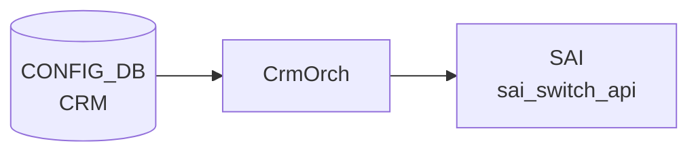

# CRM テーブル

## 概要

Critical Resource Monitoring ([CRM](../../reference/glossary.md#term-crm)) は ASIC の HW リソース使用率 (route / nexthop / [FDB](../../reference/glossary.md#term-fdb) / [ACL](../../reference/glossary.md#term-acl) / [NAT](../../reference/glossary.md#term-nat) / [MPLS](../../reference/glossary.md#term-mpls) / [SRv6](../../reference/glossary.md#term-srv6) / [DASH](../../reference/glossary.md#term-dash)) をポーリング監視し、閾値超過時に `THRESHOLD_EXCEEDED` / `THRESHOLD_CLEAR` アラートを生成する機能。設定は `CRM|Config` の単一エントリに集約される[^1]。`orchagent` の `CrmOrch` が [CONFIG_DB](../../reference/glossary.md#term-config_db) を購読し、`COUNTERS_DB` の [CRM](../../reference/glossary.md#term-crm) 統計を更新する。

<!-- cdb-mermaid -->
### データフロー (自動生成)



!!! note "凡例"
    CONFIG_DB から SAI までの典型経路を `docs/reference/config-db-orch-map.md` から機械生成したミニ図。詳細・例外は本ページ本文と対応表を参照。
<!-- /cdb-mermaid -->

## key 構造

```text
CRM|Config
```

(list ではなく単一 container)

## 主要フィールド

各リソースに対し `<resource>_threshold_type` / `<resource>_high_threshold` / `<resource>_low_threshold` の三つ組が並ぶ。

| 系統 | リソース key prefix |
|------|---------------------|
| [ACL](../../reference/glossary.md#term-acl) | `acl_table`, `acl_group`, `acl_entry`, `acl_counter` |
| FIB | `ipv4_route`, `ipv6_route`, `ipv4_nexthop`, `ipv6_nexthop`, `ipv4_neighbor`, `ipv6_neighbor` |
| [ECMP](../../reference/glossary.md#term-ecmp) | `nexthop_group`, `nexthop_group_member` |
| L2 | `fdb_entry` |
| [NAT](../../reference/glossary.md#term-nat) | `dnat_entry`, `snat_entry` |
| 多目的 | `ipmc_entry`, `mpls_inseg`, `mpls_nexthop` |
| [SRv6](../../reference/glossary.md#term-srv6) | `srv6_my_sid_entry`, `srv6_nexthop` |
| [DASH](../../reference/glossary.md#term-dash) | `dash_vnet`, `dash_eni`, `dash_eni_ether_address_map`, `dash_ipv4_inbound_routing`, `dash_ipv6_inbound_routing`, `dash_ipv4_outbound_routing`, `dash_ipv6_outbound_routing`, `dash_ipv4_pa_validation`, `dash_ipv6_pa_validation`, `dash_ipv4_outbound_ca_to_pa`, `dash_ipv6_outbound_ca_to_pa`, `dash_ipv4_acl_group`, `dash_ipv6_acl_group`, `dash_ipv4_acl_rule`, `dash_ipv6_acl_rule` |

各 `<resource>_threshold_type` は `crm_threshold_type` (`PERCENTAGE` / `USED` / `FREE`) を取る。`PERCENTAGE` のときは high/low ともに 0..100 でなければならない。

加えてグローバル設定:

| フィールド | 型 | 説明 |
|-----------|----|------|
| `polling_interval` | uint16 | リソース使用量ポーリング間隔 [秒] |

## 制約

- すべての three-tuple について `high_threshold > low_threshold` を `must` で強制
- [DASH](../../reference/glossary.md#term-dash) 系列は `DEVICE_METADATA.localhost.switch_type = 'dpu'` のときのみ有効 (`when`)

<!-- cdb-exceptions -->
## 例外条件・特殊挙動

- **percentage 閾値が 100 超 → runtime_error → エラーログ + return**: `threshold_type = percentage` のとき `low_threshold > 100` または `high_threshold > 100` の場合 `runtime_error("CRM percentage threshold value must be <= 100%%")` が発生し、catch → `SWSS_LOG_ERROR` + `return`。残りフィールドも適用されない。<!-- evidence: crmorch.cpp L429-431, L529-531 -->
- **low >= high → runtime_error**: `low_threshold >= high_threshold` の場合も同様に `runtime_error("CRM low threshold must be less then high threshold")` → エラーログ + return。<!-- evidence: crmorch.cpp L433-435 -->
- **DEL コマンド → 非対応エラーログのみ**: `op == DEL_COMMAND` が来ると `SWSS_LOG_ERROR("Unsupported operation type")` を出力するが閾値は変更されない。CRM 設定の削除は未サポート。<!-- evidence: crmorch.cpp L465-466 -->
- **不明属性フィールド → エラーログ + return (残フィールドも適用されない)**: `polling_interval` / 各 threshold_type / threshold_low / threshold_high 以外のフィールドが来ると `SWSS_LOG_ERROR("Failed to parse CRM ... Unknown attribute %s.")` して `return`。<!-- evidence: crmorch.cpp L526 -->
- **未対応 SAI リソース → ignore**: タイマー処理で取得できないリソースは `// ignore unsupported resources` としてスキップ。<!-- evidence: crmorch.cpp L884 -->

<!-- value-behavior -->
## 値依存挙動マトリクス

| フィールド | 値 | 挙動 |
|-----------|-----|------|
| `<resource>_threshold_type` | `percentage`（既定） | 閾値を使用率 % として解釈。`high_threshold > 100` または `low_threshold > 100` の場合 runtime_error を発生させ処理を中断（`crmorch.cpp:428-431`）。アラートは `used/total * 100 >= high_threshold` で発火。 |
| `<resource>_threshold_type` | `used` | 閾値を「使用中エントリ数」の絶対値として解釈。ASIC の total 数に依存せず細かく制御可能。100 超でもエラーにならない。 |
| `<resource>_threshold_type` | `free` | 閾値を「空きエントリ数」として解釈。アラートの超過/クリアの向きが percentage/used と逆（残り少なくなると EXCEEDED）。 |
| `dash_*_threshold_type` | 任意 | `DEVICE_METADATA.switch_type = 'dpu'` のときのみ有効（YANG `when` 制約）。通常スイッチでは YANG validator が拒否。 |
<!-- /value-behavior -->

## 購読者

- `orchagent` の `CrmOrch`: ポーリング、[SAI](../../reference/glossary.md#term-sai) から使用量取得、[COUNTERS_DB](../../reference/glossary.md#term-counters_db) 更新、syslog アラート

## 関連 CONFIG_DB / YANG / CLI

- 関連 [CONFIG_DB](../../reference/glossary.md#term-config_db): `DEVICE_METADATA`
- 関連 CLI: `crm config thresholds ...`、`crm show resources/thresholds`
- 関連 [YANG](../../reference/glossary.md#term-yang): `sonic-crm`

<!-- ref-triangle:start -->

## 関連リファレンス

- [YANG](../../reference/glossary.md#term-yang): [`sonic-crm`](../yang/sonic-crm.md)
- CLI: `crm config`

<!-- ref-triangle:end -->

## 引用元

[^1]: [YANG](../../reference/glossary.md#term-yang) 定義: `sonic-crm.yang`. <https://github.com/sonic-net/sonic-buildimage/blob/9ea932ec2e18f35e58268ec2e4456b1d4afd65cd/src/sonic-yang-models/yang-models/sonic-crm.yang>

<!-- topics-back-ref -->
## 関連 Topics

- [Topics: Telemetry / SNMP / Observability](../../topics/09-telemetry-snmp/index.md)

<!-- /topics-back-ref -->

<!-- ops-hint -->
## 運用ヒント

### 典型値

- key 形式: `CRM|Config`。
- `acl_table_threshold_type`: `percentage` / `used` / `free`。
- `*_high_threshold` / `*_low_threshold`: 70 / 60 など。
- `polling_interval`: 300（秒）。

### よくある誤設定

- 閾値を 100% に近く設定すると alert が遅れ、[ACL](../../reference/glossary.md#term-acl) 追加で [SAI](../../reference/glossary.md#term-sai) エラーが先に起きる。70%/80% 程度で運用するのが定石。

### 確認コマンド

```bash
sonic-db-cli CONFIG_DB hgetall 'CRM|Config'
crm show summary
crm show resources all
```
<!-- /ops-hint -->


<!-- runtime-trace -->
## 実コンテナ動作トレース

### 段階 1 — Consumer 登録

`CrmOrch` (orchagent 直接 CFG 購読) が CONFIG_DB の `CRM` テーブルを購読する。

`CRM` の key は `Config` (単一エントリ)。各リソース (`ipv4_route`, `nexthop` 等) の threshold を個別設定。

### 段階 2 — CFG→APPL 翻訳

なし (orchagent が直接 CONFIG_DB を購読)

### 段階 3 — APPL→SAI

`sai_switch_api` — SAI resource counter の polling interval / threshold を設定

### 段階 4 — タイミングと副作用

**適用タイミング**: orchagent 起動時と CONFIG_DB 変化時に即時反映。SAI リソースカウンタの polling は設定した interval で定期実行される。

**副作用**: `polling_interval` 変更は次回 polling から有効。`threshold_type`/`threshold` 変更はリソース枯渇警告の発火条件を変更する。
<!-- /runtime-trace -->

<!-- entry-points -->
## 書き込み入り口 (Direction A)

対象テーブル: `CRM`

### CLI
- `config crm thresholds <resource> type/low/high <value>`
  - ソース: `sonic-utilities/config/main.py (crm グループ)`

### minigraph / sonic-cfggen
- なし

### REST / gNMI (sonic-mgmt-common)
- なし (対応 OpenConfig/SONiC YANG transformer なし)

### db_migrator
- なし

### ビルド時デフォルト (init_cfg / j2 テンプレート)
- `init_cfg.json.j2` にデフォルト CRM 閾値が定義されている (`CRM.Config.*`)

### ハードコードデフォルト

`orchagent/crmorch.cpp` のプリプロセッサ定数として以下がハードコードされている:

| 定数名 | 値 | 意味 |
|-------|----|------|
| `CRM_POLLING_INTERVAL_DEFAULT` | `300` (= 5 * 60) | デフォルト polling 間隔 [秒] |
| `CRM_THRESHOLD_TYPE_DEFAULT` | `CRM_PERCENTAGE` | デフォルト閾値タイプ (percentage) |
| `CRM_THRESHOLD_LOW_DEFAULT` | `70` | デフォルト低閾値 [%] |
| `CRM_THRESHOLD_HIGH_DEFAULT` | `85` | デフォルト高閾値 [%] |
| `CRM_EXCEEDED_MSG_MAX` | `10` | 閾値超過メッセージ送出の上限回数 |
| `CRM_ACL_RESOURCE_COUNT` | `256` | ACL リソース初期確保数 |

これらの値は `CrmOrch` コンストラクタ (`crmorch.cpp:398-410`) で各リソースの初期 `CrmResourceEntry` に適用される。CONFIG_DB に対応フィールドが存在しない限り変更不可。

### ランタイム注入 (デーモン自動書き込み)
- なし
<!-- /entry-points -->

<!-- constants -->
## ハードコード定数 (Phase E)

ソース: `sonic-swss/orchagent/crmorch.cpp`

### プリプロセッサ定数

| 定数 | 値 | 説明 |
|------|----|------|
| `CRM_POLLING_INTERVAL_DEFAULT` | `300` (5×60 秒) | `CrmOrch` 起動時のデフォルト polling 間隔。CONFIG_DB に `polling_interval` が書かれていない限りこの値が使われる。`evidence: crmorch.cpp:12,402,406` |
| `CRM_THRESHOLD_TYPE_DEFAULT` | `CrmThresholdType::CRM_PERCENTAGE` | 全リソースの初期閾値タイプ。CONFIG_DB 未設定時は percentage モードで動作。`evidence: crmorch.cpp:13,410` |
| `CRM_THRESHOLD_LOW_DEFAULT` | `70` | 全リソースの初期 low threshold [%]。`evidence: crmorch.cpp:14,410` |
| `CRM_THRESHOLD_HIGH_DEFAULT` | `85` | 全リソースの初期 high threshold [%]。`evidence: crmorch.cpp:15,410` |
| `CRM_EXCEEDED_MSG_MAX` | `10` | 閾値超過通知の最大送出回数（連続アラート抑制）。`evidence: crmorch.cpp:16` |
| `CRM_ACL_RESOURCE_COUNT` | `256` | ACL リソースマップの初期確保エントリ数。`evidence: crmorch.cpp:17` |

### resource タイプ enum (CrmResourceType)

`crmResTypeNameMap` (crmorch.cpp:28-72) で定義される全リソース識別子:

| CrmResourceType 値 | CONFIG_DB キー prefix |
|--------------------|-----------------------|
| `CRM_IPV4_ROUTE` | `ipv4_route` |
| `CRM_IPV6_ROUTE` | `ipv6_route` |
| `CRM_IPV4_NEXTHOP` | `ipv4_nexthop` |
| `CRM_IPV6_NEXTHOP` | `ipv6_nexthop` |
| `CRM_IPV4_NEIGHBOR` | `ipv4_neighbor` |
| `CRM_IPV6_NEIGHBOR` | `ipv6_neighbor` |
| `CRM_NEXTHOP_GROUP_MEMBER` | `nexthop_group_member` |
| `CRM_NEXTHOP_GROUP` | `nexthop_group` |
| `CRM_ACL_TABLE` | `acl_table` |
| `CRM_ACL_GROUP` | `acl_group` |
| `CRM_ACL_ENTRY` | `acl_entry` |
| `CRM_ACL_COUNTER` | `acl_counter` |
| `CRM_FDB_ENTRY` | `fdb_entry` |
| `CRM_IPMC_ENTRY` | `ipmc_entry` |
| `CRM_SNAT_ENTRY` | `snat_entry` |
| `CRM_DNAT_ENTRY` | `dnat_entry` |
| `CRM_MPLS_INSEG` | `mpls_inseg` |
| `CRM_MPLS_NEXTHOP` | `mpls_nexthop` |
| `CRM_SRV6_MY_SID_ENTRY` | `srv6_my_sid_entry` |
| `CRM_SRV6_NEXTHOP` | `srv6_nexthop` |
| `CRM_NEXTHOP_GROUP_MAP` | `nexthop_group_map` |
| `CRM_EXT_TABLE` | `extension_table` |
| `CRM_DASH_VNET` | `dash_vnet` |
| `CRM_DASH_ENI` | `dash_eni` |
| `CRM_DASH_ENI_ETHER_ADDRESS_MAP` | `dash_eni_ether_address_map` |
| `CRM_DASH_IPV4_INBOUND_ROUTING` | `dash_ipv4_inbound_routing` |
| `CRM_DASH_IPV6_INBOUND_ROUTING` | `dash_ipv6_inbound_routing` |
| `CRM_DASH_IPV4_OUTBOUND_ROUTING` | `dash_ipv4_outbound_routing` |
| `CRM_DASH_IPV6_OUTBOUND_ROUTING` | `dash_ipv6_outbound_routing` |
| `CRM_DASH_IPV4_PA_VALIDATION` | `dash_ipv4_pa_validation` |
| `CRM_DASH_IPV6_PA_VALIDATION` | `dash_ipv6_pa_validation` |
| `CRM_DASH_IPV4_OUTBOUND_CA_TO_PA` | `dash_ipv4_outbound_ca_to_pa` |
| `CRM_DASH_IPV6_OUTBOUND_CA_TO_PA` | `dash_ipv6_outbound_ca_to_pa` |
| `CRM_DASH_IPV4_ACL_GROUP` | `dash_ipv4_acl_group` |
| `CRM_DASH_IPV6_ACL_GROUP` | `dash_ipv6_acl_group` |
| `CRM_DASH_IPV4_ACL_RULE` | `dash_ipv4_acl_rule` |
| `CRM_DASH_IPV6_ACL_RULE` | `dash_ipv6_acl_rule` |
| `CRM_DASH_IPV4_METER_POLICY` | `dash_ipv4_meter_policy` |
| `CRM_DASH_IPV4_METER_RULE` | `dash_ipv4_meter_rule` |
| `CRM_DASH_IPV6_METER_POLICY` | `dash_ipv6_meter_policy` |
| `CRM_DASH_IPV6_METER_RULE` | `dash_ipv6_meter_rule` |
| `CRM_TWAMP_ENTRY` | `twamp_entry` |

### CrmThresholdType enum

| 値 | CONFIG_DB 文字列 | 説明 |
|----|-----------------|------|
| `CRM_PERCENTAGE` | `"percentage"` | 使用率 % で閾値判定（デフォルト） |
| `CRM_USED` | `"used"` | 使用エントリ数の絶対値で判定 |
| `CRM_FREE` | `"free"` | 空きエントリ数の絶対値で判定 |

`evidence: crmorch.cpp:299-303`
<!-- /constants -->


<!-- derivation -->
## 派生・条件付き登録 (Phase 6/7)

### Phase 6: 値による他フィールド自動派生

| 条件 | 派生先 | evidence |
|---|---|---|
| ビルド時 `init_cfg.json.j2` が CRM テーブルにデフォルト閾値を設定 | `CRM.Config.polling_interval = 300`、全リソースの `*_threshold_type = percentage`、`*_low_threshold = 70`、`*_high_threshold = 85` | `sonic-buildimage/files/build_templates/init_cfg.json.j2:11-21` |

### Phase 7: 条件付き module/manager 登録

| 条件 | 登録 module | evidence |
|---|---|---|
| 常時（条件なし） | `CrmOrch` が `CRM` テーブルを `doTask` で購読 | `sonic-swss/orchagent/crmorch.cpp:440-477` |

### grep カバレッジ

- init_cfg.json.j2 L11-21: CRM デフォルト閾値設定
- crmorch.cpp L440: doTask 登録（条件なし）
<!-- /derivation -->
<!-- handler-branching -->
### Phase 8: Handler メソッド内分岐

| Manager / Handler | メソッド | 分岐条件 | 効果 | evidence |
|---|---|---|---|---|
| `CrmOrch` | `doTask()` | `op == DEL_COMMAND` | `log_error` のみ（削除操作は非サポート、無視） | `sonic-swss/orchagent/crmorch.cpp:463` |
| `CrmOrch` | `handleSetCommand()` | `field == CRM_POLLING_INTERVAL` | タイマー間隔を更新・リセット | `sonic-swss/orchagent/crmorch.cpp:487` |
| `CrmOrch` | `handleSetCommand()` | `field` が `crmThreshTypeResMap` に存在する | threshold_type を更新し exceeded カウンタをリセット | `sonic-swss/orchagent/crmorch.cpp:497` |
| `CrmOrch` | `handleSetCommand()` | `field` が `crmThreshLowResMap` に存在する | lowThreshold を更新 | `sonic-swss/orchagent/crmorch.cpp:509` |
| `CrmOrch` | `handleSetCommand()` | `field` が `crmThreshHighResMap` に存在する | highThreshold を更新 | `sonic-swss/orchagent/crmorch.cpp:515` |
| `CrmOrch` | `handleSetCommand()` | 上記いずれにも該当しない field | `log_error`（未知フィールド） | `sonic-swss/orchagent/crmorch.cpp:521` |

> **スキャン証跡**: `CrmOrch::doTask` L440-477 + `handleSetCommand` L478-537 全行読了。6 件分岐抽出。
<!-- /handler-branching -->
<!-- defaults -->
## コード由来の暗黙デフォルト (Phase A)

### ハードコードデフォルト (crmorch.cpp L12-15)

`CrmOrch` コンストラクタは、CONFIG_DB に `CRM|Config` エントリが存在しない場合でも、全リソースに対して以下の値を即時適用する。

| フィールド | 暗黙デフォルト値 | 由来 |
|---|---|---|
| `polling_interval` | **300** 秒 | `#define CRM_POLLING_INTERVAL_DEFAULT (5 * 60)` (crmorch.cpp:12) |
| `*_threshold_type` (全リソース) | **`percentage`** | `CRM_THRESHOLD_TYPE_DEFAULT` (crmorch.cpp:13) |
| `*_low_threshold` (全リソース) | **70** | `CRM_THRESHOLD_LOW_DEFAULT` (crmorch.cpp:14) |
| `*_high_threshold` (全リソース) | **85** | `CRM_THRESHOLD_HIGH_DEFAULT` (crmorch.cpp:15) |

YANG には `default` ステートメントが存在しない。実行時デフォルトは純粋に C++ マクロ定義のみで決まる。

### init_cfg.json.j2 との対象リソース乖離

`init_cfg.json.j2` がデフォルト設定するのは 18 リソース (YANG 定義済み範囲: `ipv4_route` / `fdb_entry` / `mpls_inseg` 等) のみ。一方、`crmResTypeNameMap` には以下の追加リソースが含まれており、CONFIG_DB に設定がなくてもオーケストレータ起動時に **percentage/70/85 で監視開始**する:

- `srv6_my_sid_entry`, `srv6_nexthop`, `nexthop_group_map`, `extension_table`
- `dash_vnet`, `dash_eni`, `dash_eni_ether_address_map` ほか DASH 系全リソース
- `twamp_entry`

### 暗黙副作用

| 副作用 | 条件 | 詳細 |
|---|---|---|
| COUNTERS_DB CRM 統計の初期消去 | orchagent 起動毎 | コンストラクタで `m_countersCrmTable->del("STATS")` が走り、次の polling (最大 300 秒後) まで統計が空になる (crmorch.cpp:414) |
| アラート silent drop | 同一リソースで閾値超過 10 回以上 | `exceededLogCounter >= CRM_EXCEEDED_MSG_MAX (10)` で syslog を停止。`threshold_type` 変更でリセット (crmorch.cpp:16, 1179) |
| DASH リソースの monitoring skip | `gMySwitchType != "dpu"` | `CRM_DASH_*` リソースを `CRM_RES_NOT_SUPPORTED` にセットし polling/alert を一切行わない。CONFIG_DB への書き込みは受け入れるが監視は無効 (crmorch.cpp:839, 933-936) |
| `threshold_type` 変更時の exceededLogCounter リセット | type が変化した場合のみ | 全サブカウンタ (ACL stage/bind_point 単位) の `exceededLogCounter` を 0 にリセット。次 cycle で超過があれば即 WARN (crmorch.cpp:503-507) |

### YANG-実装 discrepancy

YANG の `must` は `high_threshold < 100` (strictly less) を要求するが、実装 (`CrmResourceEntry` コンストラクタ) が例外を発生させるのは `> 100` のときのみ。**値 100 は YANG では拒否されるが、実装では通過する。** <!-- evidence: sonic-crm.yang L38-40, crmorch.cpp L428-431 -->

### 大文字小文字制約 (silent substitution なし)

`crmThreshTypeMap` は `"percentage"` / `"used"` / `"free"` の小文字のみを受け付ける。大文字 (`PERCENTAGE` 等) を CONFIG_DB に書き込むと `std::out_of_range` 例外 → `SWSS_LOG_ERROR` + `return` (残フィールドも適用されない)。YANG 型 `crm_threshold_type` は大文字も許容するため、YANG バリデーション通過後でも実装側でエラーとなる。<!-- evidence: crmorch.cpp L299-303, L496, L530-531 -->
<!-- /defaults -->

<!-- cross-refs -->
## 暗黙参照（Phase C）

`CrmOrch` が `CRM` テーブルを処理する際、以下の外部テーブル・DB を明示的な設定フィールドとしてではなく、**実行時の判定条件または書き込み先**として暗黙的に参照する。

| 参照先 | 参照種別 | 具体的な利用箇所 | evidence |
|--------|----------|-----------------|----------|
| `DEVICE_METADATA.localhost.switch_type` | 読み取り（実行時条件） | `gMySwitchType` グローバル変数経由。`"dpu"` のとき DASH 系 ACL グループリソースの可用性チェック (`getDashAclGroupResAvailability`) を実行し、それ以外は `CRM_RES_NOT_SUPPORTED` を返す。 | `sonic-swss/orchagent/crmorch.cpp:839`, `main.cpp:658` |
| `COUNTERS_DB` (`CRM` テーブル) | 書き込み | `updateCrmCountersTable()` 内で `m_countersCrmTable->set()` により全リソースの `used` / `available` カウンタを定期書き込み。`crm show resources` が参照する統計値の実体。 | `sonic-swss/orchagent/crmorch.cpp:400-401,1067-1109` |
| SAI `sai_switch_api` (`SAI_SWITCH_ATTR_AVAILABLE_*`) | SAI 読み取り | `getSwitchResAvailability()` で `sai_switch_api->get_switch_attribute()` を呼び出し、各リソースの空き数を取得。`SWITCH` オブジェクト属性を介した間接参照。 | `sonic-swss/orchagent/crmorch.cpp:76-92,975` |

### 依存関係サマリ

```
DEVICE_METADATA.localhost.switch_type
  → gMySwitchType == "dpu" のとき DASH CRM リソースが有効化

CRM|Config (CONFIG_DB)
  → CrmOrch が polling_interval / threshold を読み取り

SAI sai_switch_api (SWITCH 属性)
  → 各リソースの available カウンタ取得

COUNTERS_DB CRM テーブル
  ← CrmOrch が used / available カウンタを書き込み
```
<!-- /cross-refs -->
<!-- glossary-links-injected: c6e41e02b036 -->
