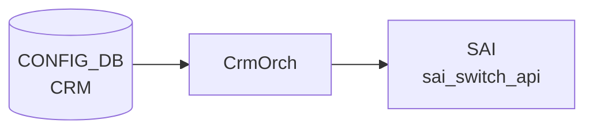

# CRM テーブル

## 概要

Critical Resource Monitoring (CRM) は ASIC の HW リソース使用率 (route / nexthop / FDB / ACL / NAT / MPLS / SRv6 / DASH) をポーリング監視し、閾値超過時に `THRESHOLD_EXCEEDED` / `THRESHOLD_CLEAR` アラートを生成する機能。設定は `CRM|Config` の単一エントリに集約される[^1]。`orchagent` の `CrmOrch` が CONFIG_DB を購読し、`COUNTERS_DB` の CRM 統計を更新する。

<!-- cdb-mermaid -->
### データフロー (自動生成)



!!! note "凡例"
    CONFIG_DB から SAI までの典型経路を `docs/reference/config-db-orch-map.md` から機械生成したミニ図。詳細・例外は本ページ本文と対応表を参照。
<!-- /cdb-mermaid -->

## key 構造

```
CRM|Config
```

(list ではなく単一 container)

## 主要フィールド

各リソースに対し `<resource>_threshold_type` / `<resource>_high_threshold` / `<resource>_low_threshold` の三つ組が並ぶ。

| 系統 | リソース key prefix |
|------|---------------------|
| ACL | `acl_table`, `acl_group`, `acl_entry`, `acl_counter` |
| FIB | `ipv4_route`, `ipv6_route`, `ipv4_nexthop`, `ipv6_nexthop`, `ipv4_neighbor`, `ipv6_neighbor` |
| ECMP | `nexthop_group`, `nexthop_group_member` |
| L2 | `fdb_entry` |
| NAT | `dnat_entry`, `snat_entry` |
| 多目的 | `ipmc_entry`, `mpls_inseg`, `mpls_nexthop` |
| SRv6 | `srv6_my_sid_entry`, `srv6_nexthop` |
| DASH | `dash_vnet`, `dash_eni`, `dash_eni_ether_address_map`, `dash_ipv4_inbound_routing`, `dash_ipv6_inbound_routing`, `dash_ipv4_outbound_routing`, `dash_ipv6_outbound_routing`, `dash_ipv4_pa_validation`, `dash_ipv6_pa_validation`, `dash_ipv4_outbound_ca_to_pa`, `dash_ipv6_outbound_ca_to_pa`, `dash_ipv4_acl_group`, `dash_ipv6_acl_group`, `dash_ipv4_acl_rule`, `dash_ipv6_acl_rule` |

各 `<resource>_threshold_type` は `crm_threshold_type` (`PERCENTAGE` / `USED` / `FREE`) を取る。`PERCENTAGE` のときは high/low ともに 0..100 でなければならない。

加えてグローバル設定:

| フィールド | 型 | 説明 |
|-----------|----|------|
| `polling_interval` | uint16 | リソース使用量ポーリング間隔 [秒] |

## 制約

- すべての three-tuple について `high_threshold > low_threshold` を `must` で強制
- DASH 系列は `DEVICE_METADATA.localhost.switch_type = 'dpu'` のときのみ有効 (`when`)

## 購読者

- `orchagent` の `CrmOrch`: ポーリング、SAI から使用量取得、COUNTERS_DB 更新、syslog アラート

## 関連 CONFIG_DB / YANG / CLI

- 関連 CONFIG_DB: `DEVICE_METADATA`
- 関連 CLI: `crm config thresholds ...`、`crm show resources/thresholds`
- 関連 YANG: `sonic-crm`

<!-- ref-triangle:start -->

## 関連リファレンス

- YANG: [`sonic-crm`](../yang/sonic-crm.md)
- CLI: `crm config`

<!-- ref-triangle:end -->

## 引用元

[^1]: YANG 定義: `sonic-crm.yang`. <https://github.com/sonic-net/sonic-buildimage/blob/9ea932ec2e18f35e58268ec2e4456b1d4afd65cd/src/sonic-yang-models/yang-models/sonic-crm.yang>

<!-- topics-back-ref -->
## 関連 Topics

- [Topics: Telemetry / SNMP / Observability](../../topics/09-telemetry-snmp/index.md)

<!-- /topics-back-ref -->

<!-- ops-hint -->
## 運用ヒント

### 典型値

- key 形式: `CRM|Config`。
- `acl_table_threshold_type`: `percentage` / `used` / `free`。
- `*_high_threshold` / `*_low_threshold`: 70 / 60 など。
- `polling_interval`: 300（秒）。

### よくある誤設定

- 閾値を 100% に近く設定すると alert が遅れ、ACL 追加で SAI エラーが先に起きる。70%/80% 程度で運用するのが定石。

### 確認コマンド

```bash
sonic-db-cli CONFIG_DB hgetall 'CRM|Config'
crm show summary
crm show resources all
```
<!-- /ops-hint -->
