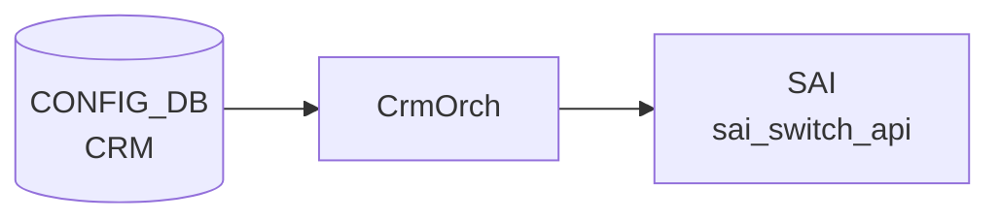

# CRM テーブル

## 概要

Critical Resource Monitoring ([CRM](../../reference/glossary.md#term-crm)) は ASIC の HW リソース使用率 (route / nexthop / [FDB](../../reference/glossary.md#term-fdb) / [ACL](../../reference/glossary.md#term-acl) / [NAT](../../reference/glossary.md#term-nat) / [MPLS](../../reference/glossary.md#term-mpls) / [SRv6](../../reference/glossary.md#term-srv6) / [DASH](../../reference/glossary.md#term-dash)) をポーリング監視し、閾値超過時に `THRESHOLD_EXCEEDED` / `THRESHOLD_CLEAR` アラートを生成する機能。設定は `CRM|Config` の単一エントリに集約される[^1]。`orchagent` の `CrmOrch` が [CONFIG_DB](../../reference/glossary.md#term-config_db) を購読し、`COUNTERS_DB` の [CRM](../../reference/glossary.md#term-crm) 統計を更新する。

<!-- cdb-mermaid -->
### データフロー (自動生成)



!!! note "凡例"
    CONFIG_DB から SAI までの典型経路を `docs/reference/config-db-orch-map.md` から機械生成したミニ図。詳細・例外は本ページ本文と対応表を参照。
<!-- /cdb-mermaid -->

## key 構造

```text
CRM|Config
```

(list ではなく単一 container)

## 主要フィールド

各リソースに対し `<resource>_threshold_type` / `<resource>_high_threshold` / `<resource>_low_threshold` の三つ組が並ぶ。

| 系統 | リソース key prefix |
|------|---------------------|
| [ACL](../../reference/glossary.md#term-acl) | `acl_table`, `acl_group`, `acl_entry`, `acl_counter` |
| FIB | `ipv4_route`, `ipv6_route`, `ipv4_nexthop`, `ipv6_nexthop`, `ipv4_neighbor`, `ipv6_neighbor` |
| [ECMP](../../reference/glossary.md#term-ecmp) | `nexthop_group`, `nexthop_group_member` |
| L2 | `fdb_entry` |
| [NAT](../../reference/glossary.md#term-nat) | `dnat_entry`, `snat_entry` |
| 多目的 | `ipmc_entry`, `mpls_inseg`, `mpls_nexthop` |
| [SRv6](../../reference/glossary.md#term-srv6) | `srv6_my_sid_entry`, `srv6_nexthop` |
| [DASH](../../reference/glossary.md#term-dash) | `dash_vnet`, `dash_eni`, `dash_eni_ether_address_map`, `dash_ipv4_inbound_routing`, `dash_ipv6_inbound_routing`, `dash_ipv4_outbound_routing`, `dash_ipv6_outbound_routing`, `dash_ipv4_pa_validation`, `dash_ipv6_pa_validation`, `dash_ipv4_outbound_ca_to_pa`, `dash_ipv6_outbound_ca_to_pa`, `dash_ipv4_acl_group`, `dash_ipv6_acl_group`, `dash_ipv4_acl_rule`, `dash_ipv6_acl_rule` |

各 `<resource>_threshold_type` は `crm_threshold_type` (`PERCENTAGE` / `USED` / `FREE`) を取る。`PERCENTAGE` のときは high/low ともに 0..100 でなければならない。

加えてグローバル設定:

| フィールド | 型 | 説明 |
|-----------|----|------|
| `polling_interval` | uint16 | リソース使用量ポーリング間隔 [秒] |

## 制約

- すべての three-tuple について `high_threshold > low_threshold` を `must` で強制
- [DASH](../../reference/glossary.md#term-dash) 系列は `DEVICE_METADATA.localhost.switch_type = 'dpu'` のときのみ有効 (`when`)

<!-- cdb-exceptions -->
## 例外条件・特殊挙動

- **percentage 閾値が 100 超 → runtime_error → エラーログ + return**: `threshold_type = percentage` のとき `low_threshold > 100` または `high_threshold > 100` の場合 `runtime_error("CRM percentage threshold value must be <= 100%%")` が発生し、catch → `SWSS_LOG_ERROR` + `return`。残りフィールドも適用されない。<!-- evidence: crmorch.cpp L429-431, L529-531 -->
- **low >= high → runtime_error**: `low_threshold >= high_threshold` の場合も同様に `runtime_error("CRM low threshold must be less then high threshold")` → エラーログ + return。<!-- evidence: crmorch.cpp L433-435 -->
- **DEL コマンド → 非対応エラーログのみ**: `op == DEL_COMMAND` が来ると `SWSS_LOG_ERROR("Unsupported operation type")` を出力するが閾値は変更されない。CRM 設定の削除は未サポート。<!-- evidence: crmorch.cpp L465-466 -->
- **不明属性フィールド → エラーログ + return (残フィールドも適用されない)**: `polling_interval` / 各 threshold_type / threshold_low / threshold_high 以外のフィールドが来ると `SWSS_LOG_ERROR("Failed to parse CRM ... Unknown attribute %s.")` して `return`。<!-- evidence: crmorch.cpp L526 -->
- **未対応 SAI リソース → ignore**: タイマー処理で取得できないリソースは `// ignore unsupported resources` としてスキップ。<!-- evidence: crmorch.cpp L884 -->

<!-- value-behavior -->
## 値依存挙動マトリクス

| フィールド | 値 | 挙動 |
|-----------|-----|------|
| `<resource>_threshold_type` | `percentage`（既定） | 閾値を使用率 % として解釈。`high_threshold > 100` または `low_threshold > 100` の場合 runtime_error を発生させ処理を中断（`crmorch.cpp:428-431`）。アラートは `used/total * 100 >= high_threshold` で発火。 |
| `<resource>_threshold_type` | `used` | 閾値を「使用中エントリ数」の絶対値として解釈。ASIC の total 数に依存せず細かく制御可能。100 超でもエラーにならない。 |
| `<resource>_threshold_type` | `free` | 閾値を「空きエントリ数」として解釈。アラートの超過/クリアの向きが percentage/used と逆（残り少なくなると EXCEEDED）。 |
| `dash_*_threshold_type` | 任意 | `DEVICE_METADATA.switch_type = 'dpu'` のときのみ有効（YANG `when` 制約）。通常スイッチでは YANG validator が拒否。 |
<!-- /value-behavior -->

## 購読者

- `orchagent` の `CrmOrch`: ポーリング、[SAI](../../reference/glossary.md#term-sai) から使用量取得、[COUNTERS_DB](../../reference/glossary.md#term-counters_db) 更新、syslog アラート

## 関連 CONFIG_DB / YANG / CLI

- 関連 [CONFIG_DB](../../reference/glossary.md#term-config_db): `DEVICE_METADATA`
- 関連 CLI: `crm config thresholds ...`、`crm show resources/thresholds`
- 関連 [YANG](../../reference/glossary.md#term-yang): `sonic-crm`

<!-- ref-triangle:start -->

## 関連リファレンス

- [YANG](../../reference/glossary.md#term-yang): [`sonic-crm`](../yang/sonic-crm.md)
- CLI: `crm config`

<!-- ref-triangle:end -->

## 引用元

[^1]: [YANG](../../reference/glossary.md#term-yang) 定義: `sonic-crm.yang`. <https://github.com/sonic-net/sonic-buildimage/blob/9ea932ec2e18f35e58268ec2e4456b1d4afd65cd/src/sonic-yang-models/yang-models/sonic-crm.yang>

<!-- topics-back-ref -->
## 関連 Topics

- [Topics: Telemetry / SNMP / Observability](../../topics/09-telemetry-snmp/index.md)

<!-- /topics-back-ref -->

<!-- ops-hint -->
## 運用ヒント

### 典型値

- key 形式: `CRM|Config`。
- `acl_table_threshold_type`: `percentage` / `used` / `free`。
- `*_high_threshold` / `*_low_threshold`: 70 / 60 など。
- `polling_interval`: 300（秒）。

### よくある誤設定

- 閾値を 100% に近く設定すると alert が遅れ、[ACL](../../reference/glossary.md#term-acl) 追加で [SAI](../../reference/glossary.md#term-sai) エラーが先に起きる。70%/80% 程度で運用するのが定石。

### 確認コマンド

```bash
sonic-db-cli CONFIG_DB hgetall 'CRM|Config'
crm show summary
crm show resources all
```
<!-- /ops-hint -->


<!-- runtime-trace -->
## 実コンテナ動作トレース

### 段階 1 — Consumer 登録

`CrmOrch` (orchagent 直接 CFG 購読) が CONFIG_DB の `CRM` テーブルを購読する。

`CRM` の key は `Config` (単一エントリ)。各リソース (`ipv4_route`, `nexthop` 等) の threshold を個別設定。

### 段階 2 — CFG→APPL 翻訳

なし (orchagent が直接 CONFIG_DB を購読)

### 段階 3 — APPL→SAI

`sai_switch_api` — SAI resource counter の polling interval / threshold を設定

### 段階 4 — タイミングと副作用

**適用タイミング**: orchagent 起動時と CONFIG_DB 変化時に即時反映。SAI リソースカウンタの polling は設定した interval で定期実行される。

**副作用**: `polling_interval` 変更は次回 polling から有効。`threshold_type`/`threshold` 変更はリソース枯渇警告の発火条件を変更する。
<!-- /runtime-trace -->

<!-- entry-points -->
## 書き込み入り口 (Direction A)

対象テーブル: `CRM`

### CLI
- `config crm thresholds <resource> type/low/high <value>`
  - ソース: `sonic-utilities/config/main.py (crm グループ)`

### minigraph / sonic-cfggen
- なし

### REST / gNMI (sonic-mgmt-common)
- なし (対応 OpenConfig/SONiC YANG transformer なし)

### db_migrator
- なし

### ビルド時デフォルト (init_cfg / j2 テンプレート)
- `init_cfg.json.j2` にデフォルト CRM 閾値が定義されている (`CRM.Config.*`)

### ハードコードデフォルト
- なし

### ランタイム注入 (デーモン自動書き込み)
- なし
<!-- /entry-points -->


<!-- derivation -->
## 派生・条件付き登録 (Phase 6/7)

### Phase 6: 値による他フィールド自動派生

| 条件 | 派生先 | evidence |
|---|---|---|
| ビルド時 `init_cfg.json.j2` が CRM テーブルにデフォルト閾値を設定 | `CRM.Config.polling_interval = 300`、全リソースの `*_threshold_type = percentage`、`*_low_threshold = 70`、`*_high_threshold = 85` | `sonic-buildimage/files/build_templates/init_cfg.json.j2:11-21` |

### Phase 7: 条件付き module/manager 登録

| 条件 | 登録 module | evidence |
|---|---|---|
| 常時（条件なし） | `CrmOrch` が `CRM` テーブルを `doTask` で購読 | `sonic-swss/orchagent/crmorch.cpp:440-477` |

### grep カバレッジ

- init_cfg.json.j2 L11-21: CRM デフォルト閾値設定
- crmorch.cpp L440: doTask 登録（条件なし）
<!-- /derivation -->
<!-- handler-branching -->
### Phase 8: Handler メソッド内分岐

| Manager / Handler | メソッド | 分岐条件 | 効果 | evidence |
|---|---|---|---|---|
| `CrmOrch` | `doTask()` | `op == DEL_COMMAND` | `log_error` のみ（削除操作は非サポート、無視） | `sonic-swss/orchagent/crmorch.cpp:463` |
| `CrmOrch` | `handleSetCommand()` | `field == CRM_POLLING_INTERVAL` | タイマー間隔を更新・リセット | `sonic-swss/orchagent/crmorch.cpp:487` |
| `CrmOrch` | `handleSetCommand()` | `field` が `crmThreshTypeResMap` に存在する | threshold_type を更新し exceeded カウンタをリセット | `sonic-swss/orchagent/crmorch.cpp:497` |
| `CrmOrch` | `handleSetCommand()` | `field` が `crmThreshLowResMap` に存在する | lowThreshold を更新 | `sonic-swss/orchagent/crmorch.cpp:509` |
| `CrmOrch` | `handleSetCommand()` | `field` が `crmThreshHighResMap` に存在する | highThreshold を更新 | `sonic-swss/orchagent/crmorch.cpp:515` |
| `CrmOrch` | `handleSetCommand()` | 上記いずれにも該当しない field | `log_error`（未知フィールド） | `sonic-swss/orchagent/crmorch.cpp:521` |

> **スキャン証跡**: `CrmOrch::doTask` L440-477 + `handleSetCommand` L478-537 全行読了。6 件分岐抽出。
<!-- /handler-branching -->

<!-- ordering -->
## 順序依存 (Phase B)

### ポーリング起動順序

`CrmOrch::CrmOrch()` コンストラクタの初期化ステップ（`crmorch.cpp` L398-L419）:

1. `Orch(db, tableName)` 基底クラス初期化 — CONFIG_DB コンシューマー登録
2. `m_countersDb` / `m_countersCrmTable` 生成 — COUNTERS_DB 接続確立
3. `m_timer` 生成 (`SelectableTimer`) — デフォルト間隔 300 秒でオブジェクト生成
4. `m_pollingInterval` 設定 — `chrono::seconds(300)` をメンバへコピー
5. `m_resourcesMap` 全リソース初期化 — `crmResTypeNameMap` を走査し全 42 リソースを `CrmResourceEntry(name, PERCENTAGE, 70, 85)` で登録
6. COUNTERS_DB の既存統計削除 — `m_countersCrmTable->del("STATS")` で古いキャッシュをクリア
7. `ExecutableTimer` 生成・`Orch::addExecutor()` 登録
8. `m_timer->start()` — タイマー起動（以後 300 秒ごとにポーリング）

> **注意**: リソースエントリ登録（ステップ 5）はタイマー起動（ステップ 8）より必ず先に完了する。<!-- evidence: crmorch.cpp L408-419 -->

### ポーリングループ内呼び出し順

`doTask(SelectableTimer&)` から固定順で呼ばれる（`crmorch.cpp` L751-758）:

```
1. getResAvailableCounters()   SAI から available counter を取得・更新
2. updateCrmCountersTable()    COUNTERS_DB の CRM:STATS テーブルへ書込み
3. checkCrmThresholds()        閾値超過チェック・syslog アラート送信
```

`checkCrmThresholds()` が `getResAvailableCounters()` より先に実行されることはなく、常に最新の available counter でチェックが行われる。

### リソース種別初期化順序

コンストラクタの `for (const auto &res : crmResTypeNameMap)` は `std::map` の列挙値昇順でイテレートされる。登録順（先頭 12 件）:

| 順 | リソース |
|----|---------|
| 1 | CRM_IPV4_ROUTE |
| 2 | CRM_IPV6_ROUTE |
| 3 | CRM_IPV4_NEXTHOP |
| 4 | CRM_IPV6_NEXTHOP |
| 5 | CRM_IPV4_NEIGHBOR |
| 6 | CRM_IPV6_NEIGHBOR |
| 7 | CRM_NEXTHOP_GROUP_MEMBER |
| 8 | CRM_NEXTHOP_GROUP |
| 9 | CRM_ACL_TABLE |
| 10 | CRM_ACL_GROUP |
| 11 | CRM_ACL_ENTRY |
| 12 | CRM_ACL_COUNTER |
| 13-22 | FDB / IPMC / SNAT / DNAT / MPLS / SRv6 / NEXTHOP_GROUP_MAP / EXT_TABLE |
| 23-42 | DASH 系（VNET / ENI / … / METER_RULE）+ TWAMP_ENTRY |

### SAI 属性読取り優先順位

ポーリング時に `getResAvailability()` が各リソースに対して試みる順:

1. **`sai_object_type_get_availability()`** — `crmResSaiObjAttrMap` で objType が `NULL` 以外のリソース（IPV4_ROUTE / IPV6_ROUTE / IPV4_NEIGHBOR / IPV6_NEIGHBOR / NEXTHOP_GROUP / FDB_ENTRY / MPLS_NEXTHOP / SRV6_NEXTHOP 等）。IP アドレスファミリや NextHop タイプの追加属性を渡す場合あり。<!-- evidence: crmorch.cpp L766-801 -->
2. **`sai_switch_api->get_switch_attribute()` フォールバック** — 上記が失敗、または objType=NULL のリソース（IPV4_NEXTHOP / IPV6_NEXTHOP / NEXTHOP_GROUP_MEMBER 等）に対して `crmResSaiAvailAttrMap` の `SAI_SWITCH_ATTR_AVAILABLE_*` で取得。<!-- evidence: crmorch.cpp L806-829 -->
3. **ACL_TABLE / ACL_GROUP のみ**: `sai_acl_resource_t` リスト形式。初期サイズ 256 で取得し `BUFFER_OVERFLOW` 時にリサイズしてリトライ（2-phase 取得）。<!-- evidence: crmorch.cpp L943-980 -->
4. **DASH 系**: `gMySwitchType != "dpu"` のとき即 `CRM_RES_NOT_SUPPORTED` にセットしスキップ。<!-- evidence: crmorch.cpp L933-936 -->
<!-- /ordering -->
<!-- glossary-links-injected: c6e41e02b036 -->
