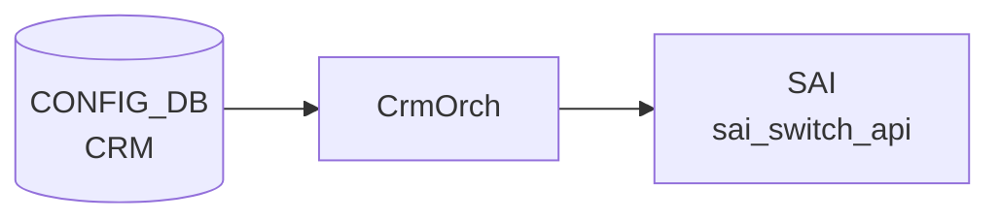

# CRM テーブル

## 概要

Critical Resource Monitoring ([CRM](../../reference/glossary.md#term-crm)) は ASIC の HW リソース使用率 (route / nexthop / [FDB](../../reference/glossary.md#term-fdb) / [ACL](../../reference/glossary.md#term-acl) / [NAT](../../reference/glossary.md#term-nat) / [MPLS](../../reference/glossary.md#term-mpls) / [SRv6](../../reference/glossary.md#term-srv6) / [DASH](../../reference/glossary.md#term-dash)) をポーリング監視し、閾値超過時に `THRESHOLD_EXCEEDED` / `THRESHOLD_CLEAR` アラートを生成する機能。設定は `CRM|Config` の単一エントリに集約される[^1]。`orchagent` の `CrmOrch` が [CONFIG_DB](../../reference/glossary.md#term-config_db) を購読し、`COUNTERS_DB` の [CRM](../../reference/glossary.md#term-crm) 統計を更新する。

<!-- cdb-mermaid -->
### データフロー (自動生成)



!!! note "凡例"
    CONFIG_DB から SAI までの典型経路を `docs/reference/config-db-orch-map.md` から機械生成したミニ図。詳細・例外は本ページ本文と対応表を参照。
<!-- /cdb-mermaid -->

## key 構造

```text
CRM|Config
```

(list ではなく単一 container)

## 主要フィールド

各リソースに対し `<resource>_threshold_type` / `<resource>_high_threshold` / `<resource>_low_threshold` の三つ組が並ぶ。

| 系統 | リソース key prefix |
|------|---------------------|
| [ACL](../../reference/glossary.md#term-acl) | `acl_table`, `acl_group`, `acl_entry`, `acl_counter` |
| FIB | `ipv4_route`, `ipv6_route`, `ipv4_nexthop`, `ipv6_nexthop`, `ipv4_neighbor`, `ipv6_neighbor` |
| [ECMP](../../reference/glossary.md#term-ecmp) | `nexthop_group`, `nexthop_group_member` |
| L2 | `fdb_entry` |
| [NAT](../../reference/glossary.md#term-nat) | `dnat_entry`, `snat_entry` |
| 多目的 | `ipmc_entry`, `mpls_inseg`, `mpls_nexthop` |
| [SRv6](../../reference/glossary.md#term-srv6) | `srv6_my_sid_entry`, `srv6_nexthop` |
| [DASH](../../reference/glossary.md#term-dash) | `dash_vnet`, `dash_eni`, `dash_eni_ether_address_map`, `dash_ipv4_inbound_routing`, `dash_ipv6_inbound_routing`, `dash_ipv4_outbound_routing`, `dash_ipv6_outbound_routing`, `dash_ipv4_pa_validation`, `dash_ipv6_pa_validation`, `dash_ipv4_outbound_ca_to_pa`, `dash_ipv6_outbound_ca_to_pa`, `dash_ipv4_acl_group`, `dash_ipv6_acl_group`, `dash_ipv4_acl_rule`, `dash_ipv6_acl_rule` |

各 `<resource>_threshold_type` は `crm_threshold_type` (`PERCENTAGE` / `USED` / `FREE`) を取る。`PERCENTAGE` のときは high/low ともに 0..100 でなければならない。

加えてグローバル設定:

| フィールド | 型 | 説明 |
|-----------|----|------|
| `polling_interval` | uint16 | リソース使用量ポーリング間隔 [秒] |

## 制約

- すべての three-tuple について `high_threshold > low_threshold` を `must` で強制
- [DASH](../../reference/glossary.md#term-dash) 系列は `DEVICE_METADATA.localhost.switch_type = 'dpu'` のときのみ有効 (`when`)

<!-- cdb-exceptions -->
## 例外条件・特殊挙動

- **percentage 閾値が 100 超 → runtime_error → エラーログ + return**: `threshold_type = percentage` のとき `low_threshold > 100` または `high_threshold > 100` の場合 `runtime_error("CRM percentage threshold value must be <= 100%%")` が発生し、catch → `SWSS_LOG_ERROR` + `return`。残りフィールドも適用されない。<!-- evidence: crmorch.cpp L429-431, L529-531 -->
- **low >= high → runtime_error**: `low_threshold >= high_threshold` の場合も同様に `runtime_error("CRM low threshold must be less then high threshold")` → エラーログ + return。<!-- evidence: crmorch.cpp L433-435 -->
- **DEL コマンド → 非対応エラーログのみ**: `op == DEL_COMMAND` が来ると `SWSS_LOG_ERROR("Unsupported operation type")` を出力するが閾値は変更されない。CRM 設定の削除は未サポート。<!-- evidence: crmorch.cpp L465-466 -->
- **不明属性フィールド → エラーログ + return (残フィールドも適用されない)**: `polling_interval` / 各 threshold_type / threshold_low / threshold_high 以外のフィールドが来ると `SWSS_LOG_ERROR("Failed to parse CRM ... Unknown attribute %s.")` して `return`。<!-- evidence: crmorch.cpp L526 -->
- **未対応 SAI リソース → ignore**: タイマー処理で取得できないリソースは `// ignore unsupported resources` としてスキップ。<!-- evidence: crmorch.cpp L884 -->

<!-- value-behavior -->
## 値依存挙動マトリクス

| フィールド | 値 | 挙動 |
|-----------|-----|------|
| `<resource>_threshold_type` | `percentage`（既定） | 閾値を使用率 % として解釈。`high_threshold > 100` または `low_threshold > 100` の場合 runtime_error を発生させ処理を中断（`crmorch.cpp:428-431`）。アラートは `used/total * 100 >= high_threshold` で発火。 |
| `<resource>_threshold_type` | `used` | 閾値を「使用中エントリ数」の絶対値として解釈。ASIC の total 数に依存せず細かく制御可能。100 超でもエラーにならない。 |
| `<resource>_threshold_type` | `free` | 閾値を「空きエントリ数」として解釈。アラートの超過/クリアの向きが percentage/used と逆（残り少なくなると EXCEEDED）。 |
| `dash_*_threshold_type` | 任意 | `DEVICE_METADATA.switch_type = 'dpu'` のときのみ有効（YANG `when` 制約）。通常スイッチでは YANG validator が拒否。 |
<!-- /value-behavior -->

## 購読者

- `orchagent` の `CrmOrch`: ポーリング、[SAI](../../reference/glossary.md#term-sai) から使用量取得、[COUNTERS_DB](../../reference/glossary.md#term-counters_db) 更新、syslog アラート

## 関連 CONFIG_DB / YANG / CLI

- 関連 [CONFIG_DB](../../reference/glossary.md#term-config_db): `DEVICE_METADATA`
- 関連 CLI: `crm config thresholds ...`、`crm show resources/thresholds`
- 関連 [YANG](../../reference/glossary.md#term-yang): `sonic-crm`

<!-- ref-triangle:start -->

## 関連リファレンス

- [YANG](../../reference/glossary.md#term-yang): [`sonic-crm`](../yang/sonic-crm.md)
- CLI: `crm config`

<!-- ref-triangle:end -->

## 引用元

[^1]: [YANG](../../reference/glossary.md#term-yang) 定義: `sonic-crm.yang`. <https://github.com/sonic-net/sonic-buildimage/blob/9ea932ec2e18f35e58268ec2e4456b1d4afd65cd/src/sonic-yang-models/yang-models/sonic-crm.yang>

<!-- topics-back-ref -->
## 関連 Topics

- [Topics: Telemetry / SNMP / Observability](../../topics/09-telemetry-snmp/index.md)

<!-- /topics-back-ref -->

<!-- ops-hint -->
## 運用ヒント

### 典型値

- key 形式: `CRM|Config`。
- `acl_table_threshold_type`: `percentage` / `used` / `free`。
- `*_high_threshold` / `*_low_threshold`: 70 / 60 など。
- `polling_interval`: 300（秒）。

### よくある誤設定

- 閾値を 100% に近く設定すると alert が遅れ、[ACL](../../reference/glossary.md#term-acl) 追加で [SAI](../../reference/glossary.md#term-sai) エラーが先に起きる。70%/80% 程度で運用するのが定石。

### 確認コマンド

```bash
sonic-db-cli CONFIG_DB hgetall 'CRM|Config'
crm show summary
crm show resources all
```
<!-- /ops-hint -->

<!-- entry-points -->
## 書き込み入り口 (Direction A)

対象テーブル: `CRM`

### CLI
- `config crm thresholds <resource> type/low/high <value>`
  - ソース: `sonic-utilities/config/main.py (crm グループ)`

### minigraph / sonic-cfggen
- なし

### REST / gNMI (sonic-mgmt-common)
- なし (対応 OpenConfig/SONiC YANG transformer なし)

### db_migrator
- なし

### ビルド時デフォルト (init_cfg / j2 テンプレート)
- `init_cfg.json.j2` にデフォルト CRM 閾値が定義されている (`CRM.Config.*`)

### ハードコードデフォルト
- なし

### ランタイム注入 (デーモン自動書き込み)
- なし
<!-- /entry-points -->

<!-- glossary-links-injected: c6e41e02b036 -->
