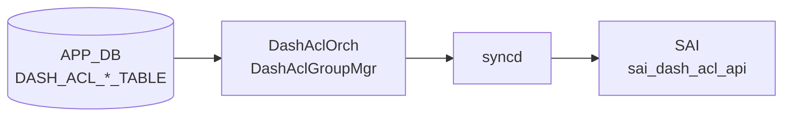

# DASH_ACL_* テーブル

## 概要

DASH (Disaggregated APIs for SONiC Hosts) データプレーンの ACL ポリシーを定義する 4 テーブル群。ENI (仮想 NIC) 単位にインバウンド / アウトバウンド方向・ステージ番号ごとに ACL グループを割り当て、グループ内のルールリストでパケットを ALLOW / DENY する。`DashAclOrch` / `DashAclGroupMgr` が APP_DB エントリを protobuf でデコードし、DASH SAI API 経由で DPU ハードウェアへ書き込む。

!!! warning "YANG 未定義"
    4 テーブルはすべて YANG モジュールで未定義。スキーマの正本は `sonic-swss/orchagent/dash/dashaclorch.{h,cpp}` および `dashaclgroupmgr.{h,cpp}`。

<!-- cdb-mermaid -->
### データフロー (自動生成)



!!! note "凡例"
    APP_DB から SAI までの典型経路。DASH テーブルは CONFIG_DB ではなく APP_DB に書かれる点に注意（SDN コントローラ / gNMI 経由で投入）。
<!-- /cdb-mermaid -->

## テーブル構造

### DASH_ACL_IN_TABLE

ENI のインバウンド方向に ACL グループをバインドする。

```text
DASH_ACL_IN_TABLE:<eni>:<stage>
```

| フィールド | 型 | 必須 | 説明 |
|----------|----|------|------|
| `v4_acl_group_id` | string | 省略可 | IPv4 ACL グループ名。`DASH_ACL_GROUP_TABLE` のキーを参照 |
| `v6_acl_group_id` | string | 省略可 | IPv6 ACL グループ名。`DASH_ACL_GROUP_TABLE` のキーを参照 |

`<stage>` は `1`〜`5` の整数。両フィールドとも省略可能で、空文字の場合はバインド処理をスキップする。

### DASH_ACL_OUT_TABLE

ENI のアウトバウンド方向に ACL グループをバインドする。フィールド構造は `DASH_ACL_IN_TABLE` と同一。

```text
DASH_ACL_OUT_TABLE:<eni>:<stage>
```

| フィールド | 型 | 必須 | 説明 |
|----------|----|------|------|
| `v4_acl_group_id` | string | 省略可 | IPv4 ACL グループ名 |
| `v6_acl_group_id` | string | 省略可 | IPv6 ACL グループ名 |

### DASH_ACL_GROUP_TABLE

ACL ルールを束ねるグループを定義する。

```text
DASH_ACL_GROUP_TABLE:<group_id>
```

| フィールド | 型 | 必須 | 説明 |
|----------|----|------|------|
| `ip_version` | enum `ipv4`/`ipv6` | **必須** | グループが扱う IP アドレスファミリ。省略・不正値は作成失敗 |
| `guid` | string | 省略可 | 管理用 GUID。orchagent は参照しない |
| `version` | string | 省略可 | 管理用バージョン文字列。orchagent は参照しない |

!!! warning "更新不可"
    一度作成した `DASH_ACL_GROUP_TABLE` エントリの属性は更新できない（`taskUpdateDashAclGroup` が `task_failed` を返す）。変更が必要な場合は削除して再作成する。

### DASH_ACL_RULE_TABLE

グループ内の個別 ACL ルールを定義する。

```text
DASH_ACL_RULE_TABLE:<group_id>:<rule_num>
```

| フィールド | 型 | 必須 | 説明 |
|----------|----|------|------|
| `priority` | uint32 | **必須** | ルール評価優先度。**値が小さいほど優先度が高い** |
| `action` | enum `allow`/`deny` | **必須** | パケットに対する基本アクション |
| `terminating` | bool | **必須** | `true` = このルールでパイプライン終了。`false` = `*_AND_CONTINUE` |
| `protocol` | uint8 リスト | 省略可 | 対象プロトコル番号。省略時は全プロトコル (0〜255) に一致 |
| `src_addr` | IP prefix リスト | 省略可 | 送信元 IP プレフィックス。省略時は全 IP (`0.0.0.0/0` or `::/0`) |
| `dst_addr` | IP prefix リスト | 省略可 | 宛先 IP プレフィックス。省略時は全 IP |
| `src_port` | ポート範囲リスト | 省略可 | 送信元ポート範囲。省略時は全ポート (0〜65535) |
| `dst_port` | ポート範囲リスト | 省略可 | 宛先ポート範囲。省略時は全ポート |
| `src_tag` | 文字列リスト | 省略可 | 送信元タグ名。`DASH_PREFIX_TAG_TABLE` のプレフィックスに展開 |
| `dst_tag` | 文字列リスト | 省略可 | 宛先タグ名 |

## 購読者

- `orchagent` `DashAclOrch`: DASH_ACL_*_TABLE を subscribe し `DashAclGroupMgr` 経由で SAI へ反映
- `DashAclGroupMgr`: グループ・ルールの CRUD、ENI へのバインド/アンバインドを管理
- `DashTagMgr`: `src_tag` / `dst_tag` の展開とタグ更新時のグループ再構築を担当

## 関連 CONFIG_DB / YANG / CLI

- 関連 APP_DB: `DASH_PREFIX_TAG_TABLE`、`DASH_ENI_TABLE`
- 関連 CLI: なし（SDN コントローラ / gNMI 経由投入が主体）
- 関連 YANG: なし

<!-- cdb-exceptions -->
## 例外条件・特殊挙動

| 条件 | 挙動 |
|------|------|
| `v4_acl_group_id` / `v6_acl_group_id` が空文字 | バインドをスキップ (`continue`)。エラーなし |
| バインド先グループが存在しない | `task_failed` |
| グループにルールが 0 件の状態でバインド | `task_failed`（ルール追加後に再バインドが必要） |
| ENI が未作成の状態でバインド | `task_need_retry`（ENI 作成後に自動再試行） |
| バインド済みグループへのルール追加 | `task_failed`（グループ解除 → ルール追加 → 再バインドが必要） |
| `ip_version` 省略または UNSPECIFIED | `from_pb()` が `false` → `task_failed`（作成失敗） |
| グループ属性の更新（再 SET） | `task_failed`（更新不可） |
| バインド中グループの削除 | `task_need_retry`（全バインド解除後に自動再試行） |
| 参照タグが未作成の状態でルール作成 | `task_need_retry`（タグ作成後に自動再試行） |
| `rule_num` にグループ ID が存在しない場合のルール作成 | `task_need_retry`（グループ作成後に自動再試行） |

<!-- /cdb-exceptions -->

<!-- defaults -->
## コード由来の暗黙デフォルト (Phase A)

YANG 未定義テーブルのため、全デフォルトはコード実装が正本。

### field × 種別 一覧

| フィールド / 属性 | テーブル | 種別 | 暗黙デフォルト値 | ソース |
|---|---|---|---|---|
| `protocol` | `DASH_ACL_RULE_TABLE` | C++ 固定定数 | 省略時 = 全プロトコル `[0, 1, ..., 255]` | `dashaclgroupmgr.cpp:28,293-299` |
| `src_port` / `dst_port` | `DASH_ACL_RULE_TABLE` | C++ 固定定数 | 省略時 = 全ポート `{{0, 65535}}` | `dashaclgroupmgr.cpp:29,63-79` |
| `src_addr` / `dst_addr` | `DASH_ACL_RULE_TABLE` | C++ fallback (`if empty`) | 省略時 + タグなし = ゼロ初期化プレフィックス (0.0.0.0/0 or ::/0) | `dashaclgroupmgr.cpp:266-270,332-341` |
| `action` | `DASH_ACL_RULE_TABLE` | protobuf ゼロ値 | 省略時 = `ACTION_PERMIT` (proto3 enum=0) → ALLOW | `dashaclgroupmgr.cpp:34` |
| `terminating` | `DASH_ACL_RULE_TABLE` | protobuf ゼロ値 | 省略時 = `false` → `*_AND_CONTINUE` | `dashaclgroupmgr.cpp:35,280-289` |
| `priority` | `DASH_ACL_RULE_TABLE` | protobuf ゼロ値 | 省略時 = `0` (最高優先度扱い) | `dashaclgroupmgr.cpp:33` |
| `ip_version` | `DASH_ACL_GROUP_TABLE` | なし（必須） | 省略時は `task_failed`（デフォルトなし） | `dashaclgroupmgr.cpp:84-92` |
| `v4_acl_group_id` / `v6_acl_group_id` | `DASH_ACL_IN/OUT_TABLE` | C++ 空文字スキップ | 省略時 = バインド処理をスキップ | `dashaclorch.cpp:171-181,201-211` |

### `action` × `terminating` SAI マッピング

| `action` | `terminating` | SAI 値 | 動作 |
|----------|--------------|--------|------|
| `allow` | `true` | `SAI_DASH_ACL_RULE_ACTION_PERMIT` | 許可して終了 |
| `allow` | `false` (省略デフォルト) | `SAI_DASH_ACL_RULE_ACTION_PERMIT_AND_CONTINUE` | 許可して次ステージへ |
| `deny` | `true` | `SAI_DASH_ACL_RULE_ACTION_DENY` | 拒否して終了 |
| `deny` | `false` | `SAI_DASH_ACL_RULE_ACTION_DENY_AND_CONTINUE` | 拒否して次ステージへ |

省略時の `action=allow, terminating=false` の組み合わせでは `SAI_DASH_ACL_RULE_ACTION_PERMIT_AND_CONTINUE` が SAI に書き込まれる。

### `protocol` 省略時の全プロトコル展開

`dashaclgroupmgr.cpp:28` の静的定数:

```cpp
const static vector<uint8_t> all_protocols(
    boost::counting_iterator<int>(0),
    boost::counting_iterator<int>(UINT8_MAX + 1));  // 0〜255 の 256 要素
```

SAI 属性 `SAI_DASH_ACL_RULE_ATTR_PROTOCOL` には必ず値を渡す（省略は不可）。

### `src_port` / `dst_port` 省略時の全ポート展開

`dashaclgroupmgr.cpp:29` の静的定数:

```cpp
const static vector<sai_u16_range_t> all_ports = {
    {numeric_limits<uint16_t>::min(), numeric_limits<uint16_t>::max()}};  // {0, 65535}
```

### `src_addr` / `dst_addr` 省略時の any IP 生成

`src_tag` / `dst_tag` も未指定の場合、orchagent がグループの `ip_version` を参照してゼロ初期化プレフィックスを 1 件生成する:

```cpp
auto any_ip = [](const auto& g) {
    sai_ip_prefix_t ip_prefix = {};
    ip_prefix.addr_family = g.isIpV4() ? SAI_IP_ADDR_FAMILY_IPV4 : SAI_IP_ADDR_FAMILY_IPV6;
    return ip_prefix;  // addr/mask はゼロ = 0.0.0.0/0 or ::/0
};
```

- 中間トレース: `meta/_intermediate/cdb-flow/dash-acl-defaults.md`
<!-- /defaults -->
