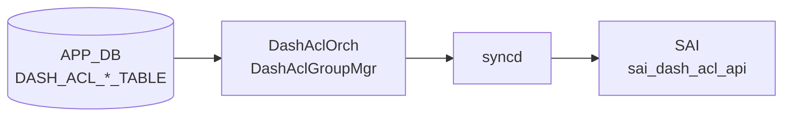

# DASH_ACL_* テーブル

## 概要

[DASH](../../reference/glossary.md#term-dash) (Disaggregated APIs for [SONiC](../../reference/glossary.md#term-sonic) Hosts) データプレーンの [ACL](../../reference/glossary.md#term-acl) ポリシーを定義する 4 テーブル群。[ENI](../../reference/glossary.md#term-eni) (仮想 NIC) 単位にインバウンド / アウトバウンド方向・ステージ番号ごとに [ACL](../../reference/glossary.md#term-acl) グループを割り当て、グループ内のルールリストでパケットを ALLOW / DENY する。`DashAclOrch` / `DashAclGroupMgr` が APP_DB エントリを protobuf でデコードし、[DASH](../../reference/glossary.md#term-dash) [SAI](../../reference/glossary.md#term-sai) API 経由で [DPU](../../reference/glossary.md#term-dpu) ハードウェアへ書き込む。

!!! warning "YANG 未定義"
    4 テーブルはすべて YANG モジュールで未定義。スキーマの正本は `sonic-swss/orchagent/dash/dashaclorch.{h,cpp}` および `dashaclgroupmgr.{h,cpp}`。

<!-- cdb-mermaid -->
### データフロー (自動生成)



!!! note "凡例"
    APP_DB から SAI までの典型経路。DASH テーブルは CONFIG_DB ではなく APP_DB に書かれる点に注意（SDN コントローラ / gNMI 経由で投入）。
<!-- /cdb-mermaid -->

## テーブル構造

### DASH_ACL_IN_TABLE

[ENI](../../reference/glossary.md#term-eni) のインバウンド方向に [ACL](../../reference/glossary.md#term-acl) グループをバインドする。

```text
DASH_ACL_IN_TABLE:<eni>:<stage>
```

| フィールド | 型 | 必須 | 説明 |
|----------|----|------|------|
| `v4_acl_group_id` | string | 省略可 | IPv4 ACL グループ名。`DASH_ACL_GROUP_TABLE` のキーを参照 |
| `v6_acl_group_id` | string | 省略可 | IPv6 ACL グループ名。`DASH_ACL_GROUP_TABLE` のキーを参照 |

`<stage>` は `1`〜`5` の整数。両フィールドとも省略可能で、空文字の場合はバインド処理をスキップする。

### DASH_ACL_OUT_TABLE

[ENI](../../reference/glossary.md#term-eni) のアウトバウンド方向に ACL グループをバインドする。フィールド構造は `DASH_ACL_IN_TABLE` と同一。

```text
DASH_ACL_OUT_TABLE:<eni>:<stage>
```

| フィールド | 型 | 必須 | 説明 |
|----------|----|------|------|
| `v4_acl_group_id` | string | 省略可 | IPv4 ACL グループ名 |
| `v6_acl_group_id` | string | 省略可 | IPv6 ACL グループ名 |

### DASH_ACL_GROUP_TABLE

ACL ルールを束ねるグループを定義する。

```text
DASH_ACL_GROUP_TABLE:<group_id>
```

| フィールド | 型 | 必須 | 説明 |
|----------|----|------|------|
| `ip_version` | enum `ipv4`/`ipv6` | **必須** | グループが扱う IP アドレスファミリ。省略・不正値は作成失敗 |
| `guid` | string | 省略可 | 管理用 GUID。[orchagent](../../reference/glossary.md#term-orchagent) は参照しない |
| `version` | string | 省略可 | 管理用バージョン文字列。[orchagent](../../reference/glossary.md#term-orchagent) は参照しない |

!!! warning "更新不可"
    一度作成した `DASH_ACL_GROUP_TABLE` エントリの属性は更新できない（`taskUpdateDashAclGroup` が `task_failed` を返す）。変更が必要な場合は削除して再作成する。

### DASH_ACL_RULE_TABLE

グループ内の個別 ACL ルールを定義する。

```text
DASH_ACL_RULE_TABLE:<group_id>:<rule_num>
```

| フィールド | 型 | 必須 | 説明 |
|----------|----|------|------|
| `priority` | uint32 | **必須** | ルール評価優先度。**値が小さいほど優先度が高い** |
| `action` | enum `allow`/`deny` | **必須** | パケットに対する基本アクション |
| `terminating` | bool | **必須** | `true` = このルールでパイプライン終了。`false` = `*_AND_CONTINUE` |
| `protocol` | uint8 リスト | 省略可 | 対象プロトコル番号。省略時は全プロトコル (0〜255) に一致 |
| `src_addr` | IP prefix リスト | 省略可 | 送信元 IP プレフィックス。省略時は全 IP (`0.0.0.0/0` or `::/0`) |
| `dst_addr` | IP prefix リスト | 省略可 | 宛先 IP プレフィックス。省略時は全 IP |
| `src_port` | ポート範囲リスト | 省略可 | 送信元ポート範囲。省略時は全ポート (0〜65535) |
| `dst_port` | ポート範囲リスト | 省略可 | 宛先ポート範囲。省略時は全ポート |
| `src_tag` | 文字列リスト | 省略可 | 送信元タグ名。`DASH_PREFIX_TAG_TABLE` のプレフィックスに展開 |
| `dst_tag` | 文字列リスト | 省略可 | 宛先タグ名 |

## 購読者

- `orchagent` `DashAclOrch`: DASH_ACL_*_TABLE を subscribe し `DashAclGroupMgr` 経由で [SAI](../../reference/glossary.md#term-sai) へ反映
- `DashAclGroupMgr`: グループ・ルールの CRUD、ENI へのバインド/アンバインドを管理
- `DashTagMgr`: `src_tag` / `dst_tag` の展開とタグ更新時のグループ再構築を担当

## 関連 APP_DB / YANG / CLI

- 関連 APP_DB: `DASH_PREFIX_TAG_TABLE`、`DASH_ENI_TABLE`
- 関連 CLI: なし（SDN コントローラ / [gNMI](../../reference/glossary.md#term-gnmi) 経由投入が主体）
- 関連 [YANG](../../reference/glossary.md#term-yang): なし

<!-- cdb-exceptions -->
## 例外条件・特殊挙動

| 条件 | 挙動 |
|------|------|
| `v4_acl_group_id` / `v6_acl_group_id` が空文字 | バインドをスキップ (`continue`)。エラーなし |
| バインド先グループが存在しない | `task_failed` |
| グループにルールが 0 件の状態でバインド | `task_failed`（ルール追加後に再バインドが必要） |
| ENI が未作成の状態でバインド | `task_need_retry`（ENI 作成後に自動再試行） |
| バインド済みグループへのルール追加 | `task_failed`（グループ解除 → ルール追加 → 再バインドが必要） |
| `ip_version` 省略または UNSPECIFIED | `from_pb()` が `false` → `task_failed`（作成失敗） |
| グループ属性の更新（再 SET） | `task_failed`（更新不可） |
| バインド中グループの削除 | `task_need_retry`（全バインド解除後に自動再試行） |
| 参照タグが未作成の状態でルール作成 | `task_need_retry`（タグ作成後に自動再試行） |
| `rule_num` にグループ ID が存在しない場合のルール作成 | `task_need_retry`（グループ作成後に自動再試行） |

<!-- /cdb-exceptions -->

<!-- defaults -->
## コード由来の暗黙デフォルト

[YANG](../../reference/glossary.md#term-yang) 未定義テーブルのため、全デフォルトはコード実装が正本。

### field × 種別 一覧

| フィールド / 属性 | テーブル | 種別 | 暗黙デフォルト値 | ソース |
|---|---|---|---|---|
| `protocol` | `DASH_ACL_RULE_TABLE` | C++ 固定定数 | 省略時 = 全プロトコル `[0, 1, ..., 255]` | `dashaclgroupmgr.cpp:28,293-299` |
| `src_port` / `dst_port` | `DASH_ACL_RULE_TABLE` | C++ 固定定数 | 省略時 = 全ポート `{{0, 65535}}` | `dashaclgroupmgr.cpp:29,63-79` |
| `src_addr` / `dst_addr` | `DASH_ACL_RULE_TABLE` | C++ fallback (`if empty`) | 省略時 + タグなし = ゼロ初期化プレフィックス (0.0.0.0/0 or ::/0) | `dashaclgroupmgr.cpp:266-270,332-341` |
| `action` | `DASH_ACL_RULE_TABLE` | protobuf ゼロ値 | 省略時 = `ACTION_PERMIT` (proto3 enum=0) → ALLOW | `dashaclgroupmgr.cpp:34` |
| `terminating` | `DASH_ACL_RULE_TABLE` | protobuf ゼロ値 | 省略時 = `false` → `*_AND_CONTINUE` | `dashaclgroupmgr.cpp:35,280-289` |
| `priority` | `DASH_ACL_RULE_TABLE` | protobuf ゼロ値 | 省略時 = `0` (最高優先度扱い) | `dashaclgroupmgr.cpp:33` |
| `ip_version` | `DASH_ACL_GROUP_TABLE` | なし（必須） | 省略時は `task_failed`（デフォルトなし） | `dashaclgroupmgr.cpp:84-92` |
| `v4_acl_group_id` / `v6_acl_group_id` | `DASH_ACL_IN/OUT_TABLE` | C++ 空文字スキップ | 省略時 = バインド処理をスキップ | `dashaclorch.cpp:171-181,201-211` |

### `action` × `terminating` SAI マッピング

| `action` | `terminating` | [SAI](../../reference/glossary.md#term-sai) 値 | 動作 |
|----------|--------------|--------|------|
| `allow` | `true` | `SAI_DASH_ACL_RULE_ACTION_PERMIT` | 許可して終了 |
| `allow` | `false` (省略デフォルト) | `SAI_DASH_ACL_RULE_ACTION_PERMIT_AND_CONTINUE` | 許可して次ステージへ |
| `deny` | `true` | `SAI_DASH_ACL_RULE_ACTION_DENY` | 拒否して終了 |
| `deny` | `false` | `SAI_DASH_ACL_RULE_ACTION_DENY_AND_CONTINUE` | 拒否して次ステージへ |

省略時の `action=allow, terminating=false` の組み合わせでは `SAI_DASH_ACL_RULE_ACTION_PERMIT_AND_CONTINUE` が SAI に書き込まれる。

### `protocol` 省略時の全プロトコル展開

`dashaclgroupmgr.cpp:28` の静的定数:

```cpp
const static vector<uint8_t> all_protocols(
    boost::counting_iterator<int>(0),
    boost::counting_iterator<int>(UINT8_MAX + 1));  // 0〜255 の 256 要素
```

SAI 属性 `SAI_DASH_ACL_RULE_ATTR_PROTOCOL` には必ず値を渡す（省略は不可）。

### `src_port` / `dst_port` 省略時の全ポート展開

`dashaclgroupmgr.cpp:29` の静的定数:

```cpp
const static vector<sai_u16_range_t> all_ports = {
    {numeric_limits<uint16_t>::min(), numeric_limits<uint16_t>::max()}};  // {0, 65535}
```

### `src_addr` / `dst_addr` 省略時の any IP 生成

`src_tag` / `dst_tag` も未指定の場合、[orchagent](../../reference/glossary.md#term-orchagent) がグループの `ip_version` を参照してゼロ初期化プレフィックスを 1 件生成する:

```cpp
auto any_ip = [](const auto& g) {
    sai_ip_prefix_t ip_prefix = {};
    ip_prefix.addr_family = g.isIpV4() ? SAI_IP_ADDR_FAMILY_IPV4 : SAI_IP_ADDR_FAMILY_IPV6;
    return ip_prefix;  // addr/mask はゼロ = 0.0.0.0/0 or ::/0
};
```

<!-- /defaults -->

<!-- ordering -->
## エントリ投入順序・依存関係

### 投入の必須順序

[DASH](../../reference/glossary.md#term-dash) ACL オブジェクトには厳密なコード由来の依存関係があり、SDN コントローラは以下の順序でエントリを投入しなければならない。

```
[前提] DASH_ENI_TABLE が DashOrch で先に作成済み
    ↓
[1] DASH_PREFIX_TAG_TABLE
    ↓  (src_tag / dst_tag で参照するルールより先に必要)
[2] DASH_ACL_GROUP_TABLE
    ↓  (グループ未作成状態ではルール作成が task_need_retry)
[3] DASH_ACL_RULE_TABLE
    ↓  (ルール 0 件のグループへのバインドは task_failed)
[4] DASH_ACL_IN_TABLE / DASH_ACL_OUT_TABLE  ← ENI へのバインド
```

`task_need_retry` が返ったエントリはキューに残り次のループで自動再試行されるが、`task_failed` は破棄されるため SDN コントローラ側での正しい投入順序が必要。

| 違反パターン | 戻り値 | 自動回復 |
|---|---|---|
| グループ未作成でルール投入 | `task_need_retry` | グループ作成後に自動解消 |
| 参照タグ未作成でルール投入 | `task_need_retry` | タグ作成後に自動解消 |
| ENI 未作成でバインド | `task_need_retry` | ENI 作成後に自動解消 |
| ルール 0 件グループのバインド | `task_failed` | 自動回復なし（ルール追加後に再投入必要） |
| バインド中グループの削除 | `task_need_retry` | 全バインド解除後に自動解消 |

### ステージ番号と SAI 属性マッピング

`DashAclGroupMgr::getSaiStage()` (`dashaclgroupmgr.cpp:94`) が `{方向, IPファミリ, ステージ番号}` の 3 次元タプルを SAI 属性 ID に 1:1 マッピングする。20 組の SAI 属性が存在する。

| 方向 | IP ファミリ | ステージ | SAI 属性 |
|---|---|---|---|
| IN | IPv4 | 1 | `SAI_ENI_ATTR_INBOUND_V4_STAGE1_DASH_ACL_GROUP_ID` |
| IN | IPv4 | 2〜5 | `SAI_ENI_ATTR_INBOUND_V4_STAGE{2-5}_DASH_ACL_GROUP_ID` |
| IN | IPv6 | 1〜5 | `SAI_ENI_ATTR_INBOUND_V6_STAGE{1-5}_DASH_ACL_GROUP_ID` |
| OUT | IPv4 | 1〜5 | `SAI_ENI_ATTR_OUTBOUND_V4_STAGE{1-5}_DASH_ACL_GROUP_ID` |
| OUT | IPv6 | 1〜5 | `SAI_ENI_ATTR_OUTBOUND_V6_STAGE{1-5}_DASH_ACL_GROUP_ID` |

ステージは `1`〜`5` のみ有効。範囲外の値は `lexical_convert` が `invalid_argument` をスローして `task_failed` となる。

### ルール内の評価優先度

- `priority` 値を SAI 属性 `SAI_DASH_ACL_RULE_ATTR_PRIORITY` としてそのまま渡す。
- **値が小さいほど優先度が高い**（`0` = 最高優先度）。
- orchagent はルールのソートを行わない。優先度評価は [DPU](../../reference/glossary.md#term-dpu) ハードウェア側で処理される。

### タグ更新時の非リフレッシュ動作

`DashTagMgr::update()` はメモリ上のプレフィックスリストを更新するだけで、既にバインド済みのグループ・ルールに SAI 再 SET を行わない。タグ更新後も実行中 ACL ルールは旧プレフィックスで評価される。新プレフィックスを反映するにはグループを解除 → ルール削除 → ルール再作成 → 再バインドの手順が必要。

### 削除の逆順制約

削除は投入の逆順で行う必要がある。

```
[1] DASH_ACL_IN/OUT_TABLE — DEL（バインド解除）
    ↓
[2] DASH_ACL_RULE_TABLE — DEL
    ↓
[3] DASH_ACL_GROUP_TABLE — DEL（バインド中は task_need_retry）
    ↓
[4] DASH_PREFIX_TAG_TABLE — DEL（グループ参照中は task_need_retry）
```

### warm-reboot 挙動

`DashAclOrch` は `ZmqOrch` を継承し `gDirectory.set()` のみで登録される（`m_orchList` には非登録）。

`warmRestoreAndSyncUp()` の 3 イテレーションループは `m_orchList` に対して実行されるため、**DASH ACL orch は warm-reboot の自動リプレイ対象外**となる。DASH ACL エントリのリストアは SDN コントローラ（[gNMI](../../reference/glossary.md#term-gnmi) 側）がエントリを再投入することで実現する設計であり、orchagent 自体による状態保存・リプレイ機構は実装されていない（ステートレス warm-reboot）。

<!-- /ordering -->

<!-- cross-refs -->
## 暗黙参照テーブル


各テーブルが SAI 書き込み時に参照する外部テーブル・リソース。[YANG](../../reference/glossary.md#term-yang) leafref は存在しないため、すべて実装レベルの暗黙参照。

| 参照先テーブル / リソース | 参照方向 | 条件 | 参照元 evidence |
|--------------------------|---------|------|----------------|
| `DASH_ENI_TABLE` | OID 解決（必須） | `DASH_ACL_IN/OUT_TABLE` SET 時常時。ENI 未登録 → `task_need_retry`（自動リトライ） | `dashaclgroupmgr.cpp:457,461` (`m_dash_orch->getEni()`) |
| `DASH_ACL_GROUP_TABLE` | OID 解決（必須） | `DASH_ACL_RULE_TABLE` ルール作成時。グループ未作成 → `task_need_retry`（自動リトライ） | `dashaclgroupmgr.cpp:385-390` |
| `DASH_ACL_GROUP_TABLE` | OID 解決（必須） | `DASH_ACL_IN/OUT_TABLE` バインド時。グループ未作成 → `task_failed`（自動回復なし） | `dashaclgroupmgr.cpp:442-446` |
| `DASH_PREFIX_TAG_TABLE` | タグ存在確認（条件付き） | `DASH_ACL_RULE_TABLE` で `src_tag` / `dst_tag` 指定時のみ。タグ未登録 → `task_need_retry` | `dashaclgroupmgr.cpp:393-408` (`getDashAclTagMgr().exists()`) |
| CrmOrch (`gCrmOrch`) | リソースカウンタ | ACL ルール SAI 作成成功時に `incCrmDashAclUsedCounter` を呼び出し | `dashaclgroupmgr.cpp:372-376` |

!!! note "バインド時の参照失敗の非対称性"
    `DASH_ACL_IN/OUT_TABLE` バインド時のグループ参照失敗は `task_failed`（破棄）だが、ENI 参照失敗は `task_need_retry`（リトライ）と非対称。グループは事前作成必須だが ENI は後から来ても自動解消できる設計による。

!!! note "YANG leafref なし"
    4 テーブルはすべて YANG 未定義のため leafref による静的な参照整合性チェックは行われない。参照整合性はすべて `DashAclOrch` / `DashAclGroupMgr` のランタイムチェックのみで保証される。

<!-- /cross-refs -->

<!-- failure -->
## 失敗挙動・retry / recovery


### retry パターン概要

DASH ACL タスクは `DashAclOrch::doTask()` が `task_process_status` を返し、`Consumer` ベースのタスクキュー (`m_toSync`) で管理される。

| パターン | 代表的なトリガー | 挙動 |
|---|---|---|
| **`task_need_retry`** | 参照先（グループ / ENI / タグ）未作成・グループ削除時のバインド残存 | `m_toSync` に残し次 `doTask()` で自動再試行。上限なし |
| **`task_failed`** | キーパースエラー・重複作成・グループ更新（不可）・バインド時グループ未作成・ルール 0 件バインド | エントリ破棄。自動回復なし |
| **`task_success`** | 正常完了・存在しないエントリへの DEL（冪等） | エントリ削除 |

### DASH_ACL_GROUP_TABLE SET の失敗詳細

#### 重複 SET（更新不可）

既に `m_groups_table` に存在するグループ ID への SET: `SWSS_LOG_WARN "Cannot update attributes of ACL group %s"` → `task_failed`。グループ属性の変更は一切できない。変更が必要な場合は DEL → SET 再作成が必要。(`dashaclorch.cpp:231-235`)

#### `ip_version` 不正値

`ip_version` フィールドが UNSPECIFIED または不正値の場合、`from_pb()` が `false` を返し → `task_failed`。SAI 呼び出し前に失敗する。(`dashaclgroupmgr.cpp:84-92`)

#### SAI 作成失敗

SAI `create_dash_acl_group` 失敗時: `SWSS_LOG_ERROR "Failed to create ACL group: %d, %s"` → `handleSaiCreateStatus(SAI_API_DASH_ACL, status)` 経由。(`dashaclgroupmgr.cpp:168-172`)

### DASH_ACL_GROUP_TABLE DEL の失敗詳細

#### バインド中グループの削除

グループが ENI にバインド中（`m_in_tables` または `m_out_tables` が非空）の場合: `SWSS_LOG_ERROR "ACL group %s still has %zu references"` → `task_need_retry`。バインド解除後に自動再試行される。(`dashaclgroupmgr.cpp:234-238`)

存在しないグループ ID への DEL は `task_success`（冪等動作）。(`dashaclgroupmgr.cpp:225-229`)

### DASH_ACL_RULE_TABLE SET の失敗詳細

#### キーパース失敗

キーが `group_id:rule_num` 形式でない場合: `SWSS_LOG_ERROR "Failed to parse key %s"` → `task_failed`。(`dashaclorch.cpp:261-265`)

#### バインド中グループへのルール追加

グループが ENI にバインド中の状態でのルール追加: `SWSS_LOG_INFO "Failed to set dash ACL rule %s:%s, ACL group is bound to the ENI"` → `task_failed`。グループを先にアンバインドしてからルール操作が必要。(`dashaclorch.cpp:274-278`)

#### 参照先未作成による自動リトライ

- グループ未作成: `SWSS_LOG_INFO "ACL group %s doesn't exist, waiting for group creating before creating rule %s"` → `task_need_retry`
- `src_tag` / `dst_tag` に指定されたタグ未作成: `SWSS_LOG_INFO "ACL tag %s doesn't exist, waiting for tag creating before creating rule %s"` → `task_need_retry`

いずれもキューに残り、依存エントリ作成後に自動再試行される。(`dashaclgroupmgr.cpp:385-408`)

### DASH_ACL_IN/OUT_TABLE SET の失敗詳細

#### キーパースおよびステージ範囲外

キーが `eni:stage` 形式でない、またはステージ番号が `1`〜`5` 範囲外: `SWSS_LOG_ERROR "Invalid key"` / `"Invalid stage"` → `task_failed`。(`dashaclorch.cpp:322-325`, `dashaclorch.cpp:69-72`)

#### バインド時の非対称リトライ特性

| 失敗条件 | 結果 | ソース |
|---|---|---|
| 参照グループが `m_groups_table` に未存在 | **`task_failed`**（自動回復なし） | `dashaclgroupmgr.cpp:442-447` |
| グループのルール件数が 0 件 | **`task_failed`**（自動回復なし） | `dashaclgroupmgr.cpp:451-454` |
| ENI が `DashOrch` に未登録 | **`task_need_retry`**（ENI 作成後に自動解消） | `dashaclgroupmgr.cpp:457-461` |

!!! warning "グループ未作成バインドは task_failed"
    ENI 未登録は `task_need_retry` で自動回復するが、グループ未作成・ルール 0 件は `task_failed`（エントリ破棄）。SDN コントローラは必ず「グループ作成 → ルール追加 → バインド」の順を守る必要がある。順序違反時はコントローラ側で再投入が必要。

#### SAI バインド失敗

SAI `set_eni_attribute` 失敗: `SWSS_LOG_ERROR "Failed to bind ACL group to ENI: %d"` → `handleSaiSetStatus(SAI_API_DASH_ENI, …)` 経由。(`dashaclgroupmgr.cpp:431-434`)

### DASH_ACL_IN/OUT_TABLE DEL の失敗詳細

DEL 操作で ACL エントリが `m_dash_acl_in/out_table` に存在しない場合は `task_success`（冪等）: `SWSS_LOG_WARN "ACL %s doesn't exist"`。アンバインド SAI 失敗は `handleSaiSetStatus(SAI_API_DASH_ENI, …)` 経由。(`dashaclorch.cpp:356-359`, `dashaclgroupmgr.cpp:487-490`)

<!-- /failure -->

<!-- constants -->
## コード由来の固定定数


### ファイルスコープ静的定数

`dashaclgroupmgr.cpp:28-29` に定義されたプロセス起動時に一度だけ初期化される静的定数。

| 定数名 | 型 | 値 | 用途 |
|--------|----|----|------|
| `all_protocols` | `vector<uint8_t>` (256 要素) | `[0, 1, ..., 255]` | `protocol` 省略時の全プロトコル展開 |
| `all_ports` | `vector<sai_u16_range_t>` (1 要素) | `{{0, 65535}}` | `src_port` / `dst_port` 省略時の全ポート展開 |

`boost::counting_iterator` による連続整数生成でコンパイル時ではなく起動時に初期化される。

### ステージ番号・方向 enum

| enum | 定義場所 | 有効値 |
|------|---------|--------|
| `DashAclStage` | `dashaclgroupmgr.h:19` | `STAGE1`〜`STAGE5`（文字列 `"1"`〜`"5"` からのみ変換可） |
| `DashAclDirection` | `dashaclgroupmgr.h:28` | `IN` / `OUT` |
| `DashAclRule::Action` | `dashaclgroupmgr.h:37` | `ALLOW` / `DENY` |

`lexical_convert` (`dashaclorch.cpp:43-73`) が `"1"`〜`"5"` を `DashAclStage` に変換。範囲外の文字列は `invalid_argument` をスロー → `task_failed`。

### SAI ステージマップ

`getSaiStage()` (`dashaclgroupmgr.cpp:96-118`) 内の静的 `map<tuple<DashAclDirection, sai_ip_addr_family_t, DashAclStage>, sai_attr_id_t>` が 20 エントリ。`{方向, IP ファミリ, ステージ番号}` の 3 次元キーを SAI ENI 属性 ID に 1:1 マッピングする。

### DashAclGroup 初期値

| フィールド | 型 | 初期値 | 意味 |
|-----------|-----|--------|------|
| `m_dash_acl_group_id` | `sai_object_id_t` | `SAI_NULL_OBJECT_ID` | SAI 作成前の未割り当て状態 |
| `m_rule_count` | `int` | `0` | ルール追加で increment。`== 0` でのバインドは `task_failed` |

### CRM リソースタイプの対応

| `ip_version` | グループ [CRM](../../reference/glossary.md#term-crm) タイプ | ルール [CRM](../../reference/glossary.md#term-crm) タイプ |
|---|---|---|
| `SAI_IP_ADDR_FAMILY_IPV4` | `CRM_DASH_IPV4_ACL_GROUP` | `CRM_DASH_IPV4_ACL_RULE` |
| `SAI_IP_ADDR_FAMILY_IPV6` | `CRM_DASH_IPV6_ACL_GROUP` | `CRM_DASH_IPV6_ACL_RULE` |

グループ削除時の `decCrmDashAclUsedCounter` はグループ配下のルールカウンタも一括リセットするため、ルール個別の decrement は呼ばれない（`dashaclgroupmgr.cpp:215`）。

### APP_DB テーブル名定数

`doTask()` の TaskMap が参照するテーブル名マクロ（swss-common `schema.h` 由来）:

| マクロ定数 | テーブル名 |
|-----------|-----------|
| `APP_DASH_ACL_IN_TABLE_NAME` | `DASH_ACL_IN_TABLE` |
| `APP_DASH_ACL_OUT_TABLE_NAME` | `DASH_ACL_OUT_TABLE` |
| `APP_DASH_ACL_GROUP_TABLE_NAME` | `DASH_ACL_GROUP_TABLE` |
| `APP_DASH_ACL_RULE_TABLE_NAME` | `DASH_ACL_RULE_TABLE` |
| `APP_DASH_PREFIX_TAG_TABLE_NAME` | `DASH_PREFIX_TAG_TABLE` |

<!-- /constants -->

<!-- side-effects -->
## 副次 DB 書込み


### ASIC_DB 書込み（SAI 経由）

DASH ACL 系の SAI 呼び出しは `sai_dash_acl_api` と `sai_dash_eni_api` を通じて [syncd](../../reference/glossary.md#term-syncd) → [ASIC_DB](../../reference/glossary.md#term-asic_db) に反映される。

| 操作 | SAI API | [ASIC_DB](../../reference/glossary.md#term-asic_db) への反映 |
|------|---------|-----------------|
| `DASH_ACL_GROUP_TABLE` SET 成功 | `create_dash_acl_group` | `ASIC_STATE:SAI_OBJECT_TYPE_DASH_ACL_GROUP:<oid>` 生成 |
| `DASH_ACL_GROUP_TABLE` DEL 成功 | `remove_dash_acl_group` | 対応 OID エントリ削除 |
| `DASH_ACL_RULE_TABLE` SET 成功 | `create_dash_acl_rule` | `ASIC_STATE:SAI_OBJECT_TYPE_DASH_ACL_RULE:<oid>` 生成 |
| `DASH_ACL_IN/OUT_TABLE` SET（バインド）成功 | `set_eni_attribute` (ステージ属性 = group OID) | `ASIC_STATE:SAI_OBJECT_TYPE_ENI:<eni_oid>` のステージ ACL グループ属性更新 |
| `DASH_ACL_IN/OUT_TABLE` DEL（アンバインド）成功 | `set_eni_attribute` (`attr.value.oid = SAI_NULL_OBJECT_ID`) | 対応 ENI OID のステージ属性を NULL にクリア |

証跡: `dashaclgroupmgr.cpp:167,206,367,430,485`

### STATE_DB 書込み

**DASH ACL テーブルは [STATE_DB](../../reference/glossary.md#term-state_db) に一切書き込まない。**

通常の `ACL_TABLE` が `STATE_ACL_TABLE_TABLE_NAME` へステータスを書き込むのに対し、`DashAclOrch` / `DashAclGroupMgr` にはその実装が存在しない。コンストラクタ引数の `app_state_db` は受け取るが本体では使用されず、メンバーにも格納されない。

### CRM カウンタ（COUNTERS_DB 経由）

`gCrmOrch->incCrmDashAclUsedCounter` / `decCrmDashAclUsedCounter` で [COUNTERS_DB](../../reference/glossary.md#term-counters_db) の DASH ACL 使用カウンタを更新する。

| タイミング | 操作 | [CRM](../../reference/glossary.md#term-crm) リソースタイプ |
|-----------|------|------------------|
| グループ作成成功 | `incCrmDashAclUsedCounter(GROUP, oid)` | `CRM_DASH_IPV4_ACL_GROUP` or `CRM_DASH_IPV6_ACL_GROUP` |
| グループ削除成功 | `decCrmDashAclUsedCounter(GROUP, oid)` | 同上（ルールカウンタも一括リセット） |
| ルール作成成功 | `incCrmDashAclUsedCounter(RULE, group_oid)` | `CRM_DASH_IPV4_ACL_RULE` or `CRM_DASH_IPV6_ACL_RULE` |

!!! note "ルール削除時のカウンタ"
    ルール個別の `decCrmDashAclUsedCounter` は呼ばれない。グループ削除時の `decCrmDashAclUsedCounter(GROUP, ...)` が配下のルールカウンタも一括リセットする設計（`dashaclgroupmgr.cpp:215`）。

証跡: `dashaclgroupmgr.cpp:174-176,213-216,374-376`

### タグ attach/detach の連鎖（インメモリ）

ルール作成時に `attachTags()` → `DashTagMgr::attach()` が呼ばれ、タグの `m_groups` セットにグループ ID を追加する。グループ削除時に `detachTags()` → `DashTagMgr::detach()` が `m_groups` からグループ ID を除去する。`m_groups` が非空のタグへの DEL は `task_need_retry` となる。

```
ルール作成 → attachTags(group_id, tags)
  → DashTagMgr::attach(tag_id, group_id)
    → tag.m_groups.insert(group_id)

グループ削除 → detachTags(group_id, tags)
  → DashTagMgr::detach(tag_id, group_id)
    → tag.m_groups.erase(group_id)
```

証跡: `dashaclgroupmgr.cpp:558-576`, `dashtagmgr.cpp:84-88`

### APP_DB / FlexCounter

`m_dash_acl_rules_table`（`APP_DASH_ACL_RULE_TABLE_NAME` 向け `Table` オブジェクト）はメンバーとして保持されるが、コード中で読み書きは行われていない（デッドフィールド）。APP_DB への書き戻しはなし。[FlexCounter](../../reference/glossary.md#term-flexcounter) も未登録のため `FLEX_COUNTER_DB` への書込みも発生しない。

### 副次書込みまとめ

| DB | 書込み | 備考 |
|----|--------|------|
| [ASIC_DB](../../reference/glossary.md#term-asic_db) | あり（[syncd](../../reference/glossary.md#term-syncd) 経由） | SAI DASH ACL / ENI 属性 |
| [STATE_DB](../../reference/glossary.md#term-state_db) | **なし** | DASH ACL 固有ステータステーブル未実装 |
| [COUNTERS_DB](../../reference/glossary.md#term-counters_db) | あり（CRM カウンタ） | `CRM_DASH_IPV{4,6}_ACL_{GROUP,RULE}` |
| [FLEX_COUNTER_DB](../../reference/glossary.md#term-flex_counter_db) | **なし** | [FlexCounter](../../reference/glossary.md#term-flexcounter) 未登録 |
| APP_DB | **なし** | 購読のみ、書き戻しなし |

<!-- /side-effects -->

<!-- pubsub -->
## 通信メカニズム

### Redis / ZMQ 購読方式

`DashAclOrch` は `ZmqOrch` を継承する (`dashaclorch.h:33`)。`ZmqOrch::addConsumer()` (`zmqorch.cpp:59-78`) は DB が `DPU_APPL_DB` の場合、`ZmqServer` の有無によって二系統の Executor を切り替える。

| 系統 | 条件 | Executor 型 | 購読 API |
|------|------|------------|---------|
| ZMQ 有効 | `ORCH_NORTHBOND_DASH_ZMQ_ENABLED = true`（デフォルト） | `ZmqConsumer`（`ZmqConsumerStateTable` ベース） | ZMQ PUSH/PULL ソケット受信 |
| ZMQ 無効 | `ORCH_NORTHBOND_DASH_ZMQ_ENABLED = false` | `Consumer`（`ConsumerStateTable` ベース） | [Redis](../../reference/glossary.md#term-redis) channel PUBLISH/SUBSCRIBE |

**購読テーブル** (`orchdaemon.cpp:1371-1377`):

| テーブル | DB |
|----------|----|
| `DASH_PREFIX_TAG_TABLE` | DPU_APPL_DB |
| `DASH_ACL_IN_TABLE` | DPU_APPL_DB |
| `DASH_ACL_OUT_TABLE` | DPU_APPL_DB |
| `DASH_ACL_GROUP_TABLE` | DPU_APPL_DB |
| `DASH_ACL_RULE_TABLE` | DPU_APPL_DB |

### ZMQ 有効化フラグ

`DEVICE_METADATA|localhost` の `orch_northbond_dash_zmq_enabled` フィールド（`orch_zmq_config.h:21`）で制御される。`get_feature_status()` がデフォルト `true` で呼ばれるため、フィールドが未設定の場合も ZMQ 有効となる。

### ZMQ 有効時のデータフロー

```
gNMI / SDN コントローラ
  ↓ ZmqProducerStateTable (DPU_APPL_DB, tcp://localhost:<port>)
ZMQ チャネル (PUSH/PULL)
  ↓
ZmqServer (orchagent 内)
  ↓ ZmqConsumerStateTable.pops()
ZmqConsumer.execute() → addToSync(entries) → drain()
  ↓
DashAclOrch::doTask(ConsumerBase&)  ← テーブル名で分岐
  ├─ DASH_PREFIX_TAG_TABLE → taskUpdateDashPrefixTag / taskRemoveDashPrefixTag
  ├─ DASH_ACL_IN_TABLE    → taskUpdateDashAclIn / taskRemoveDashAclIn
  ├─ DASH_ACL_OUT_TABLE   → taskUpdateDashAclOut / taskRemoveDashAclOut
  ├─ DASH_ACL_GROUP_TABLE → taskUpdateDashAclGroup / taskRemoveDashAclGroup
  └─ DASH_ACL_RULE_TABLE  → taskUpdateDashAclRule
```

`ZmqConsumer::execute()` はソケットイベント駆動で即座に wake up する（明示的な SELECT_TIMEOUT なし）。`ordered_queue = false`（デフォルト）のため `pops()` → `addToSync()` → `drain()` の1回し処理。

### ZMQ 無効時のデータフロー

```
gNMI / SDN コントローラ
  ↓ ProducerStateTable → Redis PUBLISH (DPU_APPL_DB channel)
Consumer.execute() → addToSync() → drain()
  ↓
DashAclOrch::doTask(ConsumerBase&)
```

ZMQ 無効時は通常の `ConsumerStateTable`（channel ベース PUBLISH/SUBSCRIBE）経由となる。[Redis](../../reference/glossary.md#term-redis) keyspace 通知ではなく channel ベースのため、SET / DEL 操作が APP_DB に書き込まれると即座に通知が届く。

### orchList 登録

`orchdaemon.cpp:1409` にて `addOrchList(dash_acl_orch)` が呼ばれ、`DpuOrchDaemon` の `m_orchList` に登録される。`m_orchList` はメインの event loop でイテレーションされ、各 Executor の `drain()` を定期的に呼び出す。

> **Evidence**: `sonic-swss/orchagent/dash/dashaclorch.h:33` (`ZmqOrch` 継承)、`sonic-swss/orchagent/zmqorch.cpp:8-78` (`ZmqConsumer::execute` / `ZmqOrch::addConsumer`)、`sonic-swss/orchagent/orchdaemon.cpp:1327-1378,1409` (フラグ確認・テーブル登録・addOrchList)、`sonic-swss/lib/orch_zmq_config.h:21` (`ORCH_NORTHBOND_DASH_ZMQ_ENABLED`)
<!-- /pubsub -->

<!-- platform -->
## プラットフォーム差・SAI capability

### DPU 専用コンポーネント

`DashAclOrch` / `DashAclGroupMgr` は **`gMySwitchType == "dpu"` の場合にのみ起動する** (`main.cpp:990-994`、`orchdaemon.cpp:1378`)。

| `gMySwitchType` | `DashAclOrch` 動作 |
|----------------|-------------------|
| `"dpu"` | 生成される。DASH_ACL_* テーブルを処理 |
| `"switch"` / `"voq"` / `"fabric"` / `"chassis-packet"` | 生成されない。DASH_ACL_* テーブルは完全に無視される |

[SmartSwitch](../../reference/glossary.md#term-smartswitch) 構成の [DPU](../../reference/glossary.md#term-dpu) カード、または DPU 単体動作デバイスのみが対象。通常のスイッチ (`gMySwitchType="switch"`) 環境で DASH_ACL_* テーブルを投入しても orchagent は何も処理しない。

DASH ACL コード内にプラットフォーム文字列照会（`MLNX_PLATFORM_SUBSTRING` 等）は**存在しない**。ベンダー別の動作差は SAI 実装差として [ASIC](../../reference/glossary.md#term-asic) 側に委譲される。

### ステージ上限の固定マッピング

`dashaclgroupmgr.cpp:94-128` — `getSaiStage()` が 20 エントリの静的マップを保持する:

```
(direction, ip_version, stage) → SAI_ENI_ATTR_*_STAGE{N}_DASH_ACL_GROUP_ID
```

対応する `<stage>` キー値は `"1"`〜`"5"` のみ。`"6"` 以上を指定すると `lexical_convert()` が `invalid_argument` 例外をスローしてタスク失敗となる。[ASIC](../../reference/glossary.md#term-asic) が 5 未満のステージしか実装していない場合は `set_eni_attribute()` が `SAI_STATUS_NOT_SUPPORTED` 等で失敗する。

### CRM リソース追跡

ACL グループ・ルールの作成削除ごとに CRM カウンタが更新される (`dashaclgroupmgr.cpp:174-176, 213-216, 374-376`):

| 操作 | CRM リソース |
|------|-------------|
| ACL グループ作成 (IPv4) | `CRM_DASH_IPV4_ACL_GROUP` inc |
| ACL グループ作成 (IPv6) | `CRM_DASH_IPV6_ACL_GROUP` inc |
| ACL グループ削除 | 対応 GROUP dec（配下ルールカウンタも一括 dec） |
| ACL ルール作成 (IPv4 グループ) | `CRM_DASH_IPV4_ACL_RULE` inc |
| ACL ルール作成 (IPv6 グループ) | `CRM_DASH_IPV6_ACL_RULE` inc |

グループ・ルール上限は CRM の `threshold` 設定と [ASIC](../../reference/glossary.md#term-asic) SAI 実装の上限（`SAI_STATUS_TABLE_FULL` 等）に依存する。orchagent 側に事前上限チェックはない。

### SAI DASH ACL API 実装依存

`sai_dash_acl_api` ポインタが指す関数は ASIC ベンダー実装次第:

| SAI 関数 | 非対応 ASIC の挙動 |
|----------|-------------------|
| `create_dash_acl_group()` | `SAI_STATUS_NOT_IMPLEMENTED` → `handleSaiCreateStatus()` abort/throw |
| `remove_dash_acl_group()` | 同上 |
| `create_dash_acl_rule()` | 同上 |
| `set_eni_attribute()` (bind) | `SAI_STATUS_NOT_SUPPORTED` → `handleSaiSetStatus()` abort/throw |

`sai_dash_acl_api` ポインタ自体が NULL の場合（`sai_dash_acl_api_t` 未実装）はセグメンテーション違反が起きる。[VS](../../reference/glossary.md#term-vs) (仮想スイッチ) プラットフォームではスタブが `SAI_STATUS_SUCCESS` を返す。

### ACL ルール優先度の SAI 照会省略

標準 `AclOrch` は init 時に `SAI_SWITCH_ATTR_ACL_ENTRY_MINIMUM_PRIORITY` / `MAXIMUM_PRIORITY` を照会するが、`DashAclGroupMgr` はこの照会を**行わない**。`priority` フィールド (`uint32`) は ASIC にそのまま渡す。優先度が ASIC 上限を超えた場合は `create_dash_acl_rule()` が `SAI_STATUS_INVALID_ATTR_VALUE` を返す。

> **Evidence**: `main.cpp:990-994`（`gMySwitchType` 分岐）、`orchdaemon.cpp:1378`（`DashAclOrch` 生成）、`dashaclgroupmgr.cpp:94-128`（`getSaiStage` 静的マップ）、`dashaclgroupmgr.cpp:174-176, 213-216, 374-376`（CRM カウンタ）、`dashaclorch.cpp:43-70`（ステージ文字列変換）、`crmorch.h:49-52`（CRM リソース型定義）；詳細分析 `meta/_intermediate/cdb-flow/dash-acl-platform.md`
<!-- /platform -->

<!-- glossary-links-injected: 9fb3fca99a59 -->
