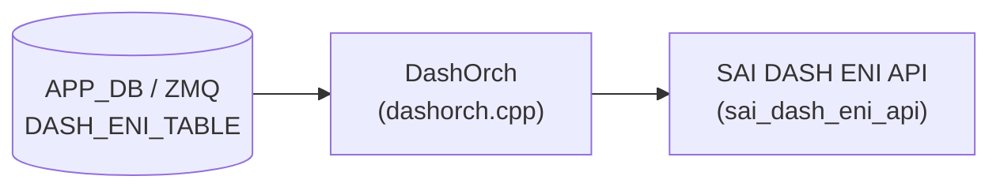

# DASH_ENI_TABLE テーブル

## 概要

DASH (Disaggregated APIs for SONiC Hosts) の Elastic Network Interface (ENI) エントリを保持するテーブル[^1]。ENI は DASH ソフトウェアスイッチにおける仮想 NIC の論理単位であり、VNET への所属・アンダーレイ IP・ACL バインド・ルーティング・メータリングなどの起点となる。

`DashOrch` (`sonic-swss/orchagent/dash/dashorch.cpp`) が ZMQ 経由で受信した Protobuf メッセージを解釈し、SAI の `sai_dash_eni_api` を通じてデータプレーンに ENI を作成する。MAC アドレスは ENI ether address map entry のキーとして使用され、受信パケットの内部 src-MAC (Outbound) または内部 dst-MAC (Inbound) で ENI を特定するための LUT を構成する。

<!-- cdb-mermaid -->
### データフロー (自動生成)



!!! note "凡例"
    APP_DB (ZMQ 経由) から SAI までの典型経路。詳細・例外は本ページ本文を参照。
<!-- /cdb-mermaid -->

## key 構造

```text
DASH_ENI_TABLE:<eni_mac>
```

`<eni_mac>` は ENI の MAC アドレス文字列 (例: `F4939FEFC47E`)。

## フィールド

| フィールド | 型 | 必須 | デフォルト | 説明 |
|-----------|----|----|-----------|------|
| `mac_address` | bytes (6 バイト MAC) | 必須 | — | ENI の MAC アドレス。ether address map entry の lookup key |
| `vnet` | string | 必須 | — | ENI が所属する VNET 名。`DASH_VNET_TABLE` に登録済みである必要あり |
| `underlay_ip` | IpAddress (protobuf) | 必須 | — | Inbound カプセル化で使用する VM の PA (Physical Address) |
| `admin_state` | enum `STATE_ENABLED` / `STATE_DISABLED` | 任意 | `STATE_DISABLED` | 管理状態。明示的に `STATE_ENABLED` を設定するまで disabled |
| `qos` | string | 任意 | なし | QoS プロファイル名 (`DASH_QOS_TABLE` の key)。PPS / CPS / Flows を ENI に適用 |
| `pl_underlay_sip` | IpAddress | 任意 | なし | Private Link / Service Tunnel の ST GW VIP。Outbound SIP として使用 |
| `pl_sip_encoding` | IpPrefix (ip + mask) | 任意 | なし | Private Link IPv6 SIP 変換エンコーディング (field_value/full_mask 形式) |
| `v4_meter_policy_id` | string | 任意 | なし | IPv4 用メータポリシー ID (`DASH_METER_POLICY_TABLE` の key) |
| `v6_meter_policy_id` | string | 任意 | なし | IPv6 用メータポリシー ID (`DASH_METER_POLICY_TABLE` の key) |
| `mode` | enum `MODE_VM` / `MODE_FNIC` | 任意 | `MODE_VM` (vm_mode) | ENI のモード。`floating_nic_mode` (FNIC) か `vm_mode` (VM) |
| `trusted_vnis_list` | list of ValueOrRange | 任意 | 空リスト | 信頼済み VNI リスト。単一値または範囲 (`min-max`) |
| `disable_fast_path_icmp_flow_redirection` | bool | 任意 | 不明 | Fast Path ICMP フローリダイレクト処理の無効化フラグ |
| `eni_id` | string (UUID) | 任意 | — | ENI の識別子 UUID (コントローラが発行) |

## 制約

- `vnet` は ENI 作成前に `DASH_VNET_TABLE` に登録済みでなければリトライ (`addEniObject` が `false` を返す)
- `underlay_ip` は有効な IpAddress protobuf オブジェクトでなければ `addEniObject` が `false` を返してリトライ
- Appliance エントリ (`DASH_APPLIANCE_TABLE`) が存在しない場合も ENI 作成がリトライされる
- `v4_meter_policy_id` / `v6_meter_policy_id` が指定されているが対応する `DASH_METER_POLICY_TABLE` エントリが未登録の場合はリトライ
- ENI の `mode` は作成時のみ指定可能 (後から変更不可)[^1]

## 購読者

- `DashOrch` (`sonic-swss/orchagent/dash/dashorch.cpp`): ENI エントリを受信し、`sai_dash_eni_api->create_eni()` でデータプレーンに ENI を作成する。同時に `EniCounter` / `MeterCounter` の FlexCounter グループへの登録と CRM リソースカウンタのインクリメントを行う
- `DashMeterOrch`: `v4_meter_policy_id` / `v6_meter_policy_id` のバインドカウント管理

## 関連 CONFIG_DB

- [`DASH_VNET_TABLE`](dash-vnet.md): ENI が所属する VNET
- [`DASH_QOS_TABLE`](dash-qos.md): ENI に適用する QoS プロファイル (PPS / CPS / Flows)
- [`DASH_APPLIANCE_TABLE`](dash-appliance.md): Appliance グローバル設定 (VM VNI など)
- [`DASH_ACL_IN_TABLE`](dash-acl.md) / [`DASH_ACL_OUT_TABLE`](dash-acl.md): ENI への ACL バインド
- [`DASH_ENI_ROUTE_TABLE`](dash-eni-route.md): ENI のルートグループバインド

<!-- cdb-exceptions -->
## 例外条件・特殊挙動

| 条件 | 挙動 |
|------|------|
| `vnet` が `DASH_VNET_TABLE` に未登録 | `addEniObject` が `false` を返し、orchagent がリトライキューに戻す |
| `underlay_ip` が不正な protobuf IpAddress | `to_sai()` が `false` → `addEniObject` 失敗でリトライ |
| `DASH_APPLIANCE_TABLE` エントリが空 | ENI 作成をリトライ |
| `mode` に未知の enum 値 | `eniModeMap` lookup miss → `SAI_DASH_ENI_MODE_VM` にフォールバックし `SWSS_LOG_ERROR` を出力 |
| `admin_state` が未設定 | proto3 enum デフォルト (`0 = STATE_DISABLED`) → SAI に `false` (disabled) を渡す |
| ENI が既存で `admin_state` のみ変更 | `setEniAdminState()` のみ呼び出し (再作成なし) |
| ENI が既存で他フィールドが変更 | `addEni` は `SWSS_LOG_WARN("ENI already exists")` のみ。フィールド更新は未サポート |
| `disable_fast_path_icmp_flow_redirection` を設定 | orchagent (`dashorch.cpp`) に対応コードなし — HLD 記載あるが未実装の可能性 |
<!-- /cdb-exceptions -->

<!-- defaults -->
## フィールド暗黙デフォルト (Phase A — コード由来)

YANG / proto3 デフォルト以外の実装由来 fallback。`DashOrch::addEniObject()` (dashorch.cpp:566-768) の SAI 属性組み立てロジックから導出。

| フィールド | コード由来デフォルト | fallback 源 |
|-----------|-------------------|------------|
| `admin_state` | `STATE_DISABLED` (proto3 enum 0 = false) | `STATE_ENABLED` との明示比較 — dashorch.cpp:634; コントローラが `STATE_ENABLED` を送るまで disabled が意図的デフォルト |
| `mode` | `SAI_DASH_ENI_MODE_VM` (vm_mode) | `has_eni_mode()` false 時は SAI 属性を push しない (SAI デフォルト適用); 不正 mode 値のエラー時 fallback も `VM` — dashorch.cpp:724-734; HLD:406 "Default is 'vm_mode'" |
| `qos` | SAI 未設定 (PPS/CPS/FLOWS を push しない) | `qos_entries_` lookup miss → `has_qos = false` → QoS 属性ブロックをスキップ — dashorch.cpp:617-631 |
| `pl_underlay_sip` | SAI 未設定 | `has_pl_underlay_sip()` false → push しない — dashorch.cpp:649 |
| `pl_sip_encoding` | SAI 未設定 | `has_pl_sip_encoding()` false → push しない — dashorch.cpp:656 |
| `v4_meter_policy_id` | SAI 未設定 | `has_v4_meter_policy_id()` false → 空文字列 → push しない — dashorch.cpp:585 |
| `v6_meter_policy_id` | SAI 未設定 | `has_v6_meter_policy_id()` false → 空文字列 → push しない — dashorch.cpp:587 |
| `trusted_vnis_list` | 空リスト (trusted VNI エントリなし) | リスト空時 `addEniTrustedVnis()` 呼ばず — dashorch.cpp:868 |
| `disable_fast_path_icmp_flow_redirection` | 不明 | dashorch.cpp に処理コード未確認 (HLD に記載あり) |

### 補足

- `admin_state` は proto3 のデフォルト値 (enum 0) が `STATE_DISABLED` になるため、フィールドを省略した場合でも disabled として扱われる。HLD は「すべての設定適用後にコントローラが `enabled` に設定する」というワークフローを前提とする[^1]。
- `mode` フィールドは `has_eni_mode()` が false の場合 (未設定) に SAI 属性を push しない設計のため、実際のデフォルトは SAI 実装依存になる。HLD の "Default is 'vm_mode'" はコントローラ側の推奨値であり、orchagent は省略時に SAI に何も渡さない。
- `disable_fast_path_icmp_flow_redirection` は HLD スキーマ (dash-sonic-hld.md:389) に OPTIONAL フィールドとして記載されているが、現行の `dashorch.cpp` に対応する SAI 属性設定コードが見当たらない。HLD と実装の乖離 (discrepancy) として記録する。

<!-- /defaults -->

<!-- entry-points -->
## 書き込み入り口 (Direction A)

対象テーブル: `DASH_ENI_TABLE`

### ZMQ / Protobuf (コントローラ経由)

- DASH コントローラ (external) が ZMQ 経由で `dash::eni::Eni` protobuf を送信
- `DashOrch` が ZMQ Consumer として受信し、`doTask()` で処理

### CLI

- なし (DASH ENI は CLI 経由での設定を想定しない)

### REST / gNMI

- sonic-mgmt-common 経由の gNMI SetRequest で書き込み可能 (sonic-gnmi)

<!-- /entry-points -->

## 引用元

[^1]: `SONiC/doc/dash/dash-sonic-hld.md` §3.2.3 ENI (DASH_ENI_TABLE スキーマ定義・ENI モード・admin-state ワークフロー). <https://github.com/sonic-net/SONiC/blob/49bab5b5ff0e924f1ea52b3d9db0dfa4191a7c06/doc/dash/dash-sonic-hld.md>

<!-- glossary-links-injected: dash-eni-2026-0514 -->
