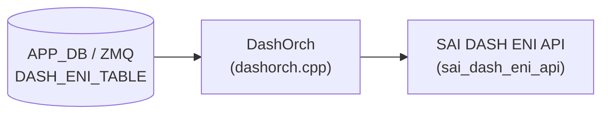

# DASH_ENI_TABLE テーブル

## 概要

[DASH](../../reference/glossary.md#term-dash) (Disaggregated APIs for [SONiC](../../reference/glossary.md#term-sonic) Hosts) の Elastic Network Interface ([ENI](../../reference/glossary.md#term-eni)) エントリを保持するテーブル[^1]。[ENI](../../reference/glossary.md#term-eni) は [DASH](../../reference/glossary.md#term-dash) ソフトウェアスイッチにおける仮想 NIC の論理単位であり、[VNET](../../reference/glossary.md#term-vnet) への所属・アンダーレイ IP・[ACL](../../reference/glossary.md#term-acl) バインド・ルーティング・メータリングなどの起点となる。

`DashOrch` (`sonic-swss/orchagent/dash/dashorch.cpp`) が ZMQ 経由で受信した Protobuf メッセージを解釈し、[SAI](../../reference/glossary.md#term-sai) の `sai_dash_eni_api` を通じてデータプレーンに [ENI](../../reference/glossary.md#term-eni) を作成する。MAC アドレスは ENI ether address map entry のキーとして使用され、受信パケットの内部 src-MAC (Outbound) または内部 dst-MAC (Inbound) で ENI を特定するための LUT を構成する。

<!-- cdb-mermaid -->
### データフロー (自動生成)



!!! note "凡例"
    APP_DB (ZMQ 経由) から SAI までの典型経路。詳細・例外は本ページ本文を参照。
<!-- /cdb-mermaid -->

## key 構造

```text
DASH_ENI_TABLE:<eni_mac>
```

`<eni_mac>` は ENI の MAC アドレス文字列 (例: `F4939FEFC47E`)。

## フィールド

| フィールド | 型 | 必須 | デフォルト | 説明 |
|-----------|----|----|-----------|------|
| `mac_address` | bytes (6 バイト MAC) | 必須 | — | ENI の MAC アドレス。ether address map entry の lookup key |
| `vnet` | string | 必須 | — | ENI が所属する [VNET](../../reference/glossary.md#term-vnet) 名。`DASH_VNET_TABLE` に登録済みである必要あり |
| `underlay_ip` | IpAddress (protobuf) | 必須 | — | Inbound カプセル化で使用する VM の PA (Physical Address) |
| `admin_state` | enum `STATE_ENABLED` / `STATE_DISABLED` | 任意 | `STATE_DISABLED` | 管理状態。明示的に `STATE_ENABLED` を設定するまで disabled |
| `qos` | string | 任意 | なし | [QoS](../../reference/glossary.md#term-qos) プロファイル名 (`DASH_QOS_TABLE` の key)。PPS / CPS / Flows を ENI に適用 |
| `pl_underlay_sip` | IpAddress | 任意 | なし | Private Link / Service Tunnel の ST GW VIP。Outbound SIP として使用 |
| `pl_sip_encoding` | IpPrefix (ip + mask) | 任意 | なし | Private Link IPv6 SIP 変換エンコーディング (field_value/full_mask 形式) |
| `v4_meter_policy_id` | string | 任意 | なし | IPv4 用メータポリシー ID (`DASH_METER_POLICY_TABLE` の key) |
| `v6_meter_policy_id` | string | 任意 | なし | IPv6 用メータポリシー ID (`DASH_METER_POLICY_TABLE` の key) |
| `mode` | enum `MODE_VM` / `MODE_FNIC` | 任意 | `MODE_VM` (vm_mode) | ENI のモード。`floating_nic_mode` (FNIC) か `vm_mode` (VM) |
| `trusted_vnis_list` | list of ValueOrRange | 任意 | 空リスト | 信頼済み VNI リスト。単一値または範囲 (`min-max`) |
| `disable_fast_path_icmp_flow_redirection` | bool | 任意 | 不明 | Fast Path ICMP フローリダイレクト処理の無効化フラグ |
| `eni_id` | string (UUID) | 任意 | — | ENI の識別子 UUID (コントローラが発行) |

## 制約

- `vnet` は ENI 作成前に `DASH_VNET_TABLE` に登録済みでなければリトライ (`addEniObject` が `false` を返す)
- `underlay_ip` は有効な IpAddress protobuf オブジェクトでなければ `addEniObject` が `false` を返してリトライ
- Appliance エントリ (`DASH_APPLIANCE_TABLE`) が存在しない場合も ENI 作成がリトライされる
- `v4_meter_policy_id` / `v6_meter_policy_id` が指定されているが対応する `DASH_METER_POLICY_TABLE` エントリが未登録の場合はリトライ
- ENI の `mode` は作成時のみ指定可能 (後から変更不可)[^1]

## 購読者

- `DashOrch` (`sonic-swss/orchagent/dash/dashorch.cpp`): ENI エントリを受信し、`sai_dash_eni_api->create_eni()` でデータプレーンに ENI を作成する。同時に `EniCounter` / `MeterCounter` の [FlexCounter](../../reference/glossary.md#term-flexcounter) グループへの登録と [CRM](../../reference/glossary.md#term-crm) リソースカウンタのインクリメントを行う
- `DashMeterOrch`: `v4_meter_policy_id` / `v6_meter_policy_id` のバインドカウント管理

## 関連 CONFIG_DB

- [`DASH_VNET_TABLE`](dash-vnet.md): ENI が所属する [VNET](../../reference/glossary.md#term-vnet)
- `DASH_QOS_TABLE`: ENI に適用する [QoS](../../reference/glossary.md#term-qos) プロファイル (PPS / CPS / Flows)
- `DASH_APPLIANCE_TABLE`: Appliance グローバル設定 (VM VNI など)
- [`DASH_ACL_IN_TABLE`](dash-acl.md) / [`DASH_ACL_OUT_TABLE`](dash-acl.md): ENI への [ACL](../../reference/glossary.md#term-acl) バインド
- `DASH_ENI_ROUTE_TABLE`: ENI のルートグループバインド

<!-- cdb-exceptions -->
## 例外条件・特殊挙動

| 条件 | 挙動 |
|------|------|
| `vnet` が `DASH_VNET_TABLE` に未登録 | `addEniObject` が `false` を返し、[orchagent](../../reference/glossary.md#term-orchagent) がリトライキューに戻す |
| `underlay_ip` が不正な protobuf IpAddress | `to_sai()` が `false` → `addEniObject` 失敗でリトライ |
| `DASH_APPLIANCE_TABLE` エントリが空 | ENI 作成をリトライ |
| `mode` に未知の enum 値 | `eniModeMap` lookup miss → `SAI_DASH_ENI_MODE_VM` にフォールバックし `SWSS_LOG_ERROR` を出力 |
| `admin_state` が未設定 | proto3 enum デフォルト (`0 = STATE_DISABLED`) → [SAI](../../reference/glossary.md#term-sai) に `false` (disabled) を渡す |
| ENI が既存で `admin_state` のみ変更 | `setEniAdminState()` のみ呼び出し (再作成なし) |
| ENI が既存で他フィールドが変更 | `addEni` は `SWSS_LOG_WARN("ENI already exists")` のみ。フィールド更新は未サポート |
| `disable_fast_path_icmp_flow_redirection` を設定 | [orchagent](../../reference/glossary.md#term-orchagent) (`dashorch.cpp`) に対応コードなし — [HLD](../../reference/glossary.md#term-hld) 記載あるが未実装の可能性 |
<!-- /cdb-exceptions -->

<!-- defaults -->
## フィールド暗黙デフォルト (Phase A — コード由来)

[YANG](../../reference/glossary.md#term-yang) / proto3 デフォルト以外の実装由来 fallback。`DashOrch::addEniObject()` (dashorch.cpp:566-768) の [SAI](../../reference/glossary.md#term-sai) 属性組み立てロジックから導出。

| フィールド | コード由来デフォルト | fallback 源 |
|-----------|-------------------|------------|
| `admin_state` | `STATE_DISABLED` (proto3 enum 0 = false) | `STATE_ENABLED` との明示比較 — dashorch.cpp:634; コントローラが `STATE_ENABLED` を送るまで disabled が意図的デフォルト |
| `mode` | `SAI_DASH_ENI_MODE_VM` (vm_mode) | `has_eni_mode()` false 時は SAI 属性を push しない (SAI デフォルト適用); 不正 mode 値のエラー時 fallback も `VM` — dashorch.cpp:724-734; [HLD](../../reference/glossary.md#term-hld):406 "Default is 'vm_mode'" |
| `qos` | SAI 未設定 (PPS/CPS/FLOWS を push しない) | `qos_entries_` lookup miss → `has_qos = false` → [QoS](../../reference/glossary.md#term-qos) 属性ブロックをスキップ — dashorch.cpp:617-631 |
| `pl_underlay_sip` | SAI 未設定 | `has_pl_underlay_sip()` false → push しない — dashorch.cpp:649 |
| `pl_sip_encoding` | SAI 未設定 | `has_pl_sip_encoding()` false → push しない — dashorch.cpp:656 |
| `v4_meter_policy_id` | SAI 未設定 | `has_v4_meter_policy_id()` false → 空文字列 → push しない — dashorch.cpp:585 |
| `v6_meter_policy_id` | SAI 未設定 | `has_v6_meter_policy_id()` false → 空文字列 → push しない — dashorch.cpp:587 |
| `trusted_vnis_list` | 空リスト (trusted VNI エントリなし) | リスト空時 `addEniTrustedVnis()` 呼ばず — dashorch.cpp:868 |
| `disable_fast_path_icmp_flow_redirection` | 不明 | dashorch.cpp に処理コード未確認 ([HLD](../../reference/glossary.md#term-hld) に記載あり) |

### 補足

- `admin_state` は proto3 のデフォルト値 (enum 0) が `STATE_DISABLED` になるため、フィールドを省略した場合でも disabled として扱われる。HLD は「すべての設定適用後にコントローラが `enabled` に設定する」というワークフローを前提とする[^1]。
- `mode` フィールドは `has_eni_mode()` が false の場合 (未設定) に SAI 属性を push しない設計のため、実際のデフォルトは SAI 実装依存になる。HLD の "Default is 'vm_mode'" はコントローラ側の推奨値であり、[orchagent](../../reference/glossary.md#term-orchagent) は省略時に SAI に何も渡さない。
- `disable_fast_path_icmp_flow_redirection` は HLD スキーマ (dash-sonic-hld.md:389) に OPTIONAL フィールドとして記載されているが、現行の `dashorch.cpp` に対応する SAI 属性設定コードが見当たらない。HLD と実装の乖離 (discrepancy) として記録する。

<!-- /defaults -->

<!-- entry-points -->
## 書き込み入り口 (Direction A)

対象テーブル: `DASH_ENI_TABLE`

### ZMQ / Protobuf (コントローラ経由)

- [DASH](../../reference/glossary.md#term-dash) コントローラ (external) が ZMQ 経由で `dash::eni::Eni` protobuf を送信
- `DashOrch` が ZMQ Consumer として受信し、`doTask()` で処理

### CLI

- なし (DASH ENI は CLI 経由での設定を想定しない)

### REST / gNMI

- [sonic-mgmt](../../reference/glossary.md#term-sonic-mgmt)-common 経由の [gNMI](../../reference/glossary.md#term-gnmi) SetRequest で書き込み可能 (sonic-gnmi)

<!-- /entry-points -->

<!-- ordering -->
## 書込み順依存・タイミング依存

### 1. DASH_APPLIANCE_TABLE が先行必須

`addEniObject()` は `appliance_entries_` が空の場合に `false` を返してリトライキューに戻す。`DASH_ENI_TABLE` を書く前に `DASH_APPLIANCE_TABLE` のエントリが登録済みでなければならない[^1]。

> コード根拠: `dashorch.cpp:578–582`

### 2. DASH_VNET_TABLE が先行必須

`vnet` フィールドに指定した VNET 名が `gVnetNameToId` に存在しない場合、`addEniObject()` は即座に `false` を返す。`DASH_VNET_TABLE` への登録が先行していること[^1]。

> コード根拠: `dashorch.cpp:570–576`

### 3. DASH_METER_POLICY_TABLE が先行必須（メータポリシー使用時）

`v4_meter_policy_id` / `v6_meter_policy_id` が指定されている場合、`DashMeterOrch::getMeterPolicyOid()` が `SAI_NULL_OBJECT_ID` を返すとリトライ。対応する `DASH_METER_POLICY_TABLE` エントリを ENI より先に書くこと[^1]。

> コード根拠: `dashorch.cpp:584–607`

### 4. ENI SAI オブジェクト → ENI ether address map entry（作成順）

`addEni()` は ① `addEniObject()`（`sai_dash_eni_api->create_eni()`）→ ② `addEniAddrMapEntry()`（`create_eni_ether_address_map_entry()`）の順で実行する。ether address map entry は ENI OID を参照するため、この順序は不変[^1]。

> コード根拠: `dashorch.cpp:861`

### 5. ENI 本体 → trusted VNI エントリ（作成順）

`addEni()` は ENI オブジェクトと ether address map entry が両方成功した後にのみ `addEniTrustedVnis()` を呼び出す。途中失敗時は `removeEni()` でロールバック[^1]。

> コード根拠: `dashorch.cpp:866–878`

### 6. DASH_ENI_TABLE → DASH_ENI_ROUTE_TABLE の順

`setEniRoute()` は `eni_entries_` に ENI が存在しない場合に `false` を返してリトライ。ENI Route を書く前に ENI 本体が `DASH_ENI_TABLE` 経由で登録済みでなければならない[^1]。

> コード根拠: `dashorch.cpp:1186–1189`

### 7. DASH_ROUTE_GROUP_TABLE → DASH_ENI_ROUTE_TABLE の順

`setEniRoute()` は `DashRouteOrch::getRouteGroupOid()` が `SAI_NULL_OBJECT_ID` を返した場合にもリトライ。ルートグループが先行して作成されている必要がある[^1]。

> コード根拠: `dashorch.cpp:1192–1198`

### 8. ENI 削除順: ether address map entry → ENI SAI オブジェクト（逆順）

`removeEni()` は ① `removeEniAddrMapEntry()` → ② `removeEniObject()` の順で削除する（作成の逆順）。ENI SAI オブジェクトが `SAI_STATUS_OBJECT_IN_USE` を返した場合は削除をリトライし、参照元 ([ACL](../../reference/glossary.md#term-acl) / Route 等) の解放を待つ[^1]。

> コード根拠: `dashorch.cpp:1015–1043`

### 9. Warm-reboot 時の再適用順序

Warm start 時 `warmRestoreAndSyncUp()` は全 Orch の `bake()` で APP_DB の既存エントリを toSync キューに積み直した後、3 イテレーション `doTask()` を実行する。DASH 系は ZMQ Consumer のため、厳密には orchagent 再起動後のコントローラ再送で依存解決される設計。orchdaemon の `addOrchList` 登録順は `DashAclOrch → DashVnetOrch → DashRouteOrch → DashOrch → ...` であり、依存テーブルが先行処理されることを前提とした順序になっている[^1]。

> コード根拠: `orchdaemon.cpp:1095–1170`, `orchdaemon.cpp:1408–1421`

### 順序依存サマリ

| # | 先行テーブル / 操作 | 後続テーブル / 操作 | 緩和策 |
|---|-------------------|-------------------|--------|
| 1 | `DASH_APPLIANCE_TABLE` 登録 | `DASH_ENI_TABLE` 書込 | `appliance_entries_` が空 → リトライ |
| 2 | `DASH_VNET_TABLE` 登録 | `DASH_ENI_TABLE` 書込 | `gVnetNameToId` miss → リトライ |
| 3 | `DASH_METER_POLICY_TABLE` 登録 | `DASH_ENI_TABLE` 書込（meter 使用時） | `getMeterPolicyOid` SAI_NULL → リトライ |
| 4 | `create_eni()` 成功 | `create_eni_ether_address_map_entry()` | SAI 構造上保証（同一 `addEni()` 内） |
| 5 | ENI + address map 成功 | trusted VNI エントリ追加 | 失敗時 `removeEni()` でロールバック |
| 6 | `DASH_ENI_TABLE` 登録 | `DASH_ENI_ROUTE_TABLE` 書込 | ENI 未存在 → リトライ |
| 7 | `DASH_ROUTE_GROUP_TABLE` 登録 | `DASH_ENI_ROUTE_TABLE` 書込 | RouteGroup OID null → リトライ |
| 8 | address map entry 削除 | ENI SAI オブジェクト削除 | `OBJECT_IN_USE` → リトライ |

<!-- /ordering -->

<!-- cross-refs -->
## 暗黙参照テーブル (Phase C)

[YANG](../../reference/glossary.md#term-yang) 未定義テーブルのため leafref は存在しない。以下はすべて実装レベルの暗黙参照。

### DASH_ENI_TABLE が参照するテーブル

| 参照先テーブル / リソース | 参照方向 | 条件 | ブロッキング | 参照元 evidence |
|--------------------------|---------|------|------------|----------------|
| `DASH_VNET_TABLE` (`vnet` フィールド) | 存在確認 + SAI OID 解決 | `vnet` 指定時（必須フィールド） | あり（未登録 → リトライ） | `dashorch.cpp` L570–576, L614 |
| `DASH_APPLIANCE_TABLE` (`vm_vni` 取得) | 存在確認 + 値読み取り | 常時（全 ENI 作成） | あり（エントリなし → リトライ） | `dashorch.cpp` L578–582, L651–653 |
| `DASH_METER_POLICY_TABLE` (`v4/v6_meter_policy_id`) | SAI OID 解決 | `v4/v6_meter_policy_id` 指定時 | あり（未登録 → リトライ） | `dashorch.cpp` L584–607, L670–677 |
| `DASH_QOS_TABLE` (`qos` フィールド) | 存在確認 + 値読み取り | `qos` 指定時 | なし（未登録でも ENI 作成続行） | `dashorch.cpp` L617–631 |

!!! note "QoS は非ブロッキング参照"
    `qos` フィールドが指定されても `DASH_QOS_TABLE` にエントリがなければ `has_qos = false` として QoS 属性を SAI に設定せず ENI 作成を続行する。後から QoS エントリが追加されても ENI に自動適用されないため、QoS を使用する場合は ENI 作成前に `DASH_QOS_TABLE` を登録することを推奨。

### DASH_ENI_TABLE が参照される側

| 参照元テーブル / Orch | 参照内容 | ENI 未存在時の挙動 | 参照元 evidence |
|--------------------|---------|-----------------|----------------|
| `DASH_ENI_ROUTE_TABLE` (`DashOrch::setEniRoute()`) | ENI OID 取得（`eni_entries_` 検索） | `false` → リトライ | `dashorch.cpp` L1186 |
| `DASH_ACL_IN/OUT_TABLE` (`DashAclGroupMgr::bind()`) | ENI の `eni_id` (SAI OID) 取得 | nullptr → バインド失敗 | `dashaclgroupmgr.cpp` L457, L506 |
| `DASH_INBOUND_ROUTING_TABLE` (`DashRouteOrch`) | ENI の `eni_id` 取得（Inbound routing entry 作成） | nullptr → リトライ | `dashrouteorch.cpp` L425, L439, L521 |
| `DASH_HA_SET/SCOPE_TABLE` (`DashHaOrch`) | ENI エントリの存在確認・全テーブル参照 | nullptr チェック | `dashhaorch.cpp` L651, L662 |

<!-- /cross-refs -->

<!-- failure -->
## 失敗挙動マトリクス (Phase D)

ソース: `sonic-net/sonic-swss/orchagent/dash/dashorch.cpp`

### SET 処理における失敗経路

| 失敗条件 | 検出箇所 | 結果 | ログ出力 | retry | evidence |
|---|---|---|---|---|---|
| Protobuf メッセージのパース失敗 | `doTaskEniTable()` L1061-1065 | `m_toSync` から erase（再試行なし） | `SWSS_LOG_WARN "Requires protobuff at ENI"` | なし | `dashorch.cpp:1063-1065` |
| `vnet` フィールドが未登録（`gVnetNameToId` miss） | `addEniObject()` L572-576 | `addEni()` が `false` → `it++` → `DASH_RESULT_FAILURE` を APPL_STATE_DB に書込 | `SWSS_LOG_INFO "Retry as vnet not found"` | VNET 登録まで無制限 | `dashorch.cpp:572-576` |
| `appliance_entries_` が空（DASH_APPLIANCE_TABLE 未登録） | `addEniObject()` L578-582 | `addEni()` が `false` → `it++` → `DASH_RESULT_FAILURE` | `SWSS_LOG_INFO "Retry as no appliance table entry found"` | Appliance 登録まで無制限 | `dashorch.cpp:578-582` |
| `v4_meter_policy_id` が未登録（`getMeterPolicyOid` = SAI_NULL） | `addEniObject()` L590-597 | `addEni()` が `false` → `it++` → `DASH_RESULT_FAILURE` | `SWSS_LOG_INFO "Retry as v4 meter_policy not found"` | MeterPolicy 登録まで無制限 | `dashorch.cpp:590-597` |
| `v6_meter_policy_id` が未登録（`getMeterPolicyOid` = SAI_NULL） | `addEniObject()` L599-606 | `addEni()` が `false` → `it++` → `DASH_RESULT_FAILURE` | `SWSS_LOG_INFO "Retry as v6 meter_policy not found"` | MeterPolicy 登録まで無制限 | `dashorch.cpp:599-606` |
| `underlay_ip` の IP アドレス変換失敗（`to_sai()` が `false`） | `addEniObject()` L638-641 | `addEniObject()` が `false` → `addEni()` が `false` → `it++` → `DASH_RESULT_FAILURE` | なし（`to_sai` 内部でのみ処理） | なし | `dashorch.cpp:638-640` |
| SAI `create_eni()` 失敗 | `addEniObject()` L738-748 | `handleSaiCreateStatus()` で evaluate → `parseHandleSaiStatusFailure()` → `false` または retry | `SWSS_LOG_ERROR "Failed to create ENI object"` | SAI ステータス依存 | `dashorch.cpp:740-747` |
| SAI `create_eni_ether_address_map_entry()` 失敗 | `addEniAddrMapEntry()` L785-792 | `addEni()` が `false` → `it++` → `DASH_RESULT_FAILURE` | `SWSS_LOG_ERROR "Failed to create ENI ether address map entry"` | SAI ステータス依存 | `dashorch.cpp:785-792` |
| `trusted_vnis_list` に無効な VNI レンジ（`to_sai()` = `false`） | `addEniTrustedVnis()` L814-818 | 当該エントリをスキップして継続。全 VNI 失敗時は `addEni()` が ENI を `removeEni()` でロールバック | `SWSS_LOG_ERROR "Failed to convert trusted vni range for ENI"` | なし（個別エントリスキップ） | `dashorch.cpp:814-831` |
| SAI `create_eni_trusted_vni_entry()` 失敗 | `addEniTrustedVnis()` L823-832 | 当該エントリをスキップして継続。全失敗時に `removeEni()` でロールバック | `SWSS_LOG_ERROR "Failed to create ENI trusted vni entry"` | なし | `dashorch.cpp:823-831` |
| trusted VNI 追加が一部でも失敗（`all_trusted_vnis_added = false`） | `addEni()` L871-877 | `removeEni()` でロールバック（ENI + ether address map entry を削除）→ `false` → `it++` | `SWSS_LOG_ERROR "Failed to add all trusted vni entries for ENI. Removing ENI entry."` | なし（ロールバック後に再試行なし） | `dashorch.cpp:872-876` |
| ENI 既存で `admin_state` のみ変更（`setEniAdminState` 失敗） | `setEniAdminState()` L551-553 | `false` → `addEni()` → `false` → `it++` | `SWSS_LOG_ERROR "Failed to set ENI admin state"` | SAI ステータス依存 | `dashorch.cpp:551-553` |
| ENI 既存で他フィールドが変更（UPDATE 相当） | `addEni()` L856-858 | `SWSS_LOG_WARN` のみ。フィールド更新は行わず `true` を返す（変更無視） | `SWSS_LOG_WARN "ENI already exists"` | なし（silent ignore） | `dashorch.cpp:854-858` |
| 不明な操作コマンド（SET/DEL 以外） | `doTaskEniTable()` L1092-1095 | `m_toSync` から erase（再試行なし） | `SWSS_LOG_ERROR "Unknown operation"` | なし | `dashorch.cpp:1093-1094` |

### DEL 処理における失敗経路

| 失敗条件 | 検出箇所 | 結果 | ログ出力 | retry | evidence |
|---|---|---|---|---|---|
| ENI が存在しない（`eni_entries_` miss） | `removeEni()` L1019-1023 | `true` を返して正常終了（べき等）。APPL_STATE_DB から結果エントリ削除 | `SWSS_LOG_WARN "ENI does not exist"` | なし | `dashorch.cpp:1019-1022` |
| trusted VNI エントリ削除失敗（一部でも失敗） | `removeEniTrustedVnis()` L988-1006 | `removeEni()` が `false` → `it++` (retry)。部分的に削除された VNI は内部キャッシュから都度消去 | `SWSS_LOG_ERROR "Failed to remove ENI trusted vni entry"` | 無制限 | `dashorch.cpp:997-1004` |
| `removeEniAddrMapEntry()` で `SAI_STATUS_ITEM_NOT_FOUND` または `SAI_STATUS_INVALID_PARAMETER` | `removeEniAddrMapEntry()` L956-959 | `true` を返して正常終了（べき等処理） | なし（silent return true） | なし | `dashorch.cpp:956-959` |
| `remove_eni_ether_address_map_entry()` SAI 失敗（上記以外） | `removeEniAddrMapEntry()` L961-966 | `removeEni()` が `false` → `it++` (retry) | `SWSS_LOG_ERROR "Failed to remove ENI ether address map entry"` | 無制限 | `dashorch.cpp:961-965` |
| `remove_eni()` で `SAI_STATUS_OBJECT_IN_USE` | `removeEniObject()` L911-913 | `removeEni()` が `false` → `it++` (retry)。参照元（ACL / Route 等）の解放を待つ | なし（silent `false`） | 無制限 | `dashorch.cpp:911-913` |
| `remove_eni()` SAI 失敗（OBJECT_IN_USE 以外） | `removeEniObject()` L915-920 | `parseHandleSaiStatusFailure()` → `false` → `it++` (retry) | `SWSS_LOG_ERROR "Failed to remove ENI object"` | SAI ステータス依存 | `dashorch.cpp:915-920` |

### 結果テーブル（APPL_STATE_DB）

`doTaskEniTable()` は SET 処理の成否を `APPL_STATE_DB:DASH_ENI_TABLE:<eni_mac>` に `result` フィールドとして書き込む。

| 状態 | `result` 値 | 条件 |
|---|---|---|
| SET 成功 | `DASH_RESULT_SUCCESS` (0) | `addEni()` が `true` |
| SET 失敗（依存未解決 / SAI エラー） | `DASH_RESULT_FAILURE` (1) | `addEni()` が `false` |
| DEL 成功 | エントリ削除 | `removeEni()` が `true` → `removeResultFromDB()` |
| DEL 失敗 | 前回の値を保持 | `removeEni()` が `false` → `it++` |

確認コマンド: `sonic-db-cli APPL_STATE_DB hgetall 'DASH_ENI_TABLE:<eni_mac>'`

エラーはすべて `SWSS_LOG_ERROR` または `SWSS_LOG_WARN` でサイログ出力される。[CONFIG_DB](../../reference/glossary.md#term-config_db) (APP_DB) のエントリは失敗後も残存する（orchagent は書き戻さない）。

> **証跡**: `doTaskEniTable()` L1045-1097, `addEni()` L841-881, `addEniObject()` L566-768, `addEniAddrMapEntry()` L770-800, `addEniTrustedVnis()` L802-839, `removeEni()` L1015-1043, `removeEniObject()` L896-941, `removeEniAddrMapEntry()` L944-974, `removeEniTrustedVnis()` L976-1013
<!-- /failure -->

<!-- constants -->
## ハードコード定数 (Phase E)

ソース: `sonic-net/sonic-swss/orchagent/dash/dashorch.h`, `dashorch.cpp`, `crmorch.h`

### FlexCounter グループ定数

| 定数 | 値 | 用途 |
|------|----|------|
| `ENI_STAT_COUNTER_FLEX_COUNTER_GROUP` | `"ENI_STAT_COUNTER"` | ENI 統計 [FlexCounter](../../reference/glossary.md#term-flexcounter) グループ名。[COUNTERS_DB](../../reference/glossary.md#term-counters_db) テーブル名としても使用 (`dashorch.h:29`) |
| `ENI_STAT_FLEX_COUNTER_POLLING_INTERVAL_MS` | `10000` ms (10 秒) | ENI 統計 [FlexCounter](../../reference/glossary.md#term-flexcounter) のポーリング間隔 (`dashorch.h:30`) |
| `METER_STAT_COUNTER_FLEX_COUNTER_GROUP` | `"METER_STAT_COUNTER"` | Meter カウンタ FlexCounter グループ名 (`dashorch.h:32`) |
| `METER_STAT_FLEX_COUNTER_POLLING_INTERVAL_MS` | `10000` ms (10 秒) | Meter 統計 FlexCounter のポーリング間隔 (`dashorch.h:33`) |

!!! note "ポーリング間隔は変更不可"
    ENI 統計・Meter 統計のポーリング間隔は `10,000 ms` (10 秒) にハードコードされており、YANG / CLI から変更できない。

### SAI 処理結果コード

| 定数 | 値 | 用途 |
|------|----|------|
| `DASH_RESULT_SUCCESS` | `0` | SET 成功時に `APPL_STATE_DB:DASH_ENI_TABLE:<eni_mac>` の `result` フィールドに書込む値 (`dashorch.h:35`) |
| `DASH_RESULT_FAILURE` | `1` | SET 失敗時（依存未解決 / SAI エラー）に `result` フィールドに書込む値 (`dashorch.h:36`) |

コントローラはこのフィールドをポーリングして ENI 作成の完了・失敗を確認する。確認コマンド: `sonic-db-cli APPL_STATE_DB hgetall 'DASH_ENI_TABLE:<eni_mac>'`

### ENI モードマップ（ハードコードマッピング）

```cpp
// dashorch.cpp:48-52
static const std::unordered_map<dash::eni::EniMode, sai_dash_eni_mode_t> eniModeMap =
{
    { dash::eni::MODE_VM,   SAI_DASH_ENI_MODE_VM   },
    { dash::eni::MODE_FNIC, SAI_DASH_ENI_MODE_FNIC }
};
```

マップ外の値は `SAI_DASH_ENI_MODE_VM` (VM モード) にフォールバックし `SWSS_LOG_ERROR` を出力する (`dashorch.cpp:732-733`)。

### CRM リソース識別子

ENI 1 件の作成・削除ごとに以下の **2 つのカウンタが独立して** 変動する。

| [CRM](../../reference/glossary.md#term-crm) リソース型 | +1 タイミング | -1 タイミング | evidence |
|---------------|-------------|-------------|---------|
| `CRM_DASH_ENI` | `create_eni()` 成功後 | `remove_eni()` 成功後 | `dashorch.cpp:754`, `dashorch.cpp:937` |
| `CRM_DASH_ENI_ETHER_ADDRESS_MAP` | `create_eni_ether_address_map_entry()` 成功後 | `remove_eni_ether_address_map_entry()` 成功後 | `dashorch.cpp:795`, `dashorch.cpp:969` |

[CRM](../../reference/glossary.md#term-crm) しきい値は `CRM_TABLE` で設定可能。しきい値超過アラートは各リソース型で独立して発火する (`crmorch.h:38-40`)。

<!-- /constants -->

<!-- side-effects -->
## 副次 DB 書込 (Phase F)

`DashOrch` は SAI ([ASIC_DB](../../reference/glossary.md#term-asic_db)) への書き込みに加えて、以下の DB 副次書込を行う[^orch]。

### DASH_ENI_TABLE SET

| 操作 | 対象 DB / テーブル | キー | 条件 |
|------|-----------------|------|------|
| `writeResultToDB(..., DASH_RESULT_SUCCESS)` | APPL_STATE_DB / `DASH_ENI_TABLE` | `<eni_mac>` | `addEni()` が `true` を返した時点（成功時）|
| `writeResultToDB(..., DASH_RESULT_FAILURE)` | APPL_STATE_DB / `DASH_ENI_TABLE` | `<eni_mac>` | `addEni()` が `false` を返した時点（失敗時）|
| `gCrmOrch->incCrmResUsedCounter(CRM_DASH_ENI)` | CRM 内部カウンタ | — | `create_eni()` SAI 成功後 |
| `gCrmOrch->incCrmResUsedCounter(CRM_DASH_ENI_ETHER_ADDRESS_MAP)` | CRM 内部カウンタ | — | `create_eni_ether_address_map_entry()` SAI 成功後 |
| `EniCounter.addToFC(eni_id, eni)` | [FLEX_COUNTER_DB](../../reference/glossary.md#term-flex_counter_db) / `ENI_STAT_COUNTER` | ENI OID | `addEniObject()` 完了後、FlexCounter 有効時 |
| `MeterCounter.addToFC(eni_id, eni)` | [FLEX_COUNTER_DB](../../reference/glossary.md#term-flex_counter_db) / `METER_STAT_COUNTER` | ENI OID | `addEniObject()` 完了後、FlexCounter 有効時 |
| `m_eni_name_table->set("", ...)` | [COUNTERS_DB](../../reference/glossary.md#term-counters_db) / `COUNTERS_ENI_NAME_MAP` | `""` | ENI OID 確定後、`addEniMapEntry()` 内 |
| `dash_meter_orch->incrMeterPolicyEniBindCount(v4_meter_policy)` | DashMeterOrch 内部 | — | `v4_meter_policy_id` 指定時 |
| `dash_meter_orch->incrMeterPolicyEniBindCount(v6_meter_policy)` | DashMeterOrch 内部 | — | `v6_meter_policy_id` 指定時 |

### DASH_ENI_TABLE DEL

| 操作 | 対象 DB / テーブル | キー | 条件 |
|------|-----------------|------|------|
| `removeResultFromDB(...)` | APPL_STATE_DB / `DASH_ENI_TABLE` | `<eni_mac>` | `removeEni()` が `true` を返した時点（成功時）|
| `gCrmOrch->decCrmResUsedCounter(CRM_DASH_ENI)` | CRM 内部カウンタ | — | `remove_eni()` SAI 成功後 |
| `gCrmOrch->decCrmResUsedCounter(CRM_DASH_ENI_ETHER_ADDRESS_MAP)` | CRM 内部カウンタ | — | `remove_eni_ether_address_map_entry()` SAI 成功後 |
| `EniCounter.removeFromFC(eni_id, eni)` | [FLEX_COUNTER_DB](../../reference/glossary.md#term-flex_counter_db) / `ENI_STAT_COUNTER` | ENI OID | `removeEniObject()` 冒頭 |
| `MeterCounter.removeFromFC(eni_id, eni)` | FLEX_COUNTER_DB / `METER_STAT_COUNTER` | ENI OID | `removeEniObject()` 冒頭 |
| `m_eni_name_table->hdel("", name)` | [COUNTERS_DB](../../reference/glossary.md#term-counters_db) / `COUNTERS_ENI_NAME_MAP` | `""` | `removeEniMapEntry()` 内 |
| `dash_meter_orch->decrMeterPolicyEniBindCount(v4_meter_policy)` | DashMeterOrch 内部 | — | `v4_meter_policy_id` 指定時 |
| `dash_meter_orch->decrMeterPolicyEniBindCount(v6_meter_policy)` | DashMeterOrch 内部 | — | `v6_meter_policy_id` 指定時 |

### DASH_ENI_ROUTE_TABLE SET / DEL

| 操作 | 対象 DB / テーブル | キー | 条件 |
|------|-----------------|------|------|
| `writeResultToDB(..., DASH_RESULT_SUCCESS/FAILURE)` | APPL_STATE_DB / `DASH_ENI_ROUTE_TABLE` | `<eni_mac>` | SET 成功/失敗時 |
| `removeResultFromDB(...)` | APPL_STATE_DB / `DASH_ENI_ROUTE_TABLE` | `<eni_mac>` | DEL 成功時 |
| `dash_route_orch->bindRouteGroup(entry.group_id())` | DashRouteOrch 内部 | — | ENI route SET 成功時 |
| `dash_route_orch->unbindRouteGroup(old_group_id)` | DashRouteOrch 内部 | — | ENI route SET 時に旧グループが存在する場合 |
| `dash_route_orch->unbindRouteGroup(...)` | DashRouteOrch 内部 | — | ENI route DEL 成功時 |

### 副次書込が行われない DB

[STATE_DB](../../reference/glossary.md#term-state_db)・[CONFIG_DB](../../reference/glossary.md#term-config_db) への書き込みは一切行われない[^orch]。

<!-- /side-effects -->

<!-- pubsub -->
## 通信メカニズム (ZMQ / ZmqConsumerStateTable) — Phase G

> **調査根拠**: `sonic-swss/orchagent/zmqorch.cpp`, `zmqorch.h`, `sonic-swss-common/common/zmqserver.h`, `zmqconsumerstatetable.cpp`, `orchdaemon.cpp` L1322–1420 精読 (2026-05-17)  
> 詳細証跡: `meta/_intermediate/cdb-flow/dash-eni-pubsub.md`

### 購読方式

`DASH_ENI_TABLE` の変更通知は **[Redis](../../reference/glossary.md#term-redis) keyspace notification ではなく ZeroMQ (ZMQ) メッセージ** で実装されている。`DashOrch` は `ZmqOrch` を継承し、`ZmqConsumerStateTable` を通じて ZMQ PUSH/PULL パターンで受信する。`SubscriberStateTable` / `NotificationConsumer` / [Redis](../../reference/glossary.md#term-redis) PSUBSCRIBE は一切使用しない。

| 定数 | 値 | 出典 |
|------|-----|------|
| ZMQ エンドポイント | `tcp://127.0.0.1:8100` | `zmqserver.h:16` (`ORCH_ZMQ_PORT=8100`) |
| フィーチャーフラグ | `ORCH_NORTHBOND_DASH_ZMQ_ENABLED`（デフォルト `true`） | `orchdaemon.cpp:1329` |
| バッチサイズ | `gBatchSize`（デフォルト 128） | `zmqorch.cpp:66` |
| poll タイムアウト | 1000 ms (`MQ_POLL_TIMEOUT`) | `zmqserver.h:12` |

### 通信シーケンス

```
[DASH コントローラ / gNMI サービス]
  gNMI SetRequest → sonic-mgmt-common (Protobuf エンコード)
    └─ ZmqClient("tcp://127.0.0.1:8100")
         └─ ZmqProducerStateTable::set(eni_mac, [("pb", pb_bytes)])
              ├─ ZmqClient::sendMsg() → ZMQ PUSH → orchagent ZmqServer
              └─ AsyncDBUpdater → DPU_APPL_DB:DASH_ENI_TABLE  ← DB persistence (非同期)

[orchagent — バックグラウンドスレッド]
  ZmqServer::mqPollThread()
    └─ zmq_recv() + BinarySerializer::deserialize()
    └─ ZmqConsumerStateTable::handleReceivedData()
         ├─ m_receivedOperationQueue.push()
         ├─ AsyncDBUpdater::update() → DPU_APPL_DB  ← DB persistence
         └─ SelectableEvent::notify()              ← epoll wakeup

[orchagent — メインスレッド]
  Select::select()
    └─ ZmqConsumer::execute()
         └─ ZmqConsumerStateTable::pops() → addToSync(entries)
    └─ ZmqConsumer::drain()
         └─ DashOrch::doTaskEniTable()
              └─ addEni() / removeEni() → SAI DASH ENI API
              └─ writeResultToDB() → APPL_STATE_DB:DASH_ENI_TABLE:<eni_mac>
```

### DB persistence と再起動耐性

`ZmqConsumerStateTable` は `dbPersistence=true` で初期化されるため、受信データを DPU_APPL_DB の `DASH_ENI_TABLE` に非同期書き込みする (`AsyncDBUpdater`)。orchagent 再起動時は `warmRestoreAndSyncUp()` → `bake()` が DPU_APPL_DB の既存エントリを `m_toSync` に再積み込み、コントローラの再送なしで ENI 設定を再適用する。

### ZMQ 無効時のフォールバック

`ORCH_NORTHBOND_DASH_ZMQ_ENABLED=false`（`-q` オプションなし）時は `ConsumerStateTable`（[Redis](../../reference/glossary.md#term-redis) SUBSCRIBE）にフォールバックする。[DPU](../../reference/glossary.md#term-dpu) 環境ではフラグがデフォルト `true` のため通常このパスは使われない (`zmqorch.cpp:63-72`)。

### DB・チャンネル使用一覧

| DB / チャンネル | 使用 | 用途 |
|----------------|------|------|
| ZMQ `tcp://127.0.0.1:8100` | 使用 | コントローラ → orchagent の SET/DEL メッセージ |
| `DPU_APPL_DB:DASH_ENI_TABLE` | 使用（非同期書き込み） | DB persistence（orchagent 再起動時の再生用） |
| `APPL_STATE_DB:DASH_ENI_TABLE` | 使用 | 処理結果（`DASH_RESULT_SUCCESS`/`FAILURE`）の書き戻し |
| Redis keyspace notification | 不使用 | — |
| Redis SUBSCRIBE / PSUBSCRIBE | 不使用 | — |
| `ProducerStateTable` チャンネル | 不使用 | — |
| `NotificationConsumer` | 不使用 | — |
| `SubscriberStateTable` | 不使用 | — |

<!-- /pubsub -->

<!-- platform -->
## プラットフォーム差・SAI capability (Phase H)

> **調査根拠**: `sonic-swss/orchagent/main.cpp`, `orchdaemon.cpp`, `dashorch.cpp`, `dashorch.h` 精読 (2026-05-17)  
> 詳細証跡: `meta/_intermediate/cdb-flow/dash-eni-platform.md`

### 動作条件: switch_type=dpu のみ

`DASH_ENI_TABLE` を処理する `DashOrch` は **`switch_type=dpu`** のノードでのみ起動する。`getCfgSwitchType()` が `CONFIG_DB:DEVICE_METADATA:localhost:switch_type` を読み取り、`gMySwitchType == "dpu"` の場合のみ `DpuOrchDaemon` が生成され `DashOrch` が登録される (`main.cpp:990-994`)。

| switch_type | DashOrch 起動 | 備考 |
|-------------|--------------|------|
| `"dpu"` | **起動** | [SmartSwitch](../../reference/glossary.md#term-smartswitch) の [DPU](../../reference/glossary.md#term-dpu) ロール。`DPU_APPL_DB` を購読 |
| `""` / `"switch"` / `"voq"` / `"fabric"` / `"chassis-packet"` | **不起動** | 通常 T0/T1 / [VOQ](../../reference/glossary.md#term-voq) chassis / fabric blade |
| [SmartSwitch](../../reference/glossary.md#term-smartswitch) [NPU](../../reference/glossary.md#term-npu) 側 (`switch_sub_type=SmartSwitch`, `switch_type=switch`) | **不起動** | [NPU](../../reference/glossary.md#term-npu) 側では `DashEniFwdOrch` のみ登録 (`orchdaemon.cpp:613`) |

`DashOrch` は `DPU_APPL_DB`（`m_dpu_appDb`）・`DPU_APPL_STATE_DB`（`m_dpu_appstateDb`）を使用し、通常の `APPL_DB` とは独立したデータベース接続で動作する。

### SmartSwitch NPU 側: DashEniFwdOrch（ENI 転送専用）

[SmartSwitch](../../reference/glossary.md#term-smartswitch) の [NPU](../../reference/glossary.md#term-npu) 側では `DashEniFwdOrch` が `APP_DASH_ENI_FORWARD_TABLE` を処理し、ENI を [DPU](../../reference/glossary.md#term-dpu) に転送するための ACL ルールをインストールする。`DASH_ENI_TABLE` への直接関与はなく、`DashOrch` は NPU 側では起動しない (`orchdaemon.cpp:613-615`)。

### SAI DASH ENI API — ベンダー分岐なし

`dashorch.cpp` は `sai_dash_eni_api->create_eni()` / `remove_eni()` 等の SAI DASH Extension API を一律呼び出す。ベンダー固有の環境変数（`platform` / `sub_platform` 等）への参照は一切存在せず、[ASIC](../../reference/glossary.md#term-asic) ベンダー差は SAI 実装側が抽象化する。

### SAI capability クエリ: HA Flow Owner 属性（唯一のプラットフォーム差）

`isHaFlowOwnerAttrSupported()` (`dashorch.cpp:102-125`) が起動時に一度だけ `sai_query_attribute_capability()` を呼び出し、SAI [ASIC](../../reference/glossary.md#term-asic) が `SAI_ENI_ATTR_IS_HA_FLOW_OWNER` の `set_implemented` または `create_implemented` をサポートするかを検出する。

| capability 検出結果 | ENI 作成時の挙動 |
|--------------------|----------------|
| サポートあり (`set_implemented \|\| create_implemented`) | HA Scope が存在する場合、HA ロール (ACTIVE / STANDBY 等) に応じて `SAI_ENI_ATTR_IS_HA_FLOW_OWNER` を push する (`dashorch.cpp:694`) |
| サポートなし（SAI がエラー返却）| `m_ha_flow_owner_attr_supported = false` → 属性を push しない (`dashorch.cpp:715`) |

これが `dashorch.cpp` における **唯一の SAI capability 条件分岐**であり、ベンダー SAI 実装の差異が動作に影響する唯一の経路。

!!! note "HA Flow Owner はオプション機能"
    HA 機能（`DASH_HA_SCOPE_TABLE`）を使用しない場合、`isHaFlowOwnerAttrSupported()` は呼び出されず、この分岐は ENI 作成に影響しない。

### SAI_DASH_APPLIANCE_ATTR_LOCAL_REGION_ID capability クエリ（間接影響）

`addApplianceEntry()` (`dashorch.cpp:141-148`) で `SAI_DASH_APPLIANCE_ATTR_LOCAL_REGION_ID` の capability を問い合わせ、`create_implemented` の場合のみ `local_region_id` を Appliance に設定する。ENI 作成への直接影響はないが、Appliance の設定内容が ENI の VM VNI 取得元 (`appliance_entries_[0].vm_vni()`) に影響する。

### FlexCounter ポーリング間隔（全ベンダー共通）

ENI 統計 (`ENI_STAT_COUNTER_FLEX_COUNTER_GROUP`) および Meter 統計 (`METER_STAT_COUNTER_FLEX_COUNTER_GROUP`) のポーリング間隔は `10,000 ms` にハードコードされており (`dashorch.h:30, 33`)、[ASIC](../../reference/glossary.md#term-asic) ベンダーによる差異はない。

> **Evidence**: `main.cpp:242-268, 990-994`（switch_type 判定・DpuOrchDaemon 起動）、`orchdaemon.cpp:613-615, 1322-1418`（DashEniFwdOrch 登録・DpuOrchDaemon::init）、`dashorch.cpp:39, 102-125, 692-715, 738`（SAI API 参照・capability 検出・ENI 作成）、`dashorch.h:29-33`（FlexCounter 定数）

<!-- /platform -->

## 引用元

[^1]: `SONiC/doc/dash/dash-sonic-hld.md` §3.2.3 ENI (DASH_ENI_TABLE スキーマ定義・ENI モード・admin-state ワークフロー). <https://github.com/sonic-net/SONiC/blob/49bab5b5ff0e924f1ea52b3d9db0dfa4191a7c06/doc/dash/dash-sonic-hld.md>

[^orch]: `sonic-net/sonic-swss/orchagent/dash/dashorch.cpp` — `doTaskEniTable()` (L1045–1097), `addEniObject()` (L566–768), `removeEniObject()` (L896–942), `addEniAddrMapEntry()` (L770–800), `removeEniAddrMapEntry()` (L944–974), `addEniMapEntry()` (L1368–1383), `removeEniMapEntry()` (L1385–1397), `setEniRoute()` (L1181–1241), `removeEniRoute()` (L1243–1279).

<!-- glossary-links-injected: dash-eni-2026-0514 -->

<!-- glossary-links-injected: f9445b5b4106 -->
