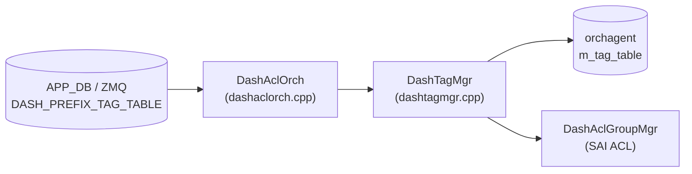

# DASH_PREFIX_TAG_TABLE テーブル

## 概要

DASH ACL で使用される IP プレフィックスタグ (Named Prefix Set) を保持するテーブル[^1]。タグ名をキーとし、IP バージョンとプレフィックスリストを定義する。ACL ルールの `src_tag` / `dst_tag` フィールドからタグ名で参照され、コントロールプレーンが「名前付きアドレス集合」を管理するためのオブジェクト。

`DashAclOrch` (`sonic-swss/orchagent/dash/dashaclorch.cpp`) が `PbWorker<PrefixTag>` 経由で protobuf を受信し、`taskUpdateDashPrefixTag` → `DashTagMgr::create/update` の順に処理する。タグは SAI には書き込まれず、orchagent 内メモリ (`m_tag_table`) に保持される。ACL group にタグが紐付く際、`DashTagMgr::getPrefixes()` で prefix 集合を取得して SAI ACL エントリに展開する。

<!-- cdb-mermaid -->
### データフロー (自動生成)



!!! note "凡例"
    タグは orchagent 内メモリにのみ保持される。SAI への直接書き込みは行わない。ACL rule バインド時に getPrefixes() で展開して SAI ACL エントリに渡す。
<!-- /cdb-mermaid -->

## key 構造

```text
DASH_PREFIX_TAG_TABLE:<tag_name>
```

`<tag_name>` はコントローラが付与する任意の文字列識別子 (例: `AclTagScale1798`)。

## フィールド

| フィールド | 型 | 必須 | デフォルト | 説明 |
|-----------|----|----|-----------|------|
| `pb` | bytes (Protobuf `PrefixTag`) | 必須 | — | シリアライズ済み protobuf。`ip_version` と `prefix_list` を含む |
| `ip_version` | enum `IP_VERSION_IPV4` / `IP_VERSION_IPV6` | 必須 | — (proto3 デフォルト `0` は拒否) | タグの IP バージョン。作成後の変更不可 |
| `prefix_list` | repeated `IpPrefix` (ip + mask) | 任意 | 空リスト | タグが表すプレフィックス集合。空リストでも登録可 |

> **注**: フィールドは protobuf `PrefixTag` メッセージ内に格納され、APP_DB 上は `pb` キーのバイナリ値として書かれる。`ip_version` / `prefix_list` は protobuf フィールド名として記載する。

## 制約

- `ip_version` が proto3 デフォルト値 (`0 = IP_VERSION_UNSPECIFIED`) または未対応値の場合、`to_sai()` が `false` を返し `task_failed` → エントリ全体が拒否される
- 作成後に `ip_version` を変更しようとすると `SWSS_LOG_WARN` + `task_failed` (イミュータブル)
- `prefix_list` の更新はフルリプレース (新リストで上書き)
- タグが ACL rule から参照中 (`m_groups` が空でない) の場合、`remove` は `task_need_retry` となる
- 未存在タグの `remove` は idempotent (`task_success`、警告ログのみ)

## 購読者

- `DashAclOrch` (`sonic-swss/orchagent/dash/dashaclorch.cpp`): `PbWorker<PrefixTag>` としてタグを受信し、`DashTagMgr` に委譲してメモリ管理を行う
- `DashTagMgr` (`sonic-swss/orchagent/dash/dashtagmgr.cpp`): タグの CRUD を管理し、ACL group からの `attach`/`detach` をハンドル

## 関連 CONFIG_DB

- [`DASH_ACL_IN_TABLE`](dash-acl.md) / [`DASH_ACL_OUT_TABLE`](dash-acl.md): ACL rule の `src_tag` / `dst_tag` フィールドがこのテーブルのタグ名を参照する
- [`DASH_ENI_TABLE`](dash-eni.md): ENI への ACL グループバインドの起点

<!-- cdb-exceptions -->
## 例外条件・特殊挙動

| 条件 | 挙動 |
|------|------|
| `ip_version` が `0` (proto3 デフォルト) | `to_sai()` が `false` → `task_failed`、エントリ拒否 |
| `ip_version` を更新しようとした場合 | `SWSS_LOG_WARN` + `task_failed` (変更禁止) |
| `prefix_list` が空 | 登録成功、空の prefix セット (ACL マッチには使えない) |
| 参照中タグの `remove` | `task_need_retry` (m_groups が非空) |
| 未存在タグの `remove` | `task_success` (idempotent、警告ログのみ) |
<!-- /cdb-exceptions -->

<!-- defaults -->
## フィールド暗黙デフォルト (Phase A — コード由来)

YANG / proto3 デフォルト以外の実装由来 fallback。`DashTagMgr::from_pb()` と `to_sai()` (dashtagmgr.cpp / pbutils.cpp) から導出。

| フィールド | コード由来デフォルト | fallback 源 |
|-----------|-------------------|------------|
| `ip_version` | **なし (実質必須)** — proto3 デフォルト `0` は拒否 | `to_sai(IpVersion)` が `IP_VERSION_IPV4 (1)` / `IP_VERSION_IPV6 (2)` のみ受理 — pbutils.cpp:9-24; `0` → `false` → `task_failed` — dashtagmgr.cpp:11-14 |
| `prefix_list` | 空リスト (登録は成功) | `to_sai(RepeatedPtrField<IpPrefix>)` は空入力に対し即 `true` を返す — pbutils.cpp:74-93 |

### 補足

- `ip_version` は proto3 の数値 enum `0` (= `IP_VERSION_UNSPECIFIED`) をコントローラが送ると orchagent が reject する。**コントローラは必ず `IP_VERSION_IPV4 (1)` または `IP_VERSION_IPV6 (2)` を明示しなければならない**。これは proto3 の「フィールド省略 = デフォルト値 0 を使う」という挙動と組み合わさると、省略した場合にエントリが無音で拒否されるというトラップになる。
- `prefix_list` を空で作成した後に ACL rule からタグ参照が先行するケースでは、rule 評価時に空の prefix 集合が渡されるため、実質的にマッチしないルールになる。SAI 実装によっては空集合の扱いが異なる可能性があり注意が必要。
- タグは orchagent 内メモリにのみ存在し、SAI オブジェクトは作成されない。ASIC_DB には直接エントリを持たない。

<!-- /defaults -->

<!-- entry-points -->
## 書き込み入り口 (Direction A)

対象テーブル: `DASH_PREFIX_TAG_TABLE`

### ZMQ / Protobuf (コントローラ経由)

- DASH コントローラ (external) が ZMQ 経由で `dash::tag::PrefixTag` protobuf を送信
- `DashAclOrch` が `PbWorker<PrefixTag>` として受信し `taskUpdateDashPrefixTag` で処理

### CLI

- なし (DASH Prefix Tag は CLI 経由での設定を想定しない)

### REST / gNMI

- sonic-mgmt-common 経由の gNMI SetRequest で書き込み可能 (sonic-gnmi)

<!-- /entry-points -->

## 引用元

[^1]: `sonic-swss/orchagent/dash/dashtagmgr.cpp` — `from_pb`, `DashTagMgr::create/update/remove/attach/detach` 実装。<https://github.com/sonic-net/sonic-swss/blob/4305596156d70e9797e8a881b3d19b46de0bce0d/orchagent/dash/dashtagmgr.cpp>
