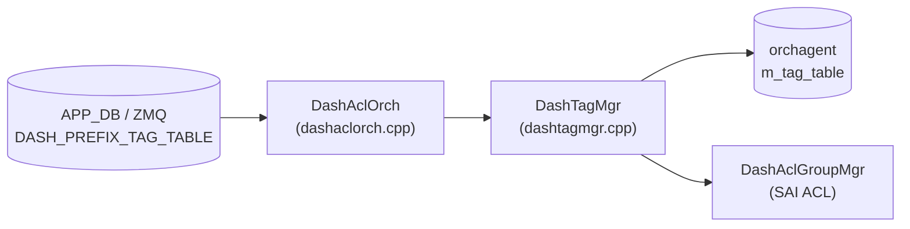

# DASH_PREFIX_TAG_TABLE テーブル

## 概要

DASH ACL で使用される IP プレフィックスタグ (Named Prefix Set) を保持するテーブル[^1]。タグ名をキーとし、IP バージョンとプレフィックスリストを定義する。ACL ルールの `src_tag` / `dst_tag` フィールドからタグ名で参照され、コントロールプレーンが「名前付きアドレス集合」を管理するためのオブジェクト。

`DashAclOrch` (`sonic-swss/orchagent/dash/dashaclorch.cpp`) が `PbWorker<PrefixTag>` 経由で protobuf を受信し、`taskUpdateDashPrefixTag` → `DashTagMgr::create/update` の順に処理する。タグは SAI には書き込まれず、orchagent 内メモリ (`m_tag_table`) に保持される。ACL group にタグが紐付く際、`DashTagMgr::getPrefixes()` で prefix 集合を取得して SAI ACL エントリに展開する。

<!-- cdb-mermaid -->
### データフロー (自動生成)



!!! note "凡例"
    タグは orchagent 内メモリにのみ保持される。SAI への直接書き込みは行わない。ACL rule バインド時に getPrefixes() で展開して SAI ACL エントリに渡す。
<!-- /cdb-mermaid -->

## key 構造

```text
DASH_PREFIX_TAG_TABLE:<tag_name>
```

`<tag_name>` はコントローラが付与する任意の文字列識別子 (例: `AclTagScale1798`)。

## フィールド

| フィールド | 型 | 必須 | デフォルト | 説明 |
|-----------|----|----|-----------|------|
| `pb` | bytes (Protobuf `PrefixTag`) | 必須 | — | シリアライズ済み protobuf。`ip_version` と `prefix_list` を含む |
| `ip_version` | enum `IP_VERSION_IPV4` / `IP_VERSION_IPV6` | 必須 | — (proto3 デフォルト `0` は拒否) | タグの IP バージョン。作成後の変更不可 |
| `prefix_list` | repeated `IpPrefix` (ip + mask) | 任意 | 空リスト | タグが表すプレフィックス集合。空リストでも登録可 |

> **注**: フィールドは protobuf `PrefixTag` メッセージ内に格納され、APP_DB 上は `pb` キーのバイナリ値として書かれる。`ip_version` / `prefix_list` は protobuf フィールド名として記載する。

## 制約

- `ip_version` が proto3 デフォルト値 (`0 = IP_VERSION_UNSPECIFIED`) または未対応値の場合、`to_sai()` が `false` を返し `task_failed` → エントリ全体が拒否される
- 作成後に `ip_version` を変更しようとすると `SWSS_LOG_WARN` + `task_failed` (イミュータブル)
- `prefix_list` の更新はフルリプレース (新リストで上書き)
- タグが ACL rule から参照中 (`m_groups` が空でない) の場合、`remove` は `task_need_retry` となる
- 未存在タグの `remove` は idempotent (`task_success`、警告ログのみ)

## 購読者

- `DashAclOrch` (`sonic-swss/orchagent/dash/dashaclorch.cpp`): `PbWorker<PrefixTag>` としてタグを受信し、`DashTagMgr` に委譲してメモリ管理を行う
- `DashTagMgr` (`sonic-swss/orchagent/dash/dashtagmgr.cpp`): タグの CRUD を管理し、ACL group からの `attach`/`detach` をハンドル

## 関連 CONFIG_DB

- [`DASH_ACL_IN_TABLE`](dash-acl.md) / [`DASH_ACL_OUT_TABLE`](dash-acl.md): ACL rule の `src_tag` / `dst_tag` フィールドがこのテーブルのタグ名を参照する
- [`DASH_ENI_TABLE`](dash-eni.md): ENI への ACL グループバインドの起点

<!-- ordering -->
## エントリ投入順序・依存関係 (Phase B)

`DASH_PREFIX_TAG_TABLE` は DASH ACL 依存チェーンの **最上流** に位置する。SDN コントローラはタグを ACL ルールより先に投入しなければならない。

### 投入の必須順序

```
[1] DASH_PREFIX_TAG_TABLE          ← このテーブル（タグ登録が起点）
         ↓  src_tag / dst_tag でタグ名を参照する ACL rule より先に必要
[2] DASH_ACL_GROUP_TABLE
         ↓
[3] DASH_ACL_RULE_TABLE
         ↓
[4] DASH_ACL_IN_TABLE / DASH_ACL_OUT_TABLE  ← ENI へのバインド
```

コード根拠: `dashaclgroupmgr.cpp` L395–407 — `createRule()` 内で `src_tag` / `dst_tag` ごとに `getDashAclTagMgr().exists(tag_id)` を呼び出し、タグが `m_tag_table` に存在しない場合 `task_need_retry` を返す。

### 依存違反時の挙動

| 違反パターン | 戻り値 | 自動回復 |
|---|---|---|
| タグ未登録状態で ACL rule を投入 | `task_need_retry` | タグ登録後に自動解消 |
| 同一タグ ID で重複 create | `task_failed` | 自動回復なし |
| 未存在タグへの update | `task_failed` | 自動回復なし（先に create が必要）|
| グループ参照中のタグ削除 | `task_need_retry` | グループ detach 後に自動解消 |

`task_need_retry` のエントリはキューに残り次回ループで自動再試行されるが、`task_failed` は破棄されるため SDN コントローラ側での正しい投入順序が必要。

### 削除の逆順制約

```
[1] DASH_ACL_IN/OUT_TABLE — DEL（バインド解除）
         ↓
[2] DASH_ACL_RULE_TABLE — DEL
         ↓
[3] DASH_ACL_GROUP_TABLE — DEL（バインド中は task_need_retry）
         ↓
[4] DASH_PREFIX_TAG_TABLE — DEL（m_groups 非空なら task_need_retry）
```

### タグ更新時の非リフレッシュ動作

`DashTagMgr::update()` (`dashtagmgr.cpp:46`) はメモリ上の `m_prefixes` を更新するだけで、既にバインド済みのグループ・ルールへの SAI 再 SET を行わない。タグの `prefix_list` を更新しても実行中 ACL ルールは旧プレフィックスで評価され続ける。新プレフィックスを即時反映するには、グループ解除 → ルール削除 → ルール再作成 → 再バインドの手順が必要。

### warm-reboot 挙動

`DashAclOrch` は `ZmqOrch` を継承し `m_orchList` には登録されない（`gDirectory.set()` のみ）。`warmRestoreAndSyncUp()` の 3 イテレーションループは DASH ACL orch を含まないため、**タグエントリを含む DASH ACL 系は warm-reboot の自動リプレイ対象外**となる。リストアは SDN コントローラが gNMI 経由で全エントリを再投入する設計（ステートレス warm-reboot）。

- 中間トレース: `meta/_intermediate/cdb-flow/dash-prefix-tag-ordering.md`
<!-- /ordering -->

<!-- cdb-exceptions -->
## 例外条件・特殊挙動

| 条件 | 挙動 |
|------|------|
| `ip_version` が `0` (proto3 デフォルト) | `to_sai()` が `false` → `task_failed`、エントリ拒否 |
| `ip_version` を更新しようとした場合 | `SWSS_LOG_WARN` + `task_failed` (変更禁止) |
| `prefix_list` が空 | 登録成功、空の prefix セット (ACL マッチには使えない) |
| 参照中タグの `remove` | `task_need_retry` (m_groups が非空) |
| 未存在タグの `remove` | `task_success` (idempotent、警告ログのみ) |
<!-- /cdb-exceptions -->

<!-- cross-refs -->
## 暗黙参照テーブル (Phase C)

YANG 未定義テーブルのため leafref は存在しない。以下はすべて実装レベルの暗黙参照。`DASH_PREFIX_TAG_TABLE` 自体は他テーブルを参照しないが、ACL 系テーブルから参照される側として双方向依存がある。

| 参照先テーブル / リソース | 参照方向 | 条件 | 参照元 evidence |
|--------------------------|---------|------|----------------|
| `DASH_ACL_RULE_TABLE` の `src_tag` / `dst_tag` フィールド (参照される側) | 存在確認 + prefix 展開 | ACL rule 作成時に `src_tag` / `dst_tag` にタグ名が指定されたとき。タグ不在なら rule が `task_need_retry` で待機; タグ存在時は `getPrefixes()` で SAI ACL エントリに展開 | `dashaclgroupmgr.cpp` L393–409 (存在確認), L316–327 (`getPrefixes()` 呼び出し) |
| `DASH_ACL_GROUP_TABLE` (group_id ベースの refcount 追跡) | 逆参照 (参照される側) | ACL rule が group にバインドされるとき `attachTags()` → `DashTagMgr::attach(tag_id, group_id)` で `m_groups` に group_id を追加。rule 削除時は `detachTags()` → `detach()` で削除 | `dashaclgroupmgr.cpp` L558–575, `dashtagmgr.cpp` L112–137 |

!!! note "削除ガードの仕組み"
    タグが `m_groups` に 1 件以上の group_id を保持している間（= ACL rule から参照中）、`DashTagMgr::remove()` は `task_need_retry` を返す。参照先の全 ACL rule が削除されて `m_groups` が空になると DEL が成功する（`dashtagmgr.cpp` L84–88）。

!!! note "タグ先行作成が必要なケース"
    ACL rule が `src_tag` / `dst_tag` を指定して先に届いた場合でも、対応タグが `m_tag_table` に存在しなければ rule は `task_need_retry` で保留される。タグを先に作成するか、コントローラが順序を保証する必要がある（`dashaclgroupmgr.cpp` L393–409）。

<!-- /cross-refs -->

<!-- failure -->
## 失敗挙動・retry / recovery (Phase D)

<!-- evidence: meta/_intermediate/cdb-flow/dash-prefix-tag-failure.md -->

### retry パターン概要

`DASH_PREFIX_TAG_TABLE` のタスク処理は `DashAclOrch::taskUpdateDashPrefixTag` / `taskRemoveDashPrefixTag` で行われ、`task_process_status` を返す。

| パターン | 代表的なトリガー | 挙動 |
|---|---|---|
| **`task_need_retry`** | ACL rule から参照中のタグへの DEL（`m_groups` 非空） | `m_toSync` に残し次 `doTask()` で自動再試行。上限なし |
| **`task_failed`** | `from_pb()` 失敗・`ip_version` 変更試行・存在しないタグへの UPDATE | エントリ破棄。自動回復なし |
| **`task_success`** | 正常 create/update・存在しないタグへの DEL（冪等） | エントリ削除 |

### SET 処理における失敗詳細

#### protobuf デシリアライズ失敗（`from_pb()` false）

`from_pb(data, tag)` が `false` を返すと `taskUpdateDashPrefixTag` は即 `task_failed`。`m_tag_table` への書き込みは行われない。(`dashaclorch.cpp:291-294`)

失敗するケース:

1. `ip_version` が `0` (= `IP_VERSION_UNSPECIFIED` / proto3 デフォルト): `to_sai(data.ip_version(), tag.m_ip_version)` が `false` (`dashtagmgr.cpp:11-13`)
2. `ip_version` が `1 (IPV4)` / `2 (IPV6)` 以外の不正な enum 値: 同様に `to_sai()` が `false`
3. `prefix_list` 内のプレフィックスパース失敗: `to_sai(data.prefix_list(), tag.m_prefixes)` が `false` (`dashtagmgr.cpp:16-18`)

!!! warning "proto3 デフォルト値トラップ"
    コントローラが `ip_version` フィールドを省略すると proto3 デフォルト値 `0` が送信され、orchagent が無音で拒否する。フィールドを明示しない実装は全エントリが `task_failed` で破棄される。

#### `ip_version` の変更試行（update 時の不変制約）

既存タグへの SET で `ip_version` を変更しようとした場合: `SWSS_LOG_WARN "'ip_version' changing is not supported for tag %s"` → `task_failed`。`prefix_list` も更新されない。(`dashtagmgr.cpp:61-65`)

### DEL 処理における失敗詳細

#### ACL rule 参照中タグの削除（`m_groups` 非空）

タグが ACL rule から参照されている（`m_groups` が非空）場合: `SWSS_LOG_WARN "Prefix tag %s is still in use by ACL rule(s)"` → `task_need_retry`。全参照 ACL rule が削除されて `m_groups` が空になると次の `doTask()` ループで DEL が成功する。(`dashtagmgr.cpp:84-88`)

#### 存在しないタグへの DEL（冪等）

`m_tag_table` に存在しないタグへの DEL: `SWSS_LOG_WARN "Prefix tag %s does not exist"` → `task_success`。(`dashtagmgr.cpp:78-81`)

### 失敗後の状態整合性

- `task_failed` でエントリが破棄されると `DashAclOrch::doTask()` が WARN ログを出力し `erase(it)` でキューから除去する (`dashaclorch.cpp:146-153`)
- タグはオーケストレーターメモリにのみ存在し SAI への書き込みがないため、`task_failed` による部分的な ASIC 汚染は発生しない
- `task_need_retry` エントリはキューに残留し上限なく自動再試行される

- 中間トレース: `meta/_intermediate/cdb-flow/dash-prefix-tag-failure.md`
<!-- /failure -->

<!-- constants -->
## ハードコード定数 (Phase E)

`DASH_PREFIX_TAG_TABLE` 処理に関わる、YANG / CONFIG_DB スキーマで管理されないハードコード定数の一覧。

### テーブル名定数 (schema.h)

| 定数 | 値 | 用途 | ソース |
|------|----|------|--------|
| `APP_DASH_PREFIX_TAG_TABLE_NAME` | `"DASH_PREFIX_TAG_TABLE"` | `DashAclOrch` TaskMap でのテーブル名登録、`orchdaemon.cpp` Consumer 初期化 | `sonic-swss-common/common/schema.h:183` |

### IP バージョン Enum 値 (pbutils.cpp)

`to_sai(IpVersion, ...)` が受理する `dash::types::IpVersion` enum 値。proto3 では フィールド省略時に `0` が送られるが拒否される。

| enum 名 | 数値 | SAI 変換先 | ソース |
|--------|------|-----------|--------|
| `IP_VERSION_IPV4` | `1` | `SAI_IP_ADDR_FAMILY_IPV4` | `pbutils.cpp:13-15` |
| `IP_VERSION_IPV6` | `2` | `SAI_IP_ADDR_FAMILY_IPV6` | `pbutils.cpp:16-18` |
| `IP_VERSION_UNSPECIFIED` (proto3 デフォルト) | `0` | 拒否 (`return false` → `task_failed`) | `pbutils.cpp:19-21` |

### ACL Rule 展開時のフォールバック定数 (dashaclgroupmgr.cpp)

タグの展開時に `src_tag` / `dst_tag` 由来の prefix セットが空だった場合、`any_ip` ラムダ (L266) が group の ip_version から全アドレス (`0.0.0.0/0` または `::/0` 相当) を補完する。

| 定数 | 値 | 用途 | ソース |
|------|----|------|--------|
| `all_protocols` | `uint8_t` 0〜255 の全値 | ACL rule の `protocol` 未指定時の全プロトコルマッチ | `dashaclgroupmgr.cpp:28` |
| `all_ports` | `{0, 65535}` (uint16 全範囲) | ACL rule の `src_port` / `dst_port` 未指定時の全ポートマッチ | `dashaclgroupmgr.cpp:29` |

### ABORT_IF_NOT マクロ（防御的 assert）

`DashTagMgr::getPrefixes()` / `attach()` / `detach()` (`dashtagmgr.cpp:107, 117, 131`) は、タグが `m_tag_table` に存在しない場合に `ABORT_IF_NOT` で `runtime_error` をスローして **orchagent プロセスを停止**させる。`DashAclGroupMgr::createRule()` は `exists()` チェック後に `getPrefixes()` を呼ぶため通常は到達しないが、実装上のバグや状態不整合時はプロセスクラッシュの原因になる。

### スキーマ / YANG 管理済み（ハードコード定数なし）の項目

| 項目 | 管理方法 |
|------|---------|
| `ip_version` 許容値 | protobuf enum `IpVersion` (proto 定義) |
| `prefix_list` サイズ上限 | 実装上制限なし（SAI / ASIC 依存） |
| タグ名フォーマット | 任意文字列（制限なし） |
| refcount (`m_groups`) 上限 | 実装上制限なし |

詳細根拠は `meta/_intermediate/cdb-flow/dash-prefix-tag-constants.md` を参照。
<!-- /constants -->

<!-- side-effects -->
## 副次 DB 書込 (Phase F)

`DASH_PREFIX_TAG_TABLE` の SET / DEL に伴って `DashAclOrch` / `DashTagMgr` が副次的に書き込む DB エントリは **存在しない**。タグは orchagent 内の `m_tag_table` (`unordered_map<string, DashTag>`) にのみ保持される SAI 非経由オブジェクトであり、DB コネクタを保持しない。

| 副次 DB | 書込有無 | 根拠 |
|---|---|---|
| APPL_DB | なし | `DashTagMgr` 内に `swsscommon::Table` / `ProducerStateTable` の write 呼出が 0 件 (`dashtagmgr.cpp` 全行精読) |
| STATE_DB | なし | `DashAclOrch` コンストラクタは `app_state_db` 引数を受け取るが初期化リストで `DashTagMgr` へは渡されない (`dashaclorch.cpp:77-85`) |
| COUNTERS_DB | なし | DASH タグは SAI オブジェクト非作成。カウンタテーブルのエントリも存在しない |
| ASIC_DB (via CRM) | なし | `gCrmOrch->incCrmDashAclUsedCounter()` は ACL group / rule 作成時のみ発生 (`dashaclgroupmgr.cpp:175-176, 374-376`)。タグ SET/DEL では CRM 更新なし |
| FLEX_COUNTER_DB | なし | DASH タグに対応する flex-counter エントリなし |

詳細スキャン手順と grep 結果は `meta/_intermediate/cdb-flow/dash-prefix-tag-side.md` を参照。
<!-- /side-effects -->

<!-- defaults -->
## フィールド暗黙デフォルト (Phase A — コード由来)

YANG / proto3 デフォルト以外の実装由来 fallback。`DashTagMgr::from_pb()` と `to_sai()` (dashtagmgr.cpp / pbutils.cpp) から導出。

| フィールド | コード由来デフォルト | fallback 源 |
|-----------|-------------------|------------|
| `ip_version` | **なし (実質必須)** — proto3 デフォルト `0` は拒否 | `to_sai(IpVersion)` が `IP_VERSION_IPV4 (1)` / `IP_VERSION_IPV6 (2)` のみ受理 — pbutils.cpp:9-24; `0` → `false` → `task_failed` — dashtagmgr.cpp:11-14 |
| `prefix_list` | 空リスト (登録は成功) | `to_sai(RepeatedPtrField<IpPrefix>)` は空入力に対し即 `true` を返す — pbutils.cpp:74-93 |

### 補足

- `ip_version` は proto3 の数値 enum `0` (= `IP_VERSION_UNSPECIFIED`) をコントローラが送ると orchagent が reject する。**コントローラは必ず `IP_VERSION_IPV4 (1)` または `IP_VERSION_IPV6 (2)` を明示しなければならない**。これは proto3 の「フィールド省略 = デフォルト値 0 を使う」という挙動と組み合わさると、省略した場合にエントリが無音で拒否されるというトラップになる。
- `prefix_list` を空で作成した後に ACL rule からタグ参照が先行するケースでは、rule 評価時に空の prefix 集合が渡されるため、実質的にマッチしないルールになる。SAI 実装によっては空集合の扱いが異なる可能性があり注意が必要。
- タグは orchagent 内メモリにのみ存在し、SAI オブジェクトは作成されない。ASIC_DB には直接エントリを持たない。

<!-- /defaults -->

<!-- entry-points -->
## 書き込み入り口 (Direction A)

対象テーブル: `DASH_PREFIX_TAG_TABLE`

### ZMQ / Protobuf (コントローラ経由)

- DASH コントローラ (external) が ZMQ 経由で `dash::tag::PrefixTag` protobuf を送信
- `DashAclOrch` が `PbWorker<PrefixTag>` として受信し `taskUpdateDashPrefixTag` で処理

### CLI

- なし (DASH Prefix Tag は CLI 経由での設定を想定しない)

### REST / gNMI

- sonic-mgmt-common 経由の gNMI SetRequest で書き込み可能 (sonic-gnmi)

<!-- /entry-points -->

## 引用元

[^1]: `sonic-swss/orchagent/dash/dashtagmgr.cpp` — `from_pb`, `DashTagMgr::create/update/remove/attach/detach` 実装。<https://github.com/sonic-net/sonic-swss/blob/4305596156d70e9797e8a881b3d19b46de0bce0d/orchagent/dash/dashtagmgr.cpp>
