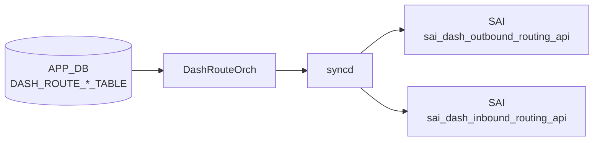

# DASH_ROUTE_* テーブル

## 概要

DASH (Disaggregated APIs for SONiC Hosts) データプレーンのルーティングポリシーを定義する 3 テーブル群。SDN コントローラ / gNMI 経由で APP_DB に書き込まれ、`DashRouteOrch` が protobuf デコードして DASH SAI API (Outbound / Inbound Routing) 経由で DPU ハードウェアに反映する。

- **`DASH_ROUTE_GROUP_TABLE`**: ルートグループ（ルートの集合単位）を作成。ENI からグループへのバインドは `DASH_ENI_ROUTE_TABLE` で管理される。
- **`DASH_ROUTE_TABLE`**: アウトバウンドルート。CA (Customer Address) プレフィックス単位で `routing_type` を指定し、VNet 転送・直接転送・ドロップ等を制御する。
- **`DASH_ROUTE_RULE_TABLE`**: インバウンドルート。VNI + SIP プレフィックス単位でデカプセル動作と PA 検証を指定する。

!!! warning "YANG 未定義"
    3 テーブルはすべて YANG モジュールで未定義。スキーマの正本は `sonic-swss/orchagent/dash/dashrouteorch.{h,cpp}`。

<!-- cdb-mermaid -->
### データフロー (自動生成)



!!! note "凡例"
    APP_DB から SAI までの典型経路。DASH テーブルは CONFIG_DB ではなく APP_DB に書かれる点に注意（SDN コントローラ / gNMI 経由で投入）。
<!-- /cdb-mermaid -->

## テーブル構造

### DASH_ROUTE_GROUP_TABLE

ルートグループを定義する。グループ自体に SAI 属性は持たず、存在（OID）を SAI に登録するだけ。

```text
DASH_ROUTE_GROUP_TABLE:<group_id>
```

| フィールド | 型 | 必須 | 説明 |
|----------|----|------|------|
| `version` | string | 省略可 | 管理用バージョン文字列。orchagent は参照しない（結果テーブルに書き戻すのみ） |

`addRouteGroup` は `create_outbound_routing_group` を呼び出す際に SAI 属性を 0 個渡す。`version` は `writeResultToDB` の第 3 引数として結果 DB に書き込まれる。

### DASH_ROUTE_TABLE

アウトバウンドルートを定義する（DASH_ROUTE_GROUP_TABLE のグループに属する CA プレフィックス単位のエントリ）。

```text
DASH_ROUTE_TABLE:<group_id>:<prefix>
```

| フィールド | 型 | 必須 | 説明 |
|----------|----|------|------|
| `routing_type` | enum | **必須** | `vnet`, `vnet_direct`, `direct`, `drop` のいずれか。`action_type` は同義の非推奨フィールド |
| `action_type` | enum | 非推奨 | `routing_type` が UNSPECIFIED の場合に自動コピーされる |
| `vnet` | string | 条件付き | `routing_type=vnet` または `vnet_direct` 時に必須。VNET 名（`DASH_VNET_TABLE` 参照）|
| `overlay_ip` | ip_address | 条件付き | `routing_type=vnet_direct` 時に必須。ルックアップ対象の overlay IP |
| `underlay_sip` | ip_address | 省略可 | アンダーレイ送信元 IP（`servicetunnel` / `privatelink` 用）|
| `metering_class_or` | uint32 | 省略可 | メータリングクラス OR ビット |
| `metering_class_and` | uint32 | 省略可 | メータリングクラス AND ビット |
| `tunnel` | string | 省略可 | `routing_type=direct` 時のネクストホップトンネル名（`DASH_TUNNEL_TABLE` 参照）|

!!! note "routing_type 互換処理"
    proto3 において `routing_type` が UNSPECIFIED (=0) のまま届いた場合、orchagent は非推奨の `action_type` フィールドをコピーして `routing_type` として扱う（後方互換）。

### DASH_ROUTE_RULE_TABLE

インバウンドルートを定義する（ENI 単位の VNI + SIP プレフィックス + 優先度 によるデカプセル制御）。

```text
DASH_ROUTE_RULE_TABLE:<eni>:<vni>:<prefix/tag>:<priority>
```

| フィールド | 型 | 必須 | 説明 |
|----------|----|------|------|
| `vnet` | string | 省略可 | マッピング先 VNET 名 |
| `pa_validation` | bool | 省略可 | PA 検証を行うか。`true` = `TUNNEL_DECAP_PA_VALIDATE`, `false` = `TUNNEL_DECAP`。省略時 = `false` |
| `metering_class_or` | uint32 | 省略可 | メータリングクラス OR ビット |
| `metering_class_and` | uint32 | 省略可 | メータリングクラス AND ビット |

`<priority>` フィールドがキー末尾に付く新形式を推奨。旧形式（priority なし）では `priority=0` にフォールバックする。

## 購読者

- `orchagent` `DashRouteOrch`: 3 テーブルを subscribe し、SAI Outbound/Inbound Routing API 経由で DPU に反映
- ルートグループは ENI とのバインド管理を内部カウンタ (`route_group_bind_count_`) で追跡

## 関連 CONFIG_DB / YANG / CLI

- 関連 APP_DB: `DASH_ENI_ROUTE_TABLE`（グループと ENI のバインド）、`DASH_VNET_TABLE`、`DASH_TUNNEL_TABLE`
- 関連 CLI: なし（SDN コントローラ / gNMI 経由投入が主体）
- 関連 YANG: なし

<!-- cdb-exceptions -->
## 例外条件・特殊挙動

| 条件 | 挙動 |
|------|------|
| `routing_type` が UNSPECIFIED かつ `action_type` も未指定 | orchagent が `ROUTING_TYPE_UNSPECIFIED` のまま SAI へ渡す → SAI 側でエラー |
| `routing_type=vnet` で `vnet` フィールドが空 | `addOutboundRouting` が `task_failed` を返す |
| `routing_type=vnet_direct` で `vnet` または `overlay_ip` が未設定 | `task_failed` |
| `routing_type=direct` で `tunnel` が存在しない | retry (`task_need_retry`) — トンネル作成後に自動再試行 |
| ルートグループが未作成の状態でルート追加 | `task_need_retry` — グループ作成後に自動再試行 |
| ルートグループがバインド中にルート追加 / 削除 | `task_failed` + WARN ログ（バインド解除後に再試行が必要）|
| バインド中のルートグループ削除 | `task_failed` (`SAI_STATUS_OBJECT_IN_USE` → `false` 返却） |
| `priority` フィールドがキーに含まれない旧形式 | `priority=0` にフォールバック（コード内コメント明示） |
| `pa_validation` 省略 | proto3 ゼロ値 = `false` → `SAI_INBOUND_ROUTING_ENTRY_ACTION_TUNNEL_DECAP` |

<!-- /cdb-exceptions -->

<!-- defaults -->
## コード由来の暗黙デフォルト (Phase A)

YANG 未定義テーブルのため、全デフォルトはコード実装が正本。

### field × 種別 一覧

| フィールド / 属性 | テーブル | 種別 | 暗黙デフォルト値 | ソース |
|---|---|---|---|---|
| `routing_type` | `DASH_ROUTE_TABLE` | なし（必須） | 省略時 = UNSPECIFIED → SAI エラー | `dashrouteorch.cpp:103-108` |
| `action_type` → `routing_type` | `DASH_ROUTE_TABLE` | C++ fallback | `routing_type=UNSPECIFIED` のとき `action_type` をコピー（後方互換） | `dashrouteorch.cpp:326-333` |
| `vnet` | `DASH_ROUTE_TABLE` | 条件付き必須 | `routing_type=vnet/vnet_direct` 時は必須。省略時 = `task_failed` | `dashrouteorch.cpp:78-93` |
| `overlay_ip` | `DASH_ROUTE_TABLE` | 条件付き必須 | `routing_type=vnet_direct` 時は必須。省略時 = `task_failed` | `dashrouteorch.cpp:126-141` |
| `underlay_sip` | `DASH_ROUTE_TABLE` | C++ 条件分岐 | 省略時 = SAI 属性を設定しない（SAI 側デフォルト適用）| `dashrouteorch.cpp:149-157` |
| `metering_class_or` | `DASH_ROUTE_TABLE` | protobuf has_ guard | 省略時 = SAI 属性を設定しない | `dashrouteorch.cpp:159-163` |
| `metering_class_and` | `DASH_ROUTE_TABLE` | protobuf has_ guard | 省略時 = SAI 属性を設定しない | `dashrouteorch.cpp:165-169` |
| `tunnel` | `DASH_ROUTE_TABLE` | protobuf has_ guard | 省略時 = SAI 属性を設定しない | `dashrouteorch.cpp:171-183` |
| `pa_validation` | `DASH_ROUTE_RULE_TABLE` | protobuf ゼロ値 | 省略時 = `false` → `SAI_INBOUND_ROUTING_ENTRY_ACTION_TUNNEL_DECAP` | `dashrouteorch.cpp:450` |
| `metering_class_or` | `DASH_ROUTE_RULE_TABLE` | protobuf has_ guard | 省略時 = SAI 属性を設定しない | `dashrouteorch.cpp:460-464` |
| `metering_class_and` | `DASH_ROUTE_RULE_TABLE` | protobuf has_ guard | 省略時 = SAI 属性を設定しない | `dashrouteorch.cpp:466-470` |
| `priority` (キー) | `DASH_ROUTE_RULE_TABLE` | C++ fallback | キーに priority がない旧形式 = `priority=0`（最高優先度）| `dashrouteorch.cpp:605-622` |
| `version` | `DASH_ROUTE_GROUP_TABLE` | C++ fallback | 省略時 = 空文字列。結果テーブルへの書き戻しにのみ使用 | `dashrouteorch.cpp:874` |

### `pa_validation` による SAI アクション分岐

```cpp
// dashrouteorch.cpp:450
inbound_routing_attr.value.u32 =
    ctxt.metadata.pa_validation()
        ? SAI_INBOUND_ROUTING_ENTRY_ACTION_TUNNEL_DECAP_PA_VALIDATE
        : SAI_INBOUND_ROUTING_ENTRY_ACTION_TUNNEL_DECAP;
```

`pa_validation` を省略すると proto3 ゼロ値 `false` が使われ、PA 検証なしのデカプセルが適用される。

### `routing_type` による SAI アクションマッピング (アウトバウンド)

| `routing_type` | SAI アクション |
|----------------|---------------|
| `vnet` | `SAI_OUTBOUND_ROUTING_ENTRY_ACTION_ROUTE_VNET` |
| `vnet_direct` | `SAI_OUTBOUND_ROUTING_ENTRY_ACTION_ROUTE_VNET_DIRECT` |
| `direct` | `SAI_OUTBOUND_ROUTING_ENTRY_ACTION_ROUTE_DIRECT` |
| `drop` | `SAI_OUTBOUND_ROUTING_ENTRY_ACTION_DROP` |
| `servicetunnel` / `appliance` / その他 | `sOutboundAction` に未登録 → `task_failed` |

`servicetunnel` / `privatelink` / `appliance` 等の HLD 記載 `routing_type` は orchagent の `sOutboundAction` マップに含まれず、現行実装では `task_failed` となる点に注意。

### ルートグループ SAI 属性ゼロ個渡し

```cpp
// dashrouteorch.cpp:734
sai_status_t status = sai_dash_outbound_routing_api->create_outbound_routing_group(
    &route_group_oid, gSwitchId, 0, NULL);  // 属性なし
```

`DASH_ROUTE_GROUP_TABLE` の `version` フィールドは orchagent 内部では一切参照されず、SAI にも渡されない。

- 中間トレース: `meta/_intermediate/cdb-flow/dash-routing-table-defaults.md`
<!-- /defaults -->

<!-- ordering -->
## 書込み順依存・タイミング依存 (Phase B)

`DashRouteOrch` (`dashrouteorch.cpp`) は依存オブジェクトが未作成の場合に `return false` でリトライキューに戻す設計になっている。以下の依存関係に従ってエントリを投入すること。

### 1. DASH_ROUTE_GROUP_TABLE が DASH_ROUTE_TABLE より先行必須

`addOutboundRouting()` は最初に `getRouteGroupOid(route_group)` を呼び出し、`SAI_NULL_OBJECT_ID` が返ると自動リトライとなる。`DASH_ROUTE_GROUP_TABLE|<group_id>` の SAI 作成完了前に `DASH_ROUTE_TABLE` エントリを投入するとキューに残留し続ける。

> コード根拠: `dashrouteorch.cpp:70–74`

### 2. DASH_ENI_TABLE が DASH_ROUTE_RULE_TABLE より先行必須

`addInboundRouting()` は `dash_orch_->getEni(eni)` が nullptr を返すと自動リトライ。`DASH_ENI_TABLE|<eni>` の SAI 作成完了後に `DASH_ROUTE_RULE_TABLE` を投入すること。

> コード根拠: `dashrouteorch.cpp:425–428`

### 3. DASH_VNET_TABLE が DASH_ROUTE_TABLE / DASH_ROUTE_RULE_TABLE より先行必須

`routing_type=vnet` / `vnet_direct` のアウトバウンドルート、および `vnet` フィールドを持つインバウンドルールは `gVnetNameToId` にエントリが存在しないと自動リトライ。`DashVnetOrch` が `DASH_VNET_TABLE` 処理時に同マップへ登録する。

> コード根拠: `dashrouteorch.cpp:78–92`（Outbound）、`dashrouteorch.cpp:429–433`（Inbound）

### 4. DASH_TUNNEL_TABLE が DASH_ROUTE_TABLE (tunnel フィールド付き) より先行必須

`routing_type=direct` でトンネル転送を使う場合、`getTunnelOid(tunnel)` が `SAI_NULL_OBJECT_ID` を返すと自動リトライ。対応する `DASH_TUNNEL_TABLE` エントリを先に作成すること。

> コード根拠: `dashrouteorch.cpp:173–178`

### 5. ルートグループが ENI にバインド中は変更・削除が不可（自動リトライなし）

`isRouteGroupBound()` が true のとき `addOutboundRouting()` / `removeOutboundRouting()` / `removeRouteGroup()` はいずれも `SWSS_LOG_WARN` を出力して `return false` を返す。このケースは自動リトライではなくエラー扱いのため、`DASH_ENI_ROUTE_TABLE` DEL でバインドを解除してから操作すること。

> コード根拠: `dashrouteorch.cpp:65–68, 231–236, 751–758`

### 推奨 SET 順序

```
DASH_ROUTE_GROUP_TABLE|<group_id>              # グループ先行作成
DASH_ROUTE_TABLE|<group_id>:<prefix>           # アウトバウンドルート（VNET / TUNNEL 登録後）
DASH_ROUTE_RULE_TABLE|<eni>:<vni>:<pfx>:<prio> # インバウンドルール（ENI / VNET 登録後）
```

### 推奨 DEL 順序

```
DEL DASH_ENI_ROUTE_TABLE|<eni>                    # ENI バインド解除（先行）
DEL DASH_ROUTE_TABLE|<group>:<prefix>             # バインド解除後にルート削除
DEL DASH_ROUTE_GROUP_TABLE|<group_id>             # ルート全削除後にグループ削除
DEL DASH_ROUTE_RULE_TABLE|<eni>:<vni>:<pfx>:<prio>
```

### 順序依存サマリ

| # | 先行テーブル / 操作 | 後続テーブル / 操作 | 緩和策 |
|---|-------------------|-------------------|--------|
| 1 | `DASH_ROUTE_GROUP_TABLE` SAI 完了 | `DASH_ROUTE_TABLE` SET | OID null → 自動リトライ |
| 2 | `DASH_ENI_TABLE` SAI 完了 | `DASH_ROUTE_RULE_TABLE` SET | ENI null → 自動リトライ |
| 3 | `DASH_VNET_TABLE` SAI 完了 | `DASH_ROUTE_TABLE` / `DASH_ROUTE_RULE_TABLE` (vnet) SET | `gVnetNameToId` miss → 自動リトライ |
| 4 | `DASH_TUNNEL_TABLE` SAI 完了 | `DASH_ROUTE_TABLE` (tunnel) SET | OID null → 自動リトライ |
| 5 | `DASH_ENI_ROUTE_TABLE` DEL | ルートグループ内の ROUTE 変更・削除 | バインド中は WARN のみ・自動リトライなし |
| 6 | `DASH_ROUTE_TABLE` 全削除 | `DASH_ROUTE_GROUP_TABLE` DEL | バインドカウントで管理 |

- 中間トレース: `meta/_intermediate/cdb-flow/dash-routing-table-ordering.md`
<!-- /ordering -->
