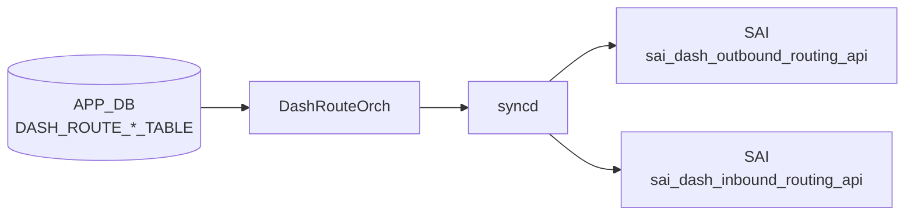

# DASH_ROUTE_* テーブル

## 概要

[DASH](../../reference/glossary.md#term-dash) (Disaggregated APIs for [SONiC](../../reference/glossary.md#term-sonic) Hosts) データプレーンのルーティングポリシーを定義する 3 テーブル群。SDN コントローラ / [gNMI](../../reference/glossary.md#term-gnmi) 経由で APP_DB に書き込まれ、`DashRouteOrch` が protobuf デコードして [DASH](../../reference/glossary.md#term-dash) [SAI](../../reference/glossary.md#term-sai) API (Outbound / Inbound Routing) 経由で [DPU](../../reference/glossary.md#term-dpu) ハードウェアに反映する。

- **`DASH_ROUTE_GROUP_TABLE`**: ルートグループ（ルートの集合単位）を作成。[ENI](../../reference/glossary.md#term-eni) からグループへのバインドは `DASH_ENI_ROUTE_TABLE` で管理される。
- **`DASH_ROUTE_TABLE`**: アウトバウンドルート。CA (Customer Address) プレフィックス単位で `routing_type` を指定し、VNet 転送・直接転送・ドロップ等を制御する。
- **`DASH_ROUTE_RULE_TABLE`**: インバウンドルート。VNI + SIP プレフィックス単位でデカプセル動作と PA 検証を指定する。

!!! warning "YANG 未定義"
    3 テーブルはすべて YANG モジュールで未定義。スキーマの正本は `sonic-swss/orchagent/dash/dashrouteorch.{h,cpp}`。

<!-- cdb-mermaid -->
### データフロー (自動生成)



!!! note "凡例"
    APP_DB から SAI までの典型経路。DASH テーブルは CONFIG_DB ではなく APP_DB に書かれる点に注意（SDN コントローラ / gNMI 経由で投入）。
<!-- /cdb-mermaid -->

## テーブル構造

### DASH_ROUTE_GROUP_TABLE

ルートグループを定義する。グループ自体に [SAI](../../reference/glossary.md#term-sai) 属性は持たず、存在（OID）を [SAI](../../reference/glossary.md#term-sai) に登録するだけ。

```text
DASH_ROUTE_GROUP_TABLE:<group_id>
```

| フィールド | 型 | 必須 | 説明 |
|----------|----|------|------|
| `version` | string | 省略可 | 管理用バージョン文字列。[orchagent](../../reference/glossary.md#term-orchagent) は参照しない（結果テーブルに書き戻すのみ） |

`addRouteGroup` は `create_outbound_routing_group` を呼び出す際に SAI 属性を 0 個渡す。`version` は `writeResultToDB` の第 3 引数として結果 DB に書き込まれる。

### DASH_ROUTE_TABLE

アウトバウンドルートを定義する（DASH_ROUTE_GROUP_TABLE のグループに属する CA プレフィックス単位のエントリ）。

```text
DASH_ROUTE_TABLE:<group_id>:<prefix>
```

| フィールド | 型 | 必須 | 説明 |
|----------|----|------|------|
| `routing_type` | enum | **必須** | `vnet`, `vnet_direct`, `direct`, `drop` のいずれか。`action_type` は同義の非推奨フィールド |
| `action_type` | enum | 非推奨 | `routing_type` が UNSPECIFIED の場合に自動コピーされる |
| `vnet` | string | 条件付き | `routing_type=vnet` または `vnet_direct` 時に必須。[VNET](../../reference/glossary.md#term-vnet) 名（`DASH_VNET_TABLE` 参照）|
| `overlay_ip` | ip_address | 条件付き | `routing_type=vnet_direct` 時に必須。ルックアップ対象の overlay IP |
| `underlay_sip` | ip_address | 省略可 | アンダーレイ送信元 IP（`servicetunnel` / `privatelink` 用）|
| `metering_class_or` | uint32 | 省略可 | メータリングクラス OR ビット |
| `metering_class_and` | uint32 | 省略可 | メータリングクラス AND ビット |
| `tunnel` | string | 省略可 | `routing_type=direct` 時のネクストホップトンネル名（`DASH_TUNNEL_TABLE` 参照）|

!!! note "routing_type 互換処理"
    proto3 において `routing_type` が UNSPECIFIED (=0) のまま届いた場合、orchagent は非推奨の `action_type` フィールドをコピーして `routing_type` として扱う（後方互換）。

### DASH_ROUTE_RULE_TABLE

インバウンドルートを定義する（[ENI](../../reference/glossary.md#term-eni) 単位の VNI + SIP プレフィックス + 優先度 によるデカプセル制御）。

```text
DASH_ROUTE_RULE_TABLE:<eni>:<vni>:<prefix/tag>:<priority>
```

| フィールド | 型 | 必須 | 説明 |
|----------|----|------|------|
| `vnet` | string | 省略可 | マッピング先 [VNET](../../reference/glossary.md#term-vnet) 名 |
| `pa_validation` | bool | 省略可 | PA 検証を行うか。`true` = `TUNNEL_DECAP_PA_VALIDATE`, `false` = `TUNNEL_DECAP`。省略時 = `false` |
| `metering_class_or` | uint32 | 省略可 | メータリングクラス OR ビット |
| `metering_class_and` | uint32 | 省略可 | メータリングクラス AND ビット |

`<priority>` フィールドがキー末尾に付く新形式を推奨。旧形式（priority なし）では `priority=0` にフォールバックする。

## 購読者

- `orchagent` `DashRouteOrch`: 3 テーブルを subscribe し、SAI Outbound/Inbound Routing API 経由で [DPU](../../reference/glossary.md#term-dpu) に反映
- ルートグループは [ENI](../../reference/glossary.md#term-eni) とのバインド管理を内部カウンタ (`route_group_bind_count_`) で追跡

## 関連 APP_DB / YANG / CLI

- 関連 APP_DB: `DASH_ENI_ROUTE_TABLE`（グループと ENI のバインド）、`DASH_VNET_TABLE`、`DASH_TUNNEL_TABLE`
- 関連 CLI: なし（SDN コントローラ / [gNMI](../../reference/glossary.md#term-gnmi) 経由投入が主体）
- 関連 [YANG](../../reference/glossary.md#term-yang): なし

<!-- cdb-exceptions -->
## 例外条件・特殊挙動

| 条件 | 挙動 |
|------|------|
| `routing_type` が UNSPECIFIED かつ `action_type` も未指定 | [orchagent](../../reference/glossary.md#term-orchagent) が `ROUTING_TYPE_UNSPECIFIED` のまま SAI へ渡す → SAI 側でエラー |
| `routing_type=vnet` で `vnet` フィールドが空 | `addOutboundRouting` が `task_failed` を返す |
| `routing_type=vnet_direct` で `vnet` または `overlay_ip` が未設定 | `task_failed` |
| `routing_type=direct` で `tunnel` が存在しない | retry (`task_need_retry`) — トンネル作成後に自動再試行 |
| ルートグループが未作成の状態でルート追加 | `task_need_retry` — グループ作成後に自動再試行 |
| ルートグループがバインド中にルート追加 / 削除 | `task_failed` + WARN ログ（バインド解除後に再試行が必要）|
| バインド中のルートグループ削除 | `task_need_retry`（`SAI_STATUS_OBJECT_IN_USE` → `false` 返却 → ENI バインド解除まで永続再試行） |
| `priority` フィールドがキーに含まれない旧形式 | `priority=0` にフォールバック（コード内コメント明示） |
| `pa_validation` 省略 | proto3 ゼロ値 = `false` → `SAI_INBOUND_ROUTING_ENTRY_ACTION_TUNNEL_DECAP` |

<!-- /cdb-exceptions -->

<!-- defaults -->
## コード由来の暗黙デフォルト

[YANG](../../reference/glossary.md#term-yang) 未定義テーブルのため、全デフォルトはコード実装が正本。

### field × 種別 一覧

| フィールド / 属性 | テーブル | 種別 | 暗黙デフォルト値 | ソース |
|---|---|---|---|---|
| `routing_type` | `DASH_ROUTE_TABLE` | なし（必須） | 省略時 = UNSPECIFIED → SAI エラー | `dashrouteorch.cpp:103-108` |
| `action_type` → `routing_type` | `DASH_ROUTE_TABLE` | C++ fallback | `routing_type=UNSPECIFIED` のとき `action_type` をコピー（後方互換） | `dashrouteorch.cpp:326-333` |
| `vnet` | `DASH_ROUTE_TABLE` | 条件付き必須 | `routing_type=vnet/vnet_direct` 時は必須。省略時 = `task_failed` | `dashrouteorch.cpp:78-93` |
| `overlay_ip` | `DASH_ROUTE_TABLE` | 条件付き必須 | `routing_type=vnet_direct` 時は必須。省略時 = `task_failed` | `dashrouteorch.cpp:126-141` |
| `underlay_sip` | `DASH_ROUTE_TABLE` | C++ 条件分岐 | 省略時 = SAI 属性を設定しない（SAI 側デフォルト適用）| `dashrouteorch.cpp:149-157` |
| `metering_class_or` | `DASH_ROUTE_TABLE` | protobuf has_ guard | 省略時 = SAI 属性を設定しない | `dashrouteorch.cpp:159-163` |
| `metering_class_and` | `DASH_ROUTE_TABLE` | protobuf has_ guard | 省略時 = SAI 属性を設定しない | `dashrouteorch.cpp:165-169` |
| `tunnel` | `DASH_ROUTE_TABLE` | protobuf has_ guard | 省略時 = SAI 属性を設定しない | `dashrouteorch.cpp:171-183` |
| `pa_validation` | `DASH_ROUTE_RULE_TABLE` | protobuf ゼロ値 | 省略時 = `false` → `SAI_INBOUND_ROUTING_ENTRY_ACTION_TUNNEL_DECAP` | `dashrouteorch.cpp:450` |
| `metering_class_or` | `DASH_ROUTE_RULE_TABLE` | protobuf has_ guard | 省略時 = SAI 属性を設定しない | `dashrouteorch.cpp:460-464` |
| `metering_class_and` | `DASH_ROUTE_RULE_TABLE` | protobuf has_ guard | 省略時 = SAI 属性を設定しない | `dashrouteorch.cpp:466-470` |
| `priority` (キー) | `DASH_ROUTE_RULE_TABLE` | C++ fallback | キーに priority がない旧形式 = `priority=0`（最高優先度）| `dashrouteorch.cpp:605-622` |
| `version` | `DASH_ROUTE_GROUP_TABLE` | C++ fallback | 省略時 = 空文字列。結果テーブルへの書き戻しにのみ使用 | `dashrouteorch.cpp:874` |

### `pa_validation` による SAI アクション分岐

```cpp
// dashrouteorch.cpp:450
inbound_routing_attr.value.u32 =
    ctxt.metadata.pa_validation()
        ? SAI_INBOUND_ROUTING_ENTRY_ACTION_TUNNEL_DECAP_PA_VALIDATE
        : SAI_INBOUND_ROUTING_ENTRY_ACTION_TUNNEL_DECAP;
```

`pa_validation` を省略すると proto3 ゼロ値 `false` が使われ、PA 検証なしのデカプセルが適用される。

### `routing_type` による SAI アクションマッピング (アウトバウンド)

| `routing_type` | SAI アクション |
|----------------|---------------|
| `vnet` | `SAI_OUTBOUND_ROUTING_ENTRY_ACTION_ROUTE_VNET` |
| `vnet_direct` | `SAI_OUTBOUND_ROUTING_ENTRY_ACTION_ROUTE_VNET_DIRECT` |
| `direct` | `SAI_OUTBOUND_ROUTING_ENTRY_ACTION_ROUTE_DIRECT` |
| `drop` | `SAI_OUTBOUND_ROUTING_ENTRY_ACTION_DROP` |
| `servicetunnel` / `appliance` / その他 | `sOutboundAction` に未登録 → `task_failed` |

`servicetunnel` / `privatelink` / `appliance` 等の [HLD](../../reference/glossary.md#term-hld) 記載 `routing_type` は [orchagent](../../reference/glossary.md#term-orchagent) の `sOutboundAction` マップに含まれず、現行実装では `task_failed` となる点に注意。

### ルートグループ SAI 属性ゼロ個渡し

```cpp
// dashrouteorch.cpp:734
sai_status_t status = sai_dash_outbound_routing_api->create_outbound_routing_group(
    &route_group_oid, gSwitchId, 0, NULL);  // 属性なし
```

`DASH_ROUTE_GROUP_TABLE` の `version` フィールドは orchagent 内部では一切参照されず、SAI にも渡されない。

<!-- /defaults -->

<!-- ordering -->
## 書込み順依存・タイミング依存

`DashRouteOrch` (`dashrouteorch.cpp`) は依存オブジェクトが未作成の場合に `return false` でリトライキューに戻す設計になっている。以下の依存関係に従ってエントリを投入すること。

### 1. DASH_ROUTE_GROUP_TABLE が DASH_ROUTE_TABLE より先行必須

`addOutboundRouting()` は最初に `getRouteGroupOid(route_group)` を呼び出し、`SAI_NULL_OBJECT_ID` が返ると自動リトライとなる。`DASH_ROUTE_GROUP_TABLE|<group_id>` の SAI 作成完了前に `DASH_ROUTE_TABLE` エントリを投入するとキューに残留し続ける。

> コード根拠: `dashrouteorch.cpp:70–74`

### 2. DASH_ENI_TABLE が DASH_ROUTE_RULE_TABLE より先行必須

`addInboundRouting()` は `dash_orch_->getEni(eni)` が nullptr を返すと自動リトライ。`DASH_ENI_TABLE|<eni>` の SAI 作成完了後に `DASH_ROUTE_RULE_TABLE` を投入すること。

> コード根拠: `dashrouteorch.cpp:425–428`

### 3. DASH_VNET_TABLE が DASH_ROUTE_TABLE / DASH_ROUTE_RULE_TABLE より先行必須

`routing_type=vnet` / `vnet_direct` のアウトバウンドルート、および `vnet` フィールドを持つインバウンドルールは `gVnetNameToId` にエントリが存在しないと自動リトライ。`DashVnetOrch` が `DASH_VNET_TABLE` 処理時に同マップへ登録する。

> コード根拠: `dashrouteorch.cpp:78–92`（Outbound）、`dashrouteorch.cpp:429–433`（Inbound）

### 4. DASH_TUNNEL_TABLE が DASH_ROUTE_TABLE (tunnel フィールド付き) より先行必須

`routing_type=direct` でトンネル転送を使う場合、`getTunnelOid(tunnel)` が `SAI_NULL_OBJECT_ID` を返すと自動リトライ。対応する `DASH_TUNNEL_TABLE` エントリを先に作成すること。

> コード根拠: `dashrouteorch.cpp:173–178`

### 5. ルートグループが ENI にバインド中は変更・削除が不可（自動リトライなし）

`isRouteGroupBound()` が true のとき `addOutboundRouting()` / `removeOutboundRouting()` / `removeRouteGroup()` はいずれも `SWSS_LOG_WARN` を出力して `return false` を返す。このケースは自動リトライではなくエラー扱いのため、`DASH_ENI_ROUTE_TABLE` DEL でバインドを解除してから操作すること。

> コード根拠: `dashrouteorch.cpp:65–68, 231–236, 751–758`

### 推奨 SET 順序

```
DASH_ROUTE_GROUP_TABLE|<group_id>              # グループ先行作成
DASH_ROUTE_TABLE|<group_id>:<prefix>           # アウトバウンドルート（VNET / TUNNEL 登録後）
DASH_ROUTE_RULE_TABLE|<eni>:<vni>:<pfx>:<prio> # インバウンドルール（ENI / VNET 登録後）
```

### 推奨 DEL 順序

```
DEL DASH_ENI_ROUTE_TABLE|<eni>                    # ENI バインド解除（先行）
DEL DASH_ROUTE_TABLE|<group>:<prefix>             # バインド解除後にルート削除
DEL DASH_ROUTE_GROUP_TABLE|<group_id>             # ルート全削除後にグループ削除
DEL DASH_ROUTE_RULE_TABLE|<eni>:<vni>:<pfx>:<prio>
```

### 順序依存サマリ

| # | 先行テーブル / 操作 | 後続テーブル / 操作 | 緩和策 |
|---|-------------------|-------------------|--------|
| 1 | `DASH_ROUTE_GROUP_TABLE` SAI 完了 | `DASH_ROUTE_TABLE` SET | OID null → 自動リトライ |
| 2 | `DASH_ENI_TABLE` SAI 完了 | `DASH_ROUTE_RULE_TABLE` SET | ENI null → 自動リトライ |
| 3 | `DASH_VNET_TABLE` SAI 完了 | `DASH_ROUTE_TABLE` / `DASH_ROUTE_RULE_TABLE` (vnet) SET | `gVnetNameToId` miss → 自動リトライ |
| 4 | `DASH_TUNNEL_TABLE` SAI 完了 | `DASH_ROUTE_TABLE` (tunnel) SET | OID null → 自動リトライ |
| 5 | `DASH_ENI_ROUTE_TABLE` DEL | ルートグループ内の ROUTE 変更・削除 | バインド中は WARN のみ・自動リトライなし |
| 6 | `DASH_ROUTE_TABLE` 全削除 | `DASH_ROUTE_GROUP_TABLE` DEL | バインドカウントで管理 |

<!-- /ordering -->

<!-- cross-refs -->
## 暗黙参照テーブル

`DashRouteOrch` はエントリ処理時に複数の外部テーブル / in-memory マップを暗黙的に参照する。[YANG](../../reference/glossary.md#term-yang) 定義がないため制約はコードのみで表現されている。

### DASH_ROUTE_TABLE (アウトバウンド LPM ルート)

| 参照元フィールド | 参照先テーブル | 参照方法 | 参照条件 | 参照箇所 |
|---|---|---|---|---|
| キー先頭 `<group_id>` | `DASH_ROUTE_GROUP_TABLE` | `route_group_oid_map_` 内 OID 解決 | 常時（`SAI_NULL_OBJECT_ID` → リトライ） | `dashrouteorch.cpp:70–74` |
| `vnet` フィールド | `DASH_VNET_TABLE` | `gVnetNameToId` グローバルマップ | `routing_type=vnet` かつ `has_vnet()` | `dashrouteorch.cpp:78–84` |
| `vnet_direct.vnet` | `DASH_VNET_TABLE` | `gVnetNameToId` グローバルマップ | `routing_type=vnet_direct` かつ `has_vnet_direct()` | `dashrouteorch.cpp:86–93` |
| `tunnel` フィールド | `DASH_TUNNEL_TABLE` | `DashTunnelOrch::getTunnelOid()` | `has_tunnel()` が true | `dashrouteorch.cpp:171–183` |

### DASH_ROUTE_RULE_TABLE (インバウンドルートルール)

| 参照元フィールド | 参照先テーブル | 参照方法 | 参照条件 | 参照箇所 |
|---|---|---|---|---|
| キー先頭 `<eni>` | `DASH_ENI_TABLE` | `DashOrch::getEni()` | 常時（nullptr → リトライ） | `dashrouteorch.cpp:425–428` |
| `vnet` フィールド | `DASH_VNET_TABLE` | `gVnetNameToId` グローバルマップ | `has_vnet()` が true | `dashrouteorch.cpp:430–433` |

### DASH_ROUTE_GROUP_TABLE (ルートグループ)

| 参照先 | 参照方向 | 内容 |
|---|---|---|
| `DASH_ENI_ROUTE_TABLE` | **被参照**（逆方向） | `DashEniFwdOrch` が `DASH_ENI_ROUTE_TABLE` SET 時に `bindRouteGroup()` を呼ぶ。DEL 時に `unbindRouteGroup()` を呼ぶ |
| `DASH_ROUTE_TABLE` | **被参照**（逆方向） | ルートは `route_group_oid_map_` を通じてグループ OID を取得する |

### CRM リソースカウンタ

| テーブル / 操作 | カウンタ | 参照箇所 |
|---|---|---|
| `DASH_ROUTE_TABLE` 追加成功 | `CRM_DASH_IPV4/IPV6_OUTBOUND_ROUTING` inc | `dashrouteorch.cpp:220` |
| `DASH_ROUTE_TABLE` 削除成功 | `CRM_DASH_IPV4/IPV6_OUTBOUND_ROUTING` dec | `dashrouteorch.cpp:262` |
| `DASH_ROUTE_RULE_TABLE` 追加成功 | `CRM_DASH_IPV4/IPV6_INBOUND_ROUTING` inc | `dashrouteorch.cpp:507` |
| `DASH_ROUTE_RULE_TABLE` 削除成功 | `CRM_DASH_IPV4/IPV6_INBOUND_ROUTING` dec | `dashrouteorch.cpp:546` |

`DASH_ROUTE_GROUP_TABLE` は [CRM](../../reference/glossary.md#term-crm) カウンタ未使用。

<!-- /cross-refs -->

<!-- failure -->
## 失敗挙動マトリクス

`DashRouteOrch` (`dashrouteorch.cpp`) の各テーブルハンドラにおける失敗分岐を網羅する。

### DASH_ROUTE_TABLE — SET 失敗パターン

| 失敗ケース | 発生箇所 | 挙動 | retry |
|---|---|---|---|
| protobuf パース失敗 | `doTaskRouteTable()` L320-324 | `erase(it)` 永続消費 | なし |
| ルートグループ未登録 | `addOutboundRouting()` L70-74 | `return false` → `it++` → 自動再試行 | グループ作成まで無制限 |
| ルートグループがバインド中（SET） | `addOutboundRouting()` L65-69 | `return true`（成功扱い erase）+ WARN。SAI 未登録のまま result DB に SUCCESS | なし（静かに無視） |
| [VNET](../../reference/glossary.md#term-vnet) 未登録（routing_type=vnet / vnet_direct） | `addOutboundRouting()` L78-93 | `return false` → `it++` → 自動再試行 | VNET 登録まで無制限 |
| routing_type が sOutboundAction マップ外 | `addOutboundRouting()` L103-108 | `return false` + WARN → 永続残留（解消不可） | 事実上無制限 |
| 必須属性欠落（vnet 空 / overlay_ip 欠落） | `addOutboundRouting()` L142-147 | `return false` + WARN → 永続残留 | 解消不可 |
| tunnel 未登録（has_tunnel() = true） | `addOutboundRouting()` L171-178 | `return false` → `it++` → 自動再試行 | トンネル作成まで無制限 |
| IP 変換失敗（`to_sai()` 失敗） | `addOutboundRouting()` L136-139, L152-156 | `return false` → 永続残留 | 解消不可 |
| SAI create 失敗（`ITEM_ALREADY_EXISTS`） | `addOutboundRoutingPost()` L206-209 | `return false` → bulker 再実行 | 無制限 |
| SAI create 失敗（その他） | `addOutboundRoutingPost()` L212-217 | `SWSS_LOG_ERROR` + `handleSaiCreateStatus()` | SAI API 依存 |

### DASH_ROUTE_TABLE — DEL 失敗パターン

| 失敗ケース | 発生箇所 | 挙動 | retry |
|---|---|---|---|
| ルートグループがバインド中（DEL） | `removeOutboundRouting()` L231-235 | `return false` + WARN → **永続再試行ループ** | ENI バインド解除まで無制限 |
| SAI remove 失敗（`NOT_EXECUTED`） | `removeOutboundRoutingPost()` L266-269 | `return false` → 自動再試行 | 無制限 |
| SAI remove 失敗（その他） | `removeOutboundRoutingPost()` L271-276 | `SWSS_LOG_ERROR` + `handleSaiRemoveStatus()` | SAI API 依存 |

### DASH_ROUTE_RULE_TABLE 失敗パターン

| 失敗ケース | 発生箇所 | 挙動 | retry |
|---|---|---|---|
| protobuf パース失敗 | `doTaskRouteRuleTable()` L631-635 | `erase(it)` 永続消費 | なし |
| ENI 未登録（`getEni()` = nullptr） | `addInboundRouting()` L425-429 | `return false` → 自動再試行 | ENI 作成まで無制限 |
| VNET 未登録（`gVnetNameToId` miss） | `addInboundRouting()` L430-434 | `return false` → 自動再試行 | VNET 登録まで無制限 |
| SAI create 失敗（`ITEM_ALREADY_EXISTS`） | `addInboundRoutingPost()` L493-496 | `return false` → bulker 再実行 | 無制限 |
| SAI create 失敗（その他） | `addInboundRoutingPost()` L499-504 | `SWSS_LOG_ERROR` + `handleSaiCreateStatus()` | SAI API 依存 |
| SAI remove 失敗（`NOT_EXECUTED`） | `removeInboundRoutingPost()` L550-553 | `return false` → 自動再試行 | 無制限 |
| SAI remove 失敗（その他） | `removeInboundRoutingPost()` L555-559 | `SWSS_LOG_ERROR` + `handleSaiRemoveStatus()` | SAI API 依存 |

### DASH_ROUTE_GROUP_TABLE 失敗パターン

| 失敗ケース | 発生箇所 | 挙動 | retry |
|---|---|---|---|
| protobuf パース失敗 | `doTaskRouteGroupTable()` L858-862 | `erase(it)` 永続消費 | なし |
| グループ既存（idempotent SET） | `addRouteGroup()` L727-731 | `return true` + WARN（再作成しない）| なし |
| SAI create 失敗 | `addRouteGroup()` L735-742 | `SWSS_LOG_ERROR` + result=FAILURE 書き込み | SAI API 依存 |
| バインド中グループ削除 | `removeRouteGroup()` L755-758 | `return false` + WARN → **永続再試行ループ** | ENI バインド解除まで無制限 |
| グループ既存せず（idempotent DEL） | `removeRouteGroup()` L762-766 | `return true`（idempotent）| なし |
| SAI remove 失敗（`OBJECT_IN_USE`） | `removeRouteGroup()` L772-774 | `return false` → 再試行ループ | SAI 側 in-use 解消まで無制限 |
| SAI remove 失敗（その他） | `removeRouteGroup()` L776-780 | `SWSS_LOG_ERROR` + `handleSaiRemoveStatus()` | SAI API 依存 |

### 非対称挙動の注意点

!!! warning "バインド中ルートグループへの SET は成功扱いで無視される"
    `addOutboundRouting()` はバインド中グループへのルート追加を `return true`（成功）で処理し、result DB にも `DASH_RESULT_SUCCESS` を書き込む。しかし SAI への登録は行われない。SDN コントローラ側からは成功に見えるが実態は未設定という乖離が生じる。

!!! warning "バインド中ルートグループからの DEL は永続ループ"
    `removeOutboundRouting()` はバインド中グループからのルート削除を `return false` で処理し永続再試行する。`DASH_ENI_ROUTE_TABLE` DEL でバインドを解除するまで orchagent の m_toSync に残留し続ける。

<!-- /failure -->

<!-- constants -->
## ハードコード定数

`DashRouteOrch` (`dashrouteorch.cpp`) および関連ヘッダ内のハードコード定数を網羅する。

### APP_DB テーブル名文字列定数 (`sonic-swss-common/common/schema.h`)

| 定数名 | 値 |
|---|---|
| `APP_DASH_ROUTE_TABLE_NAME` | `"DASH_ROUTE_TABLE"` (L186) |
| `APP_DASH_ROUTE_RULE_TABLE_NAME` | `"DASH_ROUTE_RULE_TABLE"` (L187) |
| `APP_DASH_ROUTE_GROUP_TABLE_NAME` | `"DASH_ROUTE_GROUP_TABLE"` (L190) |
| `APP_DASH_ENI_ROUTE_TABLE_NAME` | `"DASH_ENI_ROUTE_TABLE"` (L189) |

`doTask()` (L904-915) のテーブル名分岐と、コンストラクタ (L56-58) の結果テーブル初期化で使用される。

### 結果コード定数 (`dashorch.h:35-36`)

| 定数名 | 値 | 意味 |
|---|---|---|
| `DASH_RESULT_SUCCESS` | `0` | SET/DEL 操作成功 |
| `DASH_RESULT_FAILURE` | `1` | SAI API 失敗 |

`writeResultToDB()` (saihelper.cpp) が APP_DB 結果テーブルの `"result"` フィールドへ文字列化して書き込む (`L1138`)。`DASH_ROUTE_GROUP_TABLE` のみ `"version"` フィールドも追記する (`L1142-1143`)。

### `sOutboundAction` 静的マップ (`dashrouteorch.cpp:41-47`)

| protobuf RoutingType | SAI アクション定数 |
|---|---|
| `ROUTING_TYPE_VNET` | `SAI_OUTBOUND_ROUTING_ENTRY_ACTION_ROUTE_VNET` |
| `ROUTING_TYPE_VNET_DIRECT` | `SAI_OUTBOUND_ROUTING_ENTRY_ACTION_ROUTE_VNET_DIRECT` |
| `ROUTING_TYPE_DIRECT` | `SAI_OUTBOUND_ROUTING_ENTRY_ACTION_ROUTE_DIRECT` |
| `ROUTING_TYPE_DROP` | `SAI_OUTBOUND_ROUTING_ENTRY_ACTION_DROP` |

`ROUTING_TYPE_UNSPECIFIED` (proto3 ゼロ値) を含む上記 4 種類以外はマップに存在しないため `task_failed` となる。[HLD](../../reference/glossary.md#term-hld) 記載の `servicetunnel` / `privatelink` / `appliance` も現行実装では未登録。

### SAI 属性 ID 定数 — アウトバウンドルート

| SAI 属性 ID | 対応フィールド | 行 |
|---|---|---|
| `SAI_OUTBOUND_ROUTING_ENTRY_ATTR_ACTION` | `routing_type` (sOutboundAction 変換後) | `L110` |
| `SAI_OUTBOUND_ROUTING_ENTRY_ATTR_DST_VNET_ID` | `vnet` (vnet / vnet_direct 両方) | `L122`, `L131` |
| `SAI_OUTBOUND_ROUTING_ENTRY_ATTR_OVERLAY_IP` | `overlay_ip` (vnet_direct のみ) | `L135` |
| `SAI_OUTBOUND_ROUTING_ENTRY_ATTR_UNDERLAY_SIP` | `underlay_sip` (`has_underlay_sip()` guard) | `L151` |
| `SAI_OUTBOUND_ROUTING_ENTRY_ATTR_METER_CLASS_OR` | `metering_class_or` (`has_` guard) | `L160` |
| `SAI_OUTBOUND_ROUTING_ENTRY_ATTR_METER_CLASS_AND` | `metering_class_and` (`has_` guard) | `L166` |
| `SAI_OUTBOUND_ROUTING_ENTRY_ATTR_DASH_TUNNEL_ID` | `tunnel` (`has_tunnel()` guard) | `L180` |

### SAI 属性 ID 定数 — インバウンドルート

| SAI 属性 ID | 対応フィールド / 値 | 行 |
|---|---|---|
| `SAI_INBOUND_ROUTING_ENTRY_ATTR_ACTION` | `pa_validation` → `TUNNEL_DECAP_PA_VALIDATE` / `TUNNEL_DECAP` | `L449-450` |
| `SAI_INBOUND_ROUTING_ENTRY_ATTR_SRC_VNET_ID` | `vnet` (`has_vnet()` guard) | `L455` |
| `SAI_INBOUND_ROUTING_ENTRY_ATTR_METER_CLASS_OR` | `metering_class_or` (`has_` guard) | `L461` |
| `SAI_INBOUND_ROUTING_ENTRY_ATTR_METER_CLASS_AND` | `metering_class_and` (`has_` guard) | `L467` |

`pa_validation` による定数分岐:

```cpp
// dashrouteorch.cpp:449-450
inbound_routing_attr.id = SAI_INBOUND_ROUTING_ENTRY_ATTR_ACTION;
inbound_routing_attr.value.u32 =
    ctxt.metadata.pa_validation()
        ? SAI_INBOUND_ROUTING_ENTRY_ACTION_TUNNEL_DECAP_PA_VALIDATE
        : SAI_INBOUND_ROUTING_ENTRY_ACTION_TUNNEL_DECAP;
```

### SAI ステータス定数

| SAI ステータス | 使用箇所 | 挙動 |
|---|---|---|
| `SAI_STATUS_ITEM_ALREADY_EXISTS` | `addOutboundRoutingPost()` L206, `addInboundRoutingPost()` L493 | `return false` → bulker 再実行 |
| `SAI_STATUS_NOT_EXECUTED` | `removeOutboundRoutingPost()` L266, `removeInboundRoutingPost()` L550 | `return false` → bulker 再実行 |
| `SAI_STATUS_OBJECT_IN_USE` | `removeRouteGroup()` L772 | `return false` → グループ削除拒否ループ |

<!-- /constants -->

<!-- side-effects -->
## 操作の副作用

`DashRouteOrch` がエントリを処理した際に発生する外部への副作用を網羅する。

### 1. APP_STATE_DB 結果テーブルへの書き戻し

各テーブルの処理結果は APP_STATE_DB 上の同名テーブルへ `writeResultToDB` / `removeResultFromDB` で書き返される。SDN コントローラはこの結果テーブルを読んで操作の成否を確認できる。

| テーブル | 書き込みタイミング | フィールド | コード行 |
|---|---|---|---|
| `DASH_ROUTE_TABLE` | SET 成功（pre/post-op） | `result=0` | L342, L403 |
| `DASH_ROUTE_TABLE` | SET 失敗（post-op） | `result=1` | L401–403 |
| `DASH_ROUTE_TABLE` | DEL 成功 | エントリ削除 | L410 |
| `DASH_ROUTE_RULE_TABLE` | SET 成功（pre/post-op） | `result=0` | L644, L705 |
| `DASH_ROUTE_RULE_TABLE` | SET 失敗（post-op） | `result=1` | L702–705 |
| `DASH_ROUTE_RULE_TABLE` | DEL 成功 | エントリ削除 | L712 |
| `DASH_ROUTE_GROUP_TABLE` | SET 成功 / 失敗 | `result=0/1` + `version` | L874 |
| `DASH_ROUTE_GROUP_TABLE` | DEL 成功 | エントリ削除 | L881 |

!!! note "バインド中グループへの SET の特殊ケース"
    `addOutboundRouting()` がバインド中グループへのルート追加を `return true` で早期終了した場合も `result=DASH_RESULT_SUCCESS` が結果テーブルに書かれる。SAI への登録は行われていないにもかかわらず成功と報告される点に注意。

### 2. CRM カウンタ更新

SAI API の呼び出し成功後、`gCrmOrch` のリソースカウンタが更新される。IP アドレス族は `destination.isV4()` / `sip.isV4()` で判定する。

| 操作 | カウンタ（IPv4 / IPv6） | コード行 |
|---|---|---|
| アウトバウンドルート追加成功 | `CRM_DASH_IPV4_OUTBOUND_ROUTING` / `CRM_DASH_IPV6_OUTBOUND_ROUTING` inc | L220 |
| アウトバウンドルート削除成功 | 同上 dec | L262 |
| インバウンドルール追加成功 | `CRM_DASH_IPV4_INBOUND_ROUTING` / `CRM_DASH_IPV6_INBOUND_ROUTING` inc | L507 |
| インバウンドルール削除成功 | 同上 dec | L546 |

`DASH_ROUTE_GROUP_TABLE` 操作は [CRM](../../reference/glossary.md#term-crm) カウンタを更新しない。

### 3. in-memory マップ更新

| マップ | 更新タイミング | 内容 |
|---|---|---|
| `route_group_oid_map_` | `addRouteGroup()` 成功 | `route_group → SAI OID` 挿入 (L745) |
| `route_group_oid_map_` | `removeRouteGroup()` 成功 | エントリ削除 (L784) |
| `route_group_bind_count_` | `bindRouteGroup()` / `unbindRouteGroup()` 呼び出し時 | カウンタ増減。呼び出し元は `DashEniFwdOrch`（`DASH_ENI_ROUTE_TABLE` 処理時） |

`DashRouteOrch` 自身のタスクループ内で `route_group_bind_count_` を書き換えることはない。

### 4. SAI API 呼び出し

| 操作 | SAI API | コード行 |
|---|---|---|
| ルートグループ作成 | `create_outbound_routing_group()` (即時) | L734 |
| ルートグループ削除 | `remove_outbound_routing_group()` (即時) | L768 |
| アウトバウンドルート作成 | `outbound_routing_bulker_.create_entry()` → `flush()` (一括) | L186, L368 |
| アウトバウンドルート削除 | `outbound_routing_bulker_.remove_entry()` → `flush()` (一括) | L243, L368 |
| インバウンドルール作成 | `inbound_routing_bulker_.create_entry()` → `flush()` (一括) | L473, L670 |
| インバウンドルール削除 | `inbound_routing_bulker_.remove_entry()` → `flush()` (一括) | L527, L670 |

ルートグループは `EntityBulker` を使わず即時 SAI 呼び出し。ルートエントリは一括処理でバルクサイズ上限 (`gMaxBulkSize`) まで蓄積してから `flush()` で一括コミットされる。

<!-- /side-effects -->

<!-- pubsub -->
## Pub/Sub・通知経路

### 購読テーブル登録

`orchdaemon.cpp` (L1363–1368) で `DashRouteOrch` を構築する際、購読テーブルを配列で渡す：

```cpp
vector<string> dash_route_tables = {
    APP_DASH_ROUTE_TABLE_NAME,       // "DASH_ROUTE_TABLE"
    APP_DASH_ROUTE_RULE_TABLE_NAME,  // "DASH_ROUTE_RULE_TABLE"
    APP_DASH_ROUTE_GROUP_TABLE_NAME  // "DASH_ROUTE_GROUP_TABLE"
};
DashRouteOrch *dash_route_orch = new DashRouteOrch(
    m_dpu_appDb, dash_route_tables, dash_orch, m_dpu_appstateDb, dash_zmq_server);
```

親クラス `ZmqOrch` がこの配列を受け取り、各テーブル名に対して `ZmqConsumerStateTable` を自動登録する。

### ZmqOrch 経由の通知経路

`DashRouteOrch` は `Orch` ではなく `ZmqOrch` を継承するため、通常の [Redis](../../reference/glossary.md#term-redis) keyspace notification ではなく **ZeroMQ (ZMQ)** 経由でメッセージを受信する。SDN コントローラや [gNMI](../../reference/glossary.md#term-gnmi) が ZMQ ソケット経由でイベントを直接 push し、`ZmqOrch::doTask()` → `DashRouteOrch::doTask()` の呼び出しチェーンで処理される。

### 購読テーブルと処理関数のマッピング

| 購読テーブル名 | 処理関数 | ソース DB |
|---|---|---|
| `DASH_ROUTE_TABLE` | `doTaskRouteTable()` | `m_dpu_appDb` |
| `DASH_ROUTE_RULE_TABLE` | `doTaskRouteRuleTable()` | `m_dpu_appDb` |
| `DASH_ROUTE_GROUP_TABLE` | `doTaskRouteGroupTable()` | `m_dpu_appDb` |

### 結果通知の書き戻し先 (APP_STATE_DB)

処理結果は `m_dpu_appstateDb` の対応テーブルへ書き戻される（コンストラクタ L56–58）。SDN コントローラはこの APP_STATE_DB の結果テーブルを watch することで SAI プログラム完了を検知できる。

| 結果テーブル | `version` フィールド |
|---|---|
| `APP_DASH_ROUTE_TABLE_NAME` (STATE) | なし |
| `APP_DASH_ROUTE_RULE_TABLE_NAME` (STATE) | なし |
| `APP_DASH_ROUTE_GROUP_TABLE_NAME` (STATE) | `entry.version()` を第 3 引数で渡す (L874) |

### 外部コンポーネントからの bindRouteGroup / unbindRouteGroup

`route_group_bind_count_` の変更は `DashRouteOrch` 自身のタスクループでは行われない。`DashOrch` が `DASH_ENI_ROUTE_TABLE` の SET / DEL 処理時に `gDirectory` 経由でポインタを取得して呼び出す：

```cpp
// dashorch.cpp:1192 (ENI バインド時)
DashRouteOrch *dash_route_orch = gDirectory.get<DashRouteOrch*>();
dash_route_orch->bindRouteGroup(route_group);

// dashorch.cpp:1272 (ENI アンバインド時)
dash_route_orch->unbindRouteGroup(route_group);
```

2 つのオーケストレータ間に直接の pub/sub チャンネルはなく、`gDirectory` 経由のポインタ参照で同期される。この設計により、`DASH_ENI_ROUTE_TABLE` の変更が `isRouteGroupBound()` チェックに間接的に影響する。

!!! note "能動的イベント発行なし"
    `DashRouteOrch` は SAI 呼び出しと APP_STATE_DB 書き戻し以外に外部コンポーネントへの能動的なイベント発行を行わない。ログ出力 (`SWSS_LOG_*`) は `rsyslog` / `swssloglevel` ツールで観察可能。

<!-- /pubsub -->

<!-- platform -->
## プラットフォーム固有制約

`DashRouteOrch` および DASH_ROUTE_* テーブル群が動作する前提条件・プラットフォーム依存挙動を網羅する。

### 1. DPU（SmartSwitch）専用

`DashRouteOrch` は `DpuOrchDaemon` (`orchdaemon.cpp:1313`) 内でのみ構築される。`main.cpp:990` において `gMySwitchType == "dpu"` のときだけ `DPU_APPL_DB` / `DPU_APPL_STATE_DB` が接続され、`DpuOrchDaemon` が起動する。

```cpp
// main.cpp:990-994
if (gMySwitchType == "dpu")
{
    dpu_app_db = make_shared<DBConnector>("DPU_APPL_DB", 0, true);
    dpu_app_state_db = make_shared<DBConnector>("DPU_APPL_STATE_DB", 0, true);
    orchDaemon = make_shared<DpuOrchDaemon>(..., dpu_app_db.get(), dpu_app_state_db.get(), ...);
}
```

通常スイッチ (`switch`)・VoQ (`voq`)・ファブリック (`fabric`) モードでは `DashRouteOrch` は起動しない。DASH_ROUTE_* テーブルは [SmartSwitch](../../reference/glossary.md#term-smartswitch) の [DPU](../../reference/glossary.md#term-dpu) 側でのみ有効なテーブル群である。

### 2. ZMQ トランスポート（フィーチャーフラグ制御）

`DashRouteOrch` は `ZmqOrch` を継承し、[Redis](../../reference/glossary.md#term-redis) keyspace notification ではなく ZeroMQ 経由でメッセージを受信する。ZMQ の有効化はフィーチャーフラグで制御される。

```cpp
// orchdaemon.cpp:1329
if (get_feature_status(ORCH_NORTHBOND_DASH_ZMQ_ENABLED, true))
    dash_zmq_server = m_zmqServer;
```

| フィーチャーフラグ | デフォルト | 効果 |
|---|---|---|
| `orch_northbond_dash_zmq_enabled` | `true` | ZMQ ソケット経由で gNMI / SDN コントローラからイベント受信 |
| （無効化時） | — | `ZmqServer=nullptr` で構築 → [Redis](../../reference/glossary.md#term-redis) subscribe フォールバック |

フラグ値は [STATE_DB](../../reference/glossary.md#term-state_db) の feature テーブルで管理される（`lib/orch_zmq_config.cpp`）。

### 3. バルク処理上限 (`gMaxBulkSize`)

アウトバウンド / インバウンドルートエントリは `EntityBulker` による一括 SAI API 呼び出しで処理される。バルクサイズ上限はグローバル変数 `gMaxBulkSize` で管理される。

```cpp
// orchdaemon.cpp:81
#define DEFAULT_MAX_BULK_SIZE 1000
size_t gMaxBulkSize = DEFAULT_MAX_BULK_SIZE;

// dashrouteorch.cpp:50-51（コンストラクタ）
outbound_routing_bulker_(sai_dash_outbound_routing_api, gMaxBulkSize),
inbound_routing_bulker_(sai_dash_inbound_routing_api, gMaxBulkSize),
```

`orchagent` の `--bulk-size` 起動オプションで変更可能 (`main.cpp:552`)。デフォルトは 1000 エントリ。ルートグループ (`DASH_ROUTE_GROUP_TABLE`) は `EntityBulker` を使用せず即時 SAI 呼び出しとなる点に注意。

### 4. `underlay_sip` は IPv4 のみサポート

`addOutboundRouting()` の `underlay_sip` 設定ブランチは `has_ipv4()` ガードのみ実装されており、IPv6 ブランチは存在しない。

```cpp
// dashrouteorch.cpp:149-157
if (ctxt.metadata.has_underlay_sip() && ctxt.metadata.underlay_sip().has_ipv4())
{
    outbound_routing_attr.id = SAI_OUTBOUND_ROUTING_ENTRY_ATTR_UNDERLAY_SIP;
    if (!to_sai(ctxt.metadata.underlay_sip(), outbound_routing_attr.value.ipaddr))
        return false;
    outbound_routing_attrs.push_back(outbound_routing_attr);
}
```

IPv6 の `underlay_sip` を指定しても SAI 属性は設定されず、無言スキップとなる。`servicetunnel` / `privatelink` 用途で IPv6 アンダーレイを使用する場合は注意が必要。

### 5. IPv4 / IPv6 で別 CRM カウンタ

ルートエントリの IP アドレス族は、SAI エントリのキーフィールド（`destination` / `sip`）の `isV4()` で判定され、[CRM](../../reference/glossary.md#term-crm) カウンタが分岐管理される。

| テーブル | IP 族判定フィールド | IPv4 カウンタ | IPv6 カウンタ |
|---|---|---|---|
| `DASH_ROUTE_TABLE` | `ctxt.destination.isV4()` | `CRM_DASH_IPV4_OUTBOUND_ROUTING` | `CRM_DASH_IPV6_OUTBOUND_ROUTING` |
| `DASH_ROUTE_RULE_TABLE` | `ctxt.sip.isV4()` | `CRM_DASH_IPV4_INBOUND_ROUTING` | `CRM_DASH_IPV6_INBOUND_ROUTING` |

`DASH_ROUTE_GROUP_TABLE` は CRM カウンタを使用しない。

### プラットフォーム制約サマリ

| 制約 | 内容 | ソース |
|---|---|---|
| 動作モード | `gMySwitchType == "dpu"` 専用（[SmartSwitch](../../reference/glossary.md#term-smartswitch) DPU のみ） | `main.cpp:990` |
| トランスポート | ZMQ デフォルト有効（`orch_northbond_dash_zmq_enabled`=true） | `orchdaemon.cpp:1329` |
| バルクサイズ | デフォルト 1000（`--bulk-size` オプションで変更可） | `orchdaemon.cpp:81` |
| `underlay_sip` | IPv4 のみ。IPv6 は無言スキップ | `dashrouteorch.cpp:149` |
| CRM カウンタ | IPv4 / IPv6 別カウンタで管理（グループは対象外） | `dashrouteorch.cpp:220,262,507,546` |

<!-- /platform -->

<!-- glossary-links-injected: f39b500bf70f -->
