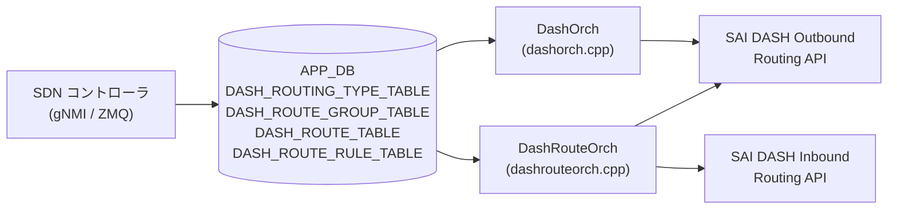

# DASH_ROUTING_* テーブル

## 概要

[DASH](../../reference/glossary.md#term-dash) (Disaggregated APIs for [SONiC](../../reference/glossary.md#term-sonic) Hosts) データプレーンのルーティングポリシーを定義する 4 テーブル群[^1]。

- **`DASH_ROUTING_TYPE_TABLE`**: ルーティングタイプ名 (`vnet`, `vnet_direct`, `direct`, `drop` 等) と転送アクション・カプセル化設定のマッピングを定義する。他テーブルから参照される。
- **`DASH_ROUTE_GROUP_TABLE`**: Outbound ルートのグループコンテナ。[ENI](../../reference/glossary.md#term-eni) は `DASH_ENI_ROUTE_TABLE` 経由でグループにバインドする。
- **`DASH_ROUTE_TABLE`**: [ENI](../../reference/glossary.md#term-eni) 単位の Outbound LPM ルートテーブル。プレフィックスに対するルーティングタイプ・[VNET](../../reference/glossary.md#term-vnet)・オーバーレイ IP 等を定義する。
- **`DASH_ROUTE_RULE_TABLE`**: [ENI](../../reference/glossary.md#term-eni) 単位の Inbound ルートルールテーブル。VNI と送信元 PA プレフィックスを照合して PA validation・[VNET](../../reference/glossary.md#term-vnet) マッピングを行う。

`DashOrch` (`dashorch.cpp`) が `DASH_ROUTING_TYPE_TABLE` を、`DashRouteOrch` (`dashrouteorch.cpp`) が残り 3 テーブルを APP_DB / ZMQ 経由で受信し、[SAI](../../reference/glossary.md#term-sai) [DASH](../../reference/glossary.md#term-dash) Outbound/Inbound Routing API を通じてデータプレーンに書き込む。

!!! note "APP_DB テーブル"
    これらは CONFIG_DB ではなく **APP_DB** に書かれる。SDN コントローラまたは gNMI 経由で直接 APP_DB へ投入される点に注意。

<!-- cdb-mermaid -->
### データフロー (自動生成)



!!! note "凡例"
    APP_DB から SAI までの典型経路。ルーティングタイプは DashOrch が管理し、VNET Mapping Orch から参照される。
<!-- /cdb-mermaid -->

---

## 1. DASH_ROUTING_TYPE_TABLE

### key 構造

```text
DASH_ROUTING_TYPE_TABLE:<routing_type>
```

`routing_type` は `direct` / `vnet` / `vnet_direct` / `vnet_encap` / `drop` / `appliance` / `privatelink` / `privatelinknsg` / `servicetunnel` のいずれか。`DashOrch::doTaskRoutingTypeTable()` が受信後 uppercase → `ROUTING_TYPE_` prefix を付けて protobuf enum `RoutingType` に parse する[^1]。

### フィールド

| フィールド | 型 | 必須 | デフォルト | 説明 |
|-----------|----|----|-----------|------|
| `action_name` | string | 任意 | 空文字列 | 転送アクションの名前。[SAI](../../reference/glossary.md#term-sai) API への直接マッピングなし ([VNET](../../reference/glossary.md#term-vnet) Mapping Orch が参照) |
| `action_type` | enum | 任意 | `ACTION_TYPE_UNSPECIFIED` | 転送アクション種別。`maprouting`, `direct`, `staticencap`, `appliance`, `4to6`, `mapdecap`, `decap`, `drop` |
| `encap_type` | enum | 条件付き | `ENCAP_TYPE_INVALID` | カプセル化種別 (`vxlan` / `nvgre`)。`action_type=staticencap` 時のみ有効 |
| `vni` | uint32 | 任意 | 0 | カプセル化 VNI。0 の場合は SAI `TUNNEL_KEY` を設定しない |

### 制約

- `action_type=staticencap` かつ `encap_type` が省略または不正値の場合は `SWSS_LOG_ERROR` が出力され、SAI 属性が不正になる
- ルーティングタイプエントリが既存の場合は `SWSS_LOG_WARN` を出力して成功扱い (更新は上書き可能)

---

## 2. DASH_ROUTE_GROUP_TABLE

### key 構造

```text
DASH_ROUTE_GROUP_TABLE:<group_id>
```

`group_id` はルートグループの識別子文字列。`DashRouteOrch::addRouteGroup()` が `sai_dash_outbound_routing_api->create_outbound_routing_group()` を**属性なし** (`0, NULL`) で呼び出す。

### フィールド

| フィールド | 型 | 必須 | デフォルト | 説明 |
|-----------|----|----|-----------|------|
| `guid` | string | 任意 | — | グループの GUID ([HLD](../../reference/glossary.md#term-hld) 記載)。[orchagent](../../reference/glossary.md#term-orchagent) は SAI に設定しない |
| `version` | string | 任意 | — | バージョン文字列。結果 DB (`APP_STATE_DB`) への書き込みのみに使用 |

!!! warning "属性なし作成"
    `addRouteGroup()` は protobuf エントリを受け取るが、SAI 呼び出し時に属性を一切設定しない (`create_outbound_routing_group(oid, switchId, 0, NULL)`)。SAI 実装側のデフォルト値が適用される。

### バインド制約

- ルートグループが ENI にバインドされている状態 (`isRouteGroupBound()` = true) では、ルートの追加・削除・グループ削除がすべて拒否される
- バインドカウントは `DashEniFwdOrch` が `bindRouteGroup()` / `unbindRouteGroup()` で管理する

---

## 3. DASH_ROUTE_TABLE (Outbound LPM)

### key 構造

```text
DASH_ROUTE_TABLE:<route_group>:<ip_prefix>
```

`DashRouteOrch::doTaskRouteTable()` が `:` 区切りで `route_group` と `ip_prefix` を解析。メッセージは protobuf `dash::route::Route` 形式。バルク API 経由で SAI `sai_outbound_routing_entry_t` を作成する。

### フィールド

| フィールド | 型 | 必須 | デフォルト | 説明 |
|-----------|----|----|-----------|------|
| `routing_type` | enum | 必須 | `ROUTING_TYPE_UNSPECIFIED` → return false | SAI outbound action を決定。`vnet`, `vnet_direct`, `direct`, `drop` が有効。`UNSPECIFIED` 時は旧 `action_type` フィールドからコピーを試みる |
| `action_type` | enum | 非推奨 | — | `routing_type` に移行済み。`ROUTING_TYPE_UNSPECIFIED` 時のみ使用 |
| `vnet` | string | 条件付き | — | `routing_type=vnet` 時は必須。未登録または空の場合は return false (リトライ) |
| `vnet_direct.vnet` | string | 条件付き | — | `routing_type=vnet_direct` 時は必須 |
| `vnet_direct.overlay_ip` | IP address | 条件付き | — | `routing_type=vnet_direct` 時は必須 (IPv4 または IPv6) |
| `underlay_sip` | IP address | 任意 | SAI 未設定 | `has_underlay_sip() && has_ipv4()` の場合のみ `SAI_OUTBOUND_ROUTING_ENTRY_ATTR_UNDERLAY_SIP` を設定 |
| `metering_class_or` | uint32 | 任意 | SAI 未設定 | `has_metering_class_or()` false の場合 SAI 属性を設定しない |
| `metering_class_and` | uint32 | 任意 | SAI 未設定 | `has_metering_class_and()` false の場合 SAI 属性を設定しない |
| `tunnel` | string | 任意 | SAI 未設定 | `DashTunnelOrch` から OID を取得。未登録の場合はリトライ |

### routing_type 別 SAI アクションマッピング

| `routing_type` | SAI outbound action |
|---------------|---------------------|
| `vnet` | `SAI_OUTBOUND_ROUTING_ENTRY_ACTION_ROUTE_VNET` |
| `vnet_direct` | `SAI_OUTBOUND_ROUTING_ENTRY_ACTION_ROUTE_VNET_DIRECT` |
| `direct` | `SAI_OUTBOUND_ROUTING_ENTRY_ACTION_ROUTE_DIRECT` |
| `drop` | `SAI_OUTBOUND_ROUTING_ENTRY_ACTION_DROP` |
| その他 | `SWSS_LOG_WARN` + return false |

### 制約

- 指定した `route_group` が登録済みでなければ `SAI_NULL_OBJECT_ID` → return false (リトライ)
- ルートグループがすでに ENI にバインドされている状態ではルートの追加不可 (`SWSS_LOG_WARN`)

---

## 4. DASH_ROUTE_RULE_TABLE (Inbound Route Rule)

### key 構造

```text
DASH_ROUTE_RULE_TABLE:<eni>:<vni>:<ip_prefix>:<priority>
```

旧キー形式 (`<eni>:<vni>:<ip_prefix>`) は backward-compat として `priority = 0` として解釈される[^1]。メッセージは protobuf `dash::route_rule::RouteRule` 形式。SAI `sai_inbound_routing_entry_t` をバルク API で作成する。

### フィールド

| フィールド | 型 | 必須 | デフォルト | 説明 |
|-----------|----|----|-----------|------|
| `pa_validation` | bool | 任意 | `false` (proto3 bool デフォルト) | `false` の場合 SAI action = `TUNNEL_DECAP`。`true` の場合 `TUNNEL_DECAP_PA_VALIDATE` |
| `vnet` | string | 任意 | SAI 未設定 | `has_vnet()` true の場合のみ `SAI_INBOUND_ROUTING_ENTRY_ATTR_SRC_VNET_ID` を設定 |
| `metering_class_or` | uint32 | 任意 | SAI 未設定 | `has_metering_class_or()` false の場合 SAI 属性を設定しない |
| `metering_class_and` | uint32 | 任意 | SAI 未設定 | `has_metering_class_and()` false の場合 SAI 属性を設定しない |
| `priority` (key) | uint32 | 任意 | 0 | 旧 3 部構成キーとの backward-compat で省略時は 0 |

!!! warning "pa_validation のデフォルト"
    HLD は `pa_validation` の「デフォルト = true」と記述している[^1] が、orchagent の実装は proto3 bool デフォルト (`false`) を使用する。コントローラが明示的に `true` を設定しない限り PA validation は無効になる。HLD 記述と orchagent 実装の **discrepancy**。

### 制約

- 指定した ENI が `DashOrch` に未登録の場合は return false (リトライ)
- `vnet` が指定されているが `gVnetNameToId` に未登録の場合は return false (リトライ)

---

<!-- ordering -->
## 書込み順依存 (Phase B)

`DashRouteOrch` (`dashrouteorch.cpp`) / `DashOrch` (`dashorch.cpp`) は各テーブル間に複数の先行必須依存を持つ。ZMQ / [gNMI](../../reference/glossary.md#term-gnmi) でテーブルを投入する際は以下の順序を守ること。

### 検出された順序依存

| # | 依存関係 | 方向 | 備考 |
|---|----------|------|------|
| 1 | `DASH_ROUTE_GROUP_TABLE` → `DASH_ROUTE_TABLE` | 先行必須 | グループ未登録時は `getRouteGroupOid()` が `SAI_NULL_OBJECT_ID` → return false (リトライ) |
| 2 | `DASH_ENI_TABLE` → `DASH_ROUTE_RULE_TABLE` | 先行必須 | ENI 未登録時は `getEni()` が null → return false (リトライ) |
| 3 | `DASH_VNET_TABLE` → `DASH_ROUTE_TABLE` | 条件付き先行必須 | `routing_type=vnet`/`vnet_direct` かつ `vnet` 指定時のみ。`routing_type=direct`/`drop` は VNET 不要 |
| 4 | `DASH_VNET_TABLE` → `DASH_ROUTE_RULE_TABLE` | 条件付き先行必須 | `vnet` フィールド指定時のみ。`gVnetNameToId` に未登録なら return false (リトライ) |
| 5 | `DASH_ROUTE_TABLE` 全 DEL → `DASH_ENI_ROUTE_TABLE` DEL → `DASH_ROUTE_GROUP_TABLE` DEL | 削除時の順序 | ENI バインド中はルート追加・削除・グループ削除が拒否される (`isRouteGroupBound()=true`) |
| 6 | `DASH_ROUTE_GROUP_TABLE` → `DASH_ENI_ROUTE_TABLE` | 先行必須 | `setEniRoute()` がグループ OID 未取得なら即 return false (リトライ) |

### 主要制約詳細

**ルートグループ先行 (依存 #1)**: `addOutboundRouting()` は冒頭で `this->getRouteGroupOid(ctxt.route_group)` を呼ぶ。ルートグループが `DASH_ROUTE_GROUP_TABLE` 経由で SAI に登録される前に `DASH_ROUTE_TABLE` の SET メッセージが届いた場合、そのメッセージはリトライキューに残留し続ける（evidence: `dashrouteorch.cpp:70-74`）。

**ENI 先行 (依存 #2)**: `addInboundRouting()` は `dash_orch_->getEni(ctxt.eni)` で ENI の存在を確認する。`DASH_ENI_TABLE` が登録される前の `DASH_ROUTE_RULE_TABLE` は全てリトライされる（evidence: `dashrouteorch.cpp:425-428`）。

**バインド中の操作禁止 (依存 #5)**: `DASH_ENI_ROUTE_TABLE` で ENI とルートグループをバインドすると `bindRouteGroup()` が呼ばれ、`route_group_bind_count_` が 1 以上になる。この状態では:

- `addOutboundRouting()`: SWSS_LOG_WARN + `return true`（メッセージ消費のみ、SAI 書き込みなし）— `dashrouteorch.cpp:65-68`
- `removeOutboundRouting()`: SWSS_LOG_WARN + `return false`（メッセージ保留）— `dashrouteorch.cpp:231-234`
- `removeRouteGroup()`: SWSS_LOG_WARN + `return false`（保留）— `dashrouteorch.cpp:755-758`

バインド解除には `DASH_ENI_ROUTE_TABLE` の DEL を先行させ、`unbindRouteGroup()` を経由させること。

### 推奨書込み順序

**追加時**:

```
1. DASH_ROUTING_TYPE_TABLE   (ルーティングタイプ定義)
2. DASH_VNET_TABLE           (VNET — vnet/vnet_direct ルート使用時)
3. DASH_ENI_TABLE            (ENI エントリ)
4. DASH_ROUTE_GROUP_TABLE    (ルートグループ作成)
5. DASH_ROUTE_TABLE          (Outbound LPM ルート)
6. DASH_ROUTE_RULE_TABLE     (Inbound ルートルール)
7. DASH_ENI_ROUTE_TABLE      (ENI ↔ ルートグループ バインド — 最後)
```

**削除時** (追加の逆順):

```
1. DASH_ENI_ROUTE_TABLE DEL  (バインド解除を最初に)
2. DASH_ROUTE_TABLE DEL
3. DASH_ROUTE_RULE_TABLE DEL
4. DASH_ROUTE_GROUP_TABLE DEL
5. DASH_ENI_TABLE DEL
6. DASH_VNET_TABLE DEL
7. DASH_ROUTING_TYPE_TABLE DEL
```

<!-- /ordering -->

<!-- defaults -->
## フィールド暗黙デフォルト (Phase A — コード由来)

[YANG](../../reference/glossary.md#term-yang) / proto3 デフォルト以外の実装由来 fallback。`DashOrch::doTaskRoutingTypeTable()` (dashorch.cpp:473-537) および `DashRouteOrch::addOutboundRouting()` / `addInboundRouting()` / `addRouteGroup()` (dashrouteorch.cpp:61-748) から導出。

### DASH_ROUTING_TYPE_TABLE

| フィールド | コード由来デフォルト | fallback 源 |
|-----------|-------------------|------------|
| `action_name` | 空文字列 | proto3 string デフォルト; [orchagent](../../reference/glossary.md#term-orchagent) は存在確認せず格納 — dashorch.cpp:451 |
| `action_type` | `ACTION_TYPE_UNSPECIFIED` (proto3 enum 0) | STATICENCAP 以外では encap_type を参照しない — dashvnetorch.cpp |
| `encap_type` | `ENCAP_TYPE_INVALID` (proto3 enum 0) | `action_type=STATICENCAP` 時のみ参照; 不正値は SWSS_LOG_ERROR — dashvnetorch.cpp |
| `vni` | 0 | vni==0 時は `SAI_OUTBOUND_CA_TO_PA_ENTRY_ATTR_TUNNEL_KEY` を push しない — dashvnetorch.cpp |

### DASH_ROUTE_TABLE

| フィールド | コード由来デフォルト | fallback 源 |
|-----------|-------------------|------------|
| `routing_type` | `ROUTING_TYPE_UNSPECIFIED` (proto3 enum 0) → return false | sOutboundAction miss → SWSS_LOG_WARN; UNSPECIFIED 時は deprecated `action_type` からコピー試行 — dashrouteorch.cpp:326 |
| `vnet` | なし | ROUTING_TYPE_VNET 時: has_vnet() false → else ブランチで return false — dashrouteorch.cpp:118 |
| `vnet_direct.overlay_ip` | なし | ROUTING_TYPE_VNET_DIRECT 時: overlay_ip 未設定 → return false — dashrouteorch.cpp:126 |
| `underlay_sip` | SAI 未設定 | has_underlay_sip() && has_ipv4() false → スキップ; **IPv6 underlay_sip は処理されない** — dashrouteorch.cpp:149 |
| `metering_class_or` | SAI 未設定 | has_metering_class_or() false → スキップ — dashrouteorch.cpp:159 |
| `metering_class_and` | SAI 未設定 | has_metering_class_and() false → スキップ — dashrouteorch.cpp:165 |
| `tunnel` | SAI 未設定 | has_tunnel() false → スキップ; 未登録 OID → リトライ — dashrouteorch.cpp:171 |

### DASH_ROUTE_RULE_TABLE

| フィールド | コード由来デフォルト | fallback 源 |
|-----------|-------------------|------------|
| `pa_validation` | `false` (proto3 bool 0) → SAI action = `TUNNEL_DECAP` | `pa_validation()` false → TUNNEL_DECAP_PA_VALIDATE ではなく TUNNEL_DECAP — dashrouteorch.cpp:450; [HLD](../../reference/glossary.md#term-hld) 記載「デフォルト true」と乖離 |
| `vnet` | SAI 未設定 | has_vnet() false → SRC_VNET_ID をスキップ — dashrouteorch.cpp:453 |
| `metering_class_or` | SAI 未設定 | has_metering_class_or() false → スキップ — dashrouteorch.cpp:460 |
| `metering_class_and` | SAI 未設定 | has_metering_class_and() false → スキップ — dashrouteorch.cpp:465 |
| `priority` (key) | 0 | 旧 3 部構成キーとの backward-compat — dashrouteorch.cpp:605 |

### DASH_ROUTE_GROUP_TABLE

| フィールド | コード由来デフォルト | fallback 源 |
|-----------|-------------------|------------|
| `version` | SAI 未使用 | 結果 DB 書き込みのみ — dashrouteorch.cpp:874 |
| (全 SAI 属性) | SAI デフォルト依存 | `create_outbound_routing_group()` を属性なし (0, NULL) で呼ぶ — dashrouteorch.cpp:734 |

### 補足

- `routing_type` の deprecated → 新形式コピー処理: proto3 で旧クライアントが `action_type` のみ送る場合の backward-compat。新実装では `routing_type` フィールドを使用する。
- `underlay_sip` の IPv6 非対応: `has_underlay_sip() && underlay_sip().has_ipv4()` の条件で IPv6 の underlay SIP は現状処理されない (dashrouteorch.cpp:149)。[HLD](../../reference/glossary.md#term-hld) には IPv6 support の記述なし。
- `pa_validation` デフォルトの HLD/実装乖離: HLD §3.2.10 は「Default is set to true」と記述するが、[orchagent](../../reference/glossary.md#term-orchagent) は proto3 bool の 0 (false) をそのまま使用する。コントローラが明示的に `pa_validation=true` を送らない限り PA validation は無効になる。

<!-- /defaults -->

<!-- cdb-exceptions -->
## 例外条件・特殊挙動

| 条件 | 挙動 |
|------|------|
| `routing_type` が `ROUTING_TYPE_UNSPECIFIED` | deprecated `action_type` からコピー試行。それも UNSPECIFIED なら SWSS_LOG_WARN + return false (リトライ) |
| `routing_type` が `sOutboundAction` に存在しない値 | `SWSS_LOG_WARN` + return false (リトライ) |
| `routing_type=vnet` で `vnet` が未登録 | return false (リトライ。VNET 登録待ち) |
| `routing_type=vnet_direct` で `overlay_ip` 未設定 | else ブランチで SWSS_LOG_WARN + return false (リトライ) |
| `tunnel` が `DashTunnelOrch` に未登録 | SWSS_LOG_INFO + return false (リトライ) |
| ルートグループが ENI にバインド済み | ルート追加・削除・グループ削除を SWSS_LOG_WARN で拒否 |
| `DASH_ROUTE_RULE_TABLE` で ENI 未登録 | SWSS_LOG_INFO + return false (リトライ) |
| `pa_validation` 省略 | proto3 デフォルト false → `TUNNEL_DECAP` (PA validation なし) |
| `DASH_ROUTING_TYPE_TABLE` 重複登録 | SWSS_LOG_WARN + true (既存エントリを維持; 上書き不可) |
<!-- /cdb-exceptions -->

<!-- entry-points -->
## 書き込み入り口 (Direction A)

対象テーブル: `DASH_ROUTING_TYPE_TABLE`, `DASH_ROUTE_GROUP_TABLE`, `DASH_ROUTE_TABLE`, `DASH_ROUTE_RULE_TABLE`

### ZMQ / Protobuf (コントローラ経由)

- SDN コントローラが ZMQ 経由で各テーブルに対応する protobuf を送信
- `DashOrch` / `DashRouteOrch` が ZMQ Consumer として受信して処理

### gNMI

- [sonic-mgmt](../../reference/glossary.md#term-sonic-mgmt)-common / sonic-gnmi 経由の [gNMI](../../reference/glossary.md#term-gnmi) SetRequest で書き込み可能

### CLI

- なし ([DASH](../../reference/glossary.md#term-dash) ルーティングは CLI 経由での設定を想定しない)

<!-- /entry-points -->

<!-- cross-refs -->
## 暗黙参照テーブル (Phase C)

<!-- evidence: dashrouteorch.cpp:70-74 / 78-92 / 171-183 / 425-428 / 430-433 / 803-841 / 220 / 262 / 507 / 546 -->

各テーブルが SAI 書き込み時に参照する外部テーブル・リソース。[YANG](../../reference/glossary.md#term-yang) leafref は存在しないため、すべて実装レベルの暗黙参照。

| 参照先テーブル / リソース | 参照方向 | 条件 | 参照元 evidence |
|--------------------------|---------|------|----------------|
| `DASH_ROUTE_GROUP_TABLE` | OID 解決（必須） | `DASH_ROUTE_TABLE` SET 時常時。グループ未登録なら `return false` (リトライ) | `dashrouteorch.cpp:70-74` (`getRouteGroupOid()`) |
| `DASH_ENI_TABLE` | OID 解決（必須） | `DASH_ROUTE_RULE_TABLE` SET 時常時。ENI 未登録なら `return false` (リトライ) | `dashrouteorch.cpp:425-428` (`dash_orch_->getEni()`) |
| `DASH_VNET_TABLE` | OID 解決（条件付き） | `DASH_ROUTE_TABLE` で `routing_type=vnet`/`vnet_direct` かつ `vnet` 指定時。`gVnetNameToId` 未登録 → `return false` | `dashrouteorch.cpp:78-92` |
| `DASH_VNET_TABLE` | OID 解決（条件付き） | `DASH_ROUTE_RULE_TABLE` で `vnet` フィールド指定時。`gVnetNameToId` 未登録 → `return false` | `dashrouteorch.cpp:430-433` |
| `DASH_TUNNEL_TABLE` | OID 解決（条件付き） | `DASH_ROUTE_TABLE` で `tunnel` フィールド指定時。`DashTunnelOrch::getTunnelOid()` が `SAI_NULL_OBJECT_ID` → `return false` | `dashrouteorch.cpp:171-183` |
| `DASH_ENI_ROUTE_TABLE` (被参照) | バインドカウント管理 | `DashEniFwdOrch` が `bindRouteGroup()` / `unbindRouteGroup()` を呼ぶ。バインド中はルート追加・削除・グループ削除を拒否 | `dashrouteorch.cpp:803-841` |
| CrmOrch (`gCrmOrch`) | リソースカウンタ | Outbound/Inbound ルートの SAI 追加・削除成功時に [CRM](../../reference/glossary.md#term-crm) カウンタを増減 | `dashrouteorch.cpp:220, 262, 507, 546` |

!!! note "gVnetNameToId グローバルマップ"
    `gVnetNameToId` は `DashVnetOrch` (`dashvnetorch.cpp`) が `DASH_VNET_TABLE` 処理時に登録・削除するプロセス内グローバルマップ。`DASH_ROUTE_TABLE` と `DASH_ROUTE_RULE_TABLE` はどちらもこのマップを直接参照し、VNET OID を取得する。YANG 定義の leafref ではなくコード上の直接参照である点に注意。

!!! note "ROUTING_TYPE_DIRECT / DROP は外部参照なし"
    `DASH_ROUTE_TABLE` で `routing_type=ROUTING_TYPE_DIRECT` または `ROUTING_TYPE_DROP` を使用する場合、VNET / TUNNEL の参照はなく、ルートグループ OID のみ必要。最もシンプルなルートエントリ。

<!-- /cross-refs -->

<!-- failure -->
## 失敗挙動 (Phase D)

<!-- evidence: meta/_intermediate/cdb-flow/dash-routing-failure.md -->

`DashRouteOrch` / `DashOrch` はハンドラが `bool` を返し、`false` でリトライ、`true` で消費（廃棄）となる。[STATE_DB](../../reference/glossary.md#term-state_db) / ERROR_TABLE への失敗記録は行わない。

### DASH_ROUTING_TYPE_TABLE

| 失敗ケース | ログレベル | 戻り値 | retry |
|-----------|-----------|--------|-------|
| routing_type 文字列を enum 変換失敗 | SWSS_LOG_ERROR | true | なし（廃棄） |
| 重複登録（既存エントリあり） | SWSS_LOG_WARN | true | なし（既存維持） |
| DEL: 存在しない routing_type | SWSS_LOG_WARN | true | なし |

### DASH_ROUTE_GROUP_TABLE

| 失敗ケース | ログレベル | 戻り値 | retry |
|-----------|-----------|--------|-------|
| SAI `create_outbound_routing_group` 失敗 | SWSS_LOG_ERROR | false | 自動リトライ |
| DEL: グループが ENI にバインド中 | SWSS_LOG_WARN | false | ENI アンバインド後に自動リトライ |
| DEL: グループ未登録 | SWSS_LOG_WARN | true | なし |

### DASH_ROUTE_TABLE

| 失敗ケース | ログレベル | 戻り値 | retry |
|-----------|-----------|--------|-------|
| `routing_type` が UNSPECIFIED かつ deprecated `action_type` も UNSPECIFIED | SWSS_LOG_WARN | false | 自動リトライ（永続滞留の可能性あり） |
| `route_group` 未登録 | なし | false | グループ登録まで自動リトライ |
| ルートグループ ENI バインド中 (SET) | SWSS_LOG_WARN | **true** | なし（**サイレント廃棄**） |
| ルートグループ ENI バインド中 (DEL) | SWSS_LOG_WARN | false | アンバインドまで保留 |
| `routing_type=vnet` で `vnet` 未登録 | SWSS_LOG_WARN | false | VNET 登録まで自動リトライ |
| `routing_type=vnet_direct` で `overlay_ip` 未設定 | SWSS_LOG_WARN | false | 自動リトライ |
| `tunnel` 未登録 | SWSS_LOG_INFO | false | トンネル登録まで自動リトライ |
| bulk SAI 部分失敗 | SWSS_LOG_ERROR | 失敗分 false | 失敗エントリのみリトライ |

!!! warning "ENI バインド中の SET はサイレント廃棄"
    `addOutboundRouting()` は ENI バインド中に `return true` を返すため、ルートエントリが**消費されてキューから削除**される。SAI への書き込みは行われず、ログのみ出力される。コントローラは ENI アンバインド後に再投入する必要がある (`dashrouteorch.cpp:65-68`)。

### DASH_ROUTE_RULE_TABLE

| 失敗ケース | ログレベル | 戻り値 | retry |
|-----------|-----------|--------|-------|
| ENI 未登録 | SWSS_LOG_INFO | false | ENI 登録まで自動リトライ |
| `vnet` 指定で `gVnetNameToId` 未登録 | SWSS_LOG_WARN | false | VNET 登録まで自動リトライ |
| bulk SAI 部分失敗 | SWSS_LOG_ERROR | 失敗分 false | 失敗エントリのみリトライ |
| DEL: ルール未登録 | SWSS_LOG_WARN | true | なし |

### 永続滞留リスク

`routing_type=ROUTING_TYPE_UNSPECIFIED` かつ deprecated `action_type` も `UNSPECIFIED` のエントリは依存テーブルが揃っても `return false` が返り続ける。コントローラ側で正しい `routing_type` を設定した再投入が必要。

<!-- /failure -->

<!-- constants -->
## ハードコード定数 (Phase E)

`dashorch.cpp` / `dashrouteorch.cpp` に存在するハードコード定数を網羅する。詳細スキャンノート: [`meta/_intermediate/cdb-flow/dash-routing-constants.md`](https://github.com/aoki-taquan/sonic-unofficial-docs/blob/main/meta/_intermediate/cdb-flow/dash-routing-constants.md)。

### APP_DB テーブル名文字列定数 (`schema.h`)

| 定数名 | 値 |
|---|---|
| `APP_DASH_ROUTING_TYPE_TABLE_NAME` | `"DASH_ROUTING_TYPE_TABLE"` |
| `APP_DASH_ROUTE_TABLE_NAME` | `"DASH_ROUTE_TABLE"` |
| `APP_DASH_ROUTE_RULE_TABLE_NAME` | `"DASH_ROUTE_RULE_TABLE"` |
| `APP_DASH_ROUTE_GROUP_TABLE_NAME` | `"DASH_ROUTE_GROUP_TABLE"` |
| `APP_DASH_ENI_ROUTE_TABLE_NAME` | `"DASH_ENI_ROUTE_TABLE"` |

### 結果コード定数 (`dashorch.h:35-36`)

| 定数名 | 値 | 意味 |
|---|---|---|
| `DASH_RESULT_SUCCESS` | `0` | SET/DEL 操作成功。APP_STATE_DB 結果テーブルに `"result"="0"` を書き込む |
| `DASH_RESULT_FAILURE` | `1` | SAI API 失敗。APP_STATE_DB 結果テーブルに `"result"="1"` を書き込む |

### キー正規化処理 (`dashorch.cpp:487-488`)

`DASH_ROUTING_TYPE_TABLE` のキーは以下の変換後に protobuf enum へパースされる:

1. 全文字を大文字化 (`::toupper`)
2. プレフィックス `"ROUTING_TYPE_"` を先頭に付与

例: APP_DB キー `"vnet"` → `"ROUTING_TYPE_VNET"` → `RoutingType::ROUTING_TYPE_VNET`。変換失敗時は `SWSS_LOG_WARN` 出力後エントリを廃棄（retry なし）。

### `sOutboundAction` 静的マップ (`dashrouteorch.cpp:41-47`)

| protobuf RoutingType | SAI outbound routing action |
|---|---|
| `ROUTING_TYPE_VNET` | `SAI_OUTBOUND_ROUTING_ENTRY_ACTION_ROUTE_VNET` |
| `ROUTING_TYPE_VNET_DIRECT` | `SAI_OUTBOUND_ROUTING_ENTRY_ACTION_ROUTE_VNET_DIRECT` |
| `ROUTING_TYPE_DIRECT` | `SAI_OUTBOUND_ROUTING_ENTRY_ACTION_ROUTE_DIRECT` |
| `ROUTING_TYPE_DROP` | `SAI_OUTBOUND_ROUTING_ENTRY_ACTION_DROP` |

`ROUTING_TYPE_UNSPECIFIED` はこのマップに含まれないため、`find()` が `end()` を返し `task_failed` となる。

### SAI 属性 ID 定数 — アウトバウンドルート (`dashrouteorch.cpp`)

| SAI 属性 ID | 対応フィールド |
|---|---|
| `SAI_OUTBOUND_ROUTING_ENTRY_ATTR_ACTION` | `routing_type` → `sOutboundAction` 変換値 |
| `SAI_OUTBOUND_ROUTING_ENTRY_ATTR_DST_VNET_ID` | `vnet` (vnet / vnet_direct 両方) |
| `SAI_OUTBOUND_ROUTING_ENTRY_ATTR_OVERLAY_IP` | `overlay_ip` (vnet_direct のみ) |
| `SAI_OUTBOUND_ROUTING_ENTRY_ATTR_UNDERLAY_SIP` | `underlay_sip` |
| `SAI_OUTBOUND_ROUTING_ENTRY_ATTR_METER_CLASS_OR` | `metering_class_or` |
| `SAI_OUTBOUND_ROUTING_ENTRY_ATTR_METER_CLASS_AND` | `metering_class_and` |
| `SAI_OUTBOUND_ROUTING_ENTRY_ATTR_DASH_TUNNEL_ID` | `tunnel` |

### SAI 属性 ID 定数 — インバウンドルート (`dashrouteorch.cpp`)

| SAI 属性 ID | 対応フィールド / 値 |
|---|---|
| `SAI_INBOUND_ROUTING_ENTRY_ATTR_ACTION` | `pa_validation` → `TUNNEL_DECAP_PA_VALIDATE` / `TUNNEL_DECAP` |
| `SAI_INBOUND_ROUTING_ENTRY_ATTR_SRC_VNET_ID` | `vnet` |
| `SAI_INBOUND_ROUTING_ENTRY_ATTR_METER_CLASS_OR` | `metering_class_or` |
| `SAI_INBOUND_ROUTING_ENTRY_ATTR_METER_CLASS_AND` | `metering_class_and` |

- 中間トレース: `meta/_intermediate/cdb-flow/dash-routing-constants.md`
<!-- /constants -->

<!-- side-effects -->
## 副作用 (Phase F)

<!-- evidence: dashrouteorch.cpp:56-58 / 220 / 262 / 342 / 354 / 401-403 / 410 / 507 / 546 / 644 / 702-705 / 712 / 745 / 784 / 874 / 881 -->

各テーブル操作が orchagent 内部およびデータベースに与える副作用を網羅する。

### APP_STATE_DB 結果テーブルへの書き戻し

`DashRouteOrch` のコンストラクタで APP_STATE_DB に接続した 3 つの `Table` を初期化し、各操作完了後に `writeResultToDB()` / `removeResultFromDB()` を呼ぶ。

| メンバー変数 | APP_STATE_DB テーブル名 | 対象テーブル |
|---|---|---|
| `dash_route_result_table_` | `"DASH_ROUTE_TABLE"` | DASH_ROUTE_TABLE |
| `dash_route_rule_result_table_` | `"DASH_ROUTE_RULE_TABLE"` | DASH_ROUTE_RULE_TABLE |
| `dash_route_group_result_table_` | `"DASH_ROUTE_GROUP_TABLE"` | DASH_ROUTE_GROUP_TABLE |

**DASH_ROUTE_TABLE の書き戻しタイミング**:

| タイミング | 書き込み内容 | コード行 |
|---|---|---|
| SET 成功 (pre-op erase) | `result=0` | dashrouteorch.cpp:342 |
| SET 成功 (post-op erase) | `result=0` | L403 |
| SET 失敗 (post-op 継続) | `result=1` | L401-403 |
| DEL 成功 (post-op erase) | エントリ削除 | L410 |

**DASH_ROUTE_RULE_TABLE / DASH_ROUTE_GROUP_TABLE** も同パターン。`DASH_ROUTE_GROUP_TABLE` は `version` フィールドも同時に書き込む (`writeResultToDB` 第 4 引数 `entry.version()` — L874)。

!!! note "DASH_ROUTING_TYPE_TABLE の結果書き戻し"
    `DASH_ROUTING_TYPE_TABLE` は `DashOrch::doTaskRoutingTypeTable()` が管理し、`dash_routing_type_result_table_` (APP_STATE_DB) に同様のパターンで書き戻す (`dashorch.cpp:517, 524`)。

### CRM カウンタ更新

`gCrmOrch->incCrmResUsedCounter()` / `decCrmResUsedCounter()` を SAI API 成功後に呼ぶ。

| 操作 | カウンタ | IP 族判定 | コード行 |
|---|---|---|---|
| `addOutboundRoutingPost()` 成功 | `CRM_DASH_IPV4_OUTBOUND_ROUTING` / `CRM_DASH_IPV6_OUTBOUND_ROUTING` | `ctxt.destination.isV4()` | L220 |
| `removeOutboundRoutingPost()` 成功 | `CRM_DASH_IPV4_OUTBOUND_ROUTING` / `CRM_DASH_IPV6_OUTBOUND_ROUTING` | `ctxt.destination.isV4()` | L262 |
| `addInboundRoutingPost()` 成功 | `CRM_DASH_IPV4_INBOUND_ROUTING` / `CRM_DASH_IPV6_INBOUND_ROUTING` | `ctxt.sip.isV4()` | L507 |
| `removeInboundRoutingPost()` 成功 | `CRM_DASH_IPV4_INBOUND_ROUTING` / `CRM_DASH_IPV6_INBOUND_ROUTING` | `ctxt.sip.isV4()` | L546 |

!!! note "DASH_ROUTE_GROUP_TABLE は CRM 非対象"
    `addRouteGroup()` / `removeRouteGroup()` は CRM カウンタを更新しない。

### in-memory マップ更新

**`route_group_oid_map_`** (DashRouteOrch メンバ):

- `addRouteGroup()` 成功時 → `route_group_oid_map_[route_group] = route_group_oid` で挿入 (L745)
- `removeRouteGroup()` 成功時 → `route_group_oid_map_.erase(route_group)` で削除 (L784)

**`route_group_bind_count_`** (DashRouteOrch メンバ):

- `bindRouteGroup()` 呼び出し時: カウントインクリメント (L809) — 呼び出し元は `DashEniFwdOrch`
- `unbindRouteGroup()` 呼び出し時: デクリメント。0 になればエントリ削除 (L824-829)
- `doTaskRouteTable()` / `doTaskRouteGroupTable()` 内からは直接更新しない

### SAI API 呼び出し一覧

| 操作 | SAI API | 方式 |
|---|---|---|
| ルートグループ作成 | `create_outbound_routing_group()` | 即時 (L734) |
| ルートグループ削除 | `remove_outbound_routing_group()` | 即時 (L768) |
| アウトバウンドルート作成 | `outbound_routing_bulker_.create_entry()` → `flush()` | バルク (L186, L368) |
| アウトバウンドルート削除 | `outbound_routing_bulker_.remove_entry()` → `flush()` | バルク (L243, L368) |
| インバウンドルート作成 | `inbound_routing_bulker_.create_entry()` → `flush()` | バルク (L473, L670) |
| インバウンドルート削除 | `inbound_routing_bulker_.remove_entry()` → `flush()` | バルク (L527, L670) |

ルートグループのみ即時呼び出し。ルートエントリは `EntityBulker` で蓄積後 `flush()` で一括コミット。

### 副作用が発生しないケース

| 条件 | 副作用なし理由 |
|---|---|
| ENI バインド中グループへの SET | `addOutboundRouting()` が `return true` 早期終了 — SAI・[CRM](../../reference/glossary.md#term-crm) 呼び出しなし。結果テーブルには `DASH_RESULT_SUCCESS(0)` が書かれる点に注意 |
| protobuf パース失敗 | consumer から消費するが SAI / [CRM](../../reference/glossary.md#term-crm) / 結果テーブルへの書き込みなし |
| リトライ中 (`return false`) | SAI 未呼び出し、CRM 未更新。SET post-op 失敗時のみ結果テーブルに `DASH_RESULT_FAILURE(1)` が書かれる |

<!-- /side-effects -->

<!-- pubsub -->
## Pub/Sub・通知経路 (Phase G)

<!-- evidence: orchdaemon.cpp:1342-1350 / 1362-1368; dashorch.cpp:60-61,73,1346-1348; dashrouteorch.cpp:49-58,896-920 -->

### テーブルと担当 Orch の分離

DASH ルーティング 4 テーブルは 2 つの異なる Orch に分散して購読される。

| テーブル | 担当 Orch | 購読登録箇所 |
|---|---|---|
| `DASH_ROUTING_TYPE_TABLE` | `DashOrch` | `orchdaemon.cpp:1342-1350` |
| `DASH_ROUTE_GROUP_TABLE` | `DashRouteOrch` | `orchdaemon.cpp:1362-1368` |
| `DASH_ROUTE_TABLE` | `DashRouteOrch` | `orchdaemon.cpp:1362-1368` |
| `DASH_ROUTE_RULE_TABLE` | `DashRouteOrch` | `orchdaemon.cpp:1362-1368` |

### 購読テーブル登録

**DashOrch** (`orchdaemon.cpp:1342-1350`) — `DASH_ROUTING_TYPE_TABLE` を含む複数テーブルを購読：

```cpp
vector<string> dash_tables = {
    APP_DASH_APPLIANCE_TABLE_NAME,
    APP_DASH_ROUTING_TYPE_TABLE_NAME,  // "DASH_ROUTING_TYPE_TABLE"
    APP_DASH_ENI_TABLE_NAME,
    APP_DASH_ENI_ROUTE_TABLE_NAME,
    APP_DASH_QOS_TABLE_NAME
};
DashOrch *dash_orch = new DashOrch(m_dpu_appDb, dash_tables, m_dpu_appstateDb, dash_zmq_server);
```

**DashRouteOrch** (`orchdaemon.cpp:1362-1368`) — ルート系 3 テーブルを購読：

```cpp
vector<string> dash_route_tables = {
    APP_DASH_ROUTE_TABLE_NAME,       // "DASH_ROUTE_TABLE"
    APP_DASH_ROUTE_RULE_TABLE_NAME,  // "DASH_ROUTE_RULE_TABLE"
    APP_DASH_ROUTE_GROUP_TABLE_NAME  // "DASH_ROUTE_GROUP_TABLE"
};
DashRouteOrch *dash_route_orch = new DashRouteOrch(
    m_dpu_appDb, dash_route_tables, dash_orch, m_dpu_appstateDb, dash_zmq_server);
```

親クラス `ZmqOrch` のコンストラクタが各テーブル名に対して `ZmqConsumerStateTable` を自動登録する。

### ZmqOrch 経由の通知経路

`DashOrch` / `DashRouteOrch` はともに `Orch` ではなく `ZmqOrch` を継承するため、通常の [Redis](../../reference/glossary.md#term-redis) keyspace notification ではなく **ZeroMQ (ZMQ)** 経由でメッセージを受信する。SDN コントローラや [gNMI](../../reference/glossary.md#term-gnmi) が ZMQ ソケット経由でイベントを直接 push し、`ZmqOrch::doTask()` → 各 Orch の `doTask()` の呼び出しチェーンで処理される。

### 購読テーブルと処理関数のマッピング

| 購読テーブル名 | 担当 Orch | 処理関数 |
|---|---|---|
| `DASH_ROUTING_TYPE_TABLE` | `DashOrch` | `doTaskRoutingTypeTable()` |
| `DASH_ROUTE_TABLE` | `DashRouteOrch` | `doTaskRouteTable()` |
| `DASH_ROUTE_RULE_TABLE` | `DashRouteOrch` | `doTaskRouteRuleTable()` |
| `DASH_ROUTE_GROUP_TABLE` | `DashRouteOrch` | `doTaskRouteGroupTable()` |

### 結果通知の書き戻し先 (APP_STATE_DB)

処理結果は `m_dpu_appstateDb` ([DPU](../../reference/glossary.md#term-dpu) APP_STATE_DB) の対応テーブルへ書き戻される。SDN コントローラはこれを watch することで SAI プログラム完了を検知できる。

**DashOrch が管理する結果テーブル** (dashorch.cpp:73):

| 結果テーブル | `version` フィールド |
|---|---|
| `APP_DASH_ROUTING_TYPE_TABLE_NAME` (STATE) | なし |

**DashRouteOrch が管理する結果テーブル** (dashrouteorch.cpp:56–58):

| 結果テーブル | `version` フィールド |
|---|---|
| `APP_DASH_ROUTE_TABLE_NAME` (STATE) | なし |
| `APP_DASH_ROUTE_RULE_TABLE_NAME` (STATE) | なし |
| `APP_DASH_ROUTE_GROUP_TABLE_NAME` (STATE) | `entry.version()` を第 3 引数で渡す (L874) |

### 外部コンポーネントからの bindRouteGroup / unbindRouteGroup

`DashRouteOrch` の `route_group_bind_count_` は自身のタスクループでは変更されない。`DashOrch` が `DASH_ENI_ROUTE_TABLE` の SET / DEL 処理時に `gDirectory` 経由でポインタを取得して呼び出す：

```cpp
// dashorch.cpp:1192 (ENI バインド時)
DashRouteOrch *dash_route_orch = gDirectory.get<DashRouteOrch*>();
dash_route_orch->bindRouteGroup(entry.group_id());

// dashorch.cpp:1272 (ENI アンバインド時)
dash_route_orch->unbindRouteGroup(old_group_id);
```

2 つの Orch 間に直接の pub/sub チャンネルはなく、`gDirectory` 経由のポインタ参照で同期される。この設計により `DASH_ENI_ROUTE_TABLE` の変更が `isRouteGroupBound()` チェックに間接的に影響する。

!!! note "能動的イベント発行なし"
    `DashOrch` / `DashRouteOrch` は SAI 呼び出しと APP_STATE_DB 書き戻し以外に外部コンポーネントへの能動的なイベント発行を行わない。ログ出力 (`SWSS_LOG_*`) は `rsyslog` / `swssloglevel` ツールで観察可能。

- 中間トレース: `meta/_intermediate/cdb-flow/dash-routing-pubsub.md`
<!-- /pubsub -->

<!-- platform -->
## プラットフォーム差異 (Phase H)

**[DPU](../../reference/glossary.md#term-dpu) ([SmartSwitch](../../reference/glossary.md#term-smartswitch)) 専用**: `DashRouteOrch` / `DashOrch` は `gMySwitchType == "dpu"` のときのみ `DpuOrchDaemon` 内で生成される。通常スイッチ・VoQ シャーシ・Fabric モードでは本テーブル群は存在しない。[SAI](../../reference/glossary.md#term-sai) DASH Outbound/Inbound Routing API を経由するため [ASIC](../../reference/glossary.md#term-asic) が当該 API をサポートすることが前提。コード内に [ASIC](../../reference/glossary.md#term-asic) 種別の条件分岐はなく SAI 実装（[syncd](../../reference/glossary.md#term-syncd) 経由のベンダー SAI ライブラリ）に委ねられる。

| 観点 | 結果 | 根拠 |
|------|------|------|
| [ASIC](../../reference/glossary.md#term-asic) 種別 (Broadcom / Mellanox / Marvell 等) | SAI 実装依存・コード差分なし | SAI DASH API 経由の抽象化。`dashrouteorch.cpp` 内に ASIC 条件分岐なし |
| [DPU](../../reference/glossary.md#term-dpu) ([SmartSwitch](../../reference/glossary.md#term-smartswitch)) 専用 | 通常スイッチでは無効 | `main.cpp:990`: `gMySwitchType == "dpu"` のみ `DPU_APPL_DB` 接続 → `DpuOrchDaemon` → `DashRouteOrch` を生成 |
| multi-asic (`is_multi_npu` 環境) | 非対応 | DPU 専用構成のため namespace iterate コードなし |
| [VOQ](../../reference/glossary.md#term-voq) chassis / Fabric | 無効 | `DashRouteOrch` は DPU モード限定。`orchdaemon.cpp:1313` にて明示的に分離 |
| ZMQ トランスポート | feature flag `ORCH_NORTHBOND_DASH_ZMQ_ENABLED` で制御 | デフォルト `true`（ZMQ 有効）。`false` で [Redis](../../reference/glossary.md#term-redis) subscribe フォールバック (`orchdaemon.cpp:1329`) |
| バルクサイズ上限 | デフォルト 1000、`orchagent -k` で変更可 | `DEFAULT_MAX_BULK_SIZE = 1000` (`orchdaemon.cpp:81`)。`outbound_routing_bulker_` / `inbound_routing_bulker_` 両方に適用 |
| IPv6 `underlay_sip` | 未サポート（無言スキップ） | `has_ipv4()` ガードのみ (`dashrouteorch.cpp:149`)。IPv6 underlay SIP は ASIC 非依存のコード上の制約 |

> **Evidence**: `sonic-swss/orchagent/main.cpp:990`（`gMySwitchType == "dpu"` 分岐）、`sonic-swss/orchagent/orchdaemon.cpp:81,1313,1329,1362-1368`（`DEFAULT_MAX_BULK_SIZE`、`DpuOrchDaemon`、ZMQ feature flag、`DashRouteOrch` 生成）、`sonic-swss/orchagent/dash/dashrouteorch.cpp:34-35,50-51,149`（SAI extern ポインタ、bulker 初期化、underlay_sip IPv4 ガード）；詳細分析 `meta/_intermediate/cdb-flow/dash-routing-platform.md`
<!-- /platform -->

## 関連 CONFIG_DB / APP_DB テーブル

- [`DASH_ENI_TABLE`](dash-eni.md): ENI エントリ。`DASH_ROUTE_RULE_TABLE` の親
- [`DASH_ENI_ROUTE_TABLE`](dash-eni.md): ENI をルートグループにバインドする
- [`DASH_VNET_TABLE`](dash-vnet.md): VNET エントリ。`vnet` フィールドの参照先
- [`DASH_VNET_MAPPING_TABLE`](dash-acl.md): CA-PA マッピング。`DASH_ROUTING_TYPE_TABLE` の `action_type` が `maprouting` / `staticencap` のとき参照

## 引用元

[^1]: `SONiC/doc/dash/dash-sonic-hld.md` §3.2.6〜§3.2.10 (DASH_ROUTING_TYPE_TABLE, DASH_ROUTE_GROUP_TABLE, DASH_ROUTE_TABLE, DASH_ROUTE_RULE_TABLE スキーマ定義). <https://github.com/sonic-net/SONiC/blob/49bab5b5ff0e924f1ea52b3d9db0dfa4191a7c06/doc/dash/dash-sonic-hld.md>

<!-- glossary-links-injected: 2af63bc572d1 -->
