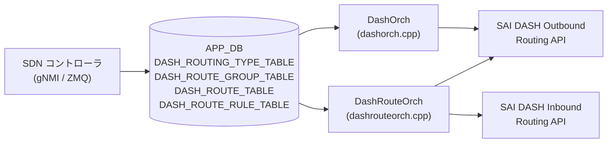

# DASH_ROUTING_* テーブル

## 概要

DASH (Disaggregated APIs for SONiC Hosts) データプレーンのルーティングポリシーを定義する 4 テーブル群[^1]。

- **`DASH_ROUTING_TYPE_TABLE`**: ルーティングタイプ名 (`vnet`, `vnet_direct`, `direct`, `drop` 等) と転送アクション・カプセル化設定のマッピングを定義する。他テーブルから参照される。
- **`DASH_ROUTE_GROUP_TABLE`**: Outbound ルートのグループコンテナ。ENI は `DASH_ENI_ROUTE_TABLE` 経由でグループにバインドする。
- **`DASH_ROUTE_TABLE`**: ENI 単位の Outbound LPM ルートテーブル。プレフィックスに対するルーティングタイプ・VNET・オーバーレイ IP 等を定義する。
- **`DASH_ROUTE_RULE_TABLE`**: ENI 単位の Inbound ルートルールテーブル。VNI と送信元 PA プレフィックスを照合して PA validation・VNET マッピングを行う。

`DashOrch` (`dashorch.cpp`) が `DASH_ROUTING_TYPE_TABLE` を、`DashRouteOrch` (`dashrouteorch.cpp`) が残り 3 テーブルを APP_DB / ZMQ 経由で受信し、SAI DASH Outbound/Inbound Routing API を通じてデータプレーンに書き込む。

!!! note "APP_DB テーブル"
    これらは CONFIG_DB ではなく **APP_DB** に書かれる。SDN コントローラまたは gNMI 経由で直接 APP_DB へ投入される点に注意。

<!-- cdb-mermaid -->
### データフロー (自動生成)



!!! note "凡例"
    APP_DB から SAI までの典型経路。ルーティングタイプは DashOrch が管理し、VNET Mapping Orch から参照される。
<!-- /cdb-mermaid -->

---

## 1. DASH_ROUTING_TYPE_TABLE

### key 構造

```text
DASH_ROUTING_TYPE_TABLE:<routing_type>
```

`routing_type` は `direct` / `vnet` / `vnet_direct` / `vnet_encap` / `drop` / `appliance` / `privatelink` / `privatelinknsg` / `servicetunnel` のいずれか。`DashOrch::doTaskRoutingTypeTable()` が受信後 uppercase → `ROUTING_TYPE_` prefix を付けて protobuf enum `RoutingType` に parse する[^1]。

### フィールド

| フィールド | 型 | 必須 | デフォルト | 説明 |
|-----------|----|----|-----------|------|
| `action_name` | string | 任意 | 空文字列 | 転送アクションの名前。SAI API への直接マッピングなし (VNET Mapping Orch が参照) |
| `action_type` | enum | 任意 | `ACTION_TYPE_UNSPECIFIED` | 転送アクション種別。`maprouting`, `direct`, `staticencap`, `appliance`, `4to6`, `mapdecap`, `decap`, `drop` |
| `encap_type` | enum | 条件付き | `ENCAP_TYPE_INVALID` | カプセル化種別 (`vxlan` / `nvgre`)。`action_type=staticencap` 時のみ有効 |
| `vni` | uint32 | 任意 | 0 | カプセル化 VNI。0 の場合は SAI `TUNNEL_KEY` を設定しない |

### 制約

- `action_type=staticencap` かつ `encap_type` が省略または不正値の場合は `SWSS_LOG_ERROR` が出力され、SAI 属性が不正になる
- ルーティングタイプエントリが既存の場合は `SWSS_LOG_WARN` を出力して成功扱い (更新は上書き可能)

---

## 2. DASH_ROUTE_GROUP_TABLE

### key 構造

```text
DASH_ROUTE_GROUP_TABLE:<group_id>
```

`group_id` はルートグループの識別子文字列。`DashRouteOrch::addRouteGroup()` が `sai_dash_outbound_routing_api->create_outbound_routing_group()` を**属性なし** (`0, NULL`) で呼び出す。

### フィールド

| フィールド | 型 | 必須 | デフォルト | 説明 |
|-----------|----|----|-----------|------|
| `guid` | string | 任意 | — | グループの GUID (HLD 記載)。orchagent は SAI に設定しない |
| `version` | string | 任意 | — | バージョン文字列。結果 DB (`APP_STATE_DB`) への書き込みのみに使用 |

!!! warning "属性なし作成"
    `addRouteGroup()` は protobuf エントリを受け取るが、SAI 呼び出し時に属性を一切設定しない (`create_outbound_routing_group(oid, switchId, 0, NULL)`)。SAI 実装側のデフォルト値が適用される。

### バインド制約

- ルートグループが ENI にバインドされている状態 (`isRouteGroupBound()` = true) では、ルートの追加・削除・グループ削除がすべて拒否される
- バインドカウントは `DashEniFwdOrch` が `bindRouteGroup()` / `unbindRouteGroup()` で管理する

---

## 3. DASH_ROUTE_TABLE (Outbound LPM)

### key 構造

```text
DASH_ROUTE_TABLE:<route_group>:<ip_prefix>
```

`DashRouteOrch::doTaskRouteTable()` が `:` 区切りで `route_group` と `ip_prefix` を解析。メッセージは protobuf `dash::route::Route` 形式。バルク API 経由で SAI `sai_outbound_routing_entry_t` を作成する。

### フィールド

| フィールド | 型 | 必須 | デフォルト | 説明 |
|-----------|----|----|-----------|------|
| `routing_type` | enum | 必須 | `ROUTING_TYPE_UNSPECIFIED` → return false | SAI outbound action を決定。`vnet`, `vnet_direct`, `direct`, `drop` が有効。`UNSPECIFIED` 時は旧 `action_type` フィールドからコピーを試みる |
| `action_type` | enum | 非推奨 | — | `routing_type` に移行済み。`ROUTING_TYPE_UNSPECIFIED` 時のみ使用 |
| `vnet` | string | 条件付き | — | `routing_type=vnet` 時は必須。未登録または空の場合は return false (リトライ) |
| `vnet_direct.vnet` | string | 条件付き | — | `routing_type=vnet_direct` 時は必須 |
| `vnet_direct.overlay_ip` | IP address | 条件付き | — | `routing_type=vnet_direct` 時は必須 (IPv4 または IPv6) |
| `underlay_sip` | IP address | 任意 | SAI 未設定 | `has_underlay_sip() && has_ipv4()` の場合のみ `SAI_OUTBOUND_ROUTING_ENTRY_ATTR_UNDERLAY_SIP` を設定 |
| `metering_class_or` | uint32 | 任意 | SAI 未設定 | `has_metering_class_or()` false の場合 SAI 属性を設定しない |
| `metering_class_and` | uint32 | 任意 | SAI 未設定 | `has_metering_class_and()` false の場合 SAI 属性を設定しない |
| `tunnel` | string | 任意 | SAI 未設定 | `DashTunnelOrch` から OID を取得。未登録の場合はリトライ |

### routing_type 別 SAI アクションマッピング

| `routing_type` | SAI outbound action |
|---------------|---------------------|
| `vnet` | `SAI_OUTBOUND_ROUTING_ENTRY_ACTION_ROUTE_VNET` |
| `vnet_direct` | `SAI_OUTBOUND_ROUTING_ENTRY_ACTION_ROUTE_VNET_DIRECT` |
| `direct` | `SAI_OUTBOUND_ROUTING_ENTRY_ACTION_ROUTE_DIRECT` |
| `drop` | `SAI_OUTBOUND_ROUTING_ENTRY_ACTION_DROP` |
| その他 | `SWSS_LOG_WARN` + return false |

### 制約

- 指定した `route_group` が登録済みでなければ `SAI_NULL_OBJECT_ID` → return false (リトライ)
- ルートグループがすでに ENI にバインドされている状態ではルートの追加不可 (`SWSS_LOG_WARN`)

---

## 4. DASH_ROUTE_RULE_TABLE (Inbound Route Rule)

### key 構造

```text
DASH_ROUTE_RULE_TABLE:<eni>:<vni>:<ip_prefix>:<priority>
```

旧キー形式 (`<eni>:<vni>:<ip_prefix>`) は backward-compat として `priority = 0` として解釈される[^1]。メッセージは protobuf `dash::route_rule::RouteRule` 形式。SAI `sai_inbound_routing_entry_t` をバルク API で作成する。

### フィールド

| フィールド | 型 | 必須 | デフォルト | 説明 |
|-----------|----|----|-----------|------|
| `pa_validation` | bool | 任意 | `false` (proto3 bool デフォルト) | `false` の場合 SAI action = `TUNNEL_DECAP`。`true` の場合 `TUNNEL_DECAP_PA_VALIDATE` |
| `vnet` | string | 任意 | SAI 未設定 | `has_vnet()` true の場合のみ `SAI_INBOUND_ROUTING_ENTRY_ATTR_SRC_VNET_ID` を設定 |
| `metering_class_or` | uint32 | 任意 | SAI 未設定 | `has_metering_class_or()` false の場合 SAI 属性を設定しない |
| `metering_class_and` | uint32 | 任意 | SAI 未設定 | `has_metering_class_and()` false の場合 SAI 属性を設定しない |
| `priority` (key) | uint32 | 任意 | 0 | 旧 3 部構成キーとの backward-compat で省略時は 0 |

!!! warning "pa_validation のデフォルト"
    HLD は `pa_validation` の「デフォルト = true」と記述している[^1] が、orchagent の実装は proto3 bool デフォルト (`false`) を使用する。コントローラが明示的に `true` を設定しない限り PA validation は無効になる。HLD 記述と orchagent 実装の **discrepancy**。

### 制約

- 指定した ENI が `DashOrch` に未登録の場合は return false (リトライ)
- `vnet` が指定されているが `gVnetNameToId` に未登録の場合は return false (リトライ)

---

<!-- defaults -->
## フィールド暗黙デフォルト (Phase A — コード由来)

YANG / proto3 デフォルト以外の実装由来 fallback。`DashOrch::doTaskRoutingTypeTable()` (dashorch.cpp:473-537) および `DashRouteOrch::addOutboundRouting()` / `addInboundRouting()` / `addRouteGroup()` (dashrouteorch.cpp:61-748) から導出。

### DASH_ROUTING_TYPE_TABLE

| フィールド | コード由来デフォルト | fallback 源 |
|-----------|-------------------|------------|
| `action_name` | 空文字列 | proto3 string デフォルト; orchagent は存在確認せず格納 — dashorch.cpp:451 |
| `action_type` | `ACTION_TYPE_UNSPECIFIED` (proto3 enum 0) | STATICENCAP 以外では encap_type を参照しない — dashvnetorch.cpp |
| `encap_type` | `ENCAP_TYPE_INVALID` (proto3 enum 0) | `action_type=STATICENCAP` 時のみ参照; 不正値は SWSS_LOG_ERROR — dashvnetorch.cpp |
| `vni` | 0 | vni==0 時は `SAI_OUTBOUND_CA_TO_PA_ENTRY_ATTR_TUNNEL_KEY` を push しない — dashvnetorch.cpp |

### DASH_ROUTE_TABLE

| フィールド | コード由来デフォルト | fallback 源 |
|-----------|-------------------|------------|
| `routing_type` | `ROUTING_TYPE_UNSPECIFIED` (proto3 enum 0) → return false | sOutboundAction miss → SWSS_LOG_WARN; UNSPECIFIED 時は deprecated `action_type` からコピー試行 — dashrouteorch.cpp:326 |
| `vnet` | なし | ROUTING_TYPE_VNET 時: has_vnet() false → else ブランチで return false — dashrouteorch.cpp:118 |
| `vnet_direct.overlay_ip` | なし | ROUTING_TYPE_VNET_DIRECT 時: overlay_ip 未設定 → return false — dashrouteorch.cpp:126 |
| `underlay_sip` | SAI 未設定 | has_underlay_sip() && has_ipv4() false → スキップ; **IPv6 underlay_sip は処理されない** — dashrouteorch.cpp:149 |
| `metering_class_or` | SAI 未設定 | has_metering_class_or() false → スキップ — dashrouteorch.cpp:159 |
| `metering_class_and` | SAI 未設定 | has_metering_class_and() false → スキップ — dashrouteorch.cpp:165 |
| `tunnel` | SAI 未設定 | has_tunnel() false → スキップ; 未登録 OID → リトライ — dashrouteorch.cpp:171 |

### DASH_ROUTE_RULE_TABLE

| フィールド | コード由来デフォルト | fallback 源 |
|-----------|-------------------|------------|
| `pa_validation` | `false` (proto3 bool 0) → SAI action = `TUNNEL_DECAP` | `pa_validation()` false → TUNNEL_DECAP_PA_VALIDATE ではなく TUNNEL_DECAP — dashrouteorch.cpp:450; HLD 記載「デフォルト true」と乖離 |
| `vnet` | SAI 未設定 | has_vnet() false → SRC_VNET_ID をスキップ — dashrouteorch.cpp:453 |
| `metering_class_or` | SAI 未設定 | has_metering_class_or() false → スキップ — dashrouteorch.cpp:460 |
| `metering_class_and` | SAI 未設定 | has_metering_class_and() false → スキップ — dashrouteorch.cpp:465 |
| `priority` (key) | 0 | 旧 3 部構成キーとの backward-compat — dashrouteorch.cpp:605 |

### DASH_ROUTE_GROUP_TABLE

| フィールド | コード由来デフォルト | fallback 源 |
|-----------|-------------------|------------|
| `version` | SAI 未使用 | 結果 DB 書き込みのみ — dashrouteorch.cpp:874 |
| (全 SAI 属性) | SAI デフォルト依存 | `create_outbound_routing_group()` を属性なし (0, NULL) で呼ぶ — dashrouteorch.cpp:734 |

### 補足

- `routing_type` の deprecated → 新形式コピー処理: proto3 で旧クライアントが `action_type` のみ送る場合の backward-compat。新実装では `routing_type` フィールドを使用する。
- `underlay_sip` の IPv6 非対応: `has_underlay_sip() && underlay_sip().has_ipv4()` の条件で IPv6 の underlay SIP は現状処理されない (dashrouteorch.cpp:149)。HLD には IPv6 support の記述なし。
- `pa_validation` デフォルトの HLD/実装乖離: HLD §3.2.10 は「Default is set to true」と記述するが、orchagent は proto3 bool の 0 (false) をそのまま使用する。コントローラが明示的に `pa_validation=true` を送らない限り PA validation は無効になる。

<!-- /defaults -->

<!-- cdb-exceptions -->
## 例外条件・特殊挙動

| 条件 | 挙動 |
|------|------|
| `routing_type` が `ROUTING_TYPE_UNSPECIFIED` | deprecated `action_type` からコピー試行。それも UNSPECIFIED なら SWSS_LOG_WARN + return false (リトライ) |
| `routing_type` が `sOutboundAction` に存在しない値 | `SWSS_LOG_WARN` + return false (リトライ) |
| `routing_type=vnet` で `vnet` が未登録 | return false (リトライ。VNET 登録待ち) |
| `routing_type=vnet_direct` で `overlay_ip` 未設定 | else ブランチで SWSS_LOG_WARN + return false (リトライ) |
| `tunnel` が `DashTunnelOrch` に未登録 | SWSS_LOG_INFO + return false (リトライ) |
| ルートグループが ENI にバインド済み | ルート追加・削除・グループ削除を SWSS_LOG_WARN で拒否 |
| `DASH_ROUTE_RULE_TABLE` で ENI 未登録 | SWSS_LOG_INFO + return false (リトライ) |
| `pa_validation` 省略 | proto3 デフォルト false → `TUNNEL_DECAP` (PA validation なし) |
| `DASH_ROUTING_TYPE_TABLE` 重複登録 | SWSS_LOG_WARN + true (既存エントリを維持; 上書き不可) |
<!-- /cdb-exceptions -->

<!-- entry-points -->
## 書き込み入り口 (Direction A)

対象テーブル: `DASH_ROUTING_TYPE_TABLE`, `DASH_ROUTE_GROUP_TABLE`, `DASH_ROUTE_TABLE`, `DASH_ROUTE_RULE_TABLE`

### ZMQ / Protobuf (コントローラ経由)

- SDN コントローラが ZMQ 経由で各テーブルに対応する protobuf を送信
- `DashOrch` / `DashRouteOrch` が ZMQ Consumer として受信して処理

### gNMI

- sonic-mgmt-common / sonic-gnmi 経由の gNMI SetRequest で書き込み可能

### CLI

- なし (DASH ルーティングは CLI 経由での設定を想定しない)

<!-- /entry-points -->

## 関連 CONFIG_DB / APP_DB テーブル

- [`DASH_ENI_TABLE`](dash-eni.md): ENI エントリ。`DASH_ROUTE_RULE_TABLE` の親
- [`DASH_ENI_ROUTE_TABLE`](dash-eni.md): ENI をルートグループにバインドする
- [`DASH_VNET_TABLE`](dash-vnet.md): VNET エントリ。`vnet` フィールドの参照先
- [`DASH_VNET_MAPPING_TABLE`](dash-acl.md): CA-PA マッピング。`DASH_ROUTING_TYPE_TABLE` の `action_type` が `maprouting` / `staticencap` のとき参照

## 引用元

[^1]: `SONiC/doc/dash/dash-sonic-hld.md` §3.2.6〜§3.2.10 (DASH_ROUTING_TYPE_TABLE, DASH_ROUTE_GROUP_TABLE, DASH_ROUTE_TABLE, DASH_ROUTE_RULE_TABLE スキーマ定義). <https://github.com/sonic-net/SONiC/blob/49bab5b5ff0e924f1ea52b3d9db0dfa4191a7c06/doc/dash/dash-sonic-hld.md>
