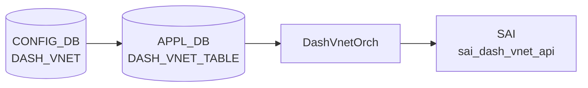

# DASH_VNET テーブル

## 概要

`DASH_VNET` は DPU (Data Processing Unit) 上で動作する [DASH](../../reference/glossary.md#term-dash) (Disaggregated APIs for SONiC Hosts) 仮想ネットワークを [CONFIG_DB](../../reference/glossary.md#term-config_db) に定義するテーブル。
各エントリは VNI (VXLAN Network Identifier) で識別される論理ネットワークを表す[^yang]。

DASH は SmartSwitch の DPU 上で動作する高性能パケット処理レイヤーで、クラウドネットワーキングのアクセラレーションを提供する。
`DASH_VNET` はその最上位のネットワーク境界を定義し、`DASH_ENI` (Elastic Network Interface) のグルーピング単位となる。

<!-- cdb-mermaid -->
### データフロー (自動生成)



!!! note "凡例"
    CONFIG_DB から SAI までの典型経路。詳細・例外は本ページ本文を参照。
<!-- /cdb-mermaid -->

## key 構造

```text
DASH_VNET|<name>
```

`<name>` は `Vnet[a-zA-Z0-9_-]+` パターン必須（YANG バリデーション。例: `Vnet1`, `Vnet-prod`）[^yang]。

## 主要フィールド

| フィールド | 型 | 必須 | 説明 |
|-----------|----|------|------|
| `vni` | uint32 (1..16777215) | 実質 yes | VXLAN Network Identifier。SAI に直接渡される唯一のフィールド |
| `guid` | string (1..255) | no | VNET 識別用 GUID。orchagent は参照しない (dead field) |
| `address_spaces` | IP prefix リスト | no | この VNET に属する IP プレフィックス群。orchagent は参照しない (dead field) |

## 制約

- `name` は `Vnet[a-zA-Z0-9_-]+` パターン必須[^yang]
- `vni` は `1..16777215` の範囲必須（YANG range constraint）
- `DASH_APPLIANCE` エントリが先に存在しないと VNET エントリは SAI に反映されない（orchagent がリトライ待ちになる）[^orch]

## 購読者

- **DashVnetOrch** (`sonic-swss/orchagent/dash/dashvnetorch.cpp`): [APPL_DB](../../reference/glossary.md#term-appl_db) `DASH_VNET_TABLE` を ZmqOrch 経由で購読。
  protobuf バイナリ形式のエントリを `parsePbMessage()` でデシリアライズし、`SAI_VNET_ATTR_VNI` を
  `sai_dash_vnet_api` に渡してハードウェア VNET エントリを作成する[^orch]。

## 関連 CONFIG_DB / YANG / CLI

- 関連 CONFIG_DB: `DASH_APPLIANCE`、`DASH_ENI`、`DASH_QOS`、`DASH_VNET_MAPPING_TABLE`
- 関連 YANG: `sonic-dash`

<!-- value-behavior -->
## 値依存挙動マトリクス

| フィールド | 値 | 実挙動 |
|-----------|-----|--------|
| `vni` | 1..16777215 | `SAI_VNET_ATTR_VNI` として SAI に渡される。VNET の L3 オーバーレイ識別子 |
| `vni` | 0 または範囲外 | YANG バリデーションで拒否 (`range 1..16777215`) |
| `guid` | 任意文字列 | orchagent は読まない。CONFIG_DB に保存されるのみ |
| `address_spaces` | IP prefix リスト | orchagent は読まない。CONFIG_DB に保存されるのみ |
| DASH_APPLIANCE 未設定時 | — | `addVnet()` が `"Retry as no appliance table entry found"` を記録してリトライ待ち |

<!-- /value-behavior -->

<!-- ordering -->
## 書込み順依存 (Phase B)

`DashVnetOrch` (`dashvnetorch.cpp`) は SET/DEL 操作の処理中に複数の外部テーブル存在チェックを行う。
これらが失敗すると当該エントリを消費キューに残してリトライ待ちとなる。

### 検出された順序依存

| # | 依存関係 | 方向 | 緩和策 |
|---|----------|------|--------|
| 1 | `DASH_APPLIANCE` SET → `DASH_VNET` SET | **必須先行**（欠如時 `addVnet()` がリトライ待ち・SAI 反映なし） | `DASH_APPLIANCE` 追加後の次イベントループで自動解消 |
| 2 | `DASH_VNET` SAI 反映完了 → `DASH_VNET_MAPPING_TABLE` SET | **必須先行**（`gVnetNameToId` 未登録の間は `addVnetMap()` がリトライ待ち） | VNET 作成後の次イベントループで自動解消 |
| 3 | `DASH_ROUTE_TYPE` SET → `DASH_VNET_MAPPING_TABLE` SET | **必須先行**（`routing_type` 未解決の間は `addOutboundCaToPa()` がリトライ待ち） | ROUTE_TYPE 追加後の次イベントループで自動解消 |
| 4 | `DASH_TUNNEL` / `DASH_PORT_MAP` SET → `DASH_VNET_MAPPING_TABLE` SET (PRIVATELINK) | **必須先行**（OID 未解決の間は `addOutboundCaToPa()` がリトライ待ち） | 依存リソース追加後の次イベントループで自動解消 |
| 5 | `DASH_VNET_MAPPING_TABLE` DEL → `DASH_VNET` DEL | **推奨先行**（VNET 先行 DEL は `underlay_ips` 参照不整合のリスク） | 逆順でも SAI 側参照カウントで部分的に保護される |

### 主要な制約詳細

**DASH_APPLIANCE 先行必須 (依存 #1)**: `addVnet()` (dashvnetorch.cpp:63-68) は
`DashOrch::hasApplianceEntry()` が `false` の場合、即 `return false` して消費キューに残す。
`DASH_VNET` を書く前に必ず `DASH_APPLIANCE` エントリを先に作成すること。
後から `DASH_APPLIANCE` を追加した場合は次イベントループで自動的に VNET 処理が再試行される。

**VNET_MAPPING の VNET 依存 (依存 #2)**: `addVnetMap()` (dashvnetorch.cpp:489-494) はグローバル
マップ `gVnetNameToId` を参照する。このマップには `addVnetPost()` (L101) で VNET の SAI 作成成功後に
エントリが追加される。`DASH_VNET_MAPPING_TABLE` の SET は VNET の SAI 反映完了後に行うこと。

**推奨 SET 順序**:

```
DASH_APPLIANCE → DASH_ROUTE_TYPE [→ DASH_TUNNEL / DASH_PORT_MAP] → DASH_VNET → DASH_VNET_MAPPING_TABLE
```

**推奨 DEL 順序**:

```
DASH_VNET_MAPPING_TABLE → DASH_VNET → DASH_APPLIANCE
```

<!-- /ordering -->

<!-- cross-refs -->
## 暗黙参照テーブル (Phase C)

`DASH_VNET` 自体は他テーブルへの YANG leafref を持たない（参照元ではなく**参照先**）。
他テーブルから `DASH_VNET|<name>` への YANG leafref と、実装レベルの暗黙依存を以下に示す。

### YANG leafref（DASH_VNET を参照する側）

| 参照元テーブル | leafref フィールド | 参照条件 | YANG evidence |
|--------------|-------------------|---------|----------------|
| `DASH_ENI` | `vnet` | 常時（ENI が所属する VNET） | `sonic-dash.yang:153-155` |
| `DASH_VNET_MAPPING_TABLE` | `vnet` (key) | 常時（マッピング対象 VNET） | `sonic-dash.yang:482-484` |
| `DASH_ROUTE_TABLE` | `vnet` | `action_type = 'vnet'` or `'vnet_direct'` のとき | `sonic-dash.yang:428-430` |

これらの leafref により、CLI 経由での `DASH_ENI` / `DASH_VNET_MAPPING_TABLE` / `DASH_ROUTE_TABLE`
書き込み時に、対応する `DASH_VNET` エントリが存在しない場合は YANG バリデーションで reject される。

### 実装レベルの暗黙参照

| 参照先リソース | 参照方向 | 条件 | evidence |
|--------------|---------|------|----------|
| `DASH_APPLIANCE`（`DashOrch::hasApplianceEntry()`） | 存在確認（ハードブロック） | `DASH_VNET` SET 時に常時チェック。`false` なら `addVnet()` がリトライ待ち | `dashvnetorch.cpp:63-68` |
| `gVnetNameToId` グローバルマップ | 書き込み（VNET 作成時）/ 消去（VNET 削除時） | `addVnetPost()` 成功時に登録。`DASH_VNET_MAPPING_TABLE` の `addVnetMap()` が同マップを参照 | `dashvnetorch.cpp:101, 167` |
| `CrmOrch` (`CRM_DASH_VNET` カウンタ) | refcount 更新 | VNET SAI 作成成功時 `inc`、削除成功時 `dec` | `dashvnetorch.cpp:103, 164` |

!!! note "DASH_VNET_MAPPING_TABLE の追加参照"
    `DASH_VNET_MAPPING_TABLE` のオーケストレーションは以下も参照する（DASH_VNET の間接依存）:

    - `DASH_ROUTE_TYPE` — `getRouteTypeActions()` で routing_type を解決 (`dashvnetorch.cpp:314-319`)
    - `DASH_TUNNEL` — `DashTunnelOrch::getTunnelOid()` でトンネル OID を解決 (`dashvnetorch.cpp:354-365`、`has_tunnel()` が true のとき)
    - `DASH_PORT_MAP` — `DashPortMapOrch::getPortMapOid()` でポートマップ OID を解決 (`dashvnetorch.cpp:409-422`、PRIVATELINK + `has_port_map()` が true のとき)

<!-- /cross-refs -->

<!-- failure -->
## 失敗挙動マトリクス (Phase D)

ソース: `sonic-net/sonic-swss/orchagent/dash/dashvnetorch.cpp`

### DASH_VNET SET 処理における失敗経路

| 失敗条件 | 検出箇所 | 結果 | ログ出力 | evidence |
|---|---|---|---|---|
| protobuf フィールド `pb` が欠如または不正 | `parsePbMessage()` (SET前) | エントリを consumer から即除去・SAI 反映なし | SWSS_LOG_WARN ("Requires protobuff at Vnet :%s") | `dashvnetorch.cpp:204-209` |
| `DASH_APPLIANCE` エントリが未設定 | `addVnet()` L63-68 | `return false` でリトライ待ち。`vnet_table_` / `gVnetNameToId` 未更新。SAI 未反映 | SWSS_LOG_INFO ("Retry as no appliance table entry found") | `dashvnetorch.cpp:63-68` |
| 同名 VNET が既に存在する (`vnet_table_` に同 key) | `addVnet()` L57-62 | 重複として `return true`・bulker には渡さない。既存エントリを上書きせず consumer から除去 | SWSS_LOG_WARN ("Vnet already exists for %s") | `dashvnetorch.cpp:57-62` |
| SAI `create_entry` がバルク処理後に `SAI_NULL_OBJECT_ID` を返す | `addVnetPost()` L93-97 | `return false`・`vnet_table_` / `gVnetNameToId` 未更新・CRM カウンタ増加なし | SWSS_LOG_ERROR ("Failed to create vnet entry for %s") | `dashvnetorch.cpp:93-97` |
| 不明コマンド (`op` が SET でも DEL でもない) | `doTaskVnetTable()` L238-239 | エントリを即除去。処理なし | SWSS_LOG_ERROR ("Invalid command %s") | `dashvnetorch.cpp:238-239` |

### DASH_VNET DEL 処理における失敗経路

| 失敗条件 | 検出箇所 | 結果 | ログ出力 | evidence |
|---|---|---|---|---|
| 存在しない VNET を DEL | `removeVnet()` L114-119 | `return true` で consumer から即除去 (no-op) | SWSS_LOG_WARN ("Failed to find vnet entry %s to remove") | `dashvnetorch.cpp:114-119` |
| SAI remove が `SAI_STATUS_NOT_EXECUTED` を返す | `removeVnetPost()` L152-155 | `return false` でリトライ待ち。`vnet_table_` / `gVnetNameToId` 未クリア | なし | `dashvnetorch.cpp:152-155` |
| SAI remove がその他エラーステータスを返す | `removeVnetPost()` L156-161 | `SWSS_LOG_ERROR` + `handleSaiRemoveStatus()` 呼び出し | SWSS_LOG_ERROR ("Failed to remove vnet entry for %s") | `dashvnetorch.cpp:156-161` |
| PA validation エントリに `SAI_STATUS_OBJECT_IN_USE` | `removePaValidationPost()` L689-695 | そのエントリのみリトライ待ち・`underlay_ips` から消去されない。VNET 削除もブロック | SWSS_LOG_INFO ("PA validation entry for Vnet %s IP %s still in use") | `dashvnetorch.cpp:689-695` |

### DASH_VNET_MAPPING_TABLE SET 処理における失敗経路

| 失敗条件 | 検出箇所 | 結果 | ログ出力 | evidence |
|---|---|---|---|---|
| `gVnetNameToId` に対象 VNET 名が未登録 | `addVnetMap()` L489-494 | `return false` でリトライ待ち | SWSS_LOG_INFO ("Not creating VNET map for %s since VNET %s doesn't exist") | `dashvnetorch.cpp:489-494` |
| `routing_type` が `DASH_ROUTE_TYPE` に未登録 | `addOutboundCaToPa()` L315-319 | `return false` でリトライ待ち | SWSS_LOG_INFO ("Failed to get route type actions for %s") | `dashvnetorch.cpp:315-319` |
| `encap_type` が VXLAN / NVGRE 以外の STATICENCAP アクション | `addOutboundCaToPa()` L335-339 | `return true` で consumer から即除去 (破棄)。SAI 未反映 | SWSS_LOG_ERROR ("Invalid encap type %d for %s") | `dashvnetorch.cpp:335-339` |
| `has_tunnel()` = true だが `getTunnelOid()` が `SAI_NULL_OBJECT_ID` | `addOutboundCaToPa()` L356-361 | `return false` でリトライ待ち | SWSS_LOG_INFO ("Tunnel %s for VnetMap %s does not exist yet") | `dashvnetorch.cpp:356-361` |
| PRIVATELINK + `has_port_map()` = true だが `getPortMapOid()` が `SAI_NULL_OBJECT_ID` | `addOutboundCaToPa()` L411-418 | `return false` でリトライ待ち | SWSS_LOG_ERROR ("Portmap %s for VnetMap %s does not exist yet") | `dashvnetorch.cpp:411-418` |
| SAI `create_entry` (outbound_ca_to_pa) が `SAI_STATUS_ITEM_ALREADY_EXISTS` | `addOutboundCaToPaPost()` L512-515 | `return true` (冪等成功扱い)。CRM カウンタ増加なし | なし | `dashvnetorch.cpp:512-515` |
| SAI `create_entry` (outbound_ca_to_pa) がその他エラー | `addOutboundCaToPaPost()` L517-522 | SWSS_LOG_ERROR + handleSaiCreateStatus + parseHandleSaiStatusFailure | SWSS_LOG_ERROR ("Failed to create CA to PA entry for %s") | `dashvnetorch.cpp:517-522` |
| SAI `create_entry` (pa_validation) が `SAI_STATUS_ITEM_ALREADY_EXISTS` | `addPaValidationPost()` L548-551 | `return true` (冪等成功扱い) | なし | `dashvnetorch.cpp:548-551` |
| SAI `create_entry` (pa_validation) がその他エラー | `addPaValidationPost()` L553-558 | SWSS_LOG_ERROR + handleSaiCreateStatus + parseHandleSaiStatusFailure | SWSS_LOG_ERROR ("Failed to create PA validation entry for %s") | `dashvnetorch.cpp:553-558` |

### DASH_VNET_MAPPING_TABLE DEL 処理における失敗経路

| 失敗条件 | 検出箇所 | 結果 | ログ出力 | evidence |
|---|---|---|---|---|
| SAI remove (outbound_ca_to_pa) が `SAI_STATUS_NOT_EXECUTED` | `removeOutboundCaToPaPost()` L643-645 | `return false` でリトライ待ち | なし | `dashvnetorch.cpp:643-645` |
| SAI remove (outbound_ca_to_pa) が `SAI_STATUS_ITEM_NOT_FOUND` | `removeOutboundCaToPaPost()` L648-651 | `return true` (冪等成功扱い) | SWSS_LOG_WARN ("Outbound CA to PA entry for %s already removed") | `dashvnetorch.cpp:648-651` |
| SAI remove (outbound_ca_to_pa) がその他エラー | `removeOutboundCaToPaPost()` L654-659 | SWSS_LOG_ERROR + handleSaiRemoveStatus | SWSS_LOG_ERROR ("Failed to remove outbound CA to PA entry for %s") | `dashvnetorch.cpp:654-659` |

### 補足

- **リトライ待ちのメカニズム**: `return false` は consumer の `m_toSync` からエントリを消費せず次のイベントループで再試行される。依存リソースが追加されると自動的に解消する。
- **冪等処理 (`return true`)**: 重複 VNET / 存在しない VNET DEL / `SAI_STATUS_ITEM_ALREADY_EXISTS` はすべて成功扱いで consumer から除去される。
- **DASH_RESULT_FAILURE の書き込み**: `addVnetPost()` / `addVnetMapPost()` が `false` を返した場合、APP_STATE_DB の result table に `DASH_RESULT_FAILURE` が書き込まれる (`dashvnetorch.cpp:280-283, 848-851`)。
- **protobuf 不正の非リトライ**: `parsePbMessage()` 失敗時は即 erase されるためリトライされない。不正エントリは破棄される。
- **PA validation の参照カウント保護**: `SAI_STATUS_OBJECT_IN_USE` で残った PA validation エントリが `underlay_ips` に残存し、VNET 削除自体もブロックされる。`DASH_VNET_MAPPING_TABLE` を先に削除してから `DASH_VNET` を削除する順序を守ることで回避できる。

<!-- /failure -->

<!-- constants -->
## ハードコード定数 (Phase E)

> **調査根拠**: `sonic-swss/orchagent/dash/dashvnetorch.cpp` 全行 + `dashorch.h:35-36` + `crmorch.h:38,45-48` + `sonic-swss-common/common/schema.h:172,184-185,188` 精読 (2026-05-17)

### 結果コード定数（dashorch.h）

| 定数名 | 値 | 用途 |
|--------|-----|------|
| `DASH_RESULT_SUCCESS` | `0` | APPL_STATE_DB result table への成功コード (`dashorch.h:35`) |
| `DASH_RESULT_FAILURE` | `1` | APPL_STATE_DB result table への失敗コード (`dashorch.h:36`) |

### APPL_DB テーブル名文字列定数（schema.h）

| 定数名 | 値 | ソース |
|--------|-----|--------|
| `APP_DASH_VNET_TABLE_NAME` | `"DASH_VNET_TABLE"` | `schema.h:172` |
| `APP_DASH_VNET_MAPPING_TABLE_NAME` | `"DASH_VNET_MAPPING_TABLE"` | `schema.h:188` |
| `APP_DASH_APPLIANCE_TABLE_NAME` | `"DASH_APPLIANCE_TABLE"` | `schema.h:185` |
| `APP_DASH_ROUTING_TYPE_TABLE_NAME` | `"DASH_ROUTING_TYPE_TABLE"` | `schema.h:184` |

### PA validation action 固定値

- `SAI_PA_VALIDATION_ENTRY_ACTION_PERMIT` が `addPaValidation()` で**常に**設定される（`dashvnetorch.cpp:474-475`）。
- CONFIG_DB でユーザーが変更する手段は存在しない（PA validation は常に PERMIT 固定）。

### encap_type 初期値と変換

| protobuf 値 | SAI 変換先 | ソース |
|------------|-----------|--------|
| `ENCAP_TYPE_VXLAN` | `SAI_DASH_ENCAPSULATION_VXLAN` | `dashvnetorch.cpp:328-329` |
| `ENCAP_TYPE_NVGRE` | `SAI_DASH_ENCAPSULATION_NVGRE` | `dashvnetorch.cpp:333-334` |
| それ以外 / 未設定 | `SAI_DASH_ENCAPSULATION_INVALID`（初期値） | `dashvnetorch.cpp:322` → SWSS_LOG_ERROR |

### CRM リソースタイプ定数（crmorch.h）

| 定数名 | inc/dec タイミング | ソース |
|--------|-------------------|--------|
| `CRM_DASH_VNET` | VNET 作成 (`addVnetPost`) / 削除 (`removeVnetPost`) | `dashvnetorch.cpp:103, 164` |
| `CRM_DASH_IPV4_OUTBOUND_CA_TO_PA` | IPv4 CA to PA 作成/削除時 | `dashvnetorch.cpp:525, 662` |
| `CRM_DASH_IPV6_OUTBOUND_CA_TO_PA` | IPv6 CA to PA 作成/削除時 | `dashvnetorch.cpp:525, 662` |
| `CRM_DASH_IPV4_PA_VALIDATION` | IPv4 PA validation 作成/削除時 | `dashvnetorch.cpp:561, 706` |
| `CRM_DASH_IPV6_PA_VALIDATION` | IPv6 PA validation 作成/削除時 | `dashvnetorch.cpp:561, 706` |

### グローバルマップ定数

- `gVnetNameToId` (`std::unordered_map<std::string, sai_object_id_t>`) — `dashvnetorch.cpp:33` でグローバル宣言。
  VNET 作成時に `addVnetPost()` で追加、削除時に `removeVnetPost()` で erase。
  `DASH_VNET_MAPPING_TABLE` の `addVnetMap()` (`L489`) がこのマップを参照するため、
  VNET エントリが存在しない状態での VNET_MAPPING SET は即 `false` 返却となる[^orch]。

### SAI 返却ステータス固定判定値

| SAI ステータス | 判定箇所 | 挙動 |
|--------------|---------|------|
| `SAI_STATUS_NOT_EXECUTED` | VNET/CA to PA DEL post-op | retry（bulker 未実行扱い） |
| `SAI_STATUS_OBJECT_IN_USE` | PA validation DEL post-op | retry（参照カウント有り） |
| `SAI_STATUS_ITEM_ALREADY_EXISTS` | CA to PA / PA validation SET post-op | 正常完了扱い（重複は許容） |
| `SAI_STATUS_ITEM_NOT_FOUND` | CA to PA DEL post-op | 警告のみ、正常完了扱い |

<!-- /constants -->

<!-- side-effects -->
## 副次 DB 書込 (Phase F)

`DashVnetOrch` は SAI (ASIC_DB) へのバルク書き込みに加えて、以下の DB 副次書込を行う[^orch]。

### DASH_VNET SET

| 操作 | 対象 DB / テーブル | キー | 条件 |
|------|-----------------|------|------|
| `writeResultToDB(..., DASH_RESULT_SUCCESS)` | APPL_STATE_DB / `DASH_VNET_TABLE` | `<vnet_name>` | SET が consumer から除去される時点（成功時） |
| `writeResultToDB(..., DASH_RESULT_FAILURE)` | APPL_STATE_DB / `DASH_VNET_TABLE` | `<vnet_name>` | `addVnetPost()` が `false` を返した時点 |
| `gCrmOrch->incCrmResUsedCounter(CRM_DASH_VNET)` | CRM 内部カウンタ | — | SAI `create_entry` が `SAI_NULL_OBJECT_ID` 以外を返した場合 |

### DASH_VNET DEL

| 操作 | 対象 DB / テーブル | キー | 条件 |
|------|-----------------|------|------|
| `removeResultFromDB(...)` | APPL_STATE_DB / `DASH_VNET_TABLE` | `<vnet_name>` | DEL が consumer から除去される時点（成功時） |
| `gCrmOrch->decCrmResUsedCounter(CRM_DASH_VNET)` | CRM 内部カウンタ | — | SAI remove が `SAI_STATUS_SUCCESS` を返した場合 |

### DASH_VNET_MAPPING_TABLE SET / DEL

| 操作 | 対象 DB / テーブル | キー | 条件 |
|------|-----------------|------|------|
| `writeResultToDB(..., DASH_RESULT_SUCCESS/FAILURE)` | APPL_STATE_DB / `DASH_VNET_MAPPING_TABLE` | `<vnet_name>:<dip>` | SET 成功/失敗時 |
| `removeResultFromDB(...)` | APPL_STATE_DB / `DASH_VNET_MAPPING_TABLE` | `<vnet_name>:<dip>` | DEL 成功時 |
| `gCrmOrch->inc/decCrmResUsedCounter(CRM_DASH_IPV4/IPV6_OUTBOUND_CA_TO_PA)` | CRM 内部カウンタ | — | CA to PA SAI 作成/削除成功時（`dip.isV4()` で IPv4/IPv6 分岐） |
| `gCrmOrch->inc/decCrmResUsedCounter(CRM_DASH_IPV4/IPV6_PA_VALIDATION)` | CRM 内部カウンタ | — | PA validation SAI 作成/削除成功時 |

### グローバルマップへの副次書込

`gVnetNameToId`（プロセスメモリ上のグローバルマップ `unordered_map<string, sai_object_id_t>`）は DB ではないが、
`DASH_VNET_MAPPING_TABLE` の処理がこれを参照するため実質的な副次状態として機能する[^orch]。

| 操作 | タイミング | evidence |
|------|-----------|----------|
| `gVnetNameToId[vnet_name] = id` （追記） | `addVnetPost()` SAI 成功時 | `dashvnetorch.cpp:101` |
| `gVnetNameToId.erase(vnet_name)` （消去） | `removeVnetPost()` SAI 成功時 | `dashvnetorch.cpp:167` |

### 副次書込が行われない DB

STATE_DB・CONFIG_DB・FLEX_COUNTER_DB・COUNTERS_DB への書き込みは一切行われない[^orch]。

<!-- /side-effects -->

<!-- pubsub -->
## 通信メカニズム (Phase G)

### ZMQ チャネル経由の購読 — `ZmqConsumerStateTable`

`DashVnetOrch` は `ZmqOrch` を継承し、通常の Redis `ConsumerStateTable` ではなく
**ZeroMQ (`ZmqConsumerStateTable`) チャネル**で APPL_DB (DPU_APPL_DB) を購読する。

```cpp
// orchdaemon.cpp:1333-1340
vector<string> dash_vnet_tables = {
    APP_DASH_VNET_TABLE_NAME,          // "DASH_VNET_TABLE"
    APP_DASH_VNET_MAPPING_TABLE_NAME   // "DASH_VNET_MAPPING_TABLE"
};
DashVnetOrch *dash_vnet_orch = new DashVnetOrch(
    m_dpu_appDb, dash_vnet_tables, m_dpu_appstateDb, dash_zmq_server);
```

`ZmqOrch::addConsumer()` が ZMQ サーバが有効な場合に `ZmqConsumerStateTable` を生成する。
ZMQ が無効（`nullptr`）の場合は通常の `ConsumerStateTable` にフォールバックする。

### イベントディスパッチフロー

```
gnmi-server (gNMI 北行インターフェース)
    └─ DPU_APPL_DB
           DASH_VNET_TABLE / DASH_VNET_MAPPING_TABLE
               ↓ ZMQ channel (または Redis ConsumerStateTable)
    ZmqConsumerStateTable::pops()
    ZmqConsumer::execute() → drain()
    DashVnetOrch::doTask(ConsumerBase&)
        ├─ "DASH_VNET_TABLE"         → doTaskVnetTable()
        └─ "DASH_VNET_MAPPING_TABLE" → doTaskVnetMapTable()
```

### SAI バルク呼び出し

各 `doTask*()` 内でイテレーション後に bulker を `flush()` し一括 SAI 送信する:

| Bulker | SAI API | `flush()` タイミング |
|--------|---------|---------------------|
| `vnet_bulker_` (`ObjectBulker<sai_dash_vnet_api_t>`) | `create_vnets()` / `remove_vnets()` | `doTaskVnetTable()` 内 |
| `outbound_ca_to_pa_bulker_` (`EntityBulker`) | `create/remove_outbound_ca_to_pa_entries()` | `doTaskVnetMapTable()` 内 |
| `pa_validation_bulker_` (`EntityBulker`) | `create/remove_pa_validation_entries()` | `doTaskVnetMapTable()` 内 |

### APPL_STATE_DB への結果書き戻し

処理結果は `DPU_APPL_STATE_DB` の対応テーブルへ書き戻される（CONFIG_DB への書き戻しはなし）:

| 操作 | 結果テーブル | 値 |
|------|------------|-----|
| VNET SET 成功 | APPL_STATE_DB / `DASH_VNET_TABLE` | `DASH_RESULT_SUCCESS (0)` |
| VNET SET 失敗 (post-op `false`) | 同上 | `DASH_RESULT_FAILURE (1)` |
| VNET DEL 成功 | 同上 | エントリ削除 |
| VNET_MAPPING SET 成功/失敗 | APPL_STATE_DB / `DASH_VNET_MAPPING_TABLE` | `DASH_RESULT_SUCCESS/FAILURE` |

### CONFIG_DB との関係

`DashVnetOrch` は CONFIG_DB `DASH_VNET` を**直接購読しない**。
CONFIG_DB への書き込み（CLI / sonic-cfggen）は gnmi-server が検知し APPL_DB へ転送する経路を取る。
keyspace 通知による CONFIG_DB 直接購読は存在しない[^orch]。

### フィーチャフラグ

`ORCH_NORTHBOND_DASH_ZMQ_ENABLED`（デフォルト `true`）が ZMQ モードを制御する。
無効時は `ConsumerStateTable`（Redis Pub/Sub）にフォールバックし、テスト環境・後方互換で使用される。

> **Evidence**: `orchdaemon.cpp:1325-1345`（DashVnetOrch 登録・ZMQ フィーチャフラグ）、`zmqorch.cpp` 全行（ZmqConsumer / ZmqOrch 実装）、`dashvnetorch.cpp:42-51`（コンストラクタ）、`dashvnetorch.cpp:869-884`（doTask ディスパッチ）; 詳細分析 `meta/_intermediate/cdb-flow/dash-vnet-pubsub.md`

<!-- /pubsub -->

## 設定例

```json
{
  "DASH_VNET": {
    "Vnet1": {
      "vni": "45654",
      "guid": "559c6ce8-26ab-4193-b946-ccc6e8f930b2"
    }
  }
}
```

## 引用元

[^yang]: YANG 定義: `sonic-dash.yang`. <https://github.com/sonic-net/sonic-buildimage/blob/9ea932ec2e18f35e58268ec2e4456b1d4afd65cd/src/sonic-yang-models/yang-models/sonic-dash.yang>
[^orch]: orchagent 実装: `dashvnetorch.cpp`. <https://github.com/sonic-net/sonic-swss/blob/4305596156d70e9797e8a881b3d19b46de0bce0d/orchagent/dash/dashvnetorch.cpp>

<!-- platform -->
## プラットフォーム差 (Phase H)

`DASH_VNET` / `DASH_VNET_MAPPING_TABLE` の処理は **`switch_type=dpu` のノード専用**であり、伝統的な ASIC ベンダー別分岐（mellanox / broadcom / barefoot 等）は存在しない。

### 動作条件: switch_type=dpu のみ

`main.cpp:990-994` — `gMySwitchType == "dpu"` の場合のみ `DpuOrchDaemon` が生成され、`DashVnetOrch` が登録される。

| switch_type | DashVnetOrch 起動 | 備考 |
|-------------|-------------------|------|
| `"dpu"` | **起動** | SmartSwitch の DPU ロール。DPU_APPL_DB に接続 |
| `""` / `"voq"` / `"fabric"` / `"chassis-packet"` | **不起動** | 通常 T0/T1 / VOQ chassis / fabric blade |
| SmartSwitch NPU 側 (`switch_sub_type=SmartSwitch` かつ `switch_type != "dpu"`) | **不起動** | NPU 側では DASH orchagent は登録されない (`orchdaemon.cpp:613`) |

`DashVnetOrch` は `DPU_APPL_DB` (`m_dpu_appDb`) を購読し、結果を `DPU_APPL_STATE_DB` に書き戻す。通常の `APPL_DB` とは独立したデータベース接続である (`orchdaemon.cpp:1335-1339`)[^orch]。

### SAI_API_DASH_VNET — ベンダー分岐なし

`saihelper.cpp:253-254` で `sai_api_query((sai_api_t)SAI_API_DASH_VNET, ...)` を一律呼び出す。`dashvnetorch.cpp` の `addVnet()` / `addVnetMap()` / `addOutboundCaToPa()` には環境変数 `platform` / `sub_platform` の参照が一切なく、SAI DASH extension API がベンダー差を抽象化する[^orch]。

### IPv4 / IPv6 の差異

プラットフォーム差ではなくアドレスファミリ差として、CRM カウンタが分岐する:

| 操作 | CRM カウンタ |
|------|------------|
| VNET 作成/削除 | `CRM_DASH_VNET` (共通) |
| Outbound CA-to-PA 作成/削除 | `CRM_DASH_IPV4_OUTBOUND_CA_TO_PA` / `CRM_DASH_IPV6_OUTBOUND_CA_TO_PA` (`ctxt.dip.isV4()` で分岐) |
| PA Validation 作成/削除 | `CRM_DASH_IPV4_PA_VALIDATION` / `CRM_DASH_IPV6_PA_VALIDATION` (`underlay_ip.has_ipv4()` で分岐) |

ただしこれはネットワークアドレスのアドレスファミリによる区別であり、動作するハードウェア ASIC ベンダーには依存しない (`dashvnetorch.cpp:525, 561, 706`)[^orch]。

!!! note "T0/T1/VOQ chassis 環境"
    `DASH_VNET` テーブルは `DPU_APPL_DB` にのみ存在する。T0/T1/VOQ chassis の `APPL_DB` には `DASH_VNET_TABLE` エントリが存在せず、`DashVnetOrch` も起動しない。

!!! note "gMaxBulkSize チューニング"
    `vnet_bulker_` / `outbound_ca_to_pa_bulker_` / `pa_validation_bulker_` が使う `gMaxBulkSize` はコマンドライン引数 `--max-bulk-size` で制御するデプロイ時パラメータ。ASIC ベンダー別のデフォルト差はない。

> **Evidence**: `main.cpp:990-994`（DpuOrchDaemon 起動条件）、`orchdaemon.cpp:613, 1335-1339`（DashVnetOrch 登録）、`saihelper.cpp:253-254`（SAI_API_DASH_VNET 初期化）、`dashvnetorch.cpp:42-51, 525, 561, 706`（コンストラクタ・CRM 分岐）; 詳細分析 `meta/_intermediate/cdb-flow/dash-vnet-platform.md`

<!-- /platform -->

<!-- defaults -->
## コード由来の暗黙デフォルト

### DASH_VNET

| フィールド | YANG default | コード実装デフォルト | 出典 |
|-----------|-------------|---------------------|------|
| `vni` | なし (range 1..16777215) | 省略不可。protobuf デフォルト `0` は YANG range で拒否 | sonic-dash.yang:53-58; dashvnetorch.cpp:72-74 |
| `guid` | なし | orchagent 未参照 (dead field)。CONFIG_DB 保存のみ | dashvnetorch.h:20-24; dashvnetorch.cpp 全行 |
| `address_spaces` | なし (空リスト) | orchagent 未参照 (dead field)。SAI 反映経路なし | sonic-dash.yang:67-71; dashvnetorch.cpp 全行 |

### 注記

- **`guid` の dead field 性**: `VnetEntry` 構造体 (`dashvnetorch.h:20-24`) は `{ sai_object_id_t vni; dash::vnet::Vnet metadata; std::set<std::string> underlay_ips; }` のみ。`addVnet()` では `metadata.vni()` のみ SAI 属性として使用し、`guid` フィールドは読み取られない[^orch]。
- **`address_spaces` の dead field 性**: `addVnet()` / `addVnetPost()` の全コードを確認したが、`address_spaces` を参照する行が存在しない。YANG スキーマ上は IP prefix リストとして定義されているが、DPU 側の SAI API には渡されない[^orch]。
- **protobuf ベースの設計**: DASH VNET は CONFIG_DB の YANG フィールドを直接 orchagent が読むのではなく、protobuf シリアライズバイナリを APPL_DB `DASH_VNET_TABLE` 経由で渡す設計。`parsePbMessage()` が `pb` フィールドをデシリアライズする[^orch]。
- **DASH_APPLIANCE 前提条件**: `DashOrch::hasApplianceEntry()` が `false` の場合、VNET 追加がリトライ待ちになる。DASH_VNET より先に DASH_APPLIANCE を設定する必要がある[^orch]。

<!-- /defaults -->

<!-- glossary-links-injected: dash-vnet-001 -->
