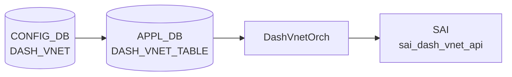

# DASH_VNET テーブル

## 概要

`DASH_VNET` は DPU (Data Processing Unit) 上で動作する [DASH](../../reference/glossary.md#term-dash) (Disaggregated APIs for SONiC Hosts) 仮想ネットワークを [CONFIG_DB](../../reference/glossary.md#term-config_db) に定義するテーブル。
各エントリは VNI (VXLAN Network Identifier) で識別される論理ネットワークを表す[^yang]。

DASH は SmartSwitch の DPU 上で動作する高性能パケット処理レイヤーで、クラウドネットワーキングのアクセラレーションを提供する。
`DASH_VNET` はその最上位のネットワーク境界を定義し、`DASH_ENI` (Elastic Network Interface) のグルーピング単位となる。

<!-- cdb-mermaid -->
### データフロー (自動生成)



!!! note "凡例"
    CONFIG_DB から SAI までの典型経路。詳細・例外は本ページ本文を参照。
<!-- /cdb-mermaid -->

## key 構造

```text
DASH_VNET|<name>
```

`<name>` は `Vnet[a-zA-Z0-9_-]+` パターン必須（YANG バリデーション。例: `Vnet1`, `Vnet-prod`）[^yang]。

## 主要フィールド

| フィールド | 型 | 必須 | 説明 |
|-----------|----|------|------|
| `vni` | uint32 (1..16777215) | 実質 yes | VXLAN Network Identifier。SAI に直接渡される唯一のフィールド |
| `guid` | string (1..255) | no | VNET 識別用 GUID。orchagent は参照しない (dead field) |
| `address_spaces` | IP prefix リスト | no | この VNET に属する IP プレフィックス群。orchagent は参照しない (dead field) |

## 制約

- `name` は `Vnet[a-zA-Z0-9_-]+` パターン必須[^yang]
- `vni` は `1..16777215` の範囲必須（YANG range constraint）
- `DASH_APPLIANCE` エントリが先に存在しないと VNET エントリは SAI に反映されない（orchagent がリトライ待ちになる）[^orch]

## 購読者

- **DashVnetOrch** (`sonic-swss/orchagent/dash/dashvnetorch.cpp`): [APPL_DB](../../reference/glossary.md#term-appl_db) `DASH_VNET_TABLE` を ZmqOrch 経由で購読。
  protobuf バイナリ形式のエントリを `parsePbMessage()` でデシリアライズし、`SAI_VNET_ATTR_VNI` を
  `sai_dash_vnet_api` に渡してハードウェア VNET エントリを作成する[^orch]。

## 関連 CONFIG_DB / YANG / CLI

- 関連 CONFIG_DB: `DASH_APPLIANCE`、`DASH_ENI`、`DASH_QOS`、`DASH_VNET_MAPPING_TABLE`
- 関連 YANG: `sonic-dash`

<!-- value-behavior -->
## 値依存挙動マトリクス

| フィールド | 値 | 実挙動 |
|-----------|-----|--------|
| `vni` | 1..16777215 | `SAI_VNET_ATTR_VNI` として SAI に渡される。VNET の L3 オーバーレイ識別子 |
| `vni` | 0 または範囲外 | YANG バリデーションで拒否 (`range 1..16777215`) |
| `guid` | 任意文字列 | orchagent は読まない。CONFIG_DB に保存されるのみ |
| `address_spaces` | IP prefix リスト | orchagent は読まない。CONFIG_DB に保存されるのみ |
| DASH_APPLIANCE 未設定時 | — | `addVnet()` が `"Retry as no appliance table entry found"` を記録してリトライ待ち |

<!-- /value-behavior -->

<!-- ordering -->
## 書込み順依存 (Phase B)

`DashVnetOrch` (`dashvnetorch.cpp`) は SET/DEL 操作の処理中に複数の外部テーブル存在チェックを行う。
これらが失敗すると当該エントリを消費キューに残してリトライ待ちとなる。

### 検出された順序依存

| # | 依存関係 | 方向 | 緩和策 |
|---|----------|------|--------|
| 1 | `DASH_APPLIANCE` SET → `DASH_VNET` SET | **必須先行**（欠如時 `addVnet()` がリトライ待ち・SAI 反映なし） | `DASH_APPLIANCE` 追加後の次イベントループで自動解消 |
| 2 | `DASH_VNET` SAI 反映完了 → `DASH_VNET_MAPPING_TABLE` SET | **必須先行**（`gVnetNameToId` 未登録の間は `addVnetMap()` がリトライ待ち） | VNET 作成後の次イベントループで自動解消 |
| 3 | `DASH_ROUTE_TYPE` SET → `DASH_VNET_MAPPING_TABLE` SET | **必須先行**（`routing_type` 未解決の間は `addOutboundCaToPa()` がリトライ待ち） | ROUTE_TYPE 追加後の次イベントループで自動解消 |
| 4 | `DASH_TUNNEL` / `DASH_PORT_MAP` SET → `DASH_VNET_MAPPING_TABLE` SET (PRIVATELINK) | **必須先行**（OID 未解決の間は `addOutboundCaToPa()` がリトライ待ち） | 依存リソース追加後の次イベントループで自動解消 |
| 5 | `DASH_VNET_MAPPING_TABLE` DEL → `DASH_VNET` DEL | **推奨先行**（VNET 先行 DEL は `underlay_ips` 参照不整合のリスク） | 逆順でも SAI 側参照カウントで部分的に保護される |

### 主要な制約詳細

**DASH_APPLIANCE 先行必須 (依存 #1)**: `addVnet()` (dashvnetorch.cpp:63-68) は
`DashOrch::hasApplianceEntry()` が `false` の場合、即 `return false` して消費キューに残す。
`DASH_VNET` を書く前に必ず `DASH_APPLIANCE` エントリを先に作成すること。
後から `DASH_APPLIANCE` を追加した場合は次イベントループで自動的に VNET 処理が再試行される。

**VNET_MAPPING の VNET 依存 (依存 #2)**: `addVnetMap()` (dashvnetorch.cpp:489-494) はグローバル
マップ `gVnetNameToId` を参照する。このマップには `addVnetPost()` (L101) で VNET の SAI 作成成功後に
エントリが追加される。`DASH_VNET_MAPPING_TABLE` の SET は VNET の SAI 反映完了後に行うこと。

**推奨 SET 順序**:

```
DASH_APPLIANCE → DASH_ROUTE_TYPE [→ DASH_TUNNEL / DASH_PORT_MAP] → DASH_VNET → DASH_VNET_MAPPING_TABLE
```

**推奨 DEL 順序**:

```
DASH_VNET_MAPPING_TABLE → DASH_VNET → DASH_APPLIANCE
```

<!-- /ordering -->

## 設定例

```json
{
  "DASH_VNET": {
    "Vnet1": {
      "vni": "45654",
      "guid": "559c6ce8-26ab-4193-b946-ccc6e8f930b2"
    }
  }
}
```

## 引用元

[^yang]: YANG 定義: `sonic-dash.yang`. <https://github.com/sonic-net/sonic-buildimage/blob/9ea932ec2e18f35e58268ec2e4456b1d4afd65cd/src/sonic-yang-models/yang-models/sonic-dash.yang>
[^orch]: orchagent 実装: `dashvnetorch.cpp`. <https://github.com/sonic-net/sonic-swss/blob/4305596156d70e9797e8a881b3d19b46de0bce0d/orchagent/dash/dashvnetorch.cpp>

<!-- defaults -->
## コード由来の暗黙デフォルト

### DASH_VNET

| フィールド | YANG default | コード実装デフォルト | 出典 |
|-----------|-------------|---------------------|------|
| `vni` | なし (range 1..16777215) | 省略不可。protobuf デフォルト `0` は YANG range で拒否 | sonic-dash.yang:53-58; dashvnetorch.cpp:72-74 |
| `guid` | なし | orchagent 未参照 (dead field)。CONFIG_DB 保存のみ | dashvnetorch.h:20-24; dashvnetorch.cpp 全行 |
| `address_spaces` | なし (空リスト) | orchagent 未参照 (dead field)。SAI 反映経路なし | sonic-dash.yang:67-71; dashvnetorch.cpp 全行 |

### 注記

- **`guid` の dead field 性**: `VnetEntry` 構造体 (`dashvnetorch.h:20-24`) は `{ sai_object_id_t vni; dash::vnet::Vnet metadata; std::set<std::string> underlay_ips; }` のみ。`addVnet()` では `metadata.vni()` のみ SAI 属性として使用し、`guid` フィールドは読み取られない[^orch]。
- **`address_spaces` の dead field 性**: `addVnet()` / `addVnetPost()` の全コードを確認したが、`address_spaces` を参照する行が存在しない。YANG スキーマ上は IP prefix リストとして定義されているが、DPU 側の SAI API には渡されない[^orch]。
- **protobuf ベースの設計**: DASH VNET は CONFIG_DB の YANG フィールドを直接 orchagent が読むのではなく、protobuf シリアライズバイナリを APPL_DB `DASH_VNET_TABLE` 経由で渡す設計。`parsePbMessage()` が `pb` フィールドをデシリアライズする[^orch]。
- **DASH_APPLIANCE 前提条件**: `DashOrch::hasApplianceEntry()` が `false` の場合、VNET 追加がリトライ待ちになる。DASH_VNET より先に DASH_APPLIANCE を設定する必要がある[^orch]。

<!-- /defaults -->

<!-- glossary-links-injected: dash-vnet-001 -->
