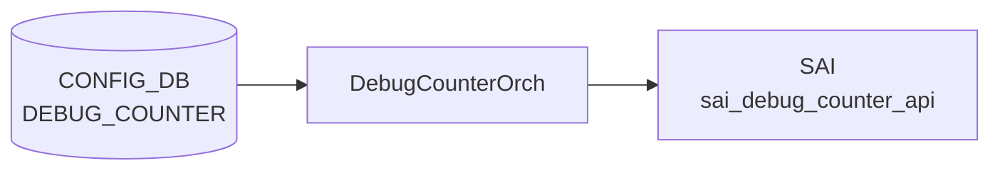

# DEBUG_COUNTER テーブル

## 概要

[SAI](../../reference/glossary.md#term-sai) debug counter（パケットドロップ要因別の汎用カウンタ）を [CONFIG_DB](../../reference/glossary.md#term-config_db) から定義するテーブル[^1]。`debugcounterorch` ([orchagent](../../reference/glossary.md#term-orchagent)) が消費し、[SAI](../../reference/glossary.md#term-sai) debug counter オブジェクトを作成する。各カウンタには別テーブル `DEBUG_COUNTER_DROP_REASON` でドロップ理由 (`L3_ANY`、`SMAC_EQUALS_DMAC` 等) が紐付く。

<!-- cdb-mermaid -->
### データフロー (自動生成)



!!! note "凡例"
    CONFIG_DB から SAI までの典型経路を `docs/reference/config-db-orch-map.md` から機械生成したミニ図。詳細・例外は本ページ本文と対応表を参照。
<!-- /cdb-mermaid -->

## key 構造

```text
DEBUG_COUNTER|<name>
DEBUG_COUNTER_DROP_REASON|<name>|<reason>
DEBUG_DROP_MONITOR|CONFIG          # global setting (container)
```

## フィールド (`DEBUG_COUNTER_LIST`)

| フィールド | 型 | 既定値 | 説明 |
|-----------|----|--------|------|
| `name` | string | - | カウンタ識別名（key） |
| `alias` | string | - | カウンタ別名 |
| `desc` | string | - | カウンタ説明 |
| `group` | string | - | グルーピング名 |
| `drop_monitor_status` | `stypes:admin_mode` | `disabled` | ドロップモニタ機能の有効化 |
| `window` | uint64 (sec) | `900` | モニタ時間窓の長さ（秒） |
| `incident_count_threshold` | uint64 | `3` | syslog を発火させるインシデント数閾値 |
| `drop_count_threshold` | uint64 | `100` | インシデント判定するドロップ数閾値 |
| `type` | `stypes:debug_counter_type` | - (mandatory) | スコープ／方向: `PORT_INGRESS_DROPS` / `PORT_EGRESS_DROPS` / `SWITCH_INGRESS_DROPS` / `SWITCH_EGRESS_DROPS` 等 |

## 派生テーブル

- `DEBUG_COUNTER_DROP_REASON_LIST` (key: `name reason`)
  - `name`: 親 `DEBUG_COUNTER_LIST.name` 存在チェック付き (`must` 制約)
  - `reason`: `stypes:counter_drop_reason` 列挙（[SAI](../../reference/glossary.md#term-sai) のドロップ理由一覧）
- `DEBUG_DROP_MONITOR/CONFIG/status`: 永続的ドロップ監視機能のグローバル ON/OFF（admin_mode、既定 `disabled`）

## 制約

- `type` は **mandatory**（[YANG](../../reference/glossary.md#term-yang) `mandatory true`）
- `DEBUG_COUNTER_DROP_REASON.name` は親 `DEBUG_COUNTER_LIST.name` に存在することが必須

<!-- cdb-exceptions -->
## 例外条件・特殊挙動

- **allPortsReady 未到達 → 全更新ペンディング**: ポート初期化完了前は `DebugCounterOrch::doTask()` が即 return し全 DEBUG_COUNTER 更新を保留する。<!-- evidence: debugcounterorch.cpp L137-140 -->
- **未サポートカウンタ種別 → task_failed**: `counter_type` が `supported_counter_types` に含まれない場合 `SWSS_LOG_ERROR("Specified counter type '%s' is not supported.")` → `task_failed`。<!-- evidence: debugcounterorch.cpp L389 -->
- **無効 / 未サポートな drop_reason → task_failed**: `isDropReasonValid()` が false か `supported_*_drop_reasons` に含まれない場合 `SWSS_LOG_ERROR` → `task_failed`。<!-- evidence: debugcounterorch.cpp L445, L451-453 -->
- **counter 未存在への drop_reason 追加 → free_drop_counters で保留**: DEBUG_COUNTER エントリより先に DROP_REASON 更新が来た場合、`free_drop_reasons` に保存し counter 作成時に `reconcileFreeDropCounters()` で適用 (順序非依存)。<!-- evidence: debugcounterorch.cpp L460-465 -->
- **最後の drop_reason の削除 → task_ignore**: drop_reasons が 1 件のときに `removeDropReason()` を呼ぶと `SWSS_LOG_WARN("Attempted to remove all drop reasons from counter")` → `task_ignore`。drop counter は最低 1 つの理由が必要。<!-- evidence: debugcounterorch.cpp L476-479 -->
- **更新はべき等・失敗は状態を変更しない**: 失敗した更新はシステム状態を変更しない。同一リクエストの繰り返しは同一結果となる。<!-- evidence: debugcounterorch.cpp L128-130 -->

<!-- defaults -->
## コード由来の暗黙デフォルト

| フィールド | YANG default | 実行時 fallback | 種別 | evidence |
|---|---|---|---|---|
| `alias` | なし | **無視** (SAI・[FlexCounter](../../reference/glossary.md#term-flexcounter) に不伝播) | dead field | `debugcounterorch.cpp:726-758` |
| `desc` | なし | **無視** (同上) | dead field | `debugcounterorch.cpp:726-758` |
| `group` | なし | **無視** (同上) | dead field | `debugcounterorch.cpp:726-758` |
| `drop_monitor_status` | `"disabled"` | `false` (C++ メンバ初期値) | YANG default = 実装整合 | `debugcounterorch.h:102` |
| `window` | `900` 秒 | **`0`** (Lua `tonumber(nil) or 0`) | YANG default 外 fallback — 欠損時は全インシデントを即クリア | `drop_monitor.lua:34` |
| `incident_count_threshold` | `3` | **`0`** (同 Lua fallback) | YANG default 外 fallback — 欠損時は 1 インシデントでアラート発火 | `drop_monitor.lua:33, 80` |
| `drop_count_threshold` | `100` | **`0`** (同 Lua fallback) | YANG default 外 fallback — 欠損時は 1 ドロップでインシデント登録 | `drop_monitor.lua:32, 59` |
| `type` | mandatory | 欠損時は空文字 → `task_failed` | mandatory 違反は silent empty fallback 後に task_failed | `debugcounterorch.cpp:385-391` |

### 補足: ハードコード固定値・プラットフォーム依存

- **[FlexCounter](../../reference/glossary.md#term-flexcounter) polling interval**: `60000` ms ハードコード（`debugcounterorch.h:21` `DEBUG_DROP_MONITOR_FLEX_COUNTER_POLLING_INTERVAL_MS`）。`window` の精度はこの値に依存。
- **PHY ポートのみ対象**: `PORT_DEBUG` カウンタは `Port::Type::PHY` のみ追跡。[LAG](../../reference/glossary.md#term-lag)・[VLAN](../../reference/glossary.md#term-vlan)・CPU ポートは silent skip（`debugcounterorch.cpp:639`）。
- **SAI 非サポート環境**: `sai_query_attribute_enum_values_capability` が失敗すると `supported_counter_types` が空になり、全カウンタ作成が `task_failed`（`drop_counter.cpp:380-384`）。
- **drop_reason 未設定の counter**: SAI オブジェクトを作成せず `free_drop_counters` に保留。`task_success` を返すが SAI 上にカウンタは存在しない（partial pending）（`debugcounterorch.cpp:393-394`）。
<!-- /defaults -->

<!-- value-behavior -->
## 値依存挙動マトリクス

| フィールド | 値 | 挙動 |
|-----------|-----|------|
| `type` | `PORT_INGRESS_DROPS` | `CounterType::PORT_DEBUG` として扱い、ポート単位に SAI debug counter を作成（`debugcounterorch.cpp:19`）。各ポートの ingress ドロップを個別に集計。ポート削除時にカウンタも削除される。 |
| `type` | `PORT_EGRESS_DROPS` | `CounterType::PORT_DEBUG` として扱い、ポート単位に SAI debug counter を作成（`debugcounterorch.cpp:20`）。各ポートの egress ドロップを個別に集計。 |
| `type` | `SWITCH_INGRESS_DROPS` | `CounterType::SWITCH_DEBUG` として扱い、スイッチ全体のグローバルカウンタを作成（`debugcounterorch.cpp:21`）。全ポート合算の ingress ドロップを集計。 |
| `type` | `SWITCH_EGRESS_DROPS` | `CounterType::SWITCH_DEBUG` として扱い、スイッチ全体のグローバルカウンタを作成（`debugcounterorch.cpp:22`）。全ポート合算の egress ドロップを集計。 |
| `drop_monitor_status` | `enabled` | `debug_monitor_enabled=true` をセット。ドロップ検知時に syslog アラートを発火する（`debugcounterorch.cpp:649, 708`）。 |
| `drop_monitor_status` | `disabled`（既定） | アラート発生なし。カウンタの蓄積は継続するが通知は行わない。 |
| `drop_monitor_status` | その他の値 | `SWSS_LOG_ERROR` を出力して拒否。`enabled`/`disabled` 以外は無効（`debugcounterorch.cpp:257`）。 |
<!-- /value-behavior -->

## 購読者

- `debugcounterorch` ([orchagent](../../reference/glossary.md#term-orchagent)): SAI debug counter (sai_debug_counter) を作成し、ドロップ理由のセットを反映

## 関連 CONFIG_DB / YANG / CLI

- 関連 [CONFIG_DB](../../reference/glossary.md#term-config_db): `COUNTERS_DEBUG_NAME_MAP` ([COUNTERS_DB](../../reference/glossary.md#term-counters_db) 側)
- 関連 [YANG](../../reference/glossary.md#term-yang): `sonic-debug-counter`
- 関連 CLI: `config debug counter` / `show debug counter` 系

<!-- ref-triangle:start -->

## 関連リファレンス

- [YANG](../../reference/glossary.md#term-yang): [`sonic-debug-counter`](../yang/sonic-debug-counter.md)
- CLI: `config debug counter` / `show debug counter`

<!-- ref-triangle:end -->

## 引用元

[^1]: YANG 定義: `sonic-debug-counter.yang`. <https://github.com/sonic-net/sonic-buildimage/blob/9ea932ec2e18f35e58268ec2e4456b1d4afd65cd/src/sonic-yang-models/yang-models/sonic-debug-counter.yang>

<!-- ops-hint -->
## 運用ヒント

### 典型値

- key 形式: `DEBUG_COUNTER|<name>`。
- `type`: `PORT_INGRESS_DROPS` / `PORT_EGRESS_DROPS` / `SWITCH_INGRESS_DROPS` 等。`reasons`: drop reason の CSV。

### よくある誤設定

- プラットフォーム SAI が未対応の reason を指定すると CrmOrch がエラーを出してカウンタが作られない。

### 確認コマンド

```bash
sonic-db-cli CONFIG_DB keys 'DEBUG_COUNTER|*'
show dropcounters configuration
```
<!-- /ops-hint -->

<!-- runtime-trace -->
## 実コンテナ動作トレース

### 段階 1 — Consumer 登録

`DebugCounterOrch` ([orchagent](../../reference/glossary.md#term-orchagent) 直接 CFG 購読) が [CONFIG_DB](../../reference/glossary.md#term-config_db) の `DEBUG_COUNTER` テーブルを購読する。

`DEBUG_COUNTER` と `DEBUG_COUNTER_DROP_REASON` は対で使用。drop reason リストで集計対象を指定。

### 段階 2 — CFG→APPL 翻訳

なし (orchagent が直接 CONFIG_DB を購読)

### 段階 3 — APPL→SAI

`sai_debug_counter_api` — デバッグカウンタ (drop reason 集計) を SAI に作成/削除

### 段階 4 — タイミングと副作用

**適用タイミング**: orchagent が CONFIG_DB 変化を検知後即座に SAI debug counter を作成/削除。カウンタは作成後即座に集計開始。

**副作用**: デバッグカウンタはハードウェアリソースを消費。作成後は `COUNTERS_DB` に counter OID がマッピングされ `show dropcounters` で確認可能。
<!-- /runtime-trace -->

<!-- entry-points -->
## 書き込み入り口

対象テーブル: `DEBUG_COUNTER`

### CLI
- `config debug-counter add/del <name>`
- `config debug-counter add-reasons/remove-reasons <name> <reason>`
  - ソース: `sonic-utilities/config/main.py (debug-counter グループ)`

### minigraph / sonic-cfggen
- なし

### REST / gNMI (sonic-mgmt-common)
- なし (対応 OpenConfig/[SONiC](../../reference/glossary.md#term-sonic) YANG transformer なし)

### db_migrator
- なし

### ビルド時デフォルト (init_cfg / j2 テンプレート)
- なし

### ハードコードデフォルト
- なし

### ランタイム注入 (デーモン自動書き込み)
- なし
<!-- /entry-points -->

<!-- derivation -->
## 派生・条件付き登録

### 値による他フィールド自動派生

| 条件 | 派生先 | evidence |
|---|---|---|
| 派生なし（DEBUG_COUNTER は CLI / [sonic-mgmt](../../reference/glossary.md#term-sonic-mgmt)-common 経由でのみ書き込まれる） | — | — |

### 条件付き module/manager 登録

| 条件 | 登録 module | evidence |
|---|---|---|
| 常時（条件なし） | `DebugCounterOrch` が `DEBUG_COUNTER` / `DEBUG_COUNTER_DROP_REASON` を `doTask` で購読 | `sonic-swss/orchagent/debugcounterorch.cpp:129` |

### grep カバレッジ

- debugcounterorch.cpp L129-220: doTask 登録（条件なし）
<!-- /derivation -->
<!-- handler-branching -->
### Handler メソッド内分岐

| Manager / Handler | メソッド | 分岐条件 | 効果 | evidence |
|---|---|---|---|---|
| `DebugCounterOrch` | `doTask()` | `!gPortsOrch->allPortsReady()` | 早期 `return`（全ポート初期化待ちガード） | `sonic-swss/orchagent/debugcounterorch.cpp:137` |
| `DebugCounterOrch` | `doTask()` | `table_name == CFG_DEBUG_COUNTER_TABLE_NAME` | `installDebugCounter()` / `uninstallDebugCounter()` を呼び出し | `sonic-swss/orchagent/debugcounterorch.cpp:151` |
| `DebugCounterOrch` | `doTask()` | `table_name == CFG_DEBUG_COUNTER_DROP_REASON_TABLE_NAME` | `addDropReason()` / `removeDropReason()` を呼び出し（別パス） | `sonic-swss/orchagent/debugcounterorch.cpp:182` |
| `DebugCounterOrch` | `doTask()` | `op == SET_COMMAND`（DEBUG_COUNTER テーブル） | `installDebugCounter()` 実行 | `sonic-swss/orchagent/debugcounterorch.cpp:153` |
| `DebugCounterOrch` | `doTask()` | `op == DEL_COMMAND`（DEBUG_COUNTER テーブル） | `uninstallDebugCounter()` 実行 | `sonic-swss/orchagent/debugcounterorch.cpp:165` |

> **裏取り**: `doTask` L129-220 全行読了。`allPortsReady()` ガードと 2 テーブルの dispatch 分岐が核心。5 件抽出。
<!-- /handler-branching -->
<!-- ordering -->
## 書込み順依存

### 前提条件: allPortsReady() ガード

`doTask()` は `gPortsOrch->allPortsReady()` が false の間は即 return する。ポート初期化完了前は `DEBUG_COUNTER` / `DEBUG_COUNTER_DROP_REASON` / `DEBUG_DROP_MONITOR` のいずれの処理もブロックされる。CONFIG_DB への書き込み自体は受け付けるが、orchagent が処理するのはポート初期化完了後。<!-- evidence: debugcounterorch.cpp L136-139 -->

### DEBUG_COUNTER と DEBUG_COUNTER_DROP_REASON の到着順序

DROP_REASON が counter より先に届いても動作する。`addDropReason()` は counter が未存在の場合 `free_drop_reasons` に理由を蓄積し、`reconcileFreeDropCounters()` で counter と理由が揃った時点で SAI debug counter を作成する。ただし **両エントリが揃うまで SAI counter は存在せず集計は行われない**。<!-- evidence: debugcounterorch.cpp L456-466, L579-594 -->

### type 変更は DEL → SET が必須

`installDebugCounter()` は counter_name が既に `debug_counters` に存在する場合 `task_success` を即返して更新しない（冪等）。`type` を変更するには `DEL DEBUG_COUNTER|<name>` で削除後に `SET` で再作成する必要がある。SET のみでの上書きはサイレント無視。<!-- evidence: debugcounterorch.cpp L374-377 -->

### 最後の DROP_REASON は削除不可

`removeDropReason()` は `drop_reasons.size() <= 1` の場合 `task_ignore` を返して削除しない。drop counter は SAI 上で最低 1 つの理由が必要なため制約。counter を削除したい場合は DROP_REASON を全削除してから counter を DEL する手順は機能しない。`DEL DEBUG_COUNTER|<name>` を直接使うこと。<!-- evidence: debugcounterorch.cpp L476-501 -->

### counter DEL 前の free_drop_reasons 孤立

counter が SAI 未作成（`free_drop_counters` 状態）のまま DEL すると、`free_drop_reasons` に残った理由はクリアされない。その後同名で SET すると孤立していた理由が引き継がれる副作用がある。対策: counter 作成をキャンセルする場合は `DEL DEBUG_COUNTER_DROP_REASON|<name>|<reason>` で理由を先に削除する。<!-- evidence: debugcounterorch.cpp L400-417, L526-538 -->

### DEBUG_DROP_MONITOR の有効化タイミング

`DEBUG_DROP_MONITOR|CONFIG` の `status=enabled` 設定時はその時点で存在する全ポートに `startFlexCounterPolling()` を呼ぶ。有効化後に追加された `PORT_DEBUG` 型 counter も即時モニタ登録される。有効化タイミングの前後で挙動が変わるわけではないが、有効化前に追加されたカウンタは有効化時に一括登録、有効化後の追加は counter 作成時に個別登録という経路の違いがある。<!-- evidence: debugcounterorch.cpp L232-243, L649-656 -->

### restart / warm-reboot

`debug_counters` / `free_drop_counters` / `free_drop_reasons` はインメモリのみで永続化しない。orchagent 再起動後は Consumer が CONFIG_DB の全エントリを replay し `reconcileFreeDropCounters()` で自動復元する。warm-reboot も同様。再起動中の集計値は失われるが設定は自動復元される。<!-- evidence: debugcounterorch.cpp L579-594 -->

<!-- /ordering -->
<!-- cross-refs -->
## 暗黙参照テーブル

`DEBUG_COUNTER` / `DEBUG_COUNTER_DROP_REASON` は **YANG leafref を PORT / [FLEX_COUNTER_DB](../../reference/glossary.md#term-flex_counter_db) / [STATE_DB](../../reference/glossary.md#term-state_db) / [COUNTERS_DB](../../reference/glossary.md#term-counters_db) に対して持たない**。以下はすべて実装レベルの暗黙参照。

| 参照先テーブル / リソース | 参照方向 | 条件 | 参照元 evidence |
|--------------------------|---------|------|----------------|
| `PORT` (CONFIG_DB / PortsOrch) | 読み取り（ポート一覧取得 + 変更イベント購読） | `PORT_INGRESS_DROPS` / `PORT_EGRESS_DROPS` 型カウンタ作成時。`gPortsOrch->getAllPorts()` で `Port::Type::PHY` のみ [FlexCounter](../../reference/glossary.md#term-flexcounter) 登録対象に選択。ポート追加/削除で `installDebugFlexCounters()` / `uninstallDebugFlexCounters()` が自動呼び出し。 | `debugcounterorch.cpp:16,39,71,92,106,629,682` |
| `FLEX_COUNTER_DB FLEX_COUNTER_GROUP_TABLE` (`DEBUG_COUNTER` グループ) | 書き込み（orchagent → [syncd](../../reference/glossary.md#term-syncd) 経路） | `DebugCounterOrch` コンストラクタで初期化。カウンタ作成/削除時に `flex_counter_manager.addFlexCounterStat()` / `removeFlexCounterStat()` で stat を登録・解除。 | `debugcounterorch.cpp:25-29,625,644; debugcounterorch.h:19` |
| `FLEX_COUNTER_DB FLEX_COUNTER_GROUP_TABLE` (`DEBUG_MONITOR_COUNTER` グループ) | 書き込み（drop monitor Lua 用） | コンストラクタで `setFlexCounterGroupParameter(DEBUG_DROP_MONITOR_FLEX_COUNTER_GROUP, ...)` を呼び、drop_monitor.lua を Lua プラグインとして登録。`drop_monitor_status=enabled` 時に `startFlexCounterPolling()` でポーリング開始。 | `debugcounterorch.cpp:55-59,241,651,710; debugcounterorch.h:20-21` |
| `STATE_DB DEBUG_COUNTER_CAPABILITIES` | 書き込み（自身が情報源） | 起動時 1 回 `publishDropCounterCapabilities()` が SAI に `sai_query_attribute_enum_values_capability` を投げ、サポートされているカウンタ種別・drop reason 一覧を書き込む。 | `debugcounterorch.cpp:31,314-361` |
| `COUNTERS_DB COUNTERS_DEBUG_NAME_PORT_STAT_MAP` | 書き込み（counter_name → port stat OID マップ） | PORT_DEBUG 型カウンタ作成時に `m_counterNameToPortStatMap->set()` で書き込む。`drop_monitor.lua` がポーリング時にこのマップを参照する。 | `debugcounterorch.cpp:33; drop_monitor.lua:18-19` |
| `COUNTERS_DB COUNTERS_DEBUG_NAME_SWITCH_STAT_MAP` | 書き込み（counter_name → switch stat OID マップ） | SWITCH_DEBUG 型カウンタ作成時。`show dropcounters` が参照する逆引きマップ。 | `debugcounterorch.cpp:34` |

!!! note "PORT leafref が存在しない理由"
    `sonic-debug-counter.yang` は PORT テーブルへの leafref を定義しない。`PORT_INGRESS_DROPS` 型カウンタはポート単位に SAI オブジェクトを作るが、CONFIG_DB エントリには port 名を含まない。ポートとの紐付けは orchagent が `gPortsOrch->getAllPorts()` で動的に解決する。

!!! note "FLEX_COUNTER_DB への書き込みは間接的"
    `DebugCounterOrch` は直接 FLEX_COUNTER_DB に書かず、`FlexCounterManager` / `flex_counter_manager` 経由で書き込む。`FlexCounterManager` が `FLEX_COUNTER_GROUP_TABLE` / `FLEX_COUNTER_TABLE` を管理する。

<!-- /cross-refs -->

<!-- failure -->
## 失敗挙動・retry / recovery


### retry パターン概要

`DebugCounterOrch::doTask()` は `task_need_retry` を**一切返さない**。依存解決の失敗はすべて `task_success`（pending）か `task_failed` で処理される。orchagent 再起動時は CONFIG_DB の全エントリを replay し `reconcileFreeDropCounters()` で自動復元する。

| パターン | 代表的なトリガー | 挙動 |
|---|---|---|
| **`task_failed`** | 未サポート/不正な `type`、未サポート/不正な `drop_reason`、SAI runtime_error、不正な `DEBUG_DROP_MONITOR status` | エントリ削除。retry なし |
| **`task_ignore`** | 存在しない counter の DEL、`free_drop_counters` 状態の counter DEL、最後の drop_reason の削除 | エントリ削除。SWSS_LOG_WARN 出力。retry なし |
| **`task_success`（pending）** | drop_reason が揃う前の counter 作成、counter 未存在時の drop_reason 追加、既存 counter への重複 SET | エントリ削除。SAI オブジェクト未作成のまま `free_drop_counters` / `free_drop_reasons` に保留 |

### フィールド別 failure 詳細

#### `type` 不正 / 未サポート → `task_failed`

`type` が `getDebugCounterTypeLookup()` に存在しない場合: `SWSS_LOG_ERROR("Debug counter type '%s' does not exist")` + `throw runtime_error` → `task_failed`。`type` フィールド自体が省略された場合は `counter_type` が空文字 → `supported_counter_types` 未ヒット → `SWSS_LOG_ERROR("Specified counter type '%s' is not supported.")` → `task_failed`。(`debugcounterorch.cpp:385-391, 748-758`)

#### SAI 非対応環境での全カウンタ失敗

起動時 `DropCounter::getSupportedCounterTypes()` が `sai_query_attribute_enum_values_capability` 失敗により `supported_counter_types` を空で返した場合、以降の全 DEBUG_COUNTER 作成が永続的に `task_failed` となる。(`drop_counter.cpp:380-384`)

#### `drop_reason` 無効 → `task_failed`

`isDropReasonValid(drop_reason)` が false（SAI enum 未定義の値）: `SWSS_LOG_ERROR("Specified drop reason '%s' is invalid.")` → `task_failed`。`supported_ingress_drop_reasons` / `supported_egress_drop_reasons` 両方に未ヒット: `SWSS_LOG_ERROR("Specified drop reason '%s' is not supported.")` → `task_failed`。(`debugcounterorch.cpp:443-454`)

#### 最後の drop_reason 削除 → `task_ignore`

`drop_reasons.size() <= 1` の状態で `removeDropReason()` を呼んだ場合: `SWSS_LOG_WARN("Attempted to remove all drop reasons from counter '%s'")` → `task_ignore`。drop counter には SAI 仕様上最低 1 つの理由が必要。(`debugcounterorch.cpp:497-501`)

#### counter 未存在 DEL → `task_ignore`

`debug_counters` にも `free_drop_counters` にも存在しない counter を DEL した場合: `SWSS_LOG_ERROR("Debug counter %s does not exist")` → `task_ignore`。`free_drop_counters` 状態の counter DEL は `deleteFreeCounter()` 後 `task_ignore`。(`debugcounterorch.cpp:404-417`)

#### 既存 counter への重複 SET → `task_success`（冪等スキップ）

`installDebugCounter()` で `debug_counters` に同名エントリが存在する場合: `SWSS_LOG_DEBUG("Debug counter '%s' already exists")` → `task_success`（更新なし）。`type` / drop_reason の変更には DEL + 再 SET が必要。(`debugcounterorch.cpp:374-377`)

#### SAI runtime_error（作成 / 削除失敗）→ `task_failed`

`createDropCounter()` / `uninstallDebugFlexCounters()` が `std::runtime_error` を throw した場合、`doTask()` の catch ブロックが `SWSS_LOG_ERROR("Failed to create/delete debug counter '%s'")` → `task_failed`。システム状態（`debug_counters` / SAI）は変更されない。(`debugcounterorch.cpp:155-163, 167-175`)

#### `DEBUG_DROP_MONITOR` 不正値 → `task_failed`

`status` フィールドが `"enabled"` / `"disabled"` 以外: `SWSS_LOG_ERROR("The status of drop counter monitor was not recognized: %s.")` → `task_failed`。`status` 以外のキー名: `SWSS_LOG_ERROR("Config for drop counter monitor was not recognized: %s.")` → `task_failed`。(`debugcounterorch.cpp:256-265`)

### 部分適用の注意

- `task_failed` は**システム状態を変更しない**（公式コメント: `debugcounterorch.cpp:128-130`）。
- `task_success`（pending）の場合、`free_drop_counters` / `free_drop_reasons` に保留される。`show dropcounters` / [COUNTERS_DB](../../reference/glossary.md#term-counters_db) への反映は `reconcileFreeDropCounters()` が正常完了するまで行われない。
- [STATE_DB](../../reference/glossary.md#term-state_db) / ERROR_TABLE への失敗記録は行わない。失敗の確認は `journalctl -u swss` または orchagent ログを参照。

<!-- /failure -->

<!-- constants -->
## ハードコード定数

> **Evidence**: `sonic-swss/orchagent/debug_counter/debug_counter.h` L15-24, L27-30; `debug_counter.cpp` L25-44; `debugcounterorch.h` L19-21; `debugcounterorch.cpp` L18-22 精読 (2026-05-18)

### フィールド名定数 (debug_counter.h)

| CONFIG_DB フィールド | C++ マクロ名 | 定数値 |
|---|---|---|
| `type` | `COUNTER_TYPE` | `"type"` |
| `alias` | `COUNTER_ALIAS` | `"alias"` |
| `desc` | `COUNTER_DESCRIPTION` | `"desc"` |
| `group` | `COUNTER_GROUP` | `"group"` |
| `drop_monitor_status` | `DROP_MONITOR_STATUS` | `"drop_monitor_status"` |
| `drop_count_threshold` | `DROP_MONITOR_DROP_COUNT_THRESHOLD` | `"drop_count_threshold"` |
| `incident_count_threshold` | `DROP_MONITOR_INCIDENT_COUNT_THRESHOLD` | `"incident_count_threshold"` |
| `window` | `DROP_MONITOR_WINDOW` | `"window"` |

`drop_count_threshold` / `incident_count_threshold` / `window` は `DEBUG_DROP_MONITOR|CONFIG` テーブル専用フィールド。通常の `DEBUG_COUNTER` エントリでは参照されない。

### counter_type 値 → SAI マッピング (debug_counter.cpp:38-44)

| CONFIG_DB `type` 値 | SAI debug counter type |
|---|---|
| `"PORT_INGRESS_DROPS"` | `SAI_DEBUG_COUNTER_TYPE_PORT_IN_DROP_REASONS` |
| `"PORT_EGRESS_DROPS"` | `SAI_DEBUG_COUNTER_TYPE_PORT_OUT_DROP_REASONS` |
| `"SWITCH_INGRESS_DROPS"` | `SAI_DEBUG_COUNTER_TYPE_SWITCH_IN_DROP_REASONS` |
| `"SWITCH_EGRESS_DROPS"` | `SAI_DEBUG_COUNTER_TYPE_SWITCH_OUT_DROP_REASONS` |

4 値のみ。それ以外は `supported_counter_types` に含まれず `SWSS_LOG_ERROR("Specified counter type '%s' is not supported.")` → `task_failed`。

### FlexCounter グループ定数 (debugcounterorch.h:19-21)

| 定数名 | 値 | 用途 |
|---|---|---|
| `DEBUG_COUNTER_FLEX_COUNTER_GROUP` | `"DEBUG_COUNTER"` | 通常 debug counter の [FLEX_COUNTER_DB](../../reference/glossary.md#term-flex_counter_db) グループ名 |
| `DEBUG_DROP_MONITOR_FLEX_COUNTER_GROUP` | `"DEBUG_MONITOR_COUNTER"` | drop monitor 用グループ名 |
| `DEBUG_DROP_MONITOR_FLEX_COUNTER_POLLING_INTERVAL_MS` | `"60000"` | drop monitor ポーリング間隔固定値 (60 秒) |

通常 `DEBUG_COUNTER` のポーリング間隔は `orchdaemon.cpp` が渡す `poll_interval` 引数に依存し固定値ではない。drop monitor のみ 60000 ms に固定。

### flex_counter_type_lookup (debugcounterorch.cpp:18-22)

| `type` 値 | `CounterType` enum |
|---|---|
| `"PORT_INGRESS_DROPS"` / `"PORT_EGRESS_DROPS"` | `CounterType::PORT_DEBUG` |
| `"SWITCH_INGRESS_DROPS"` / `"SWITCH_EGRESS_DROPS"` | `CounterType::SWITCH_DEBUG` |

`PORT_DEBUG` 型は各ポート ID ごとに FlexCounter エントリを作成。`SWITCH_DEBUG` 型はスイッチオブジェクト単位で登録。

### DROP_REASON キー区切り文字

`DEBUG_COUNTER_DROP_REASON` テーブルのキー形式: `<counter_name>|<reason>`。`parseDropReasonKey()` 内で `|` を delimiter として分割する（`debugcounterorch.cpp:620-636`）。

<!-- /constants -->

<!-- side-effects -->
## SET/DEL 副次 DB 書込み

`CONFIG_DB DEBUG_COUNTER` エントリの SET / DEL が引き起こす他 DB への書込み一覧。

### debugcounterorch による書込み

| 操作 | 対象 DB / テーブル | キー / フィールド | 条件 | evidence |
|------|-----------------|-----------------|------|----------|
| SET (counter 作成) | `COUNTERS_DB / COUNTERS_DEBUG_NAME_PORT_STAT_MAP` | フィールド: `<counter_name>` → 値: SAI stat 名 | `type` が `PORT_INGRESS_DROPS` / `PORT_EGRESS_DROPS` のとき | `debugcounterorch.cpp:774` |
| SET (counter 作成) | `COUNTERS_DB / COUNTERS_DEBUG_NAME_SWITCH_STAT_MAP` | フィールド: `<counter_name>` → 値: SAI stat 名 | `type` が `SWITCH_INGRESS_DROPS` / `SWITCH_EGRESS_DROPS` のとき | `debugcounterorch.cpp:778` |
| DEL (counter 削除) | `COUNTERS_DB / COUNTERS_DEBUG_NAME_PORT_STAT_MAP` | `hdel("", counter_name)` — フィールド削除 | PORT_DEBUG 型カウンタ削除時 | `debugcounterorch.cpp:427` |
| DEL (counter 削除) | `COUNTERS_DB / COUNTERS_DEBUG_NAME_SWITCH_STAT_MAP` | `hdel("", counter_name)` — フィールド削除 | SWITCH_DEBUG 型カウンタ削除時 | `debugcounterorch.cpp:431` |
| DEL (counter 削除) | `COUNTERS_DB / DEBUG_DROP_MONITOR_STATS\|<name>\|<port>` | `del()` — キー削除 | PORT_DEBUG 型カウンタ削除時、各 PHY ポートのモニタ統計を削除 | `debugcounterorch.cpp:706,718` |
| SET / DEL | `FLEX_COUNTER_DB / FLEX_COUNTER_TABLE` (`DEBUG_COUNTER` グループ) | ポート OID または gSwitchId をキーとして stat 名を追加/削除 | `FlexCounterManager::addFlexCounterStat()` / `removeFlexCounterStat()` 経由 | `debugcounterorch.cpp:625,644,678,701` |
| SET (`drop_monitor_status=enabled`) | `FLEX_COUNTER_DB / FLEX_COUNTER_TABLE` (`DEBUG_MONITOR_COUNTER` グループ) | 各 PHY ポートの OID をキーとして Lua ポーリング開始 (`startFlexCounterPolling`) | `debug_monitor_enabled=true` かつ PHY ポートが存在する場合 | `debugcounterorch.cpp:649-654,710-712` |

### SAI (ASIC_DB) への書込み

| 操作 | SAI API | 条件 |
|------|---------|------|
| counter 作成 | `sai_debug_counter_api->create_debug_counter()` — `ASIC_DB ASIC_STATE:SAI_OBJECT_TYPE_DEBUG_COUNTER:<oid>` に書き込まれる | drop_reason が 1 件以上揃った時点で SAI オブジェクトを作成 |
| counter 削除 | `sai_debug_counter_api->remove_debug_counter()` — [ASIC_DB](../../reference/glossary.md#term-asic_db) から対応エントリを削除 | `uninstallDebugCounter()` 実行時 |
| drop_reason 追加/削除 | `sai_debug_counter_api->set_debug_counter_attribute()` — `SAI_DEBUG_COUNTER_ATTR_IN/OUT_DROP_REASON_LIST` を更新 | `addDropReason()` / `removeDropReason()` 成功時 |

!!! note "COUNTERS_DB マップの役割"
    `COUNTERS_DEBUG_NAME_PORT_STAT_MAP` / `COUNTERS_DEBUG_NAME_SWITCH_STAT_MAP` は counter 名から SAI stat 名への逆引きマップ。
    `show dropcounters` コマンドと `drop_monitor.lua` Lua スクリプトがこのマップを参照して集計値を取得する。
    counter が `free_drop_counters` 状態（SAI 未作成）の間はマップに書き込まれず、SAI counter 作成時に初めて書き込まれる。

<!-- /side-effects -->

<!-- pubsub -->
## 通信メカニズム

### Producer/Consumer ペア

`DEBUG_COUNTER` / `DEBUG_COUNTER_DROP_REASON` / `DEBUG_DROP_MONITOR` は CONFIG_DB → SAI の **直接経路**をとる。[APPL_DB](../../reference/glossary.md#term-appl_db) への中継は行わない。

| 区間 | 方式 | チャンネル/パターン |
|------|------|--------------------|
| CONFIG_DB → DebugCounterOrch | `SubscriberStateTable` (Orch 基底クラス経由) | `__keyspace@{config_db_id}__:DEBUG_COUNTER\|*` 等 |
| PortsOrch → DebugCounterOrch | Subject/Observer (`attach`/`update`) | `SUBJECT_TYPE_PORT_CHANGE` イベント |
| DebugCounterOrch → SAI | SAI API 直接呼び出し | `sai_debug_counter_api->create/remove/set_debug_counter()` |
| DebugCounterOrch → [STATE_DB](../../reference/glossary.md#term-state_db) | `Table::set()` | `DEBUG_COUNTER_CAPABILITIES` テーブル（起動時 1 回） |
| DebugCounterOrch → COUNTERS_DB | `Table::set()` / `Table::hdel()` | `COUNTERS_DEBUG_NAME_PORT_STAT_MAP`, `COUNTERS_DEBUG_NAME_SWITCH_STAT_MAP` |
| DebugCounterOrch → [FLEX_COUNTER_DB](../../reference/glossary.md#term-flex_counter_db) | `FlexCounterManager` 経由 | `FLEX_COUNTER_TABLE`（`DEBUG_COUNTER` / `DEBUG_MONITOR_COUNTER` グループ） |

### SubscriberStateTable の動作

`DebugCounterOrch` は `Orch(m_configDb, debug_counter_tables, poll_interval=1000)` 基底クラスの `addConsumer()` を通じて 3 テーブル (`DEBUG_COUNTER`, `DEBUG_COUNTER_DROP_REASON`, `DEBUG_DROP_MONITOR`) に対する `SubscriberStateTable` を生成する。CONFIG_DB の keyspace notification (`PSUBSCRIBE __keyspace@db__:DEBUG_COUNTER|*`) でエントリの変化を検出し、`pops()` で現在値を読み出す。初回起動時は `getKeys()` で既存エントリを先読みし、起動前の設定を取りこぼさない。<!-- evidence: orchdaemon.cpp:446-452 -->

### PortsOrch Observer パターン

コンストラクタ内で `gPortsOrch->attach(this)` を呼び、`DebugCounterOrch` を `PortsOrch` の Observer として登録する。ポート追加/削除時は `DebugCounterOrch::update(SUBJECT_TYPE_PORT_CHANGE, &portUpdate)` が呼ばれ、`PORT_DEBUG` 型カウンタの FlexCounter エントリを動的に追加/削除する。これにより CONFIG_DB エントリを変更せずともポート変化がカウンタに自動反映される。<!-- evidence: debugcounterorch.cpp:39,67-110 -->

### select() ループと doTask 実行順序

orchdaemon は `Select::select()` を SELECT_TIMEOUT=1000 ms で実行する。イベント受信時は `Consumer::drain()` → `DebugCounterOrch::doTask(Consumer&)` が呼ばれる。

`doTask()` 冒頭で `gPortsOrch->allPortsReady()` チェックがあり、全ポート初期化完了まで処理を保留する。`task_need_retry` は**一切返さない**。代わりに `free_drop_counters` / `free_drop_reasons` の pending キューで到着順序の差を吸収し、`reconcileFreeDropCounters()` で揃った時点に SAI オブジェクトを作成する。<!-- evidence: debugcounterorch.cpp:136-139, 579-594 -->

### NotificationConsumer / NotificationProducer

使用なし。DEBUG_COUNTER は CONFIG_DB keyspace notification のみで駆動される。STATE_DB / COUNTERS_DB への書き込みは `debugcounterorch` が同期的に実行し、非同期通知チャンネルは経由しない。

### データフロー図

```
CONFIG_DB[DEBUG_COUNTER|<name>]
CONFIG_DB[DEBUG_COUNTER_DROP_REASON|<name>|<reason>]
CONFIG_DB[DEBUG_DROP_MONITOR|CONFIG]
  ↓ SubscriberStateTable (keyspace notification × 3テーブル)
orchdaemon select() loop (SELECT_TIMEOUT=1000ms)
  ↓ Consumer::drain() → DebugCounterOrch::doTask()
  ↓   [allPortsReady() チェック — false なら保留]
  ↓   [table_name dispatch: DEBUG_COUNTER / DEBUG_COUNTER_DROP_REASON / DEBUG_DROP_MONITOR]
  ↓ installDebugCounter() / addDropReason() / DEBUG_DROP_MONITOR 更新
    ↓ reconcileFreeDropCounters() — counter + reason が揃ったら SAI 作成
    ↓ sai_debug_counter_api->create_debug_counter()
    ↓ sai_debug_counter_api->set_debug_counter_attribute() (drop reason list)
ASIC (sairedis → ASIC_DB 経由)

STATE_DB[DEBUG_COUNTER_CAPABILITIES]: 起動時 1 回書き込み
COUNTERS_DB[COUNTERS_DEBUG_NAME_PORT_STAT_MAP]: counter 作成/削除時
COUNTERS_DB[COUNTERS_DEBUG_NAME_SWITCH_STAT_MAP]: counter 作成/削除時
FLEX_COUNTER_DB[FLEX_COUNTER_TABLE|DEBUG_COUNTER|<port_oid>]: FlexCounterManager 経由

PortsOrch.attach(DebugCounterOrch):
  PORT_CHANGE イベント → DebugCounterOrch::update()
    → PORT_DEBUG 型の FlexCounter エントリを動的追加/削除
```

<!-- /pubsub -->

<!-- platform -->
## プラットフォーム差

`DEBUG_COUNTER` はプラットフォーム識別文字列（`BRCM_PLATFORM_SUBSTRING` 等）による静的分岐を**一切持たない**。
すべての制約を **SAI capability クエリ（起動時動的照会）** で解決する。

### SAI クエリによる能力判定

| クエリ | SAI API | 判定結果 | 失敗時の挙動 |
|--------|---------|---------|-------------|
| サポートカウンタ種別 | `sai_query_attribute_enum_values_capability(SAI_DEBUG_COUNTER_ATTR_TYPE)` | `supported_counter_types` に格納 | 空集合 → 全 counter が `task_failed` | <!-- evidence: drop_counter.cpp:376-384 --> |
| サポート ingress drop reason | `sai_query_attribute_enum_values_capability(SAI_DEBUG_COUNTER_ATTR_IN_DROP_REASON_LIST)` | `supported_ingress_drop_reasons` に格納 | 空集合 → INGRESS 系 drop reason を全拒否 | <!-- evidence: drop_counter.cpp:305-312 --> |
| サポート egress drop reason | `sai_query_attribute_enum_values_capability(SAI_DEBUG_COUNTER_ATTR_OUT_DROP_REASON_LIST)` | `supported_egress_drop_reasons` に格納 | 空集合 → EGRESS 系 drop reason を全拒否 | <!-- evidence: drop_counter.cpp:305-312 --> |
| 利用可能カウンタ数 | `sai_object_type_get_availability(SAI_OBJECT_TYPE_DEBUG_COUNTER)` | `STATE_DB DEBUG_COUNTER_CAPABILITIES.count` に記録 | 0 を返す → STATE_DB では count=0 として公開 | <!-- evidence: drop_counter.cpp:432-445 --> |

### プラットフォーム別の実質的な差異

| 制約 | 詳細 | evidence |
|------|------|---------|
| SAI `sai_query_attribute_enum_values_capability` 未実装 [ASIC](../../reference/glossary.md#term-asic) | `getSupportedCounterTypes()` が空集合を返し、すべての `installDebugCounter()` が `task_failed`。`DEBUG_COUNTER_CAPABILITIES` には type エントリが書き込まれない | `drop_counter.cpp:380-384` |
| ハードウェアリソース共有 | 一部の [ASIC](../../reference/glossary.md#term-asic) では debug counter が [ACL](../../reference/glossary.md#term-acl) entry 等と hardware resource を共有するため、`sai_object_type_get_availability` の返り値がシステム負荷で動的に変動する。SAI create 失敗時は `task_failed` | `drop_counter.cpp:425-428` |
| PORT_DEBUG 型 — PHY ポートのみ | `PORT_INGRESS_DROPS` / `PORT_EGRESS_DROPS` の FlexCounter エントリは `Port::Type::PHY` のポートのみ対象。[LAG](../../reference/glossary.md#term-lag)・[VLAN](../../reference/glossary.md#term-vlan)・CPU ポートは silent skip（コード固定、プラットフォーム非依存） | `debugcounterorch.cpp:629-648` |
| [VS](../../reference/glossary.md#term-vs) (Virtual Switch) 環境 | SAI stub が capability クエリを実装していない場合は全 counter 作成不可。ただし swss テスト (`test_virtual_chassis.py`) では SAI stub に debug counter サポートが注入される | `drop_counter.cpp:380-384`; `tests/test_virtual_chassis.py:1306` |

### STATE_DB DEBUG_COUNTER_CAPABILITIES によるプラットフォーム差の公開

起動時に `publishDropCounterCapabilities()` が SAI クエリ結果を `STATE_DB DEBUG_COUNTER_CAPABILITIES` テーブルに書き出す。
各 counter type をキーとして `count`（利用可能数）と `reasons`（サポート drop reason リスト）を記録する。
管理者・上位ツール・`show dropcounters capabilities` コマンドはこのテーブルを参照することでプラットフォームの実際のサポート状況を確認できる。<!-- evidence: debugcounterorch.cpp:314-360 -->

!!! note "プラットフォーム差の調査方法"
    `sonic-db-cli STATE_DB hgetall 'DEBUG_COUNTER_CAPABILITIES|PORT_INGRESS_DROPS'` で `count` と `reasons` を確認する。
    `count=0` または当該 key が存在しない場合は ASIC が対応していない。

<!-- /platform -->

<!-- glossary-links-injected: 9fb3fca99a59 -->
