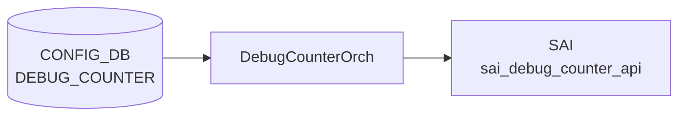

# DEBUG_COUNTER テーブル

## 概要

[SAI](../../reference/glossary.md#term-sai) debug counter（パケットドロップ要因別の汎用カウンタ）を [CONFIG_DB](../../reference/glossary.md#term-config_db) から定義するテーブル[^1]。`debugcounterorch` ([orchagent](../../reference/glossary.md#term-orchagent)) が消費し、SAI debug counter オブジェクトを作成する。各カウンタには別テーブル `DEBUG_COUNTER_DROP_REASON` でドロップ理由 (`L3_ANY`、`SMAC_EQUALS_DMAC` 等) が紐付く。

<!-- cdb-mermaid -->
### データフロー (自動生成)



!!! note "凡例"
    CONFIG_DB から SAI までの典型経路を `docs/reference/config-db-orch-map.md` から機械生成したミニ図。詳細・例外は本ページ本文と対応表を参照。
<!-- /cdb-mermaid -->

## key 構造

```
DEBUG_COUNTER|<name>
DEBUG_COUNTER_DROP_REASON|<name>|<reason>
DEBUG_DROP_MONITOR|CONFIG          # global setting (container)
```

## フィールド (`DEBUG_COUNTER_LIST`)

| フィールド | 型 | 既定値 | 説明 |
|-----------|----|--------|------|
| `name` | string | - | カウンタ識別名（key） |
| `alias` | string | - | カウンタ別名 |
| `desc` | string | - | カウンタ説明 |
| `group` | string | - | グルーピング名 |
| `drop_monitor_status` | `stypes:admin_mode` | `disabled` | ドロップモニタ機能の有効化 |
| `window` | uint64 (sec) | `900` | モニタ時間窓の長さ（秒） |
| `incident_count_threshold` | uint64 | `3` | syslog を発火させるインシデント数閾値 |
| `drop_count_threshold` | uint64 | `100` | インシデント判定するドロップ数閾値 |
| `type` | `stypes:debug_counter_type` | - (mandatory) | スコープ／方向: `PORT_INGRESS_DROPS` / `PORT_EGRESS_DROPS` / `SWITCH_INGRESS_DROPS` / `SWITCH_EGRESS_DROPS` 等 |

## 派生テーブル

- `DEBUG_COUNTER_DROP_REASON_LIST` (key: `name reason`)
  - `name`: 親 `DEBUG_COUNTER_LIST.name` 存在チェック付き (`must` 制約)
  - `reason`: `stypes:counter_drop_reason` 列挙（SAI のドロップ理由一覧）
- `DEBUG_DROP_MONITOR/CONFIG/status`: 永続的ドロップ監視機能のグローバル ON/OFF（admin_mode、既定 `disabled`）

## 制約

- `type` は **mandatory**（[YANG](../../reference/glossary.md#term-yang) `mandatory true`）
- `DEBUG_COUNTER_DROP_REASON.name` は親 `DEBUG_COUNTER_LIST.name` に存在することが必須

## 購読者

- `debugcounterorch` (orchagent): SAI debug counter (sai_debug_counter) を作成し、ドロップ理由のセットを反映

## 関連 CONFIG_DB / YANG / CLI

- 関連 CONFIG_DB: `COUNTERS_DEBUG_NAME_MAP` ([COUNTERS_DB](../../reference/glossary.md#term-counters_db) 側)
- 関連 YANG: `sonic-debug-counter`
- 関連 CLI: `config debug counter` / `show debug counter` 系

<!-- ref-triangle:start -->

## 関連リファレンス

- YANG: [`sonic-debug-counter`](../yang/sonic-debug-counter.md)
- CLI: `config debug counter` / `show debug counter`

<!-- ref-triangle:end -->

## 引用元

[^1]: YANG 定義: `sonic-debug-counter.yang`. <https://github.com/sonic-net/sonic-buildimage/blob/9ea932ec2e18f35e58268ec2e4456b1d4afd65cd/src/sonic-yang-models/yang-models/sonic-debug-counter.yang>

<!-- ops-hint -->
## 運用ヒント

### 典型値

- key 形式: `DEBUG_COUNTER|<name>`。
- `type`: `PORT_INGRESS_DROPS` / `PORT_EGRESS_DROPS` / `SWITCH_INGRESS_DROPS` 等。`reasons`: drop reason の CSV。

### よくある誤設定

- プラットフォーム SAI が未対応の reason を指定すると CrmOrch がエラーを出してカウンタが作られない。

### 確認コマンド

```bash
sonic-db-cli CONFIG_DB keys 'DEBUG_COUNTER|*'
show dropcounters configuration
```
<!-- /ops-hint -->

<!-- glossary-links-injected: 447a5e337bb2 -->
