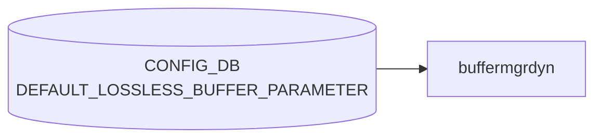

# DEFAULT_LOSSLESS_BUFFER_PARAMETER テーブル

## 概要

Dynamic buffer manager が**動的に生成するロスレスバッファプロファイル**の既定パラメータを定義するテーブル[^1]。
共有ヘッドルームプール (shared headroom pool, SHP) を含む lossless buffer プロファイル生成の入力。

`buffermgrd`（`docker-swss`）の dynamic-buffer モードでのみ参照され、static-buffer モードでは無視される。

<!-- cdb-mermaid -->
### データフロー (自動生成)



!!! note "凡例"
    CONFIG_DB から SAI までの典型経路を `docs/reference/config-db-orch-map.md` から機械生成したミニ図。詳細・例外は本ページ本文と対応表を参照。
<!-- /cdb-mermaid -->

## key 構造

```text
DEFAULT_LOSSLESS_BUFFER_PARAMETER|<name>
```

`<name>`: 1–32 文字、`[a-zA-Z0-9]([-a-zA-Z0-9_]{0,31})`。通常は `AZURE` 等の単一エントリのみ。

## フィールド

| フィールド | 型 | 必須 | 説明 |
|-----------|----|----|------|
| `default_dynamic_th` | int8 (range -8..7) | yes | 動的生成される lossless `BUFFER_PROFILE` で既定の `dynamic_th` 値 |
| `over_subscribe_ratio` | uint16 | no | shared headroom pool のオーバーサブスクライブ比 (1 で 1:1)。0/未設定で SHP 無効 |

<!-- cdb-exceptions -->
## 例外条件・特殊挙動

- **ingress lossless pool 未設定 → retry**: `INGRESS_LOSSLESS_PG_POOL_NAME` が `m_bufferPoolLookup` に未登録の場合 `SWSS_LOG_INFO("%s has not been configured, need to retry")` → `task_need_retry`。プール設定到着後に再処理される。<!-- evidence: buffermgrdyn.cpp L1987-1991 handleDefaultLossLessBufferParam -->
- **DEL コマンド → over_subscribe_ratio をクリアして SHP 再計算**: DEL が来ると `over_subscribe_ratio = ""` にリセットされ Shared Headroom Pool (SHP) が再計算される。<!-- evidence: buffermgrdyn.cpp L2007-2009 -->
- **SET / DEL 以外のコマンド → task_failed**: `SWSS_LOG_ERROR("Unsupported command %s received for DEFAULT_LOSSLESS_BUFFER_PARAMETER table")` → `task_failed`。<!-- evidence: buffermgrdyn.cpp L2011-2013 -->
- **over_subscribe_ratio 変更時 SHP が SAI 未反映 → retry**: `over_subscribe_ratio` が 0→非0 に変わるタイミングで、SAI への xoff 設定が未完了の場合 `isSharedHeadroomPoolEnabledInSai()` が false → `task_need_retry`。<!-- evidence: buffermgrdyn.cpp L2025-2031 -->
- **static buffer モードでは完全に無視**: `buffermgrd` (static モード) はこのテーブルを subscribe しない。テーブルを書いても効果なし。<!-- evidence: buffermgrd.cpp にサブスクライブなし -->

<!-- value-behavior -->
## 値依存挙動マトリクス

このテーブルに enum フィールドはない。ただし数値範囲・ゼロ値によって挙動が大きく変わる。

| フィールド | 値 | 挙動 |
|-----------|-----|------|
| `default_dynamic_th` | `-8..7` の整数 | alpha = 2^(dynamic_th)。`buffermgrdyn` が dynamic lossless `BUFFER_PROFILE` を自動生成する際の既定 threshold。値が大きいほど shared buffer をより多く使用（例: `-3` = alpha 1/8（保守的）、`0` = alpha 1、`3` = alpha 8（積極的））。個別 `BUFFER_PROFILE.dynamic_th` の設定がある場合はそちらが優先。 |
| `default_dynamic_th` | 範囲外（`< -8` または `> 7`） | YANG validator が拒否。 |
| `over_subscribe_ratio` | `0` または未設定 | Shared Headroom Pool (SHP) を無効化。ロスレスバッファのヘッドルームはポート単位で独立して予約される。 |
| `over_subscribe_ratio` | `1` 以上 | SHP を有効化。`buffermgrdyn` が `BUFFER_POOL.xoff`（SHP サイズ）を参照してプロファイルを生成。`BUFFER_POOL.xoff` が未設定の場合、SAI への反映で retry ループが発生する（`buffermgrdyn.cpp:2025-2031`）。 |
<!-- /value-behavior -->

## 購読者

- `buffermgrd`（dynamic buffer モード）。Jinja テンプレート (`docker-swss/buffer_template.j2` 系) と `BUFFER_PROFILE` 生成で参照

## 制約

- range `[-8, 7]` を超える `default_dynamic_th` は [YANG](../../reference/glossary.md#term-yang) validator で拒否
- `over_subscribe_ratio > 0` のとき `BUFFER_POOL` の `xoff` (shared headroom pool size) を別途設定する必要がある

## 関連 CONFIG_DB / YANG / CLI

- 関連 [CONFIG_DB](../../reference/glossary.md#term-config_db): `BUFFER_POOL`, `BUFFER_PROFILE`, `LOSSLESS_TRAFFIC_PATTERN`, `BUFFER_PG`
- 関連 [YANG](../../reference/glossary.md#term-yang): `sonic-default-lossless-buffer-parameter`

<!-- ref-triangle:start -->

## 関連リファレンス

- [YANG](../../reference/glossary.md#term-yang): `sonic-default-lossless-buffer-parameter`

<!-- ref-triangle:end -->

## 引用元

[^1]: YANG 定義: `sonic-default-lossless-buffer-parameter.yang`. <https://github.com/sonic-net/sonic-buildimage/blob/9ea932ec2e18f35e58268ec2e4456b1d4afd65cd/src/sonic-yang-models/yang-models/sonic-default-lossless-buffer-parameter.yang>

## 関連ページ
- [CONFIG_DB: BUFFER_PROFILE](buffer-profile.md)
- [CONFIG_DB: BUFFER_POOL](buffer-pool.md)
- [CONFIG_DB: LOSSLESS_TRAFFIC_PATTERN](lossless-traffic-pattern.md)

<!-- ops-hint -->
## 運用ヒント

### 典型値

- key: `DEFAULT_LOSSLESS_BUFFER_PARAMETER|AZURE` (単一エントリ)。
- `default_dynamic_th`: 通常 `0` (alpha=1)。`-3..3` の範囲で運用。
- `over_subscribe_ratio`: SHP 利用時は `2` 等、無効は未設定。

### よくある誤設定

- `over_subscribe_ratio > 0` に設定したが、`BUFFER_POOL` 側の `xoff` (SHP サイズ) を設定せず動的計算が破綻する。
- static-buffer モードのスイッチに設定しても無視され、設定が効いていないように見える。

### 確認コマンド

```bash
sonic-db-cli CONFIG_DB hgetall 'DEFAULT_LOSSLESS_BUFFER_PARAMETER|AZURE'
sonic-db-cli CONFIG_DB hget 'DEVICE_METADATA|localhost' buffer_model
show buffer profile
```
<!-- /ops-hint -->

<!-- entry-points -->
## 書き込み入り口 (Direction A)

対象テーブル: `DEFAULT_LOSSLESS_BUFFER_PARAMETER`

### CLI
- なし (CLI 書き込みパスなし)

### minigraph / sonic-cfggen
- なし

### REST / gNMI (sonic-mgmt-common)
- なし (対応 OpenConfig/SONiC YANG transformer なし)

### db_migrator
- なし

### ビルド時デフォルト (init_cfg / j2 テンプレート)
- `buffers_config.j2` がプラットフォーム別 `default_lossless_buffer_parameter` 値を生成。通常は手動変更不可

### ハードコードデフォルト
- Dynamic buffer モデルの `sonic_platform_thrift` または `buffermgrd` が速度ごとのデフォルト値をハードコードして設定

### ランタイム注入 (デーモン自動書き込み)
- なし
<!-- /entry-points -->

<!-- glossary-links-injected: b5626ca1f0f9 -->
